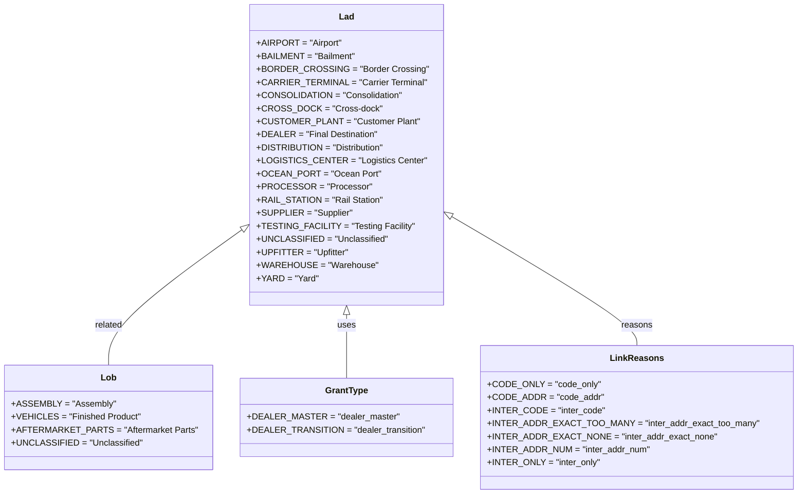

# Diagram: common/fv/python/fv/aws/lambdas/location/constants.py

> Auto-generated by Obscura crawlers

## Mermaid

### SVG

<svg id="container" width="1372.8046875" xmlns="http://www.w3.org/2000/svg" class="classDiagram" height="906" viewBox="0 0 1372.8046875 906" role="graphics-document document" aria-roledescription="class"><g><defs><marker id="container_class-aggregationStart" class="marker aggregation class" refX="18" refY="7" markerWidth="190" markerHeight="240" orient="auto"><path d="M 18,7 L9,13 L1,7 L9,1 Z"></path></marker></defs><defs><marker id="container_class-aggregationEnd" class="marker aggregation class" refX="1" refY="7" markerWidth="20" markerHeight="28" orient="auto"><path d="M 18,7 L9,13 L1,7 L9,1 Z"></path></marker></defs><defs><marker id="container_class-extensionStart" class="marker extension class" refX="18" refY="7" markerWidth="190" markerHeight="240" orient="auto"><path d="M 1,7 L18,13 V 1 Z"></path></marker></defs><defs><marker id="container_class-extensionEnd" class="marker extension class" refX="1" refY="7" markerWidth="20" markerHeight="28" orient="auto"><path d="M 1,1 V 13 L18,7 Z"></path></marker></defs><defs><marker id="container_class-compositionStart" class="marker composition class" refX="18" refY="7" markerWidth="190" markerHeight="240" orient="auto"><path d="M 18,7 L9,13 L1,7 L9,1 Z"></path></marker></defs><defs><marker id="container_class-compositionEnd" class="marker composition class" refX="1" refY="7" markerWidth="20" markerHeight="28" orient="auto"><path d="M 18,7 L9,13 L1,7 L9,1 Z"></path></marker></defs><defs><marker id="container_class-dependencyStart" class="marker dependency class" refX="6" refY="7" markerWidth="190" markerHeight="240" orient="auto"><path d="M 5,7 L9,13 L1,7 L9,1 Z"></path></marker></defs><defs><marker id="container_class-dependencyEnd" class="marker dependency class" refX="13" refY="7" markerWidth="20" markerHeight="28" orient="auto"><path d="M 18,7 L9,13 L14,7 L9,1 Z"></path></marker></defs><defs><marker id="container_class-lollipopStart" class="marker lollipop class" refX="13" refY="7" markerWidth="190" markerHeight="240" orient="auto"><circle stroke="black" fill="transparent" cx="7" cy="7" r="6"></circle></marker></defs><defs><marker id="container_class-lollipopEnd" class="marker lollipop class" refX="1" refY="7" markerWidth="190" markerHeight="240" orient="auto"><circle stroke="black" fill="transparent" cx="7" cy="7" r="6"></circle></marker></defs><g class="root"><g class="clusters"></g><g class="edgePaths"><path d="M416.76,420.194L378.029,449.661C339.298,479.129,261.837,538.065,223.106,579.699C184.375,621.333,184.375,645.667,184.375,657.833L184.375,670" id="id_Lad_Lob_1" class="edge-thickness-normal edge-pattern-solid relation" style=";;;" data-edge="true" data-et="edge" data-id="id_Lad_Lob_1" data-points="W3sieCI6NDMwLjQ4ODI4MTI1LCJ5Ijo0MDkuNzQ4NjMyNjg2MzkxNDN9LHsieCI6MTg0LjM3NSwieSI6NTk3fSx7IngiOjE4NC4zNzUsInkiOjY3MH1d" marker-start="url(#container_class-extensionStart)"></path><path d="M595.766,577.25L595.766,580.542C595.766,583.833,595.766,590.417,595.766,609.875C595.766,629.333,595.766,661.667,595.766,677.833L595.766,694" id="id_Lad_GrantType_2" class="edge-thickness-normal edge-pattern-solid relation" style=";;;" data-edge="true" data-et="edge" data-id="id_Lad_GrantType_2" data-points="W3sieCI6NTk1Ljc2NTYyNSwieSI6NTYwfSx7IngiOjU5NS43NjU2MjUsInkiOjU5N30seyJ4Ijo1OTUuNzY1NjI1LCJ5Ijo2OTR9XQ==" marker-start="url(#container_class-extensionStart)"></path><path d="M775.681,396.172L829.366,429.643C883.052,463.115,990.422,530.057,1044.108,569.695C1097.793,609.333,1097.793,621.667,1097.793,627.833L1097.793,634" id="id_Lad_LinkReasons_3" class="edge-thickness-normal edge-pattern-solid relation" style=";;;" data-edge="true" data-et="edge" data-id="id_Lad_LinkReasons_3" data-points="W3sieCI6NzYxLjA0Mjk2ODc1LCJ5IjozODcuMDQ1Nzk4Njc1NjgyMn0seyJ4IjoxMDk3Ljc5Mjk2ODc1LCJ5Ijo1OTd9LHsieCI6MTA5Ny43OTI5Njg3NSwieSI6NjM0fV0=" marker-start="url(#container_class-extensionStart)"></path></g><g class="edgeLabels"><g class="edgeLabel" transform="translate(184.375, 597)"><g class="label" data-id="id_Lad_Lob_1" transform="translate(-25.78125, -12)"><foreignObject width="51.5625" height="24">

related

</foreignObject></g></g><g class="edgeLabel" transform="translate(595.765625, 597)"><g class="label" data-id="id_Lad_GrantType_2" transform="translate(-16.4921875, -12)"><foreignObject width="32.984375" height="24">

uses

</foreignObject></g></g><g class="edgeLabel" transform="translate(1097.79296875, 597)"><g class="label" data-id="id_Lad_LinkReasons_3" transform="translate(-28.234375, -12)"><foreignObject width="56.46875" height="24">

reasons

</foreignObject></g></g></g><g class="nodes"><g class="node default" id="classId-Lad-0" transform="translate(595.765625, 284)"><g class="basic label-container"><path d="M-165.27734375 -276 L165.27734375 -276 L165.27734375 276 L-165.27734375 276" stroke="none" stroke-width="0" fill="#ECECFF" style=""></path><path d="M-165.27734375 -276 C-60.35444673089371 -276, 44.568450288212574 -276, 165.27734375 -276 M-165.27734375 -276 C-79.49518923810095 -276, 6.286965273798103 -276, 165.27734375 -276 M165.27734375 -276 C165.27734375 -66.62559115089493, 165.27734375 142.74881769821013, 165.27734375 276 M165.27734375 -276 C165.27734375 -137.92622733140865, 165.27734375 0.14754533718269158, 165.27734375 276 M165.27734375 276 C38.52493440528853 276, -88.22747493942293 276, -165.27734375 276 M165.27734375 276 C66.73291539187314 276, -31.81151296625373 276, -165.27734375 276 M-165.27734375 276 C-165.27734375 56.396761284778194, -165.27734375 -163.2064774304436, -165.27734375 -276 M-165.27734375 276 C-165.27734375 150.13639452677887, -165.27734375 24.272789053557716, -165.27734375 -276" stroke="#9370DB" stroke-width="1.3" fill="none" stroke-dasharray="0 0" style=""></path></g><g class="annotation-group text" transform="translate(0, -252)"></g><g class="label-group text" transform="translate(-13.2109375, -252)"><g class="label" style="font-weight: bolder" transform="translate(0,-12)"><foreignObject width="26.421875" height="24">

Lad

</foreignObject></g></g><g class="members-group text" transform="translate(-153.27734375, -204)"><g class="label" style="" transform="translate(0,-12)"><foreignObject width="148.578125" height="24">

+AIRPORT = "Airport"

</foreignObject></g><g class="label" style="" transform="translate(0,12)"><foreignObject width="173.765625" height="24">

+BAILMENT = "Bailment"

</foreignObject></g><g class="label" style="" transform="translate(0,36)"><foreignObject width="290.734375" height="24">

+BORDER_CROSSING = "Border Crossing"

</foreignObject></g><g class="label" style="" transform="translate(0,60)"><foreignObject width="293.34375" height="24">

+CARRIER_TERMINAL = "Carrier Terminal"

</foreignObject></g><g class="label" style="" transform="translate(0,84)"><foreignObject width="254.359375" height="24">

+CONSOLIDATION = "Consolidation"

</foreignObject></g><g class="label" style="" transform="translate(0,108)"><foreignObject width="211.234375" height="24">

+CROSS_DOCK = "Cross-dock"

</foreignObject></g><g class="label" style="" transform="translate(0,132)"><foreignObject width="278.765625" height="24">

+CUSTOMER_PLANT = "Customer Plant"

</foreignObject></g><g class="label" style="" transform="translate(0,156)"><foreignObject width="213.84375" height="24">

+DEALER = "Final Destination"

</foreignObject></g><g class="label" style="" transform="translate(0,180)"><foreignObject width="225.03125" height="24">

+DISTRIBUTION = "Distribution"

</foreignObject></g><g class="label" style="" transform="translate(0,204)"><foreignObject width="285.515625" height="24">

+LOGISTICS_CENTER = "Logistics Center"

</foreignObject></g><g class="label" style="" transform="translate(0,228)"><foreignObject width="211.40625" height="24">

+OCEAN_PORT = "Ocean Port"

</foreignObject></g><g class="label" style="" transform="translate(0,252)"><foreignObject width="192.9375" height="24">

+PROCESSOR = "Processor"

</foreignObject></g><g class="label" style="" transform="translate(0,276)"><foreignObject width="219.578125" height="24">

+RAIL_STATION = "Rail Station"

</foreignObject></g><g class="label" style="" transform="translate(0,300)"><foreignObject width="166.625" height="24">

+SUPPLIER = "Supplier"

</foreignObject></g><g class="label" style="" transform="translate(0,324)"><foreignObject width="269.8125" height="24">

+TESTING_FACILITY = "Testing Facility"

</foreignObject></g><g class="label" style="" transform="translate(0,348)"><foreignObject width="225.8125" height="24">

+UNCLASSIFIED = "Unclassified"

</foreignObject></g><g class="label" style="" transform="translate(0,372)"><foreignObject width="160.0625" height="24">

+UPFITTER = "Upfitter"

</foreignObject></g><g class="label" style="" transform="translate(0,396)"><foreignObject width="207.5" height="24">

+WAREHOUSE = "Warehouse"

</foreignObject></g><g class="label" style="" transform="translate(0,420)"><foreignObject width="105.203125" height="24">

+YARD = "Yard"

</foreignObject></g></g><g class="methods-group text" transform="translate(-153.27734375, 276)"></g><g class="divider" style=""><path d="M-165.27734375 -228 C-98.23499584393265 -228, -31.192647937865303 -228, 165.27734375 -228 M-165.27734375 -228 C-83.65783416606526 -228, -2.038324582130514 -228, 165.27734375 -228" stroke="#9370DB" stroke-width="1.3" fill="none" stroke-dasharray="0 0" style=""></path></g><g class="divider" style=""><path d="M-165.27734375 252 C-80.3999605272383 252, 4.477422695523387 252, 165.27734375 252 M-165.27734375 252 C-81.0280332930404 252, 3.2212771639192113 252, 165.27734375 252" stroke="#9370DB" stroke-width="1.3" fill="none" stroke-dasharray="0 0" style=""></path></g></g><g class="node default" id="classId-Lob-1" transform="translate(184.375, 766)"><g class="basic label-container"><path d="M-176.375 -96 L176.375 -96 L176.375 96 L-176.375 96" stroke="none" stroke-width="0" fill="#ECECFF" style=""></path><path d="M-176.375 -96 C-84.69100690757742 -96, 6.992986184845165 -96, 176.375 -96 M-176.375 -96 C-92.01706959403838 -96, -7.65913918807675 -96, 176.375 -96 M176.375 -96 C176.375 -44.980865077774894, 176.375 6.0382698444502125, 176.375 96 M176.375 -96 C176.375 -35.01654549284105, 176.375 25.966909014317906, 176.375 96 M176.375 96 C59.94025354443761 96, -56.49449291112478 96, -176.375 96 M176.375 96 C45.45616923758135 96, -85.4626615248373 96, -176.375 96 M-176.375 96 C-176.375 44.91157505715774, -176.375 -6.176849885684518, -176.375 -96 M-176.375 96 C-176.375 24.404388599996096, -176.375 -47.19122280000781, -176.375 -96" stroke="#9370DB" stroke-width="1.3" fill="none" stroke-dasharray="0 0" style=""></path></g><g class="annotation-group text" transform="translate(0, -72)"></g><g class="label-group text" transform="translate(-13.359375, -72)"><g class="label" style="font-weight: bolder" transform="translate(0,-12)"><foreignObject width="26.71875" height="24">

Lob

</foreignObject></g></g><g class="members-group text" transform="translate(-164.375, -24)"><g class="label" style="" transform="translate(0,-12)"><foreignObject width="177.375" height="24">

+ASSEMBLY = "Assembly"

</foreignObject></g><g class="label" style="" transform="translate(0,12)"><foreignObject width="225.09375" height="24">

+VEHICLES = "Finished Product"

</foreignObject></g><g class="label" style="" transform="translate(0,36)"><foreignObject width="315.390625" height="24">

+AFTERMARKET_PARTS = "Aftermarket Parts"

</foreignObject></g><g class="label" style="" transform="translate(0,60)"><foreignObject width="225.8125" height="24">

+UNCLASSIFIED = "Unclassified"

</foreignObject></g></g><g class="methods-group text" transform="translate(-164.375, 96)"></g><g class="divider" style=""><path d="M-176.375 -48 C-76.49684902633187 -48, 23.381301947336254 -48, 176.375 -48 M-176.375 -48 C-64.38131314829859 -48, 47.612373703402824 -48, 176.375 -48" stroke="#9370DB" stroke-width="1.3" fill="none" stroke-dasharray="0 0" style=""></path></g><g class="divider" style=""><path d="M-176.375 72 C-67.5481105989839 72, 41.27877880203221 72, 176.375 72 M-176.375 72 C-64.25637493920064 72, 47.86225012159872 72, 176.375 72" stroke="#9370DB" stroke-width="1.3" fill="none" stroke-dasharray="0 0" style=""></path></g></g><g class="node default" id="classId-GrantType-2" transform="translate(595.765625, 766)"><g class="basic label-container"><path d="M-185.015625 -72 L185.015625 -72 L185.015625 72 L-185.015625 72" stroke="none" stroke-width="0" fill="#ECECFF" style=""></path><path d="M-185.015625 -72 C-64.1504998103801 -72, 56.714625379239806 -72, 185.015625 -72 M-185.015625 -72 C-53.80573233436377 -72, 77.40416033127246 -72, 185.015625 -72 M185.015625 -72 C185.015625 -31.20101309462502, 185.015625 9.597973810749963, 185.015625 72 M185.015625 -72 C185.015625 -20.480925626998477, 185.015625 31.038148746003046, 185.015625 72 M185.015625 72 C96.69049327512914 72, 8.365361550258285 72, -185.015625 72 M185.015625 72 C100.14294384311343 72, 15.270262686226857 72, -185.015625 72 M-185.015625 72 C-185.015625 16.144631463140904, -185.015625 -39.71073707371819, -185.015625 -72 M-185.015625 72 C-185.015625 26.41174885545177, -185.015625 -19.17650228909646, -185.015625 -72" stroke="#9370DB" stroke-width="1.3" fill="none" stroke-dasharray="0 0" style=""></path></g><g class="annotation-group text" transform="translate(0, -48)"></g><g class="label-group text" transform="translate(-37.515625, -48)"><g class="label" style="font-weight: bolder" transform="translate(0,-12)"><foreignObject width="75.03125" height="24">

GrantType

</foreignObject></g></g><g class="members-group text" transform="translate(-173.015625, 0)"><g class="label" style="" transform="translate(0,-12)"><foreignObject width="259.578125" height="24">

+DEALER_MASTER = "dealer_master"

</foreignObject></g><g class="label" style="" transform="translate(0,12)"><foreignObject width="308.515625" height="24">

+DEALER_TRANSITION = "dealer_transition"

</foreignObject></g></g><g class="methods-group text" transform="translate(-173.015625, 72)"></g><g class="divider" style=""><path d="M-185.015625 -24 C-110.76552084099667 -24, -36.515416681993344 -24, 185.015625 -24 M-185.015625 -24 C-101.27678970789148 -24, -17.537954415782963 -24, 185.015625 -24" stroke="#9370DB" stroke-width="1.3" fill="none" stroke-dasharray="0 0" style=""></path></g><g class="divider" style=""><path d="M-185.015625 48 C-87.18864537815904 48, 10.638334243681925 48, 185.015625 48 M-185.015625 48 C-59.44431416602961 48, 66.12699666794077 48, 185.015625 48" stroke="#9370DB" stroke-width="1.3" fill="none" stroke-dasharray="0 0" style=""></path></g></g><g class="node default" id="classId-LinkReasons-3" transform="translate(1097.79296875, 766)"><g class="basic label-container"><path d="M-267.01171875 -132 L267.01171875 -132 L267.01171875 132 L-267.01171875 132" stroke="none" stroke-width="0" fill="#ECECFF" style=""></path><path d="M-267.01171875 -132 C-102.96402725223803 -132, 61.08366424552395 -132, 267.01171875 -132 M-267.01171875 -132 C-140.89763396477815 -132, -14.783549179556275 -132, 267.01171875 -132 M267.01171875 -132 C267.01171875 -54.274489278356455, 267.01171875 23.45102144328709, 267.01171875 132 M267.01171875 -132 C267.01171875 -37.27998053789304, 267.01171875 57.44003892421392, 267.01171875 132 M267.01171875 132 C154.19756421231054 132, 41.38340967462108 132, -267.01171875 132 M267.01171875 132 C131.20362057726584 132, -4.604477595468325 132, -267.01171875 132 M-267.01171875 132 C-267.01171875 70.61987449805224, -267.01171875 9.239748996104481, -267.01171875 -132 M-267.01171875 132 C-267.01171875 59.36149564771496, -267.01171875 -13.277008704570079, -267.01171875 -132" stroke="#9370DB" stroke-width="1.3" fill="none" stroke-dasharray="0 0" style=""></path></g><g class="annotation-group text" transform="translate(0, -108)"></g><g class="label-group text" transform="translate(-45.8671875, -108)"><g class="label" style="font-weight: bolder" transform="translate(0,-12)"><foreignObject width="91.734375" height="24">

LinkReasons

</foreignObject></g></g><g class="members-group text" transform="translate(-255.01171875, -60)"><g class="label" style="" transform="translate(0,-12)"><foreignObject width="194.421875" height="24">

+CODE_ONLY = "code_only"

</foreignObject></g><g class="label" style="" transform="translate(0,12)"><foreignObject width="200.15625" height="24">

+CODE_ADDR = "code_addr"

</foreignObject></g><g class="label" style="" transform="translate(0,36)"><foreignObject width="201.5" height="24">

+INTER_CODE = "inter_code"

</foreignObject></g><g class="label" style="" transform="translate(0,60)"><foreignObject width="464.15625" height="24">

+INTER_ADDR_EXACT_TOO_MANY = "inter_addr_exact_too_many"

</foreignObject></g><g class="label" style="" transform="translate(0,84)"><foreignObject width="392.765625" height="24">

+INTER_ADDR_EXACT_NONE = "inter_addr_exact_none"

</foreignObject></g><g class="label" style="" transform="translate(0,108)"><foreignObject width="283.796875" height="24">

+INTER_ADDR_NUM = "inter_addr_num"

</foreignObject></g><g class="label" style="" transform="translate(0,132)"><foreignObject width="196.5625" height="24">

+INTER_ONLY = "inter_only"

</foreignObject></g></g><g class="methods-group text" transform="translate(-255.01171875, 132)"></g><g class="divider" style=""><path d="M-267.01171875 -84 C-89.56103546069687 -84, 87.88964782860626 -84, 267.01171875 -84 M-267.01171875 -84 C-64.33110855750712 -84, 138.34950163498576 -84, 267.01171875 -84" stroke="#9370DB" stroke-width="1.3" fill="none" stroke-dasharray="0 0" style=""></path></g><g class="divider" style=""><path d="M-267.01171875 108 C-103.62235399332585 108, 59.76701076334831 108, 267.01171875 108 M-267.01171875 108 C-92.40844545978902 108, 82.19482783042196 108, 267.01171875 108" stroke="#9370DB" stroke-width="1.3" fill="none" stroke-dasharray="0 0" style=""></path></g></g></g></g></g></svg>
