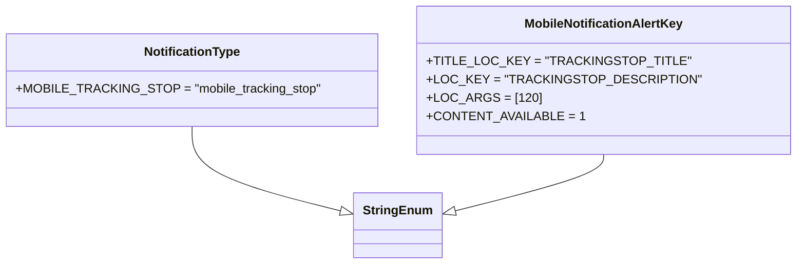
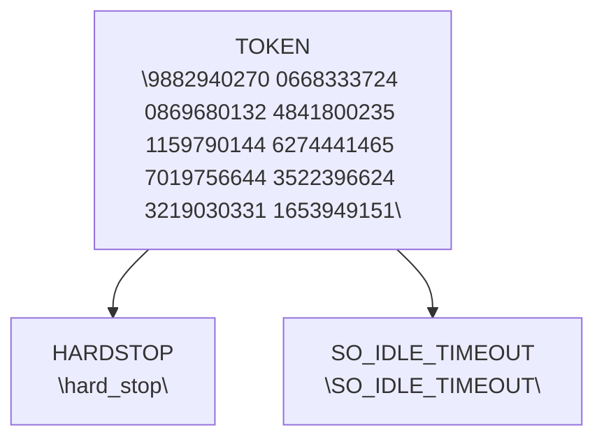

# Diagram: common/fv/python/fv/aws/lambdas/mobile/constants.py

> Auto-generated by Obscura crawlers

## Diagram 1

### SVG

<svg id="container" width="952.59375" xmlns="http://www.w3.org/2000/svg" class="classDiagram" height="342" viewBox="0 0 952.59375 342" role="graphics-document document" aria-roledescription="class"><g><defs><marker id="container_class-aggregationStart" class="marker aggregation class" refX="18" refY="7" markerWidth="190" markerHeight="240" orient="auto"><path d="M 18,7 L9,13 L1,7 L9,1 Z"></path></marker></defs><defs><marker id="container_class-aggregationEnd" class="marker aggregation class" refX="1" refY="7" markerWidth="20" markerHeight="28" orient="auto"><path d="M 18,7 L9,13 L1,7 L9,1 Z"></path></marker></defs><defs><marker id="container_class-extensionStart" class="marker extension class" refX="18" refY="7" markerWidth="190" markerHeight="240" orient="auto"><path d="M 1,7 L18,13 V 1 Z"></path></marker></defs><defs><marker id="container_class-extensionEnd" class="marker extension class" refX="1" refY="7" markerWidth="20" markerHeight="28" orient="auto"><path d="M 1,1 V 13 L18,7 Z"></path></marker></defs><defs><marker id="container_class-compositionStart" class="marker composition class" refX="18" refY="7" markerWidth="190" markerHeight="240" orient="auto"><path d="M 18,7 L9,13 L1,7 L9,1 Z"></path></marker></defs><defs><marker id="container_class-compositionEnd" class="marker composition class" refX="1" refY="7" markerWidth="20" markerHeight="28" orient="auto"><path d="M 18,7 L9,13 L1,7 L9,1 Z"></path></marker></defs><defs><marker id="container_class-dependencyStart" class="marker dependency class" refX="6" refY="7" markerWidth="190" markerHeight="240" orient="auto"><path d="M 5,7 L9,13 L1,7 L9,1 Z"></path></marker></defs><defs><marker id="container_class-dependencyEnd" class="marker dependency class" refX="13" refY="7" markerWidth="20" markerHeight="28" orient="auto"><path d="M 18,7 L9,13 L14,7 L9,1 Z"></path></marker></defs><defs><marker id="container_class-lollipopStart" class="marker lollipop class" refX="13" refY="7" markerWidth="190" markerHeight="240" orient="auto"><circle stroke="black" fill="transparent" cx="7" cy="7" r="6"></circle></marker></defs><defs><marker id="container_class-lollipopEnd" class="marker lollipop class" refX="1" refY="7" markerWidth="190" markerHeight="240" orient="auto"><circle stroke="black" fill="transparent" cx="7" cy="7" r="6"></circle></marker></defs><g class="root"><g class="clusters"></g><g class="edgePaths"><path d="M235.578,164L235.578,174.167C235.578,184.333,235.578,204.667,264.873,222.791C294.167,240.915,352.756,256.83,382.051,264.788L411.345,272.746" id="id_NotificationType_StringEnum_1" class="edge-thickness-normal edge-pattern-solid relation" style=";;;" data-edge="true" data-et="edge" data-id="id_NotificationType_StringEnum_1" data-points="W3sieCI6MjM1LjU3ODEyNSwieSI6MTY0fSx7IngiOjIzNS41NzgxMjUsInkiOjIyNX0seyJ4Ijo0MjcuOTkyMTg3NSwieSI6Mjc3LjI2NzY4MjM2NjcyODkzfV0=" marker-end="url(#container_class-extensionEnd)"></path><path d="M728.875,200L728.875,204.167C728.875,208.333,728.875,216.667,699.58,228.791C670.286,240.915,611.697,256.83,582.402,264.788L553.108,272.746" id="id_MobileNotificationAlertKey_StringEnum_2" class="edge-thickness-normal edge-pattern-solid relation" style=";;;" data-edge="true" data-et="edge" data-id="id_MobileNotificationAlertKey_StringEnum_2" data-points="W3sieCI6NzI4Ljg3NSwieSI6MjAwfSx7IngiOjcyOC44NzUsInkiOjIyNX0seyJ4Ijo1MzYuNDYwOTM3NSwieSI6Mjc3LjI2NzY4MjM2NjcyODkzfV0=" marker-end="url(#container_class-extensionEnd)"></path></g><g class="edgeLabels"><g class="edgeLabel"><g class="label" data-id="id_NotificationType_StringEnum_1" transform="translate(0, 0)"><foreignObject width="0" height="0">

</foreignObject></g></g><g class="edgeLabel"><g class="label" data-id="id_MobileNotificationAlertKey_StringEnum_2" transform="translate(0, 0)"><foreignObject width="0" height="0">

</foreignObject></g></g></g><g class="nodes"><g class="node default" id="classId-StringEnum-0" transform="translate(482.2265625, 292)"><g class="basic label-container"><path d="M-54.234375 -42 L54.234375 -42 L54.234375 42 L-54.234375 42" stroke="none" stroke-width="0" fill="#ECECFF" style=""></path><path d="M-54.234375 -42 C-14.812274964589314 -42, 24.609825070821373 -42, 54.234375 -42 M-54.234375 -42 C-16.084679277529126 -42, 22.065016444941747 -42, 54.234375 -42 M54.234375 -42 C54.234375 -17.544232911785073, 54.234375 6.9115341764298535, 54.234375 42 M54.234375 -42 C54.234375 -10.16848915367401, 54.234375 21.66302169265198, 54.234375 42 M54.234375 42 C13.74105958826489 42, -26.75225582347022 42, -54.234375 42 M54.234375 42 C15.126446921917697 42, -23.981481156164605 42, -54.234375 42 M-54.234375 42 C-54.234375 22.381409722071453, -54.234375 2.762819444142906, -54.234375 -42 M-54.234375 42 C-54.234375 19.312028705589086, -54.234375 -3.375942588821829, -54.234375 -42" stroke="#9370DB" stroke-width="1.3" fill="none" stroke-dasharray="0 0" style=""></path></g><g class="annotation-group text" transform="translate(0, -18)"></g><g class="label-group text" transform="translate(-42.234375, -18)"><g class="label" style="font-weight: bolder" transform="translate(0,-12)"><foreignObject width="84.46875" height="24">

StringEnum

</foreignObject></g></g><g class="members-group text" transform="translate(-42.234375, 30)"></g><g class="methods-group text" transform="translate(-42.234375, 60)"></g><g class="divider" style=""><path d="M-54.234375 6 C-26.995455066914214 6, 0.24346486617157126 6, 54.234375 6 M-54.234375 6 C-22.454991772751136 6, 9.324391454497729 6, 54.234375 6" stroke="#9370DB" stroke-width="1.3" fill="none" stroke-dasharray="0 0" style=""></path></g><g class="divider" style=""><path d="M-54.234375 24 C-14.856537141341839 24, 24.521300717316322 24, 54.234375 24 M-54.234375 24 C-30.16851099238092 24, -6.10264698476184 24, 54.234375 24" stroke="#9370DB" stroke-width="1.3" fill="none" stroke-dasharray="0 0" style=""></path></g></g><g class="node default" id="classId-NotificationType-1" transform="translate(235.578125, 104)"><g class="basic label-container"><path d="M-227.578125 -60 L227.578125 -60 L227.578125 60 L-227.578125 60" stroke="none" stroke-width="0" fill="#ECECFF" style=""></path><path d="M-227.578125 -60 C-73.95342333910074 -60, 79.67127832179852 -60, 227.578125 -60 M-227.578125 -60 C-103.59484480674722 -60, 20.388435386505563 -60, 227.578125 -60 M227.578125 -60 C227.578125 -13.469171167203058, 227.578125 33.061657665593884, 227.578125 60 M227.578125 -60 C227.578125 -31.8229851506797, 227.578125 -3.645970301359398, 227.578125 60 M227.578125 60 C93.84737230917489 60, -39.88338038165023 60, -227.578125 60 M227.578125 60 C87.76059752275086 60, -52.05692995449829 60, -227.578125 60 M-227.578125 60 C-227.578125 31.93046177492126, -227.578125 3.860923549842518, -227.578125 -60 M-227.578125 60 C-227.578125 24.674522652748983, -227.578125 -10.650954694502033, -227.578125 -60" stroke="#9370DB" stroke-width="1.3" fill="none" stroke-dasharray="0 0" style=""></path></g><g class="annotation-group text" transform="translate(0, -36)"></g><g class="label-group text" transform="translate(-60.21875, -36)"><g class="label" style="font-weight: bolder" transform="translate(0,-12)"><foreignObject width="120.4375" height="24">

NotificationType

</foreignObject></g></g><g class="members-group text" transform="translate(-215.578125, 12)"><g class="label" style="" transform="translate(0,-12)"><foreignObject width="370.9375" height="24">

+MOBILE_TRACKING_STOP = "mobile_tracking_stop"

</foreignObject></g></g><g class="methods-group text" transform="translate(-215.578125, 60)"></g><g class="divider" style=""><path d="M-227.578125 -12 C-131.80393609275376 -12, -36.02974718550749 -12, 227.578125 -12 M-227.578125 -12 C-122.17859968830315 -12, -16.779074376606303 -12, 227.578125 -12" stroke="#9370DB" stroke-width="1.3" fill="none" stroke-dasharray="0 0" style=""></path></g><g class="divider" style=""><path d="M-227.578125 36 C-130.79720998449284 36, -34.01629496898565 36, 227.578125 36 M-227.578125 36 C-86.68314776814259 36, 54.21182946371482 36, 227.578125 36" stroke="#9370DB" stroke-width="1.3" fill="none" stroke-dasharray="0 0" style=""></path></g></g><g class="node default" id="classId-MobileNotificationAlertKey-2" transform="translate(728.875, 104)"><g class="basic label-container"><path d="M-215.71875 -96 L215.71875 -96 L215.71875 96 L-215.71875 96" stroke="none" stroke-width="0" fill="#ECECFF" style=""></path><path d="M-215.71875 -96 C-114.88287972752325 -96, -14.047009455046492 -96, 215.71875 -96 M-215.71875 -96 C-43.695270984546056 -96, 128.3282080309079 -96, 215.71875 -96 M215.71875 -96 C215.71875 -47.42145182157729, 215.71875 1.1570963568454147, 215.71875 96 M215.71875 -96 C215.71875 -32.16958951976184, 215.71875 31.660820960476315, 215.71875 96 M215.71875 96 C112.44792621735597 96, 9.17710243471194 96, -215.71875 96 M215.71875 96 C50.041708561574666 96, -115.63533287685067 96, -215.71875 96 M-215.71875 96 C-215.71875 50.08979769438667, -215.71875 4.179595388773336, -215.71875 -96 M-215.71875 96 C-215.71875 40.54251992641713, -215.71875 -14.914960147165743, -215.71875 -96" stroke="#9370DB" stroke-width="1.3" fill="none" stroke-dasharray="0 0" style=""></path></g><g class="annotation-group text" transform="translate(0, -72)"></g><g class="label-group text" transform="translate(-98.8125, -72)"><g class="label" style="font-weight: bolder" transform="translate(0,-12)"><foreignObject width="197.625" height="24">

MobileNotificationAlertKey

</foreignObject></g></g><g class="members-group text" transform="translate(-203.71875, -24)"><g class="label" style="" transform="translate(0,-12)"><foreignObject width="296.265625" height="24">

+TITLE_LOC_KEY = "TRACKINGSTOP_TITLE"

</foreignObject></g><g class="label" style="" transform="translate(0,12)"><foreignObject width="308.625" height="24">

+LOC_KEY = "TRACKINGSTOP_DESCRIPTION"

</foreignObject></g><g class="label" style="" transform="translate(0,36)"><foreignObject width="131.203125" height="24">

+LOC_ARGS = [120]

</foreignObject></g><g class="label" style="" transform="translate(0,60)"><foreignObject width="180.484375" height="24">

+CONTENT_AVAILABLE = 1

</foreignObject></g></g><g class="methods-group text" transform="translate(-203.71875, 96)"></g><g class="divider" style=""><path d="M-215.71875 -48 C-99.12442661105923 -48, 17.46989677788153 -48, 215.71875 -48 M-215.71875 -48 C-83.50336663386037 -48, 48.71201673227927 -48, 215.71875 -48" stroke="#9370DB" stroke-width="1.3" fill="none" stroke-dasharray="0 0" style=""></path></g><g class="divider" style=""><path d="M-215.71875 72 C-53.76791688139974 72, 108.18291623720052 72, 215.71875 72 M-215.71875 72 C-72.57846270023504 72, 70.56182459952993 72, 215.71875 72" stroke="#9370DB" stroke-width="1.3" fill="none" stroke-dasharray="0 0" style=""></path></g></g></g></g></g></svg>

## Diagram 2

### SVG

<svg id="container" width="661.59375" xmlns="http://www.w3.org/2000/svg" class="flowchart" height="294" viewBox="0 0 661.59375 294" role="graphics-document document" aria-roledescription="flowchart-v2"><g><marker id="container_flowchart-v2-pointEnd" class="marker flowchart-v2" viewBox="0 0 10 10" refX="5" refY="5" markerUnits="userSpaceOnUse" markerWidth="8" markerHeight="8" orient="auto"><path d="M 0 0 L 10 5 L 0 10 z" class="arrowMarkerPath" style="stroke-width: 1; stroke-dasharray: 1, 0;"></path></marker><marker id="container_flowchart-v2-pointStart" class="marker flowchart-v2" viewBox="0 0 10 10" refX="4.5" refY="5" markerUnits="userSpaceOnUse" markerWidth="8" markerHeight="8" orient="auto"><path d="M 0 5 L 10 10 L 10 0 z" class="arrowMarkerPath" style="stroke-width: 1; stroke-dasharray: 1, 0;"></path></marker><marker id="container_flowchart-v2-circleEnd" class="marker flowchart-v2" viewBox="0 0 10 10" refX="11" refY="5" markerUnits="userSpaceOnUse" markerWidth="11" markerHeight="11" orient="auto"><circle cx="5" cy="5" r="5" class="arrowMarkerPath" style="stroke-width: 1; stroke-dasharray: 1, 0;"></circle></marker><marker id="container_flowchart-v2-circleStart" class="marker flowchart-v2" viewBox="0 0 10 10" refX="-1" refY="5" markerUnits="userSpaceOnUse" markerWidth="11" markerHeight="11" orient="auto"><circle cx="5" cy="5" r="5" class="arrowMarkerPath" style="stroke-width: 1; stroke-dasharray: 1, 0;"></circle></marker><marker id="container_flowchart-v2-crossEnd" class="marker cross flowchart-v2" viewBox="0 0 11 11" refX="12" refY="5.2" markerUnits="userSpaceOnUse" markerWidth="11" markerHeight="11" orient="auto"><path d="M 1,1 l 9,9 M 10,1 l -9,9" class="arrowMarkerPath" style="stroke-width: 2; stroke-dasharray: 1, 0;"></path></marker><marker id="container_flowchart-v2-crossStart" class="marker cross flowchart-v2" viewBox="0 0 11 11" refX="-1" refY="5.2" markerUnits="userSpaceOnUse" markerWidth="11" markerHeight="11" orient="auto"><path d="M 1,1 l 9,9 M 10,1 l -9,9" class="arrowMarkerPath" style="stroke-width: 2; stroke-dasharray: 1, 0;"></path></marker><g class="root"><g class="clusters"></g><g class="edgePaths"><path d="M172.992,178.727L165.676,183.439C158.359,188.151,143.727,197.576,136.41,205.788C129.094,214,129.094,221,129.094,224.5L129.094,228" id="L_CONST_TOKEN_CONST_HARDSTOP_0" class="edge-thickness-normal edge-pattern-solid edge-thickness-normal edge-pattern-solid flowchart-link" style=";" data-edge="true" data-et="edge" data-id="L_CONST_TOKEN_CONST_HARDSTOP_0" data-points="W3sieCI6MTcyLjk5MjE4NzUsInkiOjE3OC43MjcwMzE3NjI0MzMxN30seyJ4IjoxMjkuMDkzNzUsInkiOjIwN30seyJ4IjoxMjkuMDkzNzUsInkiOjIzMn1d" marker-end="url(#container_flowchart-v2-pointEnd)"></path><path d="M432.992,178.727L440.309,183.439C447.625,188.151,462.258,197.576,469.574,205.788C476.891,214,476.891,221,476.891,224.5L476.891,228" id="L_CONST_TOKEN_CONST_SO_IDLE_0" class="edge-thickness-normal edge-pattern-solid edge-thickness-normal edge-pattern-solid flowchart-link" style=";" data-edge="true" data-et="edge" data-id="L_CONST_TOKEN_CONST_SO_IDLE_0" data-points="W3sieCI6NDMyLjk5MjE4NzUsInkiOjE3OC43MjcwMzE3NjI0MzMxN30seyJ4Ijo0NzYuODkwNjI1LCJ5IjoyMDd9LHsieCI6NDc2Ljg5MDYyNSwieSI6MjMyfV0=" marker-end="url(#container_flowchart-v2-pointEnd)"></path></g><g class="edgeLabels"><g class="edgeLabel"><g class="label" data-id="L_CONST_TOKEN_CONST_HARDSTOP_0" transform="translate(0, 0)"><foreignObject width="0" height="0">

</foreignObject></g></g><g class="edgeLabel"><g class="label" data-id="L_CONST_TOKEN_CONST_SO_IDLE_0" transform="translate(0, 0)"><foreignObject width="0" height="0">

</foreignObject></g></g></g><g class="nodes"><g class="node default" id="flowchart-CONST_TOKEN-0" transform="translate(302.9921875, 95)"><rect class="basic label-container" style="" x="-130" y="-87" width="260" height="174"></rect><g class="label" style="" transform="translate(-100, -72)"><rect></rect><foreignObject width="200" height="144">

TOKEN\n\9882940270 0668333724 0869680132 4841800235 1159790144 6274441465 7019756644 3522396624 3219030331 1653949151\

</foreignObject></g></g><g class="node default" id="flowchart-CONST_HARDSTOP-1" transform="translate(129.09375, 259)"><rect class="basic label-container" style="" x="-121.09375" y="-27" width="242.1875" height="54"></rect><g class="label" style="" transform="translate(-91.09375, -12)"><rect></rect><foreignObject width="182.1875" height="24">

HARDSTOP\n\hard_stop\

</foreignObject></g></g><g class="node default" id="flowchart-CONST_SO_IDLE-2" transform="translate(476.890625, 259)"><rect class="basic label-container" style="" x="-176.703125" y="-27" width="353.40625" height="54"></rect><g class="label" style="" transform="translate(-146.703125, -12)"><rect></rect><foreignObject width="293.40625" height="24">

SO_IDLE_TIMEOUT\n\SO_IDLE_TIMEOUT\

</foreignObject></g></g></g></g></g></svg>
