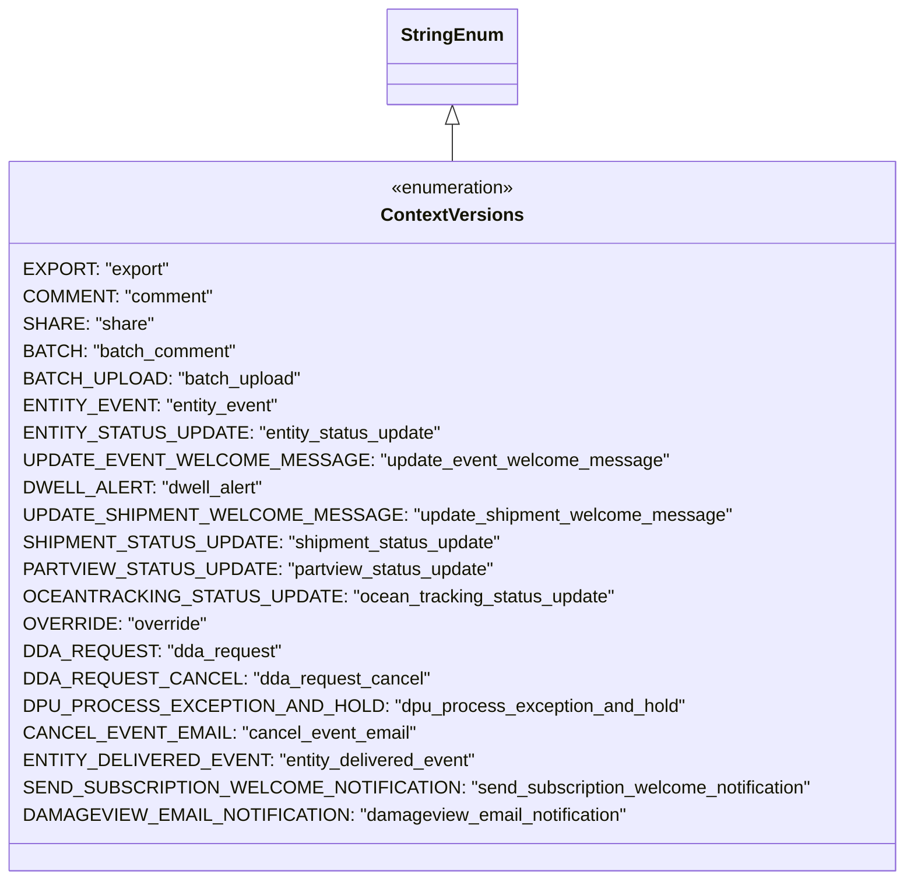

# Diagram: common/fv/python/fv/aws/lambdas/notification/constants.py

> Auto-generated by Obscura crawlers

## Mermaid

### SVG

<svg id="container" width="752.4453125" xmlns="http://www.w3.org/2000/svg" class="classDiagram" height="774" viewBox="0 0 752.4453125 774" role="graphics-document document" aria-roledescription="class"><g><defs><marker id="container_class-aggregationStart" class="marker aggregation class" refX="18" refY="7" markerWidth="190" markerHeight="240" orient="auto"><path d="M 18,7 L9,13 L1,7 L9,1 Z"></path></marker></defs><defs><marker id="container_class-aggregationEnd" class="marker aggregation class" refX="1" refY="7" markerWidth="20" markerHeight="28" orient="auto"><path d="M 18,7 L9,13 L1,7 L9,1 Z"></path></marker></defs><defs><marker id="container_class-extensionStart" class="marker extension class" refX="18" refY="7" markerWidth="190" markerHeight="240" orient="auto"><path d="M 1,7 L18,13 V 1 Z"></path></marker></defs><defs><marker id="container_class-extensionEnd" class="marker extension class" refX="1" refY="7" markerWidth="20" markerHeight="28" orient="auto"><path d="M 1,1 V 13 L18,7 Z"></path></marker></defs><defs><marker id="container_class-compositionStart" class="marker composition class" refX="18" refY="7" markerWidth="190" markerHeight="240" orient="auto"><path d="M 18,7 L9,13 L1,7 L9,1 Z"></path></marker></defs><defs><marker id="container_class-compositionEnd" class="marker composition class" refX="1" refY="7" markerWidth="20" markerHeight="28" orient="auto"><path d="M 18,7 L9,13 L1,7 L9,1 Z"></path></marker></defs><defs><marker id="container_class-dependencyStart" class="marker dependency class" refX="6" refY="7" markerWidth="190" markerHeight="240" orient="auto"><path d="M 5,7 L9,13 L1,7 L9,1 Z"></path></marker></defs><defs><marker id="container_class-dependencyEnd" class="marker dependency class" refX="13" refY="7" markerWidth="20" markerHeight="28" orient="auto"><path d="M 18,7 L9,13 L14,7 L9,1 Z"></path></marker></defs><defs><marker id="container_class-lollipopStart" class="marker lollipop class" refX="13" refY="7" markerWidth="190" markerHeight="240" orient="auto"><circle stroke="black" fill="transparent" cx="7" cy="7" r="6"></circle></marker></defs><defs><marker id="container_class-lollipopEnd" class="marker lollipop class" refX="1" refY="7" markerWidth="190" markerHeight="240" orient="auto"><circle stroke="black" fill="transparent" cx="7" cy="7" r="6"></circle></marker></defs><g class="root"><g class="clusters"></g><g class="edgePaths"><path d="M376.223,109.25L376.223,110.542C376.223,111.833,376.223,114.417,376.223,119.875C376.223,125.333,376.223,133.667,376.223,137.833L376.223,142" id="id_StringEnum_ContextVersions_1" class="edge-thickness-normal edge-pattern-solid relation" style=";;;" data-edge="true" data-et="edge" data-id="id_StringEnum_ContextVersions_1" data-points="W3sieCI6Mzc2LjIyMjY1NjI1LCJ5Ijo5Mn0seyJ4IjozNzYuMjIyNjU2MjUsInkiOjExN30seyJ4IjozNzYuMjIyNjU2MjUsInkiOjE0Mn1d" marker-start="url(#container_class-extensionStart)"></path></g><g class="edgeLabels"><g class="edgeLabel"><g class="label" data-id="id_StringEnum_ContextVersions_1" transform="translate(0, 0)"><foreignObject width="0" height="0">

</foreignObject></g></g></g><g class="nodes"><g class="node default" id="classId-StringEnum-0" transform="translate(376.22265625, 50)"><g class="basic label-container"><path d="M-54.234375 -42 L54.234375 -42 L54.234375 42 L-54.234375 42" stroke="none" stroke-width="0" fill="#ECECFF" style=""></path><path d="M-54.234375 -42 C-15.530785011712219 -42, 23.172804976575563 -42, 54.234375 -42 M-54.234375 -42 C-20.954623123096752 -42, 12.325128753806496 -42, 54.234375 -42 M54.234375 -42 C54.234375 -19.117522356395348, 54.234375 3.764955287209304, 54.234375 42 M54.234375 -42 C54.234375 -16.43490076120485, 54.234375 9.130198477590298, 54.234375 42 M54.234375 42 C18.12143385950965 42, -17.9915072809807 42, -54.234375 42 M54.234375 42 C23.80770440878702 42, -6.618966182425957 42, -54.234375 42 M-54.234375 42 C-54.234375 17.84164017250457, -54.234375 -6.316719654990862, -54.234375 -42 M-54.234375 42 C-54.234375 18.093579498060805, -54.234375 -5.81284100387839, -54.234375 -42" stroke="#9370DB" stroke-width="1.3" fill="none" stroke-dasharray="0 0" style=""></path></g><g class="annotation-group text" transform="translate(0, -18)"></g><g class="label-group text" transform="translate(-42.234375, -18)"><g class="label" style="font-weight: bolder" transform="translate(0,-12)"><foreignObject width="84.46875" height="24">

StringEnum

</foreignObject></g></g><g class="members-group text" transform="translate(-42.234375, 30)"></g><g class="methods-group text" transform="translate(-42.234375, 60)"></g><g class="divider" style=""><path d="M-54.234375 6 C-30.0268373451976 6, -5.819299690395198 6, 54.234375 6 M-54.234375 6 C-14.932807072005154 6, 24.36876085598969 6, 54.234375 6" stroke="#9370DB" stroke-width="1.3" fill="none" stroke-dasharray="0 0" style=""></path></g><g class="divider" style=""><path d="M-54.234375 24 C-15.960416828189487 24, 22.313541343621026 24, 54.234375 24 M-54.234375 24 C-21.551722308755735 24, 11.130930382488529 24, 54.234375 24" stroke="#9370DB" stroke-width="1.3" fill="none" stroke-dasharray="0 0" style=""></path></g></g><g class="node default" id="classId-ContextVersions-1" transform="translate(376.22265625, 454)"><g class="basic label-container"><path d="M-368.22265625 -312 L368.22265625 -312 L368.22265625 312 L-368.22265625 312" stroke="none" stroke-width="0" fill="#ECECFF" style=""></path><path d="M-368.22265625 -312 C-102.19747381126427 -312, 163.82770862747145 -312, 368.22265625 -312 M-368.22265625 -312 C-103.1058850826945 -312, 162.010886084611 -312, 368.22265625 -312 M368.22265625 -312 C368.22265625 -78.9396842576507, 368.22265625 154.1206314846986, 368.22265625 312 M368.22265625 -312 C368.22265625 -162.08542741311047, 368.22265625 -12.170854826220932, 368.22265625 312 M368.22265625 312 C90.41419047412865 312, -187.3942753017427 312, -368.22265625 312 M368.22265625 312 C156.40736920435873 312, -55.40791784128254 312, -368.22265625 312 M-368.22265625 312 C-368.22265625 142.94762210951666, -368.22265625 -26.104755780966684, -368.22265625 -312 M-368.22265625 312 C-368.22265625 172.29461970393442, -368.22265625 32.58923940786883, -368.22265625 -312" stroke="#9370DB" stroke-width="1.3" fill="none" stroke-dasharray="0 0" style=""></path></g><g class="annotation-group text" transform="translate(-55.5546875, -288)"><g class="label" style="" transform="translate(0,-12)"><foreignObject width="111.109375" height="24">

«enumeration»

</foreignObject></g></g><g class="label-group text" transform="translate(-59.3359375, -264)"><g class="label" style="font-weight: bolder" transform="translate(0,-12)"><foreignObject width="118.671875" height="24">

ContextVersions

</foreignObject></g></g><g class="members-group text" transform="translate(-356.22265625, -216)"><g class="label" style="" transform="translate(0,-12)"><foreignObject width="122.15625" height="24">

EXPORT: "export"

</foreignObject></g><g class="label" style="" transform="translate(0,12)"><foreignObject width="160.046875" height="24">

COMMENT: "comment"

</foreignObject></g><g class="label" style="" transform="translate(0,36)"><foreignObject width="107.515625" height="24">

SHARE: "share"

</foreignObject></g><g class="label" style="" transform="translate(0,60)"><foreignObject width="182.765625" height="24">

BATCH: "batch_comment"

</foreignObject></g><g class="label" style="" transform="translate(0,84)"><foreignObject width="231.265625" height="24">

BATCH_UPLOAD: "batch_upload"

</foreignObject></g><g class="label" style="" transform="translate(0,108)"><foreignObject width="211.4375" height="24">

ENTITY_EVENT: "entity_event"

</foreignObject></g><g class="label" style="" transform="translate(0,132)"><foreignObject width="344.296875" height="24">

ENTITY_STATUS_UPDATE: "entity_status_update"

</foreignObject></g><g class="label" style="" transform="translate(0,156)"><foreignObject width="521.3125" height="24">

UPDATE_EVENT_WELCOME_MESSAGE: "update_event_welcome_message"

</foreignObject></g><g class="label" style="" transform="translate(0,180)"><foreignObject width="200.4375" height="24">

DWELL_ALERT: "dwell_alert"

</foreignObject></g><g class="label" style="" transform="translate(0,204)"><foreignObject width="577.546875" height="24">

UPDATE_SHIPMENT_WELCOME_MESSAGE: "update_shipment_welcome_message"

</foreignObject></g><g class="label" style="" transform="translate(0,228)"><foreignObject width="395.546875" height="24">

SHIPMENT_STATUS_UPDATE: "shipment_status_update"

</foreignObject></g><g class="label" style="" transform="translate(0,252)"><foreignObject width="386.453125" height="24">

PARTVIEW_STATUS_UPDATE: "partview_status_update"

</foreignObject></g><g class="label" style="" transform="translate(0,276)"><foreignObject width="483.84375" height="24">

OCEANTRACKING_STATUS_UPDATE: "ocean_tracking_status_update"

</foreignObject></g><g class="label" style="" transform="translate(0,300)"><foreignObject width="152.890625" height="24">

OVERRIDE: "override"

</foreignObject></g><g class="label" style="" transform="translate(0,324)"><foreignObject width="213.90625" height="24">

DDA_REQUEST: "dda_request"

</foreignObject></g><g class="label" style="" transform="translate(0,348)"><foreignObject width="330.28125" height="24">

DDA_REQUEST_CANCEL: "dda_request_cancel"

</foreignObject></g><g class="label" style="" transform="translate(0,372)"><foreignObject width="543.46875" height="24">

DPU_PROCESS_EXCEPTION_AND_HOLD: "dpu_process_exception_and_hold"

</foreignObject></g><g class="label" style="" transform="translate(0,396)"><foreignObject width="321.890625" height="24">

CANCEL_EVENT_EMAIL: "cancel_event_email"

</foreignObject></g><g class="label" style="" transform="translate(0,420)"><foreignObject width="372.671875" height="24">

ENTITY_DELIVERED_EVENT: "entity_delivered_event"

</foreignObject></g><g class="label" style="" transform="translate(0,444)"><foreignObject width="653.109375" height="24">

SEND_SUBSCRIPTION_WELCOME_NOTIFICATION: "send_subscription_welcome_notification"

</foreignObject></g><g class="label" style="" transform="translate(0,468)"><foreignObject width="502.796875" height="24">

DAMAGEVIEW_EMAIL_NOTIFICATION: "damageview_email_notification"

</foreignObject></g></g><g class="methods-group text" transform="translate(-356.22265625, 312)"></g><g class="divider" style=""><path d="M-368.22265625 -240 C-195.94797231470793 -240, -23.67328837941585 -240, 368.22265625 -240 M-368.22265625 -240 C-196.03817021856895 -240, -23.8536841871379 -240, 368.22265625 -240" stroke="#9370DB" stroke-width="1.3" fill="none" stroke-dasharray="0 0" style=""></path></g><g class="divider" style=""><path d="M-368.22265625 288 C-207.86184227451483 288, -47.501028299029656 288, 368.22265625 288 M-368.22265625 288 C-203.1539936466298 288, -38.0853310432596 288, 368.22265625 288" stroke="#9370DB" stroke-width="1.3" fill="none" stroke-dasharray="0 0" style=""></path></g></g></g></g></g></svg>
