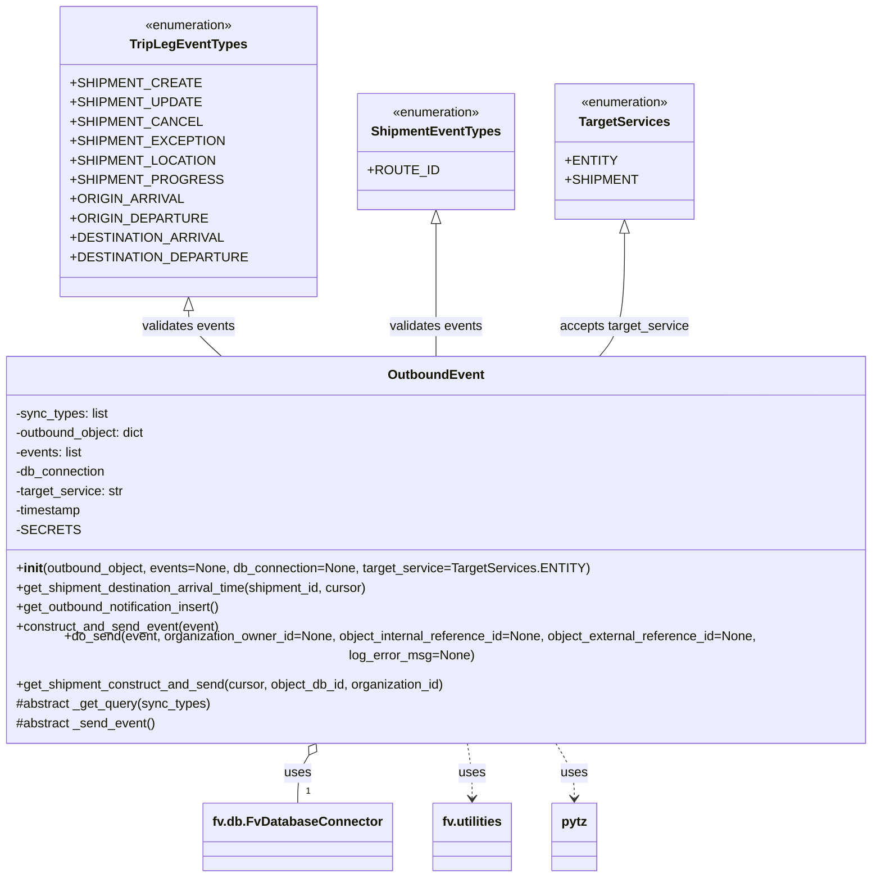
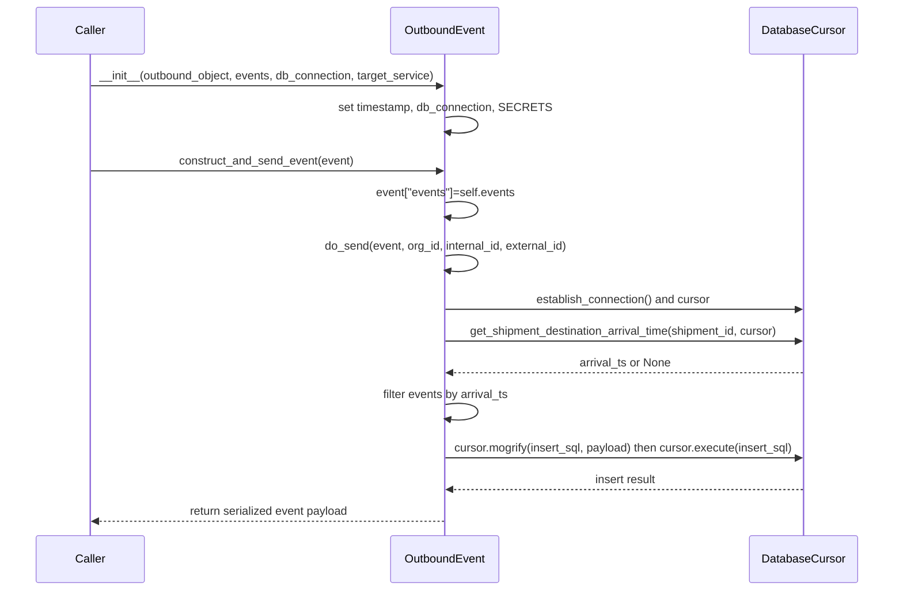

# Diagram: common/fv/python/fv/aws/lambdas/outbound_event.py

> Auto-generated by Obscura crawlers

## Diagram 1

### SVG

<svg id="container" width="1123.234375" xmlns="http://www.w3.org/2000/svg" class="classDiagram" height="1064" viewBox="0 0 1123.234375 1064" role="graphics-document document" aria-roledescription="class"><g><defs><marker id="container_class-aggregationStart" class="marker aggregation class" refX="18" refY="7" markerWidth="190" markerHeight="240" orient="auto"><path d="M 18,7 L9,13 L1,7 L9,1 Z"></path></marker></defs><defs><marker id="container_class-aggregationEnd" class="marker aggregation class" refX="1" refY="7" markerWidth="20" markerHeight="28" orient="auto"><path d="M 18,7 L9,13 L1,7 L9,1 Z"></path></marker></defs><defs><marker id="container_class-extensionStart" class="marker extension class" refX="18" refY="7" markerWidth="190" markerHeight="240" orient="auto"><path d="M 1,7 L18,13 V 1 Z"></path></marker></defs><defs><marker id="container_class-extensionEnd" class="marker extension class" refX="1" refY="7" markerWidth="20" markerHeight="28" orient="auto"><path d="M 1,1 V 13 L18,7 Z"></path></marker></defs><defs><marker id="container_class-compositionStart" class="marker composition class" refX="18" refY="7" markerWidth="190" markerHeight="240" orient="auto"><path d="M 18,7 L9,13 L1,7 L9,1 Z"></path></marker></defs><defs><marker id="container_class-compositionEnd" class="marker composition class" refX="1" refY="7" markerWidth="20" markerHeight="28" orient="auto"><path d="M 18,7 L9,13 L1,7 L9,1 Z"></path></marker></defs><defs><marker id="container_class-dependencyStart" class="marker dependency class" refX="6" refY="7" markerWidth="190" markerHeight="240" orient="auto"><path d="M 5,7 L9,13 L1,7 L9,1 Z"></path></marker></defs><defs><marker id="container_class-dependencyEnd" class="marker dependency class" refX="13" refY="7" markerWidth="20" markerHeight="28" orient="auto"><path d="M 18,7 L9,13 L14,7 L9,1 Z"></path></marker></defs><defs><marker id="container_class-lollipopStart" class="marker lollipop class" refX="13" refY="7" markerWidth="190" markerHeight="240" orient="auto"><circle stroke="black" fill="transparent" cx="7" cy="7" r="6"></circle></marker></defs><defs><marker id="container_class-lollipopEnd" class="marker lollipop class" refX="1" refY="7" markerWidth="190" markerHeight="240" orient="auto"><circle stroke="black" fill="transparent" cx="7" cy="7" r="6"></circle></marker></defs><g class="root"><g class="clusters"></g><g class="edgePaths"><path d="M278.691,385.25L278.691,388.542C278.691,391.833,278.691,398.417,285.275,407.875C291.859,417.333,305.027,429.667,311.61,435.833L318.194,442" id="id_TripLegEventTypes_OutboundEvent_1" class="edge-thickness-normal edge-pattern-solid relation" style=";;;" data-edge="true" data-et="edge" data-id="id_TripLegEventTypes_OutboundEvent_1" data-points="W3sieCI6Mjc4LjY5MTQwNjI1LCJ5IjozNjh9LHsieCI6Mjc4LjY5MTQwNjI1LCJ5Ijo0MDV9LHsieCI6MzE4LjE5NDI1MTE3OTI0NTI3LCJ5Ijo0NDJ9XQ==" marker-start="url(#container_class-extensionStart)"></path><path d="M561.617,277.25L561.617,298.542C561.617,319.833,561.617,362.417,561.617,389.875C561.617,417.333,561.617,429.667,561.617,435.833L561.617,442" id="id_ShipmentEventTypes_OutboundEvent_2" class="edge-thickness-normal edge-pattern-solid relation" style=";;;" data-edge="true" data-et="edge" data-id="id_ShipmentEventTypes_OutboundEvent_2" data-points="W3sieCI6NTYxLjYxNzE4NzUsInkiOjI2MH0seyJ4Ijo1NjEuNjE3MTg3NSwieSI6NDA1fSx7IngiOjU2MS42MTcxODc1LCJ5Ijo0NDJ9XQ==" marker-start="url(#container_class-extensionStart)"></path><path d="M781.691,289.25L781.691,308.542C781.691,327.833,781.691,366.417,776.57,391.875C771.449,417.333,761.207,429.667,756.085,435.833L750.964,442" id="id_TargetServices_OutboundEvent_3" class="edge-thickness-normal edge-pattern-solid relation" style=";;;" data-edge="true" data-et="edge" data-id="id_TargetServices_OutboundEvent_3" data-points="W3sieCI6NzgxLjY5MTQwNjI1LCJ5IjoyNzJ9LHsieCI6NzgxLjY5MTQwNjI1LCJ5Ijo0MDV9LHsieCI6NzUwLjk2NDA2MjUsInkiOjQ0Mn1d" marker-start="url(#container_class-extensionStart)"></path><path d="M407.788,912.568L405.417,916.306C403.046,920.045,398.304,927.523,395.933,937.428C393.563,947.333,393.563,959.667,393.563,965.833L393.563,972" id="id_OutboundEvent_fv.db.FvDatabaseConnector_4" class="edge-thickness-normal edge-pattern-solid relation" style=";;;" data-edge="true" data-et="edge" data-id="id_OutboundEvent_fv.db.FvDatabaseConnector_4" data-points="W3sieCI6NDE3LjAyNjczOTM4Njc5MjQsInkiOjg5OH0seyJ4IjozOTMuNTYyNSwieSI6OTM1fSx7IngiOjM5My41NjI1LCJ5Ijo5NzJ9XQ==" marker-start="url(#container_class-aggregationStart)"></path><path d="M597.572,898L598.544,904.167C599.516,910.333,601.461,922.667,602.434,934C603.406,945.333,603.406,955.667,603.406,960.833L603.406,966" id="id_OutboundEvent_fv.utilities_5" class="edge-thickness-normal edge-pattern-dashed relation" style=";;;" data-edge="true" data-et="edge" data-id="id_OutboundEvent_fv.utilities_5" data-points="W3sieCI6NTk3LjU3MTU1MDcwNzU0NzIsInkiOjg5OH0seyJ4Ijo2MDMuNDA2MjUsInkiOjkzNX0seyJ4Ijo2MDMuNDA2MjUsInkiOjk3Mn1d" marker-end="url(#container_class-dependencyEnd)"></path><path d="M706.208,898L710.118,904.167C714.029,910.333,721.85,922.667,725.761,934C729.672,945.333,729.672,955.667,729.672,960.833L729.672,966" id="id_OutboundEvent_pytz_6" class="edge-thickness-normal edge-pattern-dashed relation" style=";;;" data-edge="true" data-et="edge" data-id="id_OutboundEvent_pytz_6" data-points="W3sieCI6NzA2LjIwNzYzNTYxMzIwNzYsInkiOjg5OH0seyJ4Ijo3MjkuNjcxODc1LCJ5Ijo5MzV9LHsieCI6NzI5LjY3MTg3NSwieSI6OTcyfV0=" marker-end="url(#container_class-dependencyEnd)"></path></g><g class="edgeLabels"><g class="edgeLabel" transform="translate(278.69140625, 405)"><g class="label" data-id="id_TripLegEventTypes_OutboundEvent_1" transform="translate(-58.7109375, -12)"><foreignObject width="117.421875" height="24">

validates events

</foreignObject></g></g><g class="edgeLabel" transform="translate(561.6171875, 405)"><g class="label" data-id="id_ShipmentEventTypes_OutboundEvent_2" transform="translate(-58.7109375, -12)"><foreignObject width="117.421875" height="24">

validates events

</foreignObject></g></g><g class="edgeLabel" transform="translate(781.69140625, 405)"><g class="label" data-id="id_TargetServices_OutboundEvent_3" transform="translate(-80.53125, -12)"><foreignObject width="161.0625" height="24">

accepts target_service

</foreignObject></g></g><g class="edgeLabel" transform="translate(393.5625, 935)"><g class="label" data-id="id_OutboundEvent_fv.db.FvDatabaseConnector_4" transform="translate(-16.4921875, -12)"><foreignObject width="32.984375" height="24">

uses

</foreignObject></g></g><g class="edgeLabel" transform="translate(603.40625, 935)"><g class="label" data-id="id_OutboundEvent_fv.utilities_5" transform="translate(-16.4921875, -12)"><foreignObject width="32.984375" height="24">

uses

</foreignObject></g></g><g class="edgeLabel" transform="translate(729.671875, 935)"><g class="label" data-id="id_OutboundEvent_pytz_6" transform="translate(-16.4921875, -12)"><foreignObject width="32.984375" height="24">

uses

</foreignObject></g></g><g class="edgeTerminals" transform="translate(403.5625, 949.5)"><g class="inner" transform="translate(0, 0)"></g><foreignObject style="width: 9px; height: 12px;">
1
</foreignObject></g></g><g class="nodes"><g class="node default" id="classId-TripLegEventTypes-0" transform="translate(278.69140625, 188)"><g class="basic label-container"><path d="M-142.98046875 -180 L142.98046875 -180 L142.98046875 180 L-142.98046875 180" stroke="none" stroke-width="0" fill="#ECECFF" style=""></path><path d="M-142.98046875 -180 C-31.665233364317075 -180, 79.65000202136585 -180, 142.98046875 -180 M-142.98046875 -180 C-71.58699389557276 -180, -0.193519041145521 -180, 142.98046875 -180 M142.98046875 -180 C142.98046875 -56.11952406965709, 142.98046875 67.76095186068582, 142.98046875 180 M142.98046875 -180 C142.98046875 -52.01940653249612, 142.98046875 75.96118693500776, 142.98046875 180 M142.98046875 180 C77.30475643742183 180, 11.62904412484366 180, -142.98046875 180 M142.98046875 180 C64.4834169332161 180, -14.01363488356779 180, -142.98046875 180 M-142.98046875 180 C-142.98046875 73.1168942532166, -142.98046875 -33.7662114935668, -142.98046875 -180 M-142.98046875 180 C-142.98046875 63.20487321910596, -142.98046875 -53.590253561788074, -142.98046875 -180" stroke="#9370DB" stroke-width="1.3" fill="none" stroke-dasharray="0 0" style=""></path></g><g class="annotation-group text" transform="translate(-55.5546875, -156)"><g class="label" style="" transform="translate(0,-12)"><foreignObject width="111.109375" height="24">

«enumeration»

</foreignObject></g></g><g class="label-group text" transform="translate(-68.4609375, -132)"><g class="label" style="font-weight: bolder" transform="translate(0,-12)"><foreignObject width="136.921875" height="24">

TripLegEventTypes

</foreignObject></g></g><g class="members-group text" transform="translate(-130.98046875, -84)"><g class="label" style="" transform="translate(0,-12)"><foreignObject width="139.96875" height="24">

+SHIPMENT_CREATE

</foreignObject></g><g class="label" style="" transform="translate(0,12)"><foreignObject width="142.96875" height="24">

+SHIPMENT_UPDATE

</foreignObject></g><g class="label" style="" transform="translate(0,36)"><foreignObject width="142.125" height="24">

+SHIPMENT_CANCEL

</foreignObject></g><g class="label" style="" transform="translate(0,60)"><foreignObject width="166.59375" height="24">

+SHIPMENT_EXCEPTION

</foreignObject></g><g class="label" style="" transform="translate(0,84)"><foreignObject width="158.859375" height="24">

+SHIPMENT_LOCATION

</foreignObject></g><g class="label" style="" transform="translate(0,108)"><foreignObject width="163.546875" height="24">

+SHIPMENT_PROGRESS

</foreignObject></g><g class="label" style="" transform="translate(0,132)"><foreignObject width="126.578125" height="24">

+ORIGIN_ARRIVAL

</foreignObject></g><g class="label" style="" transform="translate(0,156)"><foreignObject width="150.359375" height="24">

+ORIGIN_DEPARTURE

</foreignObject></g><g class="label" style="" transform="translate(0,180)"><foreignObject width="169.71875" height="24">

+DESTINATION_ARRIVAL

</foreignObject></g><g class="label" style="" transform="translate(0,204)"><foreignObject width="193.5" height="24">

+DESTINATION_DEPARTURE

</foreignObject></g></g><g class="methods-group text" transform="translate(-130.98046875, 180)"></g><g class="divider" style=""><path d="M-142.98046875 -108 C-65.74707893387672 -108, 11.486310882246556 -108, 142.98046875 -108 M-142.98046875 -108 C-56.449078102597014 -108, 30.082312544805973 -108, 142.98046875 -108" stroke="#9370DB" stroke-width="1.3" fill="none" stroke-dasharray="0 0" style=""></path></g><g class="divider" style=""><path d="M-142.98046875 156 C-48.11971712935251 156, 46.74103449129498 156, 142.98046875 156 M-142.98046875 156 C-83.42158572987661 156, -23.862702709753222 156, 142.98046875 156" stroke="#9370DB" stroke-width="1.3" fill="none" stroke-dasharray="0 0" style=""></path></g></g><g class="node default" id="classId-ShipmentEventTypes-1" transform="translate(561.6171875, 188)"><g class="basic label-container"><path d="M-89.9453125 -72 L89.9453125 -72 L89.9453125 72 L-89.9453125 72" stroke="none" stroke-width="0" fill="#ECECFF" style=""></path><path d="M-89.9453125 -72 C-38.911775439312095 -72, 12.12176162137581 -72, 89.9453125 -72 M-89.9453125 -72 C-28.4330917196188 -72, 33.0791290607624 -72, 89.9453125 -72 M89.9453125 -72 C89.9453125 -14.500395847362455, 89.9453125 42.99920830527509, 89.9453125 72 M89.9453125 -72 C89.9453125 -20.218585202656826, 89.9453125 31.56282959468635, 89.9453125 72 M89.9453125 72 C19.43142643315778 72, -51.08245963368444 72, -89.9453125 72 M89.9453125 72 C48.418648437715014 72, 6.891984375430027 72, -89.9453125 72 M-89.9453125 72 C-89.9453125 19.315325980190657, -89.9453125 -33.369348039618686, -89.9453125 -72 M-89.9453125 72 C-89.9453125 42.626481015820865, -89.9453125 13.25296203164173, -89.9453125 -72" stroke="#9370DB" stroke-width="1.3" fill="none" stroke-dasharray="0 0" style=""></path></g><g class="annotation-group text" transform="translate(-55.5546875, -48)"><g class="label" style="" transform="translate(0,-12)"><foreignObject width="111.109375" height="24">

«enumeration»

</foreignObject></g></g><g class="label-group text" transform="translate(-76.515625, -24)"><g class="label" style="font-weight: bolder" transform="translate(0,-12)"><foreignObject width="153.03125" height="24">

ShipmentEventTypes

</foreignObject></g></g><g class="members-group text" transform="translate(-77.9453125, 24)"><g class="label" style="" transform="translate(0,-12)"><foreignObject width="79.375" height="24">

+ROUTE_ID

</foreignObject></g></g><g class="methods-group text" transform="translate(-77.9453125, 72)"></g><g class="divider" style=""><path d="M-89.9453125 0 C-22.2674716346541 0, 45.4103692306918 0, 89.9453125 0 M-89.9453125 0 C-46.0895498344399 0, -2.2337871688798003 0, 89.9453125 0" stroke="#9370DB" stroke-width="1.3" fill="none" stroke-dasharray="0 0" style=""></path></g><g class="divider" style=""><path d="M-89.9453125 48 C-38.5060574188635 48, 12.933197662273002 48, 89.9453125 48 M-89.9453125 48 C-25.768346852009003 48, 38.408618795981994 48, 89.9453125 48" stroke="#9370DB" stroke-width="1.3" fill="none" stroke-dasharray="0 0" style=""></path></g></g><g class="node default" id="classId-TargetServices-2" transform="translate(781.69140625, 188)"><g class="basic label-container"><path d="M-80.12890625 -84 L80.12890625 -84 L80.12890625 84 L-80.12890625 84" stroke="none" stroke-width="0" fill="#ECECFF" style=""></path><path d="M-80.12890625 -84 C-25.54094411111607 -84, 29.047018027767862 -84, 80.12890625 -84 M-80.12890625 -84 C-22.460544945714553 -84, 35.207816358570895 -84, 80.12890625 -84 M80.12890625 -84 C80.12890625 -17.80623859077579, 80.12890625 48.38752281844842, 80.12890625 84 M80.12890625 -84 C80.12890625 -48.43042893655186, 80.12890625 -12.860857873103726, 80.12890625 84 M80.12890625 84 C21.40781657393879 84, -37.31327310212242 84, -80.12890625 84 M80.12890625 84 C24.75886841538719 84, -30.611169419225618 84, -80.12890625 84 M-80.12890625 84 C-80.12890625 44.0412254016612, -80.12890625 4.082450803322402, -80.12890625 -84 M-80.12890625 84 C-80.12890625 35.08175609482114, -80.12890625 -13.836487810357724, -80.12890625 -84" stroke="#9370DB" stroke-width="1.3" fill="none" stroke-dasharray="0 0" style=""></path></g><g class="annotation-group text" transform="translate(-55.5546875, -60)"><g class="label" style="" transform="translate(0,-12)"><foreignObject width="111.109375" height="24">

«enumeration»

</foreignObject></g></g><g class="label-group text" transform="translate(-53.671875, -36)"><g class="label" style="font-weight: bolder" transform="translate(0,-12)"><foreignObject width="107.34375" height="24">

TargetServices

</foreignObject></g></g><g class="members-group text" transform="translate(-68.12890625, 12)"><g class="label" style="" transform="translate(0,-12)"><foreignObject width="57.546875" height="24">

+ENTITY

</foreignObject></g><g class="label" style="" transform="translate(0,12)"><foreignObject width="80.703125" height="24">

+SHIPMENT

</foreignObject></g></g><g class="methods-group text" transform="translate(-68.12890625, 84)"></g><g class="divider" style=""><path d="M-80.12890625 -12 C-16.825771171003936 -12, 46.47736390799213 -12, 80.12890625 -12 M-80.12890625 -12 C-21.805686056399587 -12, 36.517534137200826 -12, 80.12890625 -12" stroke="#9370DB" stroke-width="1.3" fill="none" stroke-dasharray="0 0" style=""></path></g><g class="divider" style=""><path d="M-80.12890625 60 C-24.027719185939382 60, 32.073467878121235 60, 80.12890625 60 M-80.12890625 60 C-21.453066570917507 60, 37.222773108164986 60, 80.12890625 60" stroke="#9370DB" stroke-width="1.3" fill="none" stroke-dasharray="0 0" style=""></path></g></g><g class="node default" id="classId-OutboundEvent-3" transform="translate(561.6171875, 670)"><g class="basic label-container"><path d="M-553.6171875 -228 L553.6171875 -228 L553.6171875 228 L-553.6171875 228" stroke="none" stroke-width="0" fill="#ECECFF" style=""></path><path d="M-553.6171875 -228 C-216.3328756326319 -228, 120.9514362347362 -228, 553.6171875 -228 M-553.6171875 -228 C-153.15112183591071 -228, 247.31494382817857 -228, 553.6171875 -228 M553.6171875 -228 C553.6171875 -67.18387772445436, 553.6171875 93.63224455109128, 553.6171875 228 M553.6171875 -228 C553.6171875 -57.892562726074914, 553.6171875 112.21487454785017, 553.6171875 228 M553.6171875 228 C221.46643220396533 228, -110.68432309206935 228, -553.6171875 228 M553.6171875 228 C295.11367752340067 228, 36.610167546801335 228, -553.6171875 228 M-553.6171875 228 C-553.6171875 109.71009708982858, -553.6171875 -8.579805820342841, -553.6171875 -228 M-553.6171875 228 C-553.6171875 89.78655629791572, -553.6171875 -48.42688740416855, -553.6171875 -228" stroke="#9370DB" stroke-width="1.3" fill="none" stroke-dasharray="0 0" style=""></path></g><g class="annotation-group text" transform="translate(0, -204)"></g><g class="label-group text" transform="translate(-56.84375, -204)"><g class="label" style="font-weight: bolder" transform="translate(0,-12)"><foreignObject width="113.6875" height="24">

OutboundEvent

</foreignObject></g></g><g class="members-group text" transform="translate(-541.6171875, -156)"><g class="label" style="" transform="translate(0,-12)"><foreignObject width="116.34375" height="24">

-sync_types: list

</foreignObject></g><g class="label" style="" transform="translate(0,12)"><foreignObject width="167.109375" height="24">

-outbound_object: dict

</foreignObject></g><g class="label" style="" transform="translate(0,36)"><foreignObject width="84.796875" height="24">

-events: list

</foreignObject></g><g class="label" style="" transform="translate(0,60)"><foreignObject width="114.015625" height="24">

-db_connection

</foreignObject></g><g class="label" style="" transform="translate(0,84)"><foreignObject width="135.859375" height="24">

-target_service: str

</foreignObject></g><g class="label" style="" transform="translate(0,108)"><foreignObject width="84.15625" height="24">

-timestamp

</foreignObject></g><g class="label" style="" transform="translate(0,132)"><foreignObject width="66.78125" height="24">

-SECRETS

</foreignObject></g></g><g class="methods-group text" transform="translate(-541.6171875, 36)"><g class="label" style="" transform="translate(0,-12)"><foreignObject width="707.453125" height="24">

+<strong>init</strong>(outbound_object, events=None, db_connection=None, target_service=TargetServices.ENTITY)

</foreignObject></g><g class="label" style="" transform="translate(0,12)"><foreignObject width="448.609375" height="24">

+get_shipment_destination_arrival_time(shipment_id, cursor)

</foreignObject></g><g class="label" style="" transform="translate(0,36)"><foreignObject width="262.53125" height="24">

+get_outbound_notification_insert()

</foreignObject></g><g class="label" style="" transform="translate(0,60)"><foreignObject width="254.34375" height="24">

+construct_and_send_event(event)

</foreignObject></g><g class="label" style="" transform="translate(0,84)"><foreignObject width="1026.390625" height="24">

+do_send(event, organization_owner_id=None, object_internal_reference_id=None, object_external_reference_id=None, log_error_msg=None)

</foreignObject></g><g class="label" style="" transform="translate(0,108)"><foreignObject width="540.984375" height="24">

+get_shipment_construct_and_send(cursor, object_db_id, organization_id)

</foreignObject></g><g class="label" style="" transform="translate(0,132)"><foreignObject width="241.8125" height="24">

#abstract _get_query(sync_types)

</foreignObject></g><g class="label" style="" transform="translate(0,156)"><foreignObject width="173.578125" height="24">

#abstract _send_event()

</foreignObject></g></g><g class="divider" style=""><path d="M-553.6171875 -180 C-158.5398504570856 -180, 236.5374865858288 -180, 553.6171875 -180 M-553.6171875 -180 C-234.22641941665825 -180, 85.16434866668351 -180, 553.6171875 -180" stroke="#9370DB" stroke-width="1.3" fill="none" stroke-dasharray="0 0" style=""></path></g><g class="divider" style=""><path d="M-553.6171875 12 C-178.2515487547933 12, 197.1140899904134 12, 553.6171875 12 M-553.6171875 12 C-118.35648635166996 12, 316.9042147966601 12, 553.6171875 12" stroke="#9370DB" stroke-width="1.3" fill="none" stroke-dasharray="0 0" style=""></path></g></g><g class="node default" id="classId-fv.db.FvDatabaseConnector-4" transform="translate(393.5625, 1014)"><g class="basic label-container"><path d="M-111.1953125 -42 L111.1953125 -42 L111.1953125 42 L-111.1953125 42" stroke="none" stroke-width="0" fill="#ECECFF" style=""></path><path d="M-111.1953125 -42 C-48.92017859981888 -42, 13.354955300362235 -42, 111.1953125 -42 M-111.1953125 -42 C-55.22384974774857 -42, 0.7476130045028668 -42, 111.1953125 -42 M111.1953125 -42 C111.1953125 -18.23653925769279, 111.1953125 5.5269214846144195, 111.1953125 42 M111.1953125 -42 C111.1953125 -14.318535988557286, 111.1953125 13.362928022885427, 111.1953125 42 M111.1953125 42 C45.05425110521456 42, -21.086810289570877 42, -111.1953125 42 M111.1953125 42 C44.93388890650745 42, -21.327534686985103 42, -111.1953125 42 M-111.1953125 42 C-111.1953125 11.423738823844175, -111.1953125 -19.15252235231165, -111.1953125 -42 M-111.1953125 42 C-111.1953125 19.446887229037085, -111.1953125 -3.1062255419258307, -111.1953125 -42" stroke="#9370DB" stroke-width="1.3" fill="none" stroke-dasharray="0 0" style=""></path></g><g class="annotation-group text" transform="translate(0, -18)"></g><g class="label-group text" transform="translate(-99.1953125, -18)"><g class="label" style="font-weight: bolder" transform="translate(0,-12)"><foreignObject width="198.390625" height="24">

fv.db.FvDatabaseConnector

</foreignObject></g></g><g class="members-group text" transform="translate(-99.1953125, 30)"></g><g class="methods-group text" transform="translate(-99.1953125, 60)"></g><g class="divider" style=""><path d="M-111.1953125 6 C-55.49876818691067 6, 0.1977761261786668 6, 111.1953125 6 M-111.1953125 6 C-34.80335574082241 6, 41.58860101835518 6, 111.1953125 6" stroke="#9370DB" stroke-width="1.3" fill="none" stroke-dasharray="0 0" style=""></path></g><g class="divider" style=""><path d="M-111.1953125 24 C-32.55421116266001 24, 46.08689017467998 24, 111.1953125 24 M-111.1953125 24 C-45.84833674368272 24, 19.498639012634555 24, 111.1953125 24" stroke="#9370DB" stroke-width="1.3" fill="none" stroke-dasharray="0 0" style=""></path></g></g><g class="node default" id="classId-fv.utilities-5" transform="translate(603.40625, 1014)"><g class="basic label-container"><path d="M-48.6484375 -42 L48.6484375 -42 L48.6484375 42 L-48.6484375 42" stroke="none" stroke-width="0" fill="#ECECFF" style=""></path><path d="M-48.6484375 -42 C-12.425210201629945 -42, 23.79801709674011 -42, 48.6484375 -42 M-48.6484375 -42 C-17.77675061508018 -42, 13.094936269839643 -42, 48.6484375 -42 M48.6484375 -42 C48.6484375 -16.601741545037342, 48.6484375 8.796516909925316, 48.6484375 42 M48.6484375 -42 C48.6484375 -23.782153056063883, 48.6484375 -5.564306112127767, 48.6484375 42 M48.6484375 42 C19.69591528089517 42, -9.256606938209657 42, -48.6484375 42 M48.6484375 42 C29.035955652276108 42, 9.423473804552216 42, -48.6484375 42 M-48.6484375 42 C-48.6484375 23.822667909153218, -48.6484375 5.645335818306435, -48.6484375 -42 M-48.6484375 42 C-48.6484375 9.635602555569783, -48.6484375 -22.728794888860435, -48.6484375 -42" stroke="#9370DB" stroke-width="1.3" fill="none" stroke-dasharray="0 0" style=""></path></g><g class="annotation-group text" transform="translate(0, -18)"></g><g class="label-group text" transform="translate(-36.6484375, -18)"><g class="label" style="font-weight: bolder" transform="translate(0,-12)"><foreignObject width="73.296875" height="24">

fv.utilities

</foreignObject></g></g><g class="members-group text" transform="translate(-36.6484375, 30)"></g><g class="methods-group text" transform="translate(-36.6484375, 60)"></g><g class="divider" style=""><path d="M-48.6484375 6 C-16.10977028014291 6, 16.42889693971418 6, 48.6484375 6 M-48.6484375 6 C-25.727037472046515 6, -2.80563744409303 6, 48.6484375 6" stroke="#9370DB" stroke-width="1.3" fill="none" stroke-dasharray="0 0" style=""></path></g><g class="divider" style=""><path d="M-48.6484375 24 C-25.29713678895658 24, -1.9458360779131567 24, 48.6484375 24 M-48.6484375 24 C-23.93642239574434 24, 0.7755927085113186 24, 48.6484375 24" stroke="#9370DB" stroke-width="1.3" fill="none" stroke-dasharray="0 0" style=""></path></g></g><g class="node default" id="classId-pytz-6" transform="translate(729.671875, 1014)"><g class="basic label-container"><path d="M-27.6171875 -42 L27.6171875 -42 L27.6171875 42 L-27.6171875 42" stroke="none" stroke-width="0" fill="#ECECFF" style=""></path><path d="M-27.6171875 -42 C-13.042430976444072 -42, 1.5323255471118564 -42, 27.6171875 -42 M-27.6171875 -42 C-12.974260984701965 -42, 1.6686655305960691 -42, 27.6171875 -42 M27.6171875 -42 C27.6171875 -15.495733792299891, 27.6171875 11.008532415400218, 27.6171875 42 M27.6171875 -42 C27.6171875 -24.510972967929046, 27.6171875 -7.021945935858092, 27.6171875 42 M27.6171875 42 C14.442612890525035 42, 1.268038281050071 42, -27.6171875 42 M27.6171875 42 C6.722664062830102 42, -14.171859374339796 42, -27.6171875 42 M-27.6171875 42 C-27.6171875 9.276301750925285, -27.6171875 -23.44739649814943, -27.6171875 -42 M-27.6171875 42 C-27.6171875 10.171928620237448, -27.6171875 -21.656142759525103, -27.6171875 -42" stroke="#9370DB" stroke-width="1.3" fill="none" stroke-dasharray="0 0" style=""></path></g><g class="annotation-group text" transform="translate(0, -18)"></g><g class="label-group text" transform="translate(-15.6171875, -18)"><g class="label" style="font-weight: bolder" transform="translate(0,-12)"><foreignObject width="31.234375" height="24">

pytz

</foreignObject></g></g><g class="members-group text" transform="translate(-15.6171875, 30)"></g><g class="methods-group text" transform="translate(-15.6171875, 60)"></g><g class="divider" style=""><path d="M-27.6171875 6 C-14.410143109546192 6, -1.2030987190923845 6, 27.6171875 6 M-27.6171875 6 C-7.205360984368294 6, 13.206465531263412 6, 27.6171875 6" stroke="#9370DB" stroke-width="1.3" fill="none" stroke-dasharray="0 0" style=""></path></g><g class="divider" style=""><path d="M-27.6171875 24 C-10.071321313040212 24, 7.474544873919577 24, 27.6171875 24 M-27.6171875 24 C-10.038510060926559 24, 7.540167378146883 24, 27.6171875 24" stroke="#9370DB" stroke-width="1.3" fill="none" stroke-dasharray="0 0" style=""></path></g></g></g></g></g></svg>

## Diagram 2

### SVG

<svg id="container" width="1344" xmlns="http://www.w3.org/2000/svg" height="867" viewBox="-50 -10 1344 867" role="graphics-document document" aria-roledescription="sequence"><g><rect x="1094" y="781" fill="#eaeaea" stroke="#666" width="150" height="65" name="DB" rx="3" ry="3" class="actor actor-bottom"></rect><text x="1169" y="813.5" dominant-baseline="central" alignment-baseline="central" class="actor actor-box" style="text-anchor: middle; font-size: 16px; font-weight: 400;"><tspan x="1169" dy="0">DatabaseCursor</tspan></text></g><g><rect x="544" y="781" fill="#eaeaea" stroke="#666" width="150" height="65" name="OutboundEvent" rx="3" ry="3" class="actor actor-bottom"></rect><text x="619" y="813.5" dominant-baseline="central" alignment-baseline="central" class="actor actor-box" style="text-anchor: middle; font-size: 16px; font-weight: 400;"><tspan x="619" dy="0">OutboundEvent</tspan></text></g><g><rect x="0" y="781" fill="#eaeaea" stroke="#666" width="150" height="65" name="Caller" rx="3" ry="3" class="actor actor-bottom"></rect><text x="75" y="813.5" dominant-baseline="central" alignment-baseline="central" class="actor actor-box" style="text-anchor: middle; font-size: 16px; font-weight: 400;"><tspan x="75" dy="0">Caller</tspan></text></g><g><line id="actor2" x1="1169" y1="65" x2="1169" y2="781" class="actor-line 200" stroke-width="0.5px" stroke="#999" name="DB"></line><g id="root-2"><rect x="1094" y="0" fill="#eaeaea" stroke="#666" width="150" height="65" name="DB" rx="3" ry="3" class="actor actor-top"></rect><text x="1169" y="32.5" dominant-baseline="central" alignment-baseline="central" class="actor actor-box" style="text-anchor: middle; font-size: 16px; font-weight: 400;"><tspan x="1169" dy="0">DatabaseCursor</tspan></text></g></g><g><line id="actor1" x1="619" y1="65" x2="619" y2="781" class="actor-line 200" stroke-width="0.5px" stroke="#999" name="OutboundEvent"></line><g id="root-1"><rect x="544" y="0" fill="#eaeaea" stroke="#666" width="150" height="65" name="OutboundEvent" rx="3" ry="3" class="actor actor-top"></rect><text x="619" y="32.5" dominant-baseline="central" alignment-baseline="central" class="actor actor-box" style="text-anchor: middle; font-size: 16px; font-weight: 400;"><tspan x="619" dy="0">OutboundEvent</tspan></text></g></g><g><line id="actor0" x1="75" y1="65" x2="75" y2="781" class="actor-line 200" stroke-width="0.5px" stroke="#999" name="Caller"></line><g id="root-0"><rect x="0" y="0" fill="#eaeaea" stroke="#666" width="150" height="65" name="Caller" rx="3" ry="3" class="actor actor-top"></rect><text x="75" y="32.5" dominant-baseline="central" alignment-baseline="central" class="actor actor-box" style="text-anchor: middle; font-size: 16px; font-weight: 400;"><tspan x="75" dy="0">Caller</tspan></text></g></g><g></g><defs><symbol id="computer" width="24" height="24"><path transform="scale(.5)" d="M2 2v13h20v-13h-20zm18 11h-16v-9h16v9zm-10.228 6l.466-1h3.524l.467 1h-4.457zm14.228 3h-24l2-6h2.104l-1.33 4h18.45l-1.297-4h2.073l2 6zm-5-10h-14v-7h14v7z"></path></symbol></defs><defs><symbol id="database" fill-rule="evenodd" clip-rule="evenodd"><path transform="scale(.5)" d="M12.258.001l.256.004.255.005.253.008.251.01.249.012.247.015.246.016.242.019.241.02.239.023.236.024.233.027.231.028.229.031.225.032.223.034.22.036.217.038.214.04.211.041.208.043.205.045.201.046.198.048.194.05.191.051.187.053.183.054.18.056.175.057.172.059.168.06.163.061.16.063.155.064.15.066.074.033.073.033.071.034.07.034.069.035.068.035.067.035.066.035.064.036.064.036.062.036.06.036.06.037.058.037.058.037.055.038.055.038.053.038.052.038.051.039.05.039.048.039.047.039.045.04.044.04.043.04.041.04.04.041.039.041.037.041.036.041.034.041.033.042.032.042.03.042.029.042.027.042.026.043.024.043.023.043.021.043.02.043.018.044.017.043.015.044.013.044.012.044.011.045.009.044.007.045.006.045.004.045.002.045.001.045v17l-.001.045-.002.045-.004.045-.006.045-.007.045-.009.044-.011.045-.012.044-.013.044-.015.044-.017.043-.018.044-.02.043-.021.043-.023.043-.024.043-.026.043-.027.042-.029.042-.03.042-.032.042-.033.042-.034.041-.036.041-.037.041-.039.041-.04.041-.041.04-.043.04-.044.04-.045.04-.047.039-.048.039-.05.039-.051.039-.052.038-.053.038-.055.038-.055.038-.058.037-.058.037-.06.037-.06.036-.062.036-.064.036-.064.036-.066.035-.067.035-.068.035-.069.035-.07.034-.071.034-.073.033-.074.033-.15.066-.155.064-.16.063-.163.061-.168.06-.172.059-.175.057-.18.056-.183.054-.187.053-.191.051-.194.05-.198.048-.201.046-.205.045-.208.043-.211.041-.214.04-.217.038-.22.036-.223.034-.225.032-.229.031-.231.028-.233.027-.236.024-.239.023-.241.02-.242.019-.246.016-.247.015-.249.012-.251.01-.253.008-.255.005-.256.004-.258.001-.258-.001-.256-.004-.255-.005-.253-.008-.251-.01-.249-.012-.247-.015-.245-.016-.243-.019-.241-.02-.238-.023-.236-.024-.234-.027-.231-.028-.228-.031-.226-.032-.223-.034-.22-.036-.217-.038-.214-.04-.211-.041-.208-.043-.204-.045-.201-.046-.198-.048-.195-.05-.19-.051-.187-.053-.184-.054-.179-.056-.176-.057-.172-.059-.167-.06-.164-.061-.159-.063-.155-.064-.151-.066-.074-.033-.072-.033-.072-.034-.07-.034-.069-.035-.068-.035-.067-.035-.066-.035-.064-.036-.063-.036-.062-.036-.061-.036-.06-.037-.058-.037-.057-.037-.056-.038-.055-.038-.053-.038-.052-.038-.051-.039-.049-.039-.049-.039-.046-.039-.046-.04-.044-.04-.043-.04-.041-.04-.04-.041-.039-.041-.037-.041-.036-.041-.034-.041-.033-.042-.032-.042-.03-.042-.029-.042-.027-.042-.026-.043-.024-.043-.023-.043-.021-.043-.02-.043-.018-.044-.017-.043-.015-.044-.013-.044-.012-.044-.011-.045-.009-.044-.007-.045-.006-.045-.004-.045-.002-.045-.001-.045v-17l.001-.045.002-.045.004-.045.006-.045.007-.045.009-.044.011-.045.012-.044.013-.044.015-.044.017-.043.018-.044.02-.043.021-.043.023-.043.024-.043.026-.043.027-.042.029-.042.03-.042.032-.042.033-.042.034-.041.036-.041.037-.041.039-.041.04-.041.041-.04.043-.04.044-.04.046-.04.046-.039.049-.039.049-.039.051-.039.052-.038.053-.038.055-.038.056-.038.057-.037.058-.037.06-.037.061-.036.062-.036.063-.036.064-.036.066-.035.067-.035.068-.035.069-.035.07-.034.072-.034.072-.033.074-.033.151-.066.155-.064.159-.063.164-.061.167-.06.172-.059.176-.057.179-.056.184-.054.187-.053.19-.051.195-.05.198-.048.201-.046.204-.045.208-.043.211-.041.214-.04.217-.038.22-.036.223-.034.226-.032.228-.031.231-.028.234-.027.236-.024.238-.023.241-.02.243-.019.245-.016.247-.015.249-.012.251-.01.253-.008.255-.005.256-.004.258-.001.258.001zm-9.258 20.499v.01l.001.021.003.021.004.022.005.021.006.022.007.022.009.023.01.022.011.023.012.023.013.023.015.023.016.024.017.023.018.024.019.024.021.024.022.025.023.024.024.025.052.049.056.05.061.051.066.051.07.051.075.051.079.052.084.052.088.052.092.052.097.052.102.051.105.052.11.052.114.051.119.051.123.051.127.05.131.05.135.05.139.048.144.049.147.047.152.047.155.047.16.045.163.045.167.043.171.043.176.041.178.041.183.039.187.039.19.037.194.035.197.035.202.033.204.031.209.03.212.029.216.027.219.025.222.024.226.021.23.02.233.018.236.016.24.015.243.012.246.01.249.008.253.005.256.004.259.001.26-.001.257-.004.254-.005.25-.008.247-.011.244-.012.241-.014.237-.016.233-.018.231-.021.226-.021.224-.024.22-.026.216-.027.212-.028.21-.031.205-.031.202-.034.198-.034.194-.036.191-.037.187-.039.183-.04.179-.04.175-.042.172-.043.168-.044.163-.045.16-.046.155-.046.152-.047.148-.048.143-.049.139-.049.136-.05.131-.05.126-.05.123-.051.118-.052.114-.051.11-.052.106-.052.101-.052.096-.052.092-.052.088-.053.083-.051.079-.052.074-.052.07-.051.065-.051.06-.051.056-.05.051-.05.023-.024.023-.025.021-.024.02-.024.019-.024.018-.024.017-.024.015-.023.014-.024.013-.023.012-.023.01-.023.01-.022.008-.022.006-.022.006-.022.004-.022.004-.021.001-.021.001-.021v-4.127l-.077.055-.08.053-.083.054-.085.053-.087.052-.09.052-.093.051-.095.05-.097.05-.1.049-.102.049-.105.048-.106.047-.109.047-.111.046-.114.045-.115.045-.118.044-.12.043-.122.042-.124.042-.126.041-.128.04-.13.04-.132.038-.134.038-.135.037-.138.037-.139.035-.142.035-.143.034-.144.033-.147.032-.148.031-.15.03-.151.03-.153.029-.154.027-.156.027-.158.026-.159.025-.161.024-.162.023-.163.022-.165.021-.166.02-.167.019-.169.018-.169.017-.171.016-.173.015-.173.014-.175.013-.175.012-.177.011-.178.01-.179.008-.179.008-.181.006-.182.005-.182.004-.184.003-.184.002h-.37l-.184-.002-.184-.003-.182-.004-.182-.005-.181-.006-.179-.008-.179-.008-.178-.01-.176-.011-.176-.012-.175-.013-.173-.014-.172-.015-.171-.016-.17-.017-.169-.018-.167-.019-.166-.02-.165-.021-.163-.022-.162-.023-.161-.024-.159-.025-.157-.026-.156-.027-.155-.027-.153-.029-.151-.03-.15-.03-.148-.031-.146-.032-.145-.033-.143-.034-.141-.035-.14-.035-.137-.037-.136-.037-.134-.038-.132-.038-.13-.04-.128-.04-.126-.041-.124-.042-.122-.042-.12-.044-.117-.043-.116-.045-.113-.045-.112-.046-.109-.047-.106-.047-.105-.048-.102-.049-.1-.049-.097-.05-.095-.05-.093-.052-.09-.051-.087-.052-.085-.053-.083-.054-.08-.054-.077-.054v4.127zm0-5.654v.011l.001.021.003.021.004.021.005.022.006.022.007.022.009.022.01.022.011.023.012.023.013.023.015.024.016.023.017.024.018.024.019.024.021.024.022.024.023.025.024.024.052.05.056.05.061.05.066.051.07.051.075.052.079.051.084.052.088.052.092.052.097.052.102.052.105.052.11.051.114.051.119.052.123.05.127.051.131.05.135.049.139.049.144.048.147.048.152.047.155.046.16.045.163.045.167.044.171.042.176.042.178.04.183.04.187.038.19.037.194.036.197.034.202.033.204.032.209.03.212.028.216.027.219.025.222.024.226.022.23.02.233.018.236.016.24.014.243.012.246.01.249.008.253.006.256.003.259.001.26-.001.257-.003.254-.006.25-.008.247-.01.244-.012.241-.015.237-.016.233-.018.231-.02.226-.022.224-.024.22-.025.216-.027.212-.029.21-.03.205-.032.202-.033.198-.035.194-.036.191-.037.187-.039.183-.039.179-.041.175-.042.172-.043.168-.044.163-.045.16-.045.155-.047.152-.047.148-.048.143-.048.139-.05.136-.049.131-.05.126-.051.123-.051.118-.051.114-.052.11-.052.106-.052.101-.052.096-.052.092-.052.088-.052.083-.052.079-.052.074-.051.07-.052.065-.051.06-.05.056-.051.051-.049.023-.025.023-.024.021-.025.02-.024.019-.024.018-.024.017-.024.015-.023.014-.023.013-.024.012-.022.01-.023.01-.023.008-.022.006-.022.006-.022.004-.021.004-.022.001-.021.001-.021v-4.139l-.077.054-.08.054-.083.054-.085.052-.087.053-.09.051-.093.051-.095.051-.097.05-.1.049-.102.049-.105.048-.106.047-.109.047-.111.046-.114.045-.115.044-.118.044-.12.044-.122.042-.124.042-.126.041-.128.04-.13.039-.132.039-.134.038-.135.037-.138.036-.139.036-.142.035-.143.033-.144.033-.147.033-.148.031-.15.03-.151.03-.153.028-.154.028-.156.027-.158.026-.159.025-.161.024-.162.023-.163.022-.165.021-.166.02-.167.019-.169.018-.169.017-.171.016-.173.015-.173.014-.175.013-.175.012-.177.011-.178.009-.179.009-.179.007-.181.007-.182.005-.182.004-.184.003-.184.002h-.37l-.184-.002-.184-.003-.182-.004-.182-.005-.181-.007-.179-.007-.179-.009-.178-.009-.176-.011-.176-.012-.175-.013-.173-.014-.172-.015-.171-.016-.17-.017-.169-.018-.167-.019-.166-.02-.165-.021-.163-.022-.162-.023-.161-.024-.159-.025-.157-.026-.156-.027-.155-.028-.153-.028-.151-.03-.15-.03-.148-.031-.146-.033-.145-.033-.143-.033-.141-.035-.14-.036-.137-.036-.136-.037-.134-.038-.132-.039-.13-.039-.128-.04-.126-.041-.124-.042-.122-.043-.12-.043-.117-.044-.116-.044-.113-.046-.112-.046-.109-.046-.106-.047-.105-.048-.102-.049-.1-.049-.097-.05-.095-.051-.093-.051-.09-.051-.087-.053-.085-.052-.083-.054-.08-.054-.077-.054v4.139zm0-5.666v.011l.001.02.003.022.004.021.005.022.006.021.007.022.009.023.01.022.011.023.012.023.013.023.015.023.016.024.017.024.018.023.019.024.021.025.022.024.023.024.024.025.052.05.056.05.061.05.066.051.07.051.075.052.079.051.084.052.088.052.092.052.097.052.102.052.105.051.11.052.114.051.119.051.123.051.127.05.131.05.135.05.139.049.144.048.147.048.152.047.155.046.16.045.163.045.167.043.171.043.176.042.178.04.183.04.187.038.19.037.194.036.197.034.202.033.204.032.209.03.212.028.216.027.219.025.222.024.226.021.23.02.233.018.236.017.24.014.243.012.246.01.249.008.253.006.256.003.259.001.26-.001.257-.003.254-.006.25-.008.247-.01.244-.013.241-.014.237-.016.233-.018.231-.02.226-.022.224-.024.22-.025.216-.027.212-.029.21-.03.205-.032.202-.033.198-.035.194-.036.191-.037.187-.039.183-.039.179-.041.175-.042.172-.043.168-.044.163-.045.16-.045.155-.047.152-.047.148-.048.143-.049.139-.049.136-.049.131-.051.126-.05.123-.051.118-.052.114-.051.11-.052.106-.052.101-.052.096-.052.092-.052.088-.052.083-.052.079-.052.074-.052.07-.051.065-.051.06-.051.056-.05.051-.049.023-.025.023-.025.021-.024.02-.024.019-.024.018-.024.017-.024.015-.023.014-.024.013-.023.012-.023.01-.022.01-.023.008-.022.006-.022.006-.022.004-.022.004-.021.001-.021.001-.021v-4.153l-.077.054-.08.054-.083.053-.085.053-.087.053-.09.051-.093.051-.095.051-.097.05-.1.049-.102.048-.105.048-.106.048-.109.046-.111.046-.114.046-.115.044-.118.044-.12.043-.122.043-.124.042-.126.041-.128.04-.13.039-.132.039-.134.038-.135.037-.138.036-.139.036-.142.034-.143.034-.144.033-.147.032-.148.032-.15.03-.151.03-.153.028-.154.028-.156.027-.158.026-.159.024-.161.024-.162.023-.163.023-.165.021-.166.02-.167.019-.169.018-.169.017-.171.016-.173.015-.173.014-.175.013-.175.012-.177.01-.178.01-.179.009-.179.007-.181.006-.182.006-.182.004-.184.003-.184.001-.185.001-.185-.001-.184-.001-.184-.003-.182-.004-.182-.006-.181-.006-.179-.007-.179-.009-.178-.01-.176-.01-.176-.012-.175-.013-.173-.014-.172-.015-.171-.016-.17-.017-.169-.018-.167-.019-.166-.02-.165-.021-.163-.023-.162-.023-.161-.024-.159-.024-.157-.026-.156-.027-.155-.028-.153-.028-.151-.03-.15-.03-.148-.032-.146-.032-.145-.033-.143-.034-.141-.034-.14-.036-.137-.036-.136-.037-.134-.038-.132-.039-.13-.039-.128-.041-.126-.041-.124-.041-.122-.043-.12-.043-.117-.044-.116-.044-.113-.046-.112-.046-.109-.046-.106-.048-.105-.048-.102-.048-.1-.05-.097-.049-.095-.051-.093-.051-.09-.052-.087-.052-.085-.053-.083-.053-.08-.054-.077-.054v4.153zm8.74-8.179l-.257.004-.254.005-.25.008-.247.011-.244.012-.241.014-.237.016-.233.018-.231.021-.226.022-.224.023-.22.026-.216.027-.212.028-.21.031-.205.032-.202.033-.198.034-.194.036-.191.038-.187.038-.183.04-.179.041-.175.042-.172.043-.168.043-.163.045-.16.046-.155.046-.152.048-.148.048-.143.048-.139.049-.136.05-.131.05-.126.051-.123.051-.118.051-.114.052-.11.052-.106.052-.101.052-.096.052-.092.052-.088.052-.083.052-.079.052-.074.051-.07.052-.065.051-.06.05-.056.05-.051.05-.023.025-.023.024-.021.024-.02.025-.019.024-.018.024-.017.023-.015.024-.014.023-.013.023-.012.023-.01.023-.01.022-.008.022-.006.023-.006.021-.004.022-.004.021-.001.021-.001.021.001.021.001.021.004.021.004.022.006.021.006.023.008.022.01.022.01.023.012.023.013.023.014.023.015.024.017.023.018.024.019.024.02.025.021.024.023.024.023.025.051.05.056.05.06.05.065.051.07.052.074.051.079.052.083.052.088.052.092.052.096.052.101.052.106.052.11.052.114.052.118.051.123.051.126.051.131.05.136.05.139.049.143.048.148.048.152.048.155.046.16.046.163.045.168.043.172.043.175.042.179.041.183.04.187.038.191.038.194.036.198.034.202.033.205.032.21.031.212.028.216.027.22.026.224.023.226.022.231.021.233.018.237.016.241.014.244.012.247.011.25.008.254.005.257.004.26.001.26-.001.257-.004.254-.005.25-.008.247-.011.244-.012.241-.014.237-.016.233-.018.231-.021.226-.022.224-.023.22-.026.216-.027.212-.028.21-.031.205-.032.202-.033.198-.034.194-.036.191-.038.187-.038.183-.04.179-.041.175-.042.172-.043.168-.043.163-.045.16-.046.155-.046.152-.048.148-.048.143-.048.139-.049.136-.05.131-.05.126-.051.123-.051.118-.051.114-.052.11-.052.106-.052.101-.052.096-.052.092-.052.088-.052.083-.052.079-.052.074-.051.07-.052.065-.051.06-.05.056-.05.051-.05.023-.025.023-.024.021-.024.02-.025.019-.024.018-.024.017-.023.015-.024.014-.023.013-.023.012-.023.01-.023.01-.022.008-.022.006-.023.006-.021.004-.022.004-.021.001-.021.001-.021-.001-.021-.001-.021-.004-.021-.004-.022-.006-.021-.006-.023-.008-.022-.01-.022-.01-.023-.012-.023-.013-.023-.014-.023-.015-.024-.017-.023-.018-.024-.019-.024-.02-.025-.021-.024-.023-.024-.023-.025-.051-.05-.056-.05-.06-.05-.065-.051-.07-.052-.074-.051-.079-.052-.083-.052-.088-.052-.092-.052-.096-.052-.101-.052-.106-.052-.11-.052-.114-.052-.118-.051-.123-.051-.126-.051-.131-.05-.136-.05-.139-.049-.143-.048-.148-.048-.152-.048-.155-.046-.16-.046-.163-.045-.168-.043-.172-.043-.175-.042-.179-.041-.183-.04-.187-.038-.191-.038-.194-.036-.198-.034-.202-.033-.205-.032-.21-.031-.212-.028-.216-.027-.22-.026-.224-.023-.226-.022-.231-.021-.233-.018-.237-.016-.241-.014-.244-.012-.247-.011-.25-.008-.254-.005-.257-.004-.26-.001-.26.001z"></path></symbol></defs><defs><symbol id="clock" width="24" height="24"><path transform="scale(.5)" d="M12 2c5.514 0 10 4.486 10 10s-4.486 10-10 10-10-4.486-10-10 4.486-10 10-10zm0-2c-6.627 0-12 5.373-12 12s5.373 12 12 12 12-5.373 12-12-5.373-12-12-12zm5.848 12.459c.202.038.202.333.001.372-1.907.361-6.045 1.111-6.547 1.111-.719 0-1.301-.582-1.301-1.301 0-.512.77-5.447 1.125-7.445.034-.192.312-.181.343.014l.985 6.238 5.394 1.011z"></path></symbol></defs><defs><marker id="arrowhead" refX="7.9" refY="5" markerUnits="userSpaceOnUse" markerWidth="12" markerHeight="12" orient="auto-start-reverse"><path d="M -1 0 L 10 5 L 0 10 z"></path></marker></defs><defs><marker id="crosshead" markerWidth="15" markerHeight="8" orient="auto" refX="4" refY="4.5"><path fill="none" stroke="#000000" stroke-width="1pt" d="M 1,2 L 6,7 M 6,2 L 1,7" style="stroke-dasharray: 0, 0;"></path></marker></defs><defs><marker id="filled-head" refX="15.5" refY="7" markerWidth="20" markerHeight="28" orient="auto"><path d="M 18,7 L9,13 L14,7 L9,1 Z"></path></marker></defs><defs><marker id="sequencenumber" refX="15" refY="15" markerWidth="60" markerHeight="40" orient="auto"><circle cx="15" cy="15" r="6"></circle></marker></defs><text x="346" y="80" text-anchor="middle" dominant-baseline="middle" alignment-baseline="middle" class="messageText" dy="1em" style="font-size: 16px; font-weight: 400;">__init__(outbound_object, events, db_connection, target_service)</text><line x1="76" y1="113" x2="615" y2="113" class="messageLine0" stroke-width="2" stroke="none" marker-end="url(#arrowhead)" style="fill: none;"></line><text x="620" y="128" text-anchor="middle" dominant-baseline="middle" alignment-baseline="middle" class="messageText" dy="1em" style="font-size: 16px; font-weight: 400;">set timestamp, db_connection, SECRETS</text><path d="M 620,161 C 680,151 680,191 620,181" class="messageLine0" stroke-width="2" stroke="none" marker-end="url(#arrowhead)" style="fill: none;"></path><text x="346" y="206" text-anchor="middle" dominant-baseline="middle" alignment-baseline="middle" class="messageText" dy="1em" style="font-size: 16px; font-weight: 400;">construct_and_send_event(event)</text><line x1="76" y1="239" x2="615" y2="239" class="messageLine0" stroke-width="2" stroke="none" marker-end="url(#arrowhead)" style="fill: none;"></line><text x="620" y="254" text-anchor="middle" dominant-baseline="middle" alignment-baseline="middle" class="messageText" dy="1em" style="font-size: 16px; font-weight: 400;">event["events"]=self.events</text><path d="M 620,287 C 680,277 680,317 620,307" class="messageLine0" stroke-width="2" stroke="none" marker-end="url(#arrowhead)" style="fill: none;"></path><text x="620" y="332" text-anchor="middle" dominant-baseline="middle" alignment-baseline="middle" class="messageText" dy="1em" style="font-size: 16px; font-weight: 400;">do_send(event, org_id, internal_id, external_id)</text><path d="M 620,365 C 680,355 680,395 620,385" class="messageLine0" stroke-width="2" stroke="none" marker-end="url(#arrowhead)" style="fill: none;"></path><text x="893" y="410" text-anchor="middle" dominant-baseline="middle" alignment-baseline="middle" class="messageText" dy="1em" style="font-size: 16px; font-weight: 400;">establish_connection() and cursor</text><line x1="620" y1="443" x2="1165" y2="443" class="messageLine0" stroke-width="2" stroke="none" marker-end="url(#arrowhead)" style="fill: none;"></line><text x="893" y="458" text-anchor="middle" dominant-baseline="middle" alignment-baseline="middle" class="messageText" dy="1em" style="font-size: 16px; font-weight: 400;">get_shipment_destination_arrival_time(shipment_id, cursor)</text><line x1="620" y1="491" x2="1165" y2="491" class="messageLine0" stroke-width="2" stroke="none" marker-end="url(#arrowhead)" style="fill: none;"></line><text x="896" y="506" text-anchor="middle" dominant-baseline="middle" alignment-baseline="middle" class="messageText" dy="1em" style="font-size: 16px; font-weight: 400;">arrival_ts or None</text><line x1="1168" y1="539" x2="623" y2="539" class="messageLine1" stroke-width="2" stroke="none" marker-end="url(#arrowhead)" style="stroke-dasharray: 3, 3; fill: none;"></line><text x="620" y="554" text-anchor="middle" dominant-baseline="middle" alignment-baseline="middle" class="messageText" dy="1em" style="font-size: 16px; font-weight: 400;">filter events by arrival_ts</text><path d="M 620,587 C 680,577 680,617 620,607" class="messageLine0" stroke-width="2" stroke="none" marker-end="url(#arrowhead)" style="fill: none;"></path><text x="893" y="632" text-anchor="middle" dominant-baseline="middle" alignment-baseline="middle" class="messageText" dy="1em" style="font-size: 16px; font-weight: 400;">cursor.mogrify(insert_sql, payload) then cursor.execute(insert_sql)</text><line x1="620" y1="665" x2="1165" y2="665" class="messageLine0" stroke-width="2" stroke="none" marker-end="url(#arrowhead)" style="fill: none;"></line><text x="896" y="680" text-anchor="middle" dominant-baseline="middle" alignment-baseline="middle" class="messageText" dy="1em" style="font-size: 16px; font-weight: 400;">insert result</text><line x1="1168" y1="713" x2="623" y2="713" class="messageLine1" stroke-width="2" stroke="none" marker-end="url(#arrowhead)" style="stroke-dasharray: 3, 3; fill: none;"></line><text x="349" y="728" text-anchor="middle" dominant-baseline="middle" alignment-baseline="middle" class="messageText" dy="1em" style="font-size: 16px; font-weight: 400;">return serialized event payload</text><line x1="618" y1="761" x2="79" y2="761" class="messageLine1" stroke-width="2" stroke="none" marker-end="url(#arrowhead)" style="stroke-dasharray: 3, 3; fill: none;"></line></svg>
