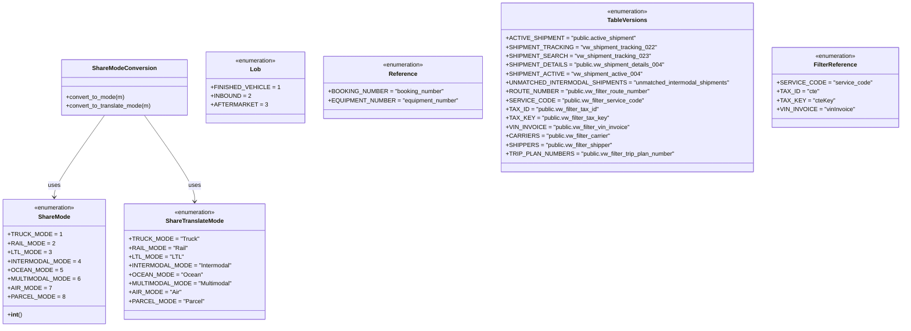

# Diagram: common/fv/python/fv/aws/lambdas/shipments/constants.py


> Auto-generated by Obscura crawlers

## Diagram 1



### SVG

<svg id="container" width="2313.345703125" xmlns="http://www.w3.org/2000/svg" class="classDiagram" height="882" viewBox="0 0 2313.345703125 882" role="graphics-document document" aria-roledescription="class"><style>#container{font-family:"trebuchet ms",verdana,arial,sans-serif;font-size:16px;fill:#333;}@keyframes edge-animation-frame{from{stroke-dashoffset:0;}}@keyframes dash{to{stroke-dashoffset:0;}}#container .edge-animation-slow{stroke-dasharray:9,5!important;stroke-dashoffset:900;animation:dash 50s linear infinite;stroke-linecap:round;}#container .edge-animation-fast{stroke-dasharray:9,5!important;stroke-dashoffset:900;animation:dash 20s linear infinite;stroke-linecap:round;}#container .error-icon{fill:#552222;}#container .error-text{fill:#552222;stroke:#552222;}#container .edge-thickness-normal{stroke-width:1px;}#container .edge-thickness-thick{stroke-width:3.5px;}#container .edge-pattern-solid{stroke-dasharray:0;}#container .edge-thickness-invisible{stroke-width:0;fill:none;}#container .edge-pattern-dashed{stroke-dasharray:3;}#container .edge-pattern-dotted{stroke-dasharray:2;}#container .marker{fill:#333333;stroke:#333333;}#container .marker.cross{stroke:#333333;}#container svg{font-family:"trebuchet ms",verdana,arial,sans-serif;font-size:16px;}#container p{margin:0;}#container g.classGroup text{fill:#9370DB;stroke:none;font-family:"trebuchet ms",verdana,arial,sans-serif;font-size:10px;}#container g.classGroup text .title{font-weight:bolder;}#container .nodeLabel,#container .edgeLabel{color:#131300;}#container .edgeLabel .label rect{fill:#ECECFF;}#container .label text{fill:#131300;}#container .labelBkg{background:#ECECFF;}#container .edgeLabel .label span{background:#ECECFF;}#container .classTitle{font-weight:bolder;}#container .node rect,#container .node circle,#container .node ellipse,#container .node polygon,#container .node path{fill:#ECECFF;stroke:#9370DB;stroke-width:1px;}#container .divider{stroke:#9370DB;stroke-width:1;}#container g.clickable{cursor:pointer;}#container g.classGroup rect{fill:#ECECFF;stroke:#9370DB;}#container g.classGroup line{stroke:#9370DB;stroke-width:1;}#container .classLabel .box{stroke:none;stroke-width:0;fill:#ECECFF;opacity:0.5;}#container .classLabel .label{fill:#9370DB;font-size:10px;}#container .relation{stroke:#333333;stroke-width:1;fill:none;}#container .dashed-line{stroke-dasharray:3;}#container .dotted-line{stroke-dasharray:1 2;}#container #compositionStart,#container .composition{fill:#333333!important;stroke:#333333!important;stroke-width:1;}#container #compositionEnd,#container .composition{fill:#333333!important;stroke:#333333!important;stroke-width:1;}#container #dependencyStart,#container .dependency{fill:#333333!important;stroke:#333333!important;stroke-width:1;}#container #dependencyStart,#container .dependency{fill:#333333!important;stroke:#333333!important;stroke-width:1;}#container #extensionStart,#container .extension{fill:transparent!important;stroke:#333333!important;stroke-width:1;}#container #extensionEnd,#container .extension{fill:transparent!important;stroke:#333333!important;stroke-width:1;}#container #aggregationStart,#container .aggregation{fill:transparent!important;stroke:#333333!important;stroke-width:1;}#container #aggregationEnd,#container .aggregation{fill:transparent!important;stroke:#333333!important;stroke-width:1;}#container #lollipopStart,#container .lollipop{fill:#ECECFF!important;stroke:#333333!important;stroke-width:1;}#container #lollipopEnd,#container .lollipop{fill:#ECECFF!important;stroke:#333333!important;stroke-width:1;}#container .edgeTerminals{font-size:11px;line-height:initial;}#container .classTitleText{text-anchor:middle;font-size:18px;fill:#333;}#container .label-icon{display:inline-block;height:1em;overflow:visible;vertical-align:-0.125em;}#container .node .label-icon path{fill:currentColor;stroke:revert;stroke-width:revert;}#container :root{--mermaid-font-family:"trebuchet ms",verdana,arial,sans-serif;}</style><g><defs><marker id="container_class-aggregationStart" class="marker aggregation class" refX="18" refY="7" markerWidth="190" markerHeight="240" orient="auto"><path d="M 18,7 L9,13 L1,7 L9,1 Z"></path></marker></defs><defs><marker id="container_class-aggregationEnd" class="marker aggregation class" refX="1" refY="7" markerWidth="20" markerHeight="28" orient="auto"><path d="M 18,7 L9,13 L1,7 L9,1 Z"></path></marker></defs><defs><marker id="container_class-extensionStart" class="marker extension class" refX="18" refY="7" markerWidth="190" markerHeight="240" orient="auto"><path d="M 1,7 L18,13 V 1 Z"></path></marker></defs><defs><marker id="container_class-extensionEnd" class="marker extension class" refX="1" refY="7" markerWidth="20" markerHeight="28" orient="auto"><path d="M 1,1 V 13 L18,7 Z"></path></marker></defs><defs><marker id="container_class-compositionStart" class="marker composition class" refX="18" refY="7" markerWidth="190" markerHeight="240" orient="auto"><path d="M 18,7 L9,13 L1,7 L9,1 Z"></path></marker></defs><defs><marker id="container_class-compositionEnd" class="marker composition class" refX="1" refY="7" markerWidth="20" markerHeight="28" orient="auto"><path d="M 18,7 L9,13 L1,7 L9,1 Z"></path></marker></defs><defs><marker id="container_class-dependencyStart" class="marker dependency class" refX="6" refY="7" markerWidth="190" markerHeight="240" orient="auto"><path d="M 5,7 L9,13 L1,7 L9,1 Z"></path></marker></defs><defs><marker id="container_class-dependencyEnd" class="marker dependency class" refX="13" refY="7" markerWidth="20" markerHeight="28" orient="auto"><path d="M 18,7 L9,13 L14,7 L9,1 Z"></path></marker></defs><defs><marker id="container_class-lollipopStart" class="marker lollipop class" refX="13" refY="7" markerWidth="190" markerHeight="240" orient="auto"><circle stroke="black" fill="transparent" cx="7" cy="7" r="6"></circle></marker></defs><defs><marker id="container_class-lollipopEnd" class="marker lollipop class" refX="1" refY="7" markerWidth="190" markerHeight="240" orient="auto"><circle stroke="black" fill="transparent" cx="7" cy="7" r="6"></circle></marker></defs><g class="root"><g class="clusters"></g><g class="edgePaths"><path d="M265.077,311L243.599,342.667C222.121,374.333,179.164,437.667,157.685,474.5C136.207,511.333,136.207,521.667,136.207,526.833L136.207,532" id="id_ShareModeConversion_ShareMode_1" class="edge-thickness-normal edge-pattern-solid relation" style=";;;" data-edge="true" data-et="edge" data-id="id_ShareModeConversion_ShareMode_1" data-points="W3sieCI6MjY1LjA3NzM4Nzk3MTY5ODEsInkiOjMxMX0seyJ4IjoxMzYuMjA3MDMxMjUsInkiOjUwMX0seyJ4IjoxMzYuMjA3MDMxMjUsInkiOjUzOH1d" marker-end="url(#container_class-dependencyEnd)"></path><path d="M366.817,311L388.296,342.667C409.774,374.333,452.731,437.667,474.209,476.5C495.688,515.333,495.688,529.667,495.688,536.833L495.688,544" id="id_ShareModeConversion_ShareTranslateMode_2" class="edge-thickness-normal edge-pattern-solid relation" style=";;;" data-edge="true" data-et="edge" data-id="id_ShareModeConversion_ShareTranslateMode_2" data-points="W3sieCI6MzY2LjgxNzE0MzI3ODMwMTksInkiOjMxMX0seyJ4Ijo0OTUuNjg3NSwieSI6NTAxfSx7IngiOjQ5NS42ODc1LCJ5Ijo1NTB9XQ==" marker-end="url(#container_class-dependencyEnd)"></path></g><g class="edgeLabels"><g class="edgeLabel" transform="translate(136.20703125, 501)"><g class="label" data-id="id_ShareModeConversion_ShareMode_1" transform="translate(-16.4921875, -12)"><foreignObject width="32.984375" height="24"><div xmlns="http://www.w3.org/1999/xhtml" class="labelBkg" style="display: table-cell; white-space: nowrap; line-height: 1.5; max-width: 200px; text-align: center;"><span class="edgeLabel"><p>uses</p></span></div></foreignObject></g></g><g class="edgeLabel" transform="translate(495.6875, 501)"><g class="label" data-id="id_ShareModeConversion_ShareTranslateMode_2" transform="translate(-16.4921875, -12)"><foreignObject width="32.984375" height="24"><div xmlns="http://www.w3.org/1999/xhtml" class="labelBkg" style="display: table-cell; white-space: nowrap; line-height: 1.5; max-width: 200px; text-align: center;"><span class="edgeLabel"><p>uses</p></span></div></foreignObject></g></g></g><g class="nodes"><g class="node default" id="classId-ShareMode-0" transform="translate(136.20703125, 706)"><g class="basic label-container"><path d="M-128.20703125 -168 L128.20703125 -168 L128.20703125 168 L-128.20703125 168" stroke="none" stroke-width="0" fill="#ECECFF" style=""></path><path d="M-128.20703125 -168 C-43.32272918031684 -168, 41.56157288936632 -168, 128.20703125 -168 M-128.20703125 -168 C-57.44739458845049 -168, 13.312242073099014 -168, 128.20703125 -168 M128.20703125 -168 C128.20703125 -94.78701552261516, 128.20703125 -21.574031045230328, 128.20703125 168 M128.20703125 -168 C128.20703125 -73.69373384963278, 128.20703125 20.612532300734443, 128.20703125 168 M128.20703125 168 C56.91206957199654 168, -14.38289210600692 168, -128.20703125 168 M128.20703125 168 C63.188516169122835 168, -1.8299989117543305 168, -128.20703125 168 M-128.20703125 168 C-128.20703125 79.68580473329081, -128.20703125 -8.628390533418383, -128.20703125 -168 M-128.20703125 168 C-128.20703125 44.86377520737365, -128.20703125 -78.2724495852527, -128.20703125 -168" stroke="#9370DB" stroke-width="1.3" fill="none" stroke-dasharray="0 0" style=""></path></g><g class="annotation-group text" transform="translate(-55.5546875, -144)"><g class="label" style="" transform="translate(0,-12)"><foreignObject width="111.109375" height="24"><div xmlns="http://www.w3.org/1999/xhtml" style="display: table-cell; white-space: nowrap; line-height: 1.5; max-width: 161px; text-align: center;"><span class="nodeLabel markdown-node-label" style=""><p>«enumeration»</p></span></div></foreignObject></g></g><g class="label-group text" transform="translate(-41.140625, -120)"><g class="label" style="font-weight: bolder" transform="translate(0,-12)"><foreignObject width="82.28125" height="24"><div xmlns="http://www.w3.org/1999/xhtml" style="display: table-cell; white-space: nowrap; line-height: 1.5; max-width: 131px; text-align: center;"><span class="nodeLabel markdown-node-label" style=""><p>ShareMode</p></span></div></foreignObject></g></g><g class="members-group text" transform="translate(-116.20703125, -72)"><g class="label" style="" transform="translate(0,-12)"><foreignObject width="127.953125" height="24"><div xmlns="http://www.w3.org/1999/xhtml" style="display: table-cell; white-space: nowrap; line-height: 1.5; max-width: 185px; text-align: center;"><span class="nodeLabel markdown-node-label" style=""><p>+TRUCK_MODE = 1</p></span></div></foreignObject></g><g class="label" style="" transform="translate(0,12)"><foreignObject width="114.46875" height="24"><div xmlns="http://www.w3.org/1999/xhtml" style="display: table-cell; white-space: nowrap; line-height: 1.5; max-width: 172px; text-align: center;"><span class="nodeLabel markdown-node-label" style=""><p>+RAIL_MODE = 2</p></span></div></foreignObject></g><g class="label" style="" transform="translate(0,36)"><foreignObject width="105.875" height="24"><div xmlns="http://www.w3.org/1999/xhtml" style="display: table-cell; white-space: nowrap; line-height: 1.5; max-width: 163px; text-align: center;"><span class="nodeLabel markdown-node-label" style=""><p>+LTL_MODE = 3</p></span></div></foreignObject></g><g class="label" style="" transform="translate(0,60)"><foreignObject width="176.328125" height="24"><div xmlns="http://www.w3.org/1999/xhtml" style="display: table-cell; white-space: nowrap; line-height: 1.5; max-width: 234px; text-align: center;"><span class="nodeLabel markdown-node-label" style=""><p>+INTERMODAL_MODE = 4</p></span></div></foreignObject></g><g class="label" style="" transform="translate(0,84)"><foreignObject width="131.71875" height="24"><div xmlns="http://www.w3.org/1999/xhtml" style="display: table-cell; white-space: nowrap; line-height: 1.5; max-width: 189px; text-align: center;"><span class="nodeLabel markdown-node-label" style=""><p>+OCEAN_MODE = 5</p></span></div></foreignObject></g><g class="label" style="" transform="translate(0,108)"><foreignObject width="176.859375" height="24"><div xmlns="http://www.w3.org/1999/xhtml" style="display: table-cell; white-space: nowrap; line-height: 1.5; max-width: 234px; text-align: center;"><span class="nodeLabel markdown-node-label" style=""><p>+MULTIMODAL_MODE = 6</p></span></div></foreignObject></g><g class="label" style="" transform="translate(0,132)"><foreignObject width="105.53125" height="24"><div xmlns="http://www.w3.org/1999/xhtml" style="display: table-cell; white-space: nowrap; line-height: 1.5; max-width: 163px; text-align: center;"><span class="nodeLabel markdown-node-label" style=""><p>+AIR_MODE = 7</p></span></div></foreignObject></g><g class="label" style="" transform="translate(0,156)"><foreignObject width="136.359375" height="24"><div xmlns="http://www.w3.org/1999/xhtml" style="display: table-cell; white-space: nowrap; line-height: 1.5; max-width: 194px; text-align: center;"><span class="nodeLabel markdown-node-label" style=""><p>+PARCEL_MODE = 8</p></span></div></foreignObject></g></g><g class="methods-group text" transform="translate(-116.20703125, 144)"><g class="label" style="" transform="translate(0,-12)"><foreignObject width="38.28125" height="24"><div xmlns="http://www.w3.org/1999/xhtml" style="display: table-cell; white-space: nowrap; line-height: 1.5; max-width: 127px; text-align: center;"><span class="nodeLabel markdown-node-label" style=""><p>+<strong>int</strong>()</p></span></div></foreignObject></g></g><g class="divider" style=""><path d="M-128.20703125 -96 C-42.930123530698054 -96, 42.34678418860389 -96, 128.20703125 -96 M-128.20703125 -96 C-50.95743533856353 -96, 26.292160572872945 -96, 128.20703125 -96" stroke="#9370DB" stroke-width="1.3" fill="none" stroke-dasharray="0 0" style=""></path></g><g class="divider" style=""><path d="M-128.20703125 120 C-70.91687722910899 120, -13.626723208217967 120, 128.20703125 120 M-128.20703125 120 C-69.55018668154412 120, -10.893342113088238 120, 128.20703125 120" stroke="#9370DB" stroke-width="1.3" fill="none" stroke-dasharray="0 0" style=""></path></g></g><g class="node default" id="classId-ShareTranslateMode-1" transform="translate(495.6875, 706)"><g class="basic label-container"><path d="M-181.2734375 -156 L181.2734375 -156 L181.2734375 156 L-181.2734375 156" stroke="none" stroke-width="0" fill="#ECECFF" style=""></path><path d="M-181.2734375 -156 C-63.58125132353143 -156, 54.110934852937135 -156, 181.2734375 -156 M-181.2734375 -156 C-100.38694463507913 -156, -19.500451770158264 -156, 181.2734375 -156 M181.2734375 -156 C181.2734375 -73.81239383876672, 181.2734375 8.375212322466552, 181.2734375 156 M181.2734375 -156 C181.2734375 -61.525176065688484, 181.2734375 32.94964786862303, 181.2734375 156 M181.2734375 156 C41.354258950953465 156, -98.56491959809307 156, -181.2734375 156 M181.2734375 156 C54.565214320441456 156, -72.14300885911709 156, -181.2734375 156 M-181.2734375 156 C-181.2734375 90.96657889321122, -181.2734375 25.93315778642244, -181.2734375 -156 M-181.2734375 156 C-181.2734375 58.3173475621288, -181.2734375 -39.365304875742396, -181.2734375 -156" stroke="#9370DB" stroke-width="1.3" fill="none" stroke-dasharray="0 0" style=""></path></g><g class="annotation-group text" transform="translate(-55.5546875, -132)"><g class="label" style="" transform="translate(0,-12)"><foreignObject width="111.109375" height="24"><div xmlns="http://www.w3.org/1999/xhtml" style="display: table-cell; white-space: nowrap; line-height: 1.5; max-width: 161px; text-align: center;"><span class="nodeLabel markdown-node-label" style=""><p>«enumeration»</p></span></div></foreignObject></g></g><g class="label-group text" transform="translate(-75.09375, -108)"><g class="label" style="font-weight: bolder" transform="translate(0,-12)"><foreignObject width="150.1875" height="24"><div xmlns="http://www.w3.org/1999/xhtml" style="display: table-cell; white-space: nowrap; line-height: 1.5; max-width: 198px; text-align: center;"><span class="nodeLabel markdown-node-label" style=""><p>ShareTranslateMode</p></span></div></foreignObject></g></g><g class="members-group text" transform="translate(-169.2734375, -60)"><g class="label" style="" transform="translate(0,-12)"><foreignObject width="173.078125" height="24"><div xmlns="http://www.w3.org/1999/xhtml" style="display: table-cell; white-space: nowrap; line-height: 1.5; max-width: 230px; text-align: center;"><span class="nodeLabel markdown-node-label" style=""><p>+TRUCK_MODE = "Truck"</p></span></div></foreignObject></g><g class="label" style="" transform="translate(0,12)"><foreignObject width="146.5" height="24"><div xmlns="http://www.w3.org/1999/xhtml" style="display: table-cell; white-space: nowrap; line-height: 1.5; max-width: 204px; text-align: center;"><span class="nodeLabel markdown-node-label" style=""><p>+RAIL_MODE = "Rail"</p></span></div></foreignObject></g><g class="label" style="" transform="translate(0,36)"><foreignObject width="131.9375" height="24"><div xmlns="http://www.w3.org/1999/xhtml" style="display: table-cell; white-space: nowrap; line-height: 1.5; max-width: 189px; text-align: center;"><span class="nodeLabel markdown-node-label" style=""><p>+LTL_MODE = "LTL"</p></span></div></foreignObject></g><g class="label" style="" transform="translate(0,60)"><foreignObject width="260.734375" height="24"><div xmlns="http://www.w3.org/1999/xhtml" style="display: table-cell; white-space: nowrap; line-height: 1.5; max-width: 318px; text-align: center;"><span class="nodeLabel markdown-node-label" style=""><p>+INTERMODAL_MODE = "Intermodal"</p></span></div></foreignObject></g><g class="label" style="" transform="translate(0,84)"><foreignObject width="181.359375" height="24"><div xmlns="http://www.w3.org/1999/xhtml" style="display: table-cell; white-space: nowrap; line-height: 1.5; max-width: 239px; text-align: center;"><span class="nodeLabel markdown-node-label" style=""><p>+OCEAN_MODE = "Ocean"</p></span></div></foreignObject></g><g class="label" style="" transform="translate(0,108)"><foreignObject width="263.453125" height="24"><div xmlns="http://www.w3.org/1999/xhtml" style="display: table-cell; white-space: nowrap; line-height: 1.5; max-width: 321px; text-align: center;"><span class="nodeLabel markdown-node-label" style=""><p>+MULTIMODAL_MODE = "Multimodal"</p></span></div></foreignObject></g><g class="label" style="" transform="translate(0,132)"><foreignObject width="130.625" height="24"><div xmlns="http://www.w3.org/1999/xhtml" style="display: table-cell; white-space: nowrap; line-height: 1.5; max-width: 188px; text-align: center;"><span class="nodeLabel markdown-node-label" style=""><p>+AIR_MODE = "Air"</p></span></div></foreignObject></g><g class="label" style="" transform="translate(0,156)"><foreignObject width="183.625" height="24"><div xmlns="http://www.w3.org/1999/xhtml" style="display: table-cell; white-space: nowrap; line-height: 1.5; max-width: 241px; text-align: center;"><span class="nodeLabel markdown-node-label" style=""><p>+PARCEL_MODE = "Parcel"</p></span></div></foreignObject></g></g><g class="methods-group text" transform="translate(-169.2734375, 156)"></g><g class="divider" style=""><path d="M-181.2734375 -84 C-87.29621220222934 -84, 6.681013095541317 -84, 181.2734375 -84 M-181.2734375 -84 C-108.55794818840428 -84, -35.842458876808564 -84, 181.2734375 -84" stroke="#9370DB" stroke-width="1.3" fill="none" stroke-dasharray="0 0" style=""></path></g><g class="divider" style=""><path d="M-181.2734375 132 C-47.65208454416083 132, 85.96926841167834 132, 181.2734375 132 M-181.2734375 132 C-38.97710743826846 132, 103.31922262346308 132, 181.2734375 132" stroke="#9370DB" stroke-width="1.3" fill="none" stroke-dasharray="0 0" style=""></path></g></g><g class="node default" id="classId-ShareModeConversion-2" transform="translate(315.947265625, 236)"><g class="basic label-container"><path d="M-168.3515625 -75 L168.3515625 -75 L168.3515625 75 L-168.3515625 75" stroke="none" stroke-width="0" fill="#ECECFF" style=""></path><path d="M-168.3515625 -75 C-69.45772739951786 -75, 29.43610770096427 -75, 168.3515625 -75 M-168.3515625 -75 C-37.86738040663482 -75, 92.61680168673035 -75, 168.3515625 -75 M168.3515625 -75 C168.3515625 -29.87371164702469, 168.3515625 15.252576705950617, 168.3515625 75 M168.3515625 -75 C168.3515625 -15.406374217119009, 168.3515625 44.18725156576198, 168.3515625 75 M168.3515625 75 C87.60176098185347 75, 6.851959463706947 75, -168.3515625 75 M168.3515625 75 C69.1125480941634 75, -30.126466311673198 75, -168.3515625 75 M-168.3515625 75 C-168.3515625 34.829383694257835, -168.3515625 -5.34123261148433, -168.3515625 -75 M-168.3515625 75 C-168.3515625 20.518465301433892, -168.3515625 -33.963069397132216, -168.3515625 -75" stroke="#9370DB" stroke-width="1.3" fill="none" stroke-dasharray="0 0" style=""></path></g><g class="annotation-group text" transform="translate(0, -51)"></g><g class="label-group text" transform="translate(-81.796875, -51)"><g class="label" style="font-weight: bolder" transform="translate(0,-12)"><foreignObject width="163.59375" height="24"><div xmlns="http://www.w3.org/1999/xhtml" style="display: table-cell; white-space: nowrap; line-height: 1.5; max-width: 212px; text-align: center;"><span class="nodeLabel markdown-node-label" style=""><p>ShareModeConversion</p></span></div></foreignObject></g></g><g class="members-group text" transform="translate(-156.3515625, -3)"></g><g class="methods-group text" transform="translate(-156.3515625, 27)"><g class="label" style="" transform="translate(0,-12)"><foreignObject width="158.71875" height="24"><div xmlns="http://www.w3.org/1999/xhtml" style="display: table-cell; white-space: nowrap; line-height: 1.5; max-width: 216px; text-align: center;"><span class="nodeLabel markdown-node-label" style=""><p>+convert_to_mode(m)</p></span></div></foreignObject></g><g class="label" style="" transform="translate(0,12)"><foreignObject width="230.90625" height="24"><div xmlns="http://www.w3.org/1999/xhtml" style="display: table-cell; white-space: nowrap; line-height: 1.5; max-width: 288px; text-align: center;"><span class="nodeLabel markdown-node-label" style=""><p>+convert_to_translate_mode(m)</p></span></div></foreignObject></g></g><g class="divider" style=""><path d="M-168.3515625 -27 C-100.43770876011263 -27, -32.523855020225255 -27, 168.3515625 -27 M-168.3515625 -27 C-78.7547252623814 -27, 10.842111975237202 -27, 168.3515625 -27" stroke="#9370DB" stroke-width="1.3" fill="none" stroke-dasharray="0 0" style=""></path></g><g class="divider" style=""><path d="M-168.3515625 -3 C-82.52807781257336 -3, 3.2954068748532848 -3, 168.3515625 -3 M-168.3515625 -3 C-68.57615149270015 -3, 31.199259514599703 -3, 168.3515625 -3" stroke="#9370DB" stroke-width="1.3" fill="none" stroke-dasharray="0 0" style=""></path></g></g><g class="node default" id="classId-Lob-3" transform="translate(655.833984375, 236)"><g class="basic label-container"><path d="M-121.53515625 -96 L121.53515625 -96 L121.53515625 96 L-121.53515625 96" stroke="none" stroke-width="0" fill="#ECECFF" style=""></path><path d="M-121.53515625 -96 C-66.49254719704086 -96, -11.449938144081742 -96, 121.53515625 -96 M-121.53515625 -96 C-70.1900006331748 -96, -18.844845016349595 -96, 121.53515625 -96 M121.53515625 -96 C121.53515625 -42.3710675111805, 121.53515625 11.257864977639002, 121.53515625 96 M121.53515625 -96 C121.53515625 -47.936136715155, 121.53515625 0.1277265696899974, 121.53515625 96 M121.53515625 96 C36.16094098167865 96, -49.2132742866427 96, -121.53515625 96 M121.53515625 96 C37.900789506553124 96, -45.73357723689375 96, -121.53515625 96 M-121.53515625 96 C-121.53515625 26.73934858485157, -121.53515625 -42.52130283029686, -121.53515625 -96 M-121.53515625 96 C-121.53515625 39.222505666177426, -121.53515625 -17.554988667645148, -121.53515625 -96" stroke="#9370DB" stroke-width="1.3" fill="none" stroke-dasharray="0 0" style=""></path></g><g class="annotation-group text" transform="translate(-55.5546875, -72)"><g class="label" style="" transform="translate(0,-12)"><foreignObject width="111.109375" height="24"><div xmlns="http://www.w3.org/1999/xhtml" style="display: table-cell; white-space: nowrap; line-height: 1.5; max-width: 161px; text-align: center;"><span class="nodeLabel markdown-node-label" style=""><p>«enumeration»</p></span></div></foreignObject></g></g><g class="label-group text" transform="translate(-13.359375, -48)"><g class="label" style="font-weight: bolder" transform="translate(0,-12)"><foreignObject width="26.71875" height="24"><div xmlns="http://www.w3.org/1999/xhtml" style="display: table-cell; white-space: nowrap; line-height: 1.5; max-width: 76px; text-align: center;"><span class="nodeLabel markdown-node-label" style=""><p>Lob</p></span></div></foreignObject></g></g><g class="members-group text" transform="translate(-109.53515625, 0)"><g class="label" style="" transform="translate(0,-12)"><foreignObject width="163.515625" height="24"><div xmlns="http://www.w3.org/1999/xhtml" style="display: table-cell; white-space: nowrap; line-height: 1.5; max-width: 221px; text-align: center;"><span class="nodeLabel markdown-node-label" style=""><p>+FINISHED_VEHICLE = 1</p></span></div></foreignObject></g><g class="label" style="" transform="translate(0,12)"><foreignObject width="100.65625" height="24"><div xmlns="http://www.w3.org/1999/xhtml" style="display: table-cell; white-space: nowrap; line-height: 1.5; max-width: 158px; text-align: center;"><span class="nodeLabel markdown-node-label" style=""><p>+INBOUND = 2</p></span></div></foreignObject></g><g class="label" style="" transform="translate(0,36)"><foreignObject width="133.390625" height="24"><div xmlns="http://www.w3.org/1999/xhtml" style="display: table-cell; white-space: nowrap; line-height: 1.5; max-width: 191px; text-align: center;"><span class="nodeLabel markdown-node-label" style=""><p>+AFTERMARKET = 3</p></span></div></foreignObject></g></g><g class="methods-group text" transform="translate(-109.53515625, 96)"></g><g class="divider" style=""><path d="M-121.53515625 -24 C-55.014529917967536 -24, 11.506096414064928 -24, 121.53515625 -24 M-121.53515625 -24 C-61.65180862769142 -24, -1.7684610053828465 -24, 121.53515625 -24" stroke="#9370DB" stroke-width="1.3" fill="none" stroke-dasharray="0 0" style=""></path></g><g class="divider" style=""><path d="M-121.53515625 72 C-70.63278370391316 72, -19.73041115782631 72, 121.53515625 72 M-121.53515625 72 C-57.3299815248276 72, 6.875193200344796 72, 121.53515625 72" stroke="#9370DB" stroke-width="1.3" fill="none" stroke-dasharray="0 0" style=""></path></g></g><g class="node default" id="classId-Reference-4" transform="translate(1034.490234375, 236)"><g class="basic label-container"><path d="M-207.12109375 -84 L207.12109375 -84 L207.12109375 84 L-207.12109375 84" stroke="none" stroke-width="0" fill="#ECECFF" style=""></path><path d="M-207.12109375 -84 C-49.52526283610979 -84, 108.07056807778042 -84, 207.12109375 -84 M-207.12109375 -84 C-84.96153283355285 -84, 37.1980280828943 -84, 207.12109375 -84 M207.12109375 -84 C207.12109375 -19.05667968426222, 207.12109375 45.88664063147556, 207.12109375 84 M207.12109375 -84 C207.12109375 -41.149185834179455, 207.12109375 1.7016283316410892, 207.12109375 84 M207.12109375 84 C55.84193994279994 84, -95.43721386440012 84, -207.12109375 84 M207.12109375 84 C123.77529318431719 84, 40.429492618634384 84, -207.12109375 84 M-207.12109375 84 C-207.12109375 33.721102344054636, -207.12109375 -16.55779531189073, -207.12109375 -84 M-207.12109375 84 C-207.12109375 44.002273498291295, -207.12109375 4.00454699658259, -207.12109375 -84" stroke="#9370DB" stroke-width="1.3" fill="none" stroke-dasharray="0 0" style=""></path></g><g class="annotation-group text" transform="translate(-55.5546875, -60)"><g class="label" style="" transform="translate(0,-12)"><foreignObject width="111.109375" height="24"><div xmlns="http://www.w3.org/1999/xhtml" style="display: table-cell; white-space: nowrap; line-height: 1.5; max-width: 161px; text-align: center;"><span class="nodeLabel markdown-node-label" style=""><p>«enumeration»</p></span></div></foreignObject></g></g><g class="label-group text" transform="translate(-36.5078125, -36)"><g class="label" style="font-weight: bolder" transform="translate(0,-12)"><foreignObject width="73.015625" height="24"><div xmlns="http://www.w3.org/1999/xhtml" style="display: table-cell; white-space: nowrap; line-height: 1.5; max-width: 122px; text-align: center;"><span class="nodeLabel markdown-node-label" style=""><p>Reference</p></span></div></foreignObject></g></g><g class="members-group text" transform="translate(-195.12109375, 12)"><g class="label" style="" transform="translate(0,-12)"><foreignObject width="298.375" height="24"><div xmlns="http://www.w3.org/1999/xhtml" style="display: table-cell; white-space: nowrap; line-height: 1.5; max-width: 356px; text-align: center;"><span class="nodeLabel markdown-node-label" style=""><p>+BOOKING_NUMBER = "booking_number"</p></span></div></foreignObject></g><g class="label" style="" transform="translate(0,12)"><foreignObject width="334.6875" height="24"><div xmlns="http://www.w3.org/1999/xhtml" style="display: table-cell; white-space: nowrap; line-height: 1.5; max-width: 392px; text-align: center;"><span class="nodeLabel markdown-node-label" style=""><p>+EQUIPMENT_NUMBER = "equipment_number"</p></span></div></foreignObject></g></g><g class="methods-group text" transform="translate(-195.12109375, 84)"></g><g class="divider" style=""><path d="M-207.12109375 -12 C-114.89510712041779 -12, -22.66912049083558 -12, 207.12109375 -12 M-207.12109375 -12 C-80.66582362082139 -12, 45.78944650835723 -12, 207.12109375 -12" stroke="#9370DB" stroke-width="1.3" fill="none" stroke-dasharray="0 0" style=""></path></g><g class="divider" style=""><path d="M-207.12109375 60 C-83.19467212941973 60, 40.73174949116054 60, 207.12109375 60 M-207.12109375 60 C-55.80151078922992 60, 95.51807217154015 60, 207.12109375 60" stroke="#9370DB" stroke-width="1.3" fill="none" stroke-dasharray="0 0" style=""></path></g></g><g class="node default" id="classId-TableVersions-5" transform="translate(1616.724609375, 236)"><g class="basic label-container"><path d="M-325.11328125 -228 L325.11328125 -228 L325.11328125 228 L-325.11328125 228" stroke="none" stroke-width="0" fill="#ECECFF" style=""></path><path d="M-325.11328125 -228 C-73.72194804826677 -228, 177.66938515346646 -228, 325.11328125 -228 M-325.11328125 -228 C-136.41701490212048 -228, 52.27925144575903 -228, 325.11328125 -228 M325.11328125 -228 C325.11328125 -118.32785630753378, 325.11328125 -8.655712615067557, 325.11328125 228 M325.11328125 -228 C325.11328125 -96.08759392854176, 325.11328125 35.82481214291647, 325.11328125 228 M325.11328125 228 C191.6159081239308 228, 58.118534997861616 228, -325.11328125 228 M325.11328125 228 C127.50012377790631 228, -70.11303369418738 228, -325.11328125 228 M-325.11328125 228 C-325.11328125 93.45837761633788, -325.11328125 -41.08324476732423, -325.11328125 -228 M-325.11328125 228 C-325.11328125 92.74495117188954, -325.11328125 -42.51009765622092, -325.11328125 -228" stroke="#9370DB" stroke-width="1.3" fill="none" stroke-dasharray="0 0" style=""></path></g><g class="annotation-group text" transform="translate(-55.5546875, -204)"><g class="label" style="" transform="translate(0,-12)"><foreignObject width="111.109375" height="24"><div xmlns="http://www.w3.org/1999/xhtml" style="display: table-cell; white-space: nowrap; line-height: 1.5; max-width: 161px; text-align: center;"><span class="nodeLabel markdown-node-label" style=""><p>«enumeration»</p></span></div></foreignObject></g></g><g class="label-group text" transform="translate(-50.9921875, -180)"><g class="label" style="font-weight: bolder" transform="translate(0,-12)"><foreignObject width="101.984375" height="24"><div xmlns="http://www.w3.org/1999/xhtml" style="display: table-cell; white-space: nowrap; line-height: 1.5; max-width: 150px; text-align: center;"><span class="nodeLabel markdown-node-label" style=""><p>TableVersions</p></span></div></foreignObject></g></g><g class="members-group text" transform="translate(-313.11328125, -132)"><g class="label" style="" transform="translate(0,-12)"><foreignObject width="335.21875" height="24"><div xmlns="http://www.w3.org/1999/xhtml" style="display: table-cell; white-space: nowrap; line-height: 1.5; max-width: 393px; text-align: center;"><span class="nodeLabel markdown-node-label" style=""><p>+ACTIVE_SHIPMENT = "public.active_shipment"</p></span></div></foreignObject></g><g class="label" style="" transform="translate(0,12)"><foreignObject width="382.171875" height="24"><div xmlns="http://www.w3.org/1999/xhtml" style="display: table-cell; white-space: nowrap; line-height: 1.5; max-width: 440px; text-align: center;"><span class="nodeLabel markdown-node-label" style=""><p>+SHIPMENT_TRACKING = "vw_shipment_tracking_022"</p></span></div></foreignObject></g><g class="label" style="" transform="translate(0,36)"><foreignObject width="367.375" height="24"><div xmlns="http://www.w3.org/1999/xhtml" style="display: table-cell; white-space: nowrap; line-height: 1.5; max-width: 425px; text-align: center;"><span class="nodeLabel markdown-node-label" style=""><p>+SHIPMENT_SEARCH = "vw_shipment_tracking_023"</p></span></div></foreignObject></g><g class="label" style="" transform="translate(0,60)"><foreignObject width="408.875" height="24"><div xmlns="http://www.w3.org/1999/xhtml" style="display: table-cell; white-space: nowrap; line-height: 1.5; max-width: 466px; text-align: center;"><span class="nodeLabel markdown-node-label" style=""><p>+SHIPMENT_DETAILS = "public.vw_shipment_details_004"</p></span></div></foreignObject></g><g class="label" style="" transform="translate(0,84)"><foreignObject width="345.765625" height="24"><div xmlns="http://www.w3.org/1999/xhtml" style="display: table-cell; white-space: nowrap; line-height: 1.5; max-width: 403px; text-align: center;"><span class="nodeLabel markdown-node-label" style=""><p>+SHIPMENT_ACTIVE = "vw_shipment_active_004"</p></span></div></foreignObject></g><g class="label" style="" transform="translate(0,108)"><foreignObject width="570.671875" height="24"><div xmlns="http://www.w3.org/1999/xhtml" style="display: table-cell; white-space: nowrap; line-height: 1.5; max-width: 628px; text-align: center;"><span class="nodeLabel markdown-node-label" style=""><p>+UNMATCHED_INTERMODAL_SHIPMENTS = "unmatched_intermodal_shipments"</p></span></div></foreignObject></g><g class="label" style="" transform="translate(0,132)"><foreignObject width="375.90625" height="24"><div xmlns="http://www.w3.org/1999/xhtml" style="display: table-cell; white-space: nowrap; line-height: 1.5; max-width: 433px; text-align: center;"><span class="nodeLabel markdown-node-label" style=""><p>+ROUTE_NUMBER = "public.vw_filter_route_number"</p></span></div></foreignObject></g><g class="label" style="" transform="translate(0,156)"><foreignObject width="351.03125" height="24"><div xmlns="http://www.w3.org/1999/xhtml" style="display: table-cell; white-space: nowrap; line-height: 1.5; max-width: 408px; text-align: center;"><span class="nodeLabel markdown-node-label" style=""><p>+SERVICE_CODE = "public.vw_filter_service_code"</p></span></div></foreignObject></g><g class="label" style="" transform="translate(0,180)"><foreignObject width="246.1875" height="24"><div xmlns="http://www.w3.org/1999/xhtml" style="display: table-cell; white-space: nowrap; line-height: 1.5; max-width: 304px; text-align: center;"><span class="nodeLabel markdown-node-label" style=""><p>+TAX_ID = "public.vw_filter_tax_id"</p></span></div></foreignObject></g><g class="label" style="" transform="translate(0,204)"><foreignObject width="268.359375" height="24"><div xmlns="http://www.w3.org/1999/xhtml" style="display: table-cell; white-space: nowrap; line-height: 1.5; max-width: 326px; text-align: center;"><span class="nodeLabel markdown-node-label" style=""><p>+TAX_KEY = "public.vw_filter_tax_key"</p></span></div></foreignObject></g><g class="label" style="" transform="translate(0,228)"><foreignObject width="325.328125" height="24"><div xmlns="http://www.w3.org/1999/xhtml" style="display: table-cell; white-space: nowrap; line-height: 1.5; max-width: 383px; text-align: center;"><span class="nodeLabel markdown-node-label" style=""><p>+VIN_INVOICE = "public.vw_filter_vin_invoice"</p></span></div></foreignObject></g><g class="label" style="" transform="translate(0,252)"><foreignObject width="270.90625" height="24"><div xmlns="http://www.w3.org/1999/xhtml" style="display: table-cell; white-space: nowrap; line-height: 1.5; max-width: 328px; text-align: center;"><span class="nodeLabel markdown-node-label" style=""><p>+CARRIERS = "public.vw_filter_carrier"</p></span></div></foreignObject></g><g class="label" style="" transform="translate(0,276)"><foreignObject width="278.59375" height="24"><div xmlns="http://www.w3.org/1999/xhtml" style="display: table-cell; white-space: nowrap; line-height: 1.5; max-width: 336px; text-align: center;"><span class="nodeLabel markdown-node-label" style=""><p>+SHIPPERS = "public.vw_filter_shipper"</p></span></div></foreignObject></g><g class="label" style="" transform="translate(0,300)"><foreignObject width="439.28125" height="24"><div xmlns="http://www.w3.org/1999/xhtml" style="display: table-cell; white-space: nowrap; line-height: 1.5; max-width: 497px; text-align: center;"><span class="nodeLabel markdown-node-label" style=""><p>+TRIP_PLAN_NUMBERS = "public.vw_filter_trip_plan_number"</p></span></div></foreignObject></g></g><g class="methods-group text" transform="translate(-313.11328125, 228)"></g><g class="divider" style=""><path d="M-325.11328125 -156 C-159.84355507825362 -156, 5.426171093492769 -156, 325.11328125 -156 M-325.11328125 -156 C-191.1554432138165 -156, -57.19760517763302 -156, 325.11328125 -156" stroke="#9370DB" stroke-width="1.3" fill="none" stroke-dasharray="0 0" style=""></path></g><g class="divider" style=""><path d="M-325.11328125 204 C-97.2720329344055 204, 130.569215381189 204, 325.11328125 204 M-325.11328125 204 C-187.15621552495872 204, -49.19914979991745 204, 325.11328125 204" stroke="#9370DB" stroke-width="1.3" fill="none" stroke-dasharray="0 0" style=""></path></g></g><g class="node default" id="classId-FilterReference-6" transform="translate(2148.591796875, 236)"><g class="basic label-container"><path d="M-156.75390625 -108 L156.75390625 -108 L156.75390625 108 L-156.75390625 108" stroke="none" stroke-width="0" fill="#ECECFF" style=""></path><path d="M-156.75390625 -108 C-43.50821134819769 -108, 69.73748355360462 -108, 156.75390625 -108 M-156.75390625 -108 C-64.00217392146963 -108, 28.749558407060732 -108, 156.75390625 -108 M156.75390625 -108 C156.75390625 -52.043091708875465, 156.75390625 3.913816582249069, 156.75390625 108 M156.75390625 -108 C156.75390625 -48.269252438584395, 156.75390625 11.46149512283121, 156.75390625 108 M156.75390625 108 C72.52120811536274 108, -11.711490019274521 108, -156.75390625 108 M156.75390625 108 C53.1239361708551 108, -50.506033908289794 108, -156.75390625 108 M-156.75390625 108 C-156.75390625 30.422088666402203, -156.75390625 -47.155822667195594, -156.75390625 -108 M-156.75390625 108 C-156.75390625 48.63540027883759, -156.75390625 -10.729199442324827, -156.75390625 -108" stroke="#9370DB" stroke-width="1.3" fill="none" stroke-dasharray="0 0" style=""></path></g><g class="annotation-group text" transform="translate(-55.5546875, -84)"><g class="label" style="" transform="translate(0,-12)"><foreignObject width="111.109375" height="24"><div xmlns="http://www.w3.org/1999/xhtml" style="display: table-cell; white-space: nowrap; line-height: 1.5; max-width: 161px; text-align: center;"><span class="nodeLabel markdown-node-label" style=""><p>«enumeration»</p></span></div></foreignObject></g></g><g class="label-group text" transform="translate(-55.375, -60)"><g class="label" style="font-weight: bolder" transform="translate(0,-12)"><foreignObject width="110.75" height="24"><div xmlns="http://www.w3.org/1999/xhtml" style="display: table-cell; white-space: nowrap; line-height: 1.5; max-width: 159px; text-align: center;"><span class="nodeLabel markdown-node-label" style=""><p>FilterReference</p></span></div></foreignObject></g></g><g class="members-group text" transform="translate(-144.75390625, -12)"><g class="label" style="" transform="translate(0,-12)"><foreignObject width="233.953125" height="24"><div xmlns="http://www.w3.org/1999/xhtml" style="display: table-cell; white-space: nowrap; line-height: 1.5; max-width: 291px; text-align: center;"><span class="nodeLabel markdown-node-label" style=""><p>+SERVICE_CODE = "service_code"</p></span></div></foreignObject></g><g class="label" style="" transform="translate(0,12)"><foreignObject width="106.640625" height="24"><div xmlns="http://www.w3.org/1999/xhtml" style="display: table-cell; white-space: nowrap; line-height: 1.5; max-width: 164px; text-align: center;"><span class="nodeLabel markdown-node-label" style=""><p>+TAX_ID = "cte"</p></span></div></foreignObject></g><g class="label" style="" transform="translate(0,36)"><foreignObject width="144.21875" height="24"><div xmlns="http://www.w3.org/1999/xhtml" style="display: table-cell; white-space: nowrap; line-height: 1.5; max-width: 202px; text-align: center;"><span class="nodeLabel markdown-node-label" style=""><p>+TAX_KEY = "cteKey"</p></span></div></foreignObject></g><g class="label" style="" transform="translate(0,60)"><foreignObject width="200.78125" height="24"><div xmlns="http://www.w3.org/1999/xhtml" style="display: table-cell; white-space: nowrap; line-height: 1.5; max-width: 258px; text-align: center;"><span class="nodeLabel markdown-node-label" style=""><p>+VIN_INVOICE = "vinInvoice"</p></span></div></foreignObject></g></g><g class="methods-group text" transform="translate(-144.75390625, 108)"></g><g class="divider" style=""><path d="M-156.75390625 -36 C-87.98594462139609 -36, -19.217982992792173 -36, 156.75390625 -36 M-156.75390625 -36 C-86.31898255282628 -36, -15.884058855652569 -36, 156.75390625 -36" stroke="#9370DB" stroke-width="1.3" fill="none" stroke-dasharray="0 0" style=""></path></g><g class="divider" style=""><path d="M-156.75390625 84 C-71.14658280696901 84, 14.460740636061985 84, 156.75390625 84 M-156.75390625 84 C-67.80632641971003 84, 21.141253410579935 84, 156.75390625 84" stroke="#9370DB" stroke-width="1.3" fill="none" stroke-dasharray="0 0" style=""></path></g></g></g></g></g></svg>

## Diagram 2

```mermaid
flowchart LR
  subgraph ConvertToMode
    A[ShareTranslateMode.TRUCK_MODE "Truck"] -->|==>| M_TRUCK[1]
    B[ShareTranslateMode.RAIL_MODE "Rail"] -->|==>| M_RAIL[2]
    C[ShareTranslateMode.LTL_MODE "LTL"] -->|==>| M_LTL[3]
    D[ShareTranslateMode.INTERMODAL_MODE "Intermodal"] -->|==>| M_INTERMODAL[4]
    E[ShareTranslateMode.OCEAN_MODE "Ocean"] -->|==>| M_OCEAN[5]
    F[ShareTranslateMode.MULTIMODAL_MODE "Multimodal"] -->|==>| M_MULTIMODAL[6]
    G[ShareTranslateMode.AIR_MODE "Air"] -->|==>| M_AIR[7]
    H[ShareTranslateMode.PARCEL_MODE "Parcel"] -->|==>| M_PARCEL[8]
    A & B & C & D & E & F & G & H --> ShareModeConversion_convert_to_mode[/convert_to_mode(m)/]
    ShareModeConversion_convert_to_mode --> M_TRUCK & M_RAIL & M_LTL & M_INTERMODAL & M_OCEAN & M_MULTIMODAL & M_AIR & M_PARCEL
  end

  subgraph ConvertToTranslateMode
    m1[ShareMode.TRUCK_MODE(1)] -->|==>| t1["Truck"]
    m2[ShareMode.RAIL_MODE(2)] -->|==>| t2["Rail"]
    m3[ShareMode.LTL_MODE(3)] -->|==>| t3["LTL"]
    m4[ShareMode.INTERMODAL_MODE(4)] -->|==>| t4["Intermodal"]
    m5[ShareMode.OCEAN_MODE(5)] -->|==>| t5["Ocean"]
    m6[ShareMode.MULTIMODAL_MODE(6)] -->|==>| t6["Multimodal"]
    m7[ShareMode.AIR_MODE(7)] -->|==>| t7["Air"]
    m8[ShareMode.PARCEL_MODE(8)] -->|==>| t8["Parcel"]
    m1 & m2 & m3 & m4 & m5 & m6 & m7 & m8 --> ShareModeConversion_convert_to_translate_mode[/convert_to_translate_mode(m)/]
    ShareModeConversion_convert_to_translate_mode --> t1 & t2 & t3 & t4 & t5 & t6 & t7 & t8
  end
```

> SVG rendering failed for this diagram.
