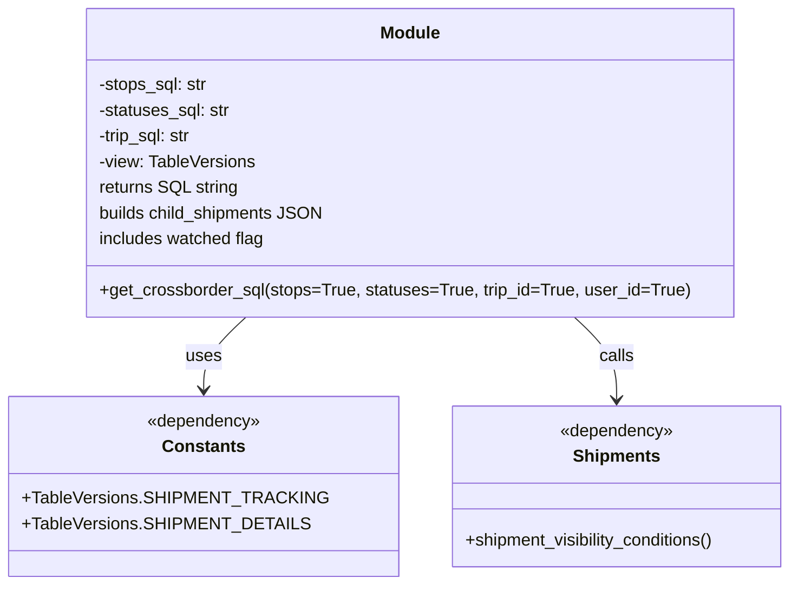

# Diagram: common/fv/python/fv/aws/lambdas/shipments/crossborder.py


> Auto-generated by Obscura crawlers

## Diagram 1



### SVG

<svg id="container" width="723.453125" xmlns="http://www.w3.org/2000/svg" class="classDiagram" height="546" viewBox="0 0 723.453125 546" role="graphics-document document" aria-roledescription="class"><style>#container{font-family:"trebuchet ms",verdana,arial,sans-serif;font-size:16px;fill:#333;}@keyframes edge-animation-frame{from{stroke-dashoffset:0;}}@keyframes dash{to{stroke-dashoffset:0;}}#container .edge-animation-slow{stroke-dasharray:9,5!important;stroke-dashoffset:900;animation:dash 50s linear infinite;stroke-linecap:round;}#container .edge-animation-fast{stroke-dasharray:9,5!important;stroke-dashoffset:900;animation:dash 20s linear infinite;stroke-linecap:round;}#container .error-icon{fill:#552222;}#container .error-text{fill:#552222;stroke:#552222;}#container .edge-thickness-normal{stroke-width:1px;}#container .edge-thickness-thick{stroke-width:3.5px;}#container .edge-pattern-solid{stroke-dasharray:0;}#container .edge-thickness-invisible{stroke-width:0;fill:none;}#container .edge-pattern-dashed{stroke-dasharray:3;}#container .edge-pattern-dotted{stroke-dasharray:2;}#container .marker{fill:#333333;stroke:#333333;}#container .marker.cross{stroke:#333333;}#container svg{font-family:"trebuchet ms",verdana,arial,sans-serif;font-size:16px;}#container p{margin:0;}#container g.classGroup text{fill:#9370DB;stroke:none;font-family:"trebuchet ms",verdana,arial,sans-serif;font-size:10px;}#container g.classGroup text .title{font-weight:bolder;}#container .nodeLabel,#container .edgeLabel{color:#131300;}#container .edgeLabel .label rect{fill:#ECECFF;}#container .label text{fill:#131300;}#container .labelBkg{background:#ECECFF;}#container .edgeLabel .label span{background:#ECECFF;}#container .classTitle{font-weight:bolder;}#container .node rect,#container .node circle,#container .node ellipse,#container .node polygon,#container .node path{fill:#ECECFF;stroke:#9370DB;stroke-width:1px;}#container .divider{stroke:#9370DB;stroke-width:1;}#container g.clickable{cursor:pointer;}#container g.classGroup rect{fill:#ECECFF;stroke:#9370DB;}#container g.classGroup line{stroke:#9370DB;stroke-width:1;}#container .classLabel .box{stroke:none;stroke-width:0;fill:#ECECFF;opacity:0.5;}#container .classLabel .label{fill:#9370DB;font-size:10px;}#container .relation{stroke:#333333;stroke-width:1;fill:none;}#container .dashed-line{stroke-dasharray:3;}#container .dotted-line{stroke-dasharray:1 2;}#container #compositionStart,#container .composition{fill:#333333!important;stroke:#333333!important;stroke-width:1;}#container #compositionEnd,#container .composition{fill:#333333!important;stroke:#333333!important;stroke-width:1;}#container #dependencyStart,#container .dependency{fill:#333333!important;stroke:#333333!important;stroke-width:1;}#container #dependencyStart,#container .dependency{fill:#333333!important;stroke:#333333!important;stroke-width:1;}#container #extensionStart,#container .extension{fill:transparent!important;stroke:#333333!important;stroke-width:1;}#container #extensionEnd,#container .extension{fill:transparent!important;stroke:#333333!important;stroke-width:1;}#container #aggregationStart,#container .aggregation{fill:transparent!important;stroke:#333333!important;stroke-width:1;}#container #aggregationEnd,#container .aggregation{fill:transparent!important;stroke:#333333!important;stroke-width:1;}#container #lollipopStart,#container .lollipop{fill:#ECECFF!important;stroke:#333333!important;stroke-width:1;}#container #lollipopEnd,#container .lollipop{fill:#ECECFF!important;stroke:#333333!important;stroke-width:1;}#container .edgeTerminals{font-size:11px;line-height:initial;}#container .classTitleText{text-anchor:middle;font-size:18px;fill:#333;}#container .label-icon{display:inline-block;height:1em;overflow:visible;vertical-align:-0.125em;}#container .node .label-icon path{fill:currentColor;stroke:revert;stroke-width:revert;}#container :root{--mermaid-font-family:"trebuchet ms",verdana,arial,sans-serif;}</style><g><defs><marker id="container_class-aggregationStart" class="marker aggregation class" refX="18" refY="7" markerWidth="190" markerHeight="240" orient="auto"><path d="M 18,7 L9,13 L1,7 L9,1 Z"></path></marker></defs><defs><marker id="container_class-aggregationEnd" class="marker aggregation class" refX="1" refY="7" markerWidth="20" markerHeight="28" orient="auto"><path d="M 18,7 L9,13 L1,7 L9,1 Z"></path></marker></defs><defs><marker id="container_class-extensionStart" class="marker extension class" refX="18" refY="7" markerWidth="190" markerHeight="240" orient="auto"><path d="M 1,7 L18,13 V 1 Z"></path></marker></defs><defs><marker id="container_class-extensionEnd" class="marker extension class" refX="1" refY="7" markerWidth="20" markerHeight="28" orient="auto"><path d="M 1,1 V 13 L18,7 Z"></path></marker></defs><defs><marker id="container_class-compositionStart" class="marker composition class" refX="18" refY="7" markerWidth="190" markerHeight="240" orient="auto"><path d="M 18,7 L9,13 L1,7 L9,1 Z"></path></marker></defs><defs><marker id="container_class-compositionEnd" class="marker composition class" refX="1" refY="7" markerWidth="20" markerHeight="28" orient="auto"><path d="M 18,7 L9,13 L1,7 L9,1 Z"></path></marker></defs><defs><marker id="container_class-dependencyStart" class="marker dependency class" refX="6" refY="7" markerWidth="190" markerHeight="240" orient="auto"><path d="M 5,7 L9,13 L1,7 L9,1 Z"></path></marker></defs><defs><marker id="container_class-dependencyEnd" class="marker dependency class" refX="13" refY="7" markerWidth="20" markerHeight="28" orient="auto"><path d="M 18,7 L9,13 L14,7 L9,1 Z"></path></marker></defs><defs><marker id="container_class-lollipopStart" class="marker lollipop class" refX="13" refY="7" markerWidth="190" markerHeight="240" orient="auto"><circle stroke="black" fill="transparent" cx="7" cy="7" r="6"></circle></marker></defs><defs><marker id="container_class-lollipopEnd" class="marker lollipop class" refX="1" refY="7" markerWidth="190" markerHeight="240" orient="auto"><circle stroke="black" fill="transparent" cx="7" cy="7" r="6"></circle></marker></defs><g class="root"><g class="clusters"></g><g class="edgePaths"><path d="M216.721,296L210.27,302.167C203.818,308.333,190.915,320.667,184.463,332C178.012,343.333,178.012,353.667,178.012,358.833L178.012,364" id="id_Module_Constants_1" class="edge-thickness-normal edge-pattern-solid relation" style=";;;" data-edge="true" data-et="edge" data-id="id_Module_Constants_1" data-points="W3sieCI6MjE2LjcyMTMzOTc3OTAwNTUyLCJ5IjoyOTZ9LHsieCI6MTc4LjAxMTcxODc1LCJ5IjozMzN9LHsieCI6MTc4LjAxMTcxODc1LCJ5IjozNzB9XQ==" marker-end="url(#container_class-dependencyEnd)"></path><path d="M518.029,296L524.48,302.167C530.932,308.333,543.835,320.667,550.287,333.5C556.738,346.333,556.738,359.667,556.738,366.333L556.738,373" id="id_Module_Shipments_2" class="edge-thickness-normal edge-pattern-solid relation" style=";;;" data-edge="true" data-et="edge" data-id="id_Module_Shipments_2" data-points="W3sieCI6NTE4LjAyODY2MDIyMDk5NDQsInkiOjI5Nn0seyJ4Ijo1NTYuNzM4MjgxMjUsInkiOjMzM30seyJ4Ijo1NTYuNzM4MjgxMjUsInkiOjM3OX1d" marker-end="url(#container_class-dependencyEnd)"></path></g><g class="edgeLabels"><g class="edgeLabel" transform="translate(178.01171875, 333)"><g class="label" data-id="id_Module_Constants_1" transform="translate(-16.4921875, -12)"><foreignObject width="32.984375" height="24"><div xmlns="http://www.w3.org/1999/xhtml" class="labelBkg" style="display: table-cell; white-space: nowrap; line-height: 1.5; max-width: 200px; text-align: center;"><span class="edgeLabel"><p>uses</p></span></div></foreignObject></g></g><g class="edgeLabel" transform="translate(556.73828125, 333)"><g class="label" data-id="id_Module_Shipments_2" transform="translate(-16.4453125, -12)"><foreignObject width="32.890625" height="24"><div xmlns="http://www.w3.org/1999/xhtml" class="labelBkg" style="display: table-cell; white-space: nowrap; line-height: 1.5; max-width: 200px; text-align: center;"><span class="edgeLabel"><p>calls</p></span></div></foreignObject></g></g></g><g class="nodes"><g class="node default" id="classId-Module-0" transform="translate(367.375, 152)"><g class="basic label-container"><path d="M-299.8984375 -144 L299.8984375 -144 L299.8984375 144 L-299.8984375 144" stroke="none" stroke-width="0" fill="#ECECFF" style=""></path><path d="M-299.8984375 -144 C-159.1125815023347 -144, -18.32672550466941 -144, 299.8984375 -144 M-299.8984375 -144 C-86.66283385855567 -144, 126.57276978288866 -144, 299.8984375 -144 M299.8984375 -144 C299.8984375 -46.261977916693056, 299.8984375 51.47604416661389, 299.8984375 144 M299.8984375 -144 C299.8984375 -31.730286978898917, 299.8984375 80.53942604220217, 299.8984375 144 M299.8984375 144 C137.1692869260561 144, -25.559863647887823 144, -299.8984375 144 M299.8984375 144 C142.6887331780143 144, -14.520971143971394 144, -299.8984375 144 M-299.8984375 144 C-299.8984375 33.3113623892158, -299.8984375 -77.3772752215684, -299.8984375 -144 M-299.8984375 144 C-299.8984375 64.77705042758832, -299.8984375 -14.445899144823358, -299.8984375 -144" stroke="#9370DB" stroke-width="1.3" fill="none" stroke-dasharray="0 0" style=""></path></g><g class="annotation-group text" transform="translate(0, -120)"></g><g class="label-group text" transform="translate(-27.09375, -120)"><g class="label" style="font-weight: bolder" transform="translate(0,-12)"><foreignObject width="54.1875" height="24"><div xmlns="http://www.w3.org/1999/xhtml" style="display: table-cell; white-space: nowrap; line-height: 1.5; max-width: 104px; text-align: center;"><span class="nodeLabel markdown-node-label" style=""><p>Module</p></span></div></foreignObject></g></g><g class="members-group text" transform="translate(-287.8984375, -72)"><g class="label" style="" transform="translate(0,-12)"><foreignObject width="103.171875" height="24"><div xmlns="http://www.w3.org/1999/xhtml" style="display: table-cell; white-space: nowrap; line-height: 1.5; max-width: 161px; text-align: center;"><span class="nodeLabel markdown-node-label" style=""><p>-stops_sql: str</p></span></div></foreignObject></g><g class="label" style="" transform="translate(0,12)"><foreignObject width="124.4375" height="24"><div xmlns="http://www.w3.org/1999/xhtml" style="display: table-cell; white-space: nowrap; line-height: 1.5; max-width: 183px; text-align: center;"><span class="nodeLabel markdown-node-label" style=""><p>-statuses_sql: str</p></span></div></foreignObject></g><g class="label" style="" transform="translate(0,36)"><foreignObject width="89.734375" height="24"><div xmlns="http://www.w3.org/1999/xhtml" style="display: table-cell; white-space: nowrap; line-height: 1.5; max-width: 148px; text-align: center;"><span class="nodeLabel markdown-node-label" style=""><p>-trip_sql: str</p></span></div></foreignObject></g><g class="label" style="" transform="translate(0,60)"><foreignObject width="147.359375" height="24"><div xmlns="http://www.w3.org/1999/xhtml" style="display: table-cell; white-space: nowrap; line-height: 1.5; max-width: 205px; text-align: center;"><span class="nodeLabel markdown-node-label" style=""><p>-view: TableVersions</p></span></div></foreignObject></g><g class="label" style="" transform="translate(0,84)"><foreignObject width="130.390625" height="24"><div xmlns="http://www.w3.org/1999/xhtml" style="display: table-cell; white-space: nowrap; line-height: 1.5; max-width: 181px; text-align: center;"><span class="nodeLabel markdown-node-label" style=""><p>returns SQL string</p></span></div></foreignObject></g><g class="label" style="" transform="translate(0,108)"><foreignObject width="209.015625" height="24"><div xmlns="http://www.w3.org/1999/xhtml" style="display: table-cell; white-space: nowrap; line-height: 1.5; max-width: 259px; text-align: center;"><span class="nodeLabel markdown-node-label" style=""><p>builds child_shipments JSON</p></span></div></foreignObject></g><g class="label" style="" transform="translate(0,132)"><foreignObject width="156.875" height="24"><div xmlns="http://www.w3.org/1999/xhtml" style="display: table-cell; white-space: nowrap; line-height: 1.5; max-width: 208px; text-align: center;"><span class="nodeLabel markdown-node-label" style=""><p>includes watched flag</p></span></div></foreignObject></g></g><g class="methods-group text" transform="translate(-287.8984375, 120)"><g class="label" style="" transform="translate(0,-12)"><foreignObject width="548.703125" height="24"><div xmlns="http://www.w3.org/1999/xhtml" style="display: table-cell; white-space: nowrap; line-height: 1.5; max-width: 606px; text-align: center;"><span class="nodeLabel markdown-node-label" style=""><p>+get_crossborder_sql(stops=True, statuses=True, trip_id=True, user_id=True)</p></span></div></foreignObject></g></g><g class="divider" style=""><path d="M-299.8984375 -96 C-151.0197812664742 -96, -2.1411250329484233 -96, 299.8984375 -96 M-299.8984375 -96 C-178.3371966148435 -96, -56.775955729686984 -96, 299.8984375 -96" stroke="#9370DB" stroke-width="1.3" fill="none" stroke-dasharray="0 0" style=""></path></g><g class="divider" style=""><path d="M-299.8984375 96 C-80.64342199386294 96, 138.6115935122741 96, 299.8984375 96 M-299.8984375 96 C-84.69007220683295 96, 130.5182930863341 96, 299.8984375 96" stroke="#9370DB" stroke-width="1.3" fill="none" stroke-dasharray="0 0" style=""></path></g></g><g class="node default" id="classId-Constants-1" transform="translate(178.01171875, 454)"><g class="basic label-container"><path d="M-170.01171875 -84 L170.01171875 -84 L170.01171875 84 L-170.01171875 84" stroke="none" stroke-width="0" fill="#ECECFF" style=""></path><path d="M-170.01171875 -84 C-46.56255649089111 -84, 76.88660576821778 -84, 170.01171875 -84 M-170.01171875 -84 C-45.58370610810496 -84, 78.84430653379007 -84, 170.01171875 -84 M170.01171875 -84 C170.01171875 -27.637020408634932, 170.01171875 28.725959182730136, 170.01171875 84 M170.01171875 -84 C170.01171875 -48.993277446223956, 170.01171875 -13.986554892447913, 170.01171875 84 M170.01171875 84 C83.98759674213562 84, -2.0365252657287556 84, -170.01171875 84 M170.01171875 84 C51.82477226715588 84, -66.36217421568824 84, -170.01171875 84 M-170.01171875 84 C-170.01171875 49.272550678050145, -170.01171875 14.54510135610029, -170.01171875 -84 M-170.01171875 84 C-170.01171875 35.01893866901867, -170.01171875 -13.962122661962667, -170.01171875 -84" stroke="#9370DB" stroke-width="1.3" fill="none" stroke-dasharray="0 0" style=""></path></g><g class="annotation-group text" transform="translate(-53.5078125, -60)"><g class="label" style="" transform="translate(0,-12)"><foreignObject width="107.015625" height="24"><div xmlns="http://www.w3.org/1999/xhtml" style="display: table-cell; white-space: nowrap; line-height: 1.5; max-width: 157px; text-align: center;"><span class="nodeLabel markdown-node-label" style=""><p>«dependency»</p></span></div></foreignObject></g></g><g class="label-group text" transform="translate(-36.5390625, -36)"><g class="label" style="font-weight: bolder" transform="translate(0,-12)"><foreignObject width="73.078125" height="24"><div xmlns="http://www.w3.org/1999/xhtml" style="display: table-cell; white-space: nowrap; line-height: 1.5; max-width: 122px; text-align: center;"><span class="nodeLabel markdown-node-label" style=""><p>Constants</p></span></div></foreignObject></g></g><g class="members-group text" transform="translate(-158.01171875, 12)"><g class="label" style="" transform="translate(0,-12)"><foreignObject width="262.515625" height="24"><div xmlns="http://www.w3.org/1999/xhtml" style="display: table-cell; white-space: nowrap; line-height: 1.5; max-width: 320px; text-align: center;"><span class="nodeLabel markdown-node-label" style=""><p>+TableVersions.SHIPMENT_TRACKING</p></span></div></foreignObject></g><g class="label" style="" transform="translate(0,12)"><foreignObject width="248.90625" height="24"><div xmlns="http://www.w3.org/1999/xhtml" style="display: table-cell; white-space: nowrap; line-height: 1.5; max-width: 307px; text-align: center;"><span class="nodeLabel markdown-node-label" style=""><p>+TableVersions.SHIPMENT_DETAILS</p></span></div></foreignObject></g></g><g class="methods-group text" transform="translate(-158.01171875, 84)"></g><g class="divider" style=""><path d="M-170.01171875 -12 C-85.61776745024942 -12, -1.223816150498834 -12, 170.01171875 -12 M-170.01171875 -12 C-46.25662239458204 -12, 77.49847396083592 -12, 170.01171875 -12" stroke="#9370DB" stroke-width="1.3" fill="none" stroke-dasharray="0 0" style=""></path></g><g class="divider" style=""><path d="M-170.01171875 60 C-69.2028869239024 60, 31.605944902195205 60, 170.01171875 60 M-170.01171875 60 C-67.53686550718587 60, 34.93798773562827 60, 170.01171875 60" stroke="#9370DB" stroke-width="1.3" fill="none" stroke-dasharray="0 0" style=""></path></g></g><g class="node default" id="classId-Shipments-2" transform="translate(556.73828125, 454)"><g class="basic label-container"><path d="M-158.71484375 -75 L158.71484375 -75 L158.71484375 75 L-158.71484375 75" stroke="none" stroke-width="0" fill="#ECECFF" style=""></path><path d="M-158.71484375 -75 C-68.96880778103333 -75, 20.777228187933332 -75, 158.71484375 -75 M-158.71484375 -75 C-64.5329839096199 -75, 29.648875930760198 -75, 158.71484375 -75 M158.71484375 -75 C158.71484375 -33.454692188123694, 158.71484375 8.090615623752612, 158.71484375 75 M158.71484375 -75 C158.71484375 -20.201548418792875, 158.71484375 34.59690316241425, 158.71484375 75 M158.71484375 75 C81.82484818990416 75, 4.934852629808319 75, -158.71484375 75 M158.71484375 75 C82.48064605476753 75, 6.246448359535066 75, -158.71484375 75 M-158.71484375 75 C-158.71484375 32.04239595334092, -158.71484375 -10.915208093318157, -158.71484375 -75 M-158.71484375 75 C-158.71484375 16.601590182766017, -158.71484375 -41.796819634467965, -158.71484375 -75" stroke="#9370DB" stroke-width="1.3" fill="none" stroke-dasharray="0 0" style=""></path></g><g class="annotation-group text" transform="translate(-53.5078125, -51)"><g class="label" style="" transform="translate(0,-12)"><foreignObject width="107.015625" height="24"><div xmlns="http://www.w3.org/1999/xhtml" style="display: table-cell; white-space: nowrap; line-height: 1.5; max-width: 157px; text-align: center;"><span class="nodeLabel markdown-node-label" style=""><p>«dependency»</p></span></div></foreignObject></g></g><g class="label-group text" transform="translate(-38.96875, -27)"><g class="label" style="font-weight: bolder" transform="translate(0,-12)"><foreignObject width="77.9375" height="24"><div xmlns="http://www.w3.org/1999/xhtml" style="display: table-cell; white-space: nowrap; line-height: 1.5; max-width: 127px; text-align: center;"><span class="nodeLabel markdown-node-label" style=""><p>Shipments</p></span></div></foreignObject></g></g><g class="members-group text" transform="translate(-146.71484375, 21)"></g><g class="methods-group text" transform="translate(-146.71484375, 51)"><g class="label" style="" transform="translate(0,-12)"><foreignObject width="239.921875" height="24"><div xmlns="http://www.w3.org/1999/xhtml" style="display: table-cell; white-space: nowrap; line-height: 1.5; max-width: 297px; text-align: center;"><span class="nodeLabel markdown-node-label" style=""><p>+shipment_visibility_conditions()</p></span></div></foreignObject></g></g><g class="divider" style=""><path d="M-158.71484375 -3 C-79.66221733049105 -3, -0.6095909109820923 -3, 158.71484375 -3 M-158.71484375 -3 C-86.8427549042806 -3, -14.970666058561193 -3, 158.71484375 -3" stroke="#9370DB" stroke-width="1.3" fill="none" stroke-dasharray="0 0" style=""></path></g><g class="divider" style=""><path d="M-158.71484375 21 C-57.105559313238786 21, 44.50372512352243 21, 158.71484375 21 M-158.71484375 21 C-86.69754794439451 21, -14.68025213878903 21, 158.71484375 21" stroke="#9370DB" stroke-width="1.3" fill="none" stroke-dasharray="0 0" style=""></path></g></g></g></g></g></svg>

## Diagram 2

```mermaid
flowchart TD
    Start([start]) --> Init[Initialize variables\nstops_sql, statuses_sql, trip_sql, view=SHIPMENT_TRACKING]
    Init --> CheckStops{stops?}
    CheckStops -- yes --> BuildStops[Append stops SQL fragment\nbuilds shipment_stops JSON]
    CheckStops -- no --> NoStops[no stops fragment]
    BuildStops --> CheckStatuses{statuses?}
    NoStops --> CheckStatuses
    CheckStatuses -- yes --> BuildStatuses[Append statuses SQL fragment\nbuilds shipment_statuses JSON]
    CheckStatuses -- no --> NoStatuses
    BuildStatuses --> CheckTrip{trip_id?}
    NoStatuses --> CheckTrip
    CheckTrip -- yes --> BuildTrip[Append trip SQL fragment\nset view=SHIPMENT_DETAILS\ncall shipment_visibility_conditions()]
    CheckTrip -- no --> NoTrip
    BuildTrip --> Assemble[Assemble final SELECT SQL\ninclude child_shipments subselect and watched flag]
    NoTrip --> Assemble
    Assemble --> Return[/return SQL string/]
    Return --> End([end])
```

> SVG rendering failed for this diagram.
