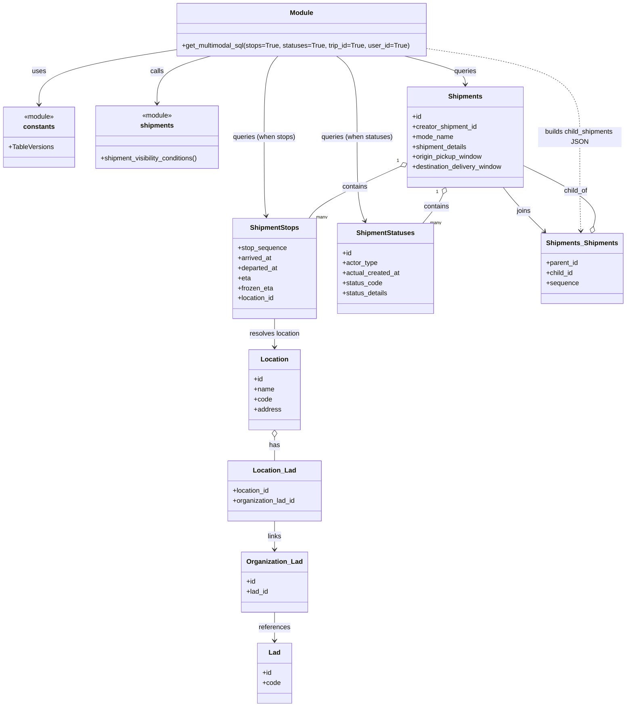

# Diagram: common/fv/python/fv/aws/lambdas/shipments/multimodal.py

> Auto-generated by Obscura crawlers

## Mermaid

### SVG

<svg id="container" width="1509.400390625" xmlns="http://www.w3.org/2000/svg" class="classDiagram" height="1690" viewBox="0 0 1509.400390625 1690" role="graphics-document document" aria-roledescription="class"><g><defs><marker id="container_class-aggregationStart" class="marker aggregation class" refX="18" refY="7" markerWidth="190" markerHeight="240" orient="auto"><path d="M 18,7 L9,13 L1,7 L9,1 Z"></path></marker></defs><defs><marker id="container_class-aggregationEnd" class="marker aggregation class" refX="1" refY="7" markerWidth="20" markerHeight="28" orient="auto"><path d="M 18,7 L9,13 L1,7 L9,1 Z"></path></marker></defs><defs><marker id="container_class-extensionStart" class="marker extension class" refX="18" refY="7" markerWidth="190" markerHeight="240" orient="auto"><path d="M 1,7 L18,13 V 1 Z"></path></marker></defs><defs><marker id="container_class-extensionEnd" class="marker extension class" refX="1" refY="7" markerWidth="20" markerHeight="28" orient="auto"><path d="M 1,1 V 13 L18,7 Z"></path></marker></defs><defs><marker id="container_class-compositionStart" class="marker composition class" refX="18" refY="7" markerWidth="190" markerHeight="240" orient="auto"><path d="M 18,7 L9,13 L1,7 L9,1 Z"></path></marker></defs><defs><marker id="container_class-compositionEnd" class="marker composition class" refX="1" refY="7" markerWidth="20" markerHeight="28" orient="auto"><path d="M 18,7 L9,13 L1,7 L9,1 Z"></path></marker></defs><defs><marker id="container_class-dependencyStart" class="marker dependency class" refX="6" refY="7" markerWidth="190" markerHeight="240" orient="auto"><path d="M 5,7 L9,13 L1,7 L9,1 Z"></path></marker></defs><defs><marker id="container_class-dependencyEnd" class="marker dependency class" refX="13" refY="7" markerWidth="20" markerHeight="28" orient="auto"><path d="M 18,7 L9,13 L14,7 L9,1 Z"></path></marker></defs><defs><marker id="container_class-lollipopStart" class="marker lollipop class" refX="13" refY="7" markerWidth="190" markerHeight="240" orient="auto"><circle stroke="black" fill="transparent" cx="7" cy="7" r="6"></circle></marker></defs><defs><marker id="container_class-lollipopEnd" class="marker lollipop class" refX="1" refY="7" markerWidth="190" markerHeight="240" orient="auto"><circle stroke="black" fill="transparent" cx="7" cy="7" r="6"></circle></marker></defs><g class="root"><g class="clusters"></g><g class="edgePaths"><path d="M430.855,117.913L374.391,126.76C317.926,135.608,204.996,153.304,148.531,175.319C92.066,197.333,92.066,223.667,92.066,236.833L92.066,250" id="id_Module_constants_1" class="edge-thickness-normal edge-pattern-solid relation" style=";;;" data-edge="true" data-et="edge" data-id="id_Module_constants_1" data-points="W3sieCI6NDMwLjg1NTQ2ODc1LCJ5IjoxMTcuOTEyNTY3NjM3MDQ5Mn0seyJ4Ijo5Mi4wNjY0MDYyNSwieSI6MTcxfSx7IngiOjkyLjA2NjQwNjI1LCJ5IjoyNTZ9XQ==" marker-end="url(#container_class-dependencyEnd)"></path><path d="M507.838,134L486.069,140.167C464.3,146.333,420.761,158.667,398.992,177.5C377.223,196.333,377.223,221.667,377.223,234.333L377.223,247" id="id_Module_shipments_2" class="edge-thickness-normal edge-pattern-solid relation" style=";;;" data-edge="true" data-et="edge" data-id="id_Module_shipments_2" data-points="W3sieCI6NTA3LjgzODQzNzUsInkiOjEzNH0seyJ4IjozNzcuMjIyNjU2MjUsInkiOjE3MX0seyJ4IjozNzcuMjIyNjU2MjUsInkiOjI1M31d" marker-end="url(#container_class-dependencyEnd)"></path><path d="M978.743,134L1003.067,140.167C1027.391,146.333,1076.04,158.667,1100.365,170C1124.689,181.333,1124.689,191.667,1124.689,196.833L1124.689,202" id="id_Module_Shipments_3" class="edge-thickness-normal edge-pattern-solid relation" style=";;;" data-edge="true" data-et="edge" data-id="id_Module_Shipments_3" data-points="W3sieCI6OTc4Ljc0MjUxOTUzMTI1LCJ5IjoxMzR9LHsieCI6MTEyNC42ODk0NTMxMjUsInkiOjE3MX0seyJ4IjoxMTI0LjY4OTQ1MzEyNSwieSI6MjA4fV0=" marker-end="url(#container_class-dependencyEnd)"></path><path d="M672.832,134L667.213,140.167C661.594,146.333,650.355,158.667,644.736,191C639.117,223.333,639.117,275.667,639.117,328C639.117,380.333,639.117,432.667,639.957,464.013C640.796,495.359,642.475,505.718,643.314,510.898L644.154,516.077" id="id_Module_ShipmentStops_4" class="edge-thickness-normal edge-pattern-solid relation" style=";;;" data-edge="true" data-et="edge" data-id="id_Module_ShipmentStops_4" data-points="W3sieCI6NjcyLjgzMTk5MjE4NzUsInkiOjEzNH0seyJ4Ijo2MzkuMTE3MTg3NSwieSI6MTcxfSx7IngiOjYzOS4xMTcxODc1LCJ5IjozMjh9LHsieCI6NjM5LjExNzE4NzUsInkiOjQ4NX0seyJ4Ijo2NDUuMTEzODUzNTAzMTg0NywieSI6NTIyfV0=" marker-end="url(#container_class-dependencyEnd)"></path><path d="M812.959,134L821.056,140.167C829.153,146.333,845.347,158.667,853.444,191C861.541,223.333,861.541,275.667,861.541,328C861.541,380.333,861.541,432.667,864.569,466.077C867.597,499.488,873.653,513.976,876.681,521.22L879.709,528.464" id="id_Module_ShipmentStatuses_5" class="edge-thickness-normal edge-pattern-solid relation" style=";;;" data-edge="true" data-et="edge" data-id="id_Module_ShipmentStatuses_5" data-points="W3sieCI6ODEyLjk1OTAwMzkwNjI1LCJ5IjoxMzR9LHsieCI6ODYxLjU0MTAxNTYyNSwieSI6MTcxfSx7IngiOjg2MS41NDEwMTU2MjUsInkiOjMyOH0seyJ4Ijo4NjEuNTQxMDE1NjI1LCJ5Ijo0ODV9LHsieCI6ODgyLjAyMzMxMzA5NzEzMzcsInkiOjUzNH1d" marker-end="url(#container_class-dependencyEnd)"></path><path d="M1435.027,541.374L1437.624,531.978C1440.222,522.582,1445.417,503.791,1417.312,479.606C1389.208,455.421,1327.804,425.842,1297.102,411.053L1266.4,396.264" id="id_Shipments_Shipments_Shipments_6" class="edge-thickness-normal edge-pattern-solid relation" style=";;;" data-edge="true" data-et="edge" data-id="id_Shipments_Shipments_Shipments_6" data-points="W3sieCI6MTQzMC40MzA2MjA1MjE0OTY4LCJ5Ijo1NTh9LHsieCI6MTQ1MC42MTEzMjgxMjUsInkiOjQ4NX0seyJ4IjoxMjY2LjQwMDM5MDYyNSwieSI6Mzk2LjI2MzY1MTE4MTc0NDF9XQ==" marker-start="url(#container_class-aggregationStart)"></path><path d="M1216.072,448L1220.768,454.167C1225.464,460.333,1234.856,472.667,1251.46,490.306C1268.065,507.946,1291.882,530.891,1303.79,542.364L1315.699,553.837" id="id_Shipments_Shipments_Shipments_7" class="edge-thickness-normal edge-pattern-solid relation" style=";;;" data-edge="true" data-et="edge" data-id="id_Shipments_Shipments_Shipments_7" data-points="W3sieCI6MTIxNi4wNzE4MTc3NzQ2ODE0LCJ5Ijo0NDh9LHsieCI6MTI0NC4yNDgwNDY4NzUsInkiOjQ4NX0seyJ4IjoxMzIwLjAxOTY5Mjk3MzcyNiwieSI6NTU4fV0=" marker-end="url(#container_class-dependencyEnd)"></path><path d="M664.563,762L664.563,768.167C664.563,774.333,664.563,786.667,664.563,798C664.563,809.333,664.563,819.667,664.563,824.833L664.563,830" id="id_ShipmentStops_Location_8" class="edge-thickness-normal edge-pattern-solid relation" style=";;;" data-edge="true" data-et="edge" data-id="id_ShipmentStops_Location_8" data-points="W3sieCI6NjY0LjU2MjUsInkiOjc2Mn0seyJ4Ijo2NjQuNTYyNSwieSI6Nzk5fSx7IngiOjY2NC41NjI1LCJ5Ijo4MzZ9XQ==" marker-end="url(#container_class-dependencyEnd)"></path><path d="M664.563,1045.25L664.563,1048.542C664.563,1051.833,664.563,1058.417,664.563,1067.875C664.563,1077.333,664.563,1089.667,664.563,1095.833L664.563,1102" id="id_Location_Location_Lad_9" class="edge-thickness-normal edge-pattern-solid relation" style=";;;" data-edge="true" data-et="edge" data-id="id_Location_Location_Lad_9" data-points="W3sieCI6NjY0LjU2MjUsInkiOjEwMjh9LHsieCI6NjY0LjU2MjUsInkiOjEwNjV9LHsieCI6NjY0LjU2MjUsInkiOjExMDJ9XQ==" marker-start="url(#container_class-aggregationStart)"></path><path d="M664.563,1246L664.563,1252.167C664.563,1258.333,664.563,1270.667,664.563,1282C664.563,1293.333,664.563,1303.667,664.563,1308.833L664.563,1314" id="id_Location_Lad_Organization_Lad_10" class="edge-thickness-normal edge-pattern-solid relation" style=";;;" data-edge="true" data-et="edge" data-id="id_Location_Lad_Organization_Lad_10" data-points="W3sieCI6NjY0LjU2MjUsInkiOjEyNDZ9LHsieCI6NjY0LjU2MjUsInkiOjEyODN9LHsieCI6NjY0LjU2MjUsInkiOjEzMjB9XQ==" marker-end="url(#container_class-dependencyEnd)"></path><path d="M664.563,1464L664.563,1470.167C664.563,1476.333,664.563,1488.667,664.563,1500C664.563,1511.333,664.563,1521.667,664.563,1526.833L664.563,1532" id="id_Organization_Lad_Lad_11" class="edge-thickness-normal edge-pattern-solid relation" style=";;;" data-edge="true" data-et="edge" data-id="id_Organization_Lad_Lad_11" data-points="W3sieCI6NjY0LjU2MjUsInkiOjE0NjR9LHsieCI6NjY0LjU2MjUsInkiOjE1MDF9LHsieCI6NjY0LjU2MjUsInkiOjE1Mzh9XQ==" marker-end="url(#container_class-dependencyEnd)"></path><path d="M967.208,397.79L934.41,412.325C901.612,426.86,836.016,455.93,799.06,476.632C762.104,497.333,753.788,509.667,749.631,515.833L745.473,522" id="id_Shipments_ShipmentStops_12" class="edge-thickness-normal edge-pattern-solid relation" style=";;;" data-edge="true" data-et="edge" data-id="id_Shipments_ShipmentStops_12" data-points="W3sieCI6OTgyLjk3ODUxNTYyNSwieSI6MzkwLjgwMTM4NDg5MTg4OH0seyJ4Ijo3NzAuNDE5OTIxODc1LCJ5Ijo0ODV9LHsieCI6NzQ1LjQ3MjYzMTM2OTQyNjcsInkiOjUyMn1d" marker-start="url(#container_class-aggregationStart)"></path><path d="M1067.604,463.904L1066.127,467.42C1064.65,470.936,1061.696,477.968,1053.375,489.651C1045.054,501.333,1031.366,517.667,1024.522,525.833L1017.678,534" id="id_Shipments_ShipmentStatuses_13" class="edge-thickness-normal edge-pattern-solid relation" style=";;;" data-edge="true" data-et="edge" data-id="id_Shipments_ShipmentStatuses_13" data-points="W3sieCI6MTA3NC4yODM4OTk3ODEwNTA5LCJ5Ijo0NDh9LHsieCI6MTA1OC43NDIxODc1LCJ5Ijo0ODV9LHsieCI6MTAxNy42Nzc2MjI0MTI0MjA0LCJ5Ijo1MzR9XQ==" marker-start="url(#container_class-aggregationStart)"></path><path d="M1029.621,115.607L1091.584,124.839C1153.548,134.071,1277.474,152.536,1339.437,187.934C1401.4,223.333,1401.4,275.667,1401.4,328C1401.4,380.333,1401.4,432.667,1401.814,470.001C1402.227,507.335,1403.053,529.669,1403.466,540.837L1403.879,552.004" id="id_Module_Shipments_Shipments_14" class="edge-thickness-normal edge-pattern-dashed relation" style=";;;" data-edge="true" data-et="edge" data-id="id_Module_Shipments_Shipments_14" data-points="W3sieCI6MTAyOS42MjEwOTM3NSwieSI6MTE1LjYwNjYzMjAzNjg5OTYxfSx7IngiOjE0MDEuNDAwMzkwNjI1LCJ5IjoxNzF9LHsieCI6MTQwMS40MDAzOTA2MjUsInkiOjMyOH0seyJ4IjoxNDAxLjQwMDM5MDYyNSwieSI6NDg1fSx7IngiOjE0MDQuMTAxMjAxNzMxNjg4LCJ5Ijo1NTh9XQ==" marker-end="url(#container_class-dependencyEnd)"></path></g><g class="edgeLabels"><g class="edgeLabel" transform="translate(92.06640625, 171)"><g class="label" data-id="id_Module_constants_1" transform="translate(-16.4921875, -12)"><foreignObject width="32.984375" height="24">

uses

</foreignObject></g></g><g class="edgeLabel" transform="translate(377.22265625, 171)"><g class="label" data-id="id_Module_shipments_2" transform="translate(-16.4453125, -12)"><foreignObject width="32.890625" height="24">

calls

</foreignObject></g></g><g class="edgeLabel" transform="translate(1124.689453125, 171)"><g class="label" data-id="id_Module_Shipments_3" transform="translate(-27.2421875, -12)"><foreignObject width="54.484375" height="24">

queries

</foreignObject></g></g><g class="edgeLabel" transform="translate(639.1171875, 328)"><g class="label" data-id="id_Module_ShipmentStops_4" transform="translate(-75.8046875, -12)"><foreignObject width="151.609375" height="24">

queries (when stops)

</foreignObject></g></g><g class="edgeLabel" transform="translate(861.541015625, 328)"><g class="label" data-id="id_Module_ShipmentStatuses_5" transform="translate(-86.4375, -12)"><foreignObject width="172.875" height="24">

queries (when statuses)

</foreignObject></g></g><g class="edgeLabel" transform="translate(1392.62289, 457.06636)"><g class="label" data-id="id_Shipments_Shipments_Shipments_6" transform="translate(-29.2109375, -12)"><foreignObject width="58.421875" height="24">

child_of

</foreignObject></g></g><g class="edgeLabel" transform="translate(1265.38774, 505.36643)"><g class="label" data-id="id_Shipments_Shipments_Shipments_7" transform="translate(-17.59375, -12)"><foreignObject width="35.1875" height="24">

joins

</foreignObject></g></g><g class="edgeLabel" transform="translate(664.5625, 799)"><g class="label" data-id="id_ShipmentStops_Location_8" transform="translate(-61.578125, -12)"><foreignObject width="123.15625" height="24">

resolves location

</foreignObject></g></g><g class="edgeLabel" transform="translate(664.5625, 1065)"><g class="label" data-id="id_Location_Location_Lad_9" transform="translate(-12.703125, -12)"><foreignObject width="25.40625" height="24">

has

</foreignObject></g></g><g class="edgeLabel" transform="translate(664.5625, 1283)"><g class="label" data-id="id_Location_Lad_Organization_Lad_10" transform="translate(-17.0859375, -12)"><foreignObject width="34.171875" height="24">

links

</foreignObject></g></g><g class="edgeLabel" transform="translate(664.5625, 1501)"><g class="label" data-id="id_Organization_Lad_Lad_11" transform="translate(-37.828125, -12)"><foreignObject width="75.65625" height="24">

references

</foreignObject></g></g><g class="edgeLabel" transform="translate(856.30025, 446.94081)"><g class="label" data-id="id_Shipments_ShipmentStops_12" transform="translate(-30.890625, -12)"><foreignObject width="61.78125" height="24">

contains

</foreignObject></g></g><g class="edgeLabel" transform="translate(1051.0985, 494.12078)"><g class="label" data-id="id_Shipments_ShipmentStatuses_13" transform="translate(-30.890625, -12)"><foreignObject width="61.78125" height="24">

contains

</foreignObject></g></g><g class="edgeLabel" transform="translate(1401.400390625, 328)"><g class="label" data-id="id_Module_Shipments_Shipments_14" transform="translate(-100, -24)"><foreignObject width="200" height="48">

builds child_shipments JSON

</foreignObject></g></g><g class="edgeTerminals" transform="translate(960.901800169329, 384.1780427654646)"><g class="inner" transform="translate(0, 0)"><foreignObject style="width: 9px; height: 12px;">
1
</foreignObject></g></g><g class="edgeTerminals" transform="translate(1053.6771923690064, 458.3253873776699)"><g class="inner" transform="translate(0, 0)"><foreignObject style="width: 9px; height: 12px;">
1
</foreignObject></g></g><g class="edgeTerminals" transform="translate(762.6929882617736, 510.8758030283632)"><g class="inner" transform="translate(0, 0)"></g><foreignObject style="width: 36px; height: 12px;">
many
</foreignObject></g><g class="edgeTerminals" transform="translate(1035.4147532840193, 525.2220580816293)"><g class="inner" transform="translate(0, 0)"></g><foreignObject style="width: 36px; height: 12px;">
many
</foreignObject></g></g><g class="nodes"><g class="node default" id="classId-Module-0" transform="translate(730.23828125, 71)"><g class="basic label-container"><path d="M-299.3828125 -63 L299.3828125 -63 L299.3828125 63 L-299.3828125 63" stroke="none" stroke-width="0" fill="#ECECFF" style=""></path><path d="M-299.3828125 -63 C-170.07133584221464 -63, -40.759859184429274 -63, 299.3828125 -63 M-299.3828125 -63 C-175.8863304366426 -63, -52.38984837328516 -63, 299.3828125 -63 M299.3828125 -63 C299.3828125 -12.896238193208227, 299.3828125 37.20752361358355, 299.3828125 63 M299.3828125 -63 C299.3828125 -18.00527659416487, 299.3828125 26.989446811670263, 299.3828125 63 M299.3828125 63 C64.43838036254249 63, -170.50605177491502 63, -299.3828125 63 M299.3828125 63 C66.65992616488234 63, -166.06296017023533 63, -299.3828125 63 M-299.3828125 63 C-299.3828125 23.88027679246467, -299.3828125 -15.23944641507066, -299.3828125 -63 M-299.3828125 63 C-299.3828125 17.9760791945043, -299.3828125 -27.047841610991398, -299.3828125 -63" stroke="#9370DB" stroke-width="1.3" fill="none" stroke-dasharray="0 0" style=""></path></g><g class="annotation-group text" transform="translate(0, -39)"></g><g class="label-group text" transform="translate(-27.09375, -39)"><g class="label" style="font-weight: bolder" transform="translate(0,-12)"><foreignObject width="54.1875" height="24">

Module

</foreignObject></g></g><g class="members-group text" transform="translate(-287.3828125, 9)"></g><g class="methods-group text" transform="translate(-287.3828125, 39)"><g class="label" style="" transform="translate(0,-12)"><foreignObject width="547.671875" height="24">

+get_multimodal_sql(stops=True, statuses=True, trip_id=True, user_id=True)

</foreignObject></g></g><g class="divider" style=""><path d="M-299.3828125 -15 C-166.21688303424085 -15, -33.0509535684817 -15, 299.3828125 -15 M-299.3828125 -15 C-106.95921954855532 -15, 85.46437340288935 -15, 299.3828125 -15" stroke="#9370DB" stroke-width="1.3" fill="none" stroke-dasharray="0 0" style=""></path></g><g class="divider" style=""><path d="M-299.3828125 9 C-62.24334656844505 9, 174.8961193631099 9, 299.3828125 9 M-299.3828125 9 C-106.98461383538009 9, 85.41358482923982 9, 299.3828125 9" stroke="#9370DB" stroke-width="1.3" fill="none" stroke-dasharray="0 0" style=""></path></g></g><g class="node default" id="classId-constants-1" transform="translate(92.06640625, 328)"><g class="basic label-container"><path d="M-84.06640625 -72 L84.06640625 -72 L84.06640625 72 L-84.06640625 72" stroke="none" stroke-width="0" fill="#ECECFF" style=""></path><path d="M-84.06640625 -72 C-48.88902457186864 -72, -13.711642893737277 -72, 84.06640625 -72 M-84.06640625 -72 C-31.769789965108693 -72, 20.526826319782614 -72, 84.06640625 -72 M84.06640625 -72 C84.06640625 -39.17233133131354, 84.06640625 -6.344662662627087, 84.06640625 72 M84.06640625 -72 C84.06640625 -16.0223923229618, 84.06640625 39.9552153540764, 84.06640625 72 M84.06640625 72 C34.22424469917186 72, -15.617916851656275 72, -84.06640625 72 M84.06640625 72 C50.35637516636611 72, 16.646344082732213 72, -84.06640625 72 M-84.06640625 72 C-84.06640625 26.30679154577237, -84.06640625 -19.38641690845526, -84.06640625 -72 M-84.06640625 72 C-84.06640625 35.84007025764296, -84.06640625 -0.31985948471408676, -84.06640625 -72" stroke="#9370DB" stroke-width="1.3" fill="none" stroke-dasharray="0 0" style=""></path></g><g class="annotation-group text" transform="translate(-36.6015625, -48)"><g class="label" style="" transform="translate(0,-12)"><foreignObject width="73.203125" height="24">

«module»

</foreignObject></g></g><g class="label-group text" transform="translate(-35.7734375, -24)"><g class="label" style="font-weight: bolder" transform="translate(0,-12)"><foreignObject width="71.546875" height="24">

constants

</foreignObject></g></g><g class="members-group text" transform="translate(-72.06640625, 24)"><g class="label" style="" transform="translate(0,-12)"><foreignObject width="107.53125" height="24">

+TableVersions

</foreignObject></g></g><g class="methods-group text" transform="translate(-72.06640625, 72)"></g><g class="divider" style=""><path d="M-84.06640625 0 C-32.66194421660239 0, 18.742517816795214 0, 84.06640625 0 M-84.06640625 0 C-47.23468686310298 0, -10.402967476205959 0, 84.06640625 0" stroke="#9370DB" stroke-width="1.3" fill="none" stroke-dasharray="0 0" style=""></path></g><g class="divider" style=""><path d="M-84.06640625 48 C-41.75722737688509 48, 0.5519514962298189 48, 84.06640625 48 M-84.06640625 48 C-40.65514002293915 48, 2.756126204121699 48, 84.06640625 48" stroke="#9370DB" stroke-width="1.3" fill="none" stroke-dasharray="0 0" style=""></path></g></g><g class="node default" id="classId-shipments-2" transform="translate(377.22265625, 328)"><g class="basic label-container"><path d="M-151.08984375 -75 L151.08984375 -75 L151.08984375 75 L-151.08984375 75" stroke="none" stroke-width="0" fill="#ECECFF" style=""></path><path d="M-151.08984375 -75 C-76.96505762496929 -75, -2.8402714999385807 -75, 151.08984375 -75 M-151.08984375 -75 C-71.29511577225274 -75, 8.499612205494515 -75, 151.08984375 -75 M151.08984375 -75 C151.08984375 -22.99394543287967, 151.08984375 29.01210913424066, 151.08984375 75 M151.08984375 -75 C151.08984375 -42.36768908567721, 151.08984375 -9.735378171354427, 151.08984375 75 M151.08984375 75 C56.46385859815068 75, -38.16212655369864 75, -151.08984375 75 M151.08984375 75 C69.01859861730966 75, -13.052646515380673 75, -151.08984375 75 M-151.08984375 75 C-151.08984375 36.3798098850983, -151.08984375 -2.2403802298034066, -151.08984375 -75 M-151.08984375 75 C-151.08984375 20.880377079906786, -151.08984375 -33.23924584018643, -151.08984375 -75" stroke="#9370DB" stroke-width="1.3" fill="none" stroke-dasharray="0 0" style=""></path></g><g class="annotation-group text" transform="translate(-36.6015625, -51)"><g class="label" style="" transform="translate(0,-12)"><foreignObject width="73.203125" height="24">

«module»

</foreignObject></g></g><g class="label-group text" transform="translate(-38.2578125, -27)"><g class="label" style="font-weight: bolder" transform="translate(0,-12)"><foreignObject width="76.515625" height="24">

shipments

</foreignObject></g></g><g class="members-group text" transform="translate(-139.08984375, 21)"></g><g class="methods-group text" transform="translate(-139.08984375, 51)"><g class="label" style="" transform="translate(0,-12)"><foreignObject width="239.921875" height="24">

+shipment_visibility_conditions()

</foreignObject></g></g><g class="divider" style=""><path d="M-151.08984375 -3 C-83.16676697739676 -3, -15.243690204793523 -3, 151.08984375 -3 M-151.08984375 -3 C-57.723592902640135 -3, 35.64265794471973 -3, 151.08984375 -3" stroke="#9370DB" stroke-width="1.3" fill="none" stroke-dasharray="0 0" style=""></path></g><g class="divider" style=""><path d="M-151.08984375 21 C-46.00795406525077 21, 59.07393561949846 21, 151.08984375 21 M-151.08984375 21 C-60.82775615300157 21, 29.434331443996854 21, 151.08984375 21" stroke="#9370DB" stroke-width="1.3" fill="none" stroke-dasharray="0 0" style=""></path></g></g><g class="node default" id="classId-ShipmentStops-3" transform="translate(664.5625, 642)"><g class="basic label-container"><path d="M-98.5 -120 L98.5 -120 L98.5 120 L-98.5 120" stroke="none" stroke-width="0" fill="#ECECFF" style=""></path><path d="M-98.5 -120 C-23.33587875802924 -120, 51.82824248394152 -120, 98.5 -120 M-98.5 -120 C-40.26069794329965 -120, 17.978604113400706 -120, 98.5 -120 M98.5 -120 C98.5 -36.915258440684454, 98.5 46.16948311863109, 98.5 120 M98.5 -120 C98.5 -40.28940921775906, 98.5 39.421181564481884, 98.5 120 M98.5 120 C48.79298406552731 120, -0.9140318689453863 120, -98.5 120 M98.5 120 C47.67723809485626 120, -3.145523810287486 120, -98.5 120 M-98.5 120 C-98.5 51.309919504881634, -98.5 -17.380160990236732, -98.5 -120 M-98.5 120 C-98.5 34.8516803849395, -98.5 -50.296639230121, -98.5 -120" stroke="#9370DB" stroke-width="1.3" fill="none" stroke-dasharray="0 0" style=""></path></g><g class="annotation-group text" transform="translate(0, -96)"></g><g class="label-group text" transform="translate(-55.9375, -96)"><g class="label" style="font-weight: bolder" transform="translate(0,-12)"><foreignObject width="111.875" height="24">

ShipmentStops

</foreignObject></g></g><g class="members-group text" transform="translate(-86.5, -48)"><g class="label" style="" transform="translate(0,-12)"><foreignObject width="117.0625" height="24">

+stop_sequence

</foreignObject></g><g class="label" style="" transform="translate(0,12)"><foreignObject width="81.890625" height="24">

+arrived_at

</foreignObject></g><g class="label" style="" transform="translate(0,36)"><foreignObject width="96.8125" height="24">

+departed_at

</foreignObject></g><g class="label" style="" transform="translate(0,60)"><foreignObject width="31.078125" height="24">

+eta

</foreignObject></g><g class="label" style="" transform="translate(0,84)"><foreignObject width="84.109375" height="24">

+frozen_eta

</foreignObject></g><g class="label" style="" transform="translate(0,108)"><foreignObject width="89.546875" height="24">

+location_id

</foreignObject></g></g><g class="methods-group text" transform="translate(-86.5, 120)"></g><g class="divider" style=""><path d="M-98.5 -72 C-43.171172450556845 -72, 12.157655098886309 -72, 98.5 -72 M-98.5 -72 C-30.77907385963762 -72, 36.94185228072476 -72, 98.5 -72" stroke="#9370DB" stroke-width="1.3" fill="none" stroke-dasharray="0 0" style=""></path></g><g class="divider" style=""><path d="M-98.5 96 C-38.29737798483338 96, 21.905244030333236 96, 98.5 96 M-98.5 96 C-30.720784398188783 96, 37.05843120362243 96, 98.5 96" stroke="#9370DB" stroke-width="1.3" fill="none" stroke-dasharray="0 0" style=""></path></g></g><g class="node default" id="classId-ShipmentStatuses-4" transform="translate(927.16796875, 642)"><g class="basic label-container"><path d="M-114.10546875 -108 L114.10546875 -108 L114.10546875 108 L-114.10546875 108" stroke="none" stroke-width="0" fill="#ECECFF" style=""></path><path d="M-114.10546875 -108 C-60.40594163051554 -108, -6.706414511031085 -108, 114.10546875 -108 M-114.10546875 -108 C-41.10301912271754 -108, 31.89943050456492 -108, 114.10546875 -108 M114.10546875 -108 C114.10546875 -58.9135108415637, 114.10546875 -9.827021683127398, 114.10546875 108 M114.10546875 -108 C114.10546875 -37.530650150456694, 114.10546875 32.93869969908661, 114.10546875 108 M114.10546875 108 C63.174366149278555 108, 12.24326354855711 108, -114.10546875 108 M114.10546875 108 C37.712871871900006 108, -38.67972500619999 108, -114.10546875 108 M-114.10546875 108 C-114.10546875 22.811793081306348, -114.10546875 -62.376413837387304, -114.10546875 -108 M-114.10546875 108 C-114.10546875 45.684311076651305, -114.10546875 -16.63137784669739, -114.10546875 -108" stroke="#9370DB" stroke-width="1.3" fill="none" stroke-dasharray="0 0" style=""></path></g><g class="annotation-group text" transform="translate(0, -84)"></g><g class="label-group text" transform="translate(-66.8671875, -84)"><g class="label" style="font-weight: bolder" transform="translate(0,-12)"><foreignObject width="133.734375" height="24">

ShipmentStatuses

</foreignObject></g></g><g class="members-group text" transform="translate(-102.10546875, -36)"><g class="label" style="" transform="translate(0,-12)"><foreignObject width="22.078125" height="24">

+id

</foreignObject></g><g class="label" style="" transform="translate(0,12)"><foreignObject width="83.671875" height="24">

+actor_type

</foreignObject></g><g class="label" style="" transform="translate(0,36)"><foreignObject width="137.34375" height="24">

+actual_created_at

</foreignObject></g><g class="label" style="" transform="translate(0,60)"><foreignObject width="95.03125" height="24">

+status_code

</foreignObject></g><g class="label" style="" transform="translate(0,84)"><foreignObject width="109.40625" height="24">

+status_details

</foreignObject></g></g><g class="methods-group text" transform="translate(-102.10546875, 108)"></g><g class="divider" style=""><path d="M-114.10546875 -60 C-27.575046917786835 -60, 58.95537491442633 -60, 114.10546875 -60 M-114.10546875 -60 C-45.13346507234378 -60, 23.838538605312436 -60, 114.10546875 -60" stroke="#9370DB" stroke-width="1.3" fill="none" stroke-dasharray="0 0" style=""></path></g><g class="divider" style=""><path d="M-114.10546875 84 C-31.028298027515575 84, 52.04887269496885 84, 114.10546875 84 M-114.10546875 84 C-41.609442522120816 84, 30.88658370575837 84, 114.10546875 84" stroke="#9370DB" stroke-width="1.3" fill="none" stroke-dasharray="0 0" style=""></path></g></g><g class="node default" id="classId-Shipments-5" transform="translate(1124.689453125, 328)"><g class="basic label-container"><path d="M-141.7109375 -120 L141.7109375 -120 L141.7109375 120 L-141.7109375 120" stroke="none" stroke-width="0" fill="#ECECFF" style=""></path><path d="M-141.7109375 -120 C-33.41240757319528 -120, 74.88612235360944 -120, 141.7109375 -120 M-141.7109375 -120 C-68.74445877527522 -120, 4.22201994944956 -120, 141.7109375 -120 M141.7109375 -120 C141.7109375 -37.94293524480783, 141.7109375 44.114129510384345, 141.7109375 120 M141.7109375 -120 C141.7109375 -71.78618307302636, 141.7109375 -23.57236614605273, 141.7109375 120 M141.7109375 120 C54.05033569752233 120, -33.61026610495534 120, -141.7109375 120 M141.7109375 120 C46.09115811076478 120, -49.52862127847044 120, -141.7109375 120 M-141.7109375 120 C-141.7109375 64.31378736331922, -141.7109375 8.627574726638443, -141.7109375 -120 M-141.7109375 120 C-141.7109375 33.553373385181416, -141.7109375 -52.89325322963717, -141.7109375 -120" stroke="#9370DB" stroke-width="1.3" fill="none" stroke-dasharray="0 0" style=""></path></g><g class="annotation-group text" transform="translate(0, -96)"></g><g class="label-group text" transform="translate(-38.96875, -96)"><g class="label" style="font-weight: bolder" transform="translate(0,-12)"><foreignObject width="77.9375" height="24">

Shipments

</foreignObject></g></g><g class="members-group text" transform="translate(-129.7109375, -48)"><g class="label" style="" transform="translate(0,-12)"><foreignObject width="22.078125" height="24">

+id

</foreignObject></g><g class="label" style="" transform="translate(0,12)"><foreignObject width="157.546875" height="24">

+creator_shipment_id

</foreignObject></g><g class="label" style="" transform="translate(0,36)"><foreignObject width="97.84375" height="24">

+mode_name

</foreignObject></g><g class="label" style="" transform="translate(0,60)"><foreignObject width="133.765625" height="24">

+shipment_details

</foreignObject></g><g class="label" style="" transform="translate(0,84)"><foreignObject width="170.53125" height="24">

+origin_pickup_window

</foreignObject></g><g class="label" style="" transform="translate(0,108)"><foreignObject width="220.453125" height="24">

+destination_delivery_window

</foreignObject></g></g><g class="methods-group text" transform="translate(-129.7109375, 120)"></g><g class="divider" style=""><path d="M-141.7109375 -72 C-74.75121242219508 -72, -7.791487344390163 -72, 141.7109375 -72 M-141.7109375 -72 C-62.86590546713995 -72, 15.979126565720094 -72, 141.7109375 -72" stroke="#9370DB" stroke-width="1.3" fill="none" stroke-dasharray="0 0" style=""></path></g><g class="divider" style=""><path d="M-141.7109375 96 C-31.224315915929793 96, 79.26230566814041 96, 141.7109375 96 M-141.7109375 96 C-73.9676722592953 96, -6.224407018590597 96, 141.7109375 96" stroke="#9370DB" stroke-width="1.3" fill="none" stroke-dasharray="0 0" style=""></path></g></g><g class="node default" id="classId-Shipments_Shipments-6" transform="translate(1407.208984375, 642)"><g class="basic label-container"><path d="M-93.78125 -84 L93.78125 -84 L93.78125 84 L-93.78125 84" stroke="none" stroke-width="0" fill="#ECECFF" style=""></path><path d="M-93.78125 -84 C-55.70037271803598 -84, -17.619495436071958 -84, 93.78125 -84 M-93.78125 -84 C-29.958125838092414 -84, 33.86499832381517 -84, 93.78125 -84 M93.78125 -84 C93.78125 -28.680618960192405, 93.78125 26.63876207961519, 93.78125 84 M93.78125 -84 C93.78125 -43.93675032841047, 93.78125 -3.873500656820937, 93.78125 84 M93.78125 84 C23.254565334941972 84, -47.272119330116055 84, -93.78125 84 M93.78125 84 C37.93368287248092 84, -17.913884255038155 84, -93.78125 84 M-93.78125 84 C-93.78125 50.06696843702635, -93.78125 16.133936874052694, -93.78125 -84 M-93.78125 84 C-93.78125 20.0575921009748, -93.78125 -43.8848157980504, -93.78125 -84" stroke="#9370DB" stroke-width="1.3" fill="none" stroke-dasharray="0 0" style=""></path></g><g class="annotation-group text" transform="translate(0, -60)"></g><g class="label-group text" transform="translate(-81.78125, -60)"><g class="label" style="font-weight: bolder" transform="translate(0,-12)"><foreignObject width="163.5625" height="24">

Shipments_Shipments

</foreignObject></g></g><g class="members-group text" transform="translate(-81.78125, -12)"><g class="label" style="" transform="translate(0,-12)"><foreignObject width="78.015625" height="24">

+parent_id

</foreignObject></g><g class="label" style="" transform="translate(0,12)"><foreignObject width="66.109375" height="24">

+child_id

</foreignObject></g><g class="label" style="" transform="translate(0,36)"><foreignObject width="77.203125" height="24">

+sequence

</foreignObject></g></g><g class="methods-group text" transform="translate(-81.78125, 84)"></g><g class="divider" style=""><path d="M-93.78125 -36 C-23.41039957079863 -36, 46.96045085840274 -36, 93.78125 -36 M-93.78125 -36 C-30.36881780739253 -36, 33.04361438521494 -36, 93.78125 -36" stroke="#9370DB" stroke-width="1.3" fill="none" stroke-dasharray="0 0" style=""></path></g><g class="divider" style=""><path d="M-93.78125 60 C-41.170368218624 60, 11.440513562752002 60, 93.78125 60 M-93.78125 60 C-27.107779829567477 60, 39.565690340865046 60, 93.78125 60" stroke="#9370DB" stroke-width="1.3" fill="none" stroke-dasharray="0 0" style=""></path></g></g><g class="node default" id="classId-Location-7" transform="translate(664.5625, 932)"><g class="basic label-container"><path d="M-60.07421875 -96 L60.07421875 -96 L60.07421875 96 L-60.07421875 96" stroke="none" stroke-width="0" fill="#ECECFF" style=""></path><path d="M-60.07421875 -96 C-22.195875504206796 -96, 15.682467741586407 -96, 60.07421875 -96 M-60.07421875 -96 C-20.6657731259102 -96, 18.7426724981796 -96, 60.07421875 -96 M60.07421875 -96 C60.07421875 -32.35425799314997, 60.07421875 31.291484013700057, 60.07421875 96 M60.07421875 -96 C60.07421875 -23.07509802724809, 60.07421875 49.84980394550382, 60.07421875 96 M60.07421875 96 C35.39957706585383 96, 10.724935381707667 96, -60.07421875 96 M60.07421875 96 C32.091355167927944 96, 4.108491585855887 96, -60.07421875 96 M-60.07421875 96 C-60.07421875 31.834207009001915, -60.07421875 -32.33158598199617, -60.07421875 -96 M-60.07421875 96 C-60.07421875 54.61100210697282, -60.07421875 13.222004213945638, -60.07421875 -96" stroke="#9370DB" stroke-width="1.3" fill="none" stroke-dasharray="0 0" style=""></path></g><g class="annotation-group text" transform="translate(0, -72)"></g><g class="label-group text" transform="translate(-31.3515625, -72)"><g class="label" style="font-weight: bolder" transform="translate(0,-12)"><foreignObject width="62.703125" height="24">

Location

</foreignObject></g></g><g class="members-group text" transform="translate(-48.07421875, -24)"><g class="label" style="" transform="translate(0,-12)"><foreignObject width="22.078125" height="24">

+id

</foreignObject></g><g class="label" style="" transform="translate(0,12)"><foreignObject width="48.5" height="24">

+name

</foreignObject></g><g class="label" style="" transform="translate(0,36)"><foreignObject width="42.953125" height="24">

+code

</foreignObject></g><g class="label" style="" transform="translate(0,60)"><foreignObject width="64.796875" height="24">

+address

</foreignObject></g></g><g class="methods-group text" transform="translate(-48.07421875, 96)"></g><g class="divider" style=""><path d="M-60.07421875 -48 C-28.08889441637914 -48, 3.8964299172417185 -48, 60.07421875 -48 M-60.07421875 -48 C-24.741576458751517 -48, 10.591065832496966 -48, 60.07421875 -48" stroke="#9370DB" stroke-width="1.3" fill="none" stroke-dasharray="0 0" style=""></path></g><g class="divider" style=""><path d="M-60.07421875 72 C-30.931619229973798 72, -1.7890197099475955 72, 60.07421875 72 M-60.07421875 72 C-30.112995217177502 72, -0.15177168435500477 72, 60.07421875 72" stroke="#9370DB" stroke-width="1.3" fill="none" stroke-dasharray="0 0" style=""></path></g></g><g class="node default" id="classId-Location_Lad-8" transform="translate(664.5625, 1174)"><g class="basic label-container"><path d="M-112.25 -72 L112.25 -72 L112.25 72 L-112.25 72" stroke="none" stroke-width="0" fill="#ECECFF" style=""></path><path d="M-112.25 -72 C-44.51680955339323 -72, 23.21638089321354 -72, 112.25 -72 M-112.25 -72 C-65.58238676070147 -72, -18.914773521402935 -72, 112.25 -72 M112.25 -72 C112.25 -34.167792531412914, 112.25 3.664414937174172, 112.25 72 M112.25 -72 C112.25 -19.355007826884297, 112.25 33.28998434623141, 112.25 72 M112.25 72 C63.7869154289316 72, 15.3238308578632 72, -112.25 72 M112.25 72 C51.83413753239096 72, -8.581724935218077 72, -112.25 72 M-112.25 72 C-112.25 20.963403936468623, -112.25 -30.073192127062754, -112.25 -72 M-112.25 72 C-112.25 30.909592622583595, -112.25 -10.18081475483281, -112.25 -72" stroke="#9370DB" stroke-width="1.3" fill="none" stroke-dasharray="0 0" style=""></path></g><g class="annotation-group text" transform="translate(0, -48)"></g><g class="label-group text" transform="translate(-48.71875, -48)"><g class="label" style="font-weight: bolder" transform="translate(0,-12)"><foreignObject width="97.4375" height="24">

Location_Lad

</foreignObject></g></g><g class="members-group text" transform="translate(-100.25, 0)"><g class="label" style="" transform="translate(0,-12)"><foreignObject width="89.546875" height="24">

+location_id

</foreignObject></g><g class="label" style="" transform="translate(0,12)"><foreignObject width="151.78125" height="24">

+organization_lad_id

</foreignObject></g></g><g class="methods-group text" transform="translate(-100.25, 72)"></g><g class="divider" style=""><path d="M-112.25 -24 C-40.77133910269251 -24, 30.707321794614984 -24, 112.25 -24 M-112.25 -24 C-22.660115895373636 -24, 66.92976820925273 -24, 112.25 -24" stroke="#9370DB" stroke-width="1.3" fill="none" stroke-dasharray="0 0" style=""></path></g><g class="divider" style=""><path d="M-112.25 48 C-34.29985966679105 48, 43.6502806664179 48, 112.25 48 M-112.25 48 C-61.27052248684364 48, -10.291044973687278 48, 112.25 48" stroke="#9370DB" stroke-width="1.3" fill="none" stroke-dasharray="0 0" style=""></path></g></g><g class="node default" id="classId-Organization_Lad-9" transform="translate(664.5625, 1392)"><g class="basic label-container"><path d="M-76.0625 -72 L76.0625 -72 L76.0625 72 L-76.0625 72" stroke="none" stroke-width="0" fill="#ECECFF" style=""></path><path d="M-76.0625 -72 C-42.89572608638266 -72, -9.728952172765318 -72, 76.0625 -72 M-76.0625 -72 C-42.658958443652594 -72, -9.255416887305188 -72, 76.0625 -72 M76.0625 -72 C76.0625 -26.21711277892507, 76.0625 19.56577444214986, 76.0625 72 M76.0625 -72 C76.0625 -17.96475187241176, 76.0625 36.07049625517648, 76.0625 72 M76.0625 72 C22.31351692963505 72, -31.4354661407299 72, -76.0625 72 M76.0625 72 C27.213810025610677 72, -21.634879948778647 72, -76.0625 72 M-76.0625 72 C-76.0625 28.81583690085474, -76.0625 -14.368326198290518, -76.0625 -72 M-76.0625 72 C-76.0625 18.41280459792725, -76.0625 -35.1743908041455, -76.0625 -72" stroke="#9370DB" stroke-width="1.3" fill="none" stroke-dasharray="0 0" style=""></path></g><g class="annotation-group text" transform="translate(0, -48)"></g><g class="label-group text" transform="translate(-64.0625, -48)"><g class="label" style="font-weight: bolder" transform="translate(0,-12)"><foreignObject width="128.125" height="24">

Organization_Lad

</foreignObject></g></g><g class="members-group text" transform="translate(-64.0625, 0)"><g class="label" style="" transform="translate(0,-12)"><foreignObject width="22.078125" height="24">

+id

</foreignObject></g><g class="label" style="" transform="translate(0,12)"><foreignObject width="53.265625" height="24">

+lad_id

</foreignObject></g></g><g class="methods-group text" transform="translate(-64.0625, 72)"></g><g class="divider" style=""><path d="M-76.0625 -24 C-30.475545578325125 -24, 15.11140884334975 -24, 76.0625 -24 M-76.0625 -24 C-37.53389127674389 -24, 0.9947174465122259 -24, 76.0625 -24" stroke="#9370DB" stroke-width="1.3" fill="none" stroke-dasharray="0 0" style=""></path></g><g class="divider" style=""><path d="M-76.0625 48 C-34.77367683027933 48, 6.515146339441344 48, 76.0625 48 M-76.0625 48 C-20.388233816268006 48, 35.28603236746399 48, 76.0625 48" stroke="#9370DB" stroke-width="1.3" fill="none" stroke-dasharray="0 0" style=""></path></g></g><g class="node default" id="classId-Lad-10" transform="translate(664.5625, 1610)"><g class="basic label-container"><path d="M-40.08203125 -72 L40.08203125 -72 L40.08203125 72 L-40.08203125 72" stroke="none" stroke-width="0" fill="#ECECFF" style=""></path><path d="M-40.08203125 -72 C-9.139936520948112 -72, 21.802158208103776 -72, 40.08203125 -72 M-40.08203125 -72 C-9.358526459630916 -72, 21.364978330738168 -72, 40.08203125 -72 M40.08203125 -72 C40.08203125 -33.696453910618814, 40.08203125 4.607092178762372, 40.08203125 72 M40.08203125 -72 C40.08203125 -38.31145232305993, 40.08203125 -4.6229046461198635, 40.08203125 72 M40.08203125 72 C13.959574724288487 72, -12.162881801423026 72, -40.08203125 72 M40.08203125 72 C20.043703830409527 72, 0.00537641081905349 72, -40.08203125 72 M-40.08203125 72 C-40.08203125 29.412726480049706, -40.08203125 -13.174547039900588, -40.08203125 -72 M-40.08203125 72 C-40.08203125 42.60368237486919, -40.08203125 13.207364749738375, -40.08203125 -72" stroke="#9370DB" stroke-width="1.3" fill="none" stroke-dasharray="0 0" style=""></path></g><g class="annotation-group text" transform="translate(0, -48)"></g><g class="label-group text" transform="translate(-13.2109375, -48)"><g class="label" style="font-weight: bolder" transform="translate(0,-12)"><foreignObject width="26.421875" height="24">

Lad

</foreignObject></g></g><g class="members-group text" transform="translate(-28.08203125, 0)"><g class="label" style="" transform="translate(0,-12)"><foreignObject width="22.078125" height="24">

+id

</foreignObject></g><g class="label" style="" transform="translate(0,12)"><foreignObject width="42.953125" height="24">

+code

</foreignObject></g></g><g class="methods-group text" transform="translate(-28.08203125, 72)"></g><g class="divider" style=""><path d="M-40.08203125 -24 C-21.530509651667206 -24, -2.9789880533344117 -24, 40.08203125 -24 M-40.08203125 -24 C-11.41241508580141 -24, 17.25720107839718 -24, 40.08203125 -24" stroke="#9370DB" stroke-width="1.3" fill="none" stroke-dasharray="0 0" style=""></path></g><g class="divider" style=""><path d="M-40.08203125 48 C-20.950201376329602 48, -1.818371502659204 48, 40.08203125 48 M-40.08203125 48 C-14.747689874988016 48, 10.586651500023969 48, 40.08203125 48" stroke="#9370DB" stroke-width="1.3" fill="none" stroke-dasharray="0 0" style=""></path></g></g></g></g></g></svg>
