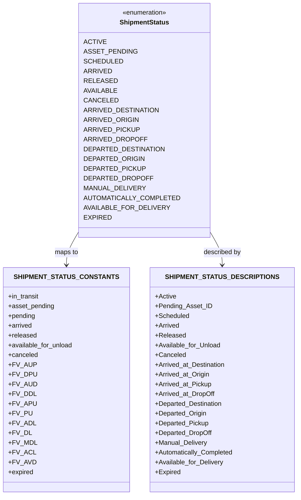
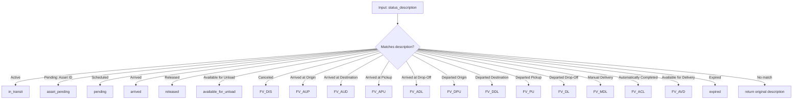
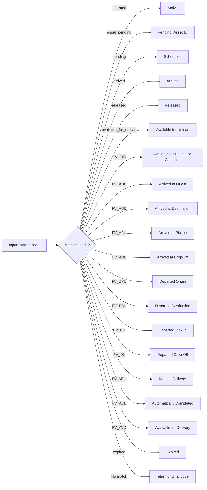

# Diagram: common/fv/python/fv/aws/lambdas/shipments/ng_shipments.py

> Auto-generated by Obscura crawlers

## Diagram 1

### SVG

<svg id="container" width="702.4375" xmlns="http://www.w3.org/2000/svg" class="classDiagram" height="1218" viewBox="0 0 702.4375 1218" role="graphics-document document" aria-roledescription="class"><g><defs><marker id="container_class-aggregationStart" class="marker aggregation class" refX="18" refY="7" markerWidth="190" markerHeight="240" orient="auto"><path d="M 18,7 L9,13 L1,7 L9,1 Z"></path></marker></defs><defs><marker id="container_class-aggregationEnd" class="marker aggregation class" refX="1" refY="7" markerWidth="20" markerHeight="28" orient="auto"><path d="M 18,7 L9,13 L1,7 L9,1 Z"></path></marker></defs><defs><marker id="container_class-extensionStart" class="marker extension class" refX="18" refY="7" markerWidth="190" markerHeight="240" orient="auto"><path d="M 1,7 L18,13 V 1 Z"></path></marker></defs><defs><marker id="container_class-extensionEnd" class="marker extension class" refX="1" refY="7" markerWidth="20" markerHeight="28" orient="auto"><path d="M 1,1 V 13 L18,7 Z"></path></marker></defs><defs><marker id="container_class-compositionStart" class="marker composition class" refX="18" refY="7" markerWidth="190" markerHeight="240" orient="auto"><path d="M 18,7 L9,13 L1,7 L9,1 Z"></path></marker></defs><defs><marker id="container_class-compositionEnd" class="marker composition class" refX="1" refY="7" markerWidth="20" markerHeight="28" orient="auto"><path d="M 18,7 L9,13 L1,7 L9,1 Z"></path></marker></defs><defs><marker id="container_class-dependencyStart" class="marker dependency class" refX="6" refY="7" markerWidth="190" markerHeight="240" orient="auto"><path d="M 5,7 L9,13 L1,7 L9,1 Z"></path></marker></defs><defs><marker id="container_class-dependencyEnd" class="marker dependency class" refX="13" refY="7" markerWidth="20" markerHeight="28" orient="auto"><path d="M 18,7 L9,13 L14,7 L9,1 Z"></path></marker></defs><defs><marker id="container_class-lollipopStart" class="marker lollipop class" refX="13" refY="7" markerWidth="190" markerHeight="240" orient="auto"><circle stroke="black" fill="transparent" cx="7" cy="7" r="6"></circle></marker></defs><defs><marker id="container_class-lollipopEnd" class="marker lollipop class" refX="1" refY="7" markerWidth="190" markerHeight="240" orient="auto"><circle stroke="black" fill="transparent" cx="7" cy="7" r="6"></circle></marker></defs><g class="root"><g class="clusters"></g><g class="edgePaths"><path d="M196.484,549.762L189.758,561.635C183.033,573.508,169.581,597.254,162.855,614.294C156.129,631.333,156.129,641.667,156.129,646.833L156.129,652" id="id_ShipmentStatus_SHIPMENT_STATUS_CONSTANTS_1" class="edge-thickness-normal edge-pattern-solid relation" style=";;;" data-edge="true" data-et="edge" data-id="id_ShipmentStatus_SHIPMENT_STATUS_CONSTANTS_1" data-points="W3sieCI6MTk2LjQ4NDM3NSwieSI6NTQ5Ljc2MjMwNTg2NDM4MDl9LHsieCI6MTU2LjEyODkwNjI1LCJ5Ijo2MjF9LHsieCI6MTU2LjEyODkwNjI1LCJ5Ijo2NTh9XQ==" marker-end="url(#container_class-dependencyEnd)"></path><path d="M483.992,549.762L490.718,561.635C497.444,573.508,510.896,597.254,517.622,614.294C524.348,631.333,524.348,641.667,524.348,646.833L524.348,652" id="id_ShipmentStatus_SHIPMENT_STATUS_DESCRIPTIONS_2" class="edge-thickness-normal edge-pattern-solid relation" style=";;;" data-edge="true" data-et="edge" data-id="id_ShipmentStatus_SHIPMENT_STATUS_DESCRIPTIONS_2" data-points="W3sieCI6NDgzLjk5MjE4NzUsInkiOjU0OS43NjIzMDU4NjQzODA5fSx7IngiOjUyNC4zNDc2NTYyNSwieSI6NjIxfSx7IngiOjUyNC4zNDc2NTYyNSwieSI6NjU4fV0=" marker-end="url(#container_class-dependencyEnd)"></path></g><g class="edgeLabels"><g class="edgeLabel" transform="translate(156.12890625, 621)"><g class="label" data-id="id_ShipmentStatus_SHIPMENT_STATUS_CONSTANTS_1" transform="translate(-29.2578125, -12)"><foreignObject width="58.515625" height="24">

maps to

</foreignObject></g></g><g class="edgeLabel" transform="translate(524.34765625, 621)"><g class="label" data-id="id_ShipmentStatus_SHIPMENT_STATUS_DESCRIPTIONS_2" transform="translate(-46.7265625, -12)"><foreignObject width="93.453125" height="24">

described by

</foreignObject></g></g></g><g class="nodes"><g class="node default" id="classId-ShipmentStatus-0" transform="translate(340.23828125, 296)"><g class="basic label-container"><path d="M-143.75390625 -288 L143.75390625 -288 L143.75390625 288 L-143.75390625 288" stroke="none" stroke-width="0" fill="#ECECFF" style=""></path><path d="M-143.75390625 -288 C-30.92976447604582 -288, 81.89437729790836 -288, 143.75390625 -288 M-143.75390625 -288 C-49.101320219423826 -288, 45.55126581115235 -288, 143.75390625 -288 M143.75390625 -288 C143.75390625 -123.46242793392824, 143.75390625 41.07514413214352, 143.75390625 288 M143.75390625 -288 C143.75390625 -107.76347663804412, 143.75390625 72.47304672391175, 143.75390625 288 M143.75390625 288 C60.276963281451174 288, -23.199979687097652 288, -143.75390625 288 M143.75390625 288 C57.40606118054802 288, -28.941783888903956 288, -143.75390625 288 M-143.75390625 288 C-143.75390625 84.97543033939291, -143.75390625 -118.04913932121417, -143.75390625 -288 M-143.75390625 288 C-143.75390625 72.00185161683677, -143.75390625 -143.99629676632645, -143.75390625 -288" stroke="#9370DB" stroke-width="1.3" fill="none" stroke-dasharray="0 0" style=""></path></g><g class="annotation-group text" transform="translate(-55.5546875, -264)"><g class="label" style="" transform="translate(0,-12)"><foreignObject width="111.109375" height="24">

«enumeration»

</foreignObject></g></g><g class="label-group text" transform="translate(-58.5859375, -240)"><g class="label" style="font-weight: bolder" transform="translate(0,-12)"><foreignObject width="117.171875" height="24">

ShipmentStatus

</foreignObject></g></g><g class="members-group text" transform="translate(-131.75390625, -192)"><g class="label" style="" transform="translate(0,-12)"><foreignObject width="48.265625" height="24">

ACTIVE

</foreignObject></g><g class="label" style="" transform="translate(0,12)"><foreignObject width="115.609375" height="24">

ASSET_PENDING

</foreignObject></g><g class="label" style="" transform="translate(0,36)"><foreignObject width="84.859375" height="24">

SCHEDULED

</foreignObject></g><g class="label" style="" transform="translate(0,60)"><foreignObject width="61.015625" height="24">

ARRIVED

</foreignObject></g><g class="label" style="" transform="translate(0,84)"><foreignObject width="71.53125" height="24">

RELEASED

</foreignObject></g><g class="label" style="" transform="translate(0,108)"><foreignObject width="74.90625" height="24">

AVAILABLE

</foreignObject></g><g class="label" style="" transform="translate(0,132)"><foreignObject width="73.421875" height="24">

CANCELED

</foreignObject></g><g class="label" style="" transform="translate(0,156)"><foreignObject width="163.046875" height="24">

ARRIVED_DESTINATION

</foreignObject></g><g class="label" style="" transform="translate(0,180)"><foreignObject width="119.265625" height="24">

ARRIVED_ORIGIN

</foreignObject></g><g class="label" style="" transform="translate(0,204)"><foreignObject width="120.875" height="24">

ARRIVED_PICKUP

</foreignObject></g><g class="label" style="" transform="translate(0,228)"><foreignObject width="135.6875" height="24">

ARRIVED_DROPOFF

</foreignObject></g><g class="label" style="" transform="translate(0,252)"><foreignObject width="174.90625" height="24">

DEPARTED_DESTINATION

</foreignObject></g><g class="label" style="" transform="translate(0,276)"><foreignObject width="131.125" height="24">

DEPARTED_ORIGIN

</foreignObject></g><g class="label" style="" transform="translate(0,300)"><foreignObject width="132.734375" height="24">

DEPARTED_PICKUP

</foreignObject></g><g class="label" style="" transform="translate(0,324)"><foreignObject width="147.546875" height="24">

DEPARTED_DROPOFF

</foreignObject></g><g class="label" style="" transform="translate(0,348)"><foreignObject width="135.515625" height="24">

MANUAL_DELIVERY

</foreignObject></g><g class="label" style="" transform="translate(0,372)"><foreignObject width="204.921875" height="24">

AUTOMATICALLY_COMPLETED

</foreignObject></g><g class="label" style="" transform="translate(0,396)"><foreignObject width="186.953125" height="24">

AVAILABLE_FOR_DELIVERY

</foreignObject></g><g class="label" style="" transform="translate(0,420)"><foreignObject width="59.765625" height="24">

EXPIRED

</foreignObject></g></g><g class="methods-group text" transform="translate(-131.75390625, 288)"></g><g class="divider" style=""><path d="M-143.75390625 -216 C-33.609969102730034 -216, 76.53396804453993 -216, 143.75390625 -216 M-143.75390625 -216 C-35.63018111270141 -216, 72.49354402459718 -216, 143.75390625 -216" stroke="#9370DB" stroke-width="1.3" fill="none" stroke-dasharray="0 0" style=""></path></g><g class="divider" style=""><path d="M-143.75390625 264 C-53.088591726002875 264, 37.57672279799425 264, 143.75390625 264 M-143.75390625 264 C-69.73786489705982 264, 4.278176455880356 264, 143.75390625 264" stroke="#9370DB" stroke-width="1.3" fill="none" stroke-dasharray="0 0" style=""></path></g></g><g class="node default" id="classId-SHIPMENT_STATUS_CONSTANTS-1" transform="translate(156.12890625, 934)"><g class="basic label-container"><path d="M-148.12890625 -276 L148.12890625 -276 L148.12890625 276 L-148.12890625 276" stroke="none" stroke-width="0" fill="#ECECFF" style=""></path><path d="M-148.12890625 -276 C-54.44711340398645 -276, 39.2346794420271 -276, 148.12890625 -276 M-148.12890625 -276 C-86.11922573938227 -276, -24.109545228764546 -276, 148.12890625 -276 M148.12890625 -276 C148.12890625 -125.66253577356582, 148.12890625 24.674928452868357, 148.12890625 276 M148.12890625 -276 C148.12890625 -133.62540873041726, 148.12890625 8.749182539165474, 148.12890625 276 M148.12890625 276 C77.46410523504088 276, 6.799304220081751 276, -148.12890625 276 M148.12890625 276 C62.85642279145199 276, -22.41606066709602 276, -148.12890625 276 M-148.12890625 276 C-148.12890625 138.98469795706245, -148.12890625 1.9693959141249024, -148.12890625 -276 M-148.12890625 276 C-148.12890625 97.35395327816528, -148.12890625 -81.29209344366944, -148.12890625 -276" stroke="#9370DB" stroke-width="1.3" fill="none" stroke-dasharray="0 0" style=""></path></g><g class="annotation-group text" transform="translate(0, -252)"></g><g class="label-group text" transform="translate(-113.1953125, -252)"><g class="label" style="font-weight: bolder" transform="translate(0,-12)"><foreignObject width="226.390625" height="24">

SHIPMENT_STATUS_CONSTANTS

</foreignObject></g></g><g class="members-group text" transform="translate(-136.12890625, -204)"><g class="label" style="" transform="translate(0,-12)"><foreignObject width="77.109375" height="24">

+in_transit

</foreignObject></g><g class="label" style="" transform="translate(0,12)"><foreignObject width="113.265625" height="24">

+asset_pending

</foreignObject></g><g class="label" style="" transform="translate(0,36)"><foreignObject width="67.375" height="24">

+pending

</foreignObject></g><g class="label" style="" transform="translate(0,60)"><foreignObject width="59.421875" height="24">

+arrived

</foreignObject></g><g class="label" style="" transform="translate(0,84)"><foreignObject width="69.875" height="24">

+released

</foreignObject></g><g class="label" style="" transform="translate(0,108)"><foreignObject width="159.0625" height="24">

+available_for_unload

</foreignObject></g><g class="label" style="" transform="translate(0,132)"><foreignObject width="72.5" height="24">

+canceled

</foreignObject></g><g class="label" style="" transform="translate(0,156)"><foreignObject width="61.15625" height="24">

+FV_AUP

</foreignObject></g><g class="label" style="" transform="translate(0,180)"><foreignObject width="62.453125" height="24">

+FV_DPU

</foreignObject></g><g class="label" style="" transform="translate(0,204)"><foreignObject width="62.171875" height="24">

+FV_AUD

</foreignObject></g><g class="label" style="" transform="translate(0,228)"><foreignObject width="60.84375" height="24">

+FV_DDL

</foreignObject></g><g class="label" style="" transform="translate(0,252)"><foreignObject width="61.3125" height="24">

+FV_APU

</foreignObject></g><g class="label" style="" transform="translate(0,276)"><foreignObject width="52.15625" height="24">

+FV_PU

</foreignObject></g><g class="label" style="" transform="translate(0,300)"><foreignObject width="59.703125" height="24">

+FV_ADL

</foreignObject></g><g class="label" style="" transform="translate(0,324)"><foreignObject width="50.53125" height="24">

+FV_DL

</foreignObject></g><g class="label" style="" transform="translate(0,348)"><foreignObject width="62.984375" height="24">

+FV_MDL

</foreignObject></g><g class="label" style="" transform="translate(0,372)"><foreignObject width="58.203125" height="24">

+FV_ACL

</foreignObject></g><g class="label" style="" transform="translate(0,396)"><foreignObject width="60.40625" height="24">

+FV_AVD

</foreignObject></g><g class="label" style="" transform="translate(0,420)"><foreignObject width="62.328125" height="24">

+expired

</foreignObject></g></g><g class="methods-group text" transform="translate(-136.12890625, 276)"></g><g class="divider" style=""><path d="M-148.12890625 -228 C-50.06913194680267 -228, 47.99064235639466 -228, 148.12890625 -228 M-148.12890625 -228 C-42.89944965360213 -228, 62.330006942795734 -228, 148.12890625 -228" stroke="#9370DB" stroke-width="1.3" fill="none" stroke-dasharray="0 0" style=""></path></g><g class="divider" style=""><path d="M-148.12890625 252 C-39.87738870361163 252, 68.37412884277674 252, 148.12890625 252 M-148.12890625 252 C-81.32560914695064 252, -14.52231204390128 252, 148.12890625 252" stroke="#9370DB" stroke-width="1.3" fill="none" stroke-dasharray="0 0" style=""></path></g></g><g class="node default" id="classId-SHIPMENT_STATUS_DESCRIPTIONS-2" transform="translate(524.34765625, 934)"><g class="basic label-container"><path d="M-170.08984375 -276 L170.08984375 -276 L170.08984375 276 L-170.08984375 276" stroke="none" stroke-width="0" fill="#ECECFF" style=""></path><path d="M-170.08984375 -276 C-43.079517236496514 -276, 83.93080927700697 -276, 170.08984375 -276 M-170.08984375 -276 C-34.734821977926174 -276, 100.62019979414765 -276, 170.08984375 -276 M170.08984375 -276 C170.08984375 -142.9665980950042, 170.08984375 -9.933196190008402, 170.08984375 276 M170.08984375 -276 C170.08984375 -69.27973539931321, 170.08984375 137.44052920137358, 170.08984375 276 M170.08984375 276 C37.54391146736535 276, -95.0020208152693 276, -170.08984375 276 M170.08984375 276 C99.55073267061013 276, 29.011621591220262 276, -170.08984375 276 M-170.08984375 276 C-170.08984375 163.58696307218003, -170.08984375 51.17392614436008, -170.08984375 -276 M-170.08984375 276 C-170.08984375 81.66507420678931, -170.08984375 -112.66985158642137, -170.08984375 -276" stroke="#9370DB" stroke-width="1.3" fill="none" stroke-dasharray="0 0" style=""></path></g><g class="annotation-group text" transform="translate(0, -252)"></g><g class="label-group text" transform="translate(-123.6171875, -252)"><g class="label" style="font-weight: bolder" transform="translate(0,-12)"><foreignObject width="247.234375" height="24">

SHIPMENT_STATUS_DESCRIPTIONS

</foreignObject></g></g><g class="members-group text" transform="translate(-158.08984375, -204)"><g class="label" style="" transform="translate(0,-12)"><foreignObject width="51.46875" height="24">

+Active

</foreignObject></g><g class="label" style="" transform="translate(0,12)"><foreignObject width="136.859375" height="24">

+Pending_Asset_ID

</foreignObject></g><g class="label" style="" transform="translate(0,36)"><foreignObject width="83.59375" height="24">

+Scheduled

</foreignObject></g><g class="label" style="" transform="translate(0,60)"><foreignObject width="59.953125" height="24">

+Arrived

</foreignObject></g><g class="label" style="" transform="translate(0,84)"><foreignObject width="73.625" height="24">

+Released

</foreignObject></g><g class="label" style="" transform="translate(0,108)"><foreignObject width="160.96875" height="24">

+Available_for_Unload

</foreignObject></g><g class="label" style="" transform="translate(0,132)"><foreignObject width="73.8125" height="24">

+Canceled

</foreignObject></g><g class="label" style="" transform="translate(0,156)"><foreignObject width="174.625" height="24">

+Arrived_at_Destination

</foreignObject></g><g class="label" style="" transform="translate(0,180)"><foreignObject width="134.09375" height="24">

+Arrived_at_Origin

</foreignObject></g><g class="label" style="" transform="translate(0,204)"><foreignObject width="139.109375" height="24">

+Arrived_at_Pickup

</foreignObject></g><g class="label" style="" transform="translate(0,228)"><foreignObject width="147.40625" height="24">

+Arrived_at_DropOff

</foreignObject></g><g class="label" style="" transform="translate(0,252)"><foreignObject width="167.25" height="24">

+Departed_Destination

</foreignObject></g><g class="label" style="" transform="translate(0,276)"><foreignObject width="126.71875" height="24">

+Departed_Origin

</foreignObject></g><g class="label" style="" transform="translate(0,300)"><foreignObject width="131.734375" height="24">

+Departed_Pickup

</foreignObject></g><g class="label" style="" transform="translate(0,324)"><foreignObject width="140.03125" height="24">

+Departed_DropOff

</foreignObject></g><g class="label" style="" transform="translate(0,348)"><foreignObject width="128.1875" height="24">

+Manual_Delivery

</foreignObject></g><g class="label" style="" transform="translate(0,372)"><foreignObject width="192.5625" height="24">

+Automatically_Completed

</foreignObject></g><g class="label" style="" transform="translate(0,396)"><foreignObject width="168.21875" height="24">

+Available_for_Delivery

</foreignObject></g><g class="label" style="" transform="translate(0,420)"><foreignObject width="62.3125" height="24">

+Expired

</foreignObject></g></g><g class="methods-group text" transform="translate(-158.08984375, 276)"></g><g class="divider" style=""><path d="M-170.08984375 -228 C-101.11499759654863 -228, -32.14015144309727 -228, 170.08984375 -228 M-170.08984375 -228 C-90.71513299522059 -228, -11.340422240441171 -228, 170.08984375 -228" stroke="#9370DB" stroke-width="1.3" fill="none" stroke-dasharray="0 0" style=""></path></g><g class="divider" style=""><path d="M-170.08984375 252 C-42.57522743383397 252, 84.93938888233205 252, 170.08984375 252 M-170.08984375 252 C-42.722336748108944 252, 84.64517025378211 252, 170.08984375 252" stroke="#9370DB" stroke-width="1.3" fill="none" stroke-dasharray="0 0" style=""></path></g></g></g></g></g></svg>

## Diagram 2

### SVG

<svg id="container" width="3556.0078125" xmlns="http://www.w3.org/2000/svg" class="flowchart" height="455.625" viewBox="0 0 3556.0078125 455.625" role="graphics-document document" aria-roledescription="flowchart-v2"><g><marker id="container_flowchart-v2-pointEnd" class="marker flowchart-v2" viewBox="0 0 10 10" refX="5" refY="5" markerUnits="userSpaceOnUse" markerWidth="8" markerHeight="8" orient="auto"><path d="M 0 0 L 10 5 L 0 10 z" class="arrowMarkerPath" style="stroke-width: 1; stroke-dasharray: 1, 0;"></path></marker><marker id="container_flowchart-v2-pointStart" class="marker flowchart-v2" viewBox="0 0 10 10" refX="4.5" refY="5" markerUnits="userSpaceOnUse" markerWidth="8" markerHeight="8" orient="auto"><path d="M 0 5 L 10 10 L 10 0 z" class="arrowMarkerPath" style="stroke-width: 1; stroke-dasharray: 1, 0;"></path></marker><marker id="container_flowchart-v2-circleEnd" class="marker flowchart-v2" viewBox="0 0 10 10" refX="11" refY="5" markerUnits="userSpaceOnUse" markerWidth="11" markerHeight="11" orient="auto"><circle cx="5" cy="5" r="5" class="arrowMarkerPath" style="stroke-width: 1; stroke-dasharray: 1, 0;"></circle></marker><marker id="container_flowchart-v2-circleStart" class="marker flowchart-v2" viewBox="0 0 10 10" refX="-1" refY="5" markerUnits="userSpaceOnUse" markerWidth="11" markerHeight="11" orient="auto"><circle cx="5" cy="5" r="5" class="arrowMarkerPath" style="stroke-width: 1; stroke-dasharray: 1, 0;"></circle></marker><marker id="container_flowchart-v2-crossEnd" class="marker cross flowchart-v2" viewBox="0 0 11 11" refX="12" refY="5.2" markerUnits="userSpaceOnUse" markerWidth="11" markerHeight="11" orient="auto"><path d="M 1,1 l 9,9 M 10,1 l -9,9" class="arrowMarkerPath" style="stroke-width: 2; stroke-dasharray: 1, 0;"></path></marker><marker id="container_flowchart-v2-crossStart" class="marker cross flowchart-v2" viewBox="0 0 11 11" refX="-1" refY="5.2" markerUnits="userSpaceOnUse" markerWidth="11" markerHeight="11" orient="auto"><path d="M 1,1 l 9,9 M 10,1 l -9,9" class="arrowMarkerPath" style="stroke-width: 2; stroke-dasharray: 1, 0;"></path></marker><g class="root"><g class="clusters"></g><g class="edgePaths"><path d="M1790.238,62L1790.238,66.167C1790.238,70.333,1790.238,78.667,1790.238,86.333C1790.238,94,1790.238,101,1790.238,104.5L1790.238,108" id="L_A_B_0" class="edge-thickness-normal edge-pattern-solid edge-thickness-normal edge-pattern-solid flowchart-link" style=";" data-edge="true" data-et="edge" data-id="L_A_B_0" data-points="W3sieCI6MTc5MC4yMzgyODEyNSwieSI6NjJ9LHsieCI6MTc5MC4yMzgyODEyNSwieSI6ODd9LHsieCI6MTc5MC4yMzgyODEyNSwieSI6MTEyfV0=" marker-end="url(#container_flowchart-v2-pointEnd)"></path><path d="M1694.291,223.678L1424.003,245.836C1153.715,267.994,613.139,312.309,342.851,339.967C72.563,367.625,72.563,378.625,72.563,384.125L72.563,389.625" id="L_B_C_0" class="edge-thickness-normal edge-pattern-solid edge-thickness-normal edge-pattern-solid flowchart-link" style=";" data-edge="true" data-et="edge" data-id="L_B_C_0" data-points="W3sieCI6MTY5NC4yOTEzNjYzMDg0MjA3LCJ5IjoyMjMuNjc4MDg1MDU4NDIwNzJ9LHsieCI6NzIuNTYyNSwieSI6MzU2LjYyNX0seyJ4Ijo3Mi41NjI1LCJ5IjozOTMuNjI1fV0=" marker-end="url(#container_flowchart-v2-pointEnd)"></path><path d="M1695.226,224.612L1457.67,246.615C1220.114,268.617,745.002,312.621,507.446,340.123C269.891,367.625,269.891,378.625,269.891,384.125L269.891,389.625" id="L_B_D_0" class="edge-thickness-normal edge-pattern-solid edge-thickness-normal edge-pattern-solid flowchart-link" style=";" data-edge="true" data-et="edge" data-id="L_B_D_0" data-points="W3sieCI6MTY5NS4yMjU3MTM5OTY1NTEsInkiOjIyNC42MTI0MzI3NDY1NTA5Mn0seyJ4IjoyNjkuODkwNjI1LCJ5IjozNTYuNjI1fSx7IngiOjI2OS44OTA2MjUsInkiOjM5My42MjV9XQ==" marker-end="url(#container_flowchart-v2-pointEnd)"></path><path d="M1696.379,225.766L1490.708,247.575C1285.036,269.385,873.694,313.005,668.023,340.315C462.352,367.625,462.352,378.625,462.352,384.125L462.352,389.625" id="L_B_E_0" class="edge-thickness-normal edge-pattern-solid edge-thickness-normal edge-pattern-solid flowchart-link" style=";" data-edge="true" data-et="edge" data-id="L_B_E_0" data-points="W3sieCI6MTY5Ni4zNzg4NzI3MTMyNjg3LCJ5IjoyMjUuNzY1NTkxNDYzMjY4NjZ9LHsieCI6NDYyLjM1MTU2MjUsInkiOjM1Ni42MjV9LHsieCI6NDYyLjM1MTU2MjUsInkiOjM5My42MjV9XQ==" marker-end="url(#container_flowchart-v2-pointEnd)"></path><path d="M1697.643,227.03L1519.35,248.629C1341.056,270.228,984.47,313.427,806.176,340.526C627.883,367.625,627.883,378.625,627.883,384.125L627.883,389.625" id="L_B_F_0" class="edge-thickness-normal edge-pattern-solid edge-thickness-normal edge-pattern-solid flowchart-link" style=";" data-edge="true" data-et="edge" data-id="L_B_F_0" data-points="W3sieCI6MTY5Ny42NDMxMzYxOTMzMzIsInkiOjIyNy4wMjk4NTQ5NDMzMzIyfSx7IngiOjYyNy44ODI4MTI1LCJ5IjozNTYuNjI1fSx7IngiOjYyNy44ODI4MTI1LCJ5IjozOTMuNjI1fV0=" marker-end="url(#container_flowchart-v2-pointEnd)"></path><path d="M1699.289,228.676L1548.519,250.001C1397.748,271.326,1096.206,313.975,945.435,340.8C794.664,367.625,794.664,378.625,794.664,384.125L794.664,389.625" id="L_B_G_0" class="edge-thickness-normal edge-pattern-solid edge-thickness-normal edge-pattern-solid flowchart-link" style=";" data-edge="true" data-et="edge" data-id="L_B_G_0" data-points="W3sieCI6MTY5OS4yODk0NDU4OTQzMTIsInkiOjIyOC42NzYxNjQ2NDQzMTE5fSx7IngiOjc5NC42NjQwNjI1LCJ5IjozNTYuNjI1fSx7IngiOjc5NC42NjQwNjI1LCJ5IjozOTMuNjI1fV0=" marker-end="url(#container_flowchart-v2-pointEnd)"></path><path d="M1702.319,231.705L1587.143,252.525C1471.968,273.345,1241.617,314.985,1126.441,341.305C1011.266,367.625,1011.266,378.625,1011.266,384.125L1011.266,389.625" id="L_B_H_0" class="edge-thickness-normal edge-pattern-solid edge-thickness-normal edge-pattern-solid flowchart-link" style=";" data-edge="true" data-et="edge" data-id="L_B_H_0" data-points="W3sieCI6MTcwMi4zMTg3MjkyNDY1MTc1LCJ5IjoyMzEuNzA1NDQ3OTk2NTE3NTN9LHsieCI6MTAxMS4yNjU2MjUsInkiOjM1Ni42MjV9LHsieCI6MTAxMS4yNjU2MjUsInkiOjM5My42MjV9XQ==" marker-end="url(#container_flowchart-v2-pointEnd)"></path><path d="M1707.011,236.398L1625.999,256.436C1544.987,276.474,1382.962,316.549,1301.95,342.087C1220.938,367.625,1220.938,378.625,1220.938,384.125L1220.938,389.625" id="L_B_I_0" class="edge-thickness-normal edge-pattern-solid edge-thickness-normal edge-pattern-solid flowchart-link" style=";" data-edge="true" data-et="edge" data-id="L_B_I_0" data-points="W3sieCI6MTcwNy4wMTEzNjY3MzY0NzA2LCJ5IjoyMzYuMzk4MDg1NDg2NDcwNn0seyJ4IjoxMjIwLjkzNzUsInkiOjM1Ni42MjV9LHsieCI6MTIyMC45Mzc1LCJ5IjozOTMuNjI1fV0=" marker-end="url(#container_flowchart-v2-pointEnd)"></path><path d="M1713.028,242.414L1657.78,261.45C1602.532,280.485,1492.035,318.555,1436.787,343.09C1381.539,367.625,1381.539,378.625,1381.539,384.125L1381.539,389.625" id="L_B_J_0" class="edge-thickness-normal edge-pattern-solid edge-thickness-normal edge-pattern-solid flowchart-link" style=";" data-edge="true" data-et="edge" data-id="L_B_J_0" data-points="W3sieCI6MTcxMy4wMjc3NTc0MzYyNDQ5LCJ5IjoyNDIuNDE0NDc2MTg2MjQ0ODh9LHsieCI6MTM4MS41MzkwNjI1LCJ5IjozNTYuNjI1fSx7IngiOjEzODEuNTM5MDYyNSwieSI6MzkzLjYyNX1d" marker-end="url(#container_flowchart-v2-pointEnd)"></path><path d="M1724.313,253.7L1694.464,270.854C1664.615,288.008,1604.917,322.317,1575.068,344.971C1545.219,367.625,1545.219,378.625,1545.219,384.125L1545.219,389.625" id="L_B_K_0" class="edge-thickness-normal edge-pattern-solid edge-thickness-normal edge-pattern-solid flowchart-link" style=";" data-edge="true" data-et="edge" data-id="L_B_K_0" data-points="W3sieCI6MTcyNC4zMTI5ODcyNjc4MzksInkiOjI1My42OTk3MDYwMTc4Mzg4OH0seyJ4IjoxNTQ1LjIxODc1LCJ5IjozNTYuNjI1fSx7IngiOjE1NDUuMjE4NzUsInkiOjM5My42MjV9XQ==" marker-end="url(#container_flowchart-v2-pointEnd)"></path><path d="M1752.251,281.638L1745.039,294.136C1737.826,306.634,1723.401,331.629,1716.189,349.627C1708.977,367.625,1708.977,378.625,1708.977,384.125L1708.977,389.625" id="L_B_L_0" class="edge-thickness-normal edge-pattern-solid edge-thickness-normal edge-pattern-solid flowchart-link" style=";" data-edge="true" data-et="edge" data-id="L_B_L_0" data-points="W3sieCI6MTc1Mi4yNTEwNjEzNjgyMDM2LCJ5IjoyODEuNjM3NzgwMTE4MjAzNzV9LHsieCI6MTcwOC45NzY1NjI1LCJ5IjozNTYuNjI1fSx7IngiOjE3MDguOTc2NTYyNSwieSI6MzkzLjYyNX1d" marker-end="url(#container_flowchart-v2-pointEnd)"></path><path d="M1828.226,281.638L1835.438,294.136C1842.65,306.634,1857.075,331.629,1864.288,349.627C1871.5,367.625,1871.5,378.625,1871.5,384.125L1871.5,389.625" id="L_B_M_0" class="edge-thickness-normal edge-pattern-solid edge-thickness-normal edge-pattern-solid flowchart-link" style=";" data-edge="true" data-et="edge" data-id="L_B_M_0" data-points="W3sieCI6MTgyOC4yMjU1MDExMzE3OTY0LCJ5IjoyODEuNjM3NzgwMTE4MjAzNzV9LHsieCI6MTg3MS41LCJ5IjozNTYuNjI1fSx7IngiOjE4NzEuNSwieSI6MzkzLjYyNX1d" marker-end="url(#container_flowchart-v2-pointEnd)"></path><path d="M1856.098,253.765L1885.848,270.908C1915.597,288.052,1975.095,322.338,2004.845,344.982C2034.594,367.625,2034.594,378.625,2034.594,384.125L2034.594,389.625" id="L_B_N_0" class="edge-thickness-normal edge-pattern-solid edge-thickness-normal edge-pattern-solid flowchart-link" style=";" data-edge="true" data-et="edge" data-id="L_B_N_0" data-points="W3sieCI6MTg1Ni4wOTgyNTQ0NTA2MTI2LCJ5IjoyNTMuNzY1MDI2Nzk5Mzg3NDR9LHsieCI6MjAzNC41OTM3NSwieSI6MzU2LjYyNX0seyJ4IjoyMDM0LjU5Mzc1LCJ5IjozOTMuNjI1fV0=" marker-end="url(#container_flowchart-v2-pointEnd)"></path><path d="M1867.416,242.447L1922.556,261.477C1977.697,280.507,2087.977,318.566,2143.117,343.095C2198.258,367.625,2198.258,378.625,2198.258,384.125L2198.258,389.625" id="L_B_O_0" class="edge-thickness-normal edge-pattern-solid edge-thickness-normal edge-pattern-solid flowchart-link" style=";" data-edge="true" data-et="edge" data-id="L_B_O_0" data-points="W3sieCI6MTg2Ny40MTU4NjA1MDIxMDUsInkiOjI0Mi40NDc0MjA3NDc4OTUwMn0seyJ4IjoyMTk4LjI1NzgxMjUsInkiOjM1Ni42MjV9LHsieCI6MjE5OC4yNTc4MTI1LCJ5IjozOTMuNjI1fV0=" marker-end="url(#container_flowchart-v2-pointEnd)"></path><path d="M1873.385,236.479L1953.949,256.503C2034.514,276.527,2195.644,316.576,2276.209,342.101C2356.773,367.625,2356.773,378.625,2356.773,384.125L2356.773,389.625" id="L_B_P_0" class="edge-thickness-normal edge-pattern-solid edge-thickness-normal edge-pattern-solid flowchart-link" style=";" data-edge="true" data-et="edge" data-id="L_B_P_0" data-points="W3sieCI6MTg3My4zODQ3MDkxNjA3MTQsInkiOjIzNi40Nzg1NzIwODkyODYwMn0seyJ4IjoyMzU2Ljc3MzQzNzUsInkiOjM1Ni42MjV9LHsieCI6MjM1Ni43NzM0Mzc1LCJ5IjozOTMuNjI1fV0=" marker-end="url(#container_flowchart-v2-pointEnd)"></path><path d="M1877.067,232.796L1982.578,253.434C2088.089,274.073,2299.111,315.349,2404.622,341.487C2510.133,367.625,2510.133,378.625,2510.133,384.125L2510.133,389.625" id="L_B_Q_0" class="edge-thickness-normal edge-pattern-solid edge-thickness-normal edge-pattern-solid flowchart-link" style=";" data-edge="true" data-et="edge" data-id="L_B_Q_0" data-points="W3sieCI6MTg3Ny4wNjY5NTYxNzg4NjAyLCJ5IjoyMzIuNzk2MzI1MDcxMTM5NzN9LHsieCI6MjUxMC4xMzI4MTI1LCJ5IjozNTYuNjI1fSx7IngiOjI1MTAuMTMyODEyNSwieSI6MzkzLjYyNX1d" marker-end="url(#container_flowchart-v2-pointEnd)"></path><path d="M1879.712,230.151L2011.244,251.23C2142.777,272.309,2405.842,314.467,2537.374,341.046C2668.906,367.625,2668.906,378.625,2668.906,384.125L2668.906,389.625" id="L_B_R_0" class="edge-thickness-normal edge-pattern-solid edge-thickness-normal edge-pattern-solid flowchart-link" style=";" data-edge="true" data-et="edge" data-id="L_B_R_0" data-points="W3sieCI6MTg3OS43MTIwMDk1ODcwNDM3LCJ5IjoyMzAuMTUxMjcxNjYyOTU2NH0seyJ4IjoyNjY4LjkwNjI1LCJ5IjozNTYuNjI1fSx7IngiOjI2NjguOTA2MjUsInkiOjM5My42MjV9XQ==" marker-end="url(#container_flowchart-v2-pointEnd)"></path><path d="M1881.75,228.113L2041.102,249.532C2200.453,270.95,2519.156,313.788,2678.508,340.706C2837.859,367.625,2837.859,378.625,2837.859,384.125L2837.859,389.625" id="L_B_S_0" class="edge-thickness-normal edge-pattern-solid edge-thickness-normal edge-pattern-solid flowchart-link" style=";" data-edge="true" data-et="edge" data-id="L_B_S_0" data-points="W3sieCI6MTg4MS43NTA0NzQ1ODMyMDE4LCJ5IjoyMjguMTEyODA2NjY2Nzk4MTV9LHsieCI6MjgzNy44NTkzNzUsInkiOjM1Ni42MjV9LHsieCI6MjgzNy44NTkzNzUsInkiOjM5My42MjV9XQ==" marker-end="url(#container_flowchart-v2-pointEnd)"></path><path d="M1883.43,226.433L2073.83,248.132C2264.23,269.83,2645.029,313.228,2835.428,340.426C3025.828,367.625,3025.828,378.625,3025.828,384.125L3025.828,389.625" id="L_B_T_0" class="edge-thickness-normal edge-pattern-solid edge-thickness-normal edge-pattern-solid flowchart-link" style=";" data-edge="true" data-et="edge" data-id="L_B_T_0" data-points="W3sieCI6MTg4My40MzAyNjkyMTUzOTksInkiOjIyNi40MzMwMTIwMzQ2MDEwNn0seyJ4IjozMDI1LjgyODEyNSwieSI6MzU2LjYyNX0seyJ4IjozMDI1LjgyODEyNSwieSI6MzkzLjYyNX1d" marker-end="url(#container_flowchart-v2-pointEnd)"></path><path d="M1884.557,225.306L2101.999,247.193C2319.442,269.079,2754.326,312.852,2971.769,340.239C3189.211,367.625,3189.211,378.625,3189.211,384.125L3189.211,389.625" id="L_B_U_0" class="edge-thickness-normal edge-pattern-solid edge-thickness-normal edge-pattern-solid flowchart-link" style=";" data-edge="true" data-et="edge" data-id="L_B_U_0" data-points="W3sieCI6MTg4NC41NTcxODU2MDMyODYsInkiOjIyNS4zMDYwOTU2NDY3MTQxfSx7IngiOjMxODkuMjEwOTM3NSwieSI6MzU2LjYyNX0seyJ4IjozMTg5LjIxMDkzNzUsInkiOjM5My42MjV9XQ==" marker-end="url(#container_flowchart-v2-pointEnd)"></path><path d="M1885.805,224.058L2141.87,246.153C2397.935,268.247,2910.065,312.436,3166.13,340.031C3422.195,367.625,3422.195,378.625,3422.195,384.125L3422.195,389.625" id="L_B_V_0" class="edge-thickness-normal edge-pattern-solid edge-thickness-normal edge-pattern-solid flowchart-link" style=";" data-edge="true" data-et="edge" data-id="L_B_V_0" data-points="W3sieCI6MTg4NS44MDQ4NzE0NDY5Njg1LCJ5IjoyMjQuMDU4NDA5ODAzMDMxNTR9LHsieCI6MzQyMi4xOTUzMTI1LCJ5IjozNTYuNjI1fSx7IngiOjM0MjIuMTk1MzEyNSwieSI6MzkzLjYyNX1d" marker-end="url(#container_flowchart-v2-pointEnd)"></path></g><g class="edgeLabels"><g class="edgeLabel"><g class="label" data-id="L_A_B_0" transform="translate(0, 0)"><foreignObject width="0" height="0">

</foreignObject></g></g><g class="edgeLabel" transform="translate(72.5625, 356.625)"><g class="label" data-id="L_B_C_0" transform="translate(-21.8203125, -12)"><foreignObject width="43.640625" height="24">

Active

</foreignObject></g></g><g class="edgeLabel" transform="translate(269.890625, 356.625)"><g class="label" data-id="L_B_D_0" transform="translate(-62.2421875, -12)"><foreignObject width="124.484375" height="24">

Pending: Asset ID

</foreignObject></g></g><g class="edgeLabel" transform="translate(462.3515625, 356.625)"><g class="label" data-id="L_B_E_0" transform="translate(-38.125, -12)"><foreignObject width="76.25" height="24">

Scheduled

</foreignObject></g></g><g class="edgeLabel" transform="translate(627.8828125, 356.625)"><g class="label" data-id="L_B_F_0" transform="translate(-26.0703125, -12)"><foreignObject width="52.140625" height="24">

Arrived

</foreignObject></g></g><g class="edgeLabel" transform="translate(794.6640625, 356.625)"><g class="label" data-id="L_B_G_0" transform="translate(-32.8203125, -12)"><foreignObject width="65.640625" height="24">

Released

</foreignObject></g></g><g class="edgeLabel" transform="translate(1011.265625, 356.625)"><g class="label" data-id="L_B_H_0" transform="translate(-73.6953125, -12)"><foreignObject width="147.390625" height="24">

Available for Unload

</foreignObject></g></g><g class="edgeLabel" transform="translate(1220.9375, 356.625)"><g class="label" data-id="L_B_I_0" transform="translate(-32.9140625, -12)"><foreignObject width="65.828125" height="24">

Canceled

</foreignObject></g></g><g class="edgeLabel" transform="translate(1381.5390625, 356.625)"><g class="label" data-id="L_B_J_0" transform="translate(-59.53125, -12)"><foreignObject width="119.0625" height="24">

Arrived at Origin

</foreignObject></g></g><g class="edgeLabel" transform="translate(1545.21875, 356.625)"><g class="label" data-id="L_B_K_0" transform="translate(-79.484375, -12)"><foreignObject width="158.96875" height="24">

Arrived at Destination

</foreignObject></g></g><g class="edgeLabel" transform="translate(1708.9765625, 356.625)"><g class="label" data-id="L_B_L_0" transform="translate(-61.7265625, -12)"><foreignObject width="123.453125" height="24">

Arrived at Pickup

</foreignObject></g></g><g class="edgeLabel" transform="translate(1871.5, 356.625)"><g class="label" data-id="L_B_M_0" transform="translate(-69.09375, -12)"><foreignObject width="138.1875" height="24">

Arrived at Drop-Off

</foreignObject></g></g><g class="edgeLabel" transform="translate(2034.59375, 356.625)"><g class="label" data-id="L_B_N_0" transform="translate(-57.640625, -12)"><foreignObject width="115.28125" height="24">

Departed Origin

</foreignObject></g></g><g class="edgeLabel" transform="translate(2198.2578125, 356.625)"><g class="label" data-id="L_B_O_0" transform="translate(-77.59375, -12)"><foreignObject width="155.1875" height="24">

Departed Destination

</foreignObject></g></g><g class="edgeLabel" transform="translate(2356.7734375, 356.625)"><g class="label" data-id="L_B_P_0" transform="translate(-59.8359375, -12)"><foreignObject width="119.671875" height="24">

Departed Pickup

</foreignObject></g></g><g class="edgeLabel" transform="translate(2510.1328125, 356.625)"><g class="label" data-id="L_B_Q_0" transform="translate(-67.203125, -12)"><foreignObject width="134.40625" height="24">

Departed Drop-Off

</foreignObject></g></g><g class="edgeLabel" transform="translate(2668.90625, 356.625)"><g class="label" data-id="L_B_R_0" transform="translate(-58.0625, -12)"><foreignObject width="116.125" height="24">

Manual Delivery

</foreignObject></g></g><g class="edgeLabel" transform="translate(2837.859375, 356.625)"><g class="label" data-id="L_B_S_0" transform="translate(-90.890625, -12)"><foreignObject width="181.78125" height="24">

Automatically Completed

</foreignObject></g></g><g class="edgeLabel" transform="translate(3025.828125, 356.625)"><g class="label" data-id="L_B_T_0" transform="translate(-77.078125, -12)"><foreignObject width="154.15625" height="24">

Available for Delivery

</foreignObject></g></g><g class="edgeLabel" transform="translate(3189.2109375, 356.625)"><g class="label" data-id="L_B_U_0" transform="translate(-27.1640625, -12)"><foreignObject width="54.328125" height="24">

Expired

</foreignObject></g></g><g class="edgeLabel" transform="translate(3422.1953125, 356.625)"><g class="label" data-id="L_B_V_0" transform="translate(-34.75, -12)"><foreignObject width="69.5" height="24">

No match

</foreignObject></g></g></g><g class="nodes"><g class="node default" id="flowchart-A-0" transform="translate(1790.23828125, 35)"><rect class="basic label-container" style="" x="-120.765625" y="-27" width="241.53125" height="54"></rect><g class="label" style="" transform="translate(-90.765625, -12)"><rect></rect><foreignObject width="181.53125" height="24">

Input: status_description

</foreignObject></g></g><g class="node default" id="flowchart-B-1" transform="translate(1790.23828125, 215.8125)"><polygon points="103.8125,0 207.625,-103.8125 103.8125,-207.625 0,-103.8125" class="label-container" transform="translate(-103.3125, 103.8125)"></polygon><g class="label" style="" transform="translate(-76.8125, -12)"><rect></rect><foreignObject width="153.625" height="24">

Matches description?

</foreignObject></g></g><g class="node default" id="flowchart-C-3" transform="translate(72.5625, 420.625)"><rect class="basic label-container" style="" x="-64.5625" y="-27" width="129.125" height="54"></rect><g class="label" style="" transform="translate(-34.5625, -12)"><rect></rect><foreignObject width="69.125" height="24">

in_transit

</foreignObject></g></g><g class="node default" id="flowchart-D-5" transform="translate(269.890625, 420.625)"><rect class="basic label-container" style="" x="-82.765625" y="-27" width="165.53125" height="54"></rect><g class="label" style="" transform="translate(-52.765625, -12)"><rect></rect><foreignObject width="105.53125" height="24">

asset_pending

</foreignObject></g></g><g class="node default" id="flowchart-E-7" transform="translate(462.3515625, 420.625)"><rect class="basic label-container" style="" x="-59.6953125" y="-27" width="119.390625" height="54"></rect><g class="label" style="" transform="translate(-29.6953125, -12)"><rect></rect><foreignObject width="59.390625" height="24">

pending

</foreignObject></g></g><g class="node default" id="flowchart-F-9" transform="translate(627.8828125, 420.625)"><rect class="basic label-container" style="" x="-55.8359375" y="-27" width="111.671875" height="54"></rect><g class="label" style="" transform="translate(-25.8359375, -12)"><rect></rect><foreignObject width="51.671875" height="24">

arrived

</foreignObject></g></g><g class="node default" id="flowchart-G-11" transform="translate(794.6640625, 420.625)"><rect class="basic label-container" style="" x="-60.9453125" y="-27" width="121.890625" height="54"></rect><g class="label" style="" transform="translate(-30.9453125, -12)"><rect></rect><foreignObject width="61.890625" height="24">

released

</foreignObject></g></g><g class="node default" id="flowchart-H-13" transform="translate(1011.265625, 420.625)"><rect class="basic label-container" style="" x="-105.65625" y="-27" width="211.3125" height="54"></rect><g class="label" style="" transform="translate(-75.65625, -12)"><rect></rect><foreignObject width="151.3125" height="24">

available_for_unload

</foreignObject></g></g><g class="node default" id="flowchart-I-15" transform="translate(1220.9375, 420.625)"><rect class="basic label-container" style="" x="-54.015625" y="-27" width="108.03125" height="54"></rect><g class="label" style="" transform="translate(-24.015625, -12)"><rect></rect><foreignObject width="48.03125" height="24">

FV_DIS

</foreignObject></g></g><g class="node default" id="flowchart-J-17" transform="translate(1381.5390625, 420.625)"><rect class="basic label-container" style="" x="-56.5859375" y="-27" width="113.171875" height="54"></rect><g class="label" style="" transform="translate(-26.5859375, -12)"><rect></rect><foreignObject width="53.171875" height="24">

FV_AUP

</foreignObject></g></g><g class="node default" id="flowchart-K-19" transform="translate(1545.21875, 420.625)"><rect class="basic label-container" style="" x="-57.09375" y="-27" width="114.1875" height="54"></rect><g class="label" style="" transform="translate(-27.09375, -12)"><rect></rect><foreignObject width="54.1875" height="24">

FV_AUD

</foreignObject></g></g><g class="node default" id="flowchart-L-21" transform="translate(1708.9765625, 420.625)"><rect class="basic label-container" style="" x="-56.6640625" y="-27" width="113.328125" height="54"></rect><g class="label" style="" transform="translate(-26.6640625, -12)"><rect></rect><foreignObject width="53.328125" height="24">

FV_APU

</foreignObject></g></g><g class="node default" id="flowchart-M-23" transform="translate(1871.5, 420.625)"><rect class="basic label-container" style="" x="-55.859375" y="-27" width="111.71875" height="54"></rect><g class="label" style="" transform="translate(-25.859375, -12)"><rect></rect><foreignObject width="51.71875" height="24">

FV_ADL

</foreignObject></g></g><g class="node default" id="flowchart-N-25" transform="translate(2034.59375, 420.625)"><rect class="basic label-container" style="" x="-57.234375" y="-27" width="114.46875" height="54"></rect><g class="label" style="" transform="translate(-27.234375, -12)"><rect></rect><foreignObject width="54.46875" height="24">

FV_DPU

</foreignObject></g></g><g class="node default" id="flowchart-O-27" transform="translate(2198.2578125, 420.625)"><rect class="basic label-container" style="" x="-56.4296875" y="-27" width="112.859375" height="54"></rect><g class="label" style="" transform="translate(-26.4296875, -12)"><rect></rect><foreignObject width="52.859375" height="24">

FV_DDL

</foreignObject></g></g><g class="node default" id="flowchart-P-29" transform="translate(2356.7734375, 420.625)"><rect class="basic label-container" style="" x="-52.0859375" y="-27" width="104.171875" height="54"></rect><g class="label" style="" transform="translate(-22.0859375, -12)"><rect></rect><foreignObject width="44.171875" height="24">

FV_PU

</foreignObject></g></g><g class="node default" id="flowchart-Q-31" transform="translate(2510.1328125, 420.625)"><rect class="basic label-container" style="" x="-51.2734375" y="-27" width="102.546875" height="54"></rect><g class="label" style="" transform="translate(-21.2734375, -12)"><rect></rect><foreignObject width="42.546875" height="24">

FV_DL

</foreignObject></g></g><g class="node default" id="flowchart-R-33" transform="translate(2668.90625, 420.625)"><rect class="basic label-container" style="" x="-57.5" y="-27" width="115" height="54"></rect><g class="label" style="" transform="translate(-27.5, -12)"><rect></rect><foreignObject width="55" height="24">

FV_MDL

</foreignObject></g></g><g class="node default" id="flowchart-S-35" transform="translate(2837.859375, 420.625)"><rect class="basic label-container" style="" x="-55.109375" y="-27" width="110.21875" height="54"></rect><g class="label" style="" transform="translate(-25.109375, -12)"><rect></rect><foreignObject width="50.21875" height="24">

FV_ACL

</foreignObject></g></g><g class="node default" id="flowchart-T-37" transform="translate(3025.828125, 420.625)"><rect class="basic label-container" style="" x="-56.2109375" y="-27" width="112.421875" height="54"></rect><g class="label" style="" transform="translate(-26.2109375, -12)"><rect></rect><foreignObject width="52.421875" height="24">

FV_AVD

</foreignObject></g></g><g class="node default" id="flowchart-U-39" transform="translate(3189.2109375, 420.625)"><rect class="basic label-container" style="" x="-57.171875" y="-27" width="114.34375" height="54"></rect><g class="label" style="" transform="translate(-27.171875, -12)"><rect></rect><foreignObject width="54.34375" height="24">

expired

</foreignObject></g></g><g class="node default" id="flowchart-V-41" transform="translate(3422.1953125, 420.625)"><rect class="basic label-container" style="" x="-125.8125" y="-27" width="251.625" height="54"></rect><g class="label" style="" transform="translate(-95.8125, -12)"><rect></rect><foreignObject width="191.625" height="24">

return original description

</foreignObject></g></g></g></g></g></svg>

## Diagram 3

### SVG

<svg id="container" width="881" xmlns="http://www.w3.org/2000/svg" class="flowchart" height="2070" viewBox="0 0 881 2070" role="graphics-document document" aria-roledescription="flowchart-v2"><g><marker id="container_flowchart-v2-pointEnd" class="marker flowchart-v2" viewBox="0 0 10 10" refX="5" refY="5" markerUnits="userSpaceOnUse" markerWidth="8" markerHeight="8" orient="auto"><path d="M 0 0 L 10 5 L 0 10 z" class="arrowMarkerPath" style="stroke-width: 1; stroke-dasharray: 1, 0;"></path></marker><marker id="container_flowchart-v2-pointStart" class="marker flowchart-v2" viewBox="0 0 10 10" refX="4.5" refY="5" markerUnits="userSpaceOnUse" markerWidth="8" markerHeight="8" orient="auto"><path d="M 0 5 L 10 10 L 10 0 z" class="arrowMarkerPath" style="stroke-width: 1; stroke-dasharray: 1, 0;"></path></marker><marker id="container_flowchart-v2-circleEnd" class="marker flowchart-v2" viewBox="0 0 10 10" refX="11" refY="5" markerUnits="userSpaceOnUse" markerWidth="11" markerHeight="11" orient="auto"><circle cx="5" cy="5" r="5" class="arrowMarkerPath" style="stroke-width: 1; stroke-dasharray: 1, 0;"></circle></marker><marker id="container_flowchart-v2-circleStart" class="marker flowchart-v2" viewBox="0 0 10 10" refX="-1" refY="5" markerUnits="userSpaceOnUse" markerWidth="11" markerHeight="11" orient="auto"><circle cx="5" cy="5" r="5" class="arrowMarkerPath" style="stroke-width: 1; stroke-dasharray: 1, 0;"></circle></marker><marker id="container_flowchart-v2-crossEnd" class="marker cross flowchart-v2" viewBox="0 0 11 11" refX="12" refY="5.2" markerUnits="userSpaceOnUse" markerWidth="11" markerHeight="11" orient="auto"><path d="M 1,1 l 9,9 M 10,1 l -9,9" class="arrowMarkerPath" style="stroke-width: 2; stroke-dasharray: 1, 0;"></path></marker><marker id="container_flowchart-v2-crossStart" class="marker cross flowchart-v2" viewBox="0 0 11 11" refX="-1" refY="5.2" markerUnits="userSpaceOnUse" markerWidth="11" markerHeight="11" orient="auto"><path d="M 1,1 l 9,9 M 10,1 l -9,9" class="arrowMarkerPath" style="stroke-width: 2; stroke-dasharray: 1, 0;"></path></marker><g class="root"><g class="clusters"></g><g class="edgePaths"><path d="M201.875,1047L206.042,1047C210.208,1047,218.542,1047,226.208,1047C233.875,1047,240.875,1047,244.375,1047L247.875,1047" id="L_X_Y_0" class="edge-thickness-normal edge-pattern-solid edge-thickness-normal edge-pattern-solid flowchart-link" style=";" data-edge="true" data-et="edge" data-id="L_X_Y_0" data-points="W3sieCI6MjAxLjg3NSwieSI6MTA0N30seyJ4IjoyMjYuODc1LCJ5IjoxMDQ3fSx7IngiOjI1MS44NzUsInkiOjEwNDd9XQ==" marker-end="url(#container_flowchart-v2-pointEnd)"></path><path d="M343.88,979.192L371.957,821.827C400.034,664.461,456.189,349.731,513.406,192.365C570.622,35,628.901,35,658.04,35L687.18,35" id="L_Y_A1_0" class="edge-thickness-normal edge-pattern-solid edge-thickness-normal edge-pattern-solid flowchart-link" style=";" data-edge="true" data-et="edge" data-id="L_Y_A1_0" data-points="W3sieCI6MzQzLjg3OTYyODI5NTE2MjcsInkiOjk3OS4xOTIxMjgyOTUxNjI4fSx7IngiOjUxMi4zNDM3NSwieSI6MzV9LHsieCI6NjkxLjE3OTY4NzUsInkiOjM1fV0=" marker-end="url(#container_flowchart-v2-pointEnd)"></path><path d="M345.035,980.348L372.92,840.123C400.805,699.899,456.574,419.449,506.861,279.225C557.148,139,601.953,139,624.355,139L646.758,139" id="L_Y_A2_0" class="edge-thickness-normal edge-pattern-solid edge-thickness-normal edge-pattern-solid flowchart-link" style=";" data-edge="true" data-et="edge" data-id="L_Y_A2_0" data-points="W3sieCI6MzQ1LjAzNTQ5MzMzOTg0MDQsInkiOjk4MC4zNDc5OTMzMzk4NDA0fSx7IngiOjUxMi4zNDM3NSwieSI6MTM5fSx7IngiOjY1MC43NTc4MTI1LCJ5IjoxMzl9XQ==" marker-end="url(#container_flowchart-v2-pointEnd)"></path><path d="M346.436,981.748L374.087,858.623C401.738,735.499,457.041,489.249,511.114,366.125C565.188,243,618.031,243,644.453,243L670.875,243" id="L_Y_A3_0" class="edge-thickness-normal edge-pattern-solid edge-thickness-normal edge-pattern-solid flowchart-link" style=";" data-edge="true" data-et="edge" data-id="L_Y_A3_0" data-points="W3sieCI6MzQ2LjQzNTU0Nzk5MDg1ODksInkiOjk4MS43NDgwNDc5OTA4NTg5fSx7IngiOjUxMi4zNDM3NSwieSI6MjQzfSx7IngiOjY3NC44NzUsInkiOjI0M31d" marker-end="url(#container_flowchart-v2-pointEnd)"></path><path d="M348.166,983.479L375.529,877.399C402.892,771.319,457.618,559.16,513.412,453.08C569.206,347,626.068,347,654.499,347L682.93,347" id="L_Y_A4_0" class="edge-thickness-normal edge-pattern-solid edge-thickness-normal edge-pattern-solid flowchart-link" style=";" data-edge="true" data-et="edge" data-id="L_Y_A4_0" data-points="W3sieCI6MzQ4LjE2NjMxMzI1ODU3MDU0LCJ5Ijo5ODMuNDc4ODEzMjU4NTcwNX0seyJ4Ijo1MTIuMzQzNzUsInkiOjM0N30seyJ4Ijo2ODYuOTI5Njg3NSwieSI6MzQ3fV0=" marker-end="url(#container_flowchart-v2-pointEnd)"></path><path d="M350.361,985.673L377.358,896.561C404.355,807.449,458.349,629.224,512.653,540.112C566.956,451,621.568,451,648.874,451L676.18,451" id="L_Y_A5_0" class="edge-thickness-normal edge-pattern-solid edge-thickness-normal edge-pattern-solid flowchart-link" style=";" data-edge="true" data-et="edge" data-id="L_Y_A5_0" data-points="W3sieCI6MzUwLjM2MDY1ODk1MzcyMjM1LCJ5Ijo5ODUuNjczMTU4OTUzNzIyM30seyJ4Ijo1MTIuMzQzNzUsInkiOjQ1MX0seyJ4Ijo2ODAuMTc5Njg3NSwieSI6NDUxfV0=" marker-end="url(#container_flowchart-v2-pointEnd)"></path><path d="M353.234,988.546L379.752,916.288C406.27,844.031,459.307,699.515,506.319,627.258C553.331,555,594.318,555,614.811,555L635.305,555" id="L_Y_A6_0" class="edge-thickness-normal edge-pattern-solid edge-thickness-normal edge-pattern-solid flowchart-link" style=";" data-edge="true" data-et="edge" data-id="L_Y_A6_0" data-points="W3sieCI6MzUzLjIzMzYzODgzNDY4MDgsInkiOjk4OC41NDYxMzg4MzQ2ODA4fSx7IngiOjUxMi4zNDM3NSwieSI6NTU1fSx7IngiOjYzOS4zMDQ2ODc1LCJ5Ijo1NTV9XQ==" marker-end="url(#container_flowchart-v2-pointEnd)"></path><path d="M357.705,993.017L383.478,939.348C409.251,885.678,460.797,778.339,502.68,724.67C544.563,671,576.781,671,592.891,671L609,671" id="L_Y_A7_0" class="edge-thickness-normal edge-pattern-solid edge-thickness-normal edge-pattern-solid flowchart-link" style=";" data-edge="true" data-et="edge" data-id="L_Y_A7_0" data-points="W3sieCI6MzU3LjcwNDc5MzY1NTI0OTksInkiOjk5My4wMTcyOTM2NTUyNDk5fSx7IngiOjUxMi4zNDM3NSwieSI6NjcxfSx7IngiOjYxMywieSI6NjcxfV0=" marker-end="url(#container_flowchart-v2-pointEnd)"></path><path d="M364.53,999.843L389.166,964.369C413.802,928.895,463.073,857.948,510.562,822.474C558.052,787,603.76,787,626.615,787L649.469,787" id="L_Y_A8_0" class="edge-thickness-normal edge-pattern-solid edge-thickness-normal edge-pattern-solid flowchart-link" style=";" data-edge="true" data-et="edge" data-id="L_Y_A8_0" data-points="W3sieCI6MzY0LjUzMDQ1NjQ0NzcyMzA1LCJ5Ijo5OTkuODQyOTU2NDQ3NzIzfSx7IngiOjUxMi4zNDM3NSwieSI6Nzg3fSx7IngiOjY1My40Njg3NSwieSI6Nzg3fV0=" marker-end="url(#container_flowchart-v2-pointEnd)"></path><path d="M374.65,1009.963L397.599,990.136C420.548,970.308,466.446,930.654,508.923,910.827C551.401,891,590.458,891,609.987,891L629.516,891" id="L_Y_A9_0" class="edge-thickness-normal edge-pattern-solid edge-thickness-normal edge-pattern-solid flowchart-link" style=";" data-edge="true" data-et="edge" data-id="L_Y_A9_0" data-points="W3sieCI6Mzc0LjY1MDE3NDA5NDcwNzUsInkiOjEwMDkuOTYyNjc0MDk0NzA3NX0seyJ4Ijo1MTIuMzQzNzUsInkiOjg5MX0seyJ4Ijo2MzMuNTE1NjI1LCJ5Ijo4OTF9XQ==" marker-end="url(#container_flowchart-v2-pointEnd)"></path><path d="M393.821,1029.133L413.575,1023.444C433.328,1017.756,472.836,1006.378,515.078,1000.689C557.32,995,602.297,995,624.785,995L647.273,995" id="L_Y_A10_0" class="edge-thickness-normal edge-pattern-solid edge-thickness-normal edge-pattern-solid flowchart-link" style=";" data-edge="true" data-et="edge" data-id="L_Y_A10_0" data-points="W3sieCI6MzkzLjgyMDc5NzUwMDY3MTg2LCJ5IjoxMDI5LjEzMzI5NzUwMDY3Mn0seyJ4Ijo1MTIuMzQzNzUsInkiOjk5NX0seyJ4Ijo2NTEuMjczNDM3NSwieSI6OTk1fV0=" marker-end="url(#container_flowchart-v2-pointEnd)"></path><path d="M393.821,1064.867L413.575,1070.556C433.328,1076.244,472.836,1087.622,513.85,1093.311C554.865,1099,597.385,1099,618.646,1099L639.906,1099" id="L_Y_A11_0" class="edge-thickness-normal edge-pattern-solid edge-thickness-normal edge-pattern-solid flowchart-link" style=";" data-edge="true" data-et="edge" data-id="L_Y_A11_0" data-points="W3sieCI6MzkzLjgyMDc5NzUwMDY3MTg2LCJ5IjoxMDY0Ljg2NjcwMjQ5OTMyOH0seyJ4Ijo1MTIuMzQzNzUsInkiOjEwOTl9LHsieCI6NjQzLjkwNjI1LCJ5IjoxMDk5fV0=" marker-end="url(#container_flowchart-v2-pointEnd)"></path><path d="M374.65,1084.037L397.599,1103.864C420.548,1123.692,466.446,1163.346,512.564,1183.173C558.682,1203,605.021,1203,628.19,1203L651.359,1203" id="L_Y_A12_0" class="edge-thickness-normal edge-pattern-solid edge-thickness-normal edge-pattern-solid flowchart-link" style=";" data-edge="true" data-et="edge" data-id="L_Y_A12_0" data-points="W3sieCI6Mzc0LjY1MDE3NDA5NDcwNzUsInkiOjEwODQuMDM3MzI1OTA1MjkyNH0seyJ4Ijo1MTIuMzQzNzUsInkiOjEyMDN9LHsieCI6NjU1LjM1OTM3NSwieSI6MTIwM31d" marker-end="url(#container_flowchart-v2-pointEnd)"></path><path d="M364.53,1094.157L389.166,1129.631C413.802,1165.105,463.073,1236.052,507.552,1271.526C552.031,1307,591.719,1307,611.563,1307L631.406,1307" id="L_Y_A13_0" class="edge-thickness-normal edge-pattern-solid edge-thickness-normal edge-pattern-solid flowchart-link" style=";" data-edge="true" data-et="edge" data-id="L_Y_A13_0" data-points="W3sieCI6MzY0LjUzMDQ1NjQ0NzcyMzA1LCJ5IjoxMDk0LjE1NzA0MzU1MjI3N30seyJ4Ijo1MTIuMzQzNzUsInkiOjEzMDd9LHsieCI6NjM1LjQwNjI1LCJ5IjoxMzA3fV0=" marker-end="url(#container_flowchart-v2-pointEnd)"></path><path d="M358.276,1100.411L383.954,1152.176C409.632,1203.941,460.988,1307.47,509.469,1359.235C557.951,1411,603.557,1411,626.361,1411L649.164,1411" id="L_Y_A14_0" class="edge-thickness-normal edge-pattern-solid edge-thickness-normal edge-pattern-solid flowchart-link" style=";" data-edge="true" data-et="edge" data-id="L_Y_A14_0" data-points="W3sieCI6MzU4LjI3NjA0NTg1MTAyNzIsInkiOjExMDAuNDExNDU0MTQ4OTcyOH0seyJ4Ijo1MTIuMzQzNzUsInkiOjE0MTF9LHsieCI6NjUzLjE2NDA2MjUsInkiOjE0MTF9XQ==" marker-end="url(#container_flowchart-v2-pointEnd)"></path><path d="M354.027,1104.66L380.414,1173.05C406.8,1241.44,459.572,1378.22,507.533,1446.61C555.495,1515,598.646,1515,620.221,1515L641.797,1515" id="L_Y_A15_0" class="edge-thickness-normal edge-pattern-solid edge-thickness-normal edge-pattern-solid flowchart-link" style=";" data-edge="true" data-et="edge" data-id="L_Y_A15_0" data-points="W3sieCI6MzU0LjAyNzQ4MjY1Mzk0NjIsInkiOjExMDQuNjYwMDE3MzQ2MDUzOH0seyJ4Ijo1MTIuMzQzNzUsInkiOjE1MTV9LHsieCI6NjQ1Ljc5Njg3NSwieSI6MTUxNX1d" marker-end="url(#container_flowchart-v2-pointEnd)"></path><path d="M350.953,1107.734L377.852,1192.945C404.75,1278.156,458.547,1448.578,508.544,1533.789C558.542,1619,604.74,1619,627.839,1619L650.938,1619" id="L_Y_A16_0" class="edge-thickness-normal edge-pattern-solid edge-thickness-normal edge-pattern-solid flowchart-link" style=";" data-edge="true" data-et="edge" data-id="L_Y_A16_0" data-points="W3sieCI6MzUwLjk1MzE3NTYwODMzODIsInkiOjExMDcuNzM0MzI0MzkxNjYxOX0seyJ4Ijo1MTIuMzQzNzUsInkiOjE2MTl9LHsieCI6NjU0LjkzNzUsInkiOjE2MTl9XQ==" marker-end="url(#container_flowchart-v2-pointEnd)"></path><path d="M348.625,1110.062L375.912,1212.218C403.198,1314.375,457.771,1518.687,502.685,1620.844C547.599,1723,582.854,1723,600.482,1723L618.109,1723" id="L_Y_A17_0" class="edge-thickness-normal edge-pattern-solid edge-thickness-normal edge-pattern-solid flowchart-link" style=";" data-edge="true" data-et="edge" data-id="L_Y_A17_0" data-points="W3sieCI6MzQ4LjYyNTQwNTg3Mzc2ODY3LCJ5IjoxMTEwLjA2MjA5NDEyNjIzMTR9LHsieCI6NTEyLjM0Mzc1LCJ5IjoxNzIzfSx7IngiOjYyMi4xMDkzNzUsInkiOjE3MjN9XQ==" marker-end="url(#container_flowchart-v2-pointEnd)"></path><path d="M346.802,1111.886L374.392,1231.072C401.982,1350.257,457.163,1588.629,504.683,1707.814C552.203,1827,592.063,1827,611.992,1827L631.922,1827" id="L_Y_A18_0" class="edge-thickness-normal edge-pattern-solid edge-thickness-normal edge-pattern-solid flowchart-link" style=";" data-edge="true" data-et="edge" data-id="L_Y_A18_0" data-points="W3sieCI6MzQ2LjgwMTY5MDkwMzc2NzM0LCJ5IjoxMTExLjg4NTgwOTA5NjIzMjZ9LHsieCI6NTEyLjM0Mzc1LCJ5IjoxODI3fSx7IngiOjYzNS45MjE4NzUsInkiOjE4Mjd9XQ==" marker-end="url(#container_flowchart-v2-pointEnd)"></path><path d="M345.334,1113.353L373.169,1249.628C401.004,1385.902,456.674,1658.451,512.758,1794.726C568.841,1931,625.339,1931,653.587,1931L681.836,1931" id="L_Y_A19_0" class="edge-thickness-normal edge-pattern-solid edge-thickness-normal edge-pattern-solid flowchart-link" style=";" data-edge="true" data-et="edge" data-id="L_Y_A19_0" data-points="W3sieCI6MzQ1LjMzNDMwMzI2NDI1MTczLCJ5IjoxMTEzLjM1MzE5NjczNTc0ODN9LHsieCI6NTEyLjM0Mzc1LCJ5IjoxOTMxfSx7IngiOjY4NS44MzU5Mzc1LCJ5IjoxOTMxfV0=" marker-end="url(#container_flowchart-v2-pointEnd)"></path><path d="M344.128,1114.559L372.164,1267.966C400.2,1421.373,456.272,1728.186,505.086,1881.593C553.901,2035,595.458,2035,616.237,2035L637.016,2035" id="L_Y_A20_0" class="edge-thickness-normal edge-pattern-solid edge-thickness-normal edge-pattern-solid flowchart-link" style=";" data-edge="true" data-et="edge" data-id="L_Y_A20_0" data-points="W3sieCI6MzQ0LjEyODEwNTQ0NDcyMzc2LCJ5IjoxMTE0LjU1OTM5NDU1NTI3NjJ9LHsieCI6NTEyLjM0Mzc1LCJ5IjoyMDM1fSx7IngiOjY0MS4wMTU2MjUsInkiOjIwMzV9XQ==" marker-end="url(#container_flowchart-v2-pointEnd)"></path></g><g class="edgeLabels"><g class="edgeLabel"><g class="label" data-id="L_X_Y_0" transform="translate(0, 0)"><foreignObject width="0" height="0">

</foreignObject></g></g><g class="edgeLabel" transform="translate(512.34375, 35)"><g class="label" data-id="L_Y_A1_0" transform="translate(-34.5625, -12)"><foreignObject width="69.125" height="24">

in_transit

</foreignObject></g></g><g class="edgeLabel" transform="translate(512.34375, 139)"><g class="label" data-id="L_Y_A2_0" transform="translate(-52.765625, -12)"><foreignObject width="105.53125" height="24">

asset_pending

</foreignObject></g></g><g class="edgeLabel" transform="translate(512.34375, 243)"><g class="label" data-id="L_Y_A3_0" transform="translate(-29.6953125, -12)"><foreignObject width="59.390625" height="24">

pending

</foreignObject></g></g><g class="edgeLabel" transform="translate(512.34375, 347)"><g class="label" data-id="L_Y_A4_0" transform="translate(-25.8359375, -12)"><foreignObject width="51.671875" height="24">

arrived

</foreignObject></g></g><g class="edgeLabel" transform="translate(512.34375, 451)"><g class="label" data-id="L_Y_A5_0" transform="translate(-30.9453125, -12)"><foreignObject width="61.890625" height="24">

released

</foreignObject></g></g><g class="edgeLabel" transform="translate(512.34375, 555)"><g class="label" data-id="L_Y_A6_0" transform="translate(-75.65625, -12)"><foreignObject width="151.3125" height="24">

available_for_unload

</foreignObject></g></g><g class="edgeLabel" transform="translate(512.34375, 671)"><g class="label" data-id="L_Y_A7_0" transform="translate(-24.015625, -12)"><foreignObject width="48.03125" height="24">

FV_DIS

</foreignObject></g></g><g class="edgeLabel" transform="translate(512.34375, 787)"><g class="label" data-id="L_Y_A8_0" transform="translate(-26.5859375, -12)"><foreignObject width="53.171875" height="24">

FV_AUP

</foreignObject></g></g><g class="edgeLabel" transform="translate(512.34375, 891)"><g class="label" data-id="L_Y_A9_0" transform="translate(-27.09375, -12)"><foreignObject width="54.1875" height="24">

FV_AUD

</foreignObject></g></g><g class="edgeLabel" transform="translate(512.34375, 995)"><g class="label" data-id="L_Y_A10_0" transform="translate(-26.6640625, -12)"><foreignObject width="53.328125" height="24">

FV_APU

</foreignObject></g></g><g class="edgeLabel" transform="translate(512.34375, 1099)"><g class="label" data-id="L_Y_A11_0" transform="translate(-25.859375, -12)"><foreignObject width="51.71875" height="24">

FV_ADL

</foreignObject></g></g><g class="edgeLabel" transform="translate(512.34375, 1203)"><g class="label" data-id="L_Y_A12_0" transform="translate(-27.234375, -12)"><foreignObject width="54.46875" height="24">

FV_DPU

</foreignObject></g></g><g class="edgeLabel" transform="translate(512.34375, 1307)"><g class="label" data-id="L_Y_A13_0" transform="translate(-26.4296875, -12)"><foreignObject width="52.859375" height="24">

FV_DDL

</foreignObject></g></g><g class="edgeLabel" transform="translate(512.34375, 1411)"><g class="label" data-id="L_Y_A14_0" transform="translate(-22.0859375, -12)"><foreignObject width="44.171875" height="24">

FV_PU

</foreignObject></g></g><g class="edgeLabel" transform="translate(512.34375, 1515)"><g class="label" data-id="L_Y_A15_0" transform="translate(-21.2734375, -12)"><foreignObject width="42.546875" height="24">

FV_DL

</foreignObject></g></g><g class="edgeLabel" transform="translate(512.34375, 1619)"><g class="label" data-id="L_Y_A16_0" transform="translate(-27.5, -12)"><foreignObject width="55" height="24">

FV_MDL

</foreignObject></g></g><g class="edgeLabel" transform="translate(512.34375, 1723)"><g class="label" data-id="L_Y_A17_0" transform="translate(-25.109375, -12)"><foreignObject width="50.21875" height="24">

FV_ACL

</foreignObject></g></g><g class="edgeLabel" transform="translate(512.34375, 1827)"><g class="label" data-id="L_Y_A18_0" transform="translate(-26.2109375, -12)"><foreignObject width="52.421875" height="24">

FV_AVD

</foreignObject></g></g><g class="edgeLabel" transform="translate(512.34375, 1931)"><g class="label" data-id="L_Y_A19_0" transform="translate(-27.171875, -12)"><foreignObject width="54.34375" height="24">

expired

</foreignObject></g></g><g class="edgeLabel" transform="translate(512.34375, 2035)"><g class="label" data-id="L_Y_A20_0" transform="translate(-34.75, -12)"><foreignObject width="69.5" height="24">

No match

</foreignObject></g></g></g><g class="nodes"><g class="node default" id="flowchart-X-0" transform="translate(104.9375, 1047)"><rect class="basic label-container" style="" x="-96.9375" y="-27" width="193.875" height="54"></rect><g class="label" style="" transform="translate(-66.9375, -12)"><rect></rect><foreignObject width="133.875" height="24">

Input: status_code

</foreignObject></g></g><g class="node default" id="flowchart-Y-1" transform="translate(331.78125, 1047)"><polygon points="79.90625,0 159.8125,-79.90625 79.90625,-159.8125 0,-79.90625" class="label-container" transform="translate(-79.40625, 79.90625)"></polygon><g class="label" style="" transform="translate(-52.90625, -12)"><rect></rect><foreignObject width="105.8125" height="24">

Matches code?

</foreignObject></g></g><g class="node default" id="flowchart-A1-3" transform="translate(743, 35)"><rect class="basic label-container" style="" x="-51.8203125" y="-27" width="103.640625" height="54"></rect><g class="label" style="" transform="translate(-21.8203125, -12)"><rect></rect><foreignObject width="43.640625" height="24">

Active

</foreignObject></g></g><g class="node default" id="flowchart-A2-5" transform="translate(743, 139)"><rect class="basic label-container" style="" x="-92.2421875" y="-27" width="184.484375" height="54"></rect><g class="label" style="" transform="translate(-62.2421875, -12)"><rect></rect><foreignObject width="124.484375" height="24">

Pending: Asset ID

</foreignObject></g></g><g class="node default" id="flowchart-A3-7" transform="translate(743, 243)"><rect class="basic label-container" style="" x="-68.125" y="-27" width="136.25" height="54"></rect><g class="label" style="" transform="translate(-38.125, -12)"><rect></rect><foreignObject width="76.25" height="24">

Scheduled

</foreignObject></g></g><g class="node default" id="flowchart-A4-9" transform="translate(743, 347)"><rect class="basic label-container" style="" x="-56.0703125" y="-27" width="112.140625" height="54"></rect><g class="label" style="" transform="translate(-26.0703125, -12)"><rect></rect><foreignObject width="52.140625" height="24">

Arrived

</foreignObject></g></g><g class="node default" id="flowchart-A5-11" transform="translate(743, 451)"><rect class="basic label-container" style="" x="-62.8203125" y="-27" width="125.640625" height="54"></rect><g class="label" style="" transform="translate(-32.8203125, -12)"><rect></rect><foreignObject width="65.640625" height="24">

Released

</foreignObject></g></g><g class="node default" id="flowchart-A6-13" transform="translate(743, 555)"><rect class="basic label-container" style="" x="-103.6953125" y="-27" width="207.390625" height="54"></rect><g class="label" style="" transform="translate(-73.6953125, -12)"><rect></rect><foreignObject width="147.390625" height="24">

Available for Unload

</foreignObject></g></g><g class="node default" id="flowchart-A7-15" transform="translate(743, 671)"><rect class="basic label-container" style="" x="-130" y="-39" width="260" height="78"></rect><g class="label" style="" transform="translate(-100, -24)"><rect></rect><foreignObject width="200" height="48">

Available for Unload or Canceled

</foreignObject></g></g><g class="node default" id="flowchart-A8-17" transform="translate(743, 787)"><rect class="basic label-container" style="" x="-89.53125" y="-27" width="179.0625" height="54"></rect><g class="label" style="" transform="translate(-59.53125, -12)"><rect></rect><foreignObject width="119.0625" height="24">

Arrived at Origin

</foreignObject></g></g><g class="node default" id="flowchart-A9-19" transform="translate(743, 891)"><rect class="basic label-container" style="" x="-109.484375" y="-27" width="218.96875" height="54"></rect><g class="label" style="" transform="translate(-79.484375, -12)"><rect></rect><foreignObject width="158.96875" height="24">

Arrived at Destination

</foreignObject></g></g><g class="node default" id="flowchart-A10-21" transform="translate(743, 995)"><rect class="basic label-container" style="" x="-91.7265625" y="-27" width="183.453125" height="54"></rect><g class="label" style="" transform="translate(-61.7265625, -12)"><rect></rect><foreignObject width="123.453125" height="24">

Arrived at Pickup

</foreignObject></g></g><g class="node default" id="flowchart-A11-23" transform="translate(743, 1099)"><rect class="basic label-container" style="" x="-99.09375" y="-27" width="198.1875" height="54"></rect><g class="label" style="" transform="translate(-69.09375, -12)"><rect></rect><foreignObject width="138.1875" height="24">

Arrived at Drop-Off

</foreignObject></g></g><g class="node default" id="flowchart-A12-25" transform="translate(743, 1203)"><rect class="basic label-container" style="" x="-87.640625" y="-27" width="175.28125" height="54"></rect><g class="label" style="" transform="translate(-57.640625, -12)"><rect></rect><foreignObject width="115.28125" height="24">

Departed Origin

</foreignObject></g></g><g class="node default" id="flowchart-A13-27" transform="translate(743, 1307)"><rect class="basic label-container" style="" x="-107.59375" y="-27" width="215.1875" height="54"></rect><g class="label" style="" transform="translate(-77.59375, -12)"><rect></rect><foreignObject width="155.1875" height="24">

Departed Destination

</foreignObject></g></g><g class="node default" id="flowchart-A14-29" transform="translate(743, 1411)"><rect class="basic label-container" style="" x="-89.8359375" y="-27" width="179.671875" height="54"></rect><g class="label" style="" transform="translate(-59.8359375, -12)"><rect></rect><foreignObject width="119.671875" height="24">

Departed Pickup

</foreignObject></g></g><g class="node default" id="flowchart-A15-31" transform="translate(743, 1515)"><rect class="basic label-container" style="" x="-97.203125" y="-27" width="194.40625" height="54"></rect><g class="label" style="" transform="translate(-67.203125, -12)"><rect></rect><foreignObject width="134.40625" height="24">

Departed Drop-Off

</foreignObject></g></g><g class="node default" id="flowchart-A16-33" transform="translate(743, 1619)"><rect class="basic label-container" style="" x="-88.0625" y="-27" width="176.125" height="54"></rect><g class="label" style="" transform="translate(-58.0625, -12)"><rect></rect><foreignObject width="116.125" height="24">

Manual Delivery

</foreignObject></g></g><g class="node default" id="flowchart-A17-35" transform="translate(743, 1723)"><rect class="basic label-container" style="" x="-120.890625" y="-27" width="241.78125" height="54"></rect><g class="label" style="" transform="translate(-90.890625, -12)"><rect></rect><foreignObject width="181.78125" height="24">

Automatically Completed

</foreignObject></g></g><g class="node default" id="flowchart-A18-37" transform="translate(743, 1827)"><rect class="basic label-container" style="" x="-107.078125" y="-27" width="214.15625" height="54"></rect><g class="label" style="" transform="translate(-77.078125, -12)"><rect></rect><foreignObject width="154.15625" height="24">

Available for Delivery

</foreignObject></g></g><g class="node default" id="flowchart-A19-39" transform="translate(743, 1931)"><rect class="basic label-container" style="" x="-57.1640625" y="-27" width="114.328125" height="54"></rect><g class="label" style="" transform="translate(-27.1640625, -12)"><rect></rect><foreignObject width="54.328125" height="24">

Expired

</foreignObject></g></g><g class="node default" id="flowchart-A20-41" transform="translate(743, 2035)"><rect class="basic label-container" style="" x="-101.984375" y="-27" width="203.96875" height="54"></rect><g class="label" style="" transform="translate(-71.984375, -12)"><rect></rect><foreignObject width="143.96875" height="24">

return original code

</foreignObject></g></g></g></g></g></svg>
