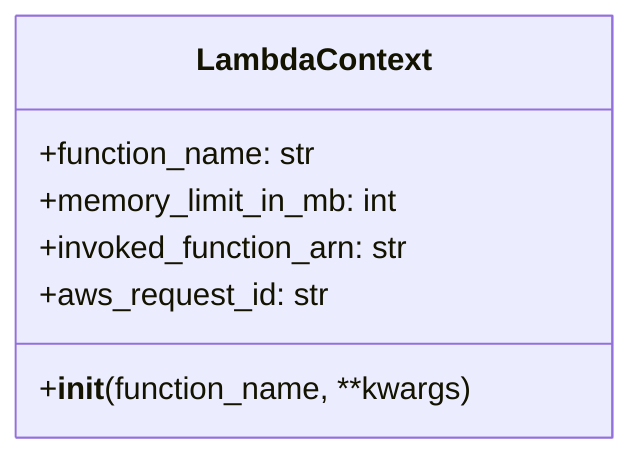

# Diagram: common/fv/python/fv/aws/lambdas/test/context.py

> Auto-generated by Obscura crawlers

## Mermaid

### SVG

<svg id="container" width="321.453125" xmlns="http://www.w3.org/2000/svg" class="classDiagram" height="232" viewBox="0 0 321.453125 232" role="graphics-document document" aria-roledescription="class"><g><defs><marker id="container_class-aggregationStart" class="marker aggregation class" refX="18" refY="7" markerWidth="190" markerHeight="240" orient="auto"><path d="M 18,7 L9,13 L1,7 L9,1 Z"></path></marker></defs><defs><marker id="container_class-aggregationEnd" class="marker aggregation class" refX="1" refY="7" markerWidth="20" markerHeight="28" orient="auto"><path d="M 18,7 L9,13 L1,7 L9,1 Z"></path></marker></defs><defs><marker id="container_class-extensionStart" class="marker extension class" refX="18" refY="7" markerWidth="190" markerHeight="240" orient="auto"><path d="M 1,7 L18,13 V 1 Z"></path></marker></defs><defs><marker id="container_class-extensionEnd" class="marker extension class" refX="1" refY="7" markerWidth="20" markerHeight="28" orient="auto"><path d="M 1,1 V 13 L18,7 Z"></path></marker></defs><defs><marker id="container_class-compositionStart" class="marker composition class" refX="18" refY="7" markerWidth="190" markerHeight="240" orient="auto"><path d="M 18,7 L9,13 L1,7 L9,1 Z"></path></marker></defs><defs><marker id="container_class-compositionEnd" class="marker composition class" refX="1" refY="7" markerWidth="20" markerHeight="28" orient="auto"><path d="M 18,7 L9,13 L1,7 L9,1 Z"></path></marker></defs><defs><marker id="container_class-dependencyStart" class="marker dependency class" refX="6" refY="7" markerWidth="190" markerHeight="240" orient="auto"><path d="M 5,7 L9,13 L1,7 L9,1 Z"></path></marker></defs><defs><marker id="container_class-dependencyEnd" class="marker dependency class" refX="13" refY="7" markerWidth="20" markerHeight="28" orient="auto"><path d="M 18,7 L9,13 L14,7 L9,1 Z"></path></marker></defs><defs><marker id="container_class-lollipopStart" class="marker lollipop class" refX="13" refY="7" markerWidth="190" markerHeight="240" orient="auto"><circle stroke="black" fill="transparent" cx="7" cy="7" r="6"></circle></marker></defs><defs><marker id="container_class-lollipopEnd" class="marker lollipop class" refX="1" refY="7" markerWidth="190" markerHeight="240" orient="auto"><circle stroke="black" fill="transparent" cx="7" cy="7" r="6"></circle></marker></defs><g class="root"><g class="clusters"></g><g class="edgePaths"></g><g class="edgeLabels"></g><g class="nodes"><g class="node default" id="classId-LambdaContext-0" transform="translate(160.7265625, 116)"><g class="basic label-container"><path d="M-152.7265625 -108 L152.7265625 -108 L152.7265625 108 L-152.7265625 108" stroke="none" stroke-width="0" fill="#ECECFF" style=""></path><path d="M-152.7265625 -108 C-45.686022914493364 -108, 61.35451667101327 -108, 152.7265625 -108 M-152.7265625 -108 C-69.4931482236186 -108, 13.740266052762792 -108, 152.7265625 -108 M152.7265625 -108 C152.7265625 -27.383436196964837, 152.7265625 53.233127606070326, 152.7265625 108 M152.7265625 -108 C152.7265625 -61.92664346123513, 152.7265625 -15.85328692247026, 152.7265625 108 M152.7265625 108 C48.19404129155974 108, -56.338479916880516 108, -152.7265625 108 M152.7265625 108 C68.08660665816463 108, -16.553349183670747 108, -152.7265625 108 M-152.7265625 108 C-152.7265625 23.422664524845516, -152.7265625 -61.15467095030897, -152.7265625 -108 M-152.7265625 108 C-152.7265625 40.50609162825967, -152.7265625 -26.987816743480664, -152.7265625 -108" stroke="#9370DB" stroke-width="1.3" fill="none" stroke-dasharray="0 0" style=""></path></g><g class="annotation-group text" transform="translate(0, -84)"></g><g class="label-group text" transform="translate(-57.296875, -84)"><g class="label" style="font-weight: bolder" transform="translate(0,-12)"><foreignObject width="114.59375" height="24">

LambdaContext

</foreignObject></g></g><g class="members-group text" transform="translate(-140.7265625, -36)"><g class="label" style="" transform="translate(0,-12)"><foreignObject width="144.796875" height="24">

+function_name: str

</foreignObject></g><g class="label" style="" transform="translate(0,12)"><foreignObject width="189.890625" height="24">

+memory_limit_in_mb: int

</foreignObject></g><g class="label" style="" transform="translate(0,36)"><foreignObject width="193.71875" height="24">

+invoked_function_arn: str

</foreignObject></g><g class="label" style="" transform="translate(0,60)"><foreignObject width="148.484375" height="24">

+aws_request_id: str

</foreignObject></g></g><g class="methods-group text" transform="translate(-140.7265625, 84)"><g class="label" style="" transform="translate(0,-12)"><foreignObject width="224.15625" height="24">

+<strong>init</strong>(function_name, **kwargs)

</foreignObject></g></g><g class="divider" style=""><path d="M-152.7265625 -60 C-34.95092725958308 -60, 82.82470798083384 -60, 152.7265625 -60 M-152.7265625 -60 C-88.52365998949723 -60, -24.320757478994466 -60, 152.7265625 -60" stroke="#9370DB" stroke-width="1.3" fill="none" stroke-dasharray="0 0" style=""></path></g><g class="divider" style=""><path d="M-152.7265625 60 C-62.63063600964307 60, 27.46529048071386 60, 152.7265625 60 M-152.7265625 60 C-53.33268446597205 60, 46.0611935680559 60, 152.7265625 60" stroke="#9370DB" stroke-width="1.3" fill="none" stroke-dasharray="0 0" style=""></path></g></g></g></g></g></svg>
