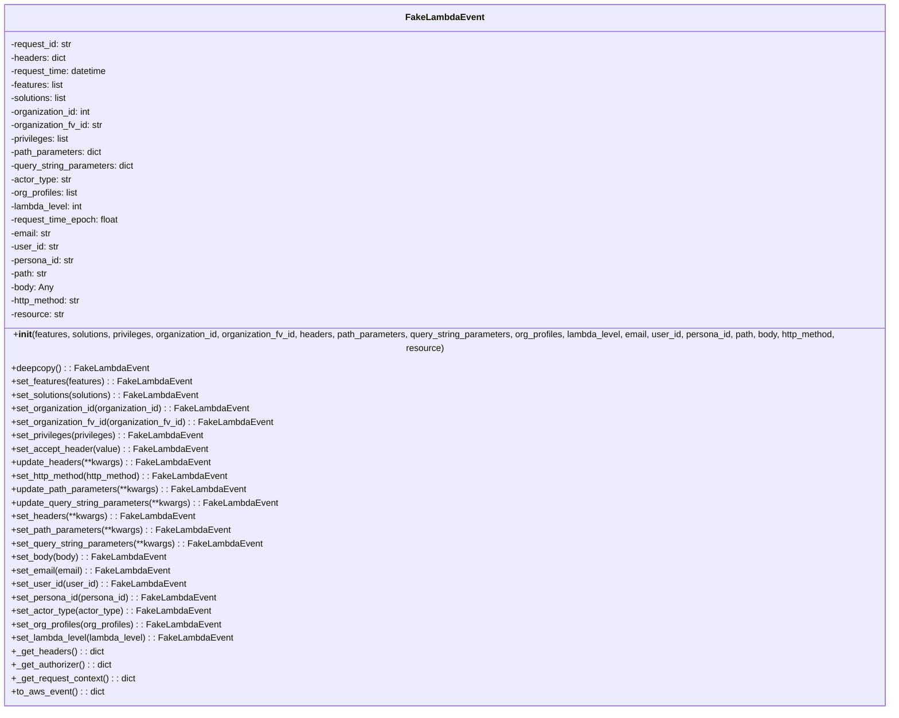

# Diagram: common/fv/python/fv/aws/lambdas/test/event.py

> Auto-generated by Obscura crawlers

## Mermaid

### SVG

<svg id="container" width="1670.1328125" xmlns="http://www.w3.org/2000/svg" class="classDiagram" height="1240" viewBox="0 0 1670.1328125 1240" role="graphics-document document" aria-roledescription="class"><g><defs><marker id="container_class-aggregationStart" class="marker aggregation class" refX="18" refY="7" markerWidth="190" markerHeight="240" orient="auto"><path d="M 18,7 L9,13 L1,7 L9,1 Z"></path></marker></defs><defs><marker id="container_class-aggregationEnd" class="marker aggregation class" refX="1" refY="7" markerWidth="20" markerHeight="28" orient="auto"><path d="M 18,7 L9,13 L1,7 L9,1 Z"></path></marker></defs><defs><marker id="container_class-extensionStart" class="marker extension class" refX="18" refY="7" markerWidth="190" markerHeight="240" orient="auto"><path d="M 1,7 L18,13 V 1 Z"></path></marker></defs><defs><marker id="container_class-extensionEnd" class="marker extension class" refX="1" refY="7" markerWidth="20" markerHeight="28" orient="auto"><path d="M 1,1 V 13 L18,7 Z"></path></marker></defs><defs><marker id="container_class-compositionStart" class="marker composition class" refX="18" refY="7" markerWidth="190" markerHeight="240" orient="auto"><path d="M 18,7 L9,13 L1,7 L9,1 Z"></path></marker></defs><defs><marker id="container_class-compositionEnd" class="marker composition class" refX="1" refY="7" markerWidth="20" markerHeight="28" orient="auto"><path d="M 18,7 L9,13 L1,7 L9,1 Z"></path></marker></defs><defs><marker id="container_class-dependencyStart" class="marker dependency class" refX="6" refY="7" markerWidth="190" markerHeight="240" orient="auto"><path d="M 5,7 L9,13 L1,7 L9,1 Z"></path></marker></defs><defs><marker id="container_class-dependencyEnd" class="marker dependency class" refX="13" refY="7" markerWidth="20" markerHeight="28" orient="auto"><path d="M 18,7 L9,13 L14,7 L9,1 Z"></path></marker></defs><defs><marker id="container_class-lollipopStart" class="marker lollipop class" refX="13" refY="7" markerWidth="190" markerHeight="240" orient="auto"><circle stroke="black" fill="transparent" cx="7" cy="7" r="6"></circle></marker></defs><defs><marker id="container_class-lollipopEnd" class="marker lollipop class" refX="1" refY="7" markerWidth="190" markerHeight="240" orient="auto"><circle stroke="black" fill="transparent" cx="7" cy="7" r="6"></circle></marker></defs><g class="root"><g class="clusters"></g><g class="edgePaths"></g><g class="edgeLabels"></g><g class="nodes"><g class="node default" id="classId-FakeLambdaEvent-0" transform="translate(835.06640625, 620)"><g class="basic label-container"><path d="M-827.06640625 -612 L827.06640625 -612 L827.06640625 612 L-827.06640625 612" stroke="none" stroke-width="0" fill="#ECECFF" style=""></path><path d="M-827.06640625 -612 C-203.93974966343853 -612, 419.18690692312293 -612, 827.06640625 -612 M-827.06640625 -612 C-370.07283790051383 -612, 86.92073044897234 -612, 827.06640625 -612 M827.06640625 -612 C827.06640625 -180.7827884159408, 827.06640625 250.43442316811843, 827.06640625 612 M827.06640625 -612 C827.06640625 -362.0396574571597, 827.06640625 -112.07931491431947, 827.06640625 612 M827.06640625 612 C408.68162895579746 612, -9.703148338405072 612, -827.06640625 612 M827.06640625 612 C225.00501179144692 612, -377.05638266710616 612, -827.06640625 612 M-827.06640625 612 C-827.06640625 230.34044893681602, -827.06640625 -151.31910212636797, -827.06640625 -612 M-827.06640625 612 C-827.06640625 157.14988726401106, -827.06640625 -297.7002254719779, -827.06640625 -612" stroke="#9370DB" stroke-width="1.3" fill="none" stroke-dasharray="0 0" style=""></path></g><g class="annotation-group text" transform="translate(0, -588)"></g><g class="label-group text" transform="translate(-65.8671875, -588)"><g class="label" style="font-weight: bolder" transform="translate(0,-12)"><foreignObject width="131.734375" height="24">

FakeLambdaEvent

</foreignObject></g></g><g class="members-group text" transform="translate(-815.06640625, -540)"><g class="label" style="" transform="translate(0,-12)"><foreignObject width="111.625" height="24">

-request_id: str

</foreignObject></g><g class="label" style="" transform="translate(0,12)"><foreignObject width="100.375" height="24">

-headers: dict

</foreignObject></g><g class="label" style="" transform="translate(0,36)"><foreignObject width="175.765625" height="24">

-request_time: datetime

</foreignObject></g><g class="label" style="" transform="translate(0,60)"><foreignObject width="96.1875" height="24">

-features: list

</foreignObject></g><g class="label" style="" transform="translate(0,84)"><foreignObject width="104.28125" height="24">

-solutions: list

</foreignObject></g><g class="label" style="" transform="translate(0,108)"><foreignObject width="146.953125" height="24">

-organization_id: int

</foreignObject></g><g class="label" style="" transform="translate(0,132)"><foreignObject width="167.46875" height="24">

-organization_fv_id: str

</foreignObject></g><g class="label" style="" transform="translate(0,156)"><foreignObject width="107.140625" height="24">

-privileges: list

</foreignObject></g><g class="label" style="" transform="translate(0,180)"><foreignObject width="166.03125" height="24">

-path_parameters: dict

</foreignObject></g><g class="label" style="" transform="translate(0,204)"><foreignObject width="224.015625" height="24">

-query_string_parameters: dict

</foreignObject></g><g class="label" style="" transform="translate(0,228)"><foreignObject width="109.640625" height="24">

-actor_type: str

</foreignObject></g><g class="label" style="" transform="translate(0,252)"><foreignObject width="123.515625" height="24">

-org_profiles: list

</foreignObject></g><g class="label" style="" transform="translate(0,276)"><foreignObject width="131.796875" height="24">

-lambda_level: int

</foreignObject></g><g class="label" style="" transform="translate(0,300)"><foreignObject width="195.84375" height="24">

-request_time_epoch: float

</foreignObject></g><g class="label" style="" transform="translate(0,324)"><foreignObject width="74.453125" height="24">

-email: str

</foreignObject></g><g class="label" style="" transform="translate(0,348)"><foreignObject width="86.765625" height="24">

-user_id: str

</foreignObject></g><g class="label" style="" transform="translate(0,372)"><foreignObject width="115.421875" height="24">

-persona_id: str

</foreignObject></g><g class="label" style="" transform="translate(0,396)"><foreignObject width="67.15625" height="24">

-path: str

</foreignObject></g><g class="label" style="" transform="translate(0,420)"><foreignObject width="77.1875" height="24">

-body: Any

</foreignObject></g><g class="label" style="" transform="translate(0,444)"><foreignObject width="128.890625" height="24">

-http_method: str

</foreignObject></g><g class="label" style="" transform="translate(0,468)"><foreignObject width="96.25" height="24">

-resource: str

</foreignObject></g></g><g class="methods-group text" transform="translate(-815.06640625, -12)"><g class="label" style="" transform="translate(0,-12)"><foreignObject width="1564.265625" height="24">

+<strong>init</strong>(features, solutions, privileges, organization_id, organization_fv_id, headers, path_parameters, query_string_parameters, org_profiles, lambda_level, email, user_id, persona_id, path, body, http_method, resource)

</foreignObject></g><g class="label" style="" transform="translate(0,12)"><foreignObject width="239.546875" height="24">

+deepcopy() : : FakeLambdaEvent

</foreignObject></g><g class="label" style="" transform="translate(0,36)"><foreignObject width="317.890625" height="24">

+set_features(features) : : FakeLambdaEvent

</foreignObject></g><g class="label" style="" transform="translate(0,60)"><foreignObject width="333.921875" height="24">

+set_solutions(solutions) : : FakeLambdaEvent

</foreignObject></g><g class="label" style="" transform="translate(0,84)"><foreignObject width="424.515625" height="24">

+set_organization_id(organization_id) : : FakeLambdaEvent

</foreignObject></g><g class="label" style="" transform="translate(0,108)"><foreignObject width="466.03125" height="24">

+set_organization_fv_id(organization_fv_id) : : FakeLambdaEvent

</foreignObject></g><g class="label" style="" transform="translate(0,132)"><foreignObject width="339.65625" height="24">

+set_privileges(privileges) : : FakeLambdaEvent

</foreignObject></g><g class="label" style="" transform="translate(0,156)"><foreignObject width="344.6875" height="24">

+set_accept_header(value) : : FakeLambdaEvent

</foreignObject></g><g class="label" style="" transform="translate(0,180)"><foreignObject width="350.625" height="24">

+update_headers(**kwargs) : : FakeLambdaEvent

</foreignObject></g><g class="label" style="" transform="translate(0,204)"><foreignObject width="389.1875" height="24">

+set_http_method(http_method) : : FakeLambdaEvent

</foreignObject></g><g class="label" style="" transform="translate(0,228)"><foreignObject width="416.28125" height="24">

+update_path_parameters(**kwargs) : : FakeLambdaEvent

</foreignObject></g><g class="label" style="" transform="translate(0,252)"><foreignObject width="473.9375" height="24">

+update_query_string_parameters(**kwargs) : : FakeLambdaEvent

</foreignObject></g><g class="label" style="" transform="translate(0,276)"><foreignObject width="321.578125" height="24">

+set_headers(**kwargs) : : FakeLambdaEvent

</foreignObject></g><g class="label" style="" transform="translate(0,300)"><foreignObject width="387.21875" height="24">

+set_path_parameters(**kwargs) : : FakeLambdaEvent

</foreignObject></g><g class="label" style="" transform="translate(0,324)"><foreignObject width="444.890625" height="24">

+set_query_string_parameters(**kwargs) : : FakeLambdaEvent

</foreignObject></g><g class="label" style="" transform="translate(0,348)"><foreignObject width="271.90625" height="24">

+set_body(body) : : FakeLambdaEvent

</foreignObject></g><g class="label" style="" transform="translate(0,372)"><foreignObject width="279.6875" height="24">

+set_email(email) : : FakeLambdaEvent

</foreignObject></g><g class="label" style="" transform="translate(0,396)"><foreignObject width="304.609375" height="24">

+set_user_id(user_id) : : FakeLambdaEvent

</foreignObject></g><g class="label" style="" transform="translate(0,420)"><foreignObject width="362.25" height="24">

+set_persona_id(persona_id) : : FakeLambdaEvent

</foreignObject></g><g class="label" style="" transform="translate(0,444)"><foreignObject width="350.859375" height="24">

+set_actor_type(actor_type) : : FakeLambdaEvent

</foreignObject></g><g class="label" style="" transform="translate(0,468)"><foreignObject width="372.078125" height="24">

+set_org_profiles(org_profiles) : : FakeLambdaEvent

</foreignObject></g><g class="label" style="" transform="translate(0,492)"><foreignObject width="394.0625" height="24">

+set_lambda_level(lambda_level) : : FakeLambdaEvent

</foreignObject></g><g class="label" style="" transform="translate(0,516)"><foreignObject width="162.671875" height="24">

+_get_headers() : : dict

</foreignObject></g><g class="label" style="" transform="translate(0,540)"><foreignObject width="178.984375" height="24">

+_get_authorizer() : : dict

</foreignObject></g><g class="label" style="" transform="translate(0,564)"><foreignObject width="221.28125" height="24">

+_get_request_context() : : dict

</foreignObject></g><g class="label" style="" transform="translate(0,588)"><foreignObject width="164.328125" height="24">

+to_aws_event() : : dict

</foreignObject></g></g><g class="divider" style=""><path d="M-827.06640625 -564 C-416.323491273461 -564, -5.580576296922004 -564, 827.06640625 -564 M-827.06640625 -564 C-452.72110450366915 -564, -78.3758027573383 -564, 827.06640625 -564" stroke="#9370DB" stroke-width="1.3" fill="none" stroke-dasharray="0 0" style=""></path></g><g class="divider" style=""><path d="M-827.06640625 -36 C-460.70717451563894 -36, -94.34794278127788 -36, 827.06640625 -36 M-827.06640625 -36 C-230.56779035659463 -36, 365.93082553681074 -36, 827.06640625 -36" stroke="#9370DB" stroke-width="1.3" fill="none" stroke-dasharray="0 0" style=""></path></g></g></g></g></g></svg>
