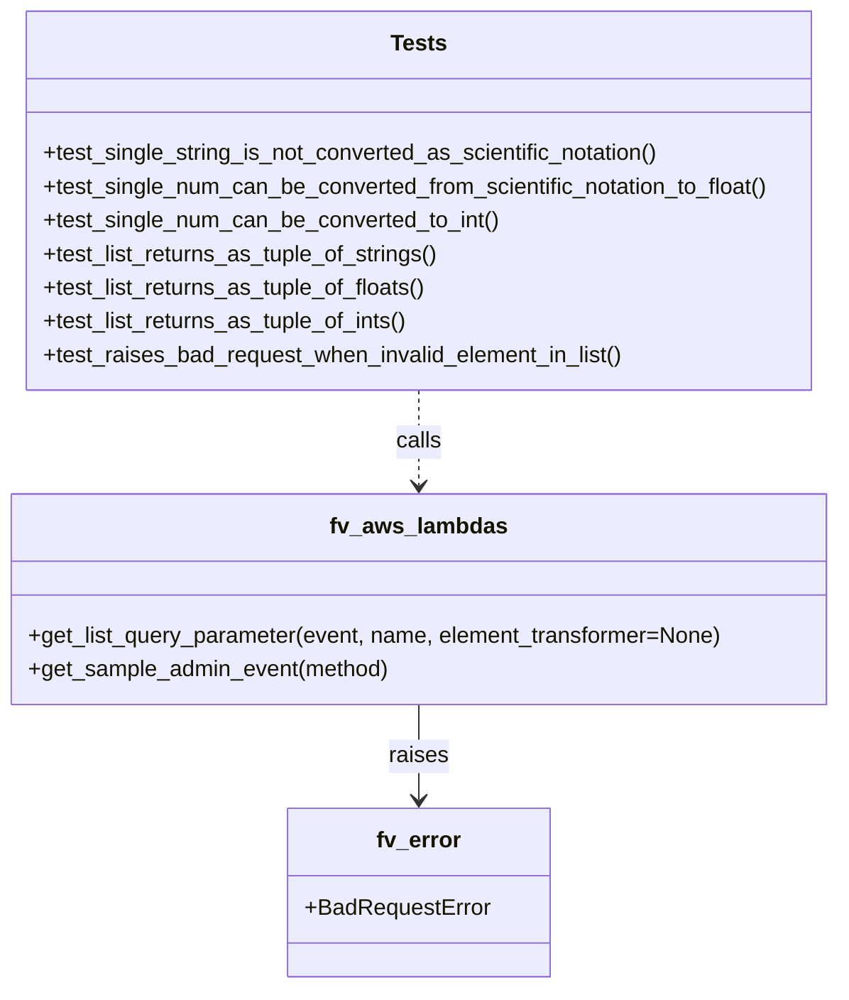

# Diagram: common/fv/python/fv/aws/lambdas/tests/test_get_list_query_parameter.py

> Auto-generated by Obscura crawlers

## Mermaid

### SVG

<svg id="container" width="601.5" xmlns="http://www.w3.org/2000/svg" class="classDiagram" height="704" viewBox="0 0 601.5 704" role="graphics-document document" aria-roledescription="class"><g><defs><marker id="container_class-aggregationStart" class="marker aggregation class" refX="18" refY="7" markerWidth="190" markerHeight="240" orient="auto"><path d="M 18,7 L9,13 L1,7 L9,1 Z"></path></marker></defs><defs><marker id="container_class-aggregationEnd" class="marker aggregation class" refX="1" refY="7" markerWidth="20" markerHeight="28" orient="auto"><path d="M 18,7 L9,13 L1,7 L9,1 Z"></path></marker></defs><defs><marker id="container_class-extensionStart" class="marker extension class" refX="18" refY="7" markerWidth="190" markerHeight="240" orient="auto"><path d="M 1,7 L18,13 V 1 Z"></path></marker></defs><defs><marker id="container_class-extensionEnd" class="marker extension class" refX="1" refY="7" markerWidth="20" markerHeight="28" orient="auto"><path d="M 1,1 V 13 L18,7 Z"></path></marker></defs><defs><marker id="container_class-compositionStart" class="marker composition class" refX="18" refY="7" markerWidth="190" markerHeight="240" orient="auto"><path d="M 18,7 L9,13 L1,7 L9,1 Z"></path></marker></defs><defs><marker id="container_class-compositionEnd" class="marker composition class" refX="1" refY="7" markerWidth="20" markerHeight="28" orient="auto"><path d="M 18,7 L9,13 L1,7 L9,1 Z"></path></marker></defs><defs><marker id="container_class-dependencyStart" class="marker dependency class" refX="6" refY="7" markerWidth="190" markerHeight="240" orient="auto"><path d="M 5,7 L9,13 L1,7 L9,1 Z"></path></marker></defs><defs><marker id="container_class-dependencyEnd" class="marker dependency class" refX="13" refY="7" markerWidth="20" markerHeight="28" orient="auto"><path d="M 18,7 L9,13 L14,7 L9,1 Z"></path></marker></defs><defs><marker id="container_class-lollipopStart" class="marker lollipop class" refX="13" refY="7" markerWidth="190" markerHeight="240" orient="auto"><circle stroke="black" fill="transparent" cx="7" cy="7" r="6"></circle></marker></defs><defs><marker id="container_class-lollipopEnd" class="marker lollipop class" refX="1" refY="7" markerWidth="190" markerHeight="240" orient="auto"><circle stroke="black" fill="transparent" cx="7" cy="7" r="6"></circle></marker></defs><g class="root"><g class="clusters"></g><g class="edgePaths"><path d="M300.75,278L300.75,284.167C300.75,290.333,300.75,302.667,300.75,314C300.75,325.333,300.75,335.667,300.75,340.833L300.75,346" id="id_Tests_fv_aws_lambdas_1" class="edge-thickness-normal edge-pattern-dashed relation" style=";;;" data-edge="true" data-et="edge" data-id="id_Tests_fv_aws_lambdas_1" data-points="W3sieCI6MzAwLjc1LCJ5IjoyNzh9LHsieCI6MzAwLjc1LCJ5IjozMTV9LHsieCI6MzAwLjc1LCJ5IjozNTJ9XQ==" marker-end="url(#container_class-dependencyEnd)"></path><path d="M300.75,502L300.75,508.167C300.75,514.333,300.75,526.667,300.75,538C300.75,549.333,300.75,559.667,300.75,564.833L300.75,570" id="id_fv_aws_lambdas_fv_error_2" class="edge-thickness-normal edge-pattern-solid relation" style=";;;" data-edge="true" data-et="edge" data-id="id_fv_aws_lambdas_fv_error_2" data-points="W3sieCI6MzAwLjc1LCJ5Ijo1MDJ9LHsieCI6MzAwLjc1LCJ5Ijo1Mzl9LHsieCI6MzAwLjc1LCJ5Ijo1NzZ9XQ==" marker-end="url(#container_class-dependencyEnd)"></path></g><g class="edgeLabels"><g class="edgeLabel" transform="translate(300.75, 315)"><g class="label" data-id="id_Tests_fv_aws_lambdas_1" transform="translate(-16.4453125, -12)"><foreignObject width="32.890625" height="24">

calls

</foreignObject></g></g><g class="edgeLabel" transform="translate(300.75, 539)"><g class="label" data-id="id_fv_aws_lambdas_fv_error_2" transform="translate(-21.25, -12)"><foreignObject width="42.5" height="24">

raises

</foreignObject></g></g></g><g class="nodes"><g class="node default" id="classId-fv_aws_lambdas-0" transform="translate(300.75, 427)"><g class="basic label-container"><path d="M-292.75 -75 L292.75 -75 L292.75 75 L-292.75 75" stroke="none" stroke-width="0" fill="#ECECFF" style=""></path><path d="M-292.75 -75 C-110.58777678682637 -75, 71.57444642634727 -75, 292.75 -75 M-292.75 -75 C-87.47405505015212 -75, 117.80188989969577 -75, 292.75 -75 M292.75 -75 C292.75 -25.859454805706825, 292.75 23.28109038858635, 292.75 75 M292.75 -75 C292.75 -35.68341884996424, 292.75 3.6331623000715183, 292.75 75 M292.75 75 C89.36331736199384 75, -114.02336527601233 75, -292.75 75 M292.75 75 C132.7075013303019 75, -27.334997339396182 75, -292.75 75 M-292.75 75 C-292.75 32.83164191707392, -292.75 -9.336716165852167, -292.75 -75 M-292.75 75 C-292.75 35.10295036035852, -292.75 -4.79409927928296, -292.75 -75" stroke="#9370DB" stroke-width="1.3" fill="none" stroke-dasharray="0 0" style=""></path></g><g class="annotation-group text" transform="translate(0, -51)"></g><g class="label-group text" transform="translate(-60.0625, -51)"><g class="label" style="font-weight: bolder" transform="translate(0,-12)"><foreignObject width="120.125" height="24">

fv_aws_lambdas

</foreignObject></g></g><g class="members-group text" transform="translate(-280.75, -3)"></g><g class="methods-group text" transform="translate(-280.75, 27)"><g class="label" style="" transform="translate(0,-12)"><foreignObject width="501.4375" height="24">

+get_list_query_parameter(event, name, element_transformer=None)

</foreignObject></g><g class="label" style="" transform="translate(0,12)"><foreignObject width="260.1875" height="24">

+get_sample_admin_event(method)

</foreignObject></g></g><g class="divider" style=""><path d="M-292.75 -27 C-152.3229780528485 -27, -11.895956105696996 -27, 292.75 -27 M-292.75 -27 C-89.62670910001185 -27, 113.4965817999763 -27, 292.75 -27" stroke="#9370DB" stroke-width="1.3" fill="none" stroke-dasharray="0 0" style=""></path></g><g class="divider" style=""><path d="M-292.75 -3 C-106.5119381400176 -3, 79.72612371996479 -3, 292.75 -3 M-292.75 -3 C-92.601380434867 -3, 107.54723913026601 -3, 292.75 -3" stroke="#9370DB" stroke-width="1.3" fill="none" stroke-dasharray="0 0" style=""></path></g></g><g class="node default" id="classId-fv_error-1" transform="translate(300.75, 636)"><g class="basic label-container"><path d="M-91.9921875 -60 L91.9921875 -60 L91.9921875 60 L-91.9921875 60" stroke="none" stroke-width="0" fill="#ECECFF" style=""></path><path d="M-91.9921875 -60 C-18.85050954047962 -60, 54.29116841904076 -60, 91.9921875 -60 M-91.9921875 -60 C-37.048685654579025 -60, 17.89481619084195 -60, 91.9921875 -60 M91.9921875 -60 C91.9921875 -18.024427755381794, 91.9921875 23.951144489236412, 91.9921875 60 M91.9921875 -60 C91.9921875 -29.774412529015287, 91.9921875 0.45117494196942687, 91.9921875 60 M91.9921875 60 C53.00527763258379 60, 14.018367765167582 60, -91.9921875 60 M91.9921875 60 C32.429748590542694 60, -27.132690318914612 60, -91.9921875 60 M-91.9921875 60 C-91.9921875 19.16592430358672, -91.9921875 -21.66815139282656, -91.9921875 -60 M-91.9921875 60 C-91.9921875 16.499594582973216, -91.9921875 -27.000810834053567, -91.9921875 -60" stroke="#9370DB" stroke-width="1.3" fill="none" stroke-dasharray="0 0" style=""></path></g><g class="annotation-group text" transform="translate(0, -36)"></g><g class="label-group text" transform="translate(-29.1875, -36)"><g class="label" style="font-weight: bolder" transform="translate(0,-12)"><foreignObject width="58.375" height="24">

fv_error

</foreignObject></g></g><g class="members-group text" transform="translate(-79.9921875, 12)"><g class="label" style="" transform="translate(0,-12)"><foreignObject width="130.796875" height="24">

+BadRequestError

</foreignObject></g></g><g class="methods-group text" transform="translate(-79.9921875, 60)"></g><g class="divider" style=""><path d="M-91.9921875 -12 C-33.504627795925686 -12, 24.98293190814863 -12, 91.9921875 -12 M-91.9921875 -12 C-46.09654770015997 -12, -0.20090790031993322 -12, 91.9921875 -12" stroke="#9370DB" stroke-width="1.3" fill="none" stroke-dasharray="0 0" style=""></path></g><g class="divider" style=""><path d="M-91.9921875 36 C-43.8788901844272 36, 4.234407131145602 36, 91.9921875 36 M-91.9921875 36 C-52.401989111302534 36, -12.811790722605068 36, 91.9921875 36" stroke="#9370DB" stroke-width="1.3" fill="none" stroke-dasharray="0 0" style=""></path></g></g><g class="node default" id="classId-Tests-2" transform="translate(300.75, 143)"><g class="basic label-container"><path d="M-285.10546875 -135 L285.10546875 -135 L285.10546875 135 L-285.10546875 135" stroke="none" stroke-width="0" fill="#ECECFF" style=""></path><path d="M-285.10546875 -135 C-115.98314622121566 -135, 53.139176307568675 -135, 285.10546875 -135 M-285.10546875 -135 C-161.72443150587958 -135, -38.34339426175916 -135, 285.10546875 -135 M285.10546875 -135 C285.10546875 -48.213573155394556, 285.10546875 38.57285368921089, 285.10546875 135 M285.10546875 -135 C285.10546875 -35.81621354879003, 285.10546875 63.36757290241994, 285.10546875 135 M285.10546875 135 C62.30183336601979 135, -160.50180201796042 135, -285.10546875 135 M285.10546875 135 C83.328246946891 135, -118.448974856218 135, -285.10546875 135 M-285.10546875 135 C-285.10546875 70.28799243230296, -285.10546875 5.575984864605914, -285.10546875 -135 M-285.10546875 135 C-285.10546875 75.40619561331272, -285.10546875 15.81239122662545, -285.10546875 -135" stroke="#9370DB" stroke-width="1.3" fill="none" stroke-dasharray="0 0" style=""></path></g><g class="annotation-group text" transform="translate(0, -111)"></g><g class="label-group text" transform="translate(-19.1171875, -111)"><g class="label" style="font-weight: bolder" transform="translate(0,-12)"><foreignObject width="38.234375" height="24">

Tests

</foreignObject></g></g><g class="members-group text" transform="translate(-273.10546875, -63)"></g><g class="methods-group text" transform="translate(-273.10546875, -33)"><g class="label" style="" transform="translate(0,-12)"><foreignObject width="447.375" height="24">

+test_single_string_is_not_converted_as_scientific_notation()

</foreignObject></g><g class="label" style="" transform="translate(0,12)"><foreignObject width="527.09375" height="24">

+test_single_num_can_be_converted_from_scientific_notation_to_float()

</foreignObject></g><g class="label" style="" transform="translate(0,36)"><foreignObject width="328.3125" height="24">

+test_single_num_can_be_converted_to_int()

</foreignObject></g><g class="label" style="" transform="translate(0,60)"><foreignObject width="285.75" height="24">

+test_list_returns_as_tuple_of_strings()

</foreignObject></g><g class="label" style="" transform="translate(0,84)"><foreignObject width="276.96875" height="24">

+test_list_returns_as_tuple_of_floats()

</foreignObject></g><g class="label" style="" transform="translate(0,108)"><foreignObject width="263.890625" height="24">

+test_list_returns_as_tuple_of_ints()

</foreignObject></g><g class="label" style="" transform="translate(0,132)"><foreignObject width="420.21875" height="24">

+test_raises_bad_request_when_invalid_element_in_list()

</foreignObject></g></g><g class="divider" style=""><path d="M-285.10546875 -87 C-169.24319035540867 -87, -53.380911960817315 -87, 285.10546875 -87 M-285.10546875 -87 C-136.50585637018378 -87, 12.093756009632443 -87, 285.10546875 -87" stroke="#9370DB" stroke-width="1.3" fill="none" stroke-dasharray="0 0" style=""></path></g><g class="divider" style=""><path d="M-285.10546875 -63 C-99.56209327411304 -63, 85.98128220177392 -63, 285.10546875 -63 M-285.10546875 -63 C-93.44702875165007 -63, 98.21141124669987 -63, 285.10546875 -63" stroke="#9370DB" stroke-width="1.3" fill="none" stroke-dasharray="0 0" style=""></path></g></g></g></g></g></svg>
