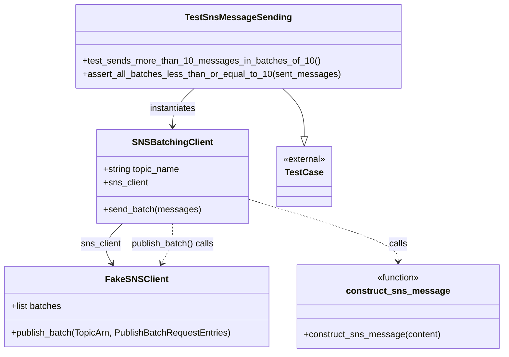

# Diagram: common/fv/python/fv/aws/lambdas/tests/test_sns_message_sending_integration.py

> Auto-generated by Obscura crawlers

## Mermaid

### SVG

<svg id="container" width="895.1640625" xmlns="http://www.w3.org/2000/svg" class="classDiagram" height="632" viewBox="0 0 895.1640625 632" role="graphics-document document" aria-roledescription="class"><g><defs><marker id="container_class-aggregationStart" class="marker aggregation class" refX="18" refY="7" markerWidth="190" markerHeight="240" orient="auto"><path d="M 18,7 L9,13 L1,7 L9,1 Z"></path></marker></defs><defs><marker id="container_class-aggregationEnd" class="marker aggregation class" refX="1" refY="7" markerWidth="20" markerHeight="28" orient="auto"><path d="M 18,7 L9,13 L1,7 L9,1 Z"></path></marker></defs><defs><marker id="container_class-extensionStart" class="marker extension class" refX="18" refY="7" markerWidth="190" markerHeight="240" orient="auto"><path d="M 1,7 L18,13 V 1 Z"></path></marker></defs><defs><marker id="container_class-extensionEnd" class="marker extension class" refX="1" refY="7" markerWidth="20" markerHeight="28" orient="auto"><path d="M 1,1 V 13 L18,7 Z"></path></marker></defs><defs><marker id="container_class-compositionStart" class="marker composition class" refX="18" refY="7" markerWidth="190" markerHeight="240" orient="auto"><path d="M 18,7 L9,13 L1,7 L9,1 Z"></path></marker></defs><defs><marker id="container_class-compositionEnd" class="marker composition class" refX="1" refY="7" markerWidth="20" markerHeight="28" orient="auto"><path d="M 18,7 L9,13 L1,7 L9,1 Z"></path></marker></defs><defs><marker id="container_class-dependencyStart" class="marker dependency class" refX="6" refY="7" markerWidth="190" markerHeight="240" orient="auto"><path d="M 5,7 L9,13 L1,7 L9,1 Z"></path></marker></defs><defs><marker id="container_class-dependencyEnd" class="marker dependency class" refX="13" refY="7" markerWidth="20" markerHeight="28" orient="auto"><path d="M 18,7 L9,13 L14,7 L9,1 Z"></path></marker></defs><defs><marker id="container_class-lollipopStart" class="marker lollipop class" refX="13" refY="7" markerWidth="190" markerHeight="240" orient="auto"><circle stroke="black" fill="transparent" cx="7" cy="7" r="6"></circle></marker></defs><defs><marker id="container_class-lollipopEnd" class="marker lollipop class" refX="1" refY="7" markerWidth="190" markerHeight="240" orient="auto"><circle stroke="black" fill="transparent" cx="7" cy="7" r="6"></circle></marker></defs><g class="root"><g class="clusters"></g><g class="edgePaths"><path d="M504.749,158L511.154,164.167C517.559,170.333,530.37,182.667,536.775,197.125C543.18,211.583,543.18,228.167,543.18,236.458L543.18,244.75" id="id_TestSnsMessageSending_TestCase_1" class="edge-thickness-normal edge-pattern-solid relation" style=";;;" data-edge="true" data-et="edge" data-id="id_TestSnsMessageSending_TestCase_1" data-points="W3sieCI6NTA0Ljc0OTIxNTI2MjI3NjgsInkiOjE1OH0seyJ4Ijo1NDMuMTc5Njg3NSwieSI6MTk1fSx7IngiOjU0My4xNzk2ODc1LCJ5IjoyNjJ9XQ==" marker-end="url(#container_class-extensionEnd)"></path><path d="M348.95,158L342.545,164.167C336.14,170.333,323.33,182.667,316.925,194C310.52,205.333,310.52,215.667,310.52,220.833L310.52,226" id="id_TestSnsMessageSending_SNSBatchingClient_2" class="edge-thickness-normal edge-pattern-solid relation" style=";;;" data-edge="true" data-et="edge" data-id="id_TestSnsMessageSending_SNSBatchingClient_2" data-points="W3sieCI6MzQ4Ljk1MDAwMzQ4NzcyMzIsInkiOjE1OH0seyJ4IjozMTAuNTE5NTMxMjUsInkiOjE5NX0seyJ4IjozMTAuNTE5NTMxMjUsInkiOjIzMn1d" marker-end="url(#container_class-dependencyEnd)"></path><path d="M219.046,400L212.331,406.167C205.615,412.333,192.185,424.667,188.884,436.638C185.583,448.609,192.412,460.219,195.827,466.024L199.241,471.828" id="id_SNSBatchingClient_FakeSNSClient_3" class="edge-thickness-normal edge-pattern-solid relation" style=";;;" data-edge="true" data-et="edge" data-id="id_SNSBatchingClient_FakeSNSClient_3" data-points="W3sieCI6MjE5LjA0NTg3NDIyNTIwNjYsInkiOjQwMH0seyJ4IjoxNzguNzUzOTA2MjUsInkiOjQzN30seyJ4IjoyMDIuMjgzNDgyMTQyODU3MTQsInkiOjQ3N31d" marker-end="url(#container_class-dependencyEnd)"></path><path d="M442.523,356.061L486.973,369.551C531.422,383.041,620.32,410.02,664.77,428.677C709.219,447.333,709.219,457.667,709.219,462.833L709.219,468" id="id_SNSBatchingClient_construct_sns_message_4" class="edge-thickness-normal edge-pattern-dashed relation" style=";;;" data-edge="true" data-et="edge" data-id="id_SNSBatchingClient_construct_sns_message_4" data-points="W3sieCI6NDQyLjUyMzQzNzUsInkiOjM1Ni4wNjE0NTk2Mjk0NTkxfSx7IngiOjcwOS4yMTg3NSwieSI6NDM3fSx7IngiOjcwOS4yMTg3NSwieSI6NDc0fV0=" marker-end="url(#container_class-dependencyEnd)"></path><path d="M310.52,400L310.52,406.167C310.52,412.333,310.52,424.667,307.105,436.638C303.69,448.609,296.861,460.219,293.447,466.024L290.032,471.828" id="id_SNSBatchingClient_FakeSNSClient_5" class="edge-thickness-normal edge-pattern-dashed relation" style=";;;" data-edge="true" data-et="edge" data-id="id_SNSBatchingClient_FakeSNSClient_5" data-points="W3sieCI6MzEwLjUxOTUzMTI1LCJ5Ijo0MDB9LHsieCI6MzEwLjUxOTUzMTI1LCJ5Ijo0Mzd9LHsieCI6Mjg2Ljk4OTk1NTM1NzE0MjgzLCJ5Ijo0Nzd9XQ==" marker-end="url(#container_class-dependencyEnd)"></path></g><g class="edgeLabels"><g class="edgeLabel"><g class="label" data-id="id_TestSnsMessageSending_TestCase_1" transform="translate(0, 0)"><foreignObject width="0" height="0">

</foreignObject></g></g><g class="edgeLabel" transform="translate(310.51953125, 195)"><g class="label" data-id="id_TestSnsMessageSending_SNSBatchingClient_2" transform="translate(-42.9140625, -12)"><foreignObject width="85.828125" height="24">

instantiates

</foreignObject></g></g><g class="edgeLabel" transform="translate(178.75390625, 437)"><g class="label" data-id="id_SNSBatchingClient_FakeSNSClient_3" transform="translate(-36.3671875, -12)"><foreignObject width="72.734375" height="24">

sns_client

</foreignObject></g></g><g class="edgeLabel" transform="translate(709.21875, 437)"><g class="label" data-id="id_SNSBatchingClient_construct_sns_message_4" transform="translate(-16.4453125, -12)"><foreignObject width="32.890625" height="24">

calls

</foreignObject></g></g><g class="edgeLabel" transform="translate(310.51953125, 437)"><g class="label" data-id="id_SNSBatchingClient_FakeSNSClient_5" transform="translate(-75.3984375, -12)"><foreignObject width="150.796875" height="24">

publish_batch() calls

</foreignObject></g></g></g><g class="nodes"><g class="node default" id="classId-FakeSNSClient-0" transform="translate(244.63671875, 549)"><g class="basic label-container"><path d="M-236.63671875 -72 L236.63671875 -72 L236.63671875 72 L-236.63671875 72" stroke="none" stroke-width="0" fill="#ECECFF" style=""></path><path d="M-236.63671875 -72 C-64.76510741662548 -72, 107.10650391674903 -72, 236.63671875 -72 M-236.63671875 -72 C-69.1232848994791 -72, 98.3901489510418 -72, 236.63671875 -72 M236.63671875 -72 C236.63671875 -39.26208517587979, 236.63671875 -6.5241703517595795, 236.63671875 72 M236.63671875 -72 C236.63671875 -17.61839507173699, 236.63671875 36.76320985652602, 236.63671875 72 M236.63671875 72 C49.55234356941196 72, -137.53203161117608 72, -236.63671875 72 M236.63671875 72 C113.40636712002492 72, -9.82398450995015 72, -236.63671875 72 M-236.63671875 72 C-236.63671875 19.79538152364306, -236.63671875 -32.40923695271388, -236.63671875 -72 M-236.63671875 72 C-236.63671875 21.818880518832465, -236.63671875 -28.36223896233507, -236.63671875 -72" stroke="#9370DB" stroke-width="1.3" fill="none" stroke-dasharray="0 0" style=""></path></g><g class="annotation-group text" transform="translate(0, -48)"></g><g class="label-group text" transform="translate(-52.2578125, -48)"><g class="label" style="font-weight: bolder" transform="translate(0,-12)"><foreignObject width="104.515625" height="24">

FakeSNSClient

</foreignObject></g></g><g class="members-group text" transform="translate(-224.63671875, 0)"><g class="label" style="" transform="translate(0,-12)"><foreignObject width="91.484375" height="24">

+list batches

</foreignObject></g></g><g class="methods-group text" transform="translate(-224.63671875, 48)"><g class="label" style="" transform="translate(0,-12)"><foreignObject width="397.015625" height="24">

+publish_batch(TopicArn, PublishBatchRequestEntries)

</foreignObject></g></g><g class="divider" style=""><path d="M-236.63671875 -24 C-98.28593295451046 -24, 40.064852840979086 -24, 236.63671875 -24 M-236.63671875 -24 C-59.447977611946214 -24, 117.74076352610757 -24, 236.63671875 -24" stroke="#9370DB" stroke-width="1.3" fill="none" stroke-dasharray="0 0" style=""></path></g><g class="divider" style=""><path d="M-236.63671875 24 C-120.92915320480084 24, -5.221587659601681 24, 236.63671875 24 M-236.63671875 24 C-88.39390332152973 24, 59.84891210694053 24, 236.63671875 24" stroke="#9370DB" stroke-width="1.3" fill="none" stroke-dasharray="0 0" style=""></path></g></g><g class="node default" id="classId-SNSBatchingClient-1" transform="translate(310.51953125, 316)"><g class="basic label-container"><path d="M-132.00390625 -84 L132.00390625 -84 L132.00390625 84 L-132.00390625 84" stroke="none" stroke-width="0" fill="#ECECFF" style=""></path><path d="M-132.00390625 -84 C-39.80356197549287 -84, 52.39678229901426 -84, 132.00390625 -84 M-132.00390625 -84 C-76.33976965149674 -84, -20.67563305299346 -84, 132.00390625 -84 M132.00390625 -84 C132.00390625 -17.903558593754582, 132.00390625 48.192882812490836, 132.00390625 84 M132.00390625 -84 C132.00390625 -35.77571673091738, 132.00390625 12.448566538165238, 132.00390625 84 M132.00390625 84 C52.811812940783 84, -26.380280368434 84, -132.00390625 84 M132.00390625 84 C50.116882357675095 84, -31.77014153464981 84, -132.00390625 84 M-132.00390625 84 C-132.00390625 29.084398560269456, -132.00390625 -25.831202879461088, -132.00390625 -84 M-132.00390625 84 C-132.00390625 44.95844906855495, -132.00390625 5.9168981371098965, -132.00390625 -84" stroke="#9370DB" stroke-width="1.3" fill="none" stroke-dasharray="0 0" style=""></path></g><g class="annotation-group text" transform="translate(0, -60)"></g><g class="label-group text" transform="translate(-67.7265625, -60)"><g class="label" style="font-weight: bolder" transform="translate(0,-12)"><foreignObject width="135.453125" height="24">

SNSBatchingClient

</foreignObject></g></g><g class="members-group text" transform="translate(-120.00390625, -12)"><g class="label" style="" transform="translate(0,-12)"><foreignObject width="139.234375" height="24">

+string topic_name

</foreignObject></g><g class="label" style="" transform="translate(0,12)"><foreignObject width="80.71875" height="24">

+sns_client

</foreignObject></g></g><g class="methods-group text" transform="translate(-120.00390625, 60)"><g class="label" style="" transform="translate(0,-12)"><foreignObject width="172.28125" height="24">

+send_batch(messages)

</foreignObject></g></g><g class="divider" style=""><path d="M-132.00390625 -36 C-29.522630860676045 -36, 72.95864452864791 -36, 132.00390625 -36 M-132.00390625 -36 C-39.25326787742284 -36, 53.497370495154314 -36, 132.00390625 -36" stroke="#9370DB" stroke-width="1.3" fill="none" stroke-dasharray="0 0" style=""></path></g><g class="divider" style=""><path d="M-132.00390625 36 C-43.22674937403117 36, 45.550407501937656 36, 132.00390625 36 M-132.00390625 36 C-78.16865763544799 36, -24.33340902089597 36, 132.00390625 36" stroke="#9370DB" stroke-width="1.3" fill="none" stroke-dasharray="0 0" style=""></path></g></g><g class="node default" id="classId-TestSnsMessageSending-2" transform="translate(426.849609375, 83)"><g class="basic label-container"><path d="M-284.49609375 -75 L284.49609375 -75 L284.49609375 75 L-284.49609375 75" stroke="none" stroke-width="0" fill="#ECECFF" style=""></path><path d="M-284.49609375 -75 C-102.81877672690149 -75, 78.85854029619702 -75, 284.49609375 -75 M-284.49609375 -75 C-119.7222250689112 -75, 45.0516436121776 -75, 284.49609375 -75 M284.49609375 -75 C284.49609375 -38.704724631406734, 284.49609375 -2.4094492628134674, 284.49609375 75 M284.49609375 -75 C284.49609375 -15.916526525664352, 284.49609375 43.166946948671296, 284.49609375 75 M284.49609375 75 C102.84222580273487 75, -78.81164214453025 75, -284.49609375 75 M284.49609375 75 C80.73474950831763 75, -123.02659473336473 75, -284.49609375 75 M-284.49609375 75 C-284.49609375 42.808599500659525, -284.49609375 10.617199001319051, -284.49609375 -75 M-284.49609375 75 C-284.49609375 44.65192375375448, -284.49609375 14.303847507508962, -284.49609375 -75" stroke="#9370DB" stroke-width="1.3" fill="none" stroke-dasharray="0 0" style=""></path></g><g class="annotation-group text" transform="translate(0, -51)"></g><g class="label-group text" transform="translate(-89.2421875, -51)"><g class="label" style="font-weight: bolder" transform="translate(0,-12)"><foreignObject width="178.484375" height="24">

TestSnsMessageSending

</foreignObject></g></g><g class="members-group text" transform="translate(-272.49609375, -3)"></g><g class="methods-group text" transform="translate(-272.49609375, 27)"><g class="label" style="" transform="translate(0,-12)"><foreignObject width="414.859375" height="24">

+test_sends_more_than_10_messages_in_batches_of_10()

</foreignObject></g><g class="label" style="" transform="translate(0,12)"><foreignObject width="455.75" height="24">

+assert_all_batches_less_than_or_equal_to_10(sent_messages)

</foreignObject></g></g><g class="divider" style=""><path d="M-284.49609375 -27 C-91.05089571533196 -27, 102.39430231933608 -27, 284.49609375 -27 M-284.49609375 -27 C-118.97735484788328 -27, 46.54138405423345 -27, 284.49609375 -27" stroke="#9370DB" stroke-width="1.3" fill="none" stroke-dasharray="0 0" style=""></path></g><g class="divider" style=""><path d="M-284.49609375 -3 C-138.448609954636 -3, 7.598873840728004 -3, 284.49609375 -3 M-284.49609375 -3 C-152.58563383529014 -3, -20.675173920580278 -3, 284.49609375 -3" stroke="#9370DB" stroke-width="1.3" fill="none" stroke-dasharray="0 0" style=""></path></g></g><g class="node default" id="classId-construct_sns_message-3" transform="translate(709.21875, 549)"><g class="basic label-container"><path d="M-177.9453125 -75 L177.9453125 -75 L177.9453125 75 L-177.9453125 75" stroke="none" stroke-width="0" fill="#ECECFF" style=""></path><path d="M-177.9453125 -75 C-94.79310937254758 -75, -11.640906245095152 -75, 177.9453125 -75 M-177.9453125 -75 C-67.65538616346377 -75, 42.63454017307245 -75, 177.9453125 -75 M177.9453125 -75 C177.9453125 -40.87347060898751, 177.9453125 -6.746941217975021, 177.9453125 75 M177.9453125 -75 C177.9453125 -28.16633770419017, 177.9453125 18.66732459161966, 177.9453125 75 M177.9453125 75 C50.58095885168437 75, -76.78339479663126 75, -177.9453125 75 M177.9453125 75 C71.41652379128449 75, -35.11226491743102 75, -177.9453125 75 M-177.9453125 75 C-177.9453125 42.49664715908942, -177.9453125 9.99329431817884, -177.9453125 -75 M-177.9453125 75 C-177.9453125 24.95728338190016, -177.9453125 -25.085433236199677, -177.9453125 -75" stroke="#9370DB" stroke-width="1.3" fill="none" stroke-dasharray="0 0" style=""></path></g><g class="annotation-group text" transform="translate(-39.484375, -51)"><g class="label" style="" transform="translate(0,-12)"><foreignObject width="78.96875" height="24">

«function»

</foreignObject></g></g><g class="label-group text" transform="translate(-86.84375, -27)"><g class="label" style="font-weight: bolder" transform="translate(0,-12)"><foreignObject width="173.6875" height="24">

construct_sns_message

</foreignObject></g></g><g class="members-group text" transform="translate(-165.9453125, 21)"></g><g class="methods-group text" transform="translate(-165.9453125, 51)"><g class="label" style="" transform="translate(0,-12)"><foreignObject width="245.046875" height="24">

+construct_sns_message(content)

</foreignObject></g></g><g class="divider" style=""><path d="M-177.9453125 -3 C-65.5861402492819 -3, 46.773032001436206 -3, 177.9453125 -3 M-177.9453125 -3 C-37.85411776649599 -3, 102.23707696700802 -3, 177.9453125 -3" stroke="#9370DB" stroke-width="1.3" fill="none" stroke-dasharray="0 0" style=""></path></g><g class="divider" style=""><path d="M-177.9453125 21 C-99.66600626754628 21, -21.38670003509256 21, 177.9453125 21 M-177.9453125 21 C-79.5737126593862 21, 18.797887181227594 21, 177.9453125 21" stroke="#9370DB" stroke-width="1.3" fill="none" stroke-dasharray="0 0" style=""></path></g></g><g class="node default" id="classId-TestCase-4" transform="translate(543.1796875, 316)"><g class="basic label-container"><path d="M-50.65625 -54 L50.65625 -54 L50.65625 54 L-50.65625 54" stroke="none" stroke-width="0" fill="#ECECFF" style=""></path><path d="M-50.65625 -54 C-11.208210535731496 -54, 28.23982892853701 -54, 50.65625 -54 M-50.65625 -54 C-22.618725585791548 -54, 5.418798828416904 -54, 50.65625 -54 M50.65625 -54 C50.65625 -17.84709135783119, 50.65625 18.30581728433762, 50.65625 54 M50.65625 -54 C50.65625 -32.15187661139882, 50.65625 -10.303753222797646, 50.65625 54 M50.65625 54 C16.518253119947268 54, -17.619743760105465 54, -50.65625 54 M50.65625 54 C12.35731803762009 54, -25.94161392475982 54, -50.65625 54 M-50.65625 54 C-50.65625 22.57113755430197, -50.65625 -8.85772489139606, -50.65625 -54 M-50.65625 54 C-50.65625 30.55004694246, -50.65625 7.10009388492, -50.65625 -54" stroke="#9370DB" stroke-width="1.3" fill="none" stroke-dasharray="0 0" style=""></path></g><g class="annotation-group text" transform="translate(-38.65625, -30)"><g class="label" style="" transform="translate(0,-12)"><foreignObject width="77.3125" height="24">

«external»

</foreignObject></g></g><g class="label-group text" transform="translate(-32.359375, -6)"><g class="label" style="font-weight: bolder" transform="translate(0,-12)"><foreignObject width="64.71875" height="24">

TestCase

</foreignObject></g></g><g class="members-group text" transform="translate(-38.65625, 42)"></g><g class="methods-group text" transform="translate(-38.65625, 72)"></g><g class="divider" style=""><path d="M-50.65625 18 C-11.585833570595028 18, 27.484582858809944 18, 50.65625 18 M-50.65625 18 C-11.17289852774475 18, 28.3104529445105 18, 50.65625 18" stroke="#9370DB" stroke-width="1.3" fill="none" stroke-dasharray="0 0" style=""></path></g><g class="divider" style=""><path d="M-50.65625 36 C-15.392122825686599 36, 19.872004348626803 36, 50.65625 36 M-50.65625 36 C-15.810835577465696 36, 19.03457884506861 36, 50.65625 36" stroke="#9370DB" stroke-width="1.3" fill="none" stroke-dasharray="0 0" style=""></path></g></g></g></g></g></svg>
