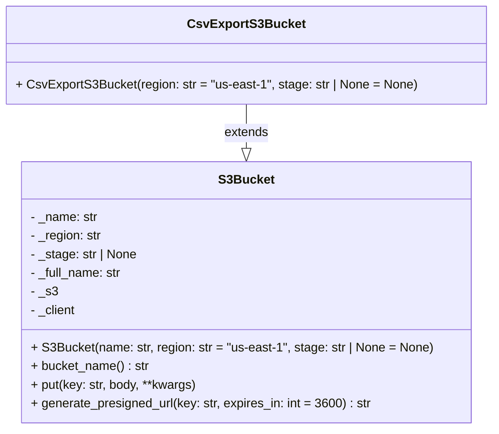

# Diagram: common/fv/python/fv/aws/s3.py

> Auto-generated by Obscura crawlers

## Mermaid

### SVG

<svg id="container" width="618.125" xmlns="http://www.w3.org/2000/svg" class="classDiagram" height="552" viewBox="0 0 618.125 552" role="graphics-document document" aria-roledescription="class"><g><defs><marker id="container_class-aggregationStart" class="marker aggregation class" refX="18" refY="7" markerWidth="190" markerHeight="240" orient="auto"><path d="M 18,7 L9,13 L1,7 L9,1 Z"></path></marker></defs><defs><marker id="container_class-aggregationEnd" class="marker aggregation class" refX="1" refY="7" markerWidth="20" markerHeight="28" orient="auto"><path d="M 18,7 L9,13 L1,7 L9,1 Z"></path></marker></defs><defs><marker id="container_class-extensionStart" class="marker extension class" refX="18" refY="7" markerWidth="190" markerHeight="240" orient="auto"><path d="M 1,7 L18,13 V 1 Z"></path></marker></defs><defs><marker id="container_class-extensionEnd" class="marker extension class" refX="1" refY="7" markerWidth="20" markerHeight="28" orient="auto"><path d="M 1,1 V 13 L18,7 Z"></path></marker></defs><defs><marker id="container_class-compositionStart" class="marker composition class" refX="18" refY="7" markerWidth="190" markerHeight="240" orient="auto"><path d="M 18,7 L9,13 L1,7 L9,1 Z"></path></marker></defs><defs><marker id="container_class-compositionEnd" class="marker composition class" refX="1" refY="7" markerWidth="20" markerHeight="28" orient="auto"><path d="M 18,7 L9,13 L1,7 L9,1 Z"></path></marker></defs><defs><marker id="container_class-dependencyStart" class="marker dependency class" refX="6" refY="7" markerWidth="190" markerHeight="240" orient="auto"><path d="M 5,7 L9,13 L1,7 L9,1 Z"></path></marker></defs><defs><marker id="container_class-dependencyEnd" class="marker dependency class" refX="13" refY="7" markerWidth="20" markerHeight="28" orient="auto"><path d="M 18,7 L9,13 L14,7 L9,1 Z"></path></marker></defs><defs><marker id="container_class-lollipopStart" class="marker lollipop class" refX="13" refY="7" markerWidth="190" markerHeight="240" orient="auto"><circle stroke="black" fill="transparent" cx="7" cy="7" r="6"></circle></marker></defs><defs><marker id="container_class-lollipopEnd" class="marker lollipop class" refX="1" refY="7" markerWidth="190" markerHeight="240" orient="auto"><circle stroke="black" fill="transparent" cx="7" cy="7" r="6"></circle></marker></defs><g class="root"><g class="clusters"></g><g class="edgePaths"><path d="M309.063,134L309.063,140.167C309.063,146.333,309.063,158.667,309.063,168.125C309.063,177.583,309.063,184.167,309.063,187.458L309.063,190.75" id="id_CsvExportS3Bucket_S3Bucket_1" class="edge-thickness-normal edge-pattern-solid relation" style=";;;" data-edge="true" data-et="edge" data-id="id_CsvExportS3Bucket_S3Bucket_1" data-points="W3sieCI6MzA5LjA2MjUsInkiOjEzNH0seyJ4IjozMDkuMDYyNSwieSI6MTcxfSx7IngiOjMwOS4wNjI1LCJ5IjoyMDh9XQ==" marker-end="url(#container_class-extensionEnd)"></path></g><g class="edgeLabels"><g class="edgeLabel" transform="translate(309.0625, 171)"><g class="label" data-id="id_CsvExportS3Bucket_S3Bucket_1" transform="translate(-28.5078125, -12)"><foreignObject width="57.015625" height="24">

extends

</foreignObject></g></g></g><g class="nodes"><g class="node default" id="classId-S3Bucket-0" transform="translate(309.0625, 376)"><g class="basic label-container"><path d="M-284.80078125 -168 L284.80078125 -168 L284.80078125 168 L-284.80078125 168" stroke="none" stroke-width="0" fill="#ECECFF" style=""></path><path d="M-284.80078125 -168 C-165.0082413734276 -168, -45.215701496855246 -168, 284.80078125 -168 M-284.80078125 -168 C-84.33586418511129 -168, 116.12905287977742 -168, 284.80078125 -168 M284.80078125 -168 C284.80078125 -95.58653375845574, 284.80078125 -23.173067516911487, 284.80078125 168 M284.80078125 -168 C284.80078125 -50.14154518683591, 284.80078125 67.71690962632817, 284.80078125 168 M284.80078125 168 C67.12819892252219 168, -150.54438340495562 168, -284.80078125 168 M284.80078125 168 C59.25580890518728 168, -166.28916343962544 168, -284.80078125 168 M-284.80078125 168 C-284.80078125 87.76681708754967, -284.80078125 7.533634175099337, -284.80078125 -168 M-284.80078125 168 C-284.80078125 68.09888214664156, -284.80078125 -31.802235706716885, -284.80078125 -168" stroke="#9370DB" stroke-width="1.3" fill="none" stroke-dasharray="0 0" style=""></path></g><g class="annotation-group text" transform="translate(0, -144)"></g><g class="label-group text" transform="translate(-33.8984375, -144)"><g class="label" style="font-weight: bolder" transform="translate(0,-12)"><foreignObject width="67.796875" height="24">

S3Bucket

</foreignObject></g></g><g class="members-group text" transform="translate(-272.80078125, -96)"><g class="label" style="" transform="translate(0,-12)"><foreignObject width="87.03125" height="24">

- _name: str

</foreignObject></g><g class="label" style="" transform="translate(0,12)"><foreignObject width="92.484375" height="24">

- _region: str

</foreignObject></g><g class="label" style="" transform="translate(0,36)"><foreignObject width="138.28125" height="24">

- _stage: str | None

</foreignObject></g><g class="label" style="" transform="translate(0,60)"><foreignObject width="119.078125" height="24">

- _full_name: str

</foreignObject></g><g class="label" style="" transform="translate(0,84)"><foreignObject width="34.46875" height="24">

- _s3

</foreignObject></g><g class="label" style="" transform="translate(0,108)"><foreignObject width="59.421875" height="24">

- _client

</foreignObject></g></g><g class="methods-group text" transform="translate(-272.80078125, 72)"><g class="label" style="" transform="translate(0,-12)"><foreignObject width="511.703125" height="24">

+ S3Bucket(name: str, region: str = "us-east-1", stage: str | None = None)

</foreignObject></g><g class="label" style="" transform="translate(0,12)"><foreignObject width="152.1875" height="24">

+ bucket_name() : str

</foreignObject></g><g class="label" style="" transform="translate(0,36)"><foreignObject width="213.765625" height="24">

+ put(key: str, body, **kwargs)

</foreignObject></g><g class="label" style="" transform="translate(0,60)"><foreignObject width="437.53125" height="24">

+ generate_presigned_url(key: str, expires_in: int = 3600) : str

</foreignObject></g></g><g class="divider" style=""><path d="M-284.80078125 -120 C-127.9155230767291 -120, 28.969735096541797 -120, 284.80078125 -120 M-284.80078125 -120 C-82.07081126323982 -120, 120.65915872352036 -120, 284.80078125 -120" stroke="#9370DB" stroke-width="1.3" fill="none" stroke-dasharray="0 0" style=""></path></g><g class="divider" style=""><path d="M-284.80078125 48 C-129.6654035343427 48, 25.469974181314626 48, 284.80078125 48 M-284.80078125 48 C-65.10045658886406 48, 154.59986807227187 48, 284.80078125 48" stroke="#9370DB" stroke-width="1.3" fill="none" stroke-dasharray="0 0" style=""></path></g></g><g class="node default" id="classId-CsvExportS3Bucket-1" transform="translate(309.0625, 71)"><g class="basic label-container"><path d="M-301.0625 -63 L301.0625 -63 L301.0625 63 L-301.0625 63" stroke="none" stroke-width="0" fill="#ECECFF" style=""></path><path d="M-301.0625 -63 C-100.86991384829017 -63, 99.32267230341967 -63, 301.0625 -63 M-301.0625 -63 C-77.06515339382378 -63, 146.93219321235244 -63, 301.0625 -63 M301.0625 -63 C301.0625 -23.052663302629597, 301.0625 16.894673394740806, 301.0625 63 M301.0625 -63 C301.0625 -22.85385444737409, 301.0625 17.29229110525182, 301.0625 63 M301.0625 63 C109.24398712654616 63, -82.57452574690768 63, -301.0625 63 M301.0625 63 C168.0126951459969 63, 34.9628902919938 63, -301.0625 63 M-301.0625 63 C-301.0625 19.139971696606757, -301.0625 -24.720056606786486, -301.0625 -63 M-301.0625 63 C-301.0625 20.18111717842251, -301.0625 -22.637765643154978, -301.0625 -63" stroke="#9370DB" stroke-width="1.3" fill="none" stroke-dasharray="0 0" style=""></path></g><g class="annotation-group text" transform="translate(0, -39)"></g><g class="label-group text" transform="translate(-70.296875, -39)"><g class="label" style="font-weight: bolder" transform="translate(0,-12)"><foreignObject width="140.59375" height="24">

CsvExportS3Bucket

</foreignObject></g></g><g class="members-group text" transform="translate(-289.0625, 9)"></g><g class="methods-group text" transform="translate(-289.0625, 39)"><g class="label" style="" transform="translate(0,-12)"><foreignObject width="507.828125" height="24">

+ CsvExportS3Bucket(region: str = "us-east-1", stage: str | None = None)

</foreignObject></g></g><g class="divider" style=""><path d="M-301.0625 -15 C-81.1488663296864 -15, 138.7647673406272 -15, 301.0625 -15 M-301.0625 -15 C-107.97002494706854 -15, 85.12245010586292 -15, 301.0625 -15" stroke="#9370DB" stroke-width="1.3" fill="none" stroke-dasharray="0 0" style=""></path></g><g class="divider" style=""><path d="M-301.0625 9 C-138.14704505381016 9, 24.76840989237968 9, 301.0625 9 M-301.0625 9 C-158.06946666456642 9, -15.07643332913284 9, 301.0625 9" stroke="#9370DB" stroke-width="1.3" fill="none" stroke-dasharray="0 0" style=""></path></g></g></g></g></g></svg>
