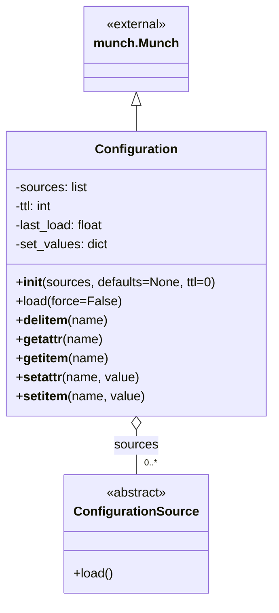

# Diagram: common/fv/python/fv/config/__init__.py

> Auto-generated by Obscura crawlers

## Mermaid

### SVG

<svg id="container" width="342.140625" xmlns="http://www.w3.org/2000/svg" class="classDiagram" height="758" viewBox="0 0 342.140625 758" role="graphics-document document" aria-roledescription="class"><g><defs><marker id="container_class-aggregationStart" class="marker aggregation class" refX="18" refY="7" markerWidth="190" markerHeight="240" orient="auto"><path d="M 18,7 L9,13 L1,7 L9,1 Z"></path></marker></defs><defs><marker id="container_class-aggregationEnd" class="marker aggregation class" refX="1" refY="7" markerWidth="20" markerHeight="28" orient="auto"><path d="M 18,7 L9,13 L1,7 L9,1 Z"></path></marker></defs><defs><marker id="container_class-extensionStart" class="marker extension class" refX="18" refY="7" markerWidth="190" markerHeight="240" orient="auto"><path d="M 1,7 L18,13 V 1 Z"></path></marker></defs><defs><marker id="container_class-extensionEnd" class="marker extension class" refX="1" refY="7" markerWidth="20" markerHeight="28" orient="auto"><path d="M 1,1 V 13 L18,7 Z"></path></marker></defs><defs><marker id="container_class-compositionStart" class="marker composition class" refX="18" refY="7" markerWidth="190" markerHeight="240" orient="auto"><path d="M 18,7 L9,13 L1,7 L9,1 Z"></path></marker></defs><defs><marker id="container_class-compositionEnd" class="marker composition class" refX="1" refY="7" markerWidth="20" markerHeight="28" orient="auto"><path d="M 18,7 L9,13 L1,7 L9,1 Z"></path></marker></defs><defs><marker id="container_class-dependencyStart" class="marker dependency class" refX="6" refY="7" markerWidth="190" markerHeight="240" orient="auto"><path d="M 5,7 L9,13 L1,7 L9,1 Z"></path></marker></defs><defs><marker id="container_class-dependencyEnd" class="marker dependency class" refX="13" refY="7" markerWidth="20" markerHeight="28" orient="auto"><path d="M 18,7 L9,13 L14,7 L9,1 Z"></path></marker></defs><defs><marker id="container_class-lollipopStart" class="marker lollipop class" refX="13" refY="7" markerWidth="190" markerHeight="240" orient="auto"><circle stroke="black" fill="transparent" cx="7" cy="7" r="6"></circle></marker></defs><defs><marker id="container_class-lollipopEnd" class="marker lollipop class" refX="1" refY="7" markerWidth="190" markerHeight="240" orient="auto"><circle stroke="black" fill="transparent" cx="7" cy="7" r="6"></circle></marker></defs><g class="root"><g class="clusters"></g><g class="edgePaths"><path d="M171.07,133.25L171.07,134.542C171.07,135.833,171.07,138.417,171.07,143.875C171.07,149.333,171.07,157.667,171.07,161.833L171.07,166" id="id_munch.Munch_Configuration_1" class="edge-thickness-normal edge-pattern-solid relation" style=";;;" data-edge="true" data-et="edge" data-id="id_munch.Munch_Configuration_1" data-points="W3sieCI6MTcxLjA3MDMxMjUsInkiOjExNn0seyJ4IjoxNzEuMDcwMzEyNSwieSI6MTQxfSx7IngiOjE3MS4wNzAzMTI1LCJ5IjoxNjZ9XQ==" marker-start="url(#container_class-extensionStart)"></path><path d="M171.07,543.25L171.07,546.542C171.07,549.833,171.07,556.417,171.07,565.875C171.07,575.333,171.07,587.667,171.07,593.833L171.07,600" id="id_Configuration_ConfigurationSource_2" class="edge-thickness-normal edge-pattern-solid relation" style=";;;" data-edge="true" data-et="edge" data-id="id_Configuration_ConfigurationSource_2" data-points="W3sieCI6MTcxLjA3MDMxMjUsInkiOjUyNn0seyJ4IjoxNzEuMDcwMzEyNSwieSI6NTYzfSx7IngiOjE3MS4wNzAzMTI1LCJ5Ijo2MDB9XQ==" marker-start="url(#container_class-aggregationStart)"></path></g><g class="edgeLabels"><g class="edgeLabel"><g class="label" data-id="id_munch.Munch_Configuration_1" transform="translate(0, 0)"><foreignObject width="0" height="0">

</foreignObject></g></g><g class="edgeLabel" transform="translate(171.0703125, 563)"><g class="label" data-id="id_Configuration_ConfigurationSource_2" transform="translate(-27.6796875, -12)"><foreignObject width="55.359375" height="24">

sources

</foreignObject></g></g><g class="edgeTerminals" transform="translate(181.07031124999997, 577.4999989285715)"><g class="inner" transform="translate(0, 0)"></g><foreignObject style="width: 36px; height: 12px;">
0..*
</foreignObject></g></g><g class="nodes"><g class="node default" id="classId-ConfigurationSource-0" transform="translate(171.0703125, 675)"><g class="basic label-container"><path d="M-86.25 -75 L86.25 -75 L86.25 75 L-86.25 75" stroke="none" stroke-width="0" fill="#ECECFF" style=""></path><path d="M-86.25 -75 C-17.556452630118898 -75, 51.137094739762205 -75, 86.25 -75 M-86.25 -75 C-31.12521860269073 -75, 23.99956279461854 -75, 86.25 -75 M86.25 -75 C86.25 -29.591244558751114, 86.25 15.817510882497771, 86.25 75 M86.25 -75 C86.25 -19.570302657795196, 86.25 35.85939468440961, 86.25 75 M86.25 75 C47.56917751256172 75, 8.888355025123445 75, -86.25 75 M86.25 75 C32.03720120479954 75, -22.175597590400926 75, -86.25 75 M-86.25 75 C-86.25 37.19299304152076, -86.25 -0.6140139169584842, -86.25 -75 M-86.25 75 C-86.25 31.893195154131945, -86.25 -11.21360969173611, -86.25 -75" stroke="#9370DB" stroke-width="1.3" fill="none" stroke-dasharray="0 0" style=""></path></g><g class="annotation-group text" transform="translate(-38.609375, -51)"><g class="label" style="" transform="translate(0,-12)"><foreignObject width="77.21875" height="24">

«abstract»

</foreignObject></g></g><g class="label-group text" transform="translate(-74.25, -27)"><g class="label" style="font-weight: bolder" transform="translate(0,-12)"><foreignObject width="148.5" height="24">

ConfigurationSource

</foreignObject></g></g><g class="members-group text" transform="translate(-74.25, 21)"></g><g class="methods-group text" transform="translate(-74.25, 51)"><g class="label" style="" transform="translate(0,-12)"><foreignObject width="50.421875" height="24">

+load()

</foreignObject></g></g><g class="divider" style=""><path d="M-86.25 -3 C-20.920714568326247 -3, 44.40857086334751 -3, 86.25 -3 M-86.25 -3 C-29.75824150619811 -3, 26.733516987603778 -3, 86.25 -3" stroke="#9370DB" stroke-width="1.3" fill="none" stroke-dasharray="0 0" style=""></path></g><g class="divider" style=""><path d="M-86.25 21 C-22.62955870401482 21, 40.99088259197036 21, 86.25 21 M-86.25 21 C-39.67020074965865 21, 6.909598500682705 21, 86.25 21" stroke="#9370DB" stroke-width="1.3" fill="none" stroke-dasharray="0 0" style=""></path></g></g><g class="node default" id="classId-munch.Munch-1" transform="translate(171.0703125, 62)"><g class="basic label-container"><path d="M-62.25 -54 L62.25 -54 L62.25 54 L-62.25 54" stroke="none" stroke-width="0" fill="#ECECFF" style=""></path><path d="M-62.25 -54 C-32.2835081379245 -54, -2.3170162758490065 -54, 62.25 -54 M-62.25 -54 C-35.000508813034095 -54, -7.75101762606819 -54, 62.25 -54 M62.25 -54 C62.25 -17.043750742449333, 62.25 19.912498515101333, 62.25 54 M62.25 -54 C62.25 -25.122824615577592, 62.25 3.754350768844816, 62.25 54 M62.25 54 C27.075049215911783 54, -8.099901568176435 54, -62.25 54 M62.25 54 C13.101044923563485 54, -36.04791015287303 54, -62.25 54 M-62.25 54 C-62.25 17.109193183297094, -62.25 -19.78161363340581, -62.25 -54 M-62.25 54 C-62.25 19.227590898416395, -62.25 -15.54481820316721, -62.25 -54" stroke="#9370DB" stroke-width="1.3" fill="none" stroke-dasharray="0 0" style=""></path></g><g class="annotation-group text" transform="translate(-38.65625, -30)"><g class="label" style="" transform="translate(0,-12)"><foreignObject width="77.3125" height="24">

«external»

</foreignObject></g></g><g class="label-group text" transform="translate(-50.25, -6)"><g class="label" style="font-weight: bolder" transform="translate(0,-12)"><foreignObject width="100.5" height="24">

munch.Munch

</foreignObject></g></g><g class="members-group text" transform="translate(-50.25, 42)"></g><g class="methods-group text" transform="translate(-50.25, 72)"></g><g class="divider" style=""><path d="M-62.25 18 C-25.95816767172409 18, 10.333664656551818 18, 62.25 18 M-62.25 18 C-23.712845500599755 18, 14.82430899880049 18, 62.25 18" stroke="#9370DB" stroke-width="1.3" fill="none" stroke-dasharray="0 0" style=""></path></g><g class="divider" style=""><path d="M-62.25 36 C-16.605278031107055 36, 29.03944393778589 36, 62.25 36 M-62.25 36 C-30.89227662900256 36, 0.46544674199488156 36, 62.25 36" stroke="#9370DB" stroke-width="1.3" fill="none" stroke-dasharray="0 0" style=""></path></g></g><g class="node default" id="classId-Configuration-2" transform="translate(171.0703125, 346)"><g class="basic label-container"><path d="M-163.0703125 -180 L163.0703125 -180 L163.0703125 180 L-163.0703125 180" stroke="none" stroke-width="0" fill="#ECECFF" style=""></path><path d="M-163.0703125 -180 C-87.14298629670654 -180, -11.215660093413078 -180, 163.0703125 -180 M-163.0703125 -180 C-58.52908824906943 -180, 46.01213600186114 -180, 163.0703125 -180 M163.0703125 -180 C163.0703125 -47.624383367710635, 163.0703125 84.75123326457873, 163.0703125 180 M163.0703125 -180 C163.0703125 -46.946527162474865, 163.0703125 86.10694567505027, 163.0703125 180 M163.0703125 180 C73.19913227884757 180, -16.672047942304857 180, -163.0703125 180 M163.0703125 180 C46.309287164896006 180, -70.45173817020799 180, -163.0703125 180 M-163.0703125 180 C-163.0703125 101.37714930617993, -163.0703125 22.75429861235986, -163.0703125 -180 M-163.0703125 180 C-163.0703125 94.74660431762098, -163.0703125 9.493208635241956, -163.0703125 -180" stroke="#9370DB" stroke-width="1.3" fill="none" stroke-dasharray="0 0" style=""></path></g><g class="annotation-group text" transform="translate(0, -156)"></g><g class="label-group text" transform="translate(-49.375, -156)"><g class="label" style="font-weight: bolder" transform="translate(0,-12)"><foreignObject width="98.75" height="24">

Configuration

</foreignObject></g></g><g class="members-group text" transform="translate(-151.0703125, -108)"><g class="label" style="" transform="translate(0,-12)"><foreignObject width="92.328125" height="24">

-sources: list

</foreignObject></g><g class="label" style="" transform="translate(0,12)"><foreignObject width="50.359375" height="24">

-ttl: int

</foreignObject></g><g class="label" style="" transform="translate(0,36)"><foreignObject width="114.21875" height="24">

-last_load: float

</foreignObject></g><g class="label" style="" transform="translate(0,60)"><foreignObject width="118.203125" height="24">

-set_values: dict

</foreignObject></g></g><g class="methods-group text" transform="translate(-151.0703125, 12)"><g class="label" style="" transform="translate(0,-12)"><foreignObject width="252.765625" height="24">

+<strong>init</strong>(sources, defaults=None, ttl=0)

</foreignObject></g><g class="label" style="" transform="translate(0,12)"><foreignObject width="131.03125" height="24">

+load(force=False)

</foreignObject></g><g class="label" style="" transform="translate(0,36)"><foreignObject width="114.8125" height="24">

+<strong>delitem</strong>(name)

</foreignObject></g><g class="label" style="" transform="translate(0,60)"><foreignObject width="109.703125" height="24">

+<strong>getattr</strong>(name)

</foreignObject></g><g class="label" style="" transform="translate(0,84)"><foreignObject width="115.109375" height="24">

+<strong>getitem</strong>(name)

</foreignObject></g><g class="label" style="" transform="translate(0,108)"><foreignObject width="155.765625" height="24">

+<strong>setattr</strong>(name, value)

</foreignObject></g><g class="label" style="" transform="translate(0,132)"><foreignObject width="161.171875" height="24">

+<strong>setitem</strong>(name, value)

</foreignObject></g></g><g class="divider" style=""><path d="M-163.0703125 -132 C-97.54157619610827 -132, -32.01283989221653 -132, 163.0703125 -132 M-163.0703125 -132 C-88.68822451302347 -132, -14.306136526046942 -132, 163.0703125 -132" stroke="#9370DB" stroke-width="1.3" fill="none" stroke-dasharray="0 0" style=""></path></g><g class="divider" style=""><path d="M-163.0703125 -12 C-33.7094656560696 -12, 95.6513811878608 -12, 163.0703125 -12 M-163.0703125 -12 C-77.00916776765443 -12, 9.051976964691136 -12, 163.0703125 -12" stroke="#9370DB" stroke-width="1.3" fill="none" stroke-dasharray="0 0" style=""></path></g></g></g></g></g></svg>
