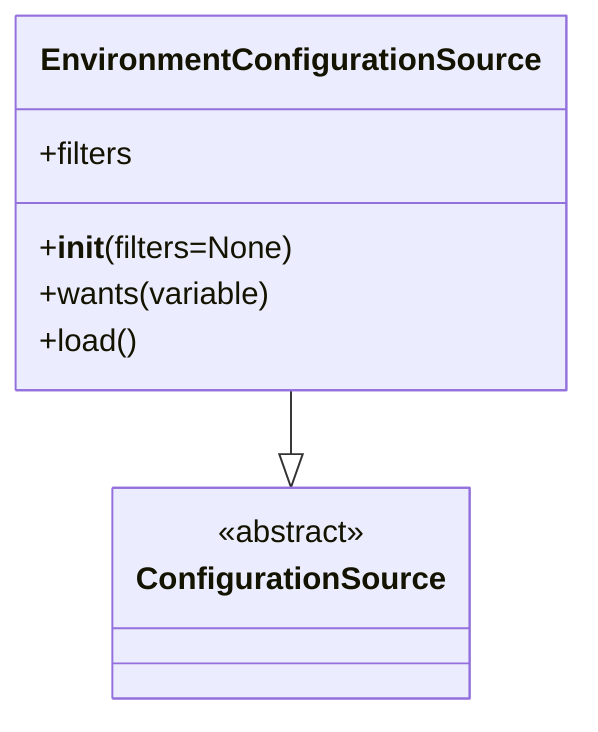

# Diagram: common/fv/python/fv/config/env.py

> Auto-generated by Obscura crawlers

## Mermaid

### SVG

<svg id="container" width="291.1640625" xmlns="http://www.w3.org/2000/svg" class="classDiagram" height="366" viewBox="0 0 291.1640625 366" role="graphics-document document" aria-roledescription="class"><g><defs><marker id="container_class-aggregationStart" class="marker aggregation class" refX="18" refY="7" markerWidth="190" markerHeight="240" orient="auto"><path d="M 18,7 L9,13 L1,7 L9,1 Z"></path></marker></defs><defs><marker id="container_class-aggregationEnd" class="marker aggregation class" refX="1" refY="7" markerWidth="20" markerHeight="28" orient="auto"><path d="M 18,7 L9,13 L1,7 L9,1 Z"></path></marker></defs><defs><marker id="container_class-extensionStart" class="marker extension class" refX="18" refY="7" markerWidth="190" markerHeight="240" orient="auto"><path d="M 1,7 L18,13 V 1 Z"></path></marker></defs><defs><marker id="container_class-extensionEnd" class="marker extension class" refX="1" refY="7" markerWidth="20" markerHeight="28" orient="auto"><path d="M 1,1 V 13 L18,7 Z"></path></marker></defs><defs><marker id="container_class-compositionStart" class="marker composition class" refX="18" refY="7" markerWidth="190" markerHeight="240" orient="auto"><path d="M 18,7 L9,13 L1,7 L9,1 Z"></path></marker></defs><defs><marker id="container_class-compositionEnd" class="marker composition class" refX="1" refY="7" markerWidth="20" markerHeight="28" orient="auto"><path d="M 18,7 L9,13 L1,7 L9,1 Z"></path></marker></defs><defs><marker id="container_class-dependencyStart" class="marker dependency class" refX="6" refY="7" markerWidth="190" markerHeight="240" orient="auto"><path d="M 5,7 L9,13 L1,7 L9,1 Z"></path></marker></defs><defs><marker id="container_class-dependencyEnd" class="marker dependency class" refX="13" refY="7" markerWidth="20" markerHeight="28" orient="auto"><path d="M 18,7 L9,13 L14,7 L9,1 Z"></path></marker></defs><defs><marker id="container_class-lollipopStart" class="marker lollipop class" refX="13" refY="7" markerWidth="190" markerHeight="240" orient="auto"><circle stroke="black" fill="transparent" cx="7" cy="7" r="6"></circle></marker></defs><defs><marker id="container_class-lollipopEnd" class="marker lollipop class" refX="1" refY="7" markerWidth="190" markerHeight="240" orient="auto"><circle stroke="black" fill="transparent" cx="7" cy="7" r="6"></circle></marker></defs><g class="root"><g class="clusters"></g><g class="edgePaths"><path d="M145.582,200L145.582,204.167C145.582,208.333,145.582,216.667,145.582,222.125C145.582,227.583,145.582,230.167,145.582,231.458L145.582,232.75" id="id_EnvironmentConfigurationSource_ConfigurationSource_1" class="edge-thickness-normal edge-pattern-solid relation" style=";;;" data-edge="true" data-et="edge" data-id="id_EnvironmentConfigurationSource_ConfigurationSource_1" data-points="W3sieCI6MTQ1LjU4MjAzMTI1LCJ5IjoyMDB9LHsieCI6MTQ1LjU4MjAzMTI1LCJ5IjoyMjV9LHsieCI6MTQ1LjU4MjAzMTI1LCJ5IjoyNTB9XQ==" marker-end="url(#container_class-extensionEnd)"></path></g><g class="edgeLabels"><g class="edgeLabel"><g class="label" data-id="id_EnvironmentConfigurationSource_ConfigurationSource_1" transform="translate(0, 0)"><foreignObject width="0" height="0">

</foreignObject></g></g></g><g class="nodes"><g class="node default" id="classId-ConfigurationSource-0" transform="translate(145.58203125, 304)"><g class="basic label-container"><path d="M-86.25 -54 L86.25 -54 L86.25 54 L-86.25 54" stroke="none" stroke-width="0" fill="#ECECFF" style=""></path><path d="M-86.25 -54 C-41.44176995039772 -54, 3.3664600992045592 -54, 86.25 -54 M-86.25 -54 C-35.313597503406996 -54, 15.622804993186008 -54, 86.25 -54 M86.25 -54 C86.25 -13.756404332086909, 86.25 26.487191335826182, 86.25 54 M86.25 -54 C86.25 -28.95453305760788, 86.25 -3.909066115215758, 86.25 54 M86.25 54 C35.03535621303503 54, -16.17928757392994 54, -86.25 54 M86.25 54 C31.963401042847572 54, -22.323197914304856 54, -86.25 54 M-86.25 54 C-86.25 19.889875552002728, -86.25 -14.220248895994544, -86.25 -54 M-86.25 54 C-86.25 12.852395557287743, -86.25 -28.295208885424515, -86.25 -54" stroke="#9370DB" stroke-width="1.3" fill="none" stroke-dasharray="0 0" style=""></path></g><g class="annotation-group text" transform="translate(-38.609375, -30)"><g class="label" style="" transform="translate(0,-12)"><foreignObject width="77.21875" height="24">

«abstract»

</foreignObject></g></g><g class="label-group text" transform="translate(-74.25, -6)"><g class="label" style="font-weight: bolder" transform="translate(0,-12)"><foreignObject width="148.5" height="24">

ConfigurationSource

</foreignObject></g></g><g class="members-group text" transform="translate(-74.25, 42)"></g><g class="methods-group text" transform="translate(-74.25, 72)"></g><g class="divider" style=""><path d="M-86.25 18 C-24.56304886980223 18, 37.12390226039554 18, 86.25 18 M-86.25 18 C-37.566989257577646 18, 11.116021484844708 18, 86.25 18" stroke="#9370DB" stroke-width="1.3" fill="none" stroke-dasharray="0 0" style=""></path></g><g class="divider" style=""><path d="M-86.25 36 C-23.51055906343685 36, 39.2288818731263 36, 86.25 36 M-86.25 36 C-32.33633514213513 36, 21.577329715729746 36, 86.25 36" stroke="#9370DB" stroke-width="1.3" fill="none" stroke-dasharray="0 0" style=""></path></g></g><g class="node default" id="classId-EnvironmentConfigurationSource-1" transform="translate(145.58203125, 104)"><g class="basic label-container"><path d="M-137.58203125 -96 L137.58203125 -96 L137.58203125 96 L-137.58203125 96" stroke="none" stroke-width="0" fill="#ECECFF" style=""></path><path d="M-137.58203125 -96 C-51.14968273956198 -96, 35.28266577087604 -96, 137.58203125 -96 M-137.58203125 -96 C-69.57414250651848 -96, -1.5662537630369684 -96, 137.58203125 -96 M137.58203125 -96 C137.58203125 -29.07829851084648, 137.58203125 37.84340297830704, 137.58203125 96 M137.58203125 -96 C137.58203125 -56.62805658435221, 137.58203125 -17.256113168704417, 137.58203125 96 M137.58203125 96 C30.210718332735055 96, -77.16059458452989 96, -137.58203125 96 M137.58203125 96 C78.8982336296742 96, 20.214436009348404 96, -137.58203125 96 M-137.58203125 96 C-137.58203125 34.75662066826626, -137.58203125 -26.486758663467484, -137.58203125 -96 M-137.58203125 96 C-137.58203125 30.477901604818854, -137.58203125 -35.04419679036229, -137.58203125 -96" stroke="#9370DB" stroke-width="1.3" fill="none" stroke-dasharray="0 0" style=""></path></g><g class="annotation-group text" transform="translate(0, -72)"></g><g class="label-group text" transform="translate(-120.4453125, -72)"><g class="label" style="font-weight: bolder" transform="translate(0,-12)"><foreignObject width="240.890625" height="24">

EnvironmentConfigurationSource

</foreignObject></g></g><g class="members-group text" transform="translate(-125.58203125, -24)"><g class="label" style="" transform="translate(0,-12)"><foreignObject width="49.296875" height="24">

+filters

</foreignObject></g></g><g class="methods-group text" transform="translate(-125.58203125, 24)"><g class="label" style="" transform="translate(0,-12)"><foreignObject width="130.71875" height="24">

+<strong>init</strong>(filters=None)

</foreignObject></g><g class="label" style="" transform="translate(0,12)"><foreignObject width="119.515625" height="24">

+wants(variable)

</foreignObject></g><g class="label" style="" transform="translate(0,36)"><foreignObject width="50.421875" height="24">

+load()

</foreignObject></g></g><g class="divider" style=""><path d="M-137.58203125 -48 C-67.44721299552744 -48, 2.6876052589451263 -48, 137.58203125 -48 M-137.58203125 -48 C-74.77963167648602 -48, -11.977232102972053 -48, 137.58203125 -48" stroke="#9370DB" stroke-width="1.3" fill="none" stroke-dasharray="0 0" style=""></path></g><g class="divider" style=""><path d="M-137.58203125 0 C-58.96686479964866 0, 19.648301650702678 0, 137.58203125 0 M-137.58203125 0 C-58.905635561919226 0, 19.770760126161548 0, 137.58203125 0" stroke="#9370DB" stroke-width="1.3" fill="none" stroke-dasharray="0 0" style=""></path></g></g></g></g></g></svg>
