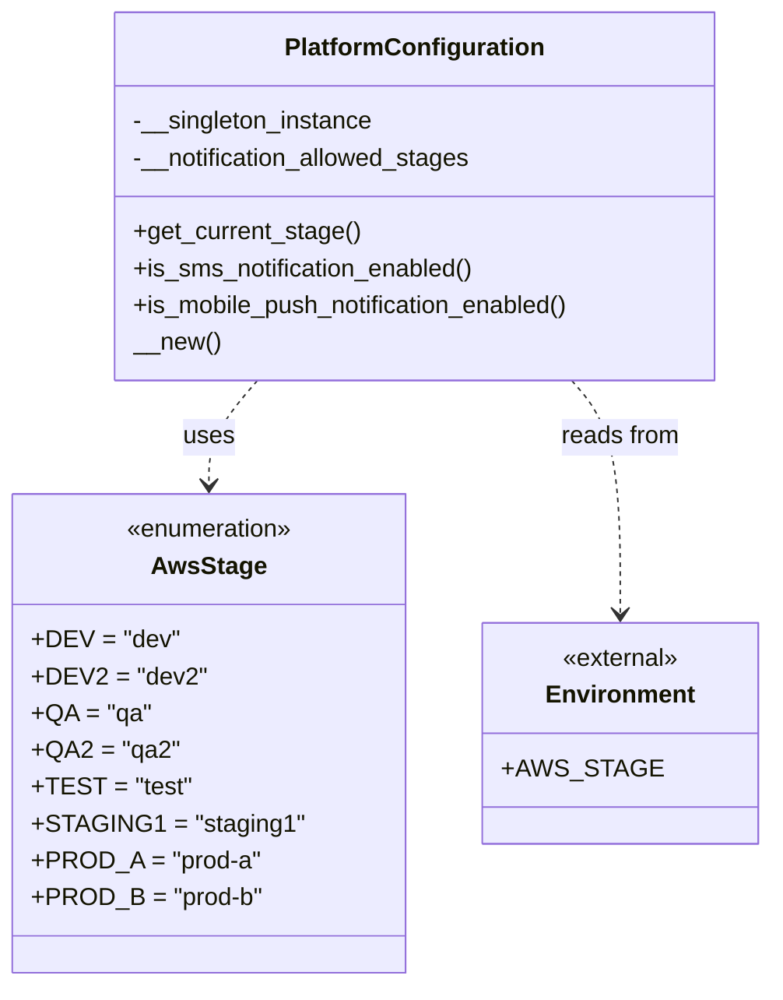

# Diagram: common/fv/python/fv/config/platform_configuration.py

> Auto-generated by Obscura crawlers

## Mermaid

### SVG

<svg id="container" width="468.28125" xmlns="http://www.w3.org/2000/svg" class="classDiagram" height="642" viewBox="0 0 468.28125 642" role="graphics-document document" aria-roledescription="class"><g><defs><marker id="container_class-aggregationStart" class="marker aggregation class" refX="18" refY="7" markerWidth="190" markerHeight="240" orient="auto"><path d="M 18,7 L9,13 L1,7 L9,1 Z"></path></marker></defs><defs><marker id="container_class-aggregationEnd" class="marker aggregation class" refX="1" refY="7" markerWidth="20" markerHeight="28" orient="auto"><path d="M 18,7 L9,13 L1,7 L9,1 Z"></path></marker></defs><defs><marker id="container_class-extensionStart" class="marker extension class" refX="18" refY="7" markerWidth="190" markerHeight="240" orient="auto"><path d="M 1,7 L18,13 V 1 Z"></path></marker></defs><defs><marker id="container_class-extensionEnd" class="marker extension class" refX="1" refY="7" markerWidth="20" markerHeight="28" orient="auto"><path d="M 1,1 V 13 L18,7 Z"></path></marker></defs><defs><marker id="container_class-compositionStart" class="marker composition class" refX="18" refY="7" markerWidth="190" markerHeight="240" orient="auto"><path d="M 18,7 L9,13 L1,7 L9,1 Z"></path></marker></defs><defs><marker id="container_class-compositionEnd" class="marker composition class" refX="1" refY="7" markerWidth="20" markerHeight="28" orient="auto"><path d="M 18,7 L9,13 L1,7 L9,1 Z"></path></marker></defs><defs><marker id="container_class-dependencyStart" class="marker dependency class" refX="6" refY="7" markerWidth="190" markerHeight="240" orient="auto"><path d="M 5,7 L9,13 L1,7 L9,1 Z"></path></marker></defs><defs><marker id="container_class-dependencyEnd" class="marker dependency class" refX="13" refY="7" markerWidth="20" markerHeight="28" orient="auto"><path d="M 18,7 L9,13 L14,7 L9,1 Z"></path></marker></defs><defs><marker id="container_class-lollipopStart" class="marker lollipop class" refX="13" refY="7" markerWidth="190" markerHeight="240" orient="auto"><circle stroke="black" fill="transparent" cx="7" cy="7" r="6"></circle></marker></defs><defs><marker id="container_class-lollipopEnd" class="marker lollipop class" refX="1" refY="7" markerWidth="190" markerHeight="240" orient="auto"><circle stroke="black" fill="transparent" cx="7" cy="7" r="6"></circle></marker></defs><g class="root"><g class="clusters"></g><g class="edgePaths"><path d="M158.738,248L153.805,254.167C148.873,260.333,139.009,272.667,134.077,284C129.145,295.333,129.145,305.667,129.145,310.833L129.145,316" id="id_PlatformConfiguration_AwsStage_1" class="edge-thickness-normal edge-pattern-dashed relation" style=";;;" data-edge="true" data-et="edge" data-id="id_PlatformConfiguration_AwsStage_1" data-points="W3sieCI6MTU4LjczNzUzNDgzMjgwMjU3LCJ5IjoyNDh9LHsieCI6MTI5LjE0NDUzMTI1LCJ5IjoyODV9LHsieCI6MTI5LjE0NDUzMTI1LCJ5IjozMjJ9XQ==" marker-end="url(#container_class-dependencyEnd)"></path><path d="M350.692,248L355.624,254.167C360.556,260.333,370.421,272.667,375.353,298C380.285,323.333,380.285,361.667,380.285,380.833L380.285,400" id="id_PlatformConfiguration_Environment_2" class="edge-thickness-normal edge-pattern-dashed relation" style=";;;" data-edge="true" data-et="edge" data-id="id_PlatformConfiguration_Environment_2" data-points="W3sieCI6MzUwLjY5MjE1MjY2NzE5NzQzLCJ5IjoyNDh9LHsieCI6MzgwLjI4NTE1NjI1LCJ5IjoyODV9LHsieCI6MzgwLjI4NTE1NjI1LCJ5Ijo0MDZ9XQ==" marker-end="url(#container_class-dependencyEnd)"></path></g><g class="edgeLabels"><g class="edgeLabel" transform="translate(129.14453125, 285)"><g class="label" data-id="id_PlatformConfiguration_AwsStage_1" transform="translate(-16.4921875, -12)"><foreignObject width="32.984375" height="24">

uses

</foreignObject></g></g><g class="edgeLabel" transform="translate(380.28515625, 285)"><g class="label" data-id="id_PlatformConfiguration_Environment_2" transform="translate(-39.1796875, -12)"><foreignObject width="78.359375" height="24">

reads from

</foreignObject></g></g></g><g class="nodes"><g class="node default" id="classId-AwsStage-0" transform="translate(129.14453125, 478)"><g class="basic label-container"><path d="M-121.14453125 -156 L121.14453125 -156 L121.14453125 156 L-121.14453125 156" stroke="none" stroke-width="0" fill="#ECECFF" style=""></path><path d="M-121.14453125 -156 C-25.963070381158218 -156, 69.21839048768356 -156, 121.14453125 -156 M-121.14453125 -156 C-59.3100951653921 -156, 2.5243409192158026 -156, 121.14453125 -156 M121.14453125 -156 C121.14453125 -88.22538594176335, 121.14453125 -20.4507718835267, 121.14453125 156 M121.14453125 -156 C121.14453125 -79.86259603614901, 121.14453125 -3.7251920722980287, 121.14453125 156 M121.14453125 156 C58.13214463431064 156, -4.880241981378717 156, -121.14453125 156 M121.14453125 156 C63.35278943347083 156, 5.561047616941664 156, -121.14453125 156 M-121.14453125 156 C-121.14453125 76.08809594448259, -121.14453125 -3.823808111034822, -121.14453125 -156 M-121.14453125 156 C-121.14453125 32.10301016251212, -121.14453125 -91.79397967497576, -121.14453125 -156" stroke="#9370DB" stroke-width="1.3" fill="none" stroke-dasharray="0 0" style=""></path></g><g class="annotation-group text" transform="translate(-55.5546875, -132)"><g class="label" style="" transform="translate(0,-12)"><foreignObject width="111.109375" height="24">

«enumeration»

</foreignObject></g></g><g class="label-group text" transform="translate(-35.1015625, -108)"><g class="label" style="font-weight: bolder" transform="translate(0,-12)"><foreignObject width="70.203125" height="24">

AwsStage

</foreignObject></g></g><g class="members-group text" transform="translate(-109.14453125, -60)"><g class="label" style="" transform="translate(0,-12)"><foreignObject width="90.9375" height="24">

+DEV = "dev"

</foreignObject></g><g class="label" style="" transform="translate(0,12)"><foreignObject width="106.609375" height="24">

+DEV2 = "dev2"

</foreignObject></g><g class="label" style="" transform="translate(0,36)"><foreignObject width="75.25" height="24">

+QA = "qa"

</foreignObject></g><g class="label" style="" transform="translate(0,60)"><foreignObject width="91.421875" height="24">

+QA2 = "qa2"

</foreignObject></g><g class="label" style="" transform="translate(0,84)"><foreignObject width="97.171875" height="24">

+TEST = "test"

</foreignObject></g><g class="label" style="" transform="translate(0,108)"><foreignObject width="162.734375" height="24">

+STAGING1 = "staging1"

</foreignObject></g><g class="label" style="" transform="translate(0,132)"><foreignObject width="143.15625" height="24">

+PROD_A = "prod-a"

</foreignObject></g><g class="label" style="" transform="translate(0,156)"><foreignObject width="144.765625" height="24">

+PROD_B = "prod-b"

</foreignObject></g></g><g class="methods-group text" transform="translate(-109.14453125, 156)"></g><g class="divider" style=""><path d="M-121.14453125 -84 C-42.23658652899172 -84, 36.671358192016555 -84, 121.14453125 -84 M-121.14453125 -84 C-60.81512820703625 -84, -0.4857251640725053 -84, 121.14453125 -84" stroke="#9370DB" stroke-width="1.3" fill="none" stroke-dasharray="0 0" style=""></path></g><g class="divider" style=""><path d="M-121.14453125 132 C-59.08397404641493 132, 2.9765831571701398 132, 121.14453125 132 M-121.14453125 132 C-32.00379955266743 132, 57.13693214466514 132, 121.14453125 132" stroke="#9370DB" stroke-width="1.3" fill="none" stroke-dasharray="0 0" style=""></path></g></g><g class="node default" id="classId-PlatformConfiguration-1" transform="translate(254.71484375, 128)"><g class="basic label-container"><path d="M-198.32421875 -120 L198.32421875 -120 L198.32421875 120 L-198.32421875 120" stroke="none" stroke-width="0" fill="#ECECFF" style=""></path><path d="M-198.32421875 -120 C-43.17119486091164 -120, 111.98182902817672 -120, 198.32421875 -120 M-198.32421875 -120 C-116.68322927286128 -120, -35.042239795722566 -120, 198.32421875 -120 M198.32421875 -120 C198.32421875 -44.528998165905946, 198.32421875 30.942003668188107, 198.32421875 120 M198.32421875 -120 C198.32421875 -44.24664540346237, 198.32421875 31.506709193075267, 198.32421875 120 M198.32421875 120 C58.30015415588775 120, -81.7239104382245 120, -198.32421875 120 M198.32421875 120 C62.887240713003706 120, -72.54973732399259 120, -198.32421875 120 M-198.32421875 120 C-198.32421875 31.262483127384627, -198.32421875 -57.475033745230746, -198.32421875 -120 M-198.32421875 120 C-198.32421875 71.14706173702803, -198.32421875 22.294123474056036, -198.32421875 -120" stroke="#9370DB" stroke-width="1.3" fill="none" stroke-dasharray="0 0" style=""></path></g><g class="annotation-group text" transform="translate(0, -96)"></g><g class="label-group text" transform="translate(-81.3046875, -96)"><g class="label" style="font-weight: bolder" transform="translate(0,-12)"><foreignObject width="162.609375" height="24">

PlatformConfiguration

</foreignObject></g></g><g class="members-group text" transform="translate(-186.32421875, -48)"><g class="label" style="" transform="translate(0,-12)"><foreignObject width="158.390625" height="24">

-__singleton_instance

</foreignObject></g><g class="label" style="" transform="translate(0,12)"><foreignObject width="224.265625" height="24">

-__notification_allowed_stages

</foreignObject></g></g><g class="methods-group text" transform="translate(-186.32421875, 24)"><g class="label" style="" transform="translate(0,-12)"><foreignObject width="148.25" height="24">

+get_current_stage()

</foreignObject></g><g class="label" style="" transform="translate(0,12)"><foreignObject width="225.609375" height="24">

+is_sms_notification_enabled()

</foreignObject></g><g class="label" style="" transform="translate(0,36)"><foreignObject width="291.34375" height="24">

+is_mobile_push_notification_enabled()

</foreignObject></g><g class="label" style="" transform="translate(0,60)"><foreignObject width="56.421875" height="24">

__new()

</foreignObject></g></g><g class="divider" style=""><path d="M-198.32421875 -72 C-113.66663481511524 -72, -29.00905088023049 -72, 198.32421875 -72 M-198.32421875 -72 C-67.86226541849359 -72, 62.599687913012815 -72, 198.32421875 -72" stroke="#9370DB" stroke-width="1.3" fill="none" stroke-dasharray="0 0" style=""></path></g><g class="divider" style=""><path d="M-198.32421875 0 C-66.17597134906711 0, 65.97227605186578 0, 198.32421875 0 M-198.32421875 0 C-53.088770897160686 0, 92.14667695567863 0, 198.32421875 0" stroke="#9370DB" stroke-width="1.3" fill="none" stroke-dasharray="0 0" style=""></path></g></g><g class="node default" id="classId-Environment-2" transform="translate(380.28515625, 478)"><g class="basic label-container"><path d="M-79.99609375 -72 L79.99609375 -72 L79.99609375 72 L-79.99609375 72" stroke="none" stroke-width="0" fill="#ECECFF" style=""></path><path d="M-79.99609375 -72 C-42.770376927320626 -72, -5.5446601046412525 -72, 79.99609375 -72 M-79.99609375 -72 C-25.094443760057644 -72, 29.807206229884713 -72, 79.99609375 -72 M79.99609375 -72 C79.99609375 -27.29584875709461, 79.99609375 17.40830248581078, 79.99609375 72 M79.99609375 -72 C79.99609375 -18.325270467866297, 79.99609375 35.34945906426741, 79.99609375 72 M79.99609375 72 C45.33675144735359 72, 10.677409144707184 72, -79.99609375 72 M79.99609375 72 C18.805582119329436 72, -42.38492951134113 72, -79.99609375 72 M-79.99609375 72 C-79.99609375 32.81357418422906, -79.99609375 -6.372851631541877, -79.99609375 -72 M-79.99609375 72 C-79.99609375 16.167274582825286, -79.99609375 -39.66545083434943, -79.99609375 -72" stroke="#9370DB" stroke-width="1.3" fill="none" stroke-dasharray="0 0" style=""></path></g><g class="annotation-group text" transform="translate(-38.65625, -48)"><g class="label" style="" transform="translate(0,-12)"><foreignObject width="77.3125" height="24">

«external»

</foreignObject></g></g><g class="label-group text" transform="translate(-46.1953125, -24)"><g class="label" style="font-weight: bolder" transform="translate(0,-12)"><foreignObject width="92.390625" height="24">

Environment

</foreignObject></g></g><g class="members-group text" transform="translate(-67.99609375, 24)"><g class="label" style="" transform="translate(0,-12)"><foreignObject width="89.796875" height="24">

+AWS_STAGE

</foreignObject></g></g><g class="methods-group text" transform="translate(-67.99609375, 72)"></g><g class="divider" style=""><path d="M-79.99609375 0 C-45.079255102858255 0, -10.16241645571651 0, 79.99609375 0 M-79.99609375 0 C-17.855362163683104 0, 44.28536942263379 0, 79.99609375 0" stroke="#9370DB" stroke-width="1.3" fill="none" stroke-dasharray="0 0" style=""></path></g><g class="divider" style=""><path d="M-79.99609375 48 C-41.787391061876185 48, -3.578688373752371 48, 79.99609375 48 M-79.99609375 48 C-32.50029269457865 48, 14.995508360842706 48, 79.99609375 48" stroke="#9370DB" stroke-width="1.3" fill="none" stroke-dasharray="0 0" style=""></path></g></g></g></g></g></svg>
