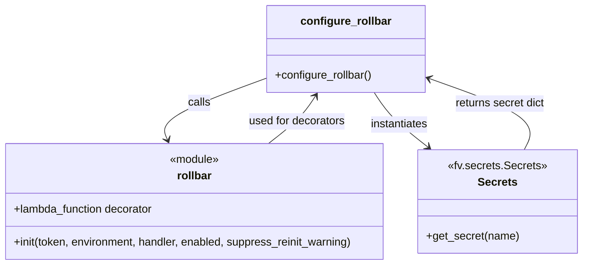

# Diagram: common/fv/python/fv/config/rollbar_setup.py


> Auto-generated by Obscura crawlers

## Diagram 1



### SVG

<svg id="container" width="855.90625" xmlns="http://www.w3.org/2000/svg" class="classDiagram" height="384" viewBox="0 0 855.90625 384" role="graphics-document document" aria-roledescription="class"><style>#container{font-family:"trebuchet ms",verdana,arial,sans-serif;font-size:16px;fill:#333;}@keyframes edge-animation-frame{from{stroke-dashoffset:0;}}@keyframes dash{to{stroke-dashoffset:0;}}#container .edge-animation-slow{stroke-dasharray:9,5!important;stroke-dashoffset:900;animation:dash 50s linear infinite;stroke-linecap:round;}#container .edge-animation-fast{stroke-dasharray:9,5!important;stroke-dashoffset:900;animation:dash 20s linear infinite;stroke-linecap:round;}#container .error-icon{fill:#552222;}#container .error-text{fill:#552222;stroke:#552222;}#container .edge-thickness-normal{stroke-width:1px;}#container .edge-thickness-thick{stroke-width:3.5px;}#container .edge-pattern-solid{stroke-dasharray:0;}#container .edge-thickness-invisible{stroke-width:0;fill:none;}#container .edge-pattern-dashed{stroke-dasharray:3;}#container .edge-pattern-dotted{stroke-dasharray:2;}#container .marker{fill:#333333;stroke:#333333;}#container .marker.cross{stroke:#333333;}#container svg{font-family:"trebuchet ms",verdana,arial,sans-serif;font-size:16px;}#container p{margin:0;}#container g.classGroup text{fill:#9370DB;stroke:none;font-family:"trebuchet ms",verdana,arial,sans-serif;font-size:10px;}#container g.classGroup text .title{font-weight:bolder;}#container .nodeLabel,#container .edgeLabel{color:#131300;}#container .edgeLabel .label rect{fill:#ECECFF;}#container .label text{fill:#131300;}#container .labelBkg{background:#ECECFF;}#container .edgeLabel .label span{background:#ECECFF;}#container .classTitle{font-weight:bolder;}#container .node rect,#container .node circle,#container .node ellipse,#container .node polygon,#container .node path{fill:#ECECFF;stroke:#9370DB;stroke-width:1px;}#container .divider{stroke:#9370DB;stroke-width:1;}#container g.clickable{cursor:pointer;}#container g.classGroup rect{fill:#ECECFF;stroke:#9370DB;}#container g.classGroup line{stroke:#9370DB;stroke-width:1;}#container .classLabel .box{stroke:none;stroke-width:0;fill:#ECECFF;opacity:0.5;}#container .classLabel .label{fill:#9370DB;font-size:10px;}#container .relation{stroke:#333333;stroke-width:1;fill:none;}#container .dashed-line{stroke-dasharray:3;}#container .dotted-line{stroke-dasharray:1 2;}#container #compositionStart,#container .composition{fill:#333333!important;stroke:#333333!important;stroke-width:1;}#container #compositionEnd,#container .composition{fill:#333333!important;stroke:#333333!important;stroke-width:1;}#container #dependencyStart,#container .dependency{fill:#333333!important;stroke:#333333!important;stroke-width:1;}#container #dependencyStart,#container .dependency{fill:#333333!important;stroke:#333333!important;stroke-width:1;}#container #extensionStart,#container .extension{fill:transparent!important;stroke:#333333!important;stroke-width:1;}#container #extensionEnd,#container .extension{fill:transparent!important;stroke:#333333!important;stroke-width:1;}#container #aggregationStart,#container .aggregation{fill:transparent!important;stroke:#333333!important;stroke-width:1;}#container #aggregationEnd,#container .aggregation{fill:transparent!important;stroke:#333333!important;stroke-width:1;}#container #lollipopStart,#container .lollipop{fill:#ECECFF!important;stroke:#333333!important;stroke-width:1;}#container #lollipopEnd,#container .lollipop{fill:#ECECFF!important;stroke:#333333!important;stroke-width:1;}#container .edgeTerminals{font-size:11px;line-height:initial;}#container .classTitleText{text-anchor:middle;font-size:18px;fill:#333;}#container .label-icon{display:inline-block;height:1em;overflow:visible;vertical-align:-0.125em;}#container .node .label-icon path{fill:currentColor;stroke:revert;stroke-width:revert;}#container :root{--mermaid-font-family:"trebuchet ms",verdana,arial,sans-serif;}</style><g><defs><marker id="container_class-aggregationStart" class="marker aggregation class" refX="18" refY="7" markerWidth="190" markerHeight="240" orient="auto"><path d="M 18,7 L9,13 L1,7 L9,1 Z"></path></marker></defs><defs><marker id="container_class-aggregationEnd" class="marker aggregation class" refX="1" refY="7" markerWidth="20" markerHeight="28" orient="auto"><path d="M 18,7 L9,13 L1,7 L9,1 Z"></path></marker></defs><defs><marker id="container_class-extensionStart" class="marker extension class" refX="18" refY="7" markerWidth="190" markerHeight="240" orient="auto"><path d="M 1,7 L18,13 V 1 Z"></path></marker></defs><defs><marker id="container_class-extensionEnd" class="marker extension class" refX="1" refY="7" markerWidth="20" markerHeight="28" orient="auto"><path d="M 1,1 V 13 L18,7 Z"></path></marker></defs><defs><marker id="container_class-compositionStart" class="marker composition class" refX="18" refY="7" markerWidth="190" markerHeight="240" orient="auto"><path d="M 18,7 L9,13 L1,7 L9,1 Z"></path></marker></defs><defs><marker id="container_class-compositionEnd" class="marker composition class" refX="1" refY="7" markerWidth="20" markerHeight="28" orient="auto"><path d="M 18,7 L9,13 L1,7 L9,1 Z"></path></marker></defs><defs><marker id="container_class-dependencyStart" class="marker dependency class" refX="6" refY="7" markerWidth="190" markerHeight="240" orient="auto"><path d="M 5,7 L9,13 L1,7 L9,1 Z"></path></marker></defs><defs><marker id="container_class-dependencyEnd" class="marker dependency class" refX="13" refY="7" markerWidth="20" markerHeight="28" orient="auto"><path d="M 18,7 L9,13 L14,7 L9,1 Z"></path></marker></defs><defs><marker id="container_class-lollipopStart" class="marker lollipop class" refX="13" refY="7" markerWidth="190" markerHeight="240" orient="auto"><circle stroke="black" fill="transparent" cx="7" cy="7" r="6"></circle></marker></defs><defs><marker id="container_class-lollipopEnd" class="marker lollipop class" refX="1" refY="7" markerWidth="190" markerHeight="240" orient="auto"><circle stroke="black" fill="transparent" cx="7" cy="7" r="6"></circle></marker></defs><g class="root"><g class="clusters"></g><g class="edgePaths"><path d="M396.391,112.437L369.436,122.198C342.482,131.958,288.573,151.479,263.949,166.492C239.325,181.505,243.986,192.01,246.316,197.263L248.646,202.516" id="id_configure_rollbar_rollbar_1" class="edge-thickness-normal edge-pattern-solid relation" style=";;;" data-edge="true" data-et="edge" data-id="id_configure_rollbar_rollbar_1" data-points="W3sieCI6Mzk2LjM5MDYyNSwieSI6MTEyLjQzNzQwMTg2OTk1MjA1fSx7IngiOjIzNC42NjQwNjI1LCJ5IjoxNzF9LHsieCI6MjUxLjA3OTcwNjg2OTgzNDcsInkiOjIwOH1d" marker-end="url(#container_class-dependencyEnd)"></path><path d="M552.983,134L557.109,140.167C561.236,146.333,569.489,158.667,582.683,171.886C595.876,185.105,614.01,199.211,623.077,206.263L632.144,213.316" id="id_configure_rollbar_Secrets_2" class="edge-thickness-normal edge-pattern-solid relation" style=";;;" data-edge="true" data-et="edge" data-id="id_configure_rollbar_Secrets_2" data-points="W3sieCI6NTUyLjk4MjUzOTA2MjUsInkiOjEzNH0seyJ4Ijo1NzcuNzQyMTg3NSwieSI6MTcxfSx7IngiOjYzNi44ODAxNjUyODkyNTYyLCJ5IjoyMTd9XQ==" marker-end="url(#container_class-dependencyEnd)"></path><path d="M773.338,217L777.431,209.333C781.524,201.667,789.709,186.333,765.973,168.973C742.238,151.612,686.581,132.224,658.752,122.53L630.924,112.836" id="id_Secrets_configure_rollbar_3" class="edge-thickness-normal edge-pattern-solid relation" style=";;;" data-edge="true" data-et="edge" data-id="id_Secrets_configure_rollbar_3" data-points="W3sieCI6NzczLjMzODIyOTU5NzEwNzQsInkiOjIxN30seyJ4Ijo3OTcuODk0NTMxMjUsInkiOjE3MX0seyJ4Ijo2MjUuMjU3ODEyNSwieSI6MTEwLjg2MjU2NjMzNTU1NTg3fV0=" marker-end="url(#container_class-dependencyEnd)"></path><path d="M396.339,208L404.267,201.833C412.195,195.667,428.05,183.333,439.549,171.831C451.047,160.329,458.188,149.658,461.759,144.322L465.329,138.987" id="id_rollbar_configure_rollbar_4" class="edge-thickness-normal edge-pattern-solid relation" style=";;;" data-edge="true" data-et="edge" data-id="id_rollbar_configure_rollbar_4" data-points="W3sieCI6Mzk2LjMzODc0NjEyNjAzMzEsInkiOjIwOH0seyJ4Ijo0NDMuOTA2MjUsInkiOjE3MX0seyJ4Ijo0NjguNjY1ODk4NDM3NSwieSI6MTM0fV0=" marker-end="url(#container_class-dependencyEnd)"></path></g><g class="edgeLabels"><g class="edgeLabel" transform="translate(296.49752, 148.60957)"><g class="label" data-id="id_configure_rollbar_rollbar_1" transform="translate(-16.4453125, -12)"><foreignObject width="32.890625" height="24"><div xmlns="http://www.w3.org/1999/xhtml" class="labelBkg" style="display: table-cell; white-space: nowrap; line-height: 1.5; max-width: 200px; text-align: center;"><span class="edgeLabel"><p>calls</p></span></div></foreignObject></g></g><g class="edgeLabel" transform="translate(589.7407, 180.33295)"><g class="label" data-id="id_configure_rollbar_Secrets_2" transform="translate(-42.9140625, -12)"><foreignObject width="85.828125" height="24"><div xmlns="http://www.w3.org/1999/xhtml" class="labelBkg" style="display: table-cell; white-space: nowrap; line-height: 1.5; max-width: 200px; text-align: center;"><span class="edgeLabel"><p>instantiates</p></span></div></foreignObject></g></g><g class="edgeLabel" transform="translate(736.19718, 149.50793)"><g class="label" data-id="id_Secrets_configure_rollbar_3" transform="translate(-66.2734375, -12)"><foreignObject width="132.546875" height="24"><div xmlns="http://www.w3.org/1999/xhtml" class="labelBkg" style="display: table-cell; white-space: nowrap; line-height: 1.5; max-width: 200px; text-align: center;"><span class="edgeLabel"><p>returns secret dict</p></span></div></foreignObject></g></g><g class="edgeLabel" transform="translate(437.69298, 175.83295)"><g class="label" data-id="id_rollbar_configure_rollbar_4" transform="translate(-70.921875, -12)"><foreignObject width="141.84375" height="24"><div xmlns="http://www.w3.org/1999/xhtml" class="labelBkg" style="display: table-cell; white-space: nowrap; line-height: 1.5; max-width: 200px; text-align: center;"><span class="edgeLabel"><p>used for decorators</p></span></div></foreignObject></g></g></g><g class="nodes"><g class="node default" id="classId-configure_rollbar-0" transform="translate(510.82421875, 71)"><g class="basic label-container"><path d="M-114.43359375 -63 L114.43359375 -63 L114.43359375 63 L-114.43359375 63" stroke="none" stroke-width="0" fill="#ECECFF" style=""></path><path d="M-114.43359375 -63 C-45.86553067789566 -63, 22.702532394208674 -63, 114.43359375 -63 M-114.43359375 -63 C-56.53000168403198 -63, 1.3735903819360402 -63, 114.43359375 -63 M114.43359375 -63 C114.43359375 -18.296299628717655, 114.43359375 26.40740074256469, 114.43359375 63 M114.43359375 -63 C114.43359375 -21.937211771333523, 114.43359375 19.125576457332954, 114.43359375 63 M114.43359375 63 C56.81550137964103 63, -0.8025909907179454 63, -114.43359375 63 M114.43359375 63 C48.474643151316954 63, -17.484307447366092 63, -114.43359375 63 M-114.43359375 63 C-114.43359375 13.09495567183366, -114.43359375 -36.81008865633268, -114.43359375 -63 M-114.43359375 63 C-114.43359375 32.96455759805896, -114.43359375 2.9291151961179267, -114.43359375 -63" stroke="#9370DB" stroke-width="1.3" fill="none" stroke-dasharray="0 0" style=""></path></g><g class="annotation-group text" transform="translate(0, -39)"></g><g class="label-group text" transform="translate(-62.7265625, -39)"><g class="label" style="font-weight: bolder" transform="translate(0,-12)"><foreignObject width="125.453125" height="24"><div xmlns="http://www.w3.org/1999/xhtml" style="display: table-cell; white-space: nowrap; line-height: 1.5; max-width: 175px; text-align: center;"><span class="nodeLabel markdown-node-label" style=""><p>configure_rollbar</p></span></div></foreignObject></g></g><g class="members-group text" transform="translate(-102.43359375, 9)"></g><g class="methods-group text" transform="translate(-102.43359375, 39)"><g class="label" style="" transform="translate(0,-12)"><foreignObject width="142.140625" height="24"><div xmlns="http://www.w3.org/1999/xhtml" style="display: table-cell; white-space: nowrap; line-height: 1.5; max-width: 200px; text-align: center;"><span class="nodeLabel markdown-node-label" style=""><p>+configure_rollbar()</p></span></div></foreignObject></g></g><g class="divider" style=""><path d="M-114.43359375 -15 C-25.23729037106797 -15, 63.95901300786406 -15, 114.43359375 -15 M-114.43359375 -15 C-65.92430431709009 -15, -17.41501488418018 -15, 114.43359375 -15" stroke="#9370DB" stroke-width="1.3" fill="none" stroke-dasharray="0 0" style=""></path></g><g class="divider" style=""><path d="M-114.43359375 9 C-65.01314286999897 9, -15.592691989997931 9, 114.43359375 9 M-114.43359375 9 C-65.73243546331159 9, -17.031277176623163 9, 114.43359375 9" stroke="#9370DB" stroke-width="1.3" fill="none" stroke-dasharray="0 0" style=""></path></g></g><g class="node default" id="classId-rollbar-1" transform="translate(288.34765625, 292)"><g class="basic label-container"><path d="M-280.34765625 -84 L280.34765625 -84 L280.34765625 84 L-280.34765625 84" stroke="none" stroke-width="0" fill="#ECECFF" style=""></path><path d="M-280.34765625 -84 C-86.2707558773167 -84, 107.8061444953666 -84, 280.34765625 -84 M-280.34765625 -84 C-98.40121767784095 -84, 83.5452208943181 -84, 280.34765625 -84 M280.34765625 -84 C280.34765625 -20.600760337331103, 280.34765625 42.798479325337794, 280.34765625 84 M280.34765625 -84 C280.34765625 -42.55443739368781, 280.34765625 -1.1088747873756262, 280.34765625 84 M280.34765625 84 C166.63087882908488 84, 52.914101408169756 84, -280.34765625 84 M280.34765625 84 C111.68940996863424 84, -56.968836312731526 84, -280.34765625 84 M-280.34765625 84 C-280.34765625 40.32343011568894, -280.34765625 -3.353139768622114, -280.34765625 -84 M-280.34765625 84 C-280.34765625 27.74437345512252, -280.34765625 -28.51125308975496, -280.34765625 -84" stroke="#9370DB" stroke-width="1.3" fill="none" stroke-dasharray="0 0" style=""></path></g><g class="annotation-group text" transform="translate(-36.6015625, -60)"><g class="label" style="" transform="translate(0,-12)"><foreignObject width="73.203125" height="24"><div xmlns="http://www.w3.org/1999/xhtml" style="display: table-cell; white-space: nowrap; line-height: 1.5; max-width: 123px; text-align: center;"><span class="nodeLabel markdown-node-label" style=""><p>«module»</p></span></div></foreignObject></g></g><g class="label-group text" transform="translate(-24.6875, -36)"><g class="label" style="font-weight: bolder" transform="translate(0,-12)"><foreignObject width="49.375" height="24"><div xmlns="http://www.w3.org/1999/xhtml" style="display: table-cell; white-space: nowrap; line-height: 1.5; max-width: 99px; text-align: center;"><span class="nodeLabel markdown-node-label" style=""><p>rollbar</p></span></div></foreignObject></g></g><g class="members-group text" transform="translate(-268.34765625, 12)"><g class="label" style="" transform="translate(0,-12)"><foreignObject width="206.078125" height="24"><div xmlns="http://www.w3.org/1999/xhtml" style="display: table-cell; white-space: nowrap; line-height: 1.5; max-width: 264px; text-align: center;"><span class="nodeLabel markdown-node-label" style=""><p>+lambda_function decorator</p></span></div></foreignObject></g></g><g class="methods-group text" transform="translate(-268.34765625, 60)"><g class="label" style="" transform="translate(0,-12)"><foreignObject width="500.09375" height="24"><div xmlns="http://www.w3.org/1999/xhtml" style="display: table-cell; white-space: nowrap; line-height: 1.5; max-width: 557px; text-align: center;"><span class="nodeLabel markdown-node-label" style=""><p>+init(token, environment, handler, enabled, suppress_reinit_warning)</p></span></div></foreignObject></g></g><g class="divider" style=""><path d="M-280.34765625 -12 C-126.14488084446174 -12, 28.057894561076523 -12, 280.34765625 -12 M-280.34765625 -12 C-156.34576919878083 -12, -32.343882147561686 -12, 280.34765625 -12" stroke="#9370DB" stroke-width="1.3" fill="none" stroke-dasharray="0 0" style=""></path></g><g class="divider" style=""><path d="M-280.34765625 36 C-114.87280300957084 36, 50.60205023085831 36, 280.34765625 36 M-280.34765625 36 C-79.86229258222943 36, 120.62307108554114 36, 280.34765625 36" stroke="#9370DB" stroke-width="1.3" fill="none" stroke-dasharray="0 0" style=""></path></g></g><g class="node default" id="classId-Secrets-2" transform="translate(733.30078125, 292)"><g class="basic label-container"><path d="M-114.60546875 -75 L114.60546875 -75 L114.60546875 75 L-114.60546875 75" stroke="none" stroke-width="0" fill="#ECECFF" style=""></path><path d="M-114.60546875 -75 C-61.21303145294923 -75, -7.820594155898462 -75, 114.60546875 -75 M-114.60546875 -75 C-22.985148194980553 -75, 68.6351723600389 -75, 114.60546875 -75 M114.60546875 -75 C114.60546875 -18.35917008643691, 114.60546875 38.28165982712618, 114.60546875 75 M114.60546875 -75 C114.60546875 -15.965405316478197, 114.60546875 43.069189367043606, 114.60546875 75 M114.60546875 75 C58.53537196887572 75, 2.4652751877514447 75, -114.60546875 75 M114.60546875 75 C31.507925900708273 75, -51.589616948583455 75, -114.60546875 75 M-114.60546875 75 C-114.60546875 15.393887800734966, -114.60546875 -44.21222439853007, -114.60546875 -75 M-114.60546875 75 C-114.60546875 17.61190255152576, -114.60546875 -39.77619489694848, -114.60546875 -75" stroke="#9370DB" stroke-width="1.3" fill="none" stroke-dasharray="0 0" style=""></path></g><g class="annotation-group text" transform="translate(-71.4296875, -51)"><g class="label" style="" transform="translate(0,-12)"><foreignObject width="142.859375" height="24"><div xmlns="http://www.w3.org/1999/xhtml" style="display: table-cell; white-space: nowrap; line-height: 1.5; max-width: 193px; text-align: center;"><span class="nodeLabel markdown-node-label" style=""><p>«fv.secrets.Secrets»</p></span></div></foreignObject></g></g><g class="label-group text" transform="translate(-27.1640625, -27)"><g class="label" style="font-weight: bolder" transform="translate(0,-12)"><foreignObject width="54.328125" height="24"><div xmlns="http://www.w3.org/1999/xhtml" style="display: table-cell; white-space: nowrap; line-height: 1.5; max-width: 103px; text-align: center;"><span class="nodeLabel markdown-node-label" style=""><p>Secrets</p></span></div></foreignObject></g></g><g class="members-group text" transform="translate(-102.60546875, 21)"></g><g class="methods-group text" transform="translate(-102.60546875, 51)"><g class="label" style="" transform="translate(0,-12)"><foreignObject width="133.78125" height="24"><div xmlns="http://www.w3.org/1999/xhtml" style="display: table-cell; white-space: nowrap; line-height: 1.5; max-width: 191px; text-align: center;"><span class="nodeLabel markdown-node-label" style=""><p>+get_secret(name)</p></span></div></foreignObject></g></g><g class="divider" style=""><path d="M-114.60546875 -3 C-45.04555762509551 -3, 24.514353499808976 -3, 114.60546875 -3 M-114.60546875 -3 C-46.346863769046664 -3, 21.911741211906673 -3, 114.60546875 -3" stroke="#9370DB" stroke-width="1.3" fill="none" stroke-dasharray="0 0" style=""></path></g><g class="divider" style=""><path d="M-114.60546875 21 C-47.97977193756847 21, 18.645924874863056 21, 114.60546875 21 M-114.60546875 21 C-54.405020910355084 21, 5.795426929289832 21, 114.60546875 21" stroke="#9370DB" stroke-width="1.3" fill="none" stroke-dasharray="0 0" style=""></path></g></g></g></g></g></svg>

## Diagram 2

```mermaid
flowchart TD
    Start([Start]) --> CheckLambda{Is AWS_LAMBDA_FUNCTION_NAME set?}
    CheckLambda -- yes --> GetSecret[Get secret via fv.secrets.Secrets().get_secret("rollbar/credentials")]
    CheckLambda -- no --> SetTokenEmpty[rollbar_access_token = ""]
    GetSecret --> ExtractToken{Secret present?}
    ExtractToken -- yes --> SetTokenFromSecret[rollbar_access_token = secret.get("accessToken")]
    ExtractToken -- no --> SetTokenEmpty
    SetTokenFromSecret --> DetermineEnv
    SetTokenEmpty --> DetermineEnv
    DetermineEnv[environment = os.getenv("AWS_STAGE") or "local"] --> InitRollbar[rollbar.init(rollbar_access_token, environment, handler="blocking", enabled=enabled, suppress_reinit_warning=True)]
    InitRollbar --> End([End])
```

> SVG rendering failed for this diagram.
