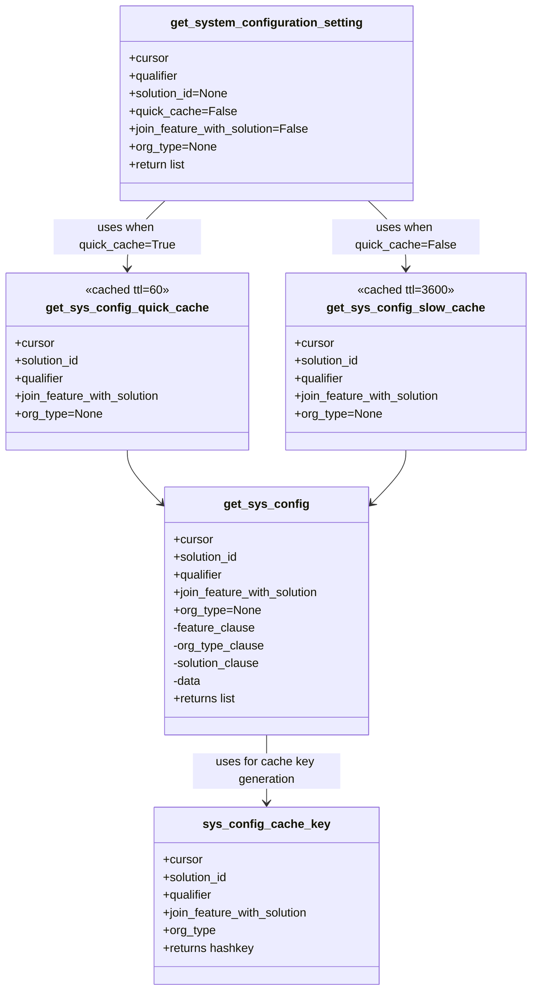
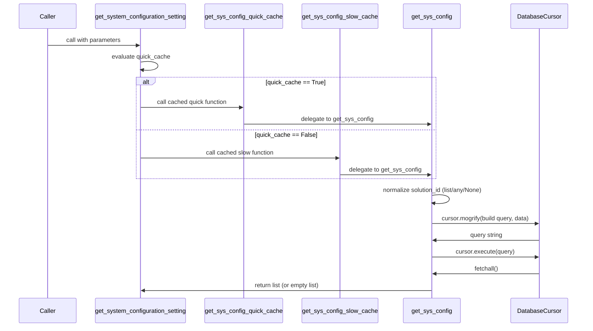

# Diagram: common/fv/python/fv/config/system_configuration.py


> Auto-generated by Obscura crawlers

## Diagram 1

```mermaid
flowchart TD
    A[Caller] --> B[get_system_configuration_setting(...)]
    B --> C{quick_cache?}
    C -- True --> D[get_sys_config_quick_cache(cursor, solution_id, qualifier, join_feature_with_solution, org_type)]
    C -- False --> E[get_sys_config_slow_cache(cursor, solution_id, qualifier, join_feature_with_solution, org_type)]
    D --> F[get_sys_config(cursor, solution_id, qualifier, join_feature_with_solution, org_type)]
    E --> F
    F --> G[Build SQL query]
    G --> H[cursor.execute(query)]
    H --> I[rows = cursor.fetchall()]
    I --> J{rows?}
    J -- Yes --> K[Return [row.config for row in rows]]
    J -- No --> L[Return []]
    subgraph Caches
        D --- M[TTLCache maxsize=128 ttl=60]
        E --- N[TTLCache maxsize=128 ttl=3600]
        M --- O[Key: sys_config_cache_key(...)]
        N --- O
    end
```

> SVG rendering failed for this diagram.

## Diagram 2



### SVG

<svg id="container" width="720.90625" xmlns="http://www.w3.org/2000/svg" class="classDiagram" height="1342" viewBox="0 0 720.90625 1342" role="graphics-document document" aria-roledescription="class"><style>#container{font-family:"trebuchet ms",verdana,arial,sans-serif;font-size:16px;fill:#333;}@keyframes edge-animation-frame{from{stroke-dashoffset:0;}}@keyframes dash{to{stroke-dashoffset:0;}}#container .edge-animation-slow{stroke-dasharray:9,5!important;stroke-dashoffset:900;animation:dash 50s linear infinite;stroke-linecap:round;}#container .edge-animation-fast{stroke-dasharray:9,5!important;stroke-dashoffset:900;animation:dash 20s linear infinite;stroke-linecap:round;}#container .error-icon{fill:#552222;}#container .error-text{fill:#552222;stroke:#552222;}#container .edge-thickness-normal{stroke-width:1px;}#container .edge-thickness-thick{stroke-width:3.5px;}#container .edge-pattern-solid{stroke-dasharray:0;}#container .edge-thickness-invisible{stroke-width:0;fill:none;}#container .edge-pattern-dashed{stroke-dasharray:3;}#container .edge-pattern-dotted{stroke-dasharray:2;}#container .marker{fill:#333333;stroke:#333333;}#container .marker.cross{stroke:#333333;}#container svg{font-family:"trebuchet ms",verdana,arial,sans-serif;font-size:16px;}#container p{margin:0;}#container g.classGroup text{fill:#9370DB;stroke:none;font-family:"trebuchet ms",verdana,arial,sans-serif;font-size:10px;}#container g.classGroup text .title{font-weight:bolder;}#container .nodeLabel,#container .edgeLabel{color:#131300;}#container .edgeLabel .label rect{fill:#ECECFF;}#container .label text{fill:#131300;}#container .labelBkg{background:#ECECFF;}#container .edgeLabel .label span{background:#ECECFF;}#container .classTitle{font-weight:bolder;}#container .node rect,#container .node circle,#container .node ellipse,#container .node polygon,#container .node path{fill:#ECECFF;stroke:#9370DB;stroke-width:1px;}#container .divider{stroke:#9370DB;stroke-width:1;}#container g.clickable{cursor:pointer;}#container g.classGroup rect{fill:#ECECFF;stroke:#9370DB;}#container g.classGroup line{stroke:#9370DB;stroke-width:1;}#container .classLabel .box{stroke:none;stroke-width:0;fill:#ECECFF;opacity:0.5;}#container .classLabel .label{fill:#9370DB;font-size:10px;}#container .relation{stroke:#333333;stroke-width:1;fill:none;}#container .dashed-line{stroke-dasharray:3;}#container .dotted-line{stroke-dasharray:1 2;}#container #compositionStart,#container .composition{fill:#333333!important;stroke:#333333!important;stroke-width:1;}#container #compositionEnd,#container .composition{fill:#333333!important;stroke:#333333!important;stroke-width:1;}#container #dependencyStart,#container .dependency{fill:#333333!important;stroke:#333333!important;stroke-width:1;}#container #dependencyStart,#container .dependency{fill:#333333!important;stroke:#333333!important;stroke-width:1;}#container #extensionStart,#container .extension{fill:transparent!important;stroke:#333333!important;stroke-width:1;}#container #extensionEnd,#container .extension{fill:transparent!important;stroke:#333333!important;stroke-width:1;}#container #aggregationStart,#container .aggregation{fill:transparent!important;stroke:#333333!important;stroke-width:1;}#container #aggregationEnd,#container .aggregation{fill:transparent!important;stroke:#333333!important;stroke-width:1;}#container #lollipopStart,#container .lollipop{fill:#ECECFF!important;stroke:#333333!important;stroke-width:1;}#container #lollipopEnd,#container .lollipop{fill:#ECECFF!important;stroke:#333333!important;stroke-width:1;}#container .edgeTerminals{font-size:11px;line-height:initial;}#container .classTitleText{text-anchor:middle;font-size:18px;fill:#333;}#container .label-icon{display:inline-block;height:1em;overflow:visible;vertical-align:-0.125em;}#container .node .label-icon path{fill:currentColor;stroke:revert;stroke-width:revert;}#container :root{--mermaid-font-family:"trebuchet ms",verdana,arial,sans-serif;}</style><g><defs><marker id="container_class-aggregationStart" class="marker aggregation class" refX="18" refY="7" markerWidth="190" markerHeight="240" orient="auto"><path d="M 18,7 L9,13 L1,7 L9,1 Z"></path></marker></defs><defs><marker id="container_class-aggregationEnd" class="marker aggregation class" refX="1" refY="7" markerWidth="20" markerHeight="28" orient="auto"><path d="M 18,7 L9,13 L1,7 L9,1 Z"></path></marker></defs><defs><marker id="container_class-extensionStart" class="marker extension class" refX="18" refY="7" markerWidth="190" markerHeight="240" orient="auto"><path d="M 1,7 L18,13 V 1 Z"></path></marker></defs><defs><marker id="container_class-extensionEnd" class="marker extension class" refX="1" refY="7" markerWidth="20" markerHeight="28" orient="auto"><path d="M 1,1 V 13 L18,7 Z"></path></marker></defs><defs><marker id="container_class-compositionStart" class="marker composition class" refX="18" refY="7" markerWidth="190" markerHeight="240" orient="auto"><path d="M 18,7 L9,13 L1,7 L9,1 Z"></path></marker></defs><defs><marker id="container_class-compositionEnd" class="marker composition class" refX="1" refY="7" markerWidth="20" markerHeight="28" orient="auto"><path d="M 18,7 L9,13 L1,7 L9,1 Z"></path></marker></defs><defs><marker id="container_class-dependencyStart" class="marker dependency class" refX="6" refY="7" markerWidth="190" markerHeight="240" orient="auto"><path d="M 5,7 L9,13 L1,7 L9,1 Z"></path></marker></defs><defs><marker id="container_class-dependencyEnd" class="marker dependency class" refX="13" refY="7" markerWidth="20" markerHeight="28" orient="auto"><path d="M 18,7 L9,13 L14,7 L9,1 Z"></path></marker></defs><defs><marker id="container_class-lollipopStart" class="marker lollipop class" refX="13" refY="7" markerWidth="190" markerHeight="240" orient="auto"><circle stroke="black" fill="transparent" cx="7" cy="7" r="6"></circle></marker></defs><defs><marker id="container_class-lollipopEnd" class="marker lollipop class" refX="1" refY="7" markerWidth="190" markerHeight="240" orient="auto"><circle stroke="black" fill="transparent" cx="7" cy="7" r="6"></circle></marker></defs><g class="root"><g class="clusters"></g><g class="edgePaths"><path d="M223.572,272L215.057,280.167C206.542,288.333,189.511,304.667,180.996,320C172.48,335.333,172.48,349.667,172.48,356.833L172.48,364" id="id_get_system_configuration_setting_get_sys_config_quick_cache_1" class="edge-thickness-normal edge-pattern-solid relation" style=";;;" data-edge="true" data-et="edge" data-id="id_get_system_configuration_setting_get_sys_config_quick_cache_1" data-points="W3sieCI6MjIzLjU3MjE5MDA4OTc3OSwieSI6MjcyfSx7IngiOjE3Mi40ODA0Njg3NSwieSI6MzIxfSx7IngiOjE3Mi40ODA0Njg3NSwieSI6MzcwfV0=" marker-end="url(#container_class-dependencyEnd)"></path><path d="M498.842,272L507.357,280.167C515.872,288.333,532.903,304.667,541.418,320C549.934,335.333,549.934,349.667,549.934,356.833L549.934,364" id="id_get_system_configuration_setting_get_sys_config_slow_cache_2" class="edge-thickness-normal edge-pattern-solid relation" style=";;;" data-edge="true" data-et="edge" data-id="id_get_system_configuration_setting_get_sys_config_slow_cache_2" data-points="W3sieCI6NDk4Ljg0MTg3MjQxMDIyMDk2LCJ5IjoyNzJ9LHsieCI6NTQ5LjkzMzU5Mzc1LCJ5IjozMjF9LHsieCI6NTQ5LjkzMzU5Mzc1LCJ5IjozNzB9XQ==" marker-end="url(#container_class-dependencyEnd)"></path><path d="M172.48,610L172.48,614.167C172.48,618.333,172.48,626.667,179.901,638.422C187.322,650.177,202.163,665.355,209.584,672.943L217.004,680.532" id="id_get_sys_config_quick_cache_get_sys_config_3" class="edge-thickness-normal edge-pattern-solid relation" style=";;;" data-edge="true" data-et="edge" data-id="id_get_sys_config_quick_cache_get_sys_config_3" data-points="W3sieCI6MTcyLjQ4MDQ2ODc1LCJ5Ijo2MTB9LHsieCI6MTcyLjQ4MDQ2ODc1LCJ5Ijo2MzV9LHsieCI6MjIxLjE5OTIxODc1LCJ5Ijo2ODQuODIxOTE0OTcyODg1N31d" marker-end="url(#container_class-dependencyEnd)"></path><path d="M549.934,610L549.934,614.167C549.934,618.333,549.934,626.667,542.513,638.422C535.092,650.177,520.251,665.355,512.83,672.943L505.41,680.532" id="id_get_sys_config_slow_cache_get_sys_config_4" class="edge-thickness-normal edge-pattern-solid relation" style=";;;" data-edge="true" data-et="edge" data-id="id_get_sys_config_slow_cache_get_sys_config_4" data-points="W3sieCI6NTQ5LjkzMzU5Mzc1LCJ5Ijo2MTB9LHsieCI6NTQ5LjkzMzU5Mzc1LCJ5Ijo2MzV9LHsieCI6NTAxLjIxNDg0Mzc1LCJ5Ijo2ODQuODIxOTE0OTcyODg1N31d" marker-end="url(#container_class-dependencyEnd)"></path><path d="M361.207,996L361.207,1004.167C361.207,1012.333,361.207,1028.667,361.207,1044C361.207,1059.333,361.207,1073.667,361.207,1080.833L361.207,1088" id="id_get_sys_config_sys_config_cache_key_5" class="edge-thickness-normal edge-pattern-solid relation" style=";;;" data-edge="true" data-et="edge" data-id="id_get_sys_config_sys_config_cache_key_5" data-points="W3sieCI6MzYxLjIwNzAzMTI1LCJ5Ijo5OTZ9LHsieCI6MzYxLjIwNzAzMTI1LCJ5IjoxMDQ1fSx7IngiOjM2MS4yMDcwMzEyNSwieSI6MTA5NH1d" marker-end="url(#container_class-dependencyEnd)"></path></g><g class="edgeLabels"><g class="edgeLabel" transform="translate(172.48046875, 321)"><g class="label" data-id="id_get_system_configuration_setting_get_sys_config_quick_cache_1" transform="translate(-100, -24)"><foreignObject width="200" height="48"><div xmlns="http://www.w3.org/1999/xhtml" class="labelBkg" style="display: table; white-space: break-spaces; line-height: 1.5; max-width: 200px; text-align: center; width: 200px;"><span class="edgeLabel"><p>uses when quick_cache=True</p></span></div></foreignObject></g></g><g class="edgeLabel" transform="translate(549.93359375, 321)"><g class="label" data-id="id_get_system_configuration_setting_get_sys_config_slow_cache_2" transform="translate(-100, -24)"><foreignObject width="200" height="48"><div xmlns="http://www.w3.org/1999/xhtml" class="labelBkg" style="display: table; white-space: break-spaces; line-height: 1.5; max-width: 200px; text-align: center; width: 200px;"><span class="edgeLabel"><p>uses when quick_cache=False</p></span></div></foreignObject></g></g><g class="edgeLabel"><g class="label" data-id="id_get_sys_config_quick_cache_get_sys_config_3" transform="translate(0, 0)"><foreignObject width="0" height="0"><div xmlns="http://www.w3.org/1999/xhtml" class="labelBkg" style="display: table-cell; white-space: nowrap; line-height: 1.5; max-width: 200px; text-align: center;"><span class="edgeLabel"></span></div></foreignObject></g></g><g class="edgeLabel"><g class="label" data-id="id_get_sys_config_slow_cache_get_sys_config_4" transform="translate(0, 0)"><foreignObject width="0" height="0"><div xmlns="http://www.w3.org/1999/xhtml" class="labelBkg" style="display: table-cell; white-space: nowrap; line-height: 1.5; max-width: 200px; text-align: center;"><span class="edgeLabel"></span></div></foreignObject></g></g><g class="edgeLabel" transform="translate(361.20703125, 1045)"><g class="label" data-id="id_get_sys_config_sys_config_cache_key_5" transform="translate(-100, -24)"><foreignObject width="200" height="48"><div xmlns="http://www.w3.org/1999/xhtml" class="labelBkg" style="display: table; white-space: break-spaces; line-height: 1.5; max-width: 200px; text-align: center; width: 200px;"><span class="edgeLabel"><p>uses for cache key generation</p></span></div></foreignObject></g></g></g><g class="nodes"><g class="node default" id="classId-get_system_configuration_setting-0" transform="translate(361.20703125, 140)"><g class="basic label-container"><path d="M-197.48046875 -132 L197.48046875 -132 L197.48046875 132 L-197.48046875 132" stroke="none" stroke-width="0" fill="#ECECFF" style=""></path><path d="M-197.48046875 -132 C-86.91549648144894 -132, 23.64947578710212 -132, 197.48046875 -132 M-197.48046875 -132 C-118.1432933382064 -132, -38.80611792641281 -132, 197.48046875 -132 M197.48046875 -132 C197.48046875 -74.97774792219025, 197.48046875 -17.95549584438048, 197.48046875 132 M197.48046875 -132 C197.48046875 -35.04658721976459, 197.48046875 61.90682556047082, 197.48046875 132 M197.48046875 132 C41.99280057827909 132, -113.49486759344182 132, -197.48046875 132 M197.48046875 132 C114.10315718258133 132, 30.725845615162655 132, -197.48046875 132 M-197.48046875 132 C-197.48046875 36.97861337267261, -197.48046875 -58.042773254654776, -197.48046875 -132 M-197.48046875 132 C-197.48046875 40.838334261064276, -197.48046875 -50.32333147787145, -197.48046875 -132" stroke="#9370DB" stroke-width="1.3" fill="none" stroke-dasharray="0 0" style=""></path></g><g class="annotation-group text" transform="translate(0, -108)"></g><g class="label-group text" transform="translate(-124.1640625, -108)"><g class="label" style="font-weight: bolder" transform="translate(0,-12)"><foreignObject width="248.328125" height="24"><div xmlns="http://www.w3.org/1999/xhtml" style="display: table-cell; white-space: nowrap; line-height: 1.5; max-width: 294px; text-align: center;"><span class="nodeLabel markdown-node-label" style=""><p>get_system_configuration_setting</p></span></div></foreignObject></g></g><g class="members-group text" transform="translate(-185.48046875, -60)"><g class="label" style="" transform="translate(0,-12)"><foreignObject width="53.71875" height="24"><div xmlns="http://www.w3.org/1999/xhtml" style="display: table-cell; white-space: nowrap; line-height: 1.5; max-width: 112px; text-align: center;"><span class="nodeLabel markdown-node-label" style=""><p>+cursor</p></span></div></foreignObject></g><g class="label" style="" transform="translate(0,12)"><foreignObject width="68.71875" height="24"><div xmlns="http://www.w3.org/1999/xhtml" style="display: table-cell; white-space: nowrap; line-height: 1.5; max-width: 127px; text-align: center;"><span class="nodeLabel markdown-node-label" style=""><p>+qualifier</p></span></div></foreignObject></g><g class="label" style="" transform="translate(0,36)"><foreignObject width="136.578125" height="24"><div xmlns="http://www.w3.org/1999/xhtml" style="display: table-cell; white-space: nowrap; line-height: 1.5; max-width: 194px; text-align: center;"><span class="nodeLabel markdown-node-label" style=""><p>+solution_id=None</p></span></div></foreignObject></g><g class="label" style="" transform="translate(0,60)"><foreignObject width="141.484375" height="24"><div xmlns="http://www.w3.org/1999/xhtml" style="display: table-cell; white-space: nowrap; line-height: 1.5; max-width: 199px; text-align: center;"><span class="nodeLabel markdown-node-label" style=""><p>+quick_cache=False</p></span></div></foreignObject></g><g class="label" style="" transform="translate(0,84)"><foreignObject width="246.796875" height="24"><div xmlns="http://www.w3.org/1999/xhtml" style="display: table-cell; white-space: nowrap; line-height: 1.5; max-width: 304px; text-align: center;"><span class="nodeLabel markdown-node-label" style=""><p>+join_feature_with_solution=False</p></span></div></foreignObject></g><g class="label" style="" transform="translate(0,108)"><foreignObject width="117.8125" height="24"><div xmlns="http://www.w3.org/1999/xhtml" style="display: table-cell; white-space: nowrap; line-height: 1.5; max-width: 175px; text-align: center;"><span class="nodeLabel markdown-node-label" style=""><p>+org_type=None</p></span></div></foreignObject></g><g class="label" style="" transform="translate(0,132)"><foreignObject width="79.734375" height="24"><div xmlns="http://www.w3.org/1999/xhtml" style="display: table-cell; white-space: nowrap; line-height: 1.5; max-width: 137px; text-align: center;"><span class="nodeLabel markdown-node-label" style=""><p>+return list</p></span></div></foreignObject></g></g><g class="methods-group text" transform="translate(-185.48046875, 132)"></g><g class="divider" style=""><path d="M-197.48046875 -84 C-45.10998330496619 -84, 107.26050214006762 -84, 197.48046875 -84 M-197.48046875 -84 C-41.517790604868935 -84, 114.44488754026213 -84, 197.48046875 -84" stroke="#9370DB" stroke-width="1.3" fill="none" stroke-dasharray="0 0" style=""></path></g><g class="divider" style=""><path d="M-197.48046875 108 C-114.78301550760395 108, -32.0855622652079 108, 197.48046875 108 M-197.48046875 108 C-52.81705575722853 108, 91.84635723554294 108, 197.48046875 108" stroke="#9370DB" stroke-width="1.3" fill="none" stroke-dasharray="0 0" style=""></path></g></g><g class="node default" id="classId-get_sys_config_quick_cache-1" transform="translate(172.48046875, 490)"><g class="basic label-container"><path d="M-164.48046875 -120 L164.48046875 -120 L164.48046875 120 L-164.48046875 120" stroke="none" stroke-width="0" fill="#ECECFF" style=""></path><path d="M-164.48046875 -120 C-35.347040643751654 -120, 93.78638746249669 -120, 164.48046875 -120 M-164.48046875 -120 C-85.13903001037268 -120, -5.797591270745357 -120, 164.48046875 -120 M164.48046875 -120 C164.48046875 -36.05093550430426, 164.48046875 47.898128991391474, 164.48046875 120 M164.48046875 -120 C164.48046875 -26.13837251576011, 164.48046875 67.72325496847978, 164.48046875 120 M164.48046875 120 C98.21937367286515 120, 31.95827859573029 120, -164.48046875 120 M164.48046875 120 C94.41537615360436 120, 24.350283557208712 120, -164.48046875 120 M-164.48046875 120 C-164.48046875 55.27777013546168, -164.48046875 -9.444459729076641, -164.48046875 -120 M-164.48046875 120 C-164.48046875 55.83375597456835, -164.48046875 -8.332488050863304, -164.48046875 -120" stroke="#9370DB" stroke-width="1.3" fill="none" stroke-dasharray="0 0" style=""></path></g><g class="annotation-group text" transform="translate(-57.609375, -96)"><g class="label" style="" transform="translate(0,-12)"><foreignObject width="115.21875" height="24"><div xmlns="http://www.w3.org/1999/xhtml" style="display: table-cell; white-space: nowrap; line-height: 1.5; max-width: 165px; text-align: center;"><span class="nodeLabel markdown-node-label" style=""><p>«cached ttl=60»</p></span></div></foreignObject></g></g><g class="label-group text" transform="translate(-102.4921875, -72)"><g class="label" style="font-weight: bolder" transform="translate(0,-12)"><foreignObject width="204.984375" height="24"><div xmlns="http://www.w3.org/1999/xhtml" style="display: table-cell; white-space: nowrap; line-height: 1.5; max-width: 252px; text-align: center;"><span class="nodeLabel markdown-node-label" style=""><p>get_sys_config_quick_cache</p></span></div></foreignObject></g></g><g class="members-group text" transform="translate(-152.48046875, -24)"><g class="label" style="" transform="translate(0,-12)"><foreignObject width="53.71875" height="24"><div xmlns="http://www.w3.org/1999/xhtml" style="display: table-cell; white-space: nowrap; line-height: 1.5; max-width: 112px; text-align: center;"><span class="nodeLabel markdown-node-label" style=""><p>+cursor</p></span></div></foreignObject></g><g class="label" style="" transform="translate(0,12)"><foreignObject width="90.21875" height="24"><div xmlns="http://www.w3.org/1999/xhtml" style="display: table-cell; white-space: nowrap; line-height: 1.5; max-width: 148px; text-align: center;"><span class="nodeLabel markdown-node-label" style=""><p>+solution_id</p></span></div></foreignObject></g><g class="label" style="" transform="translate(0,36)"><foreignObject width="68.71875" height="24"><div xmlns="http://www.w3.org/1999/xhtml" style="display: table-cell; white-space: nowrap; line-height: 1.5; max-width: 127px; text-align: center;"><span class="nodeLabel markdown-node-label" style=""><p>+qualifier</p></span></div></foreignObject></g><g class="label" style="" transform="translate(0,60)"><foreignObject width="202.46875" height="24"><div xmlns="http://www.w3.org/1999/xhtml" style="display: table-cell; white-space: nowrap; line-height: 1.5; max-width: 260px; text-align: center;"><span class="nodeLabel markdown-node-label" style=""><p>+join_feature_with_solution</p></span></div></foreignObject></g><g class="label" style="" transform="translate(0,84)"><foreignObject width="117.8125" height="24"><div xmlns="http://www.w3.org/1999/xhtml" style="display: table-cell; white-space: nowrap; line-height: 1.5; max-width: 175px; text-align: center;"><span class="nodeLabel markdown-node-label" style=""><p>+org_type=None</p></span></div></foreignObject></g></g><g class="methods-group text" transform="translate(-152.48046875, 120)"></g><g class="divider" style=""><path d="M-164.48046875 -48 C-97.2728935824201 -48, -30.065318414840192 -48, 164.48046875 -48 M-164.48046875 -48 C-59.15428027490471 -48, 46.171908200190586 -48, 164.48046875 -48" stroke="#9370DB" stroke-width="1.3" fill="none" stroke-dasharray="0 0" style=""></path></g><g class="divider" style=""><path d="M-164.48046875 96 C-90.77056821100251 96, -17.060667672005025 96, 164.48046875 96 M-164.48046875 96 C-80.31909165005261 96, 3.8422854498947743 96, 164.48046875 96" stroke="#9370DB" stroke-width="1.3" fill="none" stroke-dasharray="0 0" style=""></path></g></g><g class="node default" id="classId-get_sys_config_slow_cache-2" transform="translate(549.93359375, 490)"><g class="basic label-container"><path d="M-162.97265625 -120 L162.97265625 -120 L162.97265625 120 L-162.97265625 120" stroke="none" stroke-width="0" fill="#ECECFF" style=""></path><path d="M-162.97265625 -120 C-55.04579041105488 -120, 52.88107542789024 -120, 162.97265625 -120 M-162.97265625 -120 C-72.06298633687118 -120, 18.846683576257647 -120, 162.97265625 -120 M162.97265625 -120 C162.97265625 -58.778695501897744, 162.97265625 2.4426089962045126, 162.97265625 120 M162.97265625 -120 C162.97265625 -58.860347116773156, 162.97265625 2.279305766453689, 162.97265625 120 M162.97265625 120 C56.19815882256876 120, -50.576338604862485 120, -162.97265625 120 M162.97265625 120 C82.9311699259977 120, 2.8896836019953867 120, -162.97265625 120 M-162.97265625 120 C-162.97265625 43.86942043527962, -162.97265625 -32.261159129440756, -162.97265625 -120 M-162.97265625 120 C-162.97265625 53.72003922144546, -162.97265625 -12.559921557109078, -162.97265625 -120" stroke="#9370DB" stroke-width="1.3" fill="none" stroke-dasharray="0 0" style=""></path></g><g class="annotation-group text" transform="translate(-65.7890625, -96)"><g class="label" style="" transform="translate(0,-12)"><foreignObject width="131.578125" height="24"><div xmlns="http://www.w3.org/1999/xhtml" style="display: table-cell; white-space: nowrap; line-height: 1.5; max-width: 182px; text-align: center;"><span class="nodeLabel markdown-node-label" style=""><p>«cached ttl=3600»</p></span></div></foreignObject></g></g><g class="label-group text" transform="translate(-99.4765625, -72)"><g class="label" style="font-weight: bolder" transform="translate(0,-12)"><foreignObject width="198.953125" height="24"><div xmlns="http://www.w3.org/1999/xhtml" style="display: table-cell; white-space: nowrap; line-height: 1.5; max-width: 245px; text-align: center;"><span class="nodeLabel markdown-node-label" style=""><p>get_sys_config_slow_cache</p></span></div></foreignObject></g></g><g class="members-group text" transform="translate(-150.97265625, -24)"><g class="label" style="" transform="translate(0,-12)"><foreignObject width="53.71875" height="24"><div xmlns="http://www.w3.org/1999/xhtml" style="display: table-cell; white-space: nowrap; line-height: 1.5; max-width: 112px; text-align: center;"><span class="nodeLabel markdown-node-label" style=""><p>+cursor</p></span></div></foreignObject></g><g class="label" style="" transform="translate(0,12)"><foreignObject width="90.21875" height="24"><div xmlns="http://www.w3.org/1999/xhtml" style="display: table-cell; white-space: nowrap; line-height: 1.5; max-width: 148px; text-align: center;"><span class="nodeLabel markdown-node-label" style=""><p>+solution_id</p></span></div></foreignObject></g><g class="label" style="" transform="translate(0,36)"><foreignObject width="68.71875" height="24"><div xmlns="http://www.w3.org/1999/xhtml" style="display: table-cell; white-space: nowrap; line-height: 1.5; max-width: 127px; text-align: center;"><span class="nodeLabel markdown-node-label" style=""><p>+qualifier</p></span></div></foreignObject></g><g class="label" style="" transform="translate(0,60)"><foreignObject width="202.46875" height="24"><div xmlns="http://www.w3.org/1999/xhtml" style="display: table-cell; white-space: nowrap; line-height: 1.5; max-width: 260px; text-align: center;"><span class="nodeLabel markdown-node-label" style=""><p>+join_feature_with_solution</p></span></div></foreignObject></g><g class="label" style="" transform="translate(0,84)"><foreignObject width="117.8125" height="24"><div xmlns="http://www.w3.org/1999/xhtml" style="display: table-cell; white-space: nowrap; line-height: 1.5; max-width: 175px; text-align: center;"><span class="nodeLabel markdown-node-label" style=""><p>+org_type=None</p></span></div></foreignObject></g></g><g class="methods-group text" transform="translate(-150.97265625, 120)"></g><g class="divider" style=""><path d="M-162.97265625 -48 C-92.27435332424993 -48, -21.57605039849986 -48, 162.97265625 -48 M-162.97265625 -48 C-57.11810150144029 -48, 48.736453247119414 -48, 162.97265625 -48" stroke="#9370DB" stroke-width="1.3" fill="none" stroke-dasharray="0 0" style=""></path></g><g class="divider" style=""><path d="M-162.97265625 96 C-45.476844908296854 96, 72.01896643340629 96, 162.97265625 96 M-162.97265625 96 C-52.87429987239399 96, 57.22405650521202 96, 162.97265625 96" stroke="#9370DB" stroke-width="1.3" fill="none" stroke-dasharray="0 0" style=""></path></g></g><g class="node default" id="classId-get_sys_config-3" transform="translate(361.20703125, 828)"><g class="basic label-container"><path d="M-140.0078125 -168 L140.0078125 -168 L140.0078125 168 L-140.0078125 168" stroke="none" stroke-width="0" fill="#ECECFF" style=""></path><path d="M-140.0078125 -168 C-56.393041741353 -168, 27.221729017293995 -168, 140.0078125 -168 M-140.0078125 -168 C-32.16332107936239 -168, 75.68117034127522 -168, 140.0078125 -168 M140.0078125 -168 C140.0078125 -86.4212283566408, 140.0078125 -4.842456713281592, 140.0078125 168 M140.0078125 -168 C140.0078125 -40.146893743382506, 140.0078125 87.70621251323499, 140.0078125 168 M140.0078125 168 C55.645279427534064 168, -28.717253644931873 168, -140.0078125 168 M140.0078125 168 C43.58460095245708 168, -52.83861059508584 168, -140.0078125 168 M-140.0078125 168 C-140.0078125 80.1434053938044, -140.0078125 -7.7131892123912, -140.0078125 -168 M-140.0078125 168 C-140.0078125 94.95169489671166, -140.0078125 21.903389793423315, -140.0078125 -168" stroke="#9370DB" stroke-width="1.3" fill="none" stroke-dasharray="0 0" style=""></path></g><g class="annotation-group text" transform="translate(0, -144)"></g><g class="label-group text" transform="translate(-53.546875, -144)"><g class="label" style="font-weight: bolder" transform="translate(0,-12)"><foreignObject width="107.09375" height="24"><div xmlns="http://www.w3.org/1999/xhtml" style="display: table-cell; white-space: nowrap; line-height: 1.5; max-width: 155px; text-align: center;"><span class="nodeLabel markdown-node-label" style=""><p>get_sys_config</p></span></div></foreignObject></g></g><g class="members-group text" transform="translate(-128.0078125, -96)"><g class="label" style="" transform="translate(0,-12)"><foreignObject width="53.71875" height="24"><div xmlns="http://www.w3.org/1999/xhtml" style="display: table-cell; white-space: nowrap; line-height: 1.5; max-width: 112px; text-align: center;"><span class="nodeLabel markdown-node-label" style=""><p>+cursor</p></span></div></foreignObject></g><g class="label" style="" transform="translate(0,12)"><foreignObject width="90.21875" height="24"><div xmlns="http://www.w3.org/1999/xhtml" style="display: table-cell; white-space: nowrap; line-height: 1.5; max-width: 148px; text-align: center;"><span class="nodeLabel markdown-node-label" style=""><p>+solution_id</p></span></div></foreignObject></g><g class="label" style="" transform="translate(0,36)"><foreignObject width="68.71875" height="24"><div xmlns="http://www.w3.org/1999/xhtml" style="display: table-cell; white-space: nowrap; line-height: 1.5; max-width: 127px; text-align: center;"><span class="nodeLabel markdown-node-label" style=""><p>+qualifier</p></span></div></foreignObject></g><g class="label" style="" transform="translate(0,60)"><foreignObject width="202.46875" height="24"><div xmlns="http://www.w3.org/1999/xhtml" style="display: table-cell; white-space: nowrap; line-height: 1.5; max-width: 260px; text-align: center;"><span class="nodeLabel markdown-node-label" style=""><p>+join_feature_with_solution</p></span></div></foreignObject></g><g class="label" style="" transform="translate(0,84)"><foreignObject width="117.8125" height="24"><div xmlns="http://www.w3.org/1999/xhtml" style="display: table-cell; white-space: nowrap; line-height: 1.5; max-width: 175px; text-align: center;"><span class="nodeLabel markdown-node-label" style=""><p>+org_type=None</p></span></div></foreignObject></g><g class="label" style="" transform="translate(0,108)"><foreignObject width="112.328125" height="24"><div xmlns="http://www.w3.org/1999/xhtml" style="display: table-cell; white-space: nowrap; line-height: 1.5; max-width: 170px; text-align: center;"><span class="nodeLabel markdown-node-label" style=""><p>-feature_clause</p></span></div></foreignObject></g><g class="label" style="" transform="translate(0,132)"><foreignObject width="124.0625" height="24"><div xmlns="http://www.w3.org/1999/xhtml" style="display: table-cell; white-space: nowrap; line-height: 1.5; max-width: 181px; text-align: center;"><span class="nodeLabel markdown-node-label" style=""><p>-org_type_clause</p></span></div></foreignObject></g><g class="label" style="" transform="translate(0,156)"><foreignObject width="120.75" height="24"><div xmlns="http://www.w3.org/1999/xhtml" style="display: table-cell; white-space: nowrap; line-height: 1.5; max-width: 178px; text-align: center;"><span class="nodeLabel markdown-node-label" style=""><p>-solution_clause</p></span></div></foreignObject></g><g class="label" style="" transform="translate(0,180)"><foreignObject width="39.09375" height="24"><div xmlns="http://www.w3.org/1999/xhtml" style="display: table-cell; white-space: nowrap; line-height: 1.5; max-width: 96px; text-align: center;"><span class="nodeLabel markdown-node-label" style=""><p>-data</p></span></div></foreignObject></g><g class="label" style="" transform="translate(0,204)"><foreignObject width="87.203125" height="24"><div xmlns="http://www.w3.org/1999/xhtml" style="display: table-cell; white-space: nowrap; line-height: 1.5; max-width: 145px; text-align: center;"><span class="nodeLabel markdown-node-label" style=""><p>+returns list</p></span></div></foreignObject></g></g><g class="methods-group text" transform="translate(-128.0078125, 168)"></g><g class="divider" style=""><path d="M-140.0078125 -120 C-75.69772099895702 -120, -11.387629497914048 -120, 140.0078125 -120 M-140.0078125 -120 C-41.46077484683667 -120, 57.08626280632666 -120, 140.0078125 -120" stroke="#9370DB" stroke-width="1.3" fill="none" stroke-dasharray="0 0" style=""></path></g><g class="divider" style=""><path d="M-140.0078125 144 C-39.0011913078836 144, 62.0054298842328 144, 140.0078125 144 M-140.0078125 144 C-61.529318164735855 144, 16.94917617052829 144, 140.0078125 144" stroke="#9370DB" stroke-width="1.3" fill="none" stroke-dasharray="0 0" style=""></path></g></g><g class="node default" id="classId-sys_config_cache_key-4" transform="translate(361.20703125, 1214)"><g class="basic label-container"><path d="M-152.99609375 -120 L152.99609375 -120 L152.99609375 120 L-152.99609375 120" stroke="none" stroke-width="0" fill="#ECECFF" style=""></path><path d="M-152.99609375 -120 C-47.097882183207645 -120, 58.80032938358471 -120, 152.99609375 -120 M-152.99609375 -120 C-88.74836308639912 -120, -24.500632422798247 -120, 152.99609375 -120 M152.99609375 -120 C152.99609375 -42.91833442697951, 152.99609375 34.163331146040974, 152.99609375 120 M152.99609375 -120 C152.99609375 -29.921813655631695, 152.99609375 60.15637268873661, 152.99609375 120 M152.99609375 120 C82.13858582367816 120, 11.281077897356312 120, -152.99609375 120 M152.99609375 120 C47.790190915068365 120, -57.41571191986327 120, -152.99609375 120 M-152.99609375 120 C-152.99609375 43.62675035370195, -152.99609375 -32.7464992925961, -152.99609375 -120 M-152.99609375 120 C-152.99609375 66.35384655892103, -152.99609375 12.70769311784207, -152.99609375 -120" stroke="#9370DB" stroke-width="1.3" fill="none" stroke-dasharray="0 0" style=""></path></g><g class="annotation-group text" transform="translate(0, -96)"></g><g class="label-group text" transform="translate(-79.5234375, -96)"><g class="label" style="font-weight: bolder" transform="translate(0,-12)"><foreignObject width="159.046875" height="24"><div xmlns="http://www.w3.org/1999/xhtml" style="display: table-cell; white-space: nowrap; line-height: 1.5; max-width: 206px; text-align: center;"><span class="nodeLabel markdown-node-label" style=""><p>sys_config_cache_key</p></span></div></foreignObject></g></g><g class="members-group text" transform="translate(-140.99609375, -48)"><g class="label" style="" transform="translate(0,-12)"><foreignObject width="53.71875" height="24"><div xmlns="http://www.w3.org/1999/xhtml" style="display: table-cell; white-space: nowrap; line-height: 1.5; max-width: 112px; text-align: center;"><span class="nodeLabel markdown-node-label" style=""><p>+cursor</p></span></div></foreignObject></g><g class="label" style="" transform="translate(0,12)"><foreignObject width="90.21875" height="24"><div xmlns="http://www.w3.org/1999/xhtml" style="display: table-cell; white-space: nowrap; line-height: 1.5; max-width: 148px; text-align: center;"><span class="nodeLabel markdown-node-label" style=""><p>+solution_id</p></span></div></foreignObject></g><g class="label" style="" transform="translate(0,36)"><foreignObject width="68.71875" height="24"><div xmlns="http://www.w3.org/1999/xhtml" style="display: table-cell; white-space: nowrap; line-height: 1.5; max-width: 127px; text-align: center;"><span class="nodeLabel markdown-node-label" style=""><p>+qualifier</p></span></div></foreignObject></g><g class="label" style="" transform="translate(0,60)"><foreignObject width="202.46875" height="24"><div xmlns="http://www.w3.org/1999/xhtml" style="display: table-cell; white-space: nowrap; line-height: 1.5; max-width: 260px; text-align: center;"><span class="nodeLabel markdown-node-label" style=""><p>+join_feature_with_solution</p></span></div></foreignObject></g><g class="label" style="" transform="translate(0,84)"><foreignObject width="71.453125" height="24"><div xmlns="http://www.w3.org/1999/xhtml" style="display: table-cell; white-space: nowrap; line-height: 1.5; max-width: 129px; text-align: center;"><span class="nodeLabel markdown-node-label" style=""><p>+org_type</p></span></div></foreignObject></g><g class="label" style="" transform="translate(0,108)"><foreignObject width="124.109375" height="24"><div xmlns="http://www.w3.org/1999/xhtml" style="display: table-cell; white-space: nowrap; line-height: 1.5; max-width: 182px; text-align: center;"><span class="nodeLabel markdown-node-label" style=""><p>+returns hashkey</p></span></div></foreignObject></g></g><g class="methods-group text" transform="translate(-140.99609375, 120)"></g><g class="divider" style=""><path d="M-152.99609375 -72 C-33.62997677687753 -72, 85.73614019624495 -72, 152.99609375 -72 M-152.99609375 -72 C-44.644284792636995 -72, 63.70752416472601 -72, 152.99609375 -72" stroke="#9370DB" stroke-width="1.3" fill="none" stroke-dasharray="0 0" style=""></path></g><g class="divider" style=""><path d="M-152.99609375 96 C-38.349210295057915 96, 76.29767315988417 96, 152.99609375 96 M-152.99609375 96 C-74.91363111504077 96, 3.168831519918456 96, 152.99609375 96" stroke="#9370DB" stroke-width="1.3" fill="none" stroke-dasharray="0 0" style=""></path></g></g></g></g></g></svg>

## Diagram 3



### SVG

<svg id="container" width="1636.5" xmlns="http://www.w3.org/2000/svg" height="907" viewBox="-50 -10 1636.5 907" role="graphics-document document" aria-roledescription="sequence"><g><rect x="1386.5" y="821" fill="#eaeaea" stroke="#666" width="150" height="65" name="DB" rx="3" ry="3" class="actor actor-bottom"></rect><text x="1461.5" y="853.5" dominant-baseline="central" alignment-baseline="central" class="actor actor-box" style="text-anchor: middle; font-size: 16px; font-weight: 400;"><tspan x="1461.5" dy="0">DatabaseCursor</tspan></text></g><g><rect x="1079.5" y="821" fill="#eaeaea" stroke="#666" width="150" height="65" name="Core" rx="3" ry="3" class="actor actor-bottom"></rect><text x="1154.5" y="853.5" dominant-baseline="central" alignment-baseline="central" class="actor actor-box" style="text-anchor: middle; font-size: 16px; font-weight: 400;"><tspan x="1154.5" dy="0">get_sys_config</tspan></text></g><g><rect x="786" y="821" fill="#eaeaea" stroke="#666" width="215" height="65" name="Slow" rx="3" ry="3" class="actor actor-bottom"></rect><text x="893.5" y="853.5" dominant-baseline="central" alignment-baseline="central" class="actor actor-box" style="text-anchor: middle; font-size: 16px; font-weight: 400;"><tspan x="893.5" dy="0">get_sys_config_slow_cache</tspan></text></g><g><rect x="514" y="821" fill="#eaeaea" stroke="#666" width="222" height="65" name="Quick" rx="3" ry="3" class="actor actor-bottom"></rect><text x="625" y="853.5" dominant-baseline="central" alignment-baseline="central" class="actor actor-box" style="text-anchor: middle; font-size: 16px; font-weight: 400;"><tspan x="625" dy="0">get_sys_config_quick_cache</tspan></text></g><g><rect x="200" y="821" fill="#eaeaea" stroke="#666" width="264" height="65" name="API" rx="3" ry="3" class="actor actor-bottom"></rect><text x="332" y="853.5" dominant-baseline="central" alignment-baseline="central" class="actor actor-box" style="text-anchor: middle; font-size: 16px; font-weight: 400;"><tspan x="332" dy="0">get_system_configuration_setting</tspan></text></g><g><rect x="0" y="821" fill="#eaeaea" stroke="#666" width="150" height="65" name="Caller" rx="3" ry="3" class="actor actor-bottom"></rect><text x="75" y="853.5" dominant-baseline="central" alignment-baseline="central" class="actor actor-box" style="text-anchor: middle; font-size: 16px; font-weight: 400;"><tspan x="75" dy="0">Caller</tspan></text></g><g><line id="actor5" x1="1461.5" y1="65" x2="1461.5" y2="821" class="actor-line 200" stroke-width="0.5px" stroke="#999" name="DB"></line><g id="root-5"><rect x="1386.5" y="0" fill="#eaeaea" stroke="#666" width="150" height="65" name="DB" rx="3" ry="3" class="actor actor-top"></rect><text x="1461.5" y="32.5" dominant-baseline="central" alignment-baseline="central" class="actor actor-box" style="text-anchor: middle; font-size: 16px; font-weight: 400;"><tspan x="1461.5" dy="0">DatabaseCursor</tspan></text></g></g><g><line id="actor4" x1="1154.5" y1="65" x2="1154.5" y2="821" class="actor-line 200" stroke-width="0.5px" stroke="#999" name="Core"></line><g id="root-4"><rect x="1079.5" y="0" fill="#eaeaea" stroke="#666" width="150" height="65" name="Core" rx="3" ry="3" class="actor actor-top"></rect><text x="1154.5" y="32.5" dominant-baseline="central" alignment-baseline="central" class="actor actor-box" style="text-anchor: middle; font-size: 16px; font-weight: 400;"><tspan x="1154.5" dy="0">get_sys_config</tspan></text></g></g><g><line id="actor3" x1="893.5" y1="65" x2="893.5" y2="821" class="actor-line 200" stroke-width="0.5px" stroke="#999" name="Slow"></line><g id="root-3"><rect x="786" y="0" fill="#eaeaea" stroke="#666" width="215" height="65" name="Slow" rx="3" ry="3" class="actor actor-top"></rect><text x="893.5" y="32.5" dominant-baseline="central" alignment-baseline="central" class="actor actor-box" style="text-anchor: middle; font-size: 16px; font-weight: 400;"><tspan x="893.5" dy="0">get_sys_config_slow_cache</tspan></text></g></g><g><line id="actor2" x1="625" y1="65" x2="625" y2="821" class="actor-line 200" stroke-width="0.5px" stroke="#999" name="Quick"></line><g id="root-2"><rect x="514" y="0" fill="#eaeaea" stroke="#666" width="222" height="65" name="Quick" rx="3" ry="3" class="actor actor-top"></rect><text x="625" y="32.5" dominant-baseline="central" alignment-baseline="central" class="actor actor-box" style="text-anchor: middle; font-size: 16px; font-weight: 400;"><tspan x="625" dy="0">get_sys_config_quick_cache</tspan></text></g></g><g><line id="actor1" x1="332" y1="65" x2="332" y2="821" class="actor-line 200" stroke-width="0.5px" stroke="#999" name="API"></line><g id="root-1"><rect x="200" y="0" fill="#eaeaea" stroke="#666" width="264" height="65" name="API" rx="3" ry="3" class="actor actor-top"></rect><text x="332" y="32.5" dominant-baseline="central" alignment-baseline="central" class="actor actor-box" style="text-anchor: middle; font-size: 16px; font-weight: 400;"><tspan x="332" dy="0">get_system_configuration_setting</tspan></text></g></g><g><line id="actor0" x1="75" y1="65" x2="75" y2="821" class="actor-line 200" stroke-width="0.5px" stroke="#999" name="Caller"></line><g id="root-0"><rect x="0" y="0" fill="#eaeaea" stroke="#666" width="150" height="65" name="Caller" rx="3" ry="3" class="actor actor-top"></rect><text x="75" y="32.5" dominant-baseline="central" alignment-baseline="central" class="actor actor-box" style="text-anchor: middle; font-size: 16px; font-weight: 400;"><tspan x="75" dy="0">Caller</tspan></text></g></g><style>#container{font-family:"trebuchet ms",verdana,arial,sans-serif;font-size:16px;fill:#333;}@keyframes edge-animation-frame{from{stroke-dashoffset:0;}}@keyframes dash{to{stroke-dashoffset:0;}}#container .edge-animation-slow{stroke-dasharray:9,5!important;stroke-dashoffset:900;animation:dash 50s linear infinite;stroke-linecap:round;}#container .edge-animation-fast{stroke-dasharray:9,5!important;stroke-dashoffset:900;animation:dash 20s linear infinite;stroke-linecap:round;}#container .error-icon{fill:#552222;}#container .error-text{fill:#552222;stroke:#552222;}#container .edge-thickness-normal{stroke-width:1px;}#container .edge-thickness-thick{stroke-width:3.5px;}#container .edge-pattern-solid{stroke-dasharray:0;}#container .edge-thickness-invisible{stroke-width:0;fill:none;}#container .edge-pattern-dashed{stroke-dasharray:3;}#container .edge-pattern-dotted{stroke-dasharray:2;}#container .marker{fill:#333333;stroke:#333333;}#container .marker.cross{stroke:#333333;}#container svg{font-family:"trebuchet ms",verdana,arial,sans-serif;font-size:16px;}#container p{margin:0;}#container .actor{stroke:hsl(259.6261682243, 59.7765363128%, 87.9019607843%);fill:#ECECFF;}#container text.actor&gt;tspan{fill:black;stroke:none;}#container .actor-line{stroke:hsl(259.6261682243, 59.7765363128%, 87.9019607843%);}#container .innerArc{stroke-width:1.5;stroke-dasharray:none;}#container .messageLine0{stroke-width:1.5;stroke-dasharray:none;stroke:#333;}#container .messageLine1{stroke-width:1.5;stroke-dasharray:2,2;stroke:#333;}#container #arrowhead path{fill:#333;stroke:#333;}#container .sequenceNumber{fill:white;}#container #sequencenumber{fill:#333;}#container #crosshead path{fill:#333;stroke:#333;}#container .messageText{fill:#333;stroke:none;}#container .labelBox{stroke:hsl(259.6261682243, 59.7765363128%, 87.9019607843%);fill:#ECECFF;}#container .labelText,#container .labelText&gt;tspan{fill:black;stroke:none;}#container .loopText,#container .loopText&gt;tspan{fill:black;stroke:none;}#container .loopLine{stroke-width:2px;stroke-dasharray:2,2;stroke:hsl(259.6261682243, 59.7765363128%, 87.9019607843%);fill:hsl(259.6261682243, 59.7765363128%, 87.9019607843%);}#container .note{stroke:#aaaa33;fill:#fff5ad;}#container .noteText,#container .noteText&gt;tspan{fill:black;stroke:none;}#container .activation0{fill:#f4f4f4;stroke:#666;}#container .activation1{fill:#f4f4f4;stroke:#666;}#container .activation2{fill:#f4f4f4;stroke:#666;}#container .actorPopupMenu{position:absolute;}#container .actorPopupMenuPanel{position:absolute;fill:#ECECFF;box-shadow:0px 8px 16px 0px rgba(0,0,0,0.2);filter:drop-shadow(3px 5px 2px rgb(0 0 0 / 0.4));}#container .actor-man line{stroke:hsl(259.6261682243, 59.7765363128%, 87.9019607843%);fill:#ECECFF;}#container .actor-man circle,#container line{stroke:hsl(259.6261682243, 59.7765363128%, 87.9019607843%);fill:#ECECFF;stroke-width:2px;}#container :root{--mermaid-font-family:"trebuchet ms",verdana,arial,sans-serif;}</style><g></g><defs><symbol id="computer" width="24" height="24"><path transform="scale(.5)" d="M2 2v13h20v-13h-20zm18 11h-16v-9h16v9zm-10.228 6l.466-1h3.524l.467 1h-4.457zm14.228 3h-24l2-6h2.104l-1.33 4h18.45l-1.297-4h2.073l2 6zm-5-10h-14v-7h14v7z"></path></symbol></defs><defs><symbol id="database" fill-rule="evenodd" clip-rule="evenodd"><path transform="scale(.5)" d="M12.258.001l.256.004.255.005.253.008.251.01.249.012.247.015.246.016.242.019.241.02.239.023.236.024.233.027.231.028.229.031.225.032.223.034.22.036.217.038.214.04.211.041.208.043.205.045.201.046.198.048.194.05.191.051.187.053.183.054.18.056.175.057.172.059.168.06.163.061.16.063.155.064.15.066.074.033.073.033.071.034.07.034.069.035.068.035.067.035.066.035.064.036.064.036.062.036.06.036.06.037.058.037.058.037.055.038.055.038.053.038.052.038.051.039.05.039.048.039.047.039.045.04.044.04.043.04.041.04.04.041.039.041.037.041.036.041.034.041.033.042.032.042.03.042.029.042.027.042.026.043.024.043.023.043.021.043.02.043.018.044.017.043.015.044.013.044.012.044.011.045.009.044.007.045.006.045.004.045.002.045.001.045v17l-.001.045-.002.045-.004.045-.006.045-.007.045-.009.044-.011.045-.012.044-.013.044-.015.044-.017.043-.018.044-.02.043-.021.043-.023.043-.024.043-.026.043-.027.042-.029.042-.03.042-.032.042-.033.042-.034.041-.036.041-.037.041-.039.041-.04.041-.041.04-.043.04-.044.04-.045.04-.047.039-.048.039-.05.039-.051.039-.052.038-.053.038-.055.038-.055.038-.058.037-.058.037-.06.037-.06.036-.062.036-.064.036-.064.036-.066.035-.067.035-.068.035-.069.035-.07.034-.071.034-.073.033-.074.033-.15.066-.155.064-.16.063-.163.061-.168.06-.172.059-.175.057-.18.056-.183.054-.187.053-.191.051-.194.05-.198.048-.201.046-.205.045-.208.043-.211.041-.214.04-.217.038-.22.036-.223.034-.225.032-.229.031-.231.028-.233.027-.236.024-.239.023-.241.02-.242.019-.246.016-.247.015-.249.012-.251.01-.253.008-.255.005-.256.004-.258.001-.258-.001-.256-.004-.255-.005-.253-.008-.251-.01-.249-.012-.247-.015-.245-.016-.243-.019-.241-.02-.238-.023-.236-.024-.234-.027-.231-.028-.228-.031-.226-.032-.223-.034-.22-.036-.217-.038-.214-.04-.211-.041-.208-.043-.204-.045-.201-.046-.198-.048-.195-.05-.19-.051-.187-.053-.184-.054-.179-.056-.176-.057-.172-.059-.167-.06-.164-.061-.159-.063-.155-.064-.151-.066-.074-.033-.072-.033-.072-.034-.07-.034-.069-.035-.068-.035-.067-.035-.066-.035-.064-.036-.063-.036-.062-.036-.061-.036-.06-.037-.058-.037-.057-.037-.056-.038-.055-.038-.053-.038-.052-.038-.051-.039-.049-.039-.049-.039-.046-.039-.046-.04-.044-.04-.043-.04-.041-.04-.04-.041-.039-.041-.037-.041-.036-.041-.034-.041-.033-.042-.032-.042-.03-.042-.029-.042-.027-.042-.026-.043-.024-.043-.023-.043-.021-.043-.02-.043-.018-.044-.017-.043-.015-.044-.013-.044-.012-.044-.011-.045-.009-.044-.007-.045-.006-.045-.004-.045-.002-.045-.001-.045v-17l.001-.045.002-.045.004-.045.006-.045.007-.045.009-.044.011-.045.012-.044.013-.044.015-.044.017-.043.018-.044.02-.043.021-.043.023-.043.024-.043.026-.043.027-.042.029-.042.03-.042.032-.042.033-.042.034-.041.036-.041.037-.041.039-.041.04-.041.041-.04.043-.04.044-.04.046-.04.046-.039.049-.039.049-.039.051-.039.052-.038.053-.038.055-.038.056-.038.057-.037.058-.037.06-.037.061-.036.062-.036.063-.036.064-.036.066-.035.067-.035.068-.035.069-.035.07-.034.072-.034.072-.033.074-.033.151-.066.155-.064.159-.063.164-.061.167-.06.172-.059.176-.057.179-.056.184-.054.187-.053.19-.051.195-.05.198-.048.201-.046.204-.045.208-.043.211-.041.214-.04.217-.038.22-.036.223-.034.226-.032.228-.031.231-.028.234-.027.236-.024.238-.023.241-.02.243-.019.245-.016.247-.015.249-.012.251-.01.253-.008.255-.005.256-.004.258-.001.258.001zm-9.258 20.499v.01l.001.021.003.021.004.022.005.021.006.022.007.022.009.023.01.022.011.023.012.023.013.023.015.023.016.024.017.023.018.024.019.024.021.024.022.025.023.024.024.025.052.049.056.05.061.051.066.051.07.051.075.051.079.052.084.052.088.052.092.052.097.052.102.051.105.052.11.052.114.051.119.051.123.051.127.05.131.05.135.05.139.048.144.049.147.047.152.047.155.047.16.045.163.045.167.043.171.043.176.041.178.041.183.039.187.039.19.037.194.035.197.035.202.033.204.031.209.03.212.029.216.027.219.025.222.024.226.021.23.02.233.018.236.016.24.015.243.012.246.01.249.008.253.005.256.004.259.001.26-.001.257-.004.254-.005.25-.008.247-.011.244-.012.241-.014.237-.016.233-.018.231-.021.226-.021.224-.024.22-.026.216-.027.212-.028.21-.031.205-.031.202-.034.198-.034.194-.036.191-.037.187-.039.183-.04.179-.04.175-.042.172-.043.168-.044.163-.045.16-.046.155-.046.152-.047.148-.048.143-.049.139-.049.136-.05.131-.05.126-.05.123-.051.118-.052.114-.051.11-.052.106-.052.101-.052.096-.052.092-.052.088-.053.083-.051.079-.052.074-.052.07-.051.065-.051.06-.051.056-.05.051-.05.023-.024.023-.025.021-.024.02-.024.019-.024.018-.024.017-.024.015-.023.014-.024.013-.023.012-.023.01-.023.01-.022.008-.022.006-.022.006-.022.004-.022.004-.021.001-.021.001-.021v-4.127l-.077.055-.08.053-.083.054-.085.053-.087.052-.09.052-.093.051-.095.05-.097.05-.1.049-.102.049-.105.048-.106.047-.109.047-.111.046-.114.045-.115.045-.118.044-.12.043-.122.042-.124.042-.126.041-.128.04-.13.04-.132.038-.134.038-.135.037-.138.037-.139.035-.142.035-.143.034-.144.033-.147.032-.148.031-.15.03-.151.03-.153.029-.154.027-.156.027-.158.026-.159.025-.161.024-.162.023-.163.022-.165.021-.166.02-.167.019-.169.018-.169.017-.171.016-.173.015-.173.014-.175.013-.175.012-.177.011-.178.01-.179.008-.179.008-.181.006-.182.005-.182.004-.184.003-.184.002h-.37l-.184-.002-.184-.003-.182-.004-.182-.005-.181-.006-.179-.008-.179-.008-.178-.01-.176-.011-.176-.012-.175-.013-.173-.014-.172-.015-.171-.016-.17-.017-.169-.018-.167-.019-.166-.02-.165-.021-.163-.022-.162-.023-.161-.024-.159-.025-.157-.026-.156-.027-.155-.027-.153-.029-.151-.03-.15-.03-.148-.031-.146-.032-.145-.033-.143-.034-.141-.035-.14-.035-.137-.037-.136-.037-.134-.038-.132-.038-.13-.04-.128-.04-.126-.041-.124-.042-.122-.042-.12-.044-.117-.043-.116-.045-.113-.045-.112-.046-.109-.047-.106-.047-.105-.048-.102-.049-.1-.049-.097-.05-.095-.05-.093-.052-.09-.051-.087-.052-.085-.053-.083-.054-.08-.054-.077-.054v4.127zm0-5.654v.011l.001.021.003.021.004.021.005.022.006.022.007.022.009.022.01.022.011.023.012.023.013.023.015.024.016.023.017.024.018.024.019.024.021.024.022.024.023.025.024.024.052.05.056.05.061.05.066.051.07.051.075.052.079.051.084.052.088.052.092.052.097.052.102.052.105.052.11.051.114.051.119.052.123.05.127.051.131.05.135.049.139.049.144.048.147.048.152.047.155.046.16.045.163.045.167.044.171.042.176.042.178.04.183.04.187.038.19.037.194.036.197.034.202.033.204.032.209.03.212.028.216.027.219.025.222.024.226.022.23.02.233.018.236.016.24.014.243.012.246.01.249.008.253.006.256.003.259.001.26-.001.257-.003.254-.006.25-.008.247-.01.244-.012.241-.015.237-.016.233-.018.231-.02.226-.022.224-.024.22-.025.216-.027.212-.029.21-.03.205-.032.202-.033.198-.035.194-.036.191-.037.187-.039.183-.039.179-.041.175-.042.172-.043.168-.044.163-.045.16-.045.155-.047.152-.047.148-.048.143-.048.139-.05.136-.049.131-.05.126-.051.123-.051.118-.051.114-.052.11-.052.106-.052.101-.052.096-.052.092-.052.088-.052.083-.052.079-.052.074-.051.07-.052.065-.051.06-.05.056-.051.051-.049.023-.025.023-.024.021-.025.02-.024.019-.024.018-.024.017-.024.015-.023.014-.023.013-.024.012-.022.01-.023.01-.023.008-.022.006-.022.006-.022.004-.021.004-.022.001-.021.001-.021v-4.139l-.077.054-.08.054-.083.054-.085.052-.087.053-.09.051-.093.051-.095.051-.097.05-.1.049-.102.049-.105.048-.106.047-.109.047-.111.046-.114.045-.115.044-.118.044-.12.044-.122.042-.124.042-.126.041-.128.04-.13.039-.132.039-.134.038-.135.037-.138.036-.139.036-.142.035-.143.033-.144.033-.147.033-.148.031-.15.03-.151.03-.153.028-.154.028-.156.027-.158.026-.159.025-.161.024-.162.023-.163.022-.165.021-.166.02-.167.019-.169.018-.169.017-.171.016-.173.015-.173.014-.175.013-.175.012-.177.011-.178.009-.179.009-.179.007-.181.007-.182.005-.182.004-.184.003-.184.002h-.37l-.184-.002-.184-.003-.182-.004-.182-.005-.181-.007-.179-.007-.179-.009-.178-.009-.176-.011-.176-.012-.175-.013-.173-.014-.172-.015-.171-.016-.17-.017-.169-.018-.167-.019-.166-.02-.165-.021-.163-.022-.162-.023-.161-.024-.159-.025-.157-.026-.156-.027-.155-.028-.153-.028-.151-.03-.15-.03-.148-.031-.146-.033-.145-.033-.143-.033-.141-.035-.14-.036-.137-.036-.136-.037-.134-.038-.132-.039-.13-.039-.128-.04-.126-.041-.124-.042-.122-.043-.12-.043-.117-.044-.116-.044-.113-.046-.112-.046-.109-.046-.106-.047-.105-.048-.102-.049-.1-.049-.097-.05-.095-.051-.093-.051-.09-.051-.087-.053-.085-.052-.083-.054-.08-.054-.077-.054v4.139zm0-5.666v.011l.001.02.003.022.004.021.005.022.006.021.007.022.009.023.01.022.011.023.012.023.013.023.015.023.016.024.017.024.018.023.019.024.021.025.022.024.023.024.024.025.052.05.056.05.061.05.066.051.07.051.075.052.079.051.084.052.088.052.092.052.097.052.102.052.105.051.11.052.114.051.119.051.123.051.127.05.131.05.135.05.139.049.144.048.147.048.152.047.155.046.16.045.163.045.167.043.171.043.176.042.178.04.183.04.187.038.19.037.194.036.197.034.202.033.204.032.209.03.212.028.216.027.219.025.222.024.226.021.23.02.233.018.236.017.24.014.243.012.246.01.249.008.253.006.256.003.259.001.26-.001.257-.003.254-.006.25-.008.247-.01.244-.013.241-.014.237-.016.233-.018.231-.02.226-.022.224-.024.22-.025.216-.027.212-.029.21-.03.205-.032.202-.033.198-.035.194-.036.191-.037.187-.039.183-.039.179-.041.175-.042.172-.043.168-.044.163-.045.16-.045.155-.047.152-.047.148-.048.143-.049.139-.049.136-.049.131-.051.126-.05.123-.051.118-.052.114-.051.11-.052.106-.052.101-.052.096-.052.092-.052.088-.052.083-.052.079-.052.074-.052.07-.051.065-.051.06-.051.056-.05.051-.049.023-.025.023-.025.021-.024.02-.024.019-.024.018-.024.017-.024.015-.023.014-.024.013-.023.012-.023.01-.022.01-.023.008-.022.006-.022.006-.022.004-.022.004-.021.001-.021.001-.021v-4.153l-.077.054-.08.054-.083.053-.085.053-.087.053-.09.051-.093.051-.095.051-.097.05-.1.049-.102.048-.105.048-.106.048-.109.046-.111.046-.114.046-.115.044-.118.044-.12.043-.122.043-.124.042-.126.041-.128.04-.13.039-.132.039-.134.038-.135.037-.138.036-.139.036-.142.034-.143.034-.144.033-.147.032-.148.032-.15.03-.151.03-.153.028-.154.028-.156.027-.158.026-.159.024-.161.024-.162.023-.163.023-.165.021-.166.02-.167.019-.169.018-.169.017-.171.016-.173.015-.173.014-.175.013-.175.012-.177.01-.178.01-.179.009-.179.007-.181.006-.182.006-.182.004-.184.003-.184.001-.185.001-.185-.001-.184-.001-.184-.003-.182-.004-.182-.006-.181-.006-.179-.007-.179-.009-.178-.01-.176-.01-.176-.012-.175-.013-.173-.014-.172-.015-.171-.016-.17-.017-.169-.018-.167-.019-.166-.02-.165-.021-.163-.023-.162-.023-.161-.024-.159-.024-.157-.026-.156-.027-.155-.028-.153-.028-.151-.03-.15-.03-.148-.032-.146-.032-.145-.033-.143-.034-.141-.034-.14-.036-.137-.036-.136-.037-.134-.038-.132-.039-.13-.039-.128-.041-.126-.041-.124-.041-.122-.043-.12-.043-.117-.044-.116-.044-.113-.046-.112-.046-.109-.046-.106-.048-.105-.048-.102-.048-.1-.05-.097-.049-.095-.051-.093-.051-.09-.052-.087-.052-.085-.053-.083-.053-.08-.054-.077-.054v4.153zm8.74-8.179l-.257.004-.254.005-.25.008-.247.011-.244.012-.241.014-.237.016-.233.018-.231.021-.226.022-.224.023-.22.026-.216.027-.212.028-.21.031-.205.032-.202.033-.198.034-.194.036-.191.038-.187.038-.183.04-.179.041-.175.042-.172.043-.168.043-.163.045-.16.046-.155.046-.152.048-.148.048-.143.048-.139.049-.136.05-.131.05-.126.051-.123.051-.118.051-.114.052-.11.052-.106.052-.101.052-.096.052-.092.052-.088.052-.083.052-.079.052-.074.051-.07.052-.065.051-.06.05-.056.05-.051.05-.023.025-.023.024-.021.024-.02.025-.019.024-.018.024-.017.023-.015.024-.014.023-.013.023-.012.023-.01.023-.01.022-.008.022-.006.023-.006.021-.004.022-.004.021-.001.021-.001.021.001.021.001.021.004.021.004.022.006.021.006.023.008.022.01.022.01.023.012.023.013.023.014.023.015.024.017.023.018.024.019.024.02.025.021.024.023.024.023.025.051.05.056.05.06.05.065.051.07.052.074.051.079.052.083.052.088.052.092.052.096.052.101.052.106.052.11.052.114.052.118.051.123.051.126.051.131.05.136.05.139.049.143.048.148.048.152.048.155.046.16.046.163.045.168.043.172.043.175.042.179.041.183.04.187.038.191.038.194.036.198.034.202.033.205.032.21.031.212.028.216.027.22.026.224.023.226.022.231.021.233.018.237.016.241.014.244.012.247.011.25.008.254.005.257.004.26.001.26-.001.257-.004.254-.005.25-.008.247-.011.244-.012.241-.014.237-.016.233-.018.231-.021.226-.022.224-.023.22-.026.216-.027.212-.028.21-.031.205-.032.202-.033.198-.034.194-.036.191-.038.187-.038.183-.04.179-.041.175-.042.172-.043.168-.043.163-.045.16-.046.155-.046.152-.048.148-.048.143-.048.139-.049.136-.05.131-.05.126-.051.123-.051.118-.051.114-.052.11-.052.106-.052.101-.052.096-.052.092-.052.088-.052.083-.052.079-.052.074-.051.07-.052.065-.051.06-.05.056-.05.051-.05.023-.025.023-.024.021-.024.02-.025.019-.024.018-.024.017-.023.015-.024.014-.023.013-.023.012-.023.01-.023.01-.022.008-.022.006-.023.006-.021.004-.022.004-.021.001-.021.001-.021-.001-.021-.001-.021-.004-.021-.004-.022-.006-.021-.006-.023-.008-.022-.01-.022-.01-.023-.012-.023-.013-.023-.014-.023-.015-.024-.017-.023-.018-.024-.019-.024-.02-.025-.021-.024-.023-.024-.023-.025-.051-.05-.056-.05-.06-.05-.065-.051-.07-.052-.074-.051-.079-.052-.083-.052-.088-.052-.092-.052-.096-.052-.101-.052-.106-.052-.11-.052-.114-.052-.118-.051-.123-.051-.126-.051-.131-.05-.136-.05-.139-.049-.143-.048-.148-.048-.152-.048-.155-.046-.16-.046-.163-.045-.168-.043-.172-.043-.175-.042-.179-.041-.183-.04-.187-.038-.191-.038-.194-.036-.198-.034-.202-.033-.205-.032-.21-.031-.212-.028-.216-.027-.22-.026-.224-.023-.226-.022-.231-.021-.233-.018-.237-.016-.241-.014-.244-.012-.247-.011-.25-.008-.254-.005-.257-.004-.26-.001-.26.001z"></path></symbol></defs><defs><symbol id="clock" width="24" height="24"><path transform="scale(.5)" d="M12 2c5.514 0 10 4.486 10 10s-4.486 10-10 10-10-4.486-10-10 4.486-10 10-10zm0-2c-6.627 0-12 5.373-12 12s5.373 12 12 12 12-5.373 12-12-5.373-12-12-12zm5.848 12.459c.202.038.202.333.001.372-1.907.361-6.045 1.111-6.547 1.111-.719 0-1.301-.582-1.301-1.301 0-.512.77-5.447 1.125-7.445.034-.192.312-.181.343.014l.985 6.238 5.394 1.011z"></path></symbol></defs><defs><marker id="arrowhead" refX="7.9" refY="5" markerUnits="userSpaceOnUse" markerWidth="12" markerHeight="12" orient="auto-start-reverse"><path d="M -1 0 L 10 5 L 0 10 z"></path></marker></defs><defs><marker id="crosshead" markerWidth="15" markerHeight="8" orient="auto" refX="4" refY="4.5"><path fill="none" stroke="#000000" stroke-width="1pt" d="M 1,2 L 6,7 M 6,2 L 1,7" style="stroke-dasharray: 0, 0;"></path></marker></defs><defs><marker id="filled-head" refX="15.5" refY="7" markerWidth="20" markerHeight="28" orient="auto"><path d="M 18,7 L9,13 L14,7 L9,1 Z"></path></marker></defs><defs><marker id="sequencenumber" refX="15" refY="15" markerWidth="60" markerHeight="40" orient="auto"><circle cx="15" cy="15" r="6"></circle></marker></defs><g><line x1="321" y1="201" x2="1165.5" y2="201" class="loopLine"></line><line x1="1165.5" y1="201" x2="1165.5" y2="483" class="loopLine"></line><line x1="321" y1="483" x2="1165.5" y2="483" class="loopLine"></line><line x1="321" y1="201" x2="321" y2="483" class="loopLine"></line><line x1="321" y1="347" x2="1165.5" y2="347" class="loopLine" style="stroke-dasharray: 3, 3;"></line><polygon points="321,201 371,201 371,214 362.6,221 321,221" class="labelBox"></polygon><text x="346" y="214" text-anchor="middle" dominant-baseline="middle" alignment-baseline="middle" class="labelText" style="font-size: 16px; font-weight: 400;">alt</text><text x="768.25" y="219" text-anchor="middle" class="loopText" style="font-size: 16px; font-weight: 400;"><tspan x="768.25">[quick_cache == True]</tspan></text><text x="743.25" y="365" text-anchor="middle" class="loopText" style="font-size: 16px; font-weight: 400;">[quick_cache == False]</text></g><text x="202" y="80" text-anchor="middle" dominant-baseline="middle" alignment-baseline="middle" class="messageText" dy="1em" style="font-size: 16px; font-weight: 400;">call with parameters</text><line x1="76" y1="113" x2="328" y2="113" class="messageLine0" stroke-width="2" stroke="none" marker-end="url(#arrowhead)" style="fill: none;"></line><text x="333" y="128" text-anchor="middle" dominant-baseline="middle" alignment-baseline="middle" class="messageText" dy="1em" style="font-size: 16px; font-weight: 400;">evaluate quick_cache</text><path d="M 333,161 C 393,151 393,191 333,181" class="messageLine0" stroke-width="2" stroke="none" marker-end="url(#arrowhead)" style="fill: none;"></path><text x="477" y="251" text-anchor="middle" dominant-baseline="middle" alignment-baseline="middle" class="messageText" dy="1em" style="font-size: 16px; font-weight: 400;">call cached quick function</text><line x1="333" y1="284" x2="621" y2="284" class="messageLine0" stroke-width="2" stroke="none" marker-end="url(#arrowhead)" style="fill: none;"></line><text x="888" y="299" text-anchor="middle" dominant-baseline="middle" alignment-baseline="middle" class="messageText" dy="1em" style="font-size: 16px; font-weight: 400;">delegate to get_sys_config</text><line x1="626" y1="332" x2="1150.5" y2="332" class="messageLine0" stroke-width="2" stroke="none" marker-end="url(#arrowhead)" style="fill: none;"></line><text x="611" y="392" text-anchor="middle" dominant-baseline="middle" alignment-baseline="middle" class="messageText" dy="1em" style="font-size: 16px; font-weight: 400;">call cached slow function</text><line x1="333" y1="425" x2="889.5" y2="425" class="messageLine0" stroke-width="2" stroke="none" marker-end="url(#arrowhead)" style="fill: none;"></line><text x="1023" y="440" text-anchor="middle" dominant-baseline="middle" alignment-baseline="middle" class="messageText" dy="1em" style="font-size: 16px; font-weight: 400;">delegate to get_sys_config</text><line x1="894.5" y1="473" x2="1150.5" y2="473" class="messageLine0" stroke-width="2" stroke="none" marker-end="url(#arrowhead)" style="fill: none;"></line><text x="1156" y="498" text-anchor="middle" dominant-baseline="middle" alignment-baseline="middle" class="messageText" dy="1em" style="font-size: 16px; font-weight: 400;">normalize solution_id (list/any/None)</text><path d="M 1155.5,531 C 1215.5,521 1215.5,561 1155.5,551" class="messageLine0" stroke-width="2" stroke="none" marker-end="url(#arrowhead)" style="fill: none;"></path><text x="1307" y="576" text-anchor="middle" dominant-baseline="middle" alignment-baseline="middle" class="messageText" dy="1em" style="font-size: 16px; font-weight: 400;">cursor.mogrify(build query, data)</text><line x1="1155.5" y1="609" x2="1457.5" y2="609" class="messageLine0" stroke-width="2" stroke="none" marker-end="url(#arrowhead)" style="fill: none;"></line><text x="1310" y="624" text-anchor="middle" dominant-baseline="middle" alignment-baseline="middle" class="messageText" dy="1em" style="font-size: 16px; font-weight: 400;">query string</text><line x1="1460.5" y1="657" x2="1158.5" y2="657" class="messageLine0" stroke-width="2" stroke="none" marker-end="url(#arrowhead)" style="fill: none;"></line><text x="1307" y="672" text-anchor="middle" dominant-baseline="middle" alignment-baseline="middle" class="messageText" dy="1em" style="font-size: 16px; font-weight: 400;">cursor.execute(query)</text><line x1="1155.5" y1="705" x2="1457.5" y2="705" class="messageLine0" stroke-width="2" stroke="none" marker-end="url(#arrowhead)" style="fill: none;"></line><text x="1310" y="720" text-anchor="middle" dominant-baseline="middle" alignment-baseline="middle" class="messageText" dy="1em" style="font-size: 16px; font-weight: 400;">fetchall()</text><line x1="1460.5" y1="753" x2="1158.5" y2="753" class="messageLine0" stroke-width="2" stroke="none" marker-end="url(#arrowhead)" style="fill: none;"></line><text x="745" y="768" text-anchor="middle" dominant-baseline="middle" alignment-baseline="middle" class="messageText" dy="1em" style="font-size: 16px; font-weight: 400;">return list (or empty list)</text><line x1="1153.5" y1="801" x2="336" y2="801" class="messageLine0" stroke-width="2" stroke="none" marker-end="url(#arrowhead)" style="fill: none;"></line></svg>
