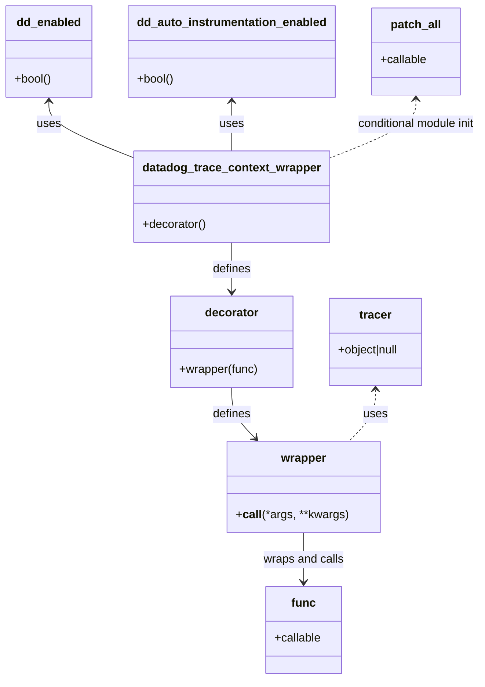

# Diagram: common/fv/python/fv/datadog/dd_tracer.py


> Auto-generated by Obscura crawlers

## Diagram 1



### SVG

<svg id="container" width="659.6015625" xmlns="http://www.w3.org/2000/svg" class="classDiagram" height="936" viewBox="0 0 659.6015625 936" role="graphics-document document" aria-roledescription="class"><style>#container{font-family:"trebuchet ms",verdana,arial,sans-serif;font-size:16px;fill:#333;}@keyframes edge-animation-frame{from{stroke-dashoffset:0;}}@keyframes dash{to{stroke-dashoffset:0;}}#container .edge-animation-slow{stroke-dasharray:9,5!important;stroke-dashoffset:900;animation:dash 50s linear infinite;stroke-linecap:round;}#container .edge-animation-fast{stroke-dasharray:9,5!important;stroke-dashoffset:900;animation:dash 20s linear infinite;stroke-linecap:round;}#container .error-icon{fill:#552222;}#container .error-text{fill:#552222;stroke:#552222;}#container .edge-thickness-normal{stroke-width:1px;}#container .edge-thickness-thick{stroke-width:3.5px;}#container .edge-pattern-solid{stroke-dasharray:0;}#container .edge-thickness-invisible{stroke-width:0;fill:none;}#container .edge-pattern-dashed{stroke-dasharray:3;}#container .edge-pattern-dotted{stroke-dasharray:2;}#container .marker{fill:#333333;stroke:#333333;}#container .marker.cross{stroke:#333333;}#container svg{font-family:"trebuchet ms",verdana,arial,sans-serif;font-size:16px;}#container p{margin:0;}#container g.classGroup text{fill:#9370DB;stroke:none;font-family:"trebuchet ms",verdana,arial,sans-serif;font-size:10px;}#container g.classGroup text .title{font-weight:bolder;}#container .nodeLabel,#container .edgeLabel{color:#131300;}#container .edgeLabel .label rect{fill:#ECECFF;}#container .label text{fill:#131300;}#container .labelBkg{background:#ECECFF;}#container .edgeLabel .label span{background:#ECECFF;}#container .classTitle{font-weight:bolder;}#container .node rect,#container .node circle,#container .node ellipse,#container .node polygon,#container .node path{fill:#ECECFF;stroke:#9370DB;stroke-width:1px;}#container .divider{stroke:#9370DB;stroke-width:1;}#container g.clickable{cursor:pointer;}#container g.classGroup rect{fill:#ECECFF;stroke:#9370DB;}#container g.classGroup line{stroke:#9370DB;stroke-width:1;}#container .classLabel .box{stroke:none;stroke-width:0;fill:#ECECFF;opacity:0.5;}#container .classLabel .label{fill:#9370DB;font-size:10px;}#container .relation{stroke:#333333;stroke-width:1;fill:none;}#container .dashed-line{stroke-dasharray:3;}#container .dotted-line{stroke-dasharray:1 2;}#container #compositionStart,#container .composition{fill:#333333!important;stroke:#333333!important;stroke-width:1;}#container #compositionEnd,#container .composition{fill:#333333!important;stroke:#333333!important;stroke-width:1;}#container #dependencyStart,#container .dependency{fill:#333333!important;stroke:#333333!important;stroke-width:1;}#container #dependencyStart,#container .dependency{fill:#333333!important;stroke:#333333!important;stroke-width:1;}#container #extensionStart,#container .extension{fill:transparent!important;stroke:#333333!important;stroke-width:1;}#container #extensionEnd,#container .extension{fill:transparent!important;stroke:#333333!important;stroke-width:1;}#container #aggregationStart,#container .aggregation{fill:transparent!important;stroke:#333333!important;stroke-width:1;}#container #aggregationEnd,#container .aggregation{fill:transparent!important;stroke:#333333!important;stroke-width:1;}#container #lollipopStart,#container .lollipop{fill:#ECECFF!important;stroke:#333333!important;stroke-width:1;}#container #lollipopEnd,#container .lollipop{fill:#ECECFF!important;stroke:#333333!important;stroke-width:1;}#container .edgeTerminals{font-size:11px;line-height:initial;}#container .classTitleText{text-anchor:middle;font-size:18px;fill:#333;}#container .label-icon{display:inline-block;height:1em;overflow:visible;vertical-align:-0.125em;}#container .node .label-icon path{fill:currentColor;stroke:revert;stroke-width:revert;}#container :root{--mermaid-font-family:"trebuchet ms",verdana,arial,sans-serif;}</style><g><defs><marker id="container_class-aggregationStart" class="marker aggregation class" refX="18" refY="7" markerWidth="190" markerHeight="240" orient="auto"><path d="M 18,7 L9,13 L1,7 L9,1 Z"></path></marker></defs><defs><marker id="container_class-aggregationEnd" class="marker aggregation class" refX="1" refY="7" markerWidth="20" markerHeight="28" orient="auto"><path d="M 18,7 L9,13 L1,7 L9,1 Z"></path></marker></defs><defs><marker id="container_class-extensionStart" class="marker extension class" refX="18" refY="7" markerWidth="190" markerHeight="240" orient="auto"><path d="M 1,7 L18,13 V 1 Z"></path></marker></defs><defs><marker id="container_class-extensionEnd" class="marker extension class" refX="1" refY="7" markerWidth="20" markerHeight="28" orient="auto"><path d="M 1,1 V 13 L18,7 Z"></path></marker></defs><defs><marker id="container_class-compositionStart" class="marker composition class" refX="18" refY="7" markerWidth="190" markerHeight="240" orient="auto"><path d="M 18,7 L9,13 L1,7 L9,1 Z"></path></marker></defs><defs><marker id="container_class-compositionEnd" class="marker composition class" refX="1" refY="7" markerWidth="20" markerHeight="28" orient="auto"><path d="M 18,7 L9,13 L1,7 L9,1 Z"></path></marker></defs><defs><marker id="container_class-dependencyStart" class="marker dependency class" refX="6" refY="7" markerWidth="190" markerHeight="240" orient="auto"><path d="M 5,7 L9,13 L1,7 L9,1 Z"></path></marker></defs><defs><marker id="container_class-dependencyEnd" class="marker dependency class" refX="13" refY="7" markerWidth="20" markerHeight="28" orient="auto"><path d="M 18,7 L9,13 L14,7 L9,1 Z"></path></marker></defs><defs><marker id="container_class-lollipopStart" class="marker lollipop class" refX="13" refY="7" markerWidth="190" markerHeight="240" orient="auto"><circle stroke="black" fill="transparent" cx="7" cy="7" r="6"></circle></marker></defs><defs><marker id="container_class-lollipopEnd" class="marker lollipop class" refX="1" refY="7" markerWidth="190" markerHeight="240" orient="auto"><circle stroke="black" fill="transparent" cx="7" cy="7" r="6"></circle></marker></defs><g class="root"><g class="clusters"></g><g class="edgePaths"><path d="M67.293,140L67.293,145.167C67.293,150.333,67.293,160.667,86.945,173.737C106.596,186.808,145.9,202.616,165.551,210.52L185.203,218.424" id="id_dd_enabled_datadog_trace_context_wrapper_1" class="edge-thickness-normal edge-pattern-solid relation" style=";;;" data-edge="true" data-et="edge" data-id="id_dd_enabled_datadog_trace_context_wrapper_1" data-points="W3sieCI6NjcuMjkyOTY4NzUsInkiOjEzNH0seyJ4Ijo2Ny4yOTI5Njg3NSwieSI6MTcxfSx7IngiOjE4NS4yMDMxMjUsInkiOjIxOC40MjQxNTQzNDY0OTQwNX1d" marker-start="url(#container_class-dependencyStart)"></path><path d="M315.922,140L315.922,145.167C315.922,150.333,315.922,160.667,315.922,172C315.922,183.333,315.922,195.667,315.922,201.833L315.922,208" id="id_dd_auto_instrumentation_enabled_datadog_trace_context_wrapper_2" class="edge-thickness-normal edge-pattern-solid relation" style=";;;" data-edge="true" data-et="edge" data-id="id_dd_auto_instrumentation_enabled_datadog_trace_context_wrapper_2" data-points="W3sieCI6MzE1LjkyMTg3NSwieSI6MTM0fSx7IngiOjMxNS45MjE4NzUsInkiOjE3MX0seyJ4IjozMTUuOTIxODc1LCJ5IjoyMDh9XQ==" marker-start="url(#container_class-dependencyStart)"></path><path d="M315.922,334L315.922,340.167C315.922,346.333,315.922,358.667,315.922,370C315.922,381.333,315.922,391.667,315.922,396.833L315.922,402" id="id_datadog_trace_context_wrapper_decorator_3" class="edge-thickness-normal edge-pattern-solid relation" style=";;;" data-edge="true" data-et="edge" data-id="id_datadog_trace_context_wrapper_decorator_3" data-points="W3sieCI6MzE1LjkyMTg3NSwieSI6MzM0fSx7IngiOjMxNS45MjE4NzUsInkiOjM3MX0seyJ4IjozMTUuOTIxODc1LCJ5Ijo0MDh9XQ==" marker-end="url(#container_class-dependencyEnd)"></path><path d="M315.922,534L315.922,540.167C315.922,546.333,315.922,558.667,321.427,570.296C326.932,581.925,337.942,592.849,343.447,598.312L348.952,603.774" id="id_decorator_wrapper_4" class="edge-thickness-normal edge-pattern-solid relation" style=";;;" data-edge="true" data-et="edge" data-id="id_decorator_wrapper_4" data-points="W3sieCI6MzE1LjkyMTg3NSwieSI6NTM0fSx7IngiOjMxNS45MjE4NzUsInkiOjU3MX0seyJ4IjozNTMuMjEwOTM3NSwieSI6NjA4fV0=" marker-end="url(#container_class-dependencyEnd)"></path><path d="M416.703,734L416.703,740.167C416.703,746.333,416.703,758.667,416.703,770C416.703,781.333,416.703,791.667,416.703,796.833L416.703,802" id="id_wrapper_func_5" class="edge-thickness-normal edge-pattern-solid relation" style=";;;" data-edge="true" data-et="edge" data-id="id_wrapper_func_5" data-points="W3sieCI6NDE2LjcwMzEyNSwieSI6NzM0fSx7IngiOjQxNi43MDMxMjUsInkiOjc3MX0seyJ4Ijo0MTYuNzAzMTI1LCJ5Ijo4MDh9XQ==" marker-end="url(#container_class-dependencyEnd)"></path><path d="M517.484,537L517.484,542.667C517.484,548.333,517.484,559.667,511.27,571.5C505.055,583.333,492.625,595.667,486.41,601.833L480.195,608" id="id_tracer_wrapper_6" class="edge-thickness-normal edge-pattern-dashed relation" style=";;;" data-edge="true" data-et="edge" data-id="id_tracer_wrapper_6" data-points="W3sieCI6NTE3LjQ4NDM3NSwieSI6NTMxfSx7IngiOjUxNy40ODQzNzUsInkiOjU3MX0seyJ4Ijo0ODAuMTk1MzEyNSwieSI6NjA4fV0=" marker-start="url(#container_class-dependencyStart)"></path><path d="M566.453,137L566.453,142.667C566.453,148.333,566.453,159.667,546.484,173.304C526.516,186.941,486.578,202.882,466.609,210.853L446.641,218.823" id="id_patch_all_datadog_trace_context_wrapper_7" class="edge-thickness-normal edge-pattern-dashed relation" style=";;;" data-edge="true" data-et="edge" data-id="id_patch_all_datadog_trace_context_wrapper_7" data-points="W3sieCI6NTY2LjQ1MzEyNSwieSI6MTMxfSx7IngiOjU2Ni40NTMxMjUsInkiOjE3MX0seyJ4Ijo0NDYuNjQwNjI1LCJ5IjoyMTguODIzMzc1MzI3NDI5Mn1d" marker-start="url(#container_class-dependencyStart)"></path></g><g class="edgeLabels"><g class="edgeLabel" transform="translate(67.29296875, 171)"><g class="label" data-id="id_dd_enabled_datadog_trace_context_wrapper_1" transform="translate(-16.4921875, -12)"><foreignObject width="32.984375" height="24"><div xmlns="http://www.w3.org/1999/xhtml" class="labelBkg" style="display: table-cell; white-space: nowrap; line-height: 1.5; max-width: 200px; text-align: center;"><span class="edgeLabel"><p>uses</p></span></div></foreignObject></g></g><g class="edgeLabel" transform="translate(315.921875, 171)"><g class="label" data-id="id_dd_auto_instrumentation_enabled_datadog_trace_context_wrapper_2" transform="translate(-16.4921875, -12)"><foreignObject width="32.984375" height="24"><div xmlns="http://www.w3.org/1999/xhtml" class="labelBkg" style="display: table-cell; white-space: nowrap; line-height: 1.5; max-width: 200px; text-align: center;"><span class="edgeLabel"><p>uses</p></span></div></foreignObject></g></g><g class="edgeLabel" transform="translate(315.921875, 371)"><g class="label" data-id="id_datadog_trace_context_wrapper_decorator_3" transform="translate(-26.53125, -12)"><foreignObject width="53.0625" height="24"><div xmlns="http://www.w3.org/1999/xhtml" class="labelBkg" style="display: table-cell; white-space: nowrap; line-height: 1.5; max-width: 200px; text-align: center;"><span class="edgeLabel"><p>defines</p></span></div></foreignObject></g></g><g class="edgeLabel" transform="translate(315.921875, 571)"><g class="label" data-id="id_decorator_wrapper_4" transform="translate(-26.53125, -12)"><foreignObject width="53.0625" height="24"><div xmlns="http://www.w3.org/1999/xhtml" class="labelBkg" style="display: table-cell; white-space: nowrap; line-height: 1.5; max-width: 200px; text-align: center;"><span class="edgeLabel"><p>defines</p></span></div></foreignObject></g></g><g class="edgeLabel" transform="translate(416.703125, 771)"><g class="label" data-id="id_wrapper_func_5" transform="translate(-55.890625, -12)"><foreignObject width="111.78125" height="24"><div xmlns="http://www.w3.org/1999/xhtml" class="labelBkg" style="display: table-cell; white-space: nowrap; line-height: 1.5; max-width: 200px; text-align: center;"><span class="edgeLabel"><p>wraps and calls</p></span></div></foreignObject></g></g><g class="edgeLabel" transform="translate(517.484375, 571)"><g class="label" data-id="id_tracer_wrapper_6" transform="translate(-16.4921875, -12)"><foreignObject width="32.984375" height="24"><div xmlns="http://www.w3.org/1999/xhtml" class="labelBkg" style="display: table-cell; white-space: nowrap; line-height: 1.5; max-width: 200px; text-align: center;"><span class="edgeLabel"><p>uses</p></span></div></foreignObject></g></g><g class="edgeLabel" transform="translate(566.453125, 171)"><g class="label" data-id="id_patch_all_datadog_trace_context_wrapper_7" transform="translate(-85.1484375, -12)"><foreignObject width="170.296875" height="24"><div xmlns="http://www.w3.org/1999/xhtml" class="labelBkg" style="display: table-cell; white-space: nowrap; line-height: 1.5; max-width: 200px; text-align: center;"><span class="edgeLabel"><p>conditional module init</p></span></div></foreignObject></g></g></g><g class="nodes"><g class="node default" id="classId-dd_enabled-0" transform="translate(67.29296875, 71)"><g class="basic label-container"><path d="M-59.29296875 -63 L59.29296875 -63 L59.29296875 63 L-59.29296875 63" stroke="none" stroke-width="0" fill="#ECECFF" style=""></path><path d="M-59.29296875 -63 C-18.29997757315558 -63, 22.69301360368884 -63, 59.29296875 -63 M-59.29296875 -63 C-32.58398418994601 -63, -5.874999629892024 -63, 59.29296875 -63 M59.29296875 -63 C59.29296875 -20.43246548662877, 59.29296875 22.135069026742457, 59.29296875 63 M59.29296875 -63 C59.29296875 -22.73301779422706, 59.29296875 17.53396441154588, 59.29296875 63 M59.29296875 63 C16.300131184712754 63, -26.692706380574492 63, -59.29296875 63 M59.29296875 63 C27.006419109475928 63, -5.280130531048144 63, -59.29296875 63 M-59.29296875 63 C-59.29296875 13.03961883328057, -59.29296875 -36.92076233343886, -59.29296875 -63 M-59.29296875 63 C-59.29296875 24.149638462795274, -59.29296875 -14.700723074409453, -59.29296875 -63" stroke="#9370DB" stroke-width="1.3" fill="none" stroke-dasharray="0 0" style=""></path></g><g class="annotation-group text" transform="translate(0, -39)"></g><g class="label-group text" transform="translate(-43.3515625, -39)"><g class="label" style="font-weight: bolder" transform="translate(0,-12)"><foreignObject width="86.703125" height="24"><div xmlns="http://www.w3.org/1999/xhtml" style="display: table-cell; white-space: nowrap; line-height: 1.5; max-width: 136px; text-align: center;"><span class="nodeLabel markdown-node-label" style=""><p>dd_enabled</p></span></div></foreignObject></g></g><g class="members-group text" transform="translate(-47.29296875, 9)"></g><g class="methods-group text" transform="translate(-47.29296875, 39)"><g class="label" style="" transform="translate(0,-12)"><foreignObject width="51.234375" height="24"><div xmlns="http://www.w3.org/1999/xhtml" style="display: table-cell; white-space: nowrap; line-height: 1.5; max-width: 109px; text-align: center;"><span class="nodeLabel markdown-node-label" style=""><p>+bool()</p></span></div></foreignObject></g></g><g class="divider" style=""><path d="M-59.29296875 -15 C-25.419233584849465 -15, 8.45450158030107 -15, 59.29296875 -15 M-59.29296875 -15 C-11.935942452966124 -15, 35.42108384406775 -15, 59.29296875 -15" stroke="#9370DB" stroke-width="1.3" fill="none" stroke-dasharray="0 0" style=""></path></g><g class="divider" style=""><path d="M-59.29296875 9 C-28.681659957556697 9, 1.9296488348866063 9, 59.29296875 9 M-59.29296875 9 C-26.178656702712637 9, 6.935655344574727 9, 59.29296875 9" stroke="#9370DB" stroke-width="1.3" fill="none" stroke-dasharray="0 0" style=""></path></g></g><g class="node default" id="classId-dd_auto_instrumentation_enabled-1" transform="translate(315.921875, 71)"><g class="basic label-container"><path d="M-139.3359375 -63 L139.3359375 -63 L139.3359375 63 L-139.3359375 63" stroke="none" stroke-width="0" fill="#ECECFF" style=""></path><path d="M-139.3359375 -63 C-77.12530268924905 -63, -14.914667878498108 -63, 139.3359375 -63 M-139.3359375 -63 C-60.500877113544945 -63, 18.33418327291011 -63, 139.3359375 -63 M139.3359375 -63 C139.3359375 -29.58421302396448, 139.3359375 3.8315739520710395, 139.3359375 63 M139.3359375 -63 C139.3359375 -34.472403267131114, 139.3359375 -5.94480653426222, 139.3359375 63 M139.3359375 63 C28.202399555623984 63, -82.93113838875203 63, -139.3359375 63 M139.3359375 63 C36.23926278917925 63, -66.8574119216415 63, -139.3359375 63 M-139.3359375 63 C-139.3359375 19.775571884743634, -139.3359375 -23.44885623051273, -139.3359375 -63 M-139.3359375 63 C-139.3359375 29.947666260228253, -139.3359375 -3.104667479543494, -139.3359375 -63" stroke="#9370DB" stroke-width="1.3" fill="none" stroke-dasharray="0 0" style=""></path></g><g class="annotation-group text" transform="translate(0, -39)"></g><g class="label-group text" transform="translate(-127.3359375, -39)"><g class="label" style="font-weight: bolder" transform="translate(0,-12)"><foreignObject width="254.671875" height="24"><div xmlns="http://www.w3.org/1999/xhtml" style="display: table-cell; white-space: nowrap; line-height: 1.5; max-width: 303px; text-align: center;"><span class="nodeLabel markdown-node-label" style=""><p>dd_auto_instrumentation_enabled</p></span></div></foreignObject></g></g><g class="members-group text" transform="translate(-127.3359375, 9)"></g><g class="methods-group text" transform="translate(-127.3359375, 39)"><g class="label" style="" transform="translate(0,-12)"><foreignObject width="51.234375" height="24"><div xmlns="http://www.w3.org/1999/xhtml" style="display: table-cell; white-space: nowrap; line-height: 1.5; max-width: 109px; text-align: center;"><span class="nodeLabel markdown-node-label" style=""><p>+bool()</p></span></div></foreignObject></g></g><g class="divider" style=""><path d="M-139.3359375 -15 C-81.9939427791714 -15, -24.65194805834281 -15, 139.3359375 -15 M-139.3359375 -15 C-69.22069098451097 -15, 0.8945555309780673 -15, 139.3359375 -15" stroke="#9370DB" stroke-width="1.3" fill="none" stroke-dasharray="0 0" style=""></path></g><g class="divider" style=""><path d="M-139.3359375 9 C-57.18779870131307 9, 24.96034009737386 9, 139.3359375 9 M-139.3359375 9 C-52.7788386005719 9, 33.778260298856196 9, 139.3359375 9" stroke="#9370DB" stroke-width="1.3" fill="none" stroke-dasharray="0 0" style=""></path></g></g><g class="node default" id="classId-patch_all-2" transform="translate(566.453125, 71)"><g class="basic label-container"><path d="M-61.1953125 -60 L61.1953125 -60 L61.1953125 60 L-61.1953125 60" stroke="none" stroke-width="0" fill="#ECECFF" style=""></path><path d="M-61.1953125 -60 C-29.36636309031547 -60, 2.462586319369059 -60, 61.1953125 -60 M-61.1953125 -60 C-17.74283718764091 -60, 25.709638124718182 -60, 61.1953125 -60 M61.1953125 -60 C61.1953125 -25.75923272353809, 61.1953125 8.481534552923819, 61.1953125 60 M61.1953125 -60 C61.1953125 -17.70069645642061, 61.1953125 24.598607087158783, 61.1953125 60 M61.1953125 60 C22.277637604375208 60, -16.640037291249584 60, -61.1953125 60 M61.1953125 60 C15.955748159335748 60, -29.283816181328504 60, -61.1953125 60 M-61.1953125 60 C-61.1953125 30.56115794732761, -61.1953125 1.1223158946552232, -61.1953125 -60 M-61.1953125 60 C-61.1953125 26.682154434984767, -61.1953125 -6.635691130030466, -61.1953125 -60" stroke="#9370DB" stroke-width="1.3" fill="none" stroke-dasharray="0 0" style=""></path></g><g class="annotation-group text" transform="translate(0, -36)"></g><g class="label-group text" transform="translate(-33.53125, -36)"><g class="label" style="font-weight: bolder" transform="translate(0,-12)"><foreignObject width="67.0625" height="24"><div xmlns="http://www.w3.org/1999/xhtml" style="display: table-cell; white-space: nowrap; line-height: 1.5; max-width: 117px; text-align: center;"><span class="nodeLabel markdown-node-label" style=""><p>patch_all</p></span></div></foreignObject></g></g><g class="members-group text" transform="translate(-49.1953125, 12)"><g class="label" style="" transform="translate(0,-12)"><foreignObject width="64.859375" height="24"><div xmlns="http://www.w3.org/1999/xhtml" style="display: table-cell; white-space: nowrap; line-height: 1.5; max-width: 122px; text-align: center;"><span class="nodeLabel markdown-node-label" style=""><p>+callable</p></span></div></foreignObject></g></g><g class="methods-group text" transform="translate(-49.1953125, 60)"></g><g class="divider" style=""><path d="M-61.1953125 -12 C-13.576329969133184 -12, 34.04265256173363 -12, 61.1953125 -12 M-61.1953125 -12 C-14.970043918327988 -12, 31.255224663344023 -12, 61.1953125 -12" stroke="#9370DB" stroke-width="1.3" fill="none" stroke-dasharray="0 0" style=""></path></g><g class="divider" style=""><path d="M-61.1953125 36 C-20.671856217552275 36, 19.85160006489545 36, 61.1953125 36 M-61.1953125 36 C-28.744893310456263 36, 3.7055258790874746 36, 61.1953125 36" stroke="#9370DB" stroke-width="1.3" fill="none" stroke-dasharray="0 0" style=""></path></g></g><g class="node default" id="classId-tracer-3" transform="translate(517.484375, 471)"><g class="basic label-container"><path d="M-66.8359375 -60 L66.8359375 -60 L66.8359375 60 L-66.8359375 60" stroke="none" stroke-width="0" fill="#ECECFF" style=""></path><path d="M-66.8359375 -60 C-30.259033236791517 -60, 6.317871026416967 -60, 66.8359375 -60 M-66.8359375 -60 C-27.45318895519167 -60, 11.929559589616659 -60, 66.8359375 -60 M66.8359375 -60 C66.8359375 -33.4213337720158, 66.8359375 -6.842667544031592, 66.8359375 60 M66.8359375 -60 C66.8359375 -27.542093757998074, 66.8359375 4.915812484003851, 66.8359375 60 M66.8359375 60 C35.22325362599243 60, 3.6105697519848476 60, -66.8359375 60 M66.8359375 60 C23.730337577722807 60, -19.375262344554386 60, -66.8359375 60 M-66.8359375 60 C-66.8359375 29.26972337739357, -66.8359375 -1.4605532452128571, -66.8359375 -60 M-66.8359375 60 C-66.8359375 13.435674846443575, -66.8359375 -33.12865030711285, -66.8359375 -60" stroke="#9370DB" stroke-width="1.3" fill="none" stroke-dasharray="0 0" style=""></path></g><g class="annotation-group text" transform="translate(0, -36)"></g><g class="label-group text" transform="translate(-21.703125, -36)"><g class="label" style="font-weight: bolder" transform="translate(0,-12)"><foreignObject width="43.40625" height="24"><div xmlns="http://www.w3.org/1999/xhtml" style="display: table-cell; white-space: nowrap; line-height: 1.5; max-width: 93px; text-align: center;"><span class="nodeLabel markdown-node-label" style=""><p>tracer</p></span></div></foreignObject></g></g><g class="members-group text" transform="translate(-54.8359375, 12)"><g class="label" style="" transform="translate(0,-12)"><foreignObject width="87.96875" height="24"><div xmlns="http://www.w3.org/1999/xhtml" style="display: table-cell; white-space: nowrap; line-height: 1.5; max-width: 146px; text-align: center;"><span class="nodeLabel markdown-node-label" style=""><p>+object|null</p></span></div></foreignObject></g></g><g class="methods-group text" transform="translate(-54.8359375, 60)"></g><g class="divider" style=""><path d="M-66.8359375 -12 C-24.383025272049927 -12, 18.069886955900145 -12, 66.8359375 -12 M-66.8359375 -12 C-16.032146293450545 -12, 34.77164491309891 -12, 66.8359375 -12" stroke="#9370DB" stroke-width="1.3" fill="none" stroke-dasharray="0 0" style=""></path></g><g class="divider" style=""><path d="M-66.8359375 36 C-16.244195962671377 36, 34.34754557465725 36, 66.8359375 36 M-66.8359375 36 C-28.415012614740192 36, 10.005912270519616 36, 66.8359375 36" stroke="#9370DB" stroke-width="1.3" fill="none" stroke-dasharray="0 0" style=""></path></g></g><g class="node default" id="classId-datadog_trace_context_wrapper-4" transform="translate(315.921875, 271)"><g class="basic label-container"><path d="M-130.71875 -63 L130.71875 -63 L130.71875 63 L-130.71875 63" stroke="none" stroke-width="0" fill="#ECECFF" style=""></path><path d="M-130.71875 -63 C-36.04234437248658 -63, 58.634061255026836 -63, 130.71875 -63 M-130.71875 -63 C-28.463528093220717 -63, 73.79169381355857 -63, 130.71875 -63 M130.71875 -63 C130.71875 -24.895621903119896, 130.71875 13.208756193760209, 130.71875 63 M130.71875 -63 C130.71875 -28.98166764052801, 130.71875 5.036664718943982, 130.71875 63 M130.71875 63 C70.12487349358139 63, 9.53099698716278 63, -130.71875 63 M130.71875 63 C76.98566846608362 63, 23.252586932167247 63, -130.71875 63 M-130.71875 63 C-130.71875 18.602430775097893, -130.71875 -25.795138449804213, -130.71875 -63 M-130.71875 63 C-130.71875 27.358190531118296, -130.71875 -8.283618937763407, -130.71875 -63" stroke="#9370DB" stroke-width="1.3" fill="none" stroke-dasharray="0 0" style=""></path></g><g class="annotation-group text" transform="translate(0, -39)"></g><g class="label-group text" transform="translate(-118.71875, -39)"><g class="label" style="font-weight: bolder" transform="translate(0,-12)"><foreignObject width="237.4375" height="24"><div xmlns="http://www.w3.org/1999/xhtml" style="display: table-cell; white-space: nowrap; line-height: 1.5; max-width: 284px; text-align: center;"><span class="nodeLabel markdown-node-label" style=""><p>datadog_trace_context_wrapper</p></span></div></foreignObject></g></g><g class="members-group text" transform="translate(-118.71875, 9)"></g><g class="methods-group text" transform="translate(-118.71875, 39)"><g class="label" style="" transform="translate(0,-12)"><foreignObject width="88.703125" height="24"><div xmlns="http://www.w3.org/1999/xhtml" style="display: table-cell; white-space: nowrap; line-height: 1.5; max-width: 146px; text-align: center;"><span class="nodeLabel markdown-node-label" style=""><p>+decorator()</p></span></div></foreignObject></g></g><g class="divider" style=""><path d="M-130.71875 -15 C-50.3632332041407 -15, 29.992283591718603 -15, 130.71875 -15 M-130.71875 -15 C-69.04678003908214 -15, -7.374810078164288 -15, 130.71875 -15" stroke="#9370DB" stroke-width="1.3" fill="none" stroke-dasharray="0 0" style=""></path></g><g class="divider" style=""><path d="M-130.71875 9 C-66.03670428823138 9, -1.3546585764627537 9, 130.71875 9 M-130.71875 9 C-38.80544120365367 9, 53.107867592692656 9, 130.71875 9" stroke="#9370DB" stroke-width="1.3" fill="none" stroke-dasharray="0 0" style=""></path></g></g><g class="node default" id="classId-decorator-5" transform="translate(315.921875, 471)"><g class="basic label-container"><path d="M-84.7265625 -63 L84.7265625 -63 L84.7265625 63 L-84.7265625 63" stroke="none" stroke-width="0" fill="#ECECFF" style=""></path><path d="M-84.7265625 -63 C-38.43020289823022 -63, 7.866156703539559 -63, 84.7265625 -63 M-84.7265625 -63 C-22.661202492837695 -63, 39.40415751432461 -63, 84.7265625 -63 M84.7265625 -63 C84.7265625 -13.91413084630205, 84.7265625 35.1717383073959, 84.7265625 63 M84.7265625 -63 C84.7265625 -23.931568842909265, 84.7265625 15.13686231418147, 84.7265625 63 M84.7265625 63 C50.13292145629932 63, 15.539280412598643 63, -84.7265625 63 M84.7265625 63 C28.353643004160624 63, -28.019276491678752 63, -84.7265625 63 M-84.7265625 63 C-84.7265625 25.699788047697133, -84.7265625 -11.600423904605734, -84.7265625 -63 M-84.7265625 63 C-84.7265625 25.717034612691776, -84.7265625 -11.565930774616447, -84.7265625 -63" stroke="#9370DB" stroke-width="1.3" fill="none" stroke-dasharray="0 0" style=""></path></g><g class="annotation-group text" transform="translate(0, -39)"></g><g class="label-group text" transform="translate(-35.703125, -39)"><g class="label" style="font-weight: bolder" transform="translate(0,-12)"><foreignObject width="71.40625" height="24"><div xmlns="http://www.w3.org/1999/xhtml" style="display: table-cell; white-space: nowrap; line-height: 1.5; max-width: 121px; text-align: center;"><span class="nodeLabel markdown-node-label" style=""><p>decorator</p></span></div></foreignObject></g></g><g class="members-group text" transform="translate(-72.7265625, 9)"></g><g class="methods-group text" transform="translate(-72.7265625, 39)"><g class="label" style="" transform="translate(0,-12)"><foreignObject width="109.75" height="24"><div xmlns="http://www.w3.org/1999/xhtml" style="display: table-cell; white-space: nowrap; line-height: 1.5; max-width: 167px; text-align: center;"><span class="nodeLabel markdown-node-label" style=""><p>+wrapper(func)</p></span></div></foreignObject></g></g><g class="divider" style=""><path d="M-84.7265625 -15 C-41.84215447394513 -15, 1.0422535521097416 -15, 84.7265625 -15 M-84.7265625 -15 C-24.3594887099065 -15, 36.007585080187 -15, 84.7265625 -15" stroke="#9370DB" stroke-width="1.3" fill="none" stroke-dasharray="0 0" style=""></path></g><g class="divider" style=""><path d="M-84.7265625 9 C-39.62763523661275 9, 5.471292026774506 9, 84.7265625 9 M-84.7265625 9 C-49.83158505964226 9, -14.936607619284516 9, 84.7265625 9" stroke="#9370DB" stroke-width="1.3" fill="none" stroke-dasharray="0 0" style=""></path></g></g><g class="node default" id="classId-wrapper-6" transform="translate(416.703125, 671)"><g class="basic label-container"><path d="M-103.7421875 -63 L103.7421875 -63 L103.7421875 63 L-103.7421875 63" stroke="none" stroke-width="0" fill="#ECECFF" style=""></path><path d="M-103.7421875 -63 C-44.57556044803437 -63, 14.591066603931253 -63, 103.7421875 -63 M-103.7421875 -63 C-24.91307524821447 -63, 53.91603700357106 -63, 103.7421875 -63 M103.7421875 -63 C103.7421875 -32.146368297697556, 103.7421875 -1.2927365953951124, 103.7421875 63 M103.7421875 -63 C103.7421875 -26.03249813710361, 103.7421875 10.935003725792782, 103.7421875 63 M103.7421875 63 C54.313048716771 63, 4.883909933542 63, -103.7421875 63 M103.7421875 63 C36.5379569404184 63, -30.666273619163206 63, -103.7421875 63 M-103.7421875 63 C-103.7421875 25.254354101181548, -103.7421875 -12.491291797636904, -103.7421875 -63 M-103.7421875 63 C-103.7421875 28.775708695558315, -103.7421875 -5.44858260888337, -103.7421875 -63" stroke="#9370DB" stroke-width="1.3" fill="none" stroke-dasharray="0 0" style=""></path></g><g class="annotation-group text" transform="translate(0, -39)"></g><g class="label-group text" transform="translate(-30.484375, -39)"><g class="label" style="font-weight: bolder" transform="translate(0,-12)"><foreignObject width="60.96875" height="24"><div xmlns="http://www.w3.org/1999/xhtml" style="display: table-cell; white-space: nowrap; line-height: 1.5; max-width: 111px; text-align: center;"><span class="nodeLabel markdown-node-label" style=""><p>wrapper</p></span></div></foreignObject></g></g><g class="members-group text" transform="translate(-91.7421875, 9)"></g><g class="methods-group text" transform="translate(-91.7421875, 39)"><g class="label" style="" transform="translate(0,-12)"><foreignObject width="153" height="24"><div xmlns="http://www.w3.org/1999/xhtml" style="display: table-cell; white-space: nowrap; line-height: 1.5; max-width: 242px; text-align: center;"><span class="nodeLabel markdown-node-label" style=""><p>+<strong>call</strong>(*args, **kwargs)</p></span></div></foreignObject></g></g><g class="divider" style=""><path d="M-103.7421875 -15 C-55.810305060052926 -15, -7.878422620105852 -15, 103.7421875 -15 M-103.7421875 -15 C-24.054681543055608 -15, 55.632824413888784 -15, 103.7421875 -15" stroke="#9370DB" stroke-width="1.3" fill="none" stroke-dasharray="0 0" style=""></path></g><g class="divider" style=""><path d="M-103.7421875 9 C-39.243070401256915 9, 25.25604669748617 9, 103.7421875 9 M-103.7421875 9 C-28.63085210673188 9, 46.48048328653624 9, 103.7421875 9" stroke="#9370DB" stroke-width="1.3" fill="none" stroke-dasharray="0 0" style=""></path></g></g><g class="node default" id="classId-func-7" transform="translate(416.703125, 868)"><g class="basic label-container"><path d="M-52.3671875 -60 L52.3671875 -60 L52.3671875 60 L-52.3671875 60" stroke="none" stroke-width="0" fill="#ECECFF" style=""></path><path d="M-52.3671875 -60 C-26.655978407836642 -60, -0.9447693156732839 -60, 52.3671875 -60 M-52.3671875 -60 C-24.31352721533691 -60, 3.740133069326177 -60, 52.3671875 -60 M52.3671875 -60 C52.3671875 -19.65891564021851, 52.3671875 20.68216871956298, 52.3671875 60 M52.3671875 -60 C52.3671875 -35.809489502807565, 52.3671875 -11.618979005615131, 52.3671875 60 M52.3671875 60 C22.448256244271693 60, -7.470675011456613 60, -52.3671875 60 M52.3671875 60 C19.73239451493542 60, -12.902398470129157 60, -52.3671875 60 M-52.3671875 60 C-52.3671875 23.305515909908664, -52.3671875 -13.388968180182673, -52.3671875 -60 M-52.3671875 60 C-52.3671875 27.45942497726962, -52.3671875 -5.08115004546076, -52.3671875 -60" stroke="#9370DB" stroke-width="1.3" fill="none" stroke-dasharray="0 0" style=""></path></g><g class="annotation-group text" transform="translate(0, -36)"></g><g class="label-group text" transform="translate(-15.875, -36)"><g class="label" style="font-weight: bolder" transform="translate(0,-12)"><foreignObject width="31.75" height="24"><div xmlns="http://www.w3.org/1999/xhtml" style="display: table-cell; white-space: nowrap; line-height: 1.5; max-width: 82px; text-align: center;"><span class="nodeLabel markdown-node-label" style=""><p>func</p></span></div></foreignObject></g></g><g class="members-group text" transform="translate(-40.3671875, 12)"><g class="label" style="" transform="translate(0,-12)"><foreignObject width="64.859375" height="24"><div xmlns="http://www.w3.org/1999/xhtml" style="display: table-cell; white-space: nowrap; line-height: 1.5; max-width: 122px; text-align: center;"><span class="nodeLabel markdown-node-label" style=""><p>+callable</p></span></div></foreignObject></g></g><g class="methods-group text" transform="translate(-40.3671875, 60)"></g><g class="divider" style=""><path d="M-52.3671875 -12 C-25.228255819047956 -12, 1.910675861904089 -12, 52.3671875 -12 M-52.3671875 -12 C-13.77796918509226 -12, 24.81124912981548 -12, 52.3671875 -12" stroke="#9370DB" stroke-width="1.3" fill="none" stroke-dasharray="0 0" style=""></path></g><g class="divider" style=""><path d="M-52.3671875 36 C-27.764334964835168 36, -3.161482429670336 36, 52.3671875 36 M-52.3671875 36 C-21.414269231998045 36, 9.53864903600391 36, 52.3671875 36" stroke="#9370DB" stroke-width="1.3" fill="none" stroke-dasharray="0 0" style=""></path></g></g></g></g></g></svg>

## Diagram 2

```mermaid
flowchart TD
    Start([Start Module Import])
    A{DD_TRACE_ENABLED?}
    B{AUTO_INSTRUMENTATION_ENABLED?}
    Patch[patch_all() called]
    EndImport([Module Import Complete])
    DecoratorDef[Define datadog_trace_context_wrapper decorator]
    FuncCall[Call wrapped function]
    CheckDD[dd_enabled() && tracer available?]
    StartSpan[tracer.trace(trace_name) as span]
    SetTags[span.set_tag(service,function,kwargs...)]
    TryInvoke[try: invoke original func]
    OnError[span.set_tag("error", True) then raise]
    NoTrace[Invoke original func without tracing]
    Start --> A
    A -- yes --> B
    A -- no --> DecoratorDef
    B -- yes --> Patch --> DecoratorDef
    B -- no --> DecoratorDef
    DecoratorDef --> EndImport
    EndImport --> FuncCall
    FuncCall --> CheckDD
    CheckDD -- true --> StartSpan --> SetTags --> TryInvoke
    TryInvoke -- success --> End([Return result])
    TryInvoke -- exception --> OnError --> End
    CheckDD -- false --> NoTrace --> End
```

> SVG rendering failed for this diagram.
