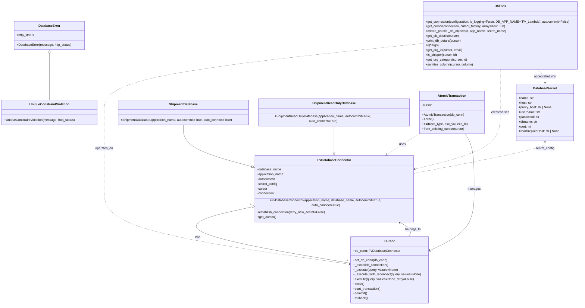

# Diagram: common/fv/python/fv/db/__init__.py

> Auto-generated by Obscura crawlers

## Mermaid

### SVG

<svg id="container" width="2909.38671875" xmlns="http://www.w3.org/2000/svg" class="classDiagram" height="1516" viewBox="0 0 2909.38671875 1516" role="graphics-document document" aria-roledescription="class"><g><defs><marker id="container_class-aggregationStart" class="marker aggregation class" refX="18" refY="7" markerWidth="190" markerHeight="240" orient="auto"><path d="M 18,7 L9,13 L1,7 L9,1 Z"></path></marker></defs><defs><marker id="container_class-aggregationEnd" class="marker aggregation class" refX="1" refY="7" markerWidth="20" markerHeight="28" orient="auto"><path d="M 18,7 L9,13 L1,7 L9,1 Z"></path></marker></defs><defs><marker id="container_class-extensionStart" class="marker extension class" refX="18" refY="7" markerWidth="190" markerHeight="240" orient="auto"><path d="M 1,7 L18,13 V 1 Z"></path></marker></defs><defs><marker id="container_class-extensionEnd" class="marker extension class" refX="1" refY="7" markerWidth="20" markerHeight="28" orient="auto"><path d="M 1,1 V 13 L18,7 Z"></path></marker></defs><defs><marker id="container_class-compositionStart" class="marker composition class" refX="18" refY="7" markerWidth="190" markerHeight="240" orient="auto"><path d="M 18,7 L9,13 L1,7 L9,1 Z"></path></marker></defs><defs><marker id="container_class-compositionEnd" class="marker composition class" refX="1" refY="7" markerWidth="20" markerHeight="28" orient="auto"><path d="M 18,7 L9,13 L1,7 L9,1 Z"></path></marker></defs><defs><marker id="container_class-dependencyStart" class="marker dependency class" refX="6" refY="7" markerWidth="190" markerHeight="240" orient="auto"><path d="M 5,7 L9,13 L1,7 L9,1 Z"></path></marker></defs><defs><marker id="container_class-dependencyEnd" class="marker dependency class" refX="13" refY="7" markerWidth="20" markerHeight="28" orient="auto"><path d="M 18,7 L9,13 L14,7 L9,1 Z"></path></marker></defs><defs><marker id="container_class-lollipopStart" class="marker lollipop class" refX="13" refY="7" markerWidth="190" markerHeight="240" orient="auto"><circle stroke="black" fill="transparent" cx="7" cy="7" r="6"></circle></marker></defs><defs><marker id="container_class-lollipopEnd" class="marker lollipop class" refX="1" refY="7" markerWidth="190" markerHeight="240" orient="auto"><circle stroke="black" fill="transparent" cx="7" cy="7" r="6"></circle></marker></defs><g class="root"><g class="clusters"></g><g class="edgePaths"><path d="M249.953,268.25L249.953,288.042C249.953,307.833,249.953,347.417,249.953,386.875C249.953,426.333,249.953,465.667,249.953,485.333L249.953,505" id="id_DatabaseError_UniqueConstraintViolation_1" class="edge-thickness-normal edge-pattern-solid relation" style=";;;" data-edge="true" data-et="edge" data-id="id_DatabaseError_UniqueConstraintViolation_1" data-points="W3sieCI6MjQ5Ljk1MzEyNSwieSI6MjUxfSx7IngiOjI0OS45NTMxMjUsInkiOjM4N30seyJ4IjoyNDkuOTUzMTI1LCJ5Ijo1MDV9XQ==" marker-start="url(#container_class-extensionStart)"></path><path d="M930.367,631L930.367,650.667C930.367,670.333,930.367,709.667,986.501,743.582C1042.635,777.497,1154.903,805.994,1211.037,820.243L1267.171,834.491" id="id_ShipmentDatabase_FvDatabaseConnector_2" class="edge-thickness-normal edge-pattern-solid relation" style=";;;" data-edge="true" data-et="edge" data-id="id_ShipmentDatabase_FvDatabaseConnector_2" data-points="W3sieCI6OTMwLjM2NzE4NzUsInkiOjYzMX0seyJ4Ijo5MzAuMzY3MTg3NSwieSI6NzQ5fSx7IngiOjEyODMuODkwNjI1LCJ5Ijo4MzguNzM1Mjk3ODk1MTg1N31d" marker-end="url(#container_class-extensionEnd)"></path><path d="M1692.586,631L1692.586,650.667C1692.586,670.333,1692.586,709.667,1692.554,732.625C1692.522,755.584,1692.458,762.167,1692.426,765.459L1692.394,768.751" id="id_ShipmentReadOnlyDatabase_FvDatabaseConnector_3" class="edge-thickness-normal edge-pattern-solid relation" style=";;;" data-edge="true" data-et="edge" data-id="id_ShipmentReadOnlyDatabase_FvDatabaseConnector_3" data-points="W3sieCI6MTY5Mi41ODU5Mzc1LCJ5Ijo2MzF9LHsieCI6MTY5Mi41ODU5Mzc1LCJ5Ijo3NDl9LHsieCI6MTY5Mi4yMjcyMzA0MDgwMzExLCJ5Ijo3ODZ9XQ==" marker-end="url(#container_class-extensionEnd)"></path><path d="M2124.707,671.555L2104.948,684.463C2085.189,697.37,2045.672,723.185,2016.687,741.737C1987.703,760.29,1969.251,771.579,1960.025,777.224L1950.799,782.869" id="id_AtomicTransaction_FvDatabaseConnector_4" class="edge-thickness-normal edge-pattern-dashed relation" style=";;;" data-edge="true" data-et="edge" data-id="id_AtomicTransaction_FvDatabaseConnector_4" data-points="W3sieCI6MjEyNC43MDcwMzEyNSwieSI6NjcxLjU1NTQzMDIzOTAzMzR9LHsieCI6MjAwNi4xNTQyOTY4NzUsInkiOjc0OX0seyJ4IjoxOTQ1LjY4MTQ0ODM0ODQ0NTcsInkiOjc4Nn1d" marker-end="url(#container_class-dependencyEnd)"></path><path d="M2348.896,676L2356.294,688.167C2363.691,700.333,2378.486,724.667,2385.884,769C2393.281,813.333,2393.281,877.667,2393.281,942C2393.281,1006.333,2393.281,1070.667,2355.757,1120.913C2318.232,1171.158,2243.183,1207.317,2205.658,1225.396L2168.134,1243.475" id="id_AtomicTransaction_Cursor_5" class="edge-thickness-normal edge-pattern-solid relation" style=";;;" data-edge="true" data-et="edge" data-id="id_AtomicTransaction_Cursor_5" data-points="W3sieCI6MjM0OC44OTYxMjgyODAzODY2LCJ5Ijo2NzZ9LHsieCI6MjM5My4yODEyNSwieSI6NzQ5fSx7IngiOjIzOTMuMjgxMjUsInkiOjk0Mn0seyJ4IjoyMzkzLjI4MTI1LCJ5IjoxMTM1fSx7IngiOjIxNjIuNzI4NTE1NjI1LCJ5IjoxMjQ2LjA3OTY1OTk1MTA2NzV9XQ==" marker-end="url(#container_class-dependencyEnd)"></path><path d="M2064.874,1172L2068.438,1165.833C2072.002,1159.667,2079.129,1147.333,2070.953,1135.439C2062.777,1123.544,2039.298,1112.087,2027.559,1106.359L2015.819,1100.631" id="id_Cursor_FvDatabaseConnector_6" class="edge-thickness-normal edge-pattern-solid relation" style=";;;" data-edge="true" data-et="edge" data-id="id_Cursor_FvDatabaseConnector_6" data-points="W3sieCI6MjA2NC44NzQzOTk3NzEzNDE0LCJ5IjoxMTcyfSx7IngiOjIwODYuMjU1ODU5Mzc1LCJ5IjoxMTM1fSx7IngiOjIwMTAuNDI2NzUyNzUyNTkwOCwieSI6MTA5OH1d" marker-end="url(#container_class-dependencyEnd)"></path><path d="M1267.003,1030.259L1183.198,1047.716C1099.392,1065.173,931.781,1100.086,1016.089,1146.176C1100.398,1192.266,1436.626,1249.532,1604.74,1278.165L1772.854,1306.798" id="id_FvDatabaseConnector_Cursor_7" class="edge-thickness-normal edge-pattern-solid relation" style=";;;" data-edge="true" data-et="edge" data-id="id_FvDatabaseConnector_Cursor_7" data-points="W3sieCI6MTI4My44OTA2MjUsInkiOjEwMjYuNzQxNzg4OTQ2MjQ5fSx7IngiOjc2NC4xNjk5MjE4NzUsInkiOjExMzV9LHsieCI6MTc3Mi44NTM1MTU2MjUsInkiOjEzMDYuNzk4MzY1NjA4OTg2fV0=" marker-start="url(#container_class-aggregationStart)"></path><path d="M2145.277,218.388L1875.549,246.49C1605.82,274.592,1066.363,330.796,796.635,389.065C526.906,447.333,526.906,507.667,526.906,568C526.906,628.333,526.906,688.667,526.906,751C526.906,813.333,526.906,877.667,526.906,942C526.906,1006.333,526.906,1070.667,733.574,1132.237C940.242,1193.807,1353.578,1252.614,1560.245,1282.017L1766.913,1311.42" id="id_Utilities_Cursor_8" class="edge-thickness-normal edge-pattern-dashed relation" style=";;;" data-edge="true" data-et="edge" data-id="id_Utilities_Cursor_8" data-points="W3sieCI6MjE0NS4yNzczNDM3NSwieSI6MjE4LjM4ODA3ODMwNDAwMDMyfSx7IngiOjUyNi45MDYyNSwieSI6Mzg3fSx7IngiOjUyNi45MDYyNSwieSI6NTY4fSx7IngiOjUyNi45MDYyNSwieSI6NzQ5fSx7IngiOjUyNi45MDYyNSwieSI6OTQyfSx7IngiOjUyNi45MDYyNSwieSI6MTEzNX0seyJ4IjoxNzcyLjg1MzUxNTYyNSwieSI6MTMxMi4yNjU1MjE1MzY5MjQ2fV0=" marker-end="url(#container_class-dependencyEnd)"></path><path d="M2523.332,350L2523.332,356.167C2523.332,362.333,2523.332,374.667,2523.332,411C2523.332,447.333,2523.332,507.667,2523.332,568C2523.332,628.333,2523.332,688.667,2453.341,735.057C2383.349,781.448,2243.367,813.896,2173.375,830.12L2103.384,846.344" id="id_Utilities_FvDatabaseConnector_9" class="edge-thickness-normal edge-pattern-dashed relation" style=";;;" data-edge="true" data-et="edge" data-id="id_Utilities_FvDatabaseConnector_9" data-points="W3sieCI6MjUyMy4zMzIwMzEyNSwieSI6MzUwfSx7IngiOjI1MjMuMzMyMDMxMjUsInkiOjM4N30seyJ4IjoyNTIzLjMzMjAzMTI1LCJ5Ijo1Njh9LHsieCI6MjUyMy4zMzIwMzEyNSwieSI6NzQ5fSx7IngiOjIwOTcuNTM5MDYyNSwieSI6ODQ3LjY5ODQ3MDU2MDYzOH1d" marker-end="url(#container_class-dependencyEnd)"></path><path d="M2749.598,718L2749.598,723.167C2749.598,728.333,2749.598,738.667,2640.921,763.642C2532.245,788.616,2314.892,828.233,2206.215,848.041L2097.539,867.849" id="id_DatabaseSecret_FvDatabaseConnector_10" class="edge-thickness-normal edge-pattern-dashed relation" style=";;;" data-edge="true" data-et="edge" data-id="id_DatabaseSecret_FvDatabaseConnector_10" data-points="W3sieCI6Mjc0OS41OTc2NTYyNSwieSI6NzEyfSx7IngiOjI3NDkuNTk3NjU2MjUsInkiOjc0OX0seyJ4IjoyMDk3LjUzOTA2MjUsInkiOjg2Ny44NDkxMzcxMzU5ODV9XQ==" marker-start="url(#container_class-dependencyStart)"></path><path d="M2709.348,350L2716.057,356.167C2722.765,362.333,2736.181,374.667,2742.889,386C2749.598,397.333,2749.598,407.667,2749.598,412.833L2749.598,418" id="id_Utilities_DatabaseSecret_11" class="edge-thickness-normal edge-pattern-dashed relation" style=";;;" data-edge="true" data-et="edge" data-id="id_Utilities_DatabaseSecret_11" data-points="W3sieCI6MjcwOS4zNDg0ODI1NzIxMTUyLCJ5IjozNTB9LHsieCI6Mjc0OS41OTc2NTYyNSwieSI6Mzg3fSx7IngiOjI3NDkuNTk3NjU2MjUsInkiOjQyNH1d" marker-end="url(#container_class-dependencyEnd)"></path></g><g class="edgeLabels"><g class="edgeLabel"><g class="label" data-id="id_DatabaseError_UniqueConstraintViolation_1" transform="translate(0, 0)"><foreignObject width="0" height="0">

</foreignObject></g></g><g class="edgeLabel"><g class="label" data-id="id_ShipmentDatabase_FvDatabaseConnector_2" transform="translate(0, 0)"><foreignObject width="0" height="0">

</foreignObject></g></g><g class="edgeLabel"><g class="label" data-id="id_ShipmentReadOnlyDatabase_FvDatabaseConnector_3" transform="translate(0, 0)"><foreignObject width="0" height="0">

</foreignObject></g></g><g class="edgeLabel" transform="translate(2035.75448, 729.66368)"><g class="label" data-id="id_AtomicTransaction_FvDatabaseConnector_4" transform="translate(-16.4921875, -12)"><foreignObject width="32.984375" height="24">

uses

</foreignObject></g></g><g class="edgeLabel" transform="translate(2393.28125, 942)"><g class="label" data-id="id_AtomicTransaction_Cursor_5" transform="translate(-32.296875, -12)"><foreignObject width="64.59375" height="24">

manages

</foreignObject></g></g><g class="edgeLabel" transform="translate(2086.255859375, 1135)"><g class="label" data-id="id_Cursor_FvDatabaseConnector_6" transform="translate(-39.8984375, -12)"><foreignObject width="79.796875" height="24">

belongs_to

</foreignObject></g></g><g class="edgeLabel" transform="translate(1006.84188, 1176.33174)"><g class="label" data-id="id_FvDatabaseConnector_Cursor_7" transform="translate(-12.703125, -12)"><foreignObject width="25.40625" height="24">

has

</foreignObject></g></g><g class="edgeLabel" transform="translate(526.90625, 749)"><g class="label" data-id="id_Utilities_Cursor_8" transform="translate(-45.015625, -12)"><foreignObject width="90.03125" height="24">

operates_on

</foreignObject></g></g><g class="edgeLabel" transform="translate(2523.33203125, 568)"><g class="label" data-id="id_Utilities_FvDatabaseConnector_9" transform="translate(-46.578125, -12)"><foreignObject width="93.15625" height="24">

creates/uses

</foreignObject></g></g><g class="edgeLabel" transform="translate(2749.59765625, 749)"><g class="label" data-id="id_DatabaseSecret_FvDatabaseConnector_10" transform="translate(-47.8046875, -12)"><foreignObject width="95.609375" height="24">

secret_config

</foreignObject></g></g><g class="edgeLabel" transform="translate(2749.59765625, 387)"><g class="label" data-id="id_Utilities_DatabaseSecret_11" transform="translate(-57.6015625, -12)"><foreignObject width="115.203125" height="24">

accepts/returns

</foreignObject></g></g><g class="edgeTerminals" transform="translate(1263.699501150996, 1015.625652879771)"><g class="inner" transform="translate(0, 0)"><foreignObject style="width: 9px; height: 12px;">
1
</foreignObject></g></g><g class="edgeTerminals" transform="translate(1753.1204713634825, 1284.0730313319173)"><g class="inner" transform="translate(0, 0)"></g><foreignObject style="width: 9px; height: 12px;">
1
</foreignObject></g></g><g class="nodes"><g class="node default" id="classId-DatabaseError-0" transform="translate(249.953125, 179)"><g class="basic label-container"><path d="M-175.46875 -72 L175.46875 -72 L175.46875 72 L-175.46875 72" stroke="none" stroke-width="0" fill="#ECECFF" style=""></path><path d="M-175.46875 -72 C-37.27391761496935 -72, 100.9209147700613 -72, 175.46875 -72 M-175.46875 -72 C-96.15358499793288 -72, -16.838419995865763 -72, 175.46875 -72 M175.46875 -72 C175.46875 -32.65280999277754, 175.46875 6.694380014444917, 175.46875 72 M175.46875 -72 C175.46875 -19.923984878302747, 175.46875 32.152030243394506, 175.46875 72 M175.46875 72 C99.01054844375685 72, 22.552346887513693 72, -175.46875 72 M175.46875 72 C73.33781550126324 72, -28.793118997473528 72, -175.46875 72 M-175.46875 72 C-175.46875 24.585881190470552, -175.46875 -22.828237619058896, -175.46875 -72 M-175.46875 72 C-175.46875 19.69014931343981, -175.46875 -32.61970137312038, -175.46875 -72" stroke="#9370DB" stroke-width="1.3" fill="none" stroke-dasharray="0 0" style=""></path></g><g class="annotation-group text" transform="translate(0, -48)"></g><g class="label-group text" transform="translate(-52.359375, -48)"><g class="label" style="font-weight: bolder" transform="translate(0,-12)"><foreignObject width="104.71875" height="24">

DatabaseError

</foreignObject></g></g><g class="members-group text" transform="translate(-163.46875, 0)"><g class="label" style="" transform="translate(0,-12)"><foreignObject width="90.828125" height="24">

+http_status

</foreignObject></g></g><g class="methods-group text" transform="translate(-163.46875, 48)"><g class="label" style="" transform="translate(0,-12)"><foreignObject width="274.578125" height="24">

+DatabaseError(message, http_status)

</foreignObject></g></g><g class="divider" style=""><path d="M-175.46875 -24 C-92.72731130124588 -24, -9.985872602491753 -24, 175.46875 -24 M-175.46875 -24 C-67.88749648490764 -24, 39.69375703018471 -24, 175.46875 -24" stroke="#9370DB" stroke-width="1.3" fill="none" stroke-dasharray="0 0" style=""></path></g><g class="divider" style=""><path d="M-175.46875 24 C-77.17226482053077 24, 21.12422035893846 24, 175.46875 24 M-175.46875 24 C-35.960527710012656 24, 103.54769457997469 24, 175.46875 24" stroke="#9370DB" stroke-width="1.3" fill="none" stroke-dasharray="0 0" style=""></path></g></g><g class="node default" id="classId-UniqueConstraintViolation-1" transform="translate(249.953125, 568)"><g class="basic label-container"><path d="M-241.953125 -63 L241.953125 -63 L241.953125 63 L-241.953125 63" stroke="none" stroke-width="0" fill="#ECECFF" style=""></path><path d="M-241.953125 -63 C-120.4690171029309 -63, 1.0150907941381888 -63, 241.953125 -63 M-241.953125 -63 C-68.51982677787663 -63, 104.91347144424674 -63, 241.953125 -63 M241.953125 -63 C241.953125 -28.126136455734247, 241.953125 6.747727088531505, 241.953125 63 M241.953125 -63 C241.953125 -24.107059588326074, 241.953125 14.785880823347853, 241.953125 63 M241.953125 63 C125.1241546219653 63, 8.295184243930606 63, -241.953125 63 M241.953125 63 C121.62904071177722 63, 1.3049564235544437 63, -241.953125 63 M-241.953125 63 C-241.953125 26.82808746602167, -241.953125 -9.343825067956658, -241.953125 -63 M-241.953125 63 C-241.953125 22.409564772870965, -241.953125 -18.18087045425807, -241.953125 -63" stroke="#9370DB" stroke-width="1.3" fill="none" stroke-dasharray="0 0" style=""></path></g><g class="annotation-group text" transform="translate(0, -39)"></g><g class="label-group text" transform="translate(-96.671875, -39)"><g class="label" style="font-weight: bolder" transform="translate(0,-12)"><foreignObject width="193.34375" height="24">

UniqueConstraintViolation

</foreignObject></g></g><g class="members-group text" transform="translate(-229.953125, 9)"></g><g class="methods-group text" transform="translate(-229.953125, 39)"><g class="label" style="" transform="translate(0,-12)"><foreignObject width="363.234375" height="24">

+UniqueConstraintViolation(message, http_status)

</foreignObject></g></g><g class="divider" style=""><path d="M-241.953125 -15 C-105.53210804764814 -15, 30.888908904703726 -15, 241.953125 -15 M-241.953125 -15 C-67.9557306186218 -15, 106.0416637627564 -15, 241.953125 -15" stroke="#9370DB" stroke-width="1.3" fill="none" stroke-dasharray="0 0" style=""></path></g><g class="divider" style=""><path d="M-241.953125 9 C-109.06957524392121 9, 23.813974512157586 9, 241.953125 9 M-241.953125 9 C-82.92844601779632 9, 76.09623296440736 9, 241.953125 9" stroke="#9370DB" stroke-width="1.3" fill="none" stroke-dasharray="0 0" style=""></path></g></g><g class="node default" id="classId-DatabaseSecret-2" transform="translate(2749.59765625, 568)"><g class="basic label-container"><path d="M-144.6875 -144 L144.6875 -144 L144.6875 144 L-144.6875 144" stroke="none" stroke-width="0" fill="#ECECFF" style=""></path><path d="M-144.6875 -144 C-53.959881012973014 -144, 36.76773797405397 -144, 144.6875 -144 M-144.6875 -144 C-85.3866546549237 -144, -26.085809309847406 -144, 144.6875 -144 M144.6875 -144 C144.6875 -62.71336351180035, 144.6875 18.573272976399295, 144.6875 144 M144.6875 -144 C144.6875 -56.69223530249265, 144.6875 30.615529395014704, 144.6875 144 M144.6875 144 C68.89082071322701 144, -6.90585857354597 144, -144.6875 144 M144.6875 144 C40.36460273083344 144, -63.95829453833312 144, -144.6875 144 M-144.6875 144 C-144.6875 32.29759836850812, -144.6875 -79.40480326298376, -144.6875 -144 M-144.6875 144 C-144.6875 86.27865910509195, -144.6875 28.55731821018388, -144.6875 -144" stroke="#9370DB" stroke-width="1.3" fill="none" stroke-dasharray="0 0" style=""></path></g><g class="annotation-group text" transform="translate(0, -120)"></g><g class="label-group text" transform="translate(-57.46875, -120)"><g class="label" style="font-weight: bolder" transform="translate(0,-12)"><foreignObject width="114.9375" height="24">

DatabaseSecret

</foreignObject></g></g><g class="members-group text" transform="translate(-132.6875, -72)"><g class="label" style="" transform="translate(0,-12)"><foreignObject width="76.015625" height="24">

+name: str

</foreignObject></g><g class="label" style="" transform="translate(0,12)"><foreignObject width="67.53125" height="24">

+host: str

</foreignObject></g><g class="label" style="" transform="translate(0,36)"><foreignObject width="168.703125" height="24">

+proxy_host: str | None

</foreignObject></g><g class="label" style="" transform="translate(0,60)"><foreignObject width="107.6875" height="24">

+username: str

</foreignObject></g><g class="label" style="" transform="translate(0,84)"><foreignObject width="104.140625" height="24">

+password: str

</foreignObject></g><g class="label" style="" transform="translate(0,108)"><foreignObject width="95.078125" height="24">

+dbname: str

</foreignObject></g><g class="label" style="" transform="translate(0,132)"><foreignObject width="66.59375" height="24">

+port: int

</foreignObject></g><g class="label" style="" transform="translate(0,156)"><foreignObject width="207.90625" height="24">

+readReplicaHost: str | None

</foreignObject></g></g><g class="methods-group text" transform="translate(-132.6875, 144)"></g><g class="divider" style=""><path d="M-144.6875 -96 C-71.04442094750239 -96, 2.5986581049952235 -96, 144.6875 -96 M-144.6875 -96 C-37.03103763113246 -96, 70.62542473773507 -96, 144.6875 -96" stroke="#9370DB" stroke-width="1.3" fill="none" stroke-dasharray="0 0" style=""></path></g><g class="divider" style=""><path d="M-144.6875 120 C-39.62790013916286 120, 65.43169972167428 120, 144.6875 120 M-144.6875 120 C-75.97119090620443 120, -7.254881812408854 120, 144.6875 120" stroke="#9370DB" stroke-width="1.3" fill="none" stroke-dasharray="0 0" style=""></path></g></g><g class="node default" id="classId-Cursor-3" transform="translate(1967.791015625, 1340)"><g class="basic label-container"><path d="M-194.9375 -168 L194.9375 -168 L194.9375 168 L-194.9375 168" stroke="none" stroke-width="0" fill="#ECECFF" style=""></path><path d="M-194.9375 -168 C-111.58892095644508 -168, -28.24034191289016 -168, 194.9375 -168 M-194.9375 -168 C-90.98763132793633 -168, 12.962237344127345 -168, 194.9375 -168 M194.9375 -168 C194.9375 -45.3096969451004, 194.9375 77.3806061097992, 194.9375 168 M194.9375 -168 C194.9375 -39.41691930161247, 194.9375 89.16616139677507, 194.9375 168 M194.9375 168 C65.71655526507564 168, -63.50438946984872 168, -194.9375 168 M194.9375 168 C100.36453881385226 168, 5.791577627704527 168, -194.9375 168 M-194.9375 168 C-194.9375 67.18542719338461, -194.9375 -33.629145613230776, -194.9375 -168 M-194.9375 168 C-194.9375 82.00388812936092, -194.9375 -3.992223741278167, -194.9375 -168" stroke="#9370DB" stroke-width="1.3" fill="none" stroke-dasharray="0 0" style=""></path></g><g class="annotation-group text" transform="translate(0, -144)"></g><g class="label-group text" transform="translate(-23.90625, -144)"><g class="label" style="font-weight: bolder" transform="translate(0,-12)"><foreignObject width="47.8125" height="24">

Cursor

</foreignObject></g></g><g class="members-group text" transform="translate(-182.9375, -96)"><g class="label" style="" transform="translate(0,-12)"><foreignObject width="234.875" height="24">

+db_conn: FvDatabaseConnector

</foreignObject></g></g><g class="methods-group text" transform="translate(-182.9375, -48)"><g class="label" style="" transform="translate(0,-12)"><foreignObject width="172.6875" height="24">

+set_db_conn(db_conn)

</foreignObject></g><g class="label" style="" transform="translate(0,12)"><foreignObject width="179.984375" height="24">

+_establish_connection()

</foreignObject></g><g class="label" style="" transform="translate(0,36)"><foreignObject width="222.859375" height="24">

+_execute(query, values=None)

</foreignObject></g><g class="label" style="" transform="translate(0,60)"><foreignObject width="341.96875" height="24">

+_execute_with_reconnect(query, values=None)

</foreignObject></g><g class="label" style="" transform="translate(0,84)"><foreignObject width="302.609375" height="24">

+execute(query, values=None, retry=False)

</foreignObject></g><g class="label" style="" transform="translate(0,108)"><foreignObject width="56.15625" height="24">

+close()

</foreignObject></g><g class="label" style="" transform="translate(0,132)"><foreignObject width="142.296875" height="24">

+start_transaction()

</foreignObject></g><g class="label" style="" transform="translate(0,156)"><foreignObject width="72.75" height="24">

+commit()

</foreignObject></g><g class="label" style="" transform="translate(0,180)"><foreignObject width="76.65625" height="24">

+rollback()

</foreignObject></g></g><g class="divider" style=""><path d="M-194.9375 -120 C-69.09235596316347 -120, 56.75278807367306 -120, 194.9375 -120 M-194.9375 -120 C-57.09797272196792 -120, 80.74155455606416 -120, 194.9375 -120" stroke="#9370DB" stroke-width="1.3" fill="none" stroke-dasharray="0 0" style=""></path></g><g class="divider" style=""><path d="M-194.9375 -72 C-71.45916201858725 -72, 52.0191759628255 -72, 194.9375 -72 M-194.9375 -72 C-78.60614017983329 -72, 37.72521964033342 -72, 194.9375 -72" stroke="#9370DB" stroke-width="1.3" fill="none" stroke-dasharray="0 0" style=""></path></g></g><g class="node default" id="classId-FvDatabaseConnector-4" transform="translate(1690.71484375, 942)"><g class="basic label-container"><path d="M-406.82421875 -156 L406.82421875 -156 L406.82421875 156 L-406.82421875 156" stroke="none" stroke-width="0" fill="#ECECFF" style=""></path><path d="M-406.82421875 -156 C-235.95832485533217 -156, -65.09243096066433 -156, 406.82421875 -156 M-406.82421875 -156 C-164.85922114374986 -156, 77.10577646250027 -156, 406.82421875 -156 M406.82421875 -156 C406.82421875 -62.01734842805075, 406.82421875 31.965303143898495, 406.82421875 156 M406.82421875 -156 C406.82421875 -64.28231274191441, 406.82421875 27.43537451617118, 406.82421875 156 M406.82421875 156 C97.20686665505542 156, -212.41048543988916 156, -406.82421875 156 M406.82421875 156 C129.46741948168835 156, -147.8893797866233 156, -406.82421875 156 M-406.82421875 156 C-406.82421875 90.09608448318264, -406.82421875 24.192168966365273, -406.82421875 -156 M-406.82421875 156 C-406.82421875 78.05045735806299, -406.82421875 0.10091471612597047, -406.82421875 -156" stroke="#9370DB" stroke-width="1.3" fill="none" stroke-dasharray="0 0" style=""></path></g><g class="annotation-group text" transform="translate(0, -132)"></g><g class="label-group text" transform="translate(-79.3046875, -132)"><g class="label" style="font-weight: bolder" transform="translate(0,-12)"><foreignObject width="158.609375" height="24">

FvDatabaseConnector

</foreignObject></g></g><g class="members-group text" transform="translate(-394.82421875, -84)"><g class="label" style="" transform="translate(0,-12)"><foreignObject width="121.6875" height="24">

-database_name

</foreignObject></g><g class="label" style="" transform="translate(0,12)"><foreignObject width="137.15625" height="24">

-application_name

</foreignObject></g><g class="label" style="" transform="translate(0,36)"><foreignObject width="93.5" height="24">

-autocommit

</foreignObject></g><g class="label" style="" transform="translate(0,60)"><foreignObject width="102.0625" height="24">

-secret_config

</foreignObject></g><g class="label" style="" transform="translate(0,84)"><foreignObject width="52.1875" height="24">

-cursor

</foreignObject></g><g class="label" style="" transform="translate(0,108)"><foreignObject width="87.25" height="24">

-connection

</foreignObject></g></g><g class="methods-group text" transform="translate(-394.82421875, 84)"><g class="label" style="" transform="translate(0,-12)"><foreignObject width="710.34375" height="24">

+FvDatabaseConnector(application_name, database_name, autocommit=True, auto_connect=True)

</foreignObject></g><g class="label" style="" transform="translate(0,12)"><foreignObject width="341.265625" height="24">

+establish_connection(retry_new_secret=False)

</foreignObject></g><g class="label" style="" transform="translate(0,36)"><foreignObject width="94.640625" height="24">

+get_cursor()

</foreignObject></g></g><g class="divider" style=""><path d="M-406.82421875 -108 C-193.54001473313747 -108, 19.744189283725063 -108, 406.82421875 -108 M-406.82421875 -108 C-104.84361736612715 -108, 197.1369840177457 -108, 406.82421875 -108" stroke="#9370DB" stroke-width="1.3" fill="none" stroke-dasharray="0 0" style=""></path></g><g class="divider" style=""><path d="M-406.82421875 60 C-187.20118655994793 60, 32.421845630104144 60, 406.82421875 60 M-406.82421875 60 C-224.7595334703001 60, -42.694848190600226 60, 406.82421875 60" stroke="#9370DB" stroke-width="1.3" fill="none" stroke-dasharray="0 0" style=""></path></g></g><g class="node default" id="classId-ShipmentDatabase-5" transform="translate(930.3671875, 568)"><g class="basic label-container"><path d="M-330.09765625 -63 L330.09765625 -63 L330.09765625 63 L-330.09765625 63" stroke="none" stroke-width="0" fill="#ECECFF" style=""></path><path d="M-330.09765625 -63 C-136.63827670575435 -63, 56.8211028384913 -63, 330.09765625 -63 M-330.09765625 -63 C-84.62253903755911 -63, 160.85257817488178 -63, 330.09765625 -63 M330.09765625 -63 C330.09765625 -19.157262214549768, 330.09765625 24.685475570900465, 330.09765625 63 M330.09765625 -63 C330.09765625 -20.0832580891761, 330.09765625 22.833483821647803, 330.09765625 63 M330.09765625 63 C77.62794371412227 63, -174.84176882175547 63, -330.09765625 63 M330.09765625 63 C179.05146624792292 63, 28.005276245845835 63, -330.09765625 63 M-330.09765625 63 C-330.09765625 36.82003454435387, -330.09765625 10.640069088707733, -330.09765625 -63 M-330.09765625 63 C-330.09765625 35.70434608368885, -330.09765625 8.408692167377687, -330.09765625 -63" stroke="#9370DB" stroke-width="1.3" fill="none" stroke-dasharray="0 0" style=""></path></g><g class="annotation-group text" transform="translate(0, -39)"></g><g class="label-group text" transform="translate(-69.2734375, -39)"><g class="label" style="font-weight: bolder" transform="translate(0,-12)"><foreignObject width="138.546875" height="24">

ShipmentDatabase

</foreignObject></g></g><g class="members-group text" transform="translate(-318.09765625, 9)"></g><g class="methods-group text" transform="translate(-318.09765625, 39)"><g class="label" style="" transform="translate(0,-12)"><foreignObject width="566.921875" height="24">

+ShipmentDatabase(application_name, autocommit=True, auto_connect=True)

</foreignObject></g></g><g class="divider" style=""><path d="M-330.09765625 -15 C-93.55440564425143 -15, 142.98884496149714 -15, 330.09765625 -15 M-330.09765625 -15 C-123.88268026683227 -15, 82.33229571633547 -15, 330.09765625 -15" stroke="#9370DB" stroke-width="1.3" fill="none" stroke-dasharray="0 0" style=""></path></g><g class="divider" style=""><path d="M-330.09765625 9 C-143.57812119857917 9, 42.94141385284166 9, 330.09765625 9 M-330.09765625 9 C-137.60790114224724 9, 54.88185396550551 9, 330.09765625 9" stroke="#9370DB" stroke-width="1.3" fill="none" stroke-dasharray="0 0" style=""></path></g></g><g class="node default" id="classId-ShipmentReadOnlyDatabase-6" transform="translate(1692.5859375, 568)"><g class="basic label-container"><path d="M-382.12109375 -63 L382.12109375 -63 L382.12109375 63 L-382.12109375 63" stroke="none" stroke-width="0" fill="#ECECFF" style=""></path><path d="M-382.12109375 -63 C-81.8157987419857 -63, 218.4894962660286 -63, 382.12109375 -63 M-382.12109375 -63 C-151.87000795870117 -63, 78.38107783259767 -63, 382.12109375 -63 M382.12109375 -63 C382.12109375 -13.378138484867371, 382.12109375 36.24372303026526, 382.12109375 63 M382.12109375 -63 C382.12109375 -26.811266381841804, 382.12109375 9.377467236316392, 382.12109375 63 M382.12109375 63 C118.60897036023982 63, -144.90315302952035 63, -382.12109375 63 M382.12109375 63 C152.64270845492732 63, -76.83567684014537 63, -382.12109375 63 M-382.12109375 63 C-382.12109375 25.706651668834404, -382.12109375 -11.586696662331192, -382.12109375 -63 M-382.12109375 63 C-382.12109375 29.921662005714047, -382.12109375 -3.156675988571905, -382.12109375 -63" stroke="#9370DB" stroke-width="1.3" fill="none" stroke-dasharray="0 0" style=""></path></g><g class="annotation-group text" transform="translate(0, -39)"></g><g class="label-group text" transform="translate(-104.1953125, -39)"><g class="label" style="font-weight: bolder" transform="translate(0,-12)"><foreignObject width="208.390625" height="24">

ShipmentReadOnlyDatabase

</foreignObject></g></g><g class="members-group text" transform="translate(-370.12109375, 9)"></g><g class="methods-group text" transform="translate(-370.12109375, 39)"><g class="label" style="" transform="translate(0,-12)"><foreignObject width="636.046875" height="24">

+ShipmentReadOnlyDatabase(application_name, autocommit=True, auto_connect=True)

</foreignObject></g></g><g class="divider" style=""><path d="M-382.12109375 -15 C-202.43006569969927 -15, -22.73903764939854 -15, 382.12109375 -15 M-382.12109375 -15 C-156.9582591542741 -15, 68.20457544145182 -15, 382.12109375 -15" stroke="#9370DB" stroke-width="1.3" fill="none" stroke-dasharray="0 0" style=""></path></g><g class="divider" style=""><path d="M-382.12109375 9 C-90.73581029958575 9, 200.6494731508285 9, 382.12109375 9 M-382.12109375 9 C-210.11463313019465 9, -38.108172510389295 9, 382.12109375 9" stroke="#9370DB" stroke-width="1.3" fill="none" stroke-dasharray="0 0" style=""></path></g></g><g class="node default" id="classId-AtomicTransaction-7" transform="translate(2283.23046875, 568)"><g class="basic label-container"><path d="M-158.5234375 -108 L158.5234375 -108 L158.5234375 108 L-158.5234375 108" stroke="none" stroke-width="0" fill="#ECECFF" style=""></path><path d="M-158.5234375 -108 C-55.13422776054958 -108, 48.254981978900844 -108, 158.5234375 -108 M-158.5234375 -108 C-47.64054172194619 -108, 63.242354056107615 -108, 158.5234375 -108 M158.5234375 -108 C158.5234375 -27.920222773608202, 158.5234375 52.159554452783595, 158.5234375 108 M158.5234375 -108 C158.5234375 -43.26615421236235, 158.5234375 21.467691575275296, 158.5234375 108 M158.5234375 108 C33.1743312950848 108, -92.1747749098304 108, -158.5234375 108 M158.5234375 108 C55.80252281734964 108, -46.91839186530072 108, -158.5234375 108 M-158.5234375 108 C-158.5234375 59.32971720483619, -158.5234375 10.659434409672386, -158.5234375 -108 M-158.5234375 108 C-158.5234375 36.80788224374233, -158.5234375 -34.384235512515346, -158.5234375 -108" stroke="#9370DB" stroke-width="1.3" fill="none" stroke-dasharray="0 0" style=""></path></g><g class="annotation-group text" transform="translate(0, -84)"></g><g class="label-group text" transform="translate(-67.828125, -84)"><g class="label" style="font-weight: bolder" transform="translate(0,-12)"><foreignObject width="135.65625" height="24">

AtomicTransaction

</foreignObject></g></g><g class="members-group text" transform="translate(-146.5234375, -36)"><g class="label" style="" transform="translate(0,-12)"><foreignObject width="52.1875" height="24">

-cursor

</foreignObject></g></g><g class="methods-group text" transform="translate(-146.5234375, 12)"><g class="label" style="" transform="translate(0,-12)"><foreignObject width="214.453125" height="24">

+AtomicTransaction(db_conn)

</foreignObject></g><g class="label" style="" transform="translate(0,12)"><foreignObject width="57.5625" height="24">

+<strong>enter</strong>()

</foreignObject></g><g class="label" style="" transform="translate(0,36)"><foreignObject width="225.21875" height="24">

+<strong>exit</strong>(exc_type, exc_val, exc_tb)

</foreignObject></g><g class="label" style="" transform="translate(0,60)"><foreignObject width="216.0625" height="24">

+from_existing_cursor(cursor)

</foreignObject></g></g><g class="divider" style=""><path d="M-158.5234375 -60 C-67.35970681938504 -60, 23.804023861229922 -60, 158.5234375 -60 M-158.5234375 -60 C-55.962007473284544 -60, 46.59942255343091 -60, 158.5234375 -60" stroke="#9370DB" stroke-width="1.3" fill="none" stroke-dasharray="0 0" style=""></path></g><g class="divider" style=""><path d="M-158.5234375 -12 C-85.00211865485068 -12, -11.480799809701352 -12, 158.5234375 -12 M-158.5234375 -12 C-74.91021399990622 -12, 8.703009500187562 -12, 158.5234375 -12" stroke="#9370DB" stroke-width="1.3" fill="none" stroke-dasharray="0 0" style=""></path></g></g><g class="node default" id="classId-Utilities-8" transform="translate(2523.33203125, 179)"><g class="basic label-container"><path d="M-378.0546875 -171 L378.0546875 -171 L378.0546875 171 L-378.0546875 171" stroke="none" stroke-width="0" fill="#ECECFF" style=""></path><path d="M-378.0546875 -171 C-158.0270466437348 -171, 62.000594212530416 -171, 378.0546875 -171 M-378.0546875 -171 C-196.96130503593176 -171, -15.867922571863517 -171, 378.0546875 -171 M378.0546875 -171 C378.0546875 -62.96569819822905, 378.0546875 45.0686036035419, 378.0546875 171 M378.0546875 -171 C378.0546875 -80.21964793029672, 378.0546875 10.560704139406567, 378.0546875 171 M378.0546875 171 C211.68854817399188 171, 45.32240884798375 171, -378.0546875 171 M378.0546875 171 C85.93358972726327 171, -206.18750804547346 171, -378.0546875 171 M-378.0546875 171 C-378.0546875 55.98421245575251, -378.0546875 -59.031575088494975, -378.0546875 -171 M-378.0546875 171 C-378.0546875 82.76560215372012, -378.0546875 -5.468795692559752, -378.0546875 -171" stroke="#9370DB" stroke-width="1.3" fill="none" stroke-dasharray="0 0" style=""></path></g><g class="annotation-group text" transform="translate(0, -147)"></g><g class="label-group text" transform="translate(-28.8125, -147)"><g class="label" style="font-weight: bolder" transform="translate(0,-12)"><foreignObject width="57.625" height="24">

Utilities

</foreignObject></g></g><g class="members-group text" transform="translate(-366.0546875, -99)"></g><g class="methods-group text" transform="translate(-366.0546875, -69)"><g class="label" style="" transform="translate(0,-12)"><foreignObject width="703.296875" height="24">

+get_connection(configuration, is_logging=False, DB_APP_NAME="FV_Lambda", autocommit=False)

</foreignObject></g><g class="label" style="" transform="translate(0,12)"><foreignObject width="399.40625" height="24">

+get_cursor(connection, cursor_factory, arraysize=1000)

</foreignObject></g><g class="label" style="" transform="translate(0,36)"><foreignObject width="408.296875" height="24">

+create_parallel_db_objects(n, app_name, secret_name)

</foreignObject></g><g class="label" style="" transform="translate(0,60)"><foreignObject width="170.734375" height="24">

+get_db_details(cursor)

</foreignObject></g><g class="label" style="" transform="translate(0,84)"><foreignObject width="183.515625" height="24">

+print_db_details(cursor)

</foreignObject></g><g class="label" style="" transform="translate(0,108)"><foreignObject width="64.953125" height="24">

+q(*args)

</foreignObject></g><g class="label" style="" transform="translate(0,132)"><foreignObject width="187.84375" height="24">

+get_org_id(cursor, email)

</foreignObject></g><g class="label" style="" transform="translate(0,156)"><foreignObject width="160.21875" height="24">

+is_shipper(cursor, id)

</foreignObject></g><g class="label" style="" transform="translate(0,180)"><foreignObject width="209.09375" height="24">

+get_org_category(cursor, id)

</foreignObject></g><g class="label" style="" transform="translate(0,204)"><foreignObject width="241.875" height="24">

+sanitize_column(cursor, column)

</foreignObject></g></g><g class="divider" style=""><path d="M-378.0546875 -123 C-212.20726954871625 -123, -46.35985159743251 -123, 378.0546875 -123 M-378.0546875 -123 C-149.9420189285373 -123, 78.17064964292541 -123, 378.0546875 -123" stroke="#9370DB" stroke-width="1.3" fill="none" stroke-dasharray="0 0" style=""></path></g><g class="divider" style=""><path d="M-378.0546875 -99 C-76.95376891348735 -99, 224.1471496730253 -99, 378.0546875 -99 M-378.0546875 -99 C-166.4727457267044 -99, 45.109196046591194 -99, 378.0546875 -99" stroke="#9370DB" stroke-width="1.3" fill="none" stroke-dasharray="0 0" style=""></path></g></g></g></g></g></svg>
