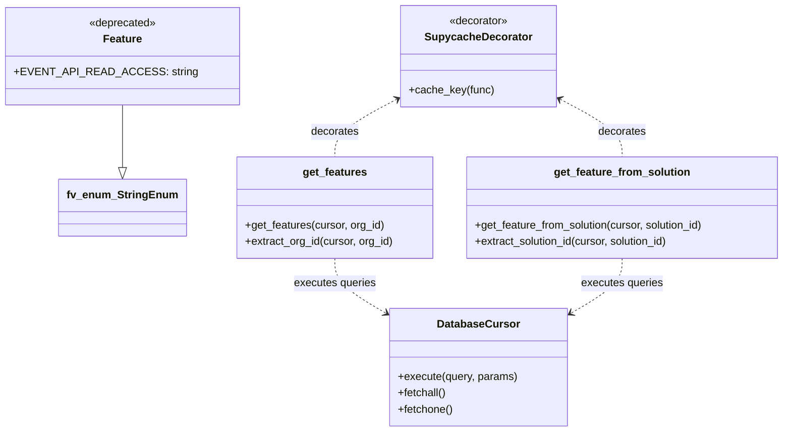

# Diagram: common/fv/python/fv/db/features.py

> Auto-generated by Obscura crawlers

## Mermaid

### SVG

<svg id="container" width="1137.30078125" xmlns="http://www.w3.org/2000/svg" class="classDiagram" height="638" viewBox="0 0 1137.30078125 638" role="graphics-document document" aria-roledescription="class"><g><defs><marker id="container_class-aggregationStart" class="marker aggregation class" refX="18" refY="7" markerWidth="190" markerHeight="240" orient="auto"><path d="M 18,7 L9,13 L1,7 L9,1 Z"></path></marker></defs><defs><marker id="container_class-aggregationEnd" class="marker aggregation class" refX="1" refY="7" markerWidth="20" markerHeight="28" orient="auto"><path d="M 18,7 L9,13 L1,7 L9,1 Z"></path></marker></defs><defs><marker id="container_class-extensionStart" class="marker extension class" refX="18" refY="7" markerWidth="190" markerHeight="240" orient="auto"><path d="M 1,7 L18,13 V 1 Z"></path></marker></defs><defs><marker id="container_class-extensionEnd" class="marker extension class" refX="1" refY="7" markerWidth="20" markerHeight="28" orient="auto"><path d="M 1,1 V 13 L18,7 Z"></path></marker></defs><defs><marker id="container_class-compositionStart" class="marker composition class" refX="18" refY="7" markerWidth="190" markerHeight="240" orient="auto"><path d="M 18,7 L9,13 L1,7 L9,1 Z"></path></marker></defs><defs><marker id="container_class-compositionEnd" class="marker composition class" refX="1" refY="7" markerWidth="20" markerHeight="28" orient="auto"><path d="M 18,7 L9,13 L1,7 L9,1 Z"></path></marker></defs><defs><marker id="container_class-dependencyStart" class="marker dependency class" refX="6" refY="7" markerWidth="190" markerHeight="240" orient="auto"><path d="M 5,7 L9,13 L1,7 L9,1 Z"></path></marker></defs><defs><marker id="container_class-dependencyEnd" class="marker dependency class" refX="13" refY="7" markerWidth="20" markerHeight="28" orient="auto"><path d="M 18,7 L9,13 L14,7 L9,1 Z"></path></marker></defs><defs><marker id="container_class-lollipopStart" class="marker lollipop class" refX="13" refY="7" markerWidth="190" markerHeight="240" orient="auto"><circle stroke="black" fill="transparent" cx="7" cy="7" r="6"></circle></marker></defs><defs><marker id="container_class-lollipopEnd" class="marker lollipop class" refX="1" refY="7" markerWidth="190" markerHeight="240" orient="auto"><circle stroke="black" fill="transparent" cx="7" cy="7" r="6"></circle></marker></defs><g class="root"><g class="clusters"></g><g class="edgePaths"><path d="M164.84,155L164.84,161.667C164.84,168.333,164.84,181.667,164.84,197.125C164.84,212.583,164.84,230.167,164.84,238.958L164.84,247.75" id="id_Feature_fv_enum_StringEnum_1" class="edge-thickness-normal edge-pattern-solid relation" style=";;;" data-edge="true" data-et="edge" data-id="id_Feature_fv_enum_StringEnum_1" data-points="W3sieCI6MTY0LjgzOTg0Mzc1LCJ5IjoxNTV9LHsieCI6MTY0LjgzOTg0Mzc1LCJ5IjoxOTV9LHsieCI6MTY0LjgzOTg0Mzc1LCJ5IjoyNjV9XQ==" marker-end="url(#container_class-extensionEnd)"></path><path d="M564.005,144.141L547.767,152.617C531.528,161.094,499.051,178.047,482.813,192.69C466.574,207.333,466.574,219.667,466.574,225.833L466.574,232" id="id_SupycacheDecorator_get_features_2" class="edge-thickness-normal edge-pattern-dashed relation" style=";;;" data-edge="true" data-et="edge" data-id="id_SupycacheDecorator_get_features_2" data-points="W3sieCI6NTY5LjMyNDIxODc1LCJ5IjoxNDEuMzY0MzAxNzA5NTQxNzZ9LHsieCI6NDY2LjU3NDIxODc1LCJ5IjoxOTV9LHsieCI6NDY2LjU3NDIxODc1LCJ5IjoyMzJ9XQ==" marker-start="url(#container_class-dependencyStart)"></path><path d="M798.26,144.141L814.499,152.617C830.737,161.094,863.214,178.047,879.453,192.69C895.691,207.333,895.691,219.667,895.691,225.833L895.691,232" id="id_SupycacheDecorator_get_feature_from_solution_3" class="edge-thickness-normal edge-pattern-dashed relation" style=";;;" data-edge="true" data-et="edge" data-id="id_SupycacheDecorator_get_feature_from_solution_3" data-points="W3sieCI6NzkyLjk0MTQwNjI1LCJ5IjoxNDEuMzY0MzAxNzA5NTQxNzZ9LHsieCI6ODk1LjY5MTQwNjI1LCJ5IjoxOTV9LHsieCI6ODk1LjY5MTQwNjI1LCJ5IjoyMzJ9XQ==" marker-start="url(#container_class-dependencyStart)"></path><path d="M466.574,382L466.574,388.167C466.574,394.333,466.574,406.667,479.881,420.524C493.188,434.381,519.801,449.761,533.108,457.452L546.415,465.142" id="id_get_features_DatabaseCursor_4" class="edge-thickness-normal edge-pattern-dashed relation" style=";;;" data-edge="true" data-et="edge" data-id="id_get_features_DatabaseCursor_4" data-points="W3sieCI6NDY2LjU3NDIxODc1LCJ5IjozODJ9LHsieCI6NDY2LjU3NDIxODc1LCJ5Ijo0MTl9LHsieCI6NTUxLjYwOTM3NSwieSI6NDY4LjE0NDQyODA1OTA2MDJ9XQ==" marker-end="url(#container_class-dependencyEnd)"></path><path d="M895.691,382L895.691,388.167C895.691,394.333,895.691,406.667,882.385,420.524C869.078,434.381,842.465,449.761,829.158,457.452L815.851,465.142" id="id_get_feature_from_solution_DatabaseCursor_5" class="edge-thickness-normal edge-pattern-dashed relation" style=";;;" data-edge="true" data-et="edge" data-id="id_get_feature_from_solution_DatabaseCursor_5" data-points="W3sieCI6ODk1LjY5MTQwNjI1LCJ5IjozODJ9LHsieCI6ODk1LjY5MTQwNjI1LCJ5Ijo0MTl9LHsieCI6ODEwLjY1NjI1LCJ5Ijo0NjguMTQ0NDI4MDU5MDYwMn1d" marker-end="url(#container_class-dependencyEnd)"></path></g><g class="edgeLabels"><g class="edgeLabel"><g class="label" data-id="id_Feature_fv_enum_StringEnum_1" transform="translate(0, 0)"><foreignObject width="0" height="0">

</foreignObject></g></g><g class="edgeLabel" transform="translate(466.57421875, 195)"><g class="label" data-id="id_SupycacheDecorator_get_features_2" transform="translate(-35.5078125, -12)"><foreignObject width="71.015625" height="24">

decorates

</foreignObject></g></g><g class="edgeLabel" transform="translate(895.69140625, 195)"><g class="label" data-id="id_SupycacheDecorator_get_feature_from_solution_3" transform="translate(-35.5078125, -12)"><foreignObject width="71.015625" height="24">

decorates

</foreignObject></g></g><g class="edgeLabel" transform="translate(466.57421875, 419)"><g class="label" data-id="id_get_features_DatabaseCursor_4" transform="translate(-61.0859375, -12)"><foreignObject width="122.171875" height="24">

executes queries

</foreignObject></g></g><g class="edgeLabel" transform="translate(895.69140625, 419)"><g class="label" data-id="id_get_feature_from_solution_DatabaseCursor_5" transform="translate(-61.0859375, -12)"><foreignObject width="122.171875" height="24">

executes queries

</foreignObject></g></g></g><g class="nodes"><g class="node default" id="classId-Feature-0" transform="translate(164.83984375, 83)"><g class="basic label-container"><path d="M-156.83984375 -72 L156.83984375 -72 L156.83984375 72 L-156.83984375 72" stroke="none" stroke-width="0" fill="#ECECFF" style=""></path><path d="M-156.83984375 -72 C-61.484443039598744 -72, 33.87095767080251 -72, 156.83984375 -72 M-156.83984375 -72 C-38.1173036861949 -72, 80.6052363776102 -72, 156.83984375 -72 M156.83984375 -72 C156.83984375 -20.596070268254294, 156.83984375 30.80785946349141, 156.83984375 72 M156.83984375 -72 C156.83984375 -32.60388550971612, 156.83984375 6.7922289805677565, 156.83984375 72 M156.83984375 72 C52.52574254996905 72, -51.788358650061895 72, -156.83984375 72 M156.83984375 72 C61.764458449201015 72, -33.31092685159797 72, -156.83984375 72 M-156.83984375 72 C-156.83984375 19.55097228028653, -156.83984375 -32.89805543942694, -156.83984375 -72 M-156.83984375 72 C-156.83984375 26.98526943685235, -156.83984375 -18.029461126295303, -156.83984375 -72" stroke="#9370DB" stroke-width="1.3" fill="none" stroke-dasharray="0 0" style=""></path></g><g class="annotation-group text" transform="translate(-50.0859375, -48)"><g class="label" style="" transform="translate(0,-12)"><foreignObject width="100.171875" height="24">

«deprecated»

</foreignObject></g></g><g class="label-group text" transform="translate(-27.390625, -24)"><g class="label" style="font-weight: bolder" transform="translate(0,-12)"><foreignObject width="54.78125" height="24">

Feature

</foreignObject></g></g><g class="members-group text" transform="translate(-144.83984375, 24)"><g class="label" style="" transform="translate(0,-12)"><foreignObject width="239.59375" height="24">

+EVENT_API_READ_ACCESS: string

</foreignObject></g></g><g class="methods-group text" transform="translate(-144.83984375, 72)"></g><g class="divider" style=""><path d="M-156.83984375 0 C-73.24870167182524 0, 10.34244040634951 0, 156.83984375 0 M-156.83984375 0 C-41.42262440740821 0, 73.99459493518358 0, 156.83984375 0" stroke="#9370DB" stroke-width="1.3" fill="none" stroke-dasharray="0 0" style=""></path></g><g class="divider" style=""><path d="M-156.83984375 48 C-90.22574327435633 48, -23.611642798712666 48, 156.83984375 48 M-156.83984375 48 C-68.13430633825841 48, 20.571231073483176 48, 156.83984375 48" stroke="#9370DB" stroke-width="1.3" fill="none" stroke-dasharray="0 0" style=""></path></g></g><g class="node default" id="classId-fv_enum_StringEnum-1" transform="translate(164.83984375, 307)"><g class="basic label-container"><path d="M-89.3125 -42 L89.3125 -42 L89.3125 42 L-89.3125 42" stroke="none" stroke-width="0" fill="#ECECFF" style=""></path><path d="M-89.3125 -42 C-27.20357163192834 -42, 34.90535673614332 -42, 89.3125 -42 M-89.3125 -42 C-36.10863075039488 -42, 17.09523849921024 -42, 89.3125 -42 M89.3125 -42 C89.3125 -10.538250278103558, 89.3125 20.923499443792885, 89.3125 42 M89.3125 -42 C89.3125 -14.556053164439593, 89.3125 12.887893671120814, 89.3125 42 M89.3125 42 C38.64497663148252 42, -12.022546737034958 42, -89.3125 42 M89.3125 42 C26.929024804377597 42, -35.454450391244805 42, -89.3125 42 M-89.3125 42 C-89.3125 15.255560880430465, -89.3125 -11.48887823913907, -89.3125 -42 M-89.3125 42 C-89.3125 14.168430669040191, -89.3125 -13.663138661919618, -89.3125 -42" stroke="#9370DB" stroke-width="1.3" fill="none" stroke-dasharray="0 0" style=""></path></g><g class="annotation-group text" transform="translate(0, -18)"></g><g class="label-group text" transform="translate(-77.3125, -18)"><g class="label" style="font-weight: bolder" transform="translate(0,-12)"><foreignObject width="154.625" height="24">

fv_enum_StringEnum

</foreignObject></g></g><g class="members-group text" transform="translate(-77.3125, 30)"></g><g class="methods-group text" transform="translate(-77.3125, 60)"></g><g class="divider" style=""><path d="M-89.3125 6 C-53.35847105765989 6, -17.40444211531978 6, 89.3125 6 M-89.3125 6 C-44.72200316369076 6, -0.13150632738151558 6, 89.3125 6" stroke="#9370DB" stroke-width="1.3" fill="none" stroke-dasharray="0 0" style=""></path></g><g class="divider" style=""><path d="M-89.3125 24 C-32.68366272881813 24, 23.945174542363745 24, 89.3125 24 M-89.3125 24 C-24.927802526184095 24, 39.45689494763181 24, 89.3125 24" stroke="#9370DB" stroke-width="1.3" fill="none" stroke-dasharray="0 0" style=""></path></g></g><g class="node default" id="classId-SupycacheDecorator-2" transform="translate(681.1328125, 83)"><g class="basic label-container"><path d="M-111.80859375 -75 L111.80859375 -75 L111.80859375 75 L-111.80859375 75" stroke="none" stroke-width="0" fill="#ECECFF" style=""></path><path d="M-111.80859375 -75 C-37.190119497289544 -75, 37.42835475542091 -75, 111.80859375 -75 M-111.80859375 -75 C-62.82958599902744 -75, -13.850578248054873 -75, 111.80859375 -75 M111.80859375 -75 C111.80859375 -23.893793698364377, 111.80859375 27.212412603271247, 111.80859375 75 M111.80859375 -75 C111.80859375 -35.432766813217064, 111.80859375 4.134466373565871, 111.80859375 75 M111.80859375 75 C52.312573789712154 75, -7.183446170575692 75, -111.80859375 75 M111.80859375 75 C32.394869019902 75, -47.01885571019599 75, -111.80859375 75 M-111.80859375 75 C-111.80859375 37.86777720991695, -111.80859375 0.7355544198339032, -111.80859375 -75 M-111.80859375 75 C-111.80859375 31.78192288531463, -111.80859375 -11.436154229370743, -111.80859375 -75" stroke="#9370DB" stroke-width="1.3" fill="none" stroke-dasharray="0 0" style=""></path></g><g class="annotation-group text" transform="translate(-44.0625, -51)"><g class="label" style="" transform="translate(0,-12)"><foreignObject width="88.125" height="24">

«decorator»

</foreignObject></g></g><g class="label-group text" transform="translate(-75.0546875, -27)"><g class="label" style="font-weight: bolder" transform="translate(0,-12)"><foreignObject width="150.109375" height="24">

SupycacheDecorator

</foreignObject></g></g><g class="members-group text" transform="translate(-99.80859375, 21)"></g><g class="methods-group text" transform="translate(-99.80859375, 51)"><g class="label" style="" transform="translate(0,-12)"><foreignObject width="124.5625" height="24">

+cache_key(func)

</foreignObject></g></g><g class="divider" style=""><path d="M-111.80859375 -3 C-41.12048496760222 -3, 29.567623814795553 -3, 111.80859375 -3 M-111.80859375 -3 C-35.83423301195525 -3, 40.1401277260895 -3, 111.80859375 -3" stroke="#9370DB" stroke-width="1.3" fill="none" stroke-dasharray="0 0" style=""></path></g><g class="divider" style=""><path d="M-111.80859375 21 C-48.34727980770975 21, 15.114034134580507 21, 111.80859375 21 M-111.80859375 21 C-48.39910301829486 21, 15.010387713410282 21, 111.80859375 21" stroke="#9370DB" stroke-width="1.3" fill="none" stroke-dasharray="0 0" style=""></path></g></g><g class="node default" id="classId-get_features-3" transform="translate(466.57421875, 307)"><g class="basic label-container"><path d="M-145.5078125 -75 L145.5078125 -75 L145.5078125 75 L-145.5078125 75" stroke="none" stroke-width="0" fill="#ECECFF" style=""></path><path d="M-145.5078125 -75 C-69.00393945522896 -75, 7.499933589542081 -75, 145.5078125 -75 M-145.5078125 -75 C-39.11224232024449 -75, 67.28332785951102 -75, 145.5078125 -75 M145.5078125 -75 C145.5078125 -19.93955653629132, 145.5078125 35.12088692741736, 145.5078125 75 M145.5078125 -75 C145.5078125 -26.749302637345203, 145.5078125 21.501394725309595, 145.5078125 75 M145.5078125 75 C71.35425252364341 75, -2.7993074527131796 75, -145.5078125 75 M145.5078125 75 C48.60695894849228 75, -48.293894603015445 75, -145.5078125 75 M-145.5078125 75 C-145.5078125 41.771588604559064, -145.5078125 8.543177209118127, -145.5078125 -75 M-145.5078125 75 C-145.5078125 26.27501371034341, -145.5078125 -22.449972579313183, -145.5078125 -75" stroke="#9370DB" stroke-width="1.3" fill="none" stroke-dasharray="0 0" style=""></path></g><g class="annotation-group text" transform="translate(0, -51)"></g><g class="label-group text" transform="translate(-46.140625, -51)"><g class="label" style="font-weight: bolder" transform="translate(0,-12)"><foreignObject width="92.28125" height="24">

get_features

</foreignObject></g></g><g class="members-group text" transform="translate(-133.5078125, -3)"></g><g class="methods-group text" transform="translate(-133.5078125, 27)"><g class="label" style="" transform="translate(0,-12)"><foreignObject width="206.953125" height="24">

+get_features(cursor, org_id)

</foreignObject></g><g class="label" style="" transform="translate(0,12)"><foreignObject width="220.875" height="24">

+extract_org_id(cursor, org_id)

</foreignObject></g></g><g class="divider" style=""><path d="M-145.5078125 -27 C-85.3738721681473 -27, -25.239931836294616 -27, 145.5078125 -27 M-145.5078125 -27 C-82.41578231447141 -27, -19.32375212894283 -27, 145.5078125 -27" stroke="#9370DB" stroke-width="1.3" fill="none" stroke-dasharray="0 0" style=""></path></g><g class="divider" style=""><path d="M-145.5078125 -3 C-49.48364234915884 -3, 46.540527801682316 -3, 145.5078125 -3 M-145.5078125 -3 C-37.458632993473884 -3, 70.59054651305223 -3, 145.5078125 -3" stroke="#9370DB" stroke-width="1.3" fill="none" stroke-dasharray="0 0" style=""></path></g></g><g class="node default" id="classId-get_feature_from_solution-4" transform="translate(895.69140625, 307)"><g class="basic label-container"><path d="M-233.609375 -75 L233.609375 -75 L233.609375 75 L-233.609375 75" stroke="none" stroke-width="0" fill="#ECECFF" style=""></path><path d="M-233.609375 -75 C-106.00941291579775 -75, 21.590549168404493 -75, 233.609375 -75 M-233.609375 -75 C-64.05024263007357 -75, 105.50888973985286 -75, 233.609375 -75 M233.609375 -75 C233.609375 -24.573248586638982, 233.609375 25.853502826722035, 233.609375 75 M233.609375 -75 C233.609375 -27.315077484041872, 233.609375 20.369845031916256, 233.609375 75 M233.609375 75 C63.66748640570478 75, -106.27440218859044 75, -233.609375 75 M233.609375 75 C48.71564496849922 75, -136.17808506300156 75, -233.609375 75 M-233.609375 75 C-233.609375 38.23060256821802, -233.609375 1.4612051364360354, -233.609375 -75 M-233.609375 75 C-233.609375 23.767900254826486, -233.609375 -27.464199490347028, -233.609375 -75" stroke="#9370DB" stroke-width="1.3" fill="none" stroke-dasharray="0 0" style=""></path></g><g class="annotation-group text" transform="translate(0, -51)"></g><g class="label-group text" transform="translate(-97.640625, -51)"><g class="label" style="font-weight: bolder" transform="translate(0,-12)"><foreignObject width="195.28125" height="24">

get_feature_from_solution

</foreignObject></g></g><g class="members-group text" transform="translate(-221.609375, -3)"></g><g class="methods-group text" transform="translate(-221.609375, 27)"><g class="label" style="" transform="translate(0,-12)"><foreignObject width="345.578125" height="24">

+get_feature_from_solution(cursor, solution_id)

</foreignObject></g><g class="label" style="" transform="translate(0,12)"><foreignObject width="293.515625" height="24">

+extract_solution_id(cursor, solution_id)

</foreignObject></g></g><g class="divider" style=""><path d="M-233.609375 -27 C-137.14082894785213 -27, -40.67228289570423 -27, 233.609375 -27 M-233.609375 -27 C-74.64738537663618 -27, 84.31460424672764 -27, 233.609375 -27" stroke="#9370DB" stroke-width="1.3" fill="none" stroke-dasharray="0 0" style=""></path></g><g class="divider" style=""><path d="M-233.609375 -3 C-48.83455084918282 -3, 135.94027330163436 -3, 233.609375 -3 M-233.609375 -3 C-117.91874093589902 -3, -2.2281068717980475 -3, 233.609375 -3" stroke="#9370DB" stroke-width="1.3" fill="none" stroke-dasharray="0 0" style=""></path></g></g><g class="node default" id="classId-DatabaseCursor-5" transform="translate(681.1328125, 543)"><g class="basic label-container"><path d="M-129.5234375 -87 L129.5234375 -87 L129.5234375 87 L-129.5234375 87" stroke="none" stroke-width="0" fill="#ECECFF" style=""></path><path d="M-129.5234375 -87 C-56.08725660984143 -87, 17.348924280317135 -87, 129.5234375 -87 M-129.5234375 -87 C-32.139942049644034 -87, 65.24355340071193 -87, 129.5234375 -87 M129.5234375 -87 C129.5234375 -21.052844912643664, 129.5234375 44.89431017471267, 129.5234375 87 M129.5234375 -87 C129.5234375 -30.106511343534116, 129.5234375 26.786977312931768, 129.5234375 87 M129.5234375 87 C56.84346420972442 87, -15.836509080551167 87, -129.5234375 87 M129.5234375 87 C74.01070691053121 87, 18.497976321062424 87, -129.5234375 87 M-129.5234375 87 C-129.5234375 44.586049219262705, -129.5234375 2.17209843852541, -129.5234375 -87 M-129.5234375 87 C-129.5234375 18.609781645994914, -129.5234375 -49.78043670801017, -129.5234375 -87" stroke="#9370DB" stroke-width="1.3" fill="none" stroke-dasharray="0 0" style=""></path></g><g class="annotation-group text" transform="translate(0, -63)"></g><g class="label-group text" transform="translate(-58.078125, -63)"><g class="label" style="font-weight: bolder" transform="translate(0,-12)"><foreignObject width="116.15625" height="24">

DatabaseCursor

</foreignObject></g></g><g class="members-group text" transform="translate(-117.5234375, -15)"></g><g class="methods-group text" transform="translate(-117.5234375, 15)"><g class="label" style="" transform="translate(0,-12)"><foreignObject width="176.96875" height="24">

+execute(query, params)

</foreignObject></g><g class="label" style="" transform="translate(0,12)"><foreignObject width="72.515625" height="24">

+fetchall()

</foreignObject></g><g class="label" style="" transform="translate(0,36)"><foreignObject width="82.046875" height="24">

+fetchone()

</foreignObject></g></g><g class="divider" style=""><path d="M-129.5234375 -39 C-65.66382717541885 -39, -1.8042168508376761 -39, 129.5234375 -39 M-129.5234375 -39 C-55.12547706844468 -39, 19.272483363110638 -39, 129.5234375 -39" stroke="#9370DB" stroke-width="1.3" fill="none" stroke-dasharray="0 0" style=""></path></g><g class="divider" style=""><path d="M-129.5234375 -15 C-76.1332337914939 -15, -22.7430300829878 -15, 129.5234375 -15 M-129.5234375 -15 C-51.61600568846194 -15, 26.29142612307612 -15, 129.5234375 -15" stroke="#9370DB" stroke-width="1.3" fill="none" stroke-dasharray="0 0" style=""></path></g></g></g></g></g></svg>
