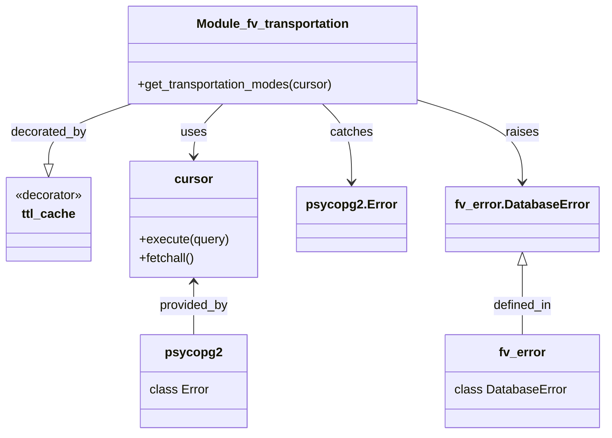

# Diagram: common/fv/python/fv/db/transportation_mode.py


> Auto-generated by Obscura crawlers

## Diagram 1

```mermaid
flowchart TD
    A[Call: get_transportation_modes(cursor)] --> B[ttl_cache wrapper (ttl=86400)]
    B --> C{try}
    C --> D[cursor.execute("SELECT id, name FROM transportation_mode ORDER BY id")]
    D --> E[rows = cursor.fetchall()]
    E --> F[return rows]
    C -->|psycopg2.Error| G[except psycopg2.Error as e]
    G --> H[tb = sys.exc_info()[2]]
    H --> I[fv.error.DatabaseError(...) raised with traceback]
    I --> J[propagates to caller]
```

> SVG rendering failed for this diagram.

## Diagram 2



### SVG

<svg id="container" width="766.84375" xmlns="http://www.w3.org/2000/svg" class="classDiagram" height="560" viewBox="0 0 766.84375 560" role="graphics-document document" aria-roledescription="class"><style>#container{font-family:"trebuchet ms",verdana,arial,sans-serif;font-size:16px;fill:#333;}@keyframes edge-animation-frame{from{stroke-dashoffset:0;}}@keyframes dash{to{stroke-dashoffset:0;}}#container .edge-animation-slow{stroke-dasharray:9,5!important;stroke-dashoffset:900;animation:dash 50s linear infinite;stroke-linecap:round;}#container .edge-animation-fast{stroke-dasharray:9,5!important;stroke-dashoffset:900;animation:dash 20s linear infinite;stroke-linecap:round;}#container .error-icon{fill:#552222;}#container .error-text{fill:#552222;stroke:#552222;}#container .edge-thickness-normal{stroke-width:1px;}#container .edge-thickness-thick{stroke-width:3.5px;}#container .edge-pattern-solid{stroke-dasharray:0;}#container .edge-thickness-invisible{stroke-width:0;fill:none;}#container .edge-pattern-dashed{stroke-dasharray:3;}#container .edge-pattern-dotted{stroke-dasharray:2;}#container .marker{fill:#333333;stroke:#333333;}#container .marker.cross{stroke:#333333;}#container svg{font-family:"trebuchet ms",verdana,arial,sans-serif;font-size:16px;}#container p{margin:0;}#container g.classGroup text{fill:#9370DB;stroke:none;font-family:"trebuchet ms",verdana,arial,sans-serif;font-size:10px;}#container g.classGroup text .title{font-weight:bolder;}#container .nodeLabel,#container .edgeLabel{color:#131300;}#container .edgeLabel .label rect{fill:#ECECFF;}#container .label text{fill:#131300;}#container .labelBkg{background:#ECECFF;}#container .edgeLabel .label span{background:#ECECFF;}#container .classTitle{font-weight:bolder;}#container .node rect,#container .node circle,#container .node ellipse,#container .node polygon,#container .node path{fill:#ECECFF;stroke:#9370DB;stroke-width:1px;}#container .divider{stroke:#9370DB;stroke-width:1;}#container g.clickable{cursor:pointer;}#container g.classGroup rect{fill:#ECECFF;stroke:#9370DB;}#container g.classGroup line{stroke:#9370DB;stroke-width:1;}#container .classLabel .box{stroke:none;stroke-width:0;fill:#ECECFF;opacity:0.5;}#container .classLabel .label{fill:#9370DB;font-size:10px;}#container .relation{stroke:#333333;stroke-width:1;fill:none;}#container .dashed-line{stroke-dasharray:3;}#container .dotted-line{stroke-dasharray:1 2;}#container #compositionStart,#container .composition{fill:#333333!important;stroke:#333333!important;stroke-width:1;}#container #compositionEnd,#container .composition{fill:#333333!important;stroke:#333333!important;stroke-width:1;}#container #dependencyStart,#container .dependency{fill:#333333!important;stroke:#333333!important;stroke-width:1;}#container #dependencyStart,#container .dependency{fill:#333333!important;stroke:#333333!important;stroke-width:1;}#container #extensionStart,#container .extension{fill:transparent!important;stroke:#333333!important;stroke-width:1;}#container #extensionEnd,#container .extension{fill:transparent!important;stroke:#333333!important;stroke-width:1;}#container #aggregationStart,#container .aggregation{fill:transparent!important;stroke:#333333!important;stroke-width:1;}#container #aggregationEnd,#container .aggregation{fill:transparent!important;stroke:#333333!important;stroke-width:1;}#container #lollipopStart,#container .lollipop{fill:#ECECFF!important;stroke:#333333!important;stroke-width:1;}#container #lollipopEnd,#container .lollipop{fill:#ECECFF!important;stroke:#333333!important;stroke-width:1;}#container .edgeTerminals{font-size:11px;line-height:initial;}#container .classTitleText{text-anchor:middle;font-size:18px;fill:#333;}#container .label-icon{display:inline-block;height:1em;overflow:visible;vertical-align:-0.125em;}#container .node .label-icon path{fill:currentColor;stroke:revert;stroke-width:revert;}#container :root{--mermaid-font-family:"trebuchet ms",verdana,arial,sans-serif;}</style><g><defs><marker id="container_class-aggregationStart" class="marker aggregation class" refX="18" refY="7" markerWidth="190" markerHeight="240" orient="auto"><path d="M 18,7 L9,13 L1,7 L9,1 Z"></path></marker></defs><defs><marker id="container_class-aggregationEnd" class="marker aggregation class" refX="1" refY="7" markerWidth="20" markerHeight="28" orient="auto"><path d="M 18,7 L9,13 L1,7 L9,1 Z"></path></marker></defs><defs><marker id="container_class-extensionStart" class="marker extension class" refX="18" refY="7" markerWidth="190" markerHeight="240" orient="auto"><path d="M 1,7 L18,13 V 1 Z"></path></marker></defs><defs><marker id="container_class-extensionEnd" class="marker extension class" refX="1" refY="7" markerWidth="20" markerHeight="28" orient="auto"><path d="M 1,1 V 13 L18,7 Z"></path></marker></defs><defs><marker id="container_class-compositionStart" class="marker composition class" refX="18" refY="7" markerWidth="190" markerHeight="240" orient="auto"><path d="M 18,7 L9,13 L1,7 L9,1 Z"></path></marker></defs><defs><marker id="container_class-compositionEnd" class="marker composition class" refX="1" refY="7" markerWidth="20" markerHeight="28" orient="auto"><path d="M 18,7 L9,13 L1,7 L9,1 Z"></path></marker></defs><defs><marker id="container_class-dependencyStart" class="marker dependency class" refX="6" refY="7" markerWidth="190" markerHeight="240" orient="auto"><path d="M 5,7 L9,13 L1,7 L9,1 Z"></path></marker></defs><defs><marker id="container_class-dependencyEnd" class="marker dependency class" refX="13" refY="7" markerWidth="20" markerHeight="28" orient="auto"><path d="M 18,7 L9,13 L14,7 L9,1 Z"></path></marker></defs><defs><marker id="container_class-lollipopStart" class="marker lollipop class" refX="13" refY="7" markerWidth="190" markerHeight="240" orient="auto"><circle stroke="black" fill="transparent" cx="7" cy="7" r="6"></circle></marker></defs><defs><marker id="container_class-lollipopEnd" class="marker lollipop class" refX="1" refY="7" markerWidth="190" markerHeight="240" orient="auto"><circle stroke="black" fill="transparent" cx="7" cy="7" r="6"></circle></marker></defs><g class="root"><g class="clusters"></g><g class="edgePaths"><path d="M170.105,134L152.431,140.167C134.758,146.333,99.41,158.667,81.736,171.625C64.063,184.583,64.063,198.167,64.063,204.958L64.063,211.75" id="id_Module_fv_transportation_ttl_cache_1" class="edge-thickness-normal edge-pattern-solid relation" style=";;;" data-edge="true" data-et="edge" data-id="id_Module_fv_transportation_ttl_cache_1" data-points="W3sieCI6MTcwLjEwNTA3ODEyNSwieSI6MTM0fSx7IngiOjY0LjA2MjUsInkiOjE3MX0seyJ4Ijo2NC4wNjI1LCJ5IjoyMjl9XQ==" marker-end="url(#container_class-extensionEnd)"></path><path d="M288.319,134L282.216,140.167C276.113,146.333,263.908,158.667,257.806,170C251.703,181.333,251.703,191.667,251.703,196.833L251.703,202" id="id_Module_fv_transportation_cursor_2" class="edge-thickness-normal edge-pattern-solid relation" style=";;;" data-edge="true" data-et="edge" data-id="id_Module_fv_transportation_cursor_2" data-points="W3sieCI6Mjg4LjMxODY3MTg3NSwieSI6MTM0fSx7IngiOjI1MS43MDMxMjUsInkiOjE3MX0seyJ4IjoyNTEuNzAzMTI1LCJ5IjoyMDh9XQ==" marker-end="url(#container_class-dependencyEnd)"></path><path d="M413.009,134L419.112,140.167C425.215,146.333,437.42,158.667,443.522,175.5C449.625,192.333,449.625,213.667,449.625,224.333L449.625,235" id="id_Module_fv_transportation_psycopg2.Error_3" class="edge-thickness-normal edge-pattern-solid relation" style=";;;" data-edge="true" data-et="edge" data-id="id_Module_fv_transportation_psycopg2.Error_3" data-points="W3sieCI6NDEzLjAwOTQ1MzEyNSwieSI6MTM0fSx7IngiOjQ0OS42MjUsInkiOjE3MX0seyJ4Ijo0NDkuNjI1LCJ5IjoyNDF9XQ==" marker-end="url(#container_class-dependencyEnd)"></path><path d="M538.82,131.671L559.148,138.226C579.477,144.781,620.133,157.89,640.461,175.112C660.789,192.333,660.789,213.667,660.789,224.333L660.789,235" id="id_Module_fv_transportation_fv_error.DatabaseError_4" class="edge-thickness-normal edge-pattern-solid relation" style=";;;" data-edge="true" data-et="edge" data-id="id_Module_fv_transportation_fv_error.DatabaseError_4" data-points="W3sieCI6NTM4LjgyMDMxMjUsInkiOjEzMS42NzExMDAzNjI3NTY5Nn0seyJ4Ijo2NjAuNzg5MDYyNSwieSI6MTcxfSx7IngiOjY2MC43ODkwNjI1LCJ5IjoyNDF9XQ==" marker-end="url(#container_class-dependencyEnd)"></path><path d="M251.703,364L251.703,369.167C251.703,374.333,251.703,384.667,251.703,396C251.703,407.333,251.703,419.667,251.703,425.833L251.703,432" id="id_cursor_psycopg2_5" class="edge-thickness-normal edge-pattern-solid relation" style=";;;" data-edge="true" data-et="edge" data-id="id_cursor_psycopg2_5" data-points="W3sieCI6MjUxLjcwMzEyNSwieSI6MzU4fSx7IngiOjI1MS43MDMxMjUsInkiOjM5NX0seyJ4IjoyNTEuNzAzMTI1LCJ5Ijo0MzJ9XQ==" marker-start="url(#container_class-dependencyStart)"></path><path d="M660.789,342.25L660.789,351.042C660.789,359.833,660.789,377.417,660.789,392.375C660.789,407.333,660.789,419.667,660.789,425.833L660.789,432" id="id_fv_error.DatabaseError_fv_error_6" class="edge-thickness-normal edge-pattern-solid relation" style=";;;" data-edge="true" data-et="edge" data-id="id_fv_error.DatabaseError_fv_error_6" data-points="W3sieCI6NjYwLjc4OTA2MjUsInkiOjMyNX0seyJ4Ijo2NjAuNzg5MDYyNSwieSI6Mzk1fSx7IngiOjY2MC43ODkwNjI1LCJ5Ijo0MzJ9XQ==" marker-start="url(#container_class-extensionStart)"></path></g><g class="edgeLabels"><g class="edgeLabel" transform="translate(64.0625, 171)"><g class="label" data-id="id_Module_fv_transportation_ttl_cache_1" transform="translate(-49.375, -12)"><foreignObject width="98.75" height="24"><div xmlns="http://www.w3.org/1999/xhtml" class="labelBkg" style="display: table-cell; white-space: nowrap; line-height: 1.5; max-width: 200px; text-align: center;"><span class="edgeLabel"><p>decorated_by</p></span></div></foreignObject></g></g><g class="edgeLabel" transform="translate(251.703125, 171)"><g class="label" data-id="id_Module_fv_transportation_cursor_2" transform="translate(-16.4921875, -12)"><foreignObject width="32.984375" height="24"><div xmlns="http://www.w3.org/1999/xhtml" class="labelBkg" style="display: table-cell; white-space: nowrap; line-height: 1.5; max-width: 200px; text-align: center;"><span class="edgeLabel"><p>uses</p></span></div></foreignObject></g></g><g class="edgeLabel" transform="translate(449.625, 171)"><g class="label" data-id="id_Module_fv_transportation_psycopg2.Error_3" transform="translate(-27.4765625, -12)"><foreignObject width="54.953125" height="24"><div xmlns="http://www.w3.org/1999/xhtml" class="labelBkg" style="display: table-cell; white-space: nowrap; line-height: 1.5; max-width: 200px; text-align: center;"><span class="edgeLabel"><p>catches</p></span></div></foreignObject></g></g><g class="edgeLabel" transform="translate(660.7890625, 171)"><g class="label" data-id="id_Module_fv_transportation_fv_error.DatabaseError_4" transform="translate(-21.25, -12)"><foreignObject width="42.5" height="24"><div xmlns="http://www.w3.org/1999/xhtml" class="labelBkg" style="display: table-cell; white-space: nowrap; line-height: 1.5; max-width: 200px; text-align: center;"><span class="edgeLabel"><p>raises</p></span></div></foreignObject></g></g><g class="edgeLabel" transform="translate(251.703125, 395)"><g class="label" data-id="id_cursor_psycopg2_5" transform="translate(-45.1796875, -12)"><foreignObject width="90.359375" height="24"><div xmlns="http://www.w3.org/1999/xhtml" class="labelBkg" style="display: table-cell; white-space: nowrap; line-height: 1.5; max-width: 200px; text-align: center;"><span class="edgeLabel"><p>provided_by</p></span></div></foreignObject></g></g><g class="edgeLabel" transform="translate(660.7890625, 395)"><g class="label" data-id="id_fv_error.DatabaseError_fv_error_6" transform="translate(-38.6875, -12)"><foreignObject width="77.375" height="24"><div xmlns="http://www.w3.org/1999/xhtml" class="labelBkg" style="display: table-cell; white-space: nowrap; line-height: 1.5; max-width: 200px; text-align: center;"><span class="edgeLabel"><p>defined_in</p></span></div></foreignObject></g></g></g><g class="nodes"><g class="node default" id="classId-Module_fv_transportation-0" transform="translate(350.6640625, 71)"><g class="basic label-container"><path d="M-188.15625 -63 L188.15625 -63 L188.15625 63 L-188.15625 63" stroke="none" stroke-width="0" fill="#ECECFF" style=""></path><path d="M-188.15625 -63 C-90.54796491289882 -63, 7.06032017420236 -63, 188.15625 -63 M-188.15625 -63 C-76.64746441701416 -63, 34.861321165971674 -63, 188.15625 -63 M188.15625 -63 C188.15625 -17.69325285115697, 188.15625 27.61349429768606, 188.15625 63 M188.15625 -63 C188.15625 -28.62934361473564, 188.15625 5.741312770528722, 188.15625 63 M188.15625 63 C50.504219635070996 63, -87.14781072985801 63, -188.15625 63 M188.15625 63 C64.11835401645227 63, -59.919541967095455 63, -188.15625 63 M-188.15625 63 C-188.15625 18.445537458707705, -188.15625 -26.10892508258459, -188.15625 -63 M-188.15625 63 C-188.15625 27.62049457932541, -188.15625 -7.7590108413491805, -188.15625 -63" stroke="#9370DB" stroke-width="1.3" fill="none" stroke-dasharray="0 0" style=""></path></g><g class="annotation-group text" transform="translate(0, -39)"></g><g class="label-group text" transform="translate(-95.1875, -39)"><g class="label" style="font-weight: bolder" transform="translate(0,-12)"><foreignObject width="190.375" height="24"><div xmlns="http://www.w3.org/1999/xhtml" style="display: table-cell; white-space: nowrap; line-height: 1.5; max-width: 238px; text-align: center;"><span class="nodeLabel markdown-node-label" style=""><p>Module_fv_transportation</p></span></div></foreignObject></g></g><g class="members-group text" transform="translate(-176.15625, 9)"></g><g class="methods-group text" transform="translate(-176.15625, 39)"><g class="label" style="" transform="translate(0,-12)"><foreignObject width="257.125" height="24"><div xmlns="http://www.w3.org/1999/xhtml" style="display: table-cell; white-space: nowrap; line-height: 1.5; max-width: 314px; text-align: center;"><span class="nodeLabel markdown-node-label" style=""><p>+get_transportation_modes(cursor)</p></span></div></foreignObject></g></g><g class="divider" style=""><path d="M-188.15625 -15 C-54.6384124288856 -15, 78.8794251422288 -15, 188.15625 -15 M-188.15625 -15 C-59.84392131083746 -15, 68.46840737832508 -15, 188.15625 -15" stroke="#9370DB" stroke-width="1.3" fill="none" stroke-dasharray="0 0" style=""></path></g><g class="divider" style=""><path d="M-188.15625 9 C-38.342238385424935 9, 111.47177322915013 9, 188.15625 9 M-188.15625 9 C-97.17022470024652 9, -6.184199400493043 9, 188.15625 9" stroke="#9370DB" stroke-width="1.3" fill="none" stroke-dasharray="0 0" style=""></path></g></g><g class="node default" id="classId-ttl_cache-1" transform="translate(64.0625, 283)"><g class="basic label-container"><path d="M-56.0625 -54 L56.0625 -54 L56.0625 54 L-56.0625 54" stroke="none" stroke-width="0" fill="#ECECFF" style=""></path><path d="M-56.0625 -54 C-15.197038878107342 -54, 25.668422243785315 -54, 56.0625 -54 M-56.0625 -54 C-33.31761519562946 -54, -10.572730391258922 -54, 56.0625 -54 M56.0625 -54 C56.0625 -23.74588769791489, 56.0625 6.508224604170223, 56.0625 54 M56.0625 -54 C56.0625 -25.755891279859437, 56.0625 2.488217440281126, 56.0625 54 M56.0625 54 C22.196505669455966 54, -11.669488661088067 54, -56.0625 54 M56.0625 54 C26.613534654543958 54, -2.8354306909120837 54, -56.0625 54 M-56.0625 54 C-56.0625 23.720438715448935, -56.0625 -6.559122569102129, -56.0625 -54 M-56.0625 54 C-56.0625 12.461602058266891, -56.0625 -29.076795883466218, -56.0625 -54" stroke="#9370DB" stroke-width="1.3" fill="none" stroke-dasharray="0 0" style=""></path></g><g class="annotation-group text" transform="translate(-44.0625, -30)"><g class="label" style="" transform="translate(0,-12)"><foreignObject width="88.125" height="24"><div xmlns="http://www.w3.org/1999/xhtml" style="display: table-cell; white-space: nowrap; line-height: 1.5; max-width: 138px; text-align: center;"><span class="nodeLabel markdown-node-label" style=""><p>«decorator»</p></span></div></foreignObject></g></g><g class="label-group text" transform="translate(-33.4765625, -6)"><g class="label" style="font-weight: bolder" transform="translate(0,-12)"><foreignObject width="66.953125" height="24"><div xmlns="http://www.w3.org/1999/xhtml" style="display: table-cell; white-space: nowrap; line-height: 1.5; max-width: 116px; text-align: center;"><span class="nodeLabel markdown-node-label" style=""><p>ttl_cache</p></span></div></foreignObject></g></g><g class="members-group text" transform="translate(-44.0625, 42)"></g><g class="methods-group text" transform="translate(-44.0625, 72)"></g><g class="divider" style=""><path d="M-56.0625 18 C-24.16857104637106 18, 7.72535790725788 18, 56.0625 18 M-56.0625 18 C-12.967997354641625 18, 30.12650529071675 18, 56.0625 18" stroke="#9370DB" stroke-width="1.3" fill="none" stroke-dasharray="0 0" style=""></path></g><g class="divider" style=""><path d="M-56.0625 36 C-23.605370576927015 36, 8.85175884614597 36, 56.0625 36 M-56.0625 36 C-31.51211371314393 36, -6.961727426287858 36, 56.0625 36" stroke="#9370DB" stroke-width="1.3" fill="none" stroke-dasharray="0 0" style=""></path></g></g><g class="node default" id="classId-psycopg2-2" transform="translate(251.703125, 492)"><g class="basic label-container"><path d="M-66.9296875 -60 L66.9296875 -60 L66.9296875 60 L-66.9296875 60" stroke="none" stroke-width="0" fill="#ECECFF" style=""></path><path d="M-66.9296875 -60 C-32.77148366355336 -60, 1.386720172893277 -60, 66.9296875 -60 M-66.9296875 -60 C-39.55424317682892 -60, -12.178798853657838 -60, 66.9296875 -60 M66.9296875 -60 C66.9296875 -25.75260131165787, 66.9296875 8.49479737668426, 66.9296875 60 M66.9296875 -60 C66.9296875 -15.3328184356467, 66.9296875 29.3343631287066, 66.9296875 60 M66.9296875 60 C15.699802975912249 60, -35.5300815481755 60, -66.9296875 60 M66.9296875 60 C39.03363897532701 60, 11.13759045065401 60, -66.9296875 60 M-66.9296875 60 C-66.9296875 23.78701878523232, -66.9296875 -12.42596242953536, -66.9296875 -60 M-66.9296875 60 C-66.9296875 27.9476904930289, -66.9296875 -4.104619013942198, -66.9296875 -60" stroke="#9370DB" stroke-width="1.3" fill="none" stroke-dasharray="0 0" style=""></path></g><g class="annotation-group text" transform="translate(0, -36)"></g><g class="label-group text" transform="translate(-34.234375, -36)"><g class="label" style="font-weight: bolder" transform="translate(0,-12)"><foreignObject width="68.46875" height="24"><div xmlns="http://www.w3.org/1999/xhtml" style="display: table-cell; white-space: nowrap; line-height: 1.5; max-width: 117px; text-align: center;"><span class="nodeLabel markdown-node-label" style=""><p>psycopg2</p></span></div></foreignObject></g></g><g class="members-group text" transform="translate(-54.9296875, 12)"><g class="label" style="" transform="translate(0,-12)"><foreignObject width="75.625" height="24"><div xmlns="http://www.w3.org/1999/xhtml" style="display: table-cell; white-space: nowrap; line-height: 1.5; max-width: 126px; text-align: center;"><span class="nodeLabel markdown-node-label" style=""><p>class Error</p></span></div></foreignObject></g></g><g class="methods-group text" transform="translate(-54.9296875, 60)"></g><g class="divider" style=""><path d="M-66.9296875 -12 C-30.729746487938094 -12, 5.470194524123812 -12, 66.9296875 -12 M-66.9296875 -12 C-36.52542825131721 -12, -6.121169002634417 -12, 66.9296875 -12" stroke="#9370DB" stroke-width="1.3" fill="none" stroke-dasharray="0 0" style=""></path></g><g class="divider" style=""><path d="M-66.9296875 36 C-15.061757055778322 36, 36.806173388443355 36, 66.9296875 36 M-66.9296875 36 C-32.139813368839576 36, 2.650060762320848 36, 66.9296875 36" stroke="#9370DB" stroke-width="1.3" fill="none" stroke-dasharray="0 0" style=""></path></g></g><g class="node default" id="classId-cursor-3" transform="translate(251.703125, 283)"><g class="basic label-container"><path d="M-81.578125 -75 L81.578125 -75 L81.578125 75 L-81.578125 75" stroke="none" stroke-width="0" fill="#ECECFF" style=""></path><path d="M-81.578125 -75 C-46.48986544995066 -75, -11.401605899901327 -75, 81.578125 -75 M-81.578125 -75 C-24.34811601589213 -75, 32.88189296821574 -75, 81.578125 -75 M81.578125 -75 C81.578125 -22.67120894306158, 81.578125 29.657582113876842, 81.578125 75 M81.578125 -75 C81.578125 -38.8502494765043, 81.578125 -2.700498953008605, 81.578125 75 M81.578125 75 C33.13803550702374 75, -15.302053985952526 75, -81.578125 75 M81.578125 75 C26.079485186210334 75, -29.41915462757933 75, -81.578125 75 M-81.578125 75 C-81.578125 25.801258079375536, -81.578125 -23.397483841248928, -81.578125 -75 M-81.578125 75 C-81.578125 18.902348403516648, -81.578125 -37.195303192966705, -81.578125 -75" stroke="#9370DB" stroke-width="1.3" fill="none" stroke-dasharray="0 0" style=""></path></g><g class="annotation-group text" transform="translate(0, -51)"></g><g class="label-group text" transform="translate(-23.1875, -51)"><g class="label" style="font-weight: bolder" transform="translate(0,-12)"><foreignObject width="46.375" height="24"><div xmlns="http://www.w3.org/1999/xhtml" style="display: table-cell; white-space: nowrap; line-height: 1.5; max-width: 97px; text-align: center;"><span class="nodeLabel markdown-node-label" style=""><p>cursor</p></span></div></foreignObject></g></g><g class="members-group text" transform="translate(-69.578125, -3)"></g><g class="methods-group text" transform="translate(-69.578125, 27)"><g class="label" style="" transform="translate(0,-12)"><foreignObject width="115.96875" height="24"><div xmlns="http://www.w3.org/1999/xhtml" style="display: table-cell; white-space: nowrap; line-height: 1.5; max-width: 173px; text-align: center;"><span class="nodeLabel markdown-node-label" style=""><p>+execute(query)</p></span></div></foreignObject></g><g class="label" style="" transform="translate(0,12)"><foreignObject width="72.515625" height="24"><div xmlns="http://www.w3.org/1999/xhtml" style="display: table-cell; white-space: nowrap; line-height: 1.5; max-width: 130px; text-align: center;"><span class="nodeLabel markdown-node-label" style=""><p>+fetchall()</p></span></div></foreignObject></g></g><g class="divider" style=""><path d="M-81.578125 -27 C-37.294672828515566 -27, 6.9887793429688685 -27, 81.578125 -27 M-81.578125 -27 C-48.03086688739659 -27, -14.483608774793183 -27, 81.578125 -27" stroke="#9370DB" stroke-width="1.3" fill="none" stroke-dasharray="0 0" style=""></path></g><g class="divider" style=""><path d="M-81.578125 -3 C-43.46355613820052 -3, -5.348987276401047 -3, 81.578125 -3 M-81.578125 -3 C-37.61867788429328 -3, 6.3407692314134465 -3, 81.578125 -3" stroke="#9370DB" stroke-width="1.3" fill="none" stroke-dasharray="0 0" style=""></path></g></g><g class="node default" id="classId-fv_error-4" transform="translate(660.7890625, 492)"><g class="basic label-container"><path d="M-98.0546875 -60 L98.0546875 -60 L98.0546875 60 L-98.0546875 60" stroke="none" stroke-width="0" fill="#ECECFF" style=""></path><path d="M-98.0546875 -60 C-38.00828322553754 -60, 22.03812104892492 -60, 98.0546875 -60 M-98.0546875 -60 C-32.80253702167764 -60, 32.44961345664473 -60, 98.0546875 -60 M98.0546875 -60 C98.0546875 -26.846188705646263, 98.0546875 6.307622588707474, 98.0546875 60 M98.0546875 -60 C98.0546875 -15.922804785048953, 98.0546875 28.154390429902094, 98.0546875 60 M98.0546875 60 C38.05374051570377 60, -21.947206468592455 60, -98.0546875 60 M98.0546875 60 C23.288218576782256 60, -51.47825034643549 60, -98.0546875 60 M-98.0546875 60 C-98.0546875 34.32645437460454, -98.0546875 8.652908749209075, -98.0546875 -60 M-98.0546875 60 C-98.0546875 29.55701559349519, -98.0546875 -0.8859688130096188, -98.0546875 -60" stroke="#9370DB" stroke-width="1.3" fill="none" stroke-dasharray="0 0" style=""></path></g><g class="annotation-group text" transform="translate(0, -36)"></g><g class="label-group text" transform="translate(-29.1875, -36)"><g class="label" style="font-weight: bolder" transform="translate(0,-12)"><foreignObject width="58.375" height="24"><div xmlns="http://www.w3.org/1999/xhtml" style="display: table-cell; white-space: nowrap; line-height: 1.5; max-width: 108px; text-align: center;"><span class="nodeLabel markdown-node-label" style=""><p>fv_error</p></span></div></foreignObject></g></g><g class="members-group text" transform="translate(-86.0546875, 12)"><g class="label" style="" transform="translate(0,-12)"><foreignObject width="142.921875" height="24"><div xmlns="http://www.w3.org/1999/xhtml" style="display: table-cell; white-space: nowrap; line-height: 1.5; max-width: 194px; text-align: center;"><span class="nodeLabel markdown-node-label" style=""><p>class DatabaseError</p></span></div></foreignObject></g></g><g class="methods-group text" transform="translate(-86.0546875, 60)"></g><g class="divider" style=""><path d="M-98.0546875 -12 C-42.52860343638589 -12, 12.997480627228214 -12, 98.0546875 -12 M-98.0546875 -12 C-57.54171919099607 -12, -17.02875088199214 -12, 98.0546875 -12" stroke="#9370DB" stroke-width="1.3" fill="none" stroke-dasharray="0 0" style=""></path></g><g class="divider" style=""><path d="M-98.0546875 36 C-43.316456506420224 36, 11.421774487159553 36, 98.0546875 36 M-98.0546875 36 C-55.24884008881809 36, -12.442992677636184 36, 98.0546875 36" stroke="#9370DB" stroke-width="1.3" fill="none" stroke-dasharray="0 0" style=""></path></g></g><g class="node default" id="classId-psycopg2.Error-5" transform="translate(449.625, 283)"><g class="basic label-container"><path d="M-66.34375 -42 L66.34375 -42 L66.34375 42 L-66.34375 42" stroke="none" stroke-width="0" fill="#ECECFF" style=""></path><path d="M-66.34375 -42 C-20.92133215939723 -42, 24.501085681205538 -42, 66.34375 -42 M-66.34375 -42 C-30.027150537397738 -42, 6.289448925204525 -42, 66.34375 -42 M66.34375 -42 C66.34375 -11.213058724880941, 66.34375 19.573882550238118, 66.34375 42 M66.34375 -42 C66.34375 -24.729263245322088, 66.34375 -7.458526490644175, 66.34375 42 M66.34375 42 C36.771418542977365 42, 7.19908708595473 42, -66.34375 42 M66.34375 42 C16.89207852480979 42, -32.55959295038042 42, -66.34375 42 M-66.34375 42 C-66.34375 13.30051480605404, -66.34375 -15.398970387891922, -66.34375 -42 M-66.34375 42 C-66.34375 22.906500642219815, -66.34375 3.813001284439629, -66.34375 -42" stroke="#9370DB" stroke-width="1.3" fill="none" stroke-dasharray="0 0" style=""></path></g><g class="annotation-group text" transform="translate(0, -18)"></g><g class="label-group text" transform="translate(-54.34375, -18)"><g class="label" style="font-weight: bolder" transform="translate(0,-12)"><foreignObject width="108.6875" height="24"><div xmlns="http://www.w3.org/1999/xhtml" style="display: table-cell; white-space: nowrap; line-height: 1.5; max-width: 157px; text-align: center;"><span class="nodeLabel markdown-node-label" style=""><p>psycopg2.Error</p></span></div></foreignObject></g></g><g class="members-group text" transform="translate(-54.34375, 30)"></g><g class="methods-group text" transform="translate(-54.34375, 60)"></g><g class="divider" style=""><path d="M-66.34375 6 C-28.150837542641618 6, 10.042074914716764 6, 66.34375 6 M-66.34375 6 C-38.604762642615846 6, -10.865775285231692 6, 66.34375 6" stroke="#9370DB" stroke-width="1.3" fill="none" stroke-dasharray="0 0" style=""></path></g><g class="divider" style=""><path d="M-66.34375 24 C-29.8105717684293 24, 6.722606463141403 24, 66.34375 24 M-66.34375 24 C-15.232332054999958 24, 35.879085890000084 24, 66.34375 24" stroke="#9370DB" stroke-width="1.3" fill="none" stroke-dasharray="0 0" style=""></path></g></g><g class="node default" id="classId-fv_error.DatabaseError-6" transform="translate(660.7890625, 283)"><g class="basic label-container"><path d="M-94.8203125 -42 L94.8203125 -42 L94.8203125 42 L-94.8203125 42" stroke="none" stroke-width="0" fill="#ECECFF" style=""></path><path d="M-94.8203125 -42 C-56.12727183334605 -42, -17.4342311666921 -42, 94.8203125 -42 M-94.8203125 -42 C-30.50780288312704 -42, 33.80470673374592 -42, 94.8203125 -42 M94.8203125 -42 C94.8203125 -13.475651401496275, 94.8203125 15.04869719700745, 94.8203125 42 M94.8203125 -42 C94.8203125 -12.027413963137455, 94.8203125 17.94517207372509, 94.8203125 42 M94.8203125 42 C24.915687207440442 42, -44.988938085119116 42, -94.8203125 42 M94.8203125 42 C50.625609565648595 42, 6.430906631297191 42, -94.8203125 42 M-94.8203125 42 C-94.8203125 20.544490126663845, -94.8203125 -0.9110197466723093, -94.8203125 -42 M-94.8203125 42 C-94.8203125 15.122431936134127, -94.8203125 -11.755136127731745, -94.8203125 -42" stroke="#9370DB" stroke-width="1.3" fill="none" stroke-dasharray="0 0" style=""></path></g><g class="annotation-group text" transform="translate(0, -18)"></g><g class="label-group text" transform="translate(-82.8203125, -18)"><g class="label" style="font-weight: bolder" transform="translate(0,-12)"><foreignObject width="165.640625" height="24"><div xmlns="http://www.w3.org/1999/xhtml" style="display: table-cell; white-space: nowrap; line-height: 1.5; max-width: 213px; text-align: center;"><span class="nodeLabel markdown-node-label" style=""><p>fv_error.DatabaseError</p></span></div></foreignObject></g></g><g class="members-group text" transform="translate(-82.8203125, 30)"></g><g class="methods-group text" transform="translate(-82.8203125, 60)"></g><g class="divider" style=""><path d="M-94.8203125 6 C-26.567880028374987 6, 41.68455244325003 6, 94.8203125 6 M-94.8203125 6 C-21.15341623800279 6, 52.51348002399442 6, 94.8203125 6" stroke="#9370DB" stroke-width="1.3" fill="none" stroke-dasharray="0 0" style=""></path></g><g class="divider" style=""><path d="M-94.8203125 24 C-19.630382146567456 24, 55.55954820686509 24, 94.8203125 24 M-94.8203125 24 C-19.262728383984808 24, 56.294855732030385 24, 94.8203125 24" stroke="#9370DB" stroke-width="1.3" fill="none" stroke-dasharray="0 0" style=""></path></g></g></g></g></g></svg>
