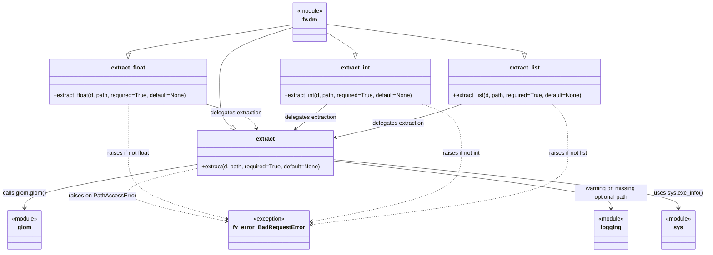

# Diagram: common/fv/python/fv/dm.py

> Auto-generated by Obscura crawlers

## Mermaid

### SVG

<svg id="container" width="1990.16796875" xmlns="http://www.w3.org/2000/svg" class="classDiagram" height="706" viewBox="0 0 1990.16796875 706" role="graphics-document document" aria-roledescription="class"><g><defs><marker id="container_class-aggregationStart" class="marker aggregation class" refX="18" refY="7" markerWidth="190" markerHeight="240" orient="auto"><path d="M 18,7 L9,13 L1,7 L9,1 Z"></path></marker></defs><defs><marker id="container_class-aggregationEnd" class="marker aggregation class" refX="1" refY="7" markerWidth="20" markerHeight="28" orient="auto"><path d="M 18,7 L9,13 L1,7 L9,1 Z"></path></marker></defs><defs><marker id="container_class-extensionStart" class="marker extension class" refX="18" refY="7" markerWidth="190" markerHeight="240" orient="auto"><path d="M 1,7 L18,13 V 1 Z"></path></marker></defs><defs><marker id="container_class-extensionEnd" class="marker extension class" refX="1" refY="7" markerWidth="20" markerHeight="28" orient="auto"><path d="M 1,1 V 13 L18,7 Z"></path></marker></defs><defs><marker id="container_class-compositionStart" class="marker composition class" refX="18" refY="7" markerWidth="190" markerHeight="240" orient="auto"><path d="M 18,7 L9,13 L1,7 L9,1 Z"></path></marker></defs><defs><marker id="container_class-compositionEnd" class="marker composition class" refX="1" refY="7" markerWidth="20" markerHeight="28" orient="auto"><path d="M 18,7 L9,13 L1,7 L9,1 Z"></path></marker></defs><defs><marker id="container_class-dependencyStart" class="marker dependency class" refX="6" refY="7" markerWidth="190" markerHeight="240" orient="auto"><path d="M 5,7 L9,13 L1,7 L9,1 Z"></path></marker></defs><defs><marker id="container_class-dependencyEnd" class="marker dependency class" refX="13" refY="7" markerWidth="20" markerHeight="28" orient="auto"><path d="M 18,7 L9,13 L14,7 L9,1 Z"></path></marker></defs><defs><marker id="container_class-lollipopStart" class="marker lollipop class" refX="13" refY="7" markerWidth="190" markerHeight="240" orient="auto"><circle stroke="black" fill="transparent" cx="7" cy="7" r="6"></circle></marker></defs><defs><marker id="container_class-lollipopEnd" class="marker lollipop class" refX="1" refY="7" markerWidth="190" markerHeight="240" orient="auto"><circle stroke="black" fill="transparent" cx="7" cy="7" r="6"></circle></marker></defs><g class="root"><g class="clusters"></g><g class="edgePaths"><path d="M825.686,76.789L790.516,87.491C755.346,98.193,685.007,119.596,649.838,144.965C614.668,170.333,614.668,199.667,614.668,231C614.668,262.333,614.668,295.667,620.661,316.786C626.655,337.904,638.641,346.809,644.634,351.261L650.628,355.713" id="id_fv.dm_extract_1" class="edge-thickness-normal edge-pattern-solid relation" style=";;;" data-edge="true" data-et="edge" data-id="id_fv.dm_extract_1" data-points="W3sieCI6ODI1LjY4NTU0Njg3NSwieSI6NzYuNzg5MDYxNTAwODQ2MzR9LHsieCI6NjE0LjY2Nzk2ODc1LCJ5IjoxNDF9LHsieCI6NjE0LjY2Nzk2ODc1LCJ5IjoyMjl9LHsieCI6NjE0LjY2Nzk2ODc1LCJ5IjozMjl9LHsieCI6NjY0LjQ3NDg4MjgxMjUsInkiOjM2Nn1d" marker-end="url(#container_class-extensionEnd)"></path><path d="M825.686,69.411L747.444,81.343C669.202,93.274,512.718,117.137,434.476,130.36C356.234,143.583,356.234,146.167,356.234,147.458L356.234,148.75" id="id_fv.dm_extract_float_2" class="edge-thickness-normal edge-pattern-solid relation" style=";;;" data-edge="true" data-et="edge" data-id="id_fv.dm_extract_float_2" data-points="W3sieCI6ODI1LjY4NTU0Njg3NSwieSI6NjkuNDExNDUyODk0MTM4NTh9LHsieCI6MzU2LjIzNDM3NSwieSI6MTQxfSx7IngiOjM1Ni4yMzQzNzUsInkiOjE2Nn1d" marker-end="url(#container_class-extensionEnd)"></path><path d="M922.889,91.409L936.548,99.674C950.206,107.94,977.524,124.47,991.183,134.027C1004.842,143.583,1004.842,146.167,1004.842,147.458L1004.842,148.75" id="id_fv.dm_extract_int_3" class="edge-thickness-normal edge-pattern-solid relation" style=";;;" data-edge="true" data-et="edge" data-id="id_fv.dm_extract_int_3" data-points="W3sieCI6OTIyLjg4ODY3MTg3NSwieSI6OTEuNDA5MzExMjMyMTIyNTV9LHsieCI6MTAwNC44NDE3OTY4NzUsInkiOjE0MX0seyJ4IjoxMDA0Ljg0MTc5Njg3NSwieSI6MTY2fV0=" marker-end="url(#container_class-extensionEnd)"></path><path d="M922.889,68.3L1016.368,80.416C1109.847,92.533,1296.805,116.767,1390.285,130.175C1483.764,143.583,1483.764,146.167,1483.764,147.458L1483.764,148.75" id="id_fv.dm_extract_list_4" class="edge-thickness-normal edge-pattern-solid relation" style=";;;" data-edge="true" data-et="edge" data-id="id_fv.dm_extract_list_4" data-points="W3sieCI6OTIyLjg4ODY3MTg3NSwieSI6NjguMjk5NzA2NDU5MTc5ODd9LHsieCI6MTQ4My43NjM2NzE4NzUsInkiOjE0MX0seyJ4IjoxNDgzLjc2MzY3MTg3NSwieSI6MTY2fV0=" marker-end="url(#container_class-extensionEnd)"></path><path d="M556.914,460.697L475.69,474.081C394.466,487.465,232.018,514.232,150.794,534.783C69.57,555.333,69.57,569.667,69.57,576.833L69.57,584" id="id_extract_glom_5" class="edge-thickness-normal edge-pattern-solid relation" style=";;;" data-edge="true" data-et="edge" data-id="id_extract_glom_5" data-points="W3sieCI6NTU2LjkxNDA2MjUsInkiOjQ2MC42OTc0ODE2OTYwMzM1fSx7IngiOjY5LjU3MDMxMjUsInkiOjU0MX0seyJ4Ijo2OS41NzAzMTI1LCJ5Ijo1OTB9XQ==" marker-end="url(#container_class-dependencyEnd)"></path><path d="M556.914,471.614L504.71,483.178C452.505,494.742,348.096,517.871,362.633,542.828C377.17,567.784,510.652,594.568,577.394,607.96L644.135,621.352" id="id_extract_fv_error_BadRequestError_6" class="edge-thickness-normal edge-pattern-dashed relation" style=";;;" data-edge="true" data-et="edge" data-id="id_extract_fv_error_BadRequestError_6" data-points="W3sieCI6NTU2LjkxNDA2MjUsInkiOjQ3MS42MTM1MTEzNDE4NjI5M30seyJ4IjoyNDMuNjg3NSwieSI6NTQxfSx7IngiOjY1MC4wMTc1NzgxMjUsInkiOjYyMi41MzI4NjUwNzM0MTYxfV0=" marker-end="url(#container_class-dependencyEnd)"></path><path d="M941.648,451.017L1072.686,466.014C1203.723,481.011,1465.797,511.006,1596.834,533.169C1727.871,555.333,1727.871,569.667,1727.871,576.833L1727.871,584" id="id_extract_logging_7" class="edge-thickness-normal edge-pattern-solid relation" style=";;;" data-edge="true" data-et="edge" data-id="id_extract_logging_7" data-points="W3sieCI6OTQxLjY0ODQzNzUsInkiOjQ1MS4wMTY1MDE3NDIzODI4NH0seyJ4IjoxNzI3Ljg3MTA5Mzc1LCJ5Ijo1NDF9LHsieCI6MTcyNy44NzEwOTM3NSwieSI6NTkwfV0=" marker-end="url(#container_class-dependencyEnd)"></path><path d="M941.648,447.482L1103.877,463.068C1266.105,478.655,1590.563,509.827,1752.791,532.58C1915.02,555.333,1915.02,569.667,1915.02,576.833L1915.02,584" id="id_extract_sys_8" class="edge-thickness-normal edge-pattern-solid relation" style=";;;" data-edge="true" data-et="edge" data-id="id_extract_sys_8" data-points="W3sieCI6OTQxLjY0ODQzNzUsInkiOjQ0Ny40ODE5NTcxODI0NDU0fSx7IngiOjE5MTUuMDE5NTMxMjUsInkiOjU0MX0seyJ4IjoxOTE1LjAxOTUzMTI1LCJ5Ijo1OTB9XQ==" marker-end="url(#container_class-dependencyEnd)"></path><path d="M578.081,292L599.796,298.167C621.511,304.333,664.941,316.667,688.8,328.074C712.659,339.482,716.948,349.964,719.092,355.206L721.236,360.447" id="id_extract_float_extract_9" class="edge-thickness-normal edge-pattern-solid relation" style=";;;" data-edge="true" data-et="edge" data-id="id_extract_float_extract_9" data-points="W3sieCI6NTc4LjA4MDUwNzgxMjUsInkiOjI5Mn0seyJ4Ijo3MDguMzcxMDkzNzUsInkiOjMyOX0seyJ4Ijo3MjMuNTA3ODUxNTYyNSwieSI6MzY2fV0=" marker-end="url(#container_class-dependencyEnd)"></path><path d="M356.234,292L356.234,298.167C356.234,304.333,356.234,316.667,356.234,339.5C356.234,362.333,356.234,395.667,356.234,431C356.234,466.333,356.234,503.667,404.23,534.668C452.225,565.67,548.216,590.341,596.211,602.676L644.206,615.011" id="id_extract_float_fv_error_BadRequestError_10" class="edge-thickness-normal edge-pattern-dashed relation" style=";;;" data-edge="true" data-et="edge" data-id="id_extract_float_fv_error_BadRequestError_10" data-points="W3sieCI6MzU2LjIzNDM3NSwieSI6MjkyfSx7IngiOjM1Ni4yMzQzNzUsInkiOjMyOX0seyJ4IjozNTYuMjM0Mzc1LCJ5Ijo0Mjl9LHsieCI6MzU2LjIzNDM3NSwieSI6NTQxfSx7IngiOjY1MC4wMTc1NzgxMjUsInkiOjYxNi41MDQyODYyMDg1OTM4fV0=" marker-end="url(#container_class-dependencyEnd)"></path><path d="M923.531,292L915.572,298.167C907.613,304.333,891.695,316.667,876.72,328.38C861.745,340.093,847.713,351.186,840.697,356.733L833.681,362.279" id="id_extract_int_extract_11" class="edge-thickness-normal edge-pattern-solid relation" style=";;;" data-edge="true" data-et="edge" data-id="id_extract_int_extract_11" data-points="W3sieCI6OTIzLjUzMTE5MTQwNjI1LCJ5IjoyOTJ9LHsieCI6ODc1Ljc3NzM0Mzc1LCJ5IjozMjl9LHsieCI6ODI4Ljk3Mzc4OTA2MjUsInkiOjM2Nn1d" marker-end="url(#container_class-dependencyEnd)"></path><path d="M1192.736,292L1211.127,298.167C1229.519,304.333,1266.302,316.667,1284.694,339.5C1303.086,362.333,1303.086,395.667,1303.086,431C1303.086,466.333,1303.086,503.667,1230.885,535.951C1158.685,568.236,1014.284,595.473,942.083,609.091L869.882,622.709" id="id_extract_int_fv_error_BadRequestError_12" class="edge-thickness-normal edge-pattern-dashed relation" style=";;;" data-edge="true" data-et="edge" data-id="id_extract_int_fv_error_BadRequestError_12" data-points="W3sieCI6MTE5Mi43MzU2MDU0Njg3NSwieSI6MjkyfSx7IngiOjEzMDMuMDg1OTM3NSwieSI6MzI5fSx7IngiOjEzMDMuMDg1OTM3NSwieSI6NDI5fSx7IngiOjEzMDMuMDg1OTM3NSwieSI6NTQxfSx7IngiOjg2My45ODYzMjgxMjUsInkiOjYyMy44MjEwNjk3NjE2MTk1fV0=" marker-end="url(#container_class-dependencyEnd)"></path><path d="M1304.326,292L1286.762,298.167C1269.198,304.333,1234.069,316.667,1174.599,332.153C1115.129,347.639,1031.317,366.278,989.411,375.597L947.505,384.917" id="id_extract_list_extract_13" class="edge-thickness-normal edge-pattern-solid relation" style=";;;" data-edge="true" data-et="edge" data-id="id_extract_list_extract_13" data-points="W3sieCI6MTMwNC4zMjU2NDQ1MzEyNSwieSI6MjkyfSx7IngiOjExOTguOTQxNDA2MjUsInkiOjMyOX0seyJ4Ijo5NDEuNjQ4NDM3NSwieSI6Mzg2LjIxOTQyNzg2NjUzMTEzfV0=" marker-end="url(#container_class-dependencyEnd)"></path><path d="M1561.951,292L1569.605,298.167C1577.258,304.333,1592.565,316.667,1600.218,339.5C1607.871,362.333,1607.871,395.667,1607.871,431C1607.871,466.333,1607.871,503.667,1484.883,537.221C1361.895,570.776,1115.919,600.552,992.931,615.44L869.943,630.328" id="id_extract_list_fv_error_BadRequestError_14" class="edge-thickness-normal edge-pattern-dashed relation" style=";;;" data-edge="true" data-et="edge" data-id="id_extract_list_fv_error_BadRequestError_14" data-points="W3sieCI6MTU2MS45NTEzNDc2NTYyNSwieSI6MjkyfSx7IngiOjE2MDcuODcxMDkzNzUsInkiOjMyOX0seyJ4IjoxNjA3Ljg3MTA5Mzc1LCJ5Ijo0Mjl9LHsieCI6MTYwNy44NzEwOTM3NSwieSI6NTQxfSx7IngiOjg2My45ODYzMjgxMjUsInkiOjYzMS4wNDkyNTM0MDU4Njk0fV0=" marker-end="url(#container_class-dependencyEnd)"></path></g><g class="edgeLabels"><g class="edgeLabel"><g class="label" data-id="id_fv.dm_extract_1" transform="translate(0, 0)"><foreignObject width="0" height="0">

</foreignObject></g></g><g class="edgeLabel"><g class="label" data-id="id_fv.dm_extract_float_2" transform="translate(0, 0)"><foreignObject width="0" height="0">

</foreignObject></g></g><g class="edgeLabel"><g class="label" data-id="id_fv.dm_extract_int_3" transform="translate(0, 0)"><foreignObject width="0" height="0">

</foreignObject></g></g><g class="edgeLabel"><g class="label" data-id="id_fv.dm_extract_list_4" transform="translate(0, 0)"><foreignObject width="0" height="0">

</foreignObject></g></g><g class="edgeLabel" transform="translate(69.5703125, 541)"><g class="label" data-id="id_extract_glom_5" transform="translate(-61.5703125, -12)"><foreignObject width="123.140625" height="24">

calls glom.glom()

</foreignObject></g></g><g class="edgeLabel" transform="translate(289.57757, 550.20815)"><g class="label" data-id="id_extract_fv_error_BadRequestError_6" transform="translate(-92.546875, -12)"><foreignObject width="185.09375" height="24">

raises on PathAccessError

</foreignObject></g></g><g class="edgeLabel" transform="translate(1727.87109375, 541)"><g class="label" data-id="id_extract_logging_7" transform="translate(-100, -24)"><foreignObject width="200" height="48">

warning on missing optional path

</foreignObject></g></g><g class="edgeLabel" transform="translate(1915.01953125, 541)"><g class="label" data-id="id_extract_sys_8" transform="translate(-67.1484375, -12)"><foreignObject width="134.296875" height="24">

uses sys.exc_info()

</foreignObject></g></g><g class="edgeLabel" transform="translate(662.45377, 315.96037)"><g class="label" data-id="id_extract_float_extract_9" transform="translate(-73.703125, -12)"><foreignObject width="147.40625" height="24">

delegates extraction

</foreignObject></g></g><g class="edgeLabel" transform="translate(356.234375, 429)"><g class="label" data-id="id_extract_float_fv_error_BadRequestError_10" transform="translate(-61.3203125, -12)"><foreignObject width="122.640625" height="24">

raises if not float

</foreignObject></g></g><g class="edgeLabel" transform="translate(876.07313, 328.77082)"><g class="label" data-id="id_extract_int_extract_11" transform="translate(-73.703125, -12)"><foreignObject width="147.40625" height="24">

delegates extraction

</foreignObject></g></g><g class="edgeLabel" transform="translate(1303.0859375, 429)"><g class="label" data-id="id_extract_int_fv_error_BadRequestError_12" transform="translate(-54.625, -12)"><foreignObject width="109.25" height="24">

raises if not int

</foreignObject></g></g><g class="edgeLabel" transform="translate(1124.80855, 345.48642)"><g class="label" data-id="id_extract_list_extract_13" transform="translate(-73.703125, -12)"><foreignObject width="147.40625" height="24">

delegates extraction

</foreignObject></g></g><g class="edgeLabel" transform="translate(1607.87109375, 429)"><g class="label" data-id="id_extract_list_fv_error_BadRequestError_14" transform="translate(-56.0234375, -12)"><foreignObject width="112.046875" height="24">

raises if not list

</foreignObject></g></g></g><g class="nodes"><g class="node default" id="classId-fv.dm-0" transform="translate(874.287109375, 62)"><g class="basic label-container"><path d="M-48.6015625 -54 L48.6015625 -54 L48.6015625 54 L-48.6015625 54" stroke="none" stroke-width="0" fill="#ECECFF" style=""></path><path d="M-48.6015625 -54 C-25.654193209189927 -54, -2.706823918379854 -54, 48.6015625 -54 M-48.6015625 -54 C-25.888113225615946 -54, -3.174663951231892 -54, 48.6015625 -54 M48.6015625 -54 C48.6015625 -23.336540659672522, 48.6015625 7.3269186806549556, 48.6015625 54 M48.6015625 -54 C48.6015625 -12.564895114883711, 48.6015625 28.870209770232577, 48.6015625 54 M48.6015625 54 C26.23863038678102 54, 3.875698273562037 54, -48.6015625 54 M48.6015625 54 C26.96343969548392 54, 5.325316890967841 54, -48.6015625 54 M-48.6015625 54 C-48.6015625 22.986213551587326, -48.6015625 -8.027572896825347, -48.6015625 -54 M-48.6015625 54 C-48.6015625 26.523139268364172, -48.6015625 -0.9537214632716555, -48.6015625 -54" stroke="#9370DB" stroke-width="1.3" fill="none" stroke-dasharray="0 0" style=""></path></g><g class="annotation-group text" transform="translate(-36.6015625, -30)"><g class="label" style="" transform="translate(0,-12)"><foreignObject width="73.203125" height="24">

«module»

</foreignObject></g></g><g class="label-group text" transform="translate(-20.0390625, -6)"><g class="label" style="font-weight: bolder" transform="translate(0,-12)"><foreignObject width="40.078125" height="24">

fv.dm

</foreignObject></g></g><g class="members-group text" transform="translate(-36.6015625, 42)"></g><g class="methods-group text" transform="translate(-36.6015625, 72)"></g><g class="divider" style=""><path d="M-48.6015625 18 C-11.455110551324054 18, 25.69134139735189 18, 48.6015625 18 M-48.6015625 18 C-16.493795491665516 18, 15.613971516668968 18, 48.6015625 18" stroke="#9370DB" stroke-width="1.3" fill="none" stroke-dasharray="0 0" style=""></path></g><g class="divider" style=""><path d="M-48.6015625 36 C-13.256728704279205 36, 22.08810509144159 36, 48.6015625 36 M-48.6015625 36 C-18.423388543991493 36, 11.754785412017014 36, 48.6015625 36" stroke="#9370DB" stroke-width="1.3" fill="none" stroke-dasharray="0 0" style=""></path></g></g><g class="node default" id="classId-glom-1" transform="translate(69.5703125, 644)"><g class="basic label-container"><path d="M-48.6015625 -54 L48.6015625 -54 L48.6015625 54 L-48.6015625 54" stroke="none" stroke-width="0" fill="#ECECFF" style=""></path><path d="M-48.6015625 -54 C-17.63691755730714 -54, 13.327727385385721 -54, 48.6015625 -54 M-48.6015625 -54 C-11.58268073837997 -54, 25.43620102324006 -54, 48.6015625 -54 M48.6015625 -54 C48.6015625 -15.475931623823215, 48.6015625 23.04813675235357, 48.6015625 54 M48.6015625 -54 C48.6015625 -30.022955015224262, 48.6015625 -6.045910030448525, 48.6015625 54 M48.6015625 54 C20.640384320722617 54, -7.320793858554765 54, -48.6015625 54 M48.6015625 54 C21.62608144400005 54, -5.3493996119999 54, -48.6015625 54 M-48.6015625 54 C-48.6015625 23.538689753162284, -48.6015625 -6.922620493675431, -48.6015625 -54 M-48.6015625 54 C-48.6015625 19.12218334929851, -48.6015625 -15.75563330140298, -48.6015625 -54" stroke="#9370DB" stroke-width="1.3" fill="none" stroke-dasharray="0 0" style=""></path></g><g class="annotation-group text" transform="translate(-36.6015625, -30)"><g class="label" style="" transform="translate(0,-12)"><foreignObject width="73.203125" height="24">

«module»

</foreignObject></g></g><g class="label-group text" transform="translate(-18.1796875, -6)"><g class="label" style="font-weight: bolder" transform="translate(0,-12)"><foreignObject width="36.359375" height="24">

glom

</foreignObject></g></g><g class="members-group text" transform="translate(-36.6015625, 42)"></g><g class="methods-group text" transform="translate(-36.6015625, 72)"></g><g class="divider" style=""><path d="M-48.6015625 18 C-19.73686727590167 18, 9.12782794819666 18, 48.6015625 18 M-48.6015625 18 C-21.321193178233635 18, 5.95917614353273 18, 48.6015625 18" stroke="#9370DB" stroke-width="1.3" fill="none" stroke-dasharray="0 0" style=""></path></g><g class="divider" style=""><path d="M-48.6015625 36 C-19.44807803879655 36, 9.705406422406902 36, 48.6015625 36 M-48.6015625 36 C-12.15895661777786 36, 24.28364926444428 36, 48.6015625 36" stroke="#9370DB" stroke-width="1.3" fill="none" stroke-dasharray="0 0" style=""></path></g></g><g class="node default" id="classId-fv_error_BadRequestError-2" transform="translate(757.001953125, 644)"><g class="basic label-container"><path d="M-106.984375 -54 L106.984375 -54 L106.984375 54 L-106.984375 54" stroke="none" stroke-width="0" fill="#ECECFF" style=""></path><path d="M-106.984375 -54 C-59.09590391460318 -54, -11.207432829206354 -54, 106.984375 -54 M-106.984375 -54 C-40.325165479604934 -54, 26.334044040790133 -54, 106.984375 -54 M106.984375 -54 C106.984375 -30.406674027140596, 106.984375 -6.813348054281192, 106.984375 54 M106.984375 -54 C106.984375 -26.141584245069627, 106.984375 1.7168315098607465, 106.984375 54 M106.984375 54 C34.20340928630088 54, -38.577556427398235 54, -106.984375 54 M106.984375 54 C57.58404885182864 54, 8.183722703657281 54, -106.984375 54 M-106.984375 54 C-106.984375 19.607190483542382, -106.984375 -14.785619032915235, -106.984375 -54 M-106.984375 54 C-106.984375 29.561912495100692, -106.984375 5.123824990201385, -106.984375 -54" stroke="#9370DB" stroke-width="1.3" fill="none" stroke-dasharray="0 0" style=""></path></g><g class="annotation-group text" transform="translate(-44.3515625, -30)"><g class="label" style="" transform="translate(0,-12)"><foreignObject width="88.703125" height="24">

«exception»

</foreignObject></g></g><g class="label-group text" transform="translate(-94.984375, -6)"><g class="label" style="font-weight: bolder" transform="translate(0,-12)"><foreignObject width="189.96875" height="24">

fv_error_BadRequestError

</foreignObject></g></g><g class="members-group text" transform="translate(-94.984375, 42)"></g><g class="methods-group text" transform="translate(-94.984375, 72)"></g><g class="divider" style=""><path d="M-106.984375 18 C-62.74210205327139 18, -18.499829106542776 18, 106.984375 18 M-106.984375 18 C-38.81666380136549 18, 29.351047397269014 18, 106.984375 18" stroke="#9370DB" stroke-width="1.3" fill="none" stroke-dasharray="0 0" style=""></path></g><g class="divider" style=""><path d="M-106.984375 36 C-22.793038386364515 36, 61.39829822727097 36, 106.984375 36 M-106.984375 36 C-24.75471198705769 36, 57.47495102588462 36, 106.984375 36" stroke="#9370DB" stroke-width="1.3" fill="none" stroke-dasharray="0 0" style=""></path></g></g><g class="node default" id="classId-extract-3" transform="translate(749.28125, 429)"><g class="basic label-container"><path d="M-192.3671875 -63 L192.3671875 -63 L192.3671875 63 L-192.3671875 63" stroke="none" stroke-width="0" fill="#ECECFF" style=""></path><path d="M-192.3671875 -63 C-57.575144073930716 -63, 77.21689935213857 -63, 192.3671875 -63 M-192.3671875 -63 C-65.65732340989352 -63, 61.05254068021296 -63, 192.3671875 -63 M192.3671875 -63 C192.3671875 -36.24629087410416, 192.3671875 -9.492581748208323, 192.3671875 63 M192.3671875 -63 C192.3671875 -29.116011073049805, 192.3671875 4.7679778539003905, 192.3671875 63 M192.3671875 63 C77.29499221793705 63, -37.7772030641259 63, -192.3671875 63 M192.3671875 63 C49.823054881437685 63, -92.72107773712463 63, -192.3671875 63 M-192.3671875 63 C-192.3671875 13.657904044224559, -192.3671875 -35.68419191155088, -192.3671875 -63 M-192.3671875 63 C-192.3671875 26.587496953852124, -192.3671875 -9.825006092295752, -192.3671875 -63" stroke="#9370DB" stroke-width="1.3" fill="none" stroke-dasharray="0 0" style=""></path></g><g class="annotation-group text" transform="translate(0, -39)"></g><g class="label-group text" transform="translate(-25.734375, -39)"><g class="label" style="font-weight: bolder" transform="translate(0,-12)"><foreignObject width="51.46875" height="24">

extract

</foreignObject></g></g><g class="members-group text" transform="translate(-180.3671875, 9)"></g><g class="methods-group text" transform="translate(-180.3671875, 39)"><g class="label" style="" transform="translate(0,-12)"><foreignObject width="335" height="24">

+extract(d, path, required=True, default=None)

</foreignObject></g></g><g class="divider" style=""><path d="M-192.3671875 -15 C-90.82760480103435 -15, 10.711977897931291 -15, 192.3671875 -15 M-192.3671875 -15 C-86.42314698026836 -15, 19.520893539463287 -15, 192.3671875 -15" stroke="#9370DB" stroke-width="1.3" fill="none" stroke-dasharray="0 0" style=""></path></g><g class="divider" style=""><path d="M-192.3671875 9 C-111.42595048882704 9, -30.484713477654083 9, 192.3671875 9 M-192.3671875 9 C-82.33125024787199 9, 27.704687004256016 9, 192.3671875 9" stroke="#9370DB" stroke-width="1.3" fill="none" stroke-dasharray="0 0" style=""></path></g></g><g class="node default" id="classId-extract_float-4" transform="translate(356.234375, 229)"><g class="basic label-container"><path d="M-223.43359375 -63 L223.43359375 -63 L223.43359375 63 L-223.43359375 63" stroke="none" stroke-width="0" fill="#ECECFF" style=""></path><path d="M-223.43359375 -63 C-119.25683072017425 -63, -15.0800676903485 -63, 223.43359375 -63 M-223.43359375 -63 C-68.5792772513098 -63, 86.27503924738039 -63, 223.43359375 -63 M223.43359375 -63 C223.43359375 -20.280924535523745, 223.43359375 22.43815092895251, 223.43359375 63 M223.43359375 -63 C223.43359375 -24.628394315505304, 223.43359375 13.743211368989392, 223.43359375 63 M223.43359375 63 C84.56548274769497 63, -54.302628254610056 63, -223.43359375 63 M223.43359375 63 C87.07445563608576 63, -49.28468247782848 63, -223.43359375 63 M-223.43359375 63 C-223.43359375 18.582594140048222, -223.43359375 -25.834811719903556, -223.43359375 -63 M-223.43359375 63 C-223.43359375 24.09170077273633, -223.43359375 -14.816598454527337, -223.43359375 -63" stroke="#9370DB" stroke-width="1.3" fill="none" stroke-dasharray="0 0" style=""></path></g><g class="annotation-group text" transform="translate(0, -39)"></g><g class="label-group text" transform="translate(-46.8046875, -39)"><g class="label" style="font-weight: bolder" transform="translate(0,-12)"><foreignObject width="93.609375" height="24">

extract_float

</foreignObject></g></g><g class="members-group text" transform="translate(-211.43359375, 9)"></g><g class="methods-group text" transform="translate(-211.43359375, 39)"><g class="label" style="" transform="translate(0,-12)"><foreignObject width="376.0625" height="24">

+extract_float(d, path, required=True, default=None)

</foreignObject></g></g><g class="divider" style=""><path d="M-223.43359375 -15 C-111.14769294110822 -15, 1.1382078677835636 -15, 223.43359375 -15 M-223.43359375 -15 C-117.97464480133571 -15, -12.515695852671428 -15, 223.43359375 -15" stroke="#9370DB" stroke-width="1.3" fill="none" stroke-dasharray="0 0" style=""></path></g><g class="divider" style=""><path d="M-223.43359375 9 C-61.6679367078971 9, 100.0977203342058 9, 223.43359375 9 M-223.43359375 9 C-103.63961724968202 9, 16.154359250635963 9, 223.43359375 9" stroke="#9370DB" stroke-width="1.3" fill="none" stroke-dasharray="0 0" style=""></path></g></g><g class="node default" id="classId-extract_int-5" transform="translate(1004.841796875, 229)"><g class="basic label-container"><path d="M-213.41796875 -63 L213.41796875 -63 L213.41796875 63 L-213.41796875 63" stroke="none" stroke-width="0" fill="#ECECFF" style=""></path><path d="M-213.41796875 -63 C-104.1776700101209 -63, 5.062628729758188 -63, 213.41796875 -63 M-213.41796875 -63 C-111.80181380887744 -63, -10.185658867754881 -63, 213.41796875 -63 M213.41796875 -63 C213.41796875 -19.852294689085973, 213.41796875 23.295410621828054, 213.41796875 63 M213.41796875 -63 C213.41796875 -27.758431537939735, 213.41796875 7.483136924120529, 213.41796875 63 M213.41796875 63 C99.31114140592645 63, -14.795685938147102 63, -213.41796875 63 M213.41796875 63 C58.36816752955315 63, -96.6816336908937 63, -213.41796875 63 M-213.41796875 63 C-213.41796875 17.336399593782538, -213.41796875 -28.327200812434924, -213.41796875 -63 M-213.41796875 63 C-213.41796875 13.505490882447333, -213.41796875 -35.989018235105334, -213.41796875 -63" stroke="#9370DB" stroke-width="1.3" fill="none" stroke-dasharray="0 0" style=""></path></g><g class="annotation-group text" transform="translate(0, -39)"></g><g class="label-group text" transform="translate(-39.8515625, -39)"><g class="label" style="font-weight: bolder" transform="translate(0,-12)"><foreignObject width="79.703125" height="24">

extract_int

</foreignObject></g></g><g class="members-group text" transform="translate(-201.41796875, 9)"></g><g class="methods-group text" transform="translate(-201.41796875, 39)"><g class="label" style="" transform="translate(0,-12)"><foreignObject width="362.984375" height="24">

+extract_int(d, path, required=True, default=None)

</foreignObject></g></g><g class="divider" style=""><path d="M-213.41796875 -15 C-102.702719510463 -15, 8.012529729074004 -15, 213.41796875 -15 M-213.41796875 -15 C-47.67287296157551 -15, 118.07222282684899 -15, 213.41796875 -15" stroke="#9370DB" stroke-width="1.3" fill="none" stroke-dasharray="0 0" style=""></path></g><g class="divider" style=""><path d="M-213.41796875 9 C-52.64747469577344 9, 108.12301935845312 9, 213.41796875 9 M-213.41796875 9 C-75.41546907455248 9, 62.58703060089505 9, 213.41796875 9" stroke="#9370DB" stroke-width="1.3" fill="none" stroke-dasharray="0 0" style=""></path></g></g><g class="node default" id="classId-extract_list-6" transform="translate(1483.763671875, 229)"><g class="basic label-container"><path d="M-215.50390625 -63 L215.50390625 -63 L215.50390625 63 L-215.50390625 63" stroke="none" stroke-width="0" fill="#ECECFF" style=""></path><path d="M-215.50390625 -63 C-82.34992484231998 -63, 50.80405656536004 -63, 215.50390625 -63 M-215.50390625 -63 C-69.24928422029393 -63, 77.00533780941214 -63, 215.50390625 -63 M215.50390625 -63 C215.50390625 -35.93827979980816, 215.50390625 -8.876559599616321, 215.50390625 63 M215.50390625 -63 C215.50390625 -23.068115547800396, 215.50390625 16.86376890439921, 215.50390625 63 M215.50390625 63 C90.52904893356096 63, -34.445808382878084 63, -215.50390625 63 M215.50390625 63 C120.25517123162399 63, 25.00643621324798 63, -215.50390625 63 M-215.50390625 63 C-215.50390625 14.312198361528843, -215.50390625 -34.375603276942314, -215.50390625 -63 M-215.50390625 63 C-215.50390625 31.26899066769888, -215.50390625 -0.4620186646022404, -215.50390625 -63" stroke="#9370DB" stroke-width="1.3" fill="none" stroke-dasharray="0 0" style=""></path></g><g class="annotation-group text" transform="translate(0, -39)"></g><g class="label-group text" transform="translate(-41.3984375, -39)"><g class="label" style="font-weight: bolder" transform="translate(0,-12)"><foreignObject width="82.796875" height="24">

extract_list

</foreignObject></g></g><g class="members-group text" transform="translate(-203.50390625, 9)"></g><g class="methods-group text" transform="translate(-203.50390625, 39)"><g class="label" style="" transform="translate(0,-12)"><foreignObject width="365.609375" height="24">

+extract_list(d, path, required=True, default=None)

</foreignObject></g></g><g class="divider" style=""><path d="M-215.50390625 -15 C-86.25997199121858 -15, 42.983962267562845 -15, 215.50390625 -15 M-215.50390625 -15 C-55.91654200424253 -15, 103.67082224151494 -15, 215.50390625 -15" stroke="#9370DB" stroke-width="1.3" fill="none" stroke-dasharray="0 0" style=""></path></g><g class="divider" style=""><path d="M-215.50390625 9 C-54.21682347901242 9, 107.07025929197516 9, 215.50390625 9 M-215.50390625 9 C-106.92693562979406 9, 1.650034990411882 9, 215.50390625 9" stroke="#9370DB" stroke-width="1.3" fill="none" stroke-dasharray="0 0" style=""></path></g></g><g class="node default" id="classId-logging-7" transform="translate(1727.87109375, 644)"><g class="basic label-container"><path d="M-48.6015625 -54 L48.6015625 -54 L48.6015625 54 L-48.6015625 54" stroke="none" stroke-width="0" fill="#ECECFF" style=""></path><path d="M-48.6015625 -54 C-20.24805129235375 -54, 8.1054599152925 -54, 48.6015625 -54 M-48.6015625 -54 C-24.63940525817087 -54, -0.6772480163417427 -54, 48.6015625 -54 M48.6015625 -54 C48.6015625 -20.60164769749897, 48.6015625 12.796704605002063, 48.6015625 54 M48.6015625 -54 C48.6015625 -16.76191435387439, 48.6015625 20.476171292251223, 48.6015625 54 M48.6015625 54 C13.404456280077774 54, -21.792649939844452 54, -48.6015625 54 M48.6015625 54 C20.908364524276482 54, -6.784833451447035 54, -48.6015625 54 M-48.6015625 54 C-48.6015625 20.91013858764829, -48.6015625 -12.179722824703418, -48.6015625 -54 M-48.6015625 54 C-48.6015625 19.149523216787543, -48.6015625 -15.700953566424914, -48.6015625 -54" stroke="#9370DB" stroke-width="1.3" fill="none" stroke-dasharray="0 0" style=""></path></g><g class="annotation-group text" transform="translate(-36.6015625, -30)"><g class="label" style="" transform="translate(0,-12)"><foreignObject width="73.203125" height="24">

«module»

</foreignObject></g></g><g class="label-group text" transform="translate(-27.109375, -6)"><g class="label" style="font-weight: bolder" transform="translate(0,-12)"><foreignObject width="54.21875" height="24">

logging

</foreignObject></g></g><g class="members-group text" transform="translate(-36.6015625, 42)"></g><g class="methods-group text" transform="translate(-36.6015625, 72)"></g><g class="divider" style=""><path d="M-48.6015625 18 C-12.34287027159062 18, 23.91582195681876 18, 48.6015625 18 M-48.6015625 18 C-22.756135347092215 18, 3.08929180581557 18, 48.6015625 18" stroke="#9370DB" stroke-width="1.3" fill="none" stroke-dasharray="0 0" style=""></path></g><g class="divider" style=""><path d="M-48.6015625 36 C-9.984506425251396 36, 28.632549649497207 36, 48.6015625 36 M-48.6015625 36 C-22.722965048816466 36, 3.1556324023670683 36, 48.6015625 36" stroke="#9370DB" stroke-width="1.3" fill="none" stroke-dasharray="0 0" style=""></path></g></g><g class="node default" id="classId-sys-8" transform="translate(1915.01953125, 644)"><g class="basic label-container"><path d="M-48.6015625 -54 L48.6015625 -54 L48.6015625 54 L-48.6015625 54" stroke="none" stroke-width="0" fill="#ECECFF" style=""></path><path d="M-48.6015625 -54 C-10.591654763939495 -54, 27.41825297212101 -54, 48.6015625 -54 M-48.6015625 -54 C-14.292278803911593 -54, 20.017004892176814 -54, 48.6015625 -54 M48.6015625 -54 C48.6015625 -19.126743670610736, 48.6015625 15.746512658778528, 48.6015625 54 M48.6015625 -54 C48.6015625 -15.761571520050232, 48.6015625 22.476856959899536, 48.6015625 54 M48.6015625 54 C16.431717971813484 54, -15.738126556373032 54, -48.6015625 54 M48.6015625 54 C23.16453248892369 54, -2.2724975221526194 54, -48.6015625 54 M-48.6015625 54 C-48.6015625 15.134780399802551, -48.6015625 -23.730439200394898, -48.6015625 -54 M-48.6015625 54 C-48.6015625 23.34826173074739, -48.6015625 -7.3034765385052225, -48.6015625 -54" stroke="#9370DB" stroke-width="1.3" fill="none" stroke-dasharray="0 0" style=""></path></g><g class="annotation-group text" transform="translate(-36.6015625, -30)"><g class="label" style="" transform="translate(0,-12)"><foreignObject width="73.203125" height="24">

«module»

</foreignObject></g></g><g class="label-group text" transform="translate(-11.6484375, -6)"><g class="label" style="font-weight: bolder" transform="translate(0,-12)"><foreignObject width="23.296875" height="24">

sys

</foreignObject></g></g><g class="members-group text" transform="translate(-36.6015625, 42)"></g><g class="methods-group text" transform="translate(-36.6015625, 72)"></g><g class="divider" style=""><path d="M-48.6015625 18 C-20.663243340808428 18, 7.275075818383144 18, 48.6015625 18 M-48.6015625 18 C-25.94624678064465 18, -3.2909310612892995 18, 48.6015625 18" stroke="#9370DB" stroke-width="1.3" fill="none" stroke-dasharray="0 0" style=""></path></g><g class="divider" style=""><path d="M-48.6015625 36 C-25.20577336267084 36, -1.8099842253416796 36, 48.6015625 36 M-48.6015625 36 C-15.488326237449563 36, 17.624910025100874 36, 48.6015625 36" stroke="#9370DB" stroke-width="1.3" fill="none" stroke-dasharray="0 0" style=""></path></g></g></g></g></g></svg>
