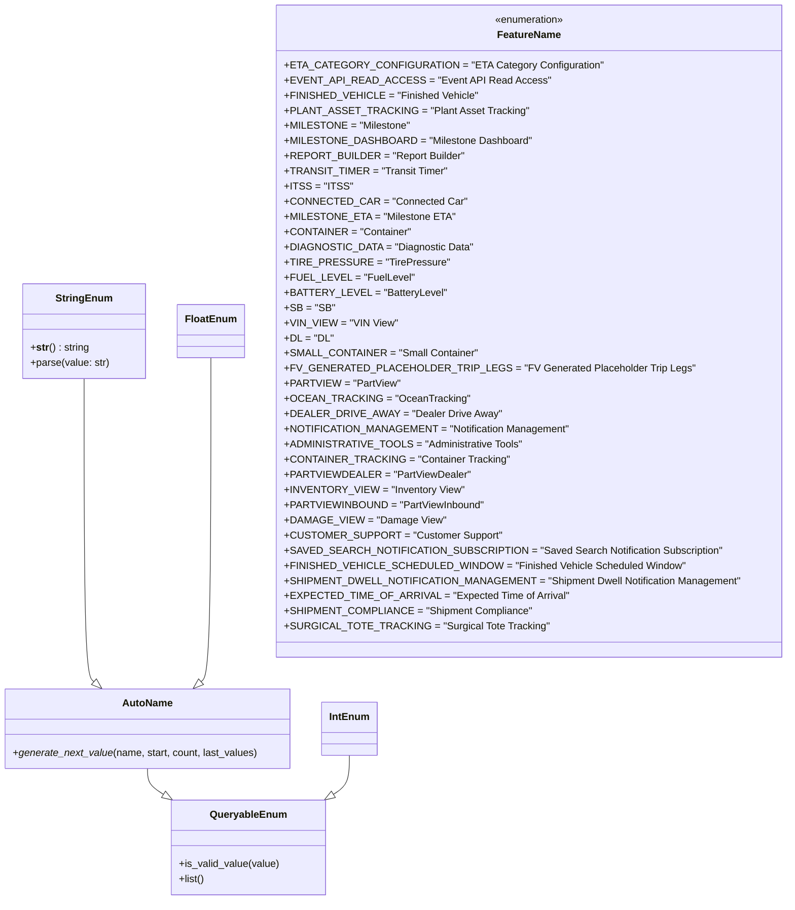

# Diagram: common/fv/python/fv/enum.py

> Auto-generated by Obscura crawlers

## Mermaid

```mermaid
classDiagram
class QueryableEnum {
  +is_valid_value(value)
  +list()
}
class AutoName {
  +_generate_next_value_(name, start, count, last_values)
}
class IntEnum {
}
class StringEnum {
  +__str__() string
  +parse(value: str)
}
class FloatEnum {
}
class FeatureName <<enumeration>> {
  +ETA_CATEGORY_CONFIGURATION = "ETA Category Configuration"
  +EVENT_API_READ_ACCESS = "Event API Read Access"
  +FINISHED_VEHICLE = "Finished Vehicle"
  +PLANT_ASSET_TRACKING = "Plant Asset Tracking"
  +MILESTONE = "Milestone"
  +MILESTONE_DASHBOARD = "Milestone Dashboard"
  +REPORT_BUILDER = "Report Builder"
  +TRANSIT_TIMER = "Transit Timer"
  +ITSS = "ITSS"
  +CONNECTED_CAR = "Connected Car"
  +MILESTONE_ETA = "Milestone ETA"
  +CONTAINER = "Container"
  +DIAGNOSTIC_DATA = "Diagnostic Data"
  +TIRE_PRESSURE = "TirePressure"
  +FUEL_LEVEL = "FuelLevel"
  +BATTERY_LEVEL = "BatteryLevel"
  +SB = "SB"
  +VIN_VIEW = "VIN View"
  +DL = "DL"
  +SMALL_CONTAINER = "Small Container"
  +FV_GENERATED_PLACEHOLDER_TRIP_LEGS = "FV Generated Placeholder Trip Legs"
  +PARTVIEW = "PartView"
  +OCEAN_TRACKING = "OceanTracking"
  +DEALER_DRIVE_AWAY = "Dealer Drive Away"
  +NOTIFICATION_MANAGEMENT = "Notification Management"
  +ADMINISTRATIVE_TOOLS = "Administrative Tools"
  +CONTAINER_TRACKING = "Container Tracking"
  +PARTVIEWDEALER = "PartViewDealer"
  +INVENTORY_VIEW = "Inventory View"
  +PARTVIEWINBOUND = "PartViewInbound"
  +DAMAGE_VIEW = "Damage View"
  +CUSTOMER_SUPPORT = "Customer Support"
  +SAVED_SEARCH_NOTIFICATION_SUBSCRIPTION = "Saved Search Notification Subscription"
  +FINISHED_VEHICLE_SCHEDULED_WINDOW = "Finished Vehicle Scheduled Window"
  +SHIPMENT_DWELL_NOTIFICATION_MANAGEMENT = "Shipment Dwell Notification Management"
  +EXPECTED_TIME_OF_ARRIVAL = "Expected Time of Arrival"
  +SHIPMENT_COMPLIANCE = "Shipment Compliance"
  +SURGICAL_TOTE_TRACKING = "Surgical Tote Tracking"
}
AutoName --|> QueryableEnum
IntEnum --|> QueryableEnum
StringEnum --|> AutoName
FloatEnum --|> AutoName
```

> SVG rendering failed for this diagram.
