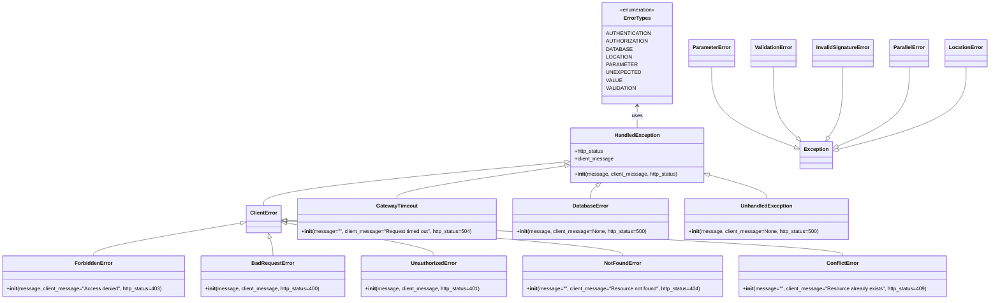

# Diagram: common/fv/python/fv/error.py

> Auto-generated by Obscura crawlers

## Mermaid

### SVG

<svg id="container" width="2988.310546875" xmlns="http://www.w3.org/2000/svg" class="classDiagram" height="922" viewBox="0 0 2988.310546875 922" role="graphics-document document" aria-roledescription="class"><g><defs><marker id="container_class-aggregationStart" class="marker aggregation class" refX="18" refY="7" markerWidth="190" markerHeight="240" orient="auto"><path d="M 18,7 L9,13 L1,7 L9,1 Z"></path></marker></defs><defs><marker id="container_class-aggregationEnd" class="marker aggregation class" refX="1" refY="7" markerWidth="20" markerHeight="28" orient="auto"><path d="M 18,7 L9,13 L1,7 L9,1 Z"></path></marker></defs><defs><marker id="container_class-extensionStart" class="marker extension class" refX="18" refY="7" markerWidth="190" markerHeight="240" orient="auto"><path d="M 1,7 L18,13 V 1 Z"></path></marker></defs><defs><marker id="container_class-extensionEnd" class="marker extension class" refX="1" refY="7" markerWidth="20" markerHeight="28" orient="auto"><path d="M 1,1 V 13 L18,7 Z"></path></marker></defs><defs><marker id="container_class-compositionStart" class="marker composition class" refX="18" refY="7" markerWidth="190" markerHeight="240" orient="auto"><path d="M 18,7 L9,13 L1,7 L9,1 Z"></path></marker></defs><defs><marker id="container_class-compositionEnd" class="marker composition class" refX="1" refY="7" markerWidth="20" markerHeight="28" orient="auto"><path d="M 18,7 L9,13 L1,7 L9,1 Z"></path></marker></defs><defs><marker id="container_class-dependencyStart" class="marker dependency class" refX="6" refY="7" markerWidth="190" markerHeight="240" orient="auto"><path d="M 5,7 L9,13 L1,7 L9,1 Z"></path></marker></defs><defs><marker id="container_class-dependencyEnd" class="marker dependency class" refX="13" refY="7" markerWidth="20" markerHeight="28" orient="auto"><path d="M 18,7 L9,13 L14,7 L9,1 Z"></path></marker></defs><defs><marker id="container_class-lollipopStart" class="marker lollipop class" refX="13" refY="7" markerWidth="190" markerHeight="240" orient="auto"><circle stroke="black" fill="transparent" cx="7" cy="7" r="6"></circle></marker></defs><defs><marker id="container_class-lollipopEnd" class="marker lollipop class" refX="1" refY="7" markerWidth="190" markerHeight="240" orient="auto"><circle stroke="black" fill="transparent" cx="7" cy="7" r="6"></circle></marker></defs><g class="root"><g class="clusters"></g><g class="edgePaths"><path d="M1939.799,326L1939.799,331.167C1939.799,336.333,1939.799,346.667,1939.799,358C1939.799,369.333,1939.799,381.667,1939.799,387.833L1939.799,394" id="id_ErrorTypes_HandledException_1" class="edge-thickness-normal edge-pattern-solid relation" style=";;;" data-edge="true" data-et="edge" data-id="id_ErrorTypes_HandledException_1" data-points="W3sieCI6MTkzOS43OTg4MjgxMjUsInkiOjMyMH0seyJ4IjoxOTM5Ljc5ODgyODEyNSwieSI6MzU3fSx7IngiOjE5MzkuNzk4ODI4MTI1LCJ5IjozOTR9XQ==" marker-start="url(#container_class-dependencyStart)"></path><path d="M1719.795,498.989L1566.039,513.657C1412.283,528.326,1104.771,557.663,951.016,579.998C797.26,602.333,797.26,617.667,797.26,625.333L797.26,633" id="id_HandledException_ClientError_2" class="edge-thickness-normal edge-pattern-solid relation" style=";;;" data-edge="true" data-et="edge" data-id="id_HandledException_ClientError_2" data-points="W3sieCI6MTczNi45NjY3OTY4NzUsInkiOjQ5Ny4zNTA0OTA2MTUwNjM4fSx7IngiOjc5Ny4yNTk3NjU2MjUsInkiOjU4N30seyJ4Ijo3OTcuMjU5NzY1NjI1LCJ5Ijo2MzN9XQ==" marker-start="url(#container_class-extensionStart)"></path><path d="M1719.902,510.489L1633.592,523.241C1547.282,535.992,1374.661,561.496,1288.351,578.415C1202.041,595.333,1202.041,603.667,1202.041,607.833L1202.041,612" id="id_HandledException_GatewayTimeout_3" class="edge-thickness-normal edge-pattern-solid relation" style=";;;" data-edge="true" data-et="edge" data-id="id_HandledException_GatewayTimeout_3" data-points="W3sieCI6MTczNi45NjY3OTY4NzUsInkiOjUwNy45Njc0MTA3NTY4MzI4Nn0seyJ4IjoxMjAyLjA0MTAxNTYyNSwieSI6NTg3fSx7IngiOjEyMDIuMDQxMDE1NjI1LCJ5Ijo2MTJ9XQ==" marker-start="url(#container_class-extensionStart)"></path><path d="M1811.452,572.207L1808.094,574.673C1804.735,577.138,1798.017,582.069,1794.658,588.701C1791.299,595.333,1791.299,603.667,1791.299,607.833L1791.299,612" id="id_HandledException_DatabaseError_4" class="edge-thickness-normal edge-pattern-solid relation" style=";;;" data-edge="true" data-et="edge" data-id="id_HandledException_DatabaseError_4" data-points="W3sieCI6MTgyNS4zNTg0NjExNTI1MjMsInkiOjU2Mn0seyJ4IjoxNzkxLjI5ODgyODEyNSwieSI6NTg3fSx7IngiOjE3OTEuMjk4ODI4MTI1LCJ5Ijo2MTJ9XQ==" marker-start="url(#container_class-extensionStart)"></path><path d="M2159.228,540.134L2186.814,547.945C2214.399,555.756,2269.57,571.378,2297.155,583.356C2324.74,595.333,2324.74,603.667,2324.74,607.833L2324.74,612" id="id_HandledException_UnhandledException_5" class="edge-thickness-normal edge-pattern-solid relation" style=";;;" data-edge="true" data-et="edge" data-id="id_HandledException_UnhandledException_5" data-points="W3sieCI6MjE0Mi42MzA4NTkzNzUsInkiOjUzNS40MzM5MTM0NDA1NjAxfSx7IngiOjIzMjQuNzQwMjM0Mzc1LCJ5Ijo1ODd9LHsieCI6MjMyNC43NDAyMzQzNzUsInkiOjYxMn1d" marker-start="url(#container_class-extensionStart)"></path><path d="M728.795,686.702L654.394,699.418C579.993,712.134,431.19,737.567,356.788,754.45C282.387,771.333,282.387,779.667,282.387,783.833L282.387,788" id="id_ClientError_ForbiddenError_6" class="edge-thickness-normal edge-pattern-solid relation" style=";;;" data-edge="true" data-et="edge" data-id="id_ClientError_ForbiddenError_6" data-points="W3sieCI6NzQ1Ljc5ODgyODEyNSwieSI6NjgzLjc5NTQ5MzQyNzkxNTd9LHsieCI6MjgyLjM4NjcxODc1LCJ5Ijo3NjN9LHsieCI6MjgyLjM4NjcxODc1LCJ5Ijo3ODh9XQ==" marker-start="url(#container_class-extensionStart)"></path><path d="M815.514,733.466L817.05,738.388C818.587,743.311,821.661,753.155,823.198,762.244C824.734,771.333,824.734,779.667,824.734,783.833L824.734,788" id="id_ClientError_BadRequestError_7" class="edge-thickness-normal edge-pattern-solid relation" style=";;;" data-edge="true" data-et="edge" data-id="id_ClientError_BadRequestError_7" data-points="W3sieCI6ODEwLjM3MjY0NzM3MjE1OTEsInkiOjcxN30seyJ4Ijo4MjQuNzM0Mzc1LCJ5Ijo3NjN9LHsieCI6ODI0LjczNDM3NSwieSI6Nzg4fV0=" marker-start="url(#container_class-extensionStart)"></path><path d="M865.724,686.702L940.126,699.418C1014.527,712.134,1163.33,737.567,1237.731,754.45C1312.133,771.333,1312.133,779.667,1312.133,783.833L1312.133,788" id="id_ClientError_UnauthorizedError_8" class="edge-thickness-normal edge-pattern-solid relation" style=";;;" data-edge="true" data-et="edge" data-id="id_ClientError_UnauthorizedError_8" data-points="W3sieCI6ODQ4LjcyMDcwMzEyNSwieSI6NjgzLjc5NTQ5MzQyNzkxNTd9LHsieCI6MTMxMi4xMzI4MTI1LCJ5Ijo3NjN9LHsieCI6MTMxMi4xMzI4MTI1LCJ5Ijo3ODh9XQ==" marker-start="url(#container_class-extensionStart)"></path><path d="M865.915,680.553L1035.792,694.294C1205.67,708.036,1545.425,735.518,1715.302,753.426C1885.18,771.333,1885.18,779.667,1885.18,783.833L1885.18,788" id="id_ClientError_NotFoundError_9" class="edge-thickness-normal edge-pattern-solid relation" style=";;;" data-edge="true" data-et="edge" data-id="id_ClientError_NotFoundError_9" data-points="W3sieCI6ODQ4LjcyMDcwMzEyNSwieSI6Njc5LjE2MjU4ODA4MTExMDl9LHsieCI6MTg4NS4xNzk2ODc1LCJ5Ijo3NjN9LHsieCI6MTg4NS4xNzk2ODc1LCJ5Ijo3ODh9XQ==" marker-start="url(#container_class-extensionStart)"></path><path d="M865.949,678.444L1147.025,692.537C1428.101,706.629,1990.254,734.815,2271.33,753.074C2552.406,771.333,2552.406,779.667,2552.406,783.833L2552.406,788" id="id_ClientError_ConflictError_10" class="edge-thickness-normal edge-pattern-solid relation" style=";;;" data-edge="true" data-et="edge" data-id="id_ClientError_ConflictError_10" data-points="W3sieCI6ODQ4LjcyMDcwMzEyNSwieSI6Njc3LjU4MDE2MjEzNDc5MzN9LHsieCI6MjU1Mi40MDYyNSwieSI6NzYzfSx7IngiOjI1NTIuNDA2MjUsInkiOjc4OH1d" marker-start="url(#container_class-extensionStart)"></path><path d="M2159.373,206L2159.373,231.167C2159.373,256.333,2159.373,306.667,2200.153,347.831C2240.932,388.995,2322.492,420.991,2363.271,436.989L2404.051,452.986" id="id_ParameterError_Exception_11" class="edge-thickness-normal edge-pattern-solid relation" style=";;;" data-edge="true" data-et="edge" data-id="id_ParameterError_Exception_11" data-points="W3sieCI6MjE1OS4zNzMwNDY4NzUsInkiOjIwNn0seyJ4IjoyMTU5LjM3MzA0Njg3NSwieSI6MzU3fSx7IngiOjI0MjAuMTA5Mzc1LCJ5Ijo0NTkuMjg2MTg3Mzk3NDk2MjR9XQ==" marker-end="url(#container_class-extensionEnd)"></path><path d="M2344.568,206L2344.568,231.167C2344.568,256.333,2344.568,306.667,2355.928,342.986C2367.287,379.305,2390.006,401.61,2401.365,412.762L2412.724,423.915" id="id_ValidationError_Exception_12" class="edge-thickness-normal edge-pattern-solid relation" style=";;;" data-edge="true" data-et="edge" data-id="id_ValidationError_Exception_12" data-points="W3sieCI6MjM0NC41NjgzNTkzNzUsInkiOjIwNn0seyJ4IjoyMzQ0LjU2ODM1OTM3NSwieSI6MzU3fSx7IngiOjI0MjUuMDMzNTQyMDk3MTA3MywieSI6NDM2fV0=" marker-end="url(#container_class-extensionEnd)"></path><path d="M2551.803,206L2551.803,231.167C2551.803,256.333,2551.803,306.667,2544.303,342.638C2536.803,378.61,2521.803,400.22,2514.303,411.024L2506.802,421.829" id="id_InvalidSignatureError_Exception_13" class="edge-thickness-normal edge-pattern-solid relation" style=";;;" data-edge="true" data-et="edge" data-id="id_InvalidSignatureError_Exception_13" data-points="W3sieCI6MjU1MS44MDI3MzQzNzUsInkiOjIwNn0seyJ4IjoyNTUxLjgwMjczNDM3NSwieSI6MzU3fSx7IngiOjI0OTYuOTY2MTM1MDcyMzE0LCJ5Ijo0MzZ9XQ==" marker-end="url(#container_class-extensionEnd)"></path><path d="M2749.553,206L2749.553,231.167C2749.553,256.333,2749.553,306.667,2713.188,347.451C2676.824,388.235,2604.095,419.47,2567.73,435.088L2531.366,450.706" id="id_ParallelError_Exception_14" class="edge-thickness-normal edge-pattern-solid relation" style=";;;" data-edge="true" data-et="edge" data-id="id_ParallelError_Exception_14" data-points="W3sieCI6Mjc0OS41NTI3MzQzNzUsInkiOjIwNn0seyJ4IjoyNzQ5LjU1MjczNDM3NSwieSI6MzU3fSx7IngiOjI1MTUuNTE1NjI1LCJ5Ijo0NTcuNTEyNzY1OTQyNjk3MX1d" marker-end="url(#container_class-extensionEnd)"></path><path d="M2918.779,206L2918.779,231.167C2918.779,256.333,2918.779,306.667,2854.345,349.122C2789.912,391.577,2661.044,426.154,2596.61,443.442L2532.176,460.73" id="id_LocationError_Exception_15" class="edge-thickness-normal edge-pattern-solid relation" style=";;;" data-edge="true" data-et="edge" data-id="id_LocationError_Exception_15" data-points="W3sieCI6MjkxOC43NzkyOTY4NzUsInkiOjIwNn0seyJ4IjoyOTE4Ljc3OTI5Njg3NSwieSI6MzU3fSx7IngiOjI1MTUuNTE1NjI1LCJ5Ijo0NjUuMjAwNjU4MzA3ODg4OX1d" marker-end="url(#container_class-extensionEnd)"></path></g><g class="edgeLabels"><g class="edgeLabel" transform="translate(1939.798828125, 357)"><g class="label" data-id="id_ErrorTypes_HandledException_1" transform="translate(-16.4921875, -12)"><foreignObject width="32.984375" height="24">

uses

</foreignObject></g></g><g class="edgeLabel"><g class="label" data-id="id_HandledException_ClientError_2" transform="translate(0, 0)"><foreignObject width="0" height="0">

</foreignObject></g></g><g class="edgeLabel"><g class="label" data-id="id_HandledException_GatewayTimeout_3" transform="translate(0, 0)"><foreignObject width="0" height="0">

</foreignObject></g></g><g class="edgeLabel"><g class="label" data-id="id_HandledException_DatabaseError_4" transform="translate(0, 0)"><foreignObject width="0" height="0">

</foreignObject></g></g><g class="edgeLabel"><g class="label" data-id="id_HandledException_UnhandledException_5" transform="translate(0, 0)"><foreignObject width="0" height="0">

</foreignObject></g></g><g class="edgeLabel"><g class="label" data-id="id_ClientError_ForbiddenError_6" transform="translate(0, 0)"><foreignObject width="0" height="0">

</foreignObject></g></g><g class="edgeLabel"><g class="label" data-id="id_ClientError_BadRequestError_7" transform="translate(0, 0)"><foreignObject width="0" height="0">

</foreignObject></g></g><g class="edgeLabel"><g class="label" data-id="id_ClientError_UnauthorizedError_8" transform="translate(0, 0)"><foreignObject width="0" height="0">

</foreignObject></g></g><g class="edgeLabel"><g class="label" data-id="id_ClientError_NotFoundError_9" transform="translate(0, 0)"><foreignObject width="0" height="0">

</foreignObject></g></g><g class="edgeLabel"><g class="label" data-id="id_ClientError_ConflictError_10" transform="translate(0, 0)"><foreignObject width="0" height="0">

</foreignObject></g></g><g class="edgeLabel"><g class="label" data-id="id_ParameterError_Exception_11" transform="translate(0, 0)"><foreignObject width="0" height="0">

</foreignObject></g></g><g class="edgeLabel"><g class="label" data-id="id_ValidationError_Exception_12" transform="translate(0, 0)"><foreignObject width="0" height="0">

</foreignObject></g></g><g class="edgeLabel"><g class="label" data-id="id_InvalidSignatureError_Exception_13" transform="translate(0, 0)"><foreignObject width="0" height="0">

</foreignObject></g></g><g class="edgeLabel"><g class="label" data-id="id_ParallelError_Exception_14" transform="translate(0, 0)"><foreignObject width="0" height="0">

</foreignObject></g></g><g class="edgeLabel"><g class="label" data-id="id_LocationError_Exception_15" transform="translate(0, 0)"><foreignObject width="0" height="0">

</foreignObject></g></g></g><g class="nodes"><g class="node default" id="classId-ErrorTypes-0" transform="translate(1939.798828125, 164)"><g class="basic label-container"><path d="M-101.55859375 -156 L101.55859375 -156 L101.55859375 156 L-101.55859375 156" stroke="none" stroke-width="0" fill="#ECECFF" style=""></path><path d="M-101.55859375 -156 C-48.061495787738544 -156, 5.435602174522913 -156, 101.55859375 -156 M-101.55859375 -156 C-33.589984090964705 -156, 34.37862556807059 -156, 101.55859375 -156 M101.55859375 -156 C101.55859375 -46.054541207551026, 101.55859375 63.89091758489795, 101.55859375 156 M101.55859375 -156 C101.55859375 -65.80366114145619, 101.55859375 24.392677717087622, 101.55859375 156 M101.55859375 156 C37.82553926925319 156, -25.907515211493617 156, -101.55859375 156 M101.55859375 156 C51.3599686177575 156, 1.1613434855150047 156, -101.55859375 156 M-101.55859375 156 C-101.55859375 54.83898723027984, -101.55859375 -46.32202553944032, -101.55859375 -156 M-101.55859375 156 C-101.55859375 88.17353700825038, -101.55859375 20.347074016500756, -101.55859375 -156" stroke="#9370DB" stroke-width="1.3" fill="none" stroke-dasharray="0 0" style=""></path></g><g class="annotation-group text" transform="translate(-55.5546875, -132)"><g class="label" style="" transform="translate(0,-12)"><foreignObject width="111.109375" height="24">

«enumeration»

</foreignObject></g></g><g class="label-group text" transform="translate(-39.390625, -108)"><g class="label" style="font-weight: bolder" transform="translate(0,-12)"><foreignObject width="78.78125" height="24">

ErrorTypes

</foreignObject></g></g><g class="members-group text" transform="translate(-89.55859375, -60)"><g class="label" style="" transform="translate(0,-12)"><foreignObject width="123.5625" height="24">

AUTHENTICATION

</foreignObject></g><g class="label" style="" transform="translate(0,12)"><foreignObject width="115.9375" height="24">

AUTHORIZATION

</foreignObject></g><g class="label" style="" transform="translate(0,36)"><foreignObject width="71.25" height="24">

DATABASE

</foreignObject></g><g class="label" style="" transform="translate(0,60)"><foreignObject width="70.640625" height="24">

LOCATION

</foreignObject></g><g class="label" style="" transform="translate(0,84)"><foreignObject width="83.875" height="24">

PARAMETER

</foreignObject></g><g class="label" style="" transform="translate(0,108)"><foreignObject width="92.328125" height="24">

UNEXPECTED

</foreignObject></g><g class="label" style="" transform="translate(0,132)"><foreignObject width="44.5625" height="24">

VALUE

</foreignObject></g><g class="label" style="" transform="translate(0,156)"><foreignObject width="84.046875" height="24">

VALIDATION

</foreignObject></g></g><g class="methods-group text" transform="translate(-89.55859375, 156)"></g><g class="divider" style=""><path d="M-101.55859375 -84 C-58.25321842676921 -84, -14.947843103538418 -84, 101.55859375 -84 M-101.55859375 -84 C-24.140427981307866 -84, 53.27773778738427 -84, 101.55859375 -84" stroke="#9370DB" stroke-width="1.3" fill="none" stroke-dasharray="0 0" style=""></path></g><g class="divider" style=""><path d="M-101.55859375 132 C-49.405804996004385 132, 2.746983757991231 132, 101.55859375 132 M-101.55859375 132 C-35.46058700864987 132, 30.637419732700266 132, 101.55859375 132" stroke="#9370DB" stroke-width="1.3" fill="none" stroke-dasharray="0 0" style=""></path></g></g><g class="node default" id="classId-HandledException-1" transform="translate(1939.798828125, 478)"><g class="basic label-container"><path d="M-202.83203125 -84 L202.83203125 -84 L202.83203125 84 L-202.83203125 84" stroke="none" stroke-width="0" fill="#ECECFF" style=""></path><path d="M-202.83203125 -84 C-59.73579345537371 -84, 83.36044433925258 -84, 202.83203125 -84 M-202.83203125 -84 C-65.8144674281958 -84, 71.2030963936084 -84, 202.83203125 -84 M202.83203125 -84 C202.83203125 -24.863344043155607, 202.83203125 34.27331191368879, 202.83203125 84 M202.83203125 -84 C202.83203125 -39.52961477529351, 202.83203125 4.94077044941298, 202.83203125 84 M202.83203125 84 C87.66287847258609 84, -27.506274304827826 84, -202.83203125 84 M202.83203125 84 C108.25019946743154 84, 13.668367684863085 84, -202.83203125 84 M-202.83203125 84 C-202.83203125 33.716161762723175, -202.83203125 -16.56767647455365, -202.83203125 -84 M-202.83203125 84 C-202.83203125 21.016626398557598, -202.83203125 -41.966747202884804, -202.83203125 -84" stroke="#9370DB" stroke-width="1.3" fill="none" stroke-dasharray="0 0" style=""></path></g><g class="annotation-group text" transform="translate(0, -60)"></g><g class="label-group text" transform="translate(-66.3828125, -60)"><g class="label" style="font-weight: bolder" transform="translate(0,-12)"><foreignObject width="132.765625" height="24">

HandledException

</foreignObject></g></g><g class="members-group text" transform="translate(-190.83203125, -12)"><g class="label" style="" transform="translate(0,-12)"><foreignObject width="90.828125" height="24">

+http_status

</foreignObject></g><g class="label" style="" transform="translate(0,12)"><foreignObject width="119.421875" height="24">

+client_message

</foreignObject></g></g><g class="methods-group text" transform="translate(-190.83203125, 60)"><g class="label" style="" transform="translate(0,-12)"><foreignObject width="315.28125" height="24">

+<strong>init</strong>(message, client_message, http_status)

</foreignObject></g></g><g class="divider" style=""><path d="M-202.83203125 -36 C-52.826394746240425 -36, 97.17924175751915 -36, 202.83203125 -36 M-202.83203125 -36 C-119.8910030348867 -36, -36.94997481977339 -36, 202.83203125 -36" stroke="#9370DB" stroke-width="1.3" fill="none" stroke-dasharray="0 0" style=""></path></g><g class="divider" style=""><path d="M-202.83203125 36 C-107.40434112018391 36, -11.97665099036783 36, 202.83203125 36 M-202.83203125 36 C-120.37204104907563 36, -37.91205084815127 36, 202.83203125 36" stroke="#9370DB" stroke-width="1.3" fill="none" stroke-dasharray="0 0" style=""></path></g></g><g class="node default" id="classId-ParameterError-2" transform="translate(2159.373046875, 164)"><g class="basic label-container"><path d="M-68.015625 -42 L68.015625 -42 L68.015625 42 L-68.015625 42" stroke="none" stroke-width="0" fill="#ECECFF" style=""></path><path d="M-68.015625 -42 C-35.92400722999133 -42, -3.8323894599826644 -42, 68.015625 -42 M-68.015625 -42 C-17.2365398206154 -42, 33.5425453587692 -42, 68.015625 -42 M68.015625 -42 C68.015625 -11.402509642980014, 68.015625 19.19498071403997, 68.015625 42 M68.015625 -42 C68.015625 -22.7283219803074, 68.015625 -3.456643960614798, 68.015625 42 M68.015625 42 C30.75860490358248 42, -6.49841519283504 42, -68.015625 42 M68.015625 42 C20.097311539440796 42, -27.82100192111841 42, -68.015625 42 M-68.015625 42 C-68.015625 10.711172956690927, -68.015625 -20.577654086618146, -68.015625 -42 M-68.015625 42 C-68.015625 18.946007914790716, -68.015625 -4.107984170418568, -68.015625 -42" stroke="#9370DB" stroke-width="1.3" fill="none" stroke-dasharray="0 0" style=""></path></g><g class="annotation-group text" transform="translate(0, -18)"></g><g class="label-group text" transform="translate(-56.015625, -18)"><g class="label" style="font-weight: bolder" transform="translate(0,-12)"><foreignObject width="112.03125" height="24">

ParameterError

</foreignObject></g></g><g class="members-group text" transform="translate(-56.015625, 30)"></g><g class="methods-group text" transform="translate(-56.015625, 60)"></g><g class="divider" style=""><path d="M-68.015625 6 C-36.71379675908135 6, -5.411968518162702 6, 68.015625 6 M-68.015625 6 C-17.122658035388362 6, 33.770308929223276 6, 68.015625 6" stroke="#9370DB" stroke-width="1.3" fill="none" stroke-dasharray="0 0" style=""></path></g><g class="divider" style=""><path d="M-68.015625 24 C-23.61144445810278 24, 20.792736083794438 24, 68.015625 24 M-68.015625 24 C-19.765335406795174 24, 28.484954186409652 24, 68.015625 24" stroke="#9370DB" stroke-width="1.3" fill="none" stroke-dasharray="0 0" style=""></path></g></g><g class="node default" id="classId-ValidationError-3" transform="translate(2344.568359375, 164)"><g class="basic label-container"><path d="M-67.1796875 -42 L67.1796875 -42 L67.1796875 42 L-67.1796875 42" stroke="none" stroke-width="0" fill="#ECECFF" style=""></path><path d="M-67.1796875 -42 C-21.93006280866203 -42, 23.31956188267594 -42, 67.1796875 -42 M-67.1796875 -42 C-19.620468602405673 -42, 27.938750295188655 -42, 67.1796875 -42 M67.1796875 -42 C67.1796875 -19.13751789545722, 67.1796875 3.724964209085563, 67.1796875 42 M67.1796875 -42 C67.1796875 -16.71121757465255, 67.1796875 8.577564850694898, 67.1796875 42 M67.1796875 42 C25.160417603790656 42, -16.85885229241869 42, -67.1796875 42 M67.1796875 42 C29.36475395894699 42, -8.450179582106017 42, -67.1796875 42 M-67.1796875 42 C-67.1796875 10.407683295156563, -67.1796875 -21.184633409686874, -67.1796875 -42 M-67.1796875 42 C-67.1796875 12.222213640455234, -67.1796875 -17.555572719089533, -67.1796875 -42" stroke="#9370DB" stroke-width="1.3" fill="none" stroke-dasharray="0 0" style=""></path></g><g class="annotation-group text" transform="translate(0, -18)"></g><g class="label-group text" transform="translate(-55.1796875, -18)"><g class="label" style="font-weight: bolder" transform="translate(0,-12)"><foreignObject width="110.359375" height="24">

ValidationError

</foreignObject></g></g><g class="members-group text" transform="translate(-55.1796875, 30)"></g><g class="methods-group text" transform="translate(-55.1796875, 60)"></g><g class="divider" style=""><path d="M-67.1796875 6 C-25.134652779882778 6, 16.910381940234444 6, 67.1796875 6 M-67.1796875 6 C-20.411016440400367 6, 26.357654619199266 6, 67.1796875 6" stroke="#9370DB" stroke-width="1.3" fill="none" stroke-dasharray="0 0" style=""></path></g><g class="divider" style=""><path d="M-67.1796875 24 C-38.05974661022274 24, -8.939805720445477 24, 67.1796875 24 M-67.1796875 24 C-34.54994104621236 24, -1.9201945924247212 24, 67.1796875 24" stroke="#9370DB" stroke-width="1.3" fill="none" stroke-dasharray="0 0" style=""></path></g></g><g class="node default" id="classId-InvalidSignatureError-4" transform="translate(2551.802734375, 164)"><g class="basic label-container"><path d="M-90.0546875 -42 L90.0546875 -42 L90.0546875 42 L-90.0546875 42" stroke="none" stroke-width="0" fill="#ECECFF" style=""></path><path d="M-90.0546875 -42 C-39.61086656536767 -42, 10.832954369264655 -42, 90.0546875 -42 M-90.0546875 -42 C-42.39041593778505 -42, 5.273855624429899 -42, 90.0546875 -42 M90.0546875 -42 C90.0546875 -10.577307551978823, 90.0546875 20.845384896042354, 90.0546875 42 M90.0546875 -42 C90.0546875 -12.34010085134694, 90.0546875 17.31979829730612, 90.0546875 42 M90.0546875 42 C20.226338410417654 42, -49.60201067916469 42, -90.0546875 42 M90.0546875 42 C32.1979137298249 42, -25.658860040350206 42, -90.0546875 42 M-90.0546875 42 C-90.0546875 19.469628015386487, -90.0546875 -3.060743969227026, -90.0546875 -42 M-90.0546875 42 C-90.0546875 10.938601539386827, -90.0546875 -20.122796921226346, -90.0546875 -42" stroke="#9370DB" stroke-width="1.3" fill="none" stroke-dasharray="0 0" style=""></path></g><g class="annotation-group text" transform="translate(0, -18)"></g><g class="label-group text" transform="translate(-78.0546875, -18)"><g class="label" style="font-weight: bolder" transform="translate(0,-12)"><foreignObject width="156.109375" height="24">

InvalidSignatureError

</foreignObject></g></g><g class="members-group text" transform="translate(-78.0546875, 30)"></g><g class="methods-group text" transform="translate(-78.0546875, 60)"></g><g class="divider" style=""><path d="M-90.0546875 6 C-20.735606878086273 6, 48.583473743827454 6, 90.0546875 6 M-90.0546875 6 C-24.574283396972433 6, 40.906120706055134 6, 90.0546875 6" stroke="#9370DB" stroke-width="1.3" fill="none" stroke-dasharray="0 0" style=""></path></g><g class="divider" style=""><path d="M-90.0546875 24 C-47.94070460873809 24, -5.826721717476175 24, 90.0546875 24 M-90.0546875 24 C-43.492644730117 24, 3.069398039766 24, 90.0546875 24" stroke="#9370DB" stroke-width="1.3" fill="none" stroke-dasharray="0 0" style=""></path></g></g><g class="node default" id="classId-ParallelError-5" transform="translate(2749.552734375, 164)"><g class="basic label-container"><path d="M-57.6953125 -42 L57.6953125 -42 L57.6953125 42 L-57.6953125 42" stroke="none" stroke-width="0" fill="#ECECFF" style=""></path><path d="M-57.6953125 -42 C-16.745720609445307 -42, 24.203871281109386 -42, 57.6953125 -42 M-57.6953125 -42 C-24.81794228041474 -42, 8.059427939170519 -42, 57.6953125 -42 M57.6953125 -42 C57.6953125 -12.395614931931473, 57.6953125 17.208770136137055, 57.6953125 42 M57.6953125 -42 C57.6953125 -8.684953651345907, 57.6953125 24.630092697308186, 57.6953125 42 M57.6953125 42 C28.274278159834868 42, -1.1467561803302644 42, -57.6953125 42 M57.6953125 42 C33.47311027890217 42, 9.250908057804345 42, -57.6953125 42 M-57.6953125 42 C-57.6953125 17.491725295825507, -57.6953125 -7.016549408348986, -57.6953125 -42 M-57.6953125 42 C-57.6953125 20.415565862604787, -57.6953125 -1.1688682747904267, -57.6953125 -42" stroke="#9370DB" stroke-width="1.3" fill="none" stroke-dasharray="0 0" style=""></path></g><g class="annotation-group text" transform="translate(0, -18)"></g><g class="label-group text" transform="translate(-45.6953125, -18)"><g class="label" style="font-weight: bolder" transform="translate(0,-12)"><foreignObject width="91.390625" height="24">

ParallelError

</foreignObject></g></g><g class="members-group text" transform="translate(-45.6953125, 30)"></g><g class="methods-group text" transform="translate(-45.6953125, 60)"></g><g class="divider" style=""><path d="M-57.6953125 6 C-20.05440604745695 6, 17.5865004050861 6, 57.6953125 6 M-57.6953125 6 C-16.090938277673686 6, 25.513435944652628 6, 57.6953125 6" stroke="#9370DB" stroke-width="1.3" fill="none" stroke-dasharray="0 0" style=""></path></g><g class="divider" style=""><path d="M-57.6953125 24 C-23.575375023094736 24, 10.544562453810528 24, 57.6953125 24 M-57.6953125 24 C-26.275860786686323 24, 5.143590926627354 24, 57.6953125 24" stroke="#9370DB" stroke-width="1.3" fill="none" stroke-dasharray="0 0" style=""></path></g></g><g class="node default" id="classId-LocationError-6" transform="translate(2918.779296875, 164)"><g class="basic label-container"><path d="M-61.53125 -42 L61.53125 -42 L61.53125 42 L-61.53125 42" stroke="none" stroke-width="0" fill="#ECECFF" style=""></path><path d="M-61.53125 -42 C-30.38158630016613 -42, 0.7680773996677388 -42, 61.53125 -42 M-61.53125 -42 C-33.006850882809786 -42, -4.482451765619565 -42, 61.53125 -42 M61.53125 -42 C61.53125 -22.795058125736816, 61.53125 -3.5901162514736313, 61.53125 42 M61.53125 -42 C61.53125 -14.42708244706385, 61.53125 13.145835105872301, 61.53125 42 M61.53125 42 C31.941281303799208 42, 2.351312607598416 42, -61.53125 42 M61.53125 42 C15.814332000308063 42, -29.902585999383874 42, -61.53125 42 M-61.53125 42 C-61.53125 22.17508180222709, -61.53125 2.350163604454181, -61.53125 -42 M-61.53125 42 C-61.53125 10.27845511441246, -61.53125 -21.44308977117508, -61.53125 -42" stroke="#9370DB" stroke-width="1.3" fill="none" stroke-dasharray="0 0" style=""></path></g><g class="annotation-group text" transform="translate(0, -18)"></g><g class="label-group text" transform="translate(-49.53125, -18)"><g class="label" style="font-weight: bolder" transform="translate(0,-12)"><foreignObject width="99.0625" height="24">

LocationError

</foreignObject></g></g><g class="members-group text" transform="translate(-49.53125, 30)"></g><g class="methods-group text" transform="translate(-49.53125, 60)"></g><g class="divider" style=""><path d="M-61.53125 6 C-19.497031533446346 6, 22.537186933107307 6, 61.53125 6 M-61.53125 6 C-35.4962081757336 6, -9.461166351467206 6, 61.53125 6" stroke="#9370DB" stroke-width="1.3" fill="none" stroke-dasharray="0 0" style=""></path></g><g class="divider" style=""><path d="M-61.53125 24 C-30.6941994800034 24, 0.1428510399931966 24, 61.53125 24 M-61.53125 24 C-21.81235054886293 24, 17.90654890227414 24, 61.53125 24" stroke="#9370DB" stroke-width="1.3" fill="none" stroke-dasharray="0 0" style=""></path></g></g><g class="node default" id="classId-ClientError-7" transform="translate(797.259765625, 675)"><g class="basic label-container"><path d="M-51.4609375 -42 L51.4609375 -42 L51.4609375 42 L-51.4609375 42" stroke="none" stroke-width="0" fill="#ECECFF" style=""></path><path d="M-51.4609375 -42 C-25.593159735176947 -42, 0.27461802964610627 -42, 51.4609375 -42 M-51.4609375 -42 C-16.517170231568002 -42, 18.426597036863996 -42, 51.4609375 -42 M51.4609375 -42 C51.4609375 -24.212631673917432, 51.4609375 -6.425263347834864, 51.4609375 42 M51.4609375 -42 C51.4609375 -24.190963721381493, 51.4609375 -6.381927442762986, 51.4609375 42 M51.4609375 42 C19.57322677912933 42, -12.314483941741337 42, -51.4609375 42 M51.4609375 42 C20.379139120227382 42, -10.702659259545236 42, -51.4609375 42 M-51.4609375 42 C-51.4609375 15.918185264558392, -51.4609375 -10.163629470883215, -51.4609375 -42 M-51.4609375 42 C-51.4609375 23.582819566950675, -51.4609375 5.165639133901351, -51.4609375 -42" stroke="#9370DB" stroke-width="1.3" fill="none" stroke-dasharray="0 0" style=""></path></g><g class="annotation-group text" transform="translate(0, -18)"></g><g class="label-group text" transform="translate(-39.4609375, -18)"><g class="label" style="font-weight: bolder" transform="translate(0,-12)"><foreignObject width="78.921875" height="24">

ClientError

</foreignObject></g></g><g class="members-group text" transform="translate(-39.4609375, 30)"></g><g class="methods-group text" transform="translate(-39.4609375, 60)"></g><g class="divider" style=""><path d="M-51.4609375 6 C-27.10589157081945 6, -2.7508456416388967 6, 51.4609375 6 M-51.4609375 6 C-20.114819721095802 6, 11.231298057808395 6, 51.4609375 6" stroke="#9370DB" stroke-width="1.3" fill="none" stroke-dasharray="0 0" style=""></path></g><g class="divider" style=""><path d="M-51.4609375 24 C-22.76208728733126 24, 5.936762925337483 24, 51.4609375 24 M-51.4609375 24 C-22.512339957281462 24, 6.436257585437076 24, 51.4609375 24" stroke="#9370DB" stroke-width="1.3" fill="none" stroke-dasharray="0 0" style=""></path></g></g><g class="node default" id="classId-ForbiddenError-8" transform="translate(282.38671875, 851)"><g class="basic label-container"><path d="M-274.38671875 -63 L274.38671875 -63 L274.38671875 63 L-274.38671875 63" stroke="none" stroke-width="0" fill="#ECECFF" style=""></path><path d="M-274.38671875 -63 C-89.8600396568188 -63, 94.6666394363624 -63, 274.38671875 -63 M-274.38671875 -63 C-79.34331821643377 -63, 115.70008231713246 -63, 274.38671875 -63 M274.38671875 -63 C274.38671875 -34.21458281758284, 274.38671875 -5.429165635165681, 274.38671875 63 M274.38671875 -63 C274.38671875 -13.161515176577169, 274.38671875 36.67696964684566, 274.38671875 63 M274.38671875 63 C83.48940492855857 63, -107.40790889288286 63, -274.38671875 63 M274.38671875 63 C147.95711296391008 63, 21.527507177820155 63, -274.38671875 63 M-274.38671875 63 C-274.38671875 17.667966754007054, -274.38671875 -27.664066491985892, -274.38671875 -63 M-274.38671875 63 C-274.38671875 27.998821231681333, -274.38671875 -7.002357536637334, -274.38671875 -63" stroke="#9370DB" stroke-width="1.3" fill="none" stroke-dasharray="0 0" style=""></path></g><g class="annotation-group text" transform="translate(0, -39)"></g><g class="label-group text" transform="translate(-55.3515625, -39)"><g class="label" style="font-weight: bolder" transform="translate(0,-12)"><foreignObject width="110.703125" height="24">

ForbiddenError

</foreignObject></g></g><g class="members-group text" transform="translate(-262.38671875, 9)"></g><g class="methods-group text" transform="translate(-262.38671875, 39)"><g class="label" style="" transform="translate(0,-12)"><foreignObject width="469.421875" height="24">

+<strong>init</strong>(message, client_message="Access denied", http_status=403)

</foreignObject></g></g><g class="divider" style=""><path d="M-274.38671875 -15 C-142.44968959614695 -15, -10.512660442293907 -15, 274.38671875 -15 M-274.38671875 -15 C-69.74507235038132 -15, 134.89657404923736 -15, 274.38671875 -15" stroke="#9370DB" stroke-width="1.3" fill="none" stroke-dasharray="0 0" style=""></path></g><g class="divider" style=""><path d="M-274.38671875 9 C-70.90636804087492 9, 132.57398266825015 9, 274.38671875 9 M-274.38671875 9 C-155.75417015352747 9, -37.12162155705494 9, 274.38671875 9" stroke="#9370DB" stroke-width="1.3" fill="none" stroke-dasharray="0 0" style=""></path></g></g><g class="node default" id="classId-BadRequestError-9" transform="translate(824.734375, 851)"><g class="basic label-container"><path d="M-217.9609375 -63 L217.9609375 -63 L217.9609375 63 L-217.9609375 63" stroke="none" stroke-width="0" fill="#ECECFF" style=""></path><path d="M-217.9609375 -63 C-44.06309175992732 -63, 129.83475398014536 -63, 217.9609375 -63 M-217.9609375 -63 C-99.0765843385065 -63, 19.807768822986986 -63, 217.9609375 -63 M217.9609375 -63 C217.9609375 -13.670858880189328, 217.9609375 35.65828223962134, 217.9609375 63 M217.9609375 -63 C217.9609375 -16.321122128734856, 217.9609375 30.357755742530287, 217.9609375 63 M217.9609375 63 C126.0418490475461 63, 34.12276059509219 63, -217.9609375 63 M217.9609375 63 C44.82037579255217 63, -128.32018591489566 63, -217.9609375 63 M-217.9609375 63 C-217.9609375 21.010970352507286, -217.9609375 -20.978059294985428, -217.9609375 -63 M-217.9609375 63 C-217.9609375 20.729401612521123, -217.9609375 -21.541196774957754, -217.9609375 -63" stroke="#9370DB" stroke-width="1.3" fill="none" stroke-dasharray="0 0" style=""></path></g><g class="annotation-group text" transform="translate(0, -39)"></g><g class="label-group text" transform="translate(-62.28125, -39)"><g class="label" style="font-weight: bolder" transform="translate(0,-12)"><foreignObject width="124.5625" height="24">

BadRequestError

</foreignObject></g></g><g class="members-group text" transform="translate(-205.9609375, 9)"></g><g class="methods-group text" transform="translate(-205.9609375, 39)"><g class="label" style="" transform="translate(0,-12)"><foreignObject width="349.640625" height="24">

+<strong>init</strong>(message, client_message, http_status=400)

</foreignObject></g></g><g class="divider" style=""><path d="M-217.9609375 -15 C-69.62279494812276 -15, 78.71534760375448 -15, 217.9609375 -15 M-217.9609375 -15 C-68.0827307389348 -15, 81.7954760221304 -15, 217.9609375 -15" stroke="#9370DB" stroke-width="1.3" fill="none" stroke-dasharray="0 0" style=""></path></g><g class="divider" style=""><path d="M-217.9609375 9 C-46.23552342568664 9, 125.48989064862673 9, 217.9609375 9 M-217.9609375 9 C-98.485005546773 9, 20.990926406454008 9, 217.9609375 9" stroke="#9370DB" stroke-width="1.3" fill="none" stroke-dasharray="0 0" style=""></path></g></g><g class="node default" id="classId-UnauthorizedError-10" transform="translate(1312.1328125, 851)"><g class="basic label-container"><path d="M-219.4375 -63 L219.4375 -63 L219.4375 63 L-219.4375 63" stroke="none" stroke-width="0" fill="#ECECFF" style=""></path><path d="M-219.4375 -63 C-74.64272394247425 -63, 70.1520521150515 -63, 219.4375 -63 M-219.4375 -63 C-97.99438016022722 -63, 23.448739679545554 -63, 219.4375 -63 M219.4375 -63 C219.4375 -21.003371240489834, 219.4375 20.993257519020332, 219.4375 63 M219.4375 -63 C219.4375 -27.729240580994052, 219.4375 7.541518838011896, 219.4375 63 M219.4375 63 C130.6458508901042 63, 41.85420178020843 63, -219.4375 63 M219.4375 63 C47.854783447932675 63, -123.72793310413465 63, -219.4375 63 M-219.4375 63 C-219.4375 14.902883133327194, -219.4375 -33.19423373334561, -219.4375 -63 M-219.4375 63 C-219.4375 24.846605108203, -219.4375 -13.306789783593999, -219.4375 -63" stroke="#9370DB" stroke-width="1.3" fill="none" stroke-dasharray="0 0" style=""></path></g><g class="annotation-group text" transform="translate(0, -39)"></g><g class="label-group text" transform="translate(-67.625, -39)"><g class="label" style="font-weight: bolder" transform="translate(0,-12)"><foreignObject width="135.25" height="24">

UnauthorizedError

</foreignObject></g></g><g class="members-group text" transform="translate(-207.4375, 9)"></g><g class="methods-group text" transform="translate(-207.4375, 39)"><g class="label" style="" transform="translate(0,-12)"><foreignObject width="347.25" height="24">

+<strong>init</strong>(message, client_message, http_status=401)

</foreignObject></g></g><g class="divider" style=""><path d="M-219.4375 -15 C-51.23743578364943 -15, 116.96262843270114 -15, 219.4375 -15 M-219.4375 -15 C-58.36033239822294 -15, 102.71683520355413 -15, 219.4375 -15" stroke="#9370DB" stroke-width="1.3" fill="none" stroke-dasharray="0 0" style=""></path></g><g class="divider" style=""><path d="M-219.4375 9 C-58.37625705481295 9, 102.6849858903741 9, 219.4375 9 M-219.4375 9 C-60.20114845283314 9, 99.03520309433372 9, 219.4375 9" stroke="#9370DB" stroke-width="1.3" fill="none" stroke-dasharray="0 0" style=""></path></g></g><g class="node default" id="classId-NotFoundError-11" transform="translate(1885.1796875, 851)"><g class="basic label-container"><path d="M-303.609375 -63 L303.609375 -63 L303.609375 63 L-303.609375 63" stroke="none" stroke-width="0" fill="#ECECFF" style=""></path><path d="M-303.609375 -63 C-165.6331889000571 -63, -27.657002800114185 -63, 303.609375 -63 M-303.609375 -63 C-71.10081210274336 -63, 161.40775079451328 -63, 303.609375 -63 M303.609375 -63 C303.609375 -14.325818671435094, 303.609375 34.34836265712981, 303.609375 63 M303.609375 -63 C303.609375 -24.489873587965164, 303.609375 14.020252824069672, 303.609375 63 M303.609375 63 C137.58334080057935 63, -28.4426933988413 63, -303.609375 63 M303.609375 63 C123.69430277709256 63, -56.22076944581488 63, -303.609375 63 M-303.609375 63 C-303.609375 23.42003689850383, -303.609375 -16.159926202992338, -303.609375 -63 M-303.609375 63 C-303.609375 13.316562343543396, -303.609375 -36.36687531291321, -303.609375 -63" stroke="#9370DB" stroke-width="1.3" fill="none" stroke-dasharray="0 0" style=""></path></g><g class="annotation-group text" transform="translate(0, -39)"></g><g class="label-group text" transform="translate(-53.53125, -39)"><g class="label" style="font-weight: bolder" transform="translate(0,-12)"><foreignObject width="107.0625" height="24">

NotFoundError

</foreignObject></g></g><g class="members-group text" transform="translate(-291.609375, 9)"></g><g class="methods-group text" transform="translate(-291.609375, 39)"><g class="label" style="" transform="translate(0,-12)"><foreignObject width="529.6875" height="24">

+<strong>init</strong>(message="", client_message="Resource not found", http_status=404)

</foreignObject></g></g><g class="divider" style=""><path d="M-303.609375 -15 C-149.13197019893562 -15, 5.345434602128762 -15, 303.609375 -15 M-303.609375 -15 C-80.46166780150921 -15, 142.68603939698158 -15, 303.609375 -15" stroke="#9370DB" stroke-width="1.3" fill="none" stroke-dasharray="0 0" style=""></path></g><g class="divider" style=""><path d="M-303.609375 9 C-164.94615315334346 9, -26.28293130668692 9, 303.609375 9 M-303.609375 9 C-129.7271593403495 9, 44.155056319301025 9, 303.609375 9" stroke="#9370DB" stroke-width="1.3" fill="none" stroke-dasharray="0 0" style=""></path></g></g><g class="node default" id="classId-ConflictError-12" transform="translate(2552.40625, 851)"><g class="basic label-container"><path d="M-313.6171875 -63 L313.6171875 -63 L313.6171875 63 L-313.6171875 63" stroke="none" stroke-width="0" fill="#ECECFF" style=""></path><path d="M-313.6171875 -63 C-186.18949596714185 -63, -58.76180443428373 -63, 313.6171875 -63 M-313.6171875 -63 C-104.92751010802266 -63, 103.76216728395468 -63, 313.6171875 -63 M313.6171875 -63 C313.6171875 -28.43603733827066, 313.6171875 6.127925323458683, 313.6171875 63 M313.6171875 -63 C313.6171875 -33.49054608873713, 313.6171875 -3.9810921774742596, 313.6171875 63 M313.6171875 63 C127.44680669007857 63, -58.72357411984285 63, -313.6171875 63 M313.6171875 63 C144.29251366231196 63, -25.032160175376077 63, -313.6171875 63 M-313.6171875 63 C-313.6171875 19.633903966889477, -313.6171875 -23.732192066221046, -313.6171875 -63 M-313.6171875 63 C-313.6171875 26.925442365702615, -313.6171875 -9.14911526859477, -313.6171875 -63" stroke="#9370DB" stroke-width="1.3" fill="none" stroke-dasharray="0 0" style=""></path></g><g class="annotation-group text" transform="translate(0, -39)"></g><g class="label-group text" transform="translate(-46.140625, -39)"><g class="label" style="font-weight: bolder" transform="translate(0,-12)"><foreignObject width="92.28125" height="24">

ConflictError

</foreignObject></g></g><g class="members-group text" transform="translate(-301.6171875, 9)"></g><g class="methods-group text" transform="translate(-301.6171875, 39)"><g class="label" style="" transform="translate(0,-12)"><foreignObject width="557.09375" height="24">

+<strong>init</strong>(message="", client_message="Resource already exists", http_status=409)

</foreignObject></g></g><g class="divider" style=""><path d="M-313.6171875 -15 C-75.92012904256728 -15, 161.77692941486544 -15, 313.6171875 -15 M-313.6171875 -15 C-86.23620125761514 -15, 141.14478498476973 -15, 313.6171875 -15" stroke="#9370DB" stroke-width="1.3" fill="none" stroke-dasharray="0 0" style=""></path></g><g class="divider" style=""><path d="M-313.6171875 9 C-73.37686746395573 9, 166.86345257208853 9, 313.6171875 9 M-313.6171875 9 C-145.20446547499103 9, 23.20825655001795 9, 313.6171875 9" stroke="#9370DB" stroke-width="1.3" fill="none" stroke-dasharray="0 0" style=""></path></g></g><g class="node default" id="classId-GatewayTimeout-13" transform="translate(1202.041015625, 675)"><g class="basic label-container"><path d="M-303.3203125 -63 L303.3203125 -63 L303.3203125 63 L-303.3203125 63" stroke="none" stroke-width="0" fill="#ECECFF" style=""></path><path d="M-303.3203125 -63 C-176.11467361990856 -63, -48.90903473981709 -63, 303.3203125 -63 M-303.3203125 -63 C-180.12915059428448 -63, -56.937988688568964 -63, 303.3203125 -63 M303.3203125 -63 C303.3203125 -18.054925260536223, 303.3203125 26.890149478927555, 303.3203125 63 M303.3203125 -63 C303.3203125 -17.882623850442897, 303.3203125 27.234752299114206, 303.3203125 63 M303.3203125 63 C68.91211425775992 63, -165.49608398448015 63, -303.3203125 63 M303.3203125 63 C94.00474442195366 63, -115.31082365609268 63, -303.3203125 63 M-303.3203125 63 C-303.3203125 15.126910413786383, -303.3203125 -32.74617917242723, -303.3203125 -63 M-303.3203125 63 C-303.3203125 28.684171183171898, -303.3203125 -5.631657633656204, -303.3203125 -63" stroke="#9370DB" stroke-width="1.3" fill="none" stroke-dasharray="0 0" style=""></path></g><g class="annotation-group text" transform="translate(0, -39)"></g><g class="label-group text" transform="translate(-61.28125, -39)"><g class="label" style="font-weight: bolder" transform="translate(0,-12)"><foreignObject width="122.5625" height="24">

GatewayTimeout

</foreignObject></g></g><g class="members-group text" transform="translate(-291.3203125, 9)"></g><g class="methods-group text" transform="translate(-291.3203125, 39)"><g class="label" style="" transform="translate(0,-12)"><foreignObject width="521.359375" height="24">

+<strong>init</strong>(message="", client_message="Request timed out", http_status=504)

</foreignObject></g></g><g class="divider" style=""><path d="M-303.3203125 -15 C-105.82468640239438 -15, 91.67093969521125 -15, 303.3203125 -15 M-303.3203125 -15 C-79.33247135303569 -15, 144.65536979392863 -15, 303.3203125 -15" stroke="#9370DB" stroke-width="1.3" fill="none" stroke-dasharray="0 0" style=""></path></g><g class="divider" style=""><path d="M-303.3203125 9 C-80.88887775464286 9, 141.54255699071427 9, 303.3203125 9 M-303.3203125 9 C-67.50232746463158 9, 168.31565757073685 9, 303.3203125 9" stroke="#9370DB" stroke-width="1.3" fill="none" stroke-dasharray="0 0" style=""></path></g></g><g class="node default" id="classId-DatabaseError-14" transform="translate(1791.298828125, 675)"><g class="basic label-container"><path d="M-235.9375 -63 L235.9375 -63 L235.9375 63 L-235.9375 63" stroke="none" stroke-width="0" fill="#ECECFF" style=""></path><path d="M-235.9375 -63 C-126.17620280678064 -63, -16.414905613561274 -63, 235.9375 -63 M-235.9375 -63 C-121.88361950170271 -63, -7.829739003405422 -63, 235.9375 -63 M235.9375 -63 C235.9375 -33.049948315580245, 235.9375 -3.0998966311604903, 235.9375 63 M235.9375 -63 C235.9375 -13.510702415330222, 235.9375 35.978595169339556, 235.9375 63 M235.9375 63 C55.32455925825201 63, -125.28838148349598 63, -235.9375 63 M235.9375 63 C86.45657737040816 63, -63.02434525918369 63, -235.9375 63 M-235.9375 63 C-235.9375 14.680369274301185, -235.9375 -33.63926145139763, -235.9375 -63 M-235.9375 63 C-235.9375 19.44728824424154, -235.9375 -24.105423511516918, -235.9375 -63" stroke="#9370DB" stroke-width="1.3" fill="none" stroke-dasharray="0 0" style=""></path></g><g class="annotation-group text" transform="translate(0, -39)"></g><g class="label-group text" transform="translate(-52.359375, -39)"><g class="label" style="font-weight: bolder" transform="translate(0,-12)"><foreignObject width="104.71875" height="24">

DatabaseError

</foreignObject></g></g><g class="members-group text" transform="translate(-223.9375, 9)"></g><g class="methods-group text" transform="translate(-223.9375, 39)"><g class="label" style="" transform="translate(0,-12)"><foreignObject width="395.515625" height="24">

+<strong>init</strong>(message, client_message=None, http_status=500)

</foreignObject></g></g><g class="divider" style=""><path d="M-235.9375 -15 C-65.5393706231923 -15, 104.8587587536154 -15, 235.9375 -15 M-235.9375 -15 C-128.11170015965547 -15, -20.28590031931097 -15, 235.9375 -15" stroke="#9370DB" stroke-width="1.3" fill="none" stroke-dasharray="0 0" style=""></path></g><g class="divider" style=""><path d="M-235.9375 9 C-48.197397569402995 9, 139.542704861194 9, 235.9375 9 M-235.9375 9 C-125.73510686561139 9, -15.53271373122277 9, 235.9375 9" stroke="#9370DB" stroke-width="1.3" fill="none" stroke-dasharray="0 0" style=""></path></g></g><g class="node default" id="classId-UnhandledException-15" transform="translate(2324.740234375, 675)"><g class="basic label-container"><path d="M-247.50390625 -63 L247.50390625 -63 L247.50390625 63 L-247.50390625 63" stroke="none" stroke-width="0" fill="#ECECFF" style=""></path><path d="M-247.50390625 -63 C-97.67442287418126 -63, 52.15506050163748 -63, 247.50390625 -63 M-247.50390625 -63 C-67.93468888615516 -63, 111.63452847768968 -63, 247.50390625 -63 M247.50390625 -63 C247.50390625 -25.619802833025254, 247.50390625 11.760394333949492, 247.50390625 63 M247.50390625 -63 C247.50390625 -20.16674645399302, 247.50390625 22.66650709201396, 247.50390625 63 M247.50390625 63 C95.55897539553374 63, -56.38595545893253 63, -247.50390625 63 M247.50390625 63 C111.55855893057864 63, -24.386788388842717 63, -247.50390625 63 M-247.50390625 63 C-247.50390625 16.978140200324404, -247.50390625 -29.043719599351192, -247.50390625 -63 M-247.50390625 63 C-247.50390625 18.871621176949198, -247.50390625 -25.256757646101605, -247.50390625 -63" stroke="#9370DB" stroke-width="1.3" fill="none" stroke-dasharray="0 0" style=""></path></g><g class="annotation-group text" transform="translate(0, -39)"></g><g class="label-group text" transform="translate(-75.4921875, -39)"><g class="label" style="font-weight: bolder" transform="translate(0,-12)"><foreignObject width="150.984375" height="24">

UnhandledException

</foreignObject></g></g><g class="members-group text" transform="translate(-235.50390625, 9)"></g><g class="methods-group text" transform="translate(-235.50390625, 39)"><g class="label" style="" transform="translate(0,-12)"><foreignObject width="395.515625" height="24">

+<strong>init</strong>(message, client_message=None, http_status=500)

</foreignObject></g></g><g class="divider" style=""><path d="M-247.50390625 -15 C-118.04852253429274 -15, 11.406861181414513 -15, 247.50390625 -15 M-247.50390625 -15 C-91.23969207165308 -15, 65.02452210669384 -15, 247.50390625 -15" stroke="#9370DB" stroke-width="1.3" fill="none" stroke-dasharray="0 0" style=""></path></g><g class="divider" style=""><path d="M-247.50390625 9 C-77.62252979762914 9, 92.25884665474172 9, 247.50390625 9 M-247.50390625 9 C-135.7231999603398 9, -23.942493670679625 9, 247.50390625 9" stroke="#9370DB" stroke-width="1.3" fill="none" stroke-dasharray="0 0" style=""></path></g></g><g class="node default" id="classId-Exception-16" transform="translate(2467.8125, 478)"><g class="basic label-container"><path d="M-47.703125 -42 L47.703125 -42 L47.703125 42 L-47.703125 42" stroke="none" stroke-width="0" fill="#ECECFF" style=""></path><path d="M-47.703125 -42 C-25.134431225883866 -42, -2.565737451767731 -42, 47.703125 -42 M-47.703125 -42 C-23.304961400270926 -42, 1.0932021994581476 -42, 47.703125 -42 M47.703125 -42 C47.703125 -17.13865723624715, 47.703125 7.722685527505703, 47.703125 42 M47.703125 -42 C47.703125 -25.197757553047417, 47.703125 -8.395515106094834, 47.703125 42 M47.703125 42 C24.351527146567896 42, 0.9999292931357928 42, -47.703125 42 M47.703125 42 C25.67646998380548 42, 3.6498149676109577 42, -47.703125 42 M-47.703125 42 C-47.703125 18.87567600987886, -47.703125 -4.248647980242282, -47.703125 -42 M-47.703125 42 C-47.703125 11.284540735185825, -47.703125 -19.43091852962835, -47.703125 -42" stroke="#9370DB" stroke-width="1.3" fill="none" stroke-dasharray="0 0" style=""></path></g><g class="annotation-group text" transform="translate(0, -18)"></g><g class="label-group text" transform="translate(-35.703125, -18)"><g class="label" style="font-weight: bolder" transform="translate(0,-12)"><foreignObject width="71.40625" height="24">

Exception

</foreignObject></g></g><g class="members-group text" transform="translate(-35.703125, 30)"></g><g class="methods-group text" transform="translate(-35.703125, 60)"></g><g class="divider" style=""><path d="M-47.703125 6 C-23.38036821425923 6, 0.942388571481537 6, 47.703125 6 M-47.703125 6 C-27.178068207474222 6, -6.653011414948445 6, 47.703125 6" stroke="#9370DB" stroke-width="1.3" fill="none" stroke-dasharray="0 0" style=""></path></g><g class="divider" style=""><path d="M-47.703125 24 C-17.609964247425314 24, 12.483196505149373 24, 47.703125 24 M-47.703125 24 C-11.368245294535633 24, 24.966634410928734 24, 47.703125 24" stroke="#9370DB" stroke-width="1.3" fill="none" stroke-dasharray="0 0" style=""></path></g></g></g></g></g></svg>
