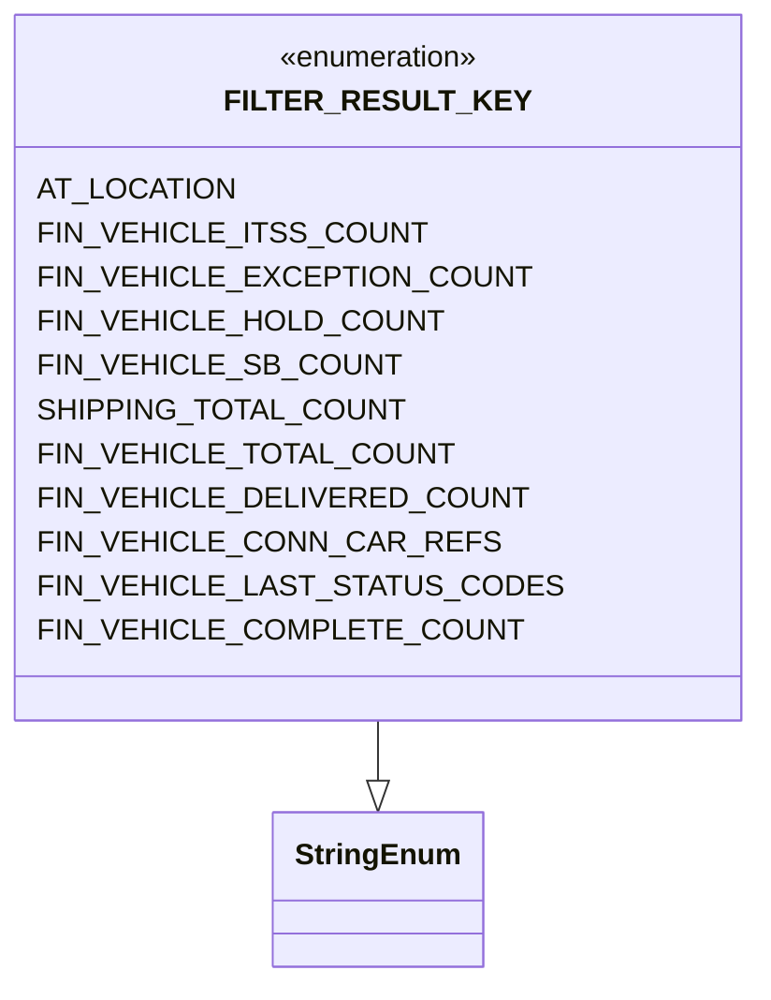

# Diagram: common/fv/python/fv/filterresult/lookup.py


> Auto-generated by Obscura crawlers

## Diagram 1



### SVG

<svg id="container" width="356.375" xmlns="http://www.w3.org/2000/svg" class="classDiagram" height="534" viewBox="0 0 356.375 534" role="graphics-document document" aria-roledescription="class"><style>#container{font-family:"trebuchet ms",verdana,arial,sans-serif;font-size:16px;fill:#333;}@keyframes edge-animation-frame{from{stroke-dashoffset:0;}}@keyframes dash{to{stroke-dashoffset:0;}}#container .edge-animation-slow{stroke-dasharray:9,5!important;stroke-dashoffset:900;animation:dash 50s linear infinite;stroke-linecap:round;}#container .edge-animation-fast{stroke-dasharray:9,5!important;stroke-dashoffset:900;animation:dash 20s linear infinite;stroke-linecap:round;}#container .error-icon{fill:#552222;}#container .error-text{fill:#552222;stroke:#552222;}#container .edge-thickness-normal{stroke-width:1px;}#container .edge-thickness-thick{stroke-width:3.5px;}#container .edge-pattern-solid{stroke-dasharray:0;}#container .edge-thickness-invisible{stroke-width:0;fill:none;}#container .edge-pattern-dashed{stroke-dasharray:3;}#container .edge-pattern-dotted{stroke-dasharray:2;}#container .marker{fill:#333333;stroke:#333333;}#container .marker.cross{stroke:#333333;}#container svg{font-family:"trebuchet ms",verdana,arial,sans-serif;font-size:16px;}#container p{margin:0;}#container g.classGroup text{fill:#9370DB;stroke:none;font-family:"trebuchet ms",verdana,arial,sans-serif;font-size:10px;}#container g.classGroup text .title{font-weight:bolder;}#container .nodeLabel,#container .edgeLabel{color:#131300;}#container .edgeLabel .label rect{fill:#ECECFF;}#container .label text{fill:#131300;}#container .labelBkg{background:#ECECFF;}#container .edgeLabel .label span{background:#ECECFF;}#container .classTitle{font-weight:bolder;}#container .node rect,#container .node circle,#container .node ellipse,#container .node polygon,#container .node path{fill:#ECECFF;stroke:#9370DB;stroke-width:1px;}#container .divider{stroke:#9370DB;stroke-width:1;}#container g.clickable{cursor:pointer;}#container g.classGroup rect{fill:#ECECFF;stroke:#9370DB;}#container g.classGroup line{stroke:#9370DB;stroke-width:1;}#container .classLabel .box{stroke:none;stroke-width:0;fill:#ECECFF;opacity:0.5;}#container .classLabel .label{fill:#9370DB;font-size:10px;}#container .relation{stroke:#333333;stroke-width:1;fill:none;}#container .dashed-line{stroke-dasharray:3;}#container .dotted-line{stroke-dasharray:1 2;}#container #compositionStart,#container .composition{fill:#333333!important;stroke:#333333!important;stroke-width:1;}#container #compositionEnd,#container .composition{fill:#333333!important;stroke:#333333!important;stroke-width:1;}#container #dependencyStart,#container .dependency{fill:#333333!important;stroke:#333333!important;stroke-width:1;}#container #dependencyStart,#container .dependency{fill:#333333!important;stroke:#333333!important;stroke-width:1;}#container #extensionStart,#container .extension{fill:transparent!important;stroke:#333333!important;stroke-width:1;}#container #extensionEnd,#container .extension{fill:transparent!important;stroke:#333333!important;stroke-width:1;}#container #aggregationStart,#container .aggregation{fill:transparent!important;stroke:#333333!important;stroke-width:1;}#container #aggregationEnd,#container .aggregation{fill:transparent!important;stroke:#333333!important;stroke-width:1;}#container #lollipopStart,#container .lollipop{fill:#ECECFF!important;stroke:#333333!important;stroke-width:1;}#container #lollipopEnd,#container .lollipop{fill:#ECECFF!important;stroke:#333333!important;stroke-width:1;}#container .edgeTerminals{font-size:11px;line-height:initial;}#container .classTitleText{text-anchor:middle;font-size:18px;fill:#333;}#container .label-icon{display:inline-block;height:1em;overflow:visible;vertical-align:-0.125em;}#container .node .label-icon path{fill:currentColor;stroke:revert;stroke-width:revert;}#container :root{--mermaid-font-family:"trebuchet ms",verdana,arial,sans-serif;}</style><g><defs><marker id="container_class-aggregationStart" class="marker aggregation class" refX="18" refY="7" markerWidth="190" markerHeight="240" orient="auto"><path d="M 18,7 L9,13 L1,7 L9,1 Z"></path></marker></defs><defs><marker id="container_class-aggregationEnd" class="marker aggregation class" refX="1" refY="7" markerWidth="20" markerHeight="28" orient="auto"><path d="M 18,7 L9,13 L1,7 L9,1 Z"></path></marker></defs><defs><marker id="container_class-extensionStart" class="marker extension class" refX="18" refY="7" markerWidth="190" markerHeight="240" orient="auto"><path d="M 1,7 L18,13 V 1 Z"></path></marker></defs><defs><marker id="container_class-extensionEnd" class="marker extension class" refX="1" refY="7" markerWidth="20" markerHeight="28" orient="auto"><path d="M 1,1 V 13 L18,7 Z"></path></marker></defs><defs><marker id="container_class-compositionStart" class="marker composition class" refX="18" refY="7" markerWidth="190" markerHeight="240" orient="auto"><path d="M 18,7 L9,13 L1,7 L9,1 Z"></path></marker></defs><defs><marker id="container_class-compositionEnd" class="marker composition class" refX="1" refY="7" markerWidth="20" markerHeight="28" orient="auto"><path d="M 18,7 L9,13 L1,7 L9,1 Z"></path></marker></defs><defs><marker id="container_class-dependencyStart" class="marker dependency class" refX="6" refY="7" markerWidth="190" markerHeight="240" orient="auto"><path d="M 5,7 L9,13 L1,7 L9,1 Z"></path></marker></defs><defs><marker id="container_class-dependencyEnd" class="marker dependency class" refX="13" refY="7" markerWidth="20" markerHeight="28" orient="auto"><path d="M 18,7 L9,13 L14,7 L9,1 Z"></path></marker></defs><defs><marker id="container_class-lollipopStart" class="marker lollipop class" refX="13" refY="7" markerWidth="190" markerHeight="240" orient="auto"><circle stroke="black" fill="transparent" cx="7" cy="7" r="6"></circle></marker></defs><defs><marker id="container_class-lollipopEnd" class="marker lollipop class" refX="1" refY="7" markerWidth="190" markerHeight="240" orient="auto"><circle stroke="black" fill="transparent" cx="7" cy="7" r="6"></circle></marker></defs><g class="root"><g class="clusters"></g><g class="edgePaths"><path d="M178.188,392L178.188,396.167C178.188,400.333,178.188,408.667,178.188,414.125C178.188,419.583,178.188,422.167,178.188,423.458L178.188,424.75" id="id_FILTER_RESULT_KEY_StringEnum_1" class="edge-thickness-normal edge-pattern-solid relation" style=";;;" data-edge="true" data-et="edge" data-id="id_FILTER_RESULT_KEY_StringEnum_1" data-points="W3sieCI6MTc4LjE4NzUsInkiOjM5Mn0seyJ4IjoxNzguMTg3NSwieSI6NDE3fSx7IngiOjE3OC4xODc1LCJ5Ijo0NDJ9XQ==" marker-end="url(#container_class-extensionEnd)"></path></g><g class="edgeLabels"><g class="edgeLabel"><g class="label" data-id="id_FILTER_RESULT_KEY_StringEnum_1" transform="translate(0, 0)"><foreignObject width="0" height="0"><div xmlns="http://www.w3.org/1999/xhtml" class="labelBkg" style="display: table-cell; white-space: nowrap; line-height: 1.5; max-width: 200px; text-align: center;"><span class="edgeLabel"></span></div></foreignObject></g></g></g><g class="nodes"><g class="node default" id="classId-StringEnum-0" transform="translate(178.1875, 484)"><g class="basic label-container"><path d="M-54.234375 -42 L54.234375 -42 L54.234375 42 L-54.234375 42" stroke="none" stroke-width="0" fill="#ECECFF" style=""></path><path d="M-54.234375 -42 C-22.12454063612033 -42, 9.985293727759341 -42, 54.234375 -42 M-54.234375 -42 C-22.33039791806759 -42, 9.57357916386482 -42, 54.234375 -42 M54.234375 -42 C54.234375 -19.738397570273083, 54.234375 2.523204859453834, 54.234375 42 M54.234375 -42 C54.234375 -13.139319432587765, 54.234375 15.72136113482447, 54.234375 42 M54.234375 42 C24.471936079468684 42, -5.290502841062633 42, -54.234375 42 M54.234375 42 C11.947874062803606 42, -30.338626874392787 42, -54.234375 42 M-54.234375 42 C-54.234375 13.54875668795507, -54.234375 -14.90248662408986, -54.234375 -42 M-54.234375 42 C-54.234375 20.924117662924015, -54.234375 -0.15176467415196981, -54.234375 -42" stroke="#9370DB" stroke-width="1.3" fill="none" stroke-dasharray="0 0" style=""></path></g><g class="annotation-group text" transform="translate(0, -18)"></g><g class="label-group text" transform="translate(-42.234375, -18)"><g class="label" style="font-weight: bolder" transform="translate(0,-12)"><foreignObject width="84.46875" height="24"><div xmlns="http://www.w3.org/1999/xhtml" style="display: table-cell; white-space: nowrap; line-height: 1.5; max-width: 134px; text-align: center;"><span class="nodeLabel markdown-node-label" style=""><p>StringEnum</p></span></div></foreignObject></g></g><g class="members-group text" transform="translate(-42.234375, 30)"></g><g class="methods-group text" transform="translate(-42.234375, 60)"></g><g class="divider" style=""><path d="M-54.234375 6 C-17.082386122228122 6, 20.069602755543755 6, 54.234375 6 M-54.234375 6 C-11.55971818427151 6, 31.11493863145698 6, 54.234375 6" stroke="#9370DB" stroke-width="1.3" fill="none" stroke-dasharray="0 0" style=""></path></g><g class="divider" style=""><path d="M-54.234375 24 C-20.689025380729575 24, 12.85632423854085 24, 54.234375 24 M-54.234375 24 C-11.268768024507317 24, 31.696838950985367 24, 54.234375 24" stroke="#9370DB" stroke-width="1.3" fill="none" stroke-dasharray="0 0" style=""></path></g></g><g class="node default" id="classId-FILTER_RESULT_KEY-1" transform="translate(178.1875, 200)"><g class="basic label-container"><path d="M-170.1875 -192 L170.1875 -192 L170.1875 192 L-170.1875 192" stroke="none" stroke-width="0" fill="#ECECFF" style=""></path><path d="M-170.1875 -192 C-72.98286738695771 -192, 24.221765226084585 -192, 170.1875 -192 M-170.1875 -192 C-90.76235215995548 -192, -11.337204319910967 -192, 170.1875 -192 M170.1875 -192 C170.1875 -64.90703643227168, 170.1875 62.18592713545664, 170.1875 192 M170.1875 -192 C170.1875 -40.13669310279397, 170.1875 111.72661379441206, 170.1875 192 M170.1875 192 C97.49732288548016 192, 24.807145770960318 192, -170.1875 192 M170.1875 192 C65.13130811320653 192, -39.92488377358694 192, -170.1875 192 M-170.1875 192 C-170.1875 74.29113585983201, -170.1875 -43.41772828033598, -170.1875 -192 M-170.1875 192 C-170.1875 112.43600375774382, -170.1875 32.87200751548764, -170.1875 -192" stroke="#9370DB" stroke-width="1.3" fill="none" stroke-dasharray="0 0" style=""></path></g><g class="annotation-group text" transform="translate(-55.5546875, -168)"><g class="label" style="" transform="translate(0,-12)"><foreignObject width="111.109375" height="24"><div xmlns="http://www.w3.org/1999/xhtml" style="display: table-cell; white-space: nowrap; line-height: 1.5; max-width: 161px; text-align: center;"><span class="nodeLabel markdown-node-label" style=""><p>«enumeration»</p></span></div></foreignObject></g></g><g class="label-group text" transform="translate(-71.484375, -144)"><g class="label" style="font-weight: bolder" transform="translate(0,-12)"><foreignObject width="142.96875" height="24"><div xmlns="http://www.w3.org/1999/xhtml" style="display: table-cell; white-space: nowrap; line-height: 1.5; max-width: 191px; text-align: center;"><span class="nodeLabel markdown-node-label" style=""><p>FILTER_RESULT_KEY</p></span></div></foreignObject></g></g><g class="members-group text" transform="translate(-158.1875, -96)"><g class="label" style="" transform="translate(0,-12)"><foreignObject width="94.8125" height="24"><div xmlns="http://www.w3.org/1999/xhtml" style="display: table-cell; white-space: nowrap; line-height: 1.5; max-width: 145px; text-align: center;"><span class="nodeLabel markdown-node-label" style=""><p>AT_LOCATION</p></span></div></foreignObject></g><g class="label" style="" transform="translate(0,12)"><foreignObject width="184.515625" height="24"><div xmlns="http://www.w3.org/1999/xhtml" style="display: table-cell; white-space: nowrap; line-height: 1.5; max-width: 235px; text-align: center;"><span class="nodeLabel markdown-node-label" style=""><p>FIN_VEHICLE_ITSS_COUNT</p></span></div></foreignObject></g><g class="label" style="" transform="translate(0,36)"><foreignObject width="233.46875" height="24"><div xmlns="http://www.w3.org/1999/xhtml" style="display: table-cell; white-space: nowrap; line-height: 1.5; max-width: 284px; text-align: center;"><span class="nodeLabel markdown-node-label" style=""><p>FIN_VEHICLE_EXCEPTION_COUNT</p></span></div></foreignObject></g><g class="label" style="" transform="translate(0,60)"><foreignObject width="194.671875" height="24"><div xmlns="http://www.w3.org/1999/xhtml" style="display: table-cell; white-space: nowrap; line-height: 1.5; max-width: 245px; text-align: center;"><span class="nodeLabel markdown-node-label" style=""><p>FIN_VEHICLE_HOLD_COUNT</p></span></div></foreignObject></g><g class="label" style="" transform="translate(0,84)"><foreignObject width="172.890625" height="24"><div xmlns="http://www.w3.org/1999/xhtml" style="display: table-cell; white-space: nowrap; line-height: 1.5; max-width: 224px; text-align: center;"><span class="nodeLabel markdown-node-label" style=""><p>FIN_VEHICLE_SB_COUNT</p></span></div></foreignObject></g><g class="label" style="" transform="translate(0,108)"><foreignObject width="176.203125" height="24"><div xmlns="http://www.w3.org/1999/xhtml" style="display: table-cell; white-space: nowrap; line-height: 1.5; max-width: 227px; text-align: center;"><span class="nodeLabel markdown-node-label" style=""><p>SHIPPING_TOTAL_COUNT</p></span></div></foreignObject></g><g class="label" style="" transform="translate(0,132)"><foreignObject width="197.109375" height="24"><div xmlns="http://www.w3.org/1999/xhtml" style="display: table-cell; white-space: nowrap; line-height: 1.5; max-width: 248px; text-align: center;"><span class="nodeLabel markdown-node-label" style=""><p>FIN_VEHICLE_TOTAL_COUNT</p></span></div></foreignObject></g><g class="label" style="" transform="translate(0,156)"><foreignObject width="232" height="24"><div xmlns="http://www.w3.org/1999/xhtml" style="display: table-cell; white-space: nowrap; line-height: 1.5; max-width: 283px; text-align: center;"><span class="nodeLabel markdown-node-label" style=""><p>FIN_VEHICLE_DELIVERED_COUNT</p></span></div></foreignObject></g><g class="label" style="" transform="translate(0,180)"><foreignObject width="217.125" height="24"><div xmlns="http://www.w3.org/1999/xhtml" style="display: table-cell; white-space: nowrap; line-height: 1.5; max-width: 267px; text-align: center;"><span class="nodeLabel markdown-node-label" style=""><p>FIN_VEHICLE_CONN_CAR_REFS</p></span></div></foreignObject></g><g class="label" style="" transform="translate(0,204)"><foreignObject width="244.890625" height="24"><div xmlns="http://www.w3.org/1999/xhtml" style="display: table-cell; white-space: nowrap; line-height: 1.5; max-width: 295px; text-align: center;"><span class="nodeLabel markdown-node-label" style=""><p>FIN_VEHICLE_LAST_STATUS_CODES</p></span></div></foreignObject></g><g class="label" style="" transform="translate(0,228)"><foreignObject width="229.140625" height="24"><div xmlns="http://www.w3.org/1999/xhtml" style="display: table-cell; white-space: nowrap; line-height: 1.5; max-width: 280px; text-align: center;"><span class="nodeLabel markdown-node-label" style=""><p>FIN_VEHICLE_COMPLETE_COUNT</p></span></div></foreignObject></g></g><g class="methods-group text" transform="translate(-158.1875, 192)"></g><g class="divider" style=""><path d="M-170.1875 -120 C-64.82351039042243 -120, 40.540479219155145 -120, 170.1875 -120 M-170.1875 -120 C-84.55969581570574 -120, 1.0681083685885255 -120, 170.1875 -120" stroke="#9370DB" stroke-width="1.3" fill="none" stroke-dasharray="0 0" style=""></path></g><g class="divider" style=""><path d="M-170.1875 168 C-71.33116690428483 168, 27.525166191430344 168, 170.1875 168 M-170.1875 168 C-64.39710401299922 168, 41.393291974001556 168, 170.1875 168" stroke="#9370DB" stroke-width="1.3" fill="none" stroke-dasharray="0 0" style=""></path></g></g></g></g></g></svg>

## Diagram 2

```mermaid
flowchart TD
  Start([start]) --> CheckEvent{event and event.requestContext?}
  CheckEvent -- No --> QueryDB[Prepare query & log\ncursor.mogrify -> execute -> fetchone]
  CheckEvent -- Yes --> CheckAuthorizer{requestContext.authorizer present?}
  CheckAuthorizer -- No --> QueryDB
  CheckAuthorizer -- Yes --> GetAuthorizer[authorizer = requestContext.authorizer]
  GetAuthorizer --> GetEmail[user_email = authorizer.email]
  GetEmail --> IsCachedUser{user_email == "cacheduser@fv.com"?}
  IsCachedUser -- Yes --> CacheRefresh[log info: force cache refresh\nreturn None, False]
  IsCachedUser -- No --> QueryDB
  QueryDB --> HasResult{result and result.query_function_result?}
  HasResult -- Yes --> ReturnResult[return result.query_function_result, True]
  HasResult -- No --> ReturnNone[return None, False]
  CacheRefresh --> End([end])
  ReturnResult --> End
  ReturnNone --> End
```

> SVG rendering failed for this diagram.
