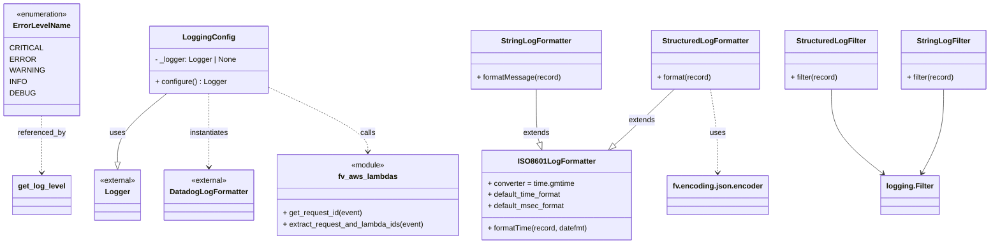

# Diagram: common/fv/python/fv/log.py


> Auto-generated by Obscura crawlers

## Diagram 1



> SVG rendering failed for this diagram.

## Diagram 2

```mermaid
flowchart TD
    A[Entry: AWS Lambda or local run] --> B{is_logging_enabled(context)}
    B -- false --> C[Skip custom logger; use powertools]
    B -- true --> D[Obtain Logger via LoggingConfig.configure()]
    D --> E[Logger.structure_logs(append=True)]
    D --> F[utils.copy_config_to_registered_loggers(source_logger)]
    D --> G[logger.setLevel(LOG_LEVEL)]
    E --> H[append request_id via fv.aws.lambdas.get_request_id(event)]
    H --> I[logger.append_keys(request_id)]
    I --> J[Invoke wrapped function]
    subgraph configure_logging_flow
        K[configure_logging(...)] --> L[Clear root handlers]
        L --> M[Set root log level]
        M --> N[Create Structured Handler]
        M --> O[Create String Handler]
        N --> P[StructuredLogFormatter + StructuredLogFilter]
        O --> Q[StringLogFormatter + StringLogFilter]
        P --> R[root_logger.addHandler(structured_handler)]
        Q --> S[root_logger.addHandler(string_handler)]
    end
    J --> K
    J --> T[make_log_record(...) builds standard record]
    T --> U[log_with_stack(...) optionally append stack trace]
    U --> V[append_fv_request_ids(event, logger)]
```

> SVG rendering failed for this diagram.
