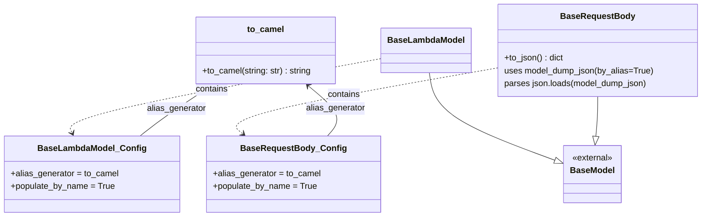

# Diagram: common/fv/python/fv/model/base.py

> Auto-generated by Obscura crawlers

## Mermaid

```mermaid
classDiagram
class BaseModel <<external>>
class to_camel {
  +to_camel(string: str) string
}
class BaseLambdaModel {
}
class BaseLambdaModel_Config {
  +alias_generator = to_camel
  +populate_by_name = True
}
class BaseRequestBody {
  +to_json() dict
}
class BaseRequestBody_Config {
  +alias_generator = to_camel
  +populate_by_name = True
}
BaseLambdaModel --|> BaseModel
BaseRequestBody --|> BaseModel
BaseLambdaModel ..> BaseLambdaModel_Config : contains
BaseRequestBody ..> BaseRequestBody_Config : contains
to_camel <-- BaseLambdaModel_Config : alias_generator
to_camel <-- BaseRequestBody_Config : alias_generator
BaseRequestBody : uses model_dump_json(by_alias=True)
BaseRequestBody : parses json.loads(model_dump_json)
```

> SVG rendering failed for this diagram.
