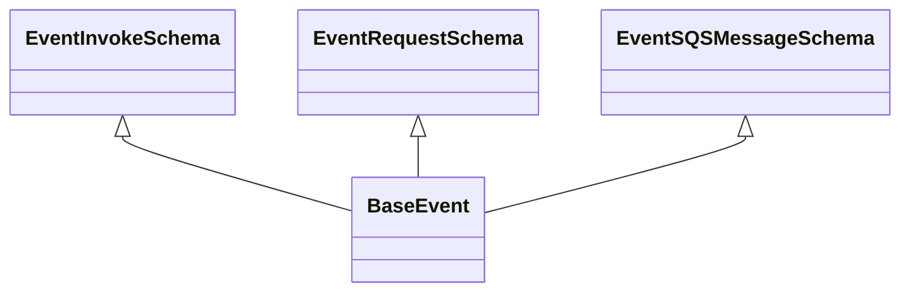

# Diagram: common/fv/python/fv/model/lambdas/base_event.py

> Auto-generated by Obscura crawlers

## Mermaid

### SVG

<svg id="container" width="681.109375" xmlns="http://www.w3.org/2000/svg" class="classDiagram" height="234" viewBox="0 0 681.109375 234" role="graphics-document document" aria-roledescription="class"><g><defs><marker id="container_class-aggregationStart" class="marker aggregation class" refX="18" refY="7" markerWidth="190" markerHeight="240" orient="auto"><path d="M 18,7 L9,13 L1,7 L9,1 Z"></path></marker></defs><defs><marker id="container_class-aggregationEnd" class="marker aggregation class" refX="1" refY="7" markerWidth="20" markerHeight="28" orient="auto"><path d="M 18,7 L9,13 L1,7 L9,1 Z"></path></marker></defs><defs><marker id="container_class-extensionStart" class="marker extension class" refX="18" refY="7" markerWidth="190" markerHeight="240" orient="auto"><path d="M 1,7 L18,13 V 1 Z"></path></marker></defs><defs><marker id="container_class-extensionEnd" class="marker extension class" refX="1" refY="7" markerWidth="20" markerHeight="28" orient="auto"><path d="M 1,1 V 13 L18,7 Z"></path></marker></defs><defs><marker id="container_class-compositionStart" class="marker composition class" refX="18" refY="7" markerWidth="190" markerHeight="240" orient="auto"><path d="M 18,7 L9,13 L1,7 L9,1 Z"></path></marker></defs><defs><marker id="container_class-compositionEnd" class="marker composition class" refX="1" refY="7" markerWidth="20" markerHeight="28" orient="auto"><path d="M 18,7 L9,13 L1,7 L9,1 Z"></path></marker></defs><defs><marker id="container_class-dependencyStart" class="marker dependency class" refX="6" refY="7" markerWidth="190" markerHeight="240" orient="auto"><path d="M 5,7 L9,13 L1,7 L9,1 Z"></path></marker></defs><defs><marker id="container_class-dependencyEnd" class="marker dependency class" refX="13" refY="7" markerWidth="20" markerHeight="28" orient="auto"><path d="M 18,7 L9,13 L14,7 L9,1 Z"></path></marker></defs><defs><marker id="container_class-lollipopStart" class="marker lollipop class" refX="13" refY="7" markerWidth="190" markerHeight="240" orient="auto"><circle stroke="black" fill="transparent" cx="7" cy="7" r="6"></circle></marker></defs><defs><marker id="container_class-lollipopEnd" class="marker lollipop class" refX="1" refY="7" markerWidth="190" markerHeight="240" orient="auto"><circle stroke="black" fill="transparent" cx="7" cy="7" r="6"></circle></marker></defs><g class="root"><g class="clusters"></g><g class="edgePaths"><path d="M93.148,109.25L93.148,110.542C93.148,111.833,93.148,114.417,122.513,124.417C151.878,134.417,210.607,151.834,239.971,160.542L269.336,169.251" id="id_EventInvokeSchema_BaseEvent_1" class="edge-thickness-normal edge-pattern-solid relation" style=";;;" data-edge="true" data-et="edge" data-id="id_EventInvokeSchema_BaseEvent_1" data-points="W3sieCI6OTMuMTQ4NDM3NSwieSI6OTJ9LHsieCI6OTMuMTQ4NDM3NSwieSI6MTE3fSx7IngiOjI2OS4zMzU5Mzc1LCJ5IjoxNjkuMjUwNjM5NzM5OTU0MzV9XQ==" marker-start="url(#container_class-extensionStart)"></path><path d="M319.07,109.25L319.07,110.542C319.07,111.833,319.07,114.417,319.07,119.875C319.07,125.333,319.07,133.667,319.07,137.833L319.07,142" id="id_EventRequestSchema_BaseEvent_2" class="edge-thickness-normal edge-pattern-solid relation" style=";;;" data-edge="true" data-et="edge" data-id="id_EventRequestSchema_BaseEvent_2" data-points="W3sieCI6MzE5LjA3MDMxMjUsInkiOjkyfSx7IngiOjMxOS4wNzAzMTI1LCJ5IjoxMTd9LHsieCI6MzE5LjA3MDMxMjUsInkiOjE0Mn1d" marker-start="url(#container_class-extensionStart)"></path><path d="M566.477,109.25L566.477,110.542C566.477,111.833,566.477,114.417,533.531,124.63C500.586,134.844,434.695,152.688,401.75,161.61L368.805,170.531" id="id_EventSQSMessageSchema_BaseEvent_3" class="edge-thickness-normal edge-pattern-solid relation" style=";;;" data-edge="true" data-et="edge" data-id="id_EventSQSMessageSchema_BaseEvent_3" data-points="W3sieCI6NTY2LjQ3NjU2MjUsInkiOjkyfSx7IngiOjU2Ni40NzY1NjI1LCJ5IjoxMTd9LHsieCI6MzY4LjgwNDY4NzUsInkiOjE3MC41MzE0NTEzMDczMTMzOH1d" marker-start="url(#container_class-extensionStart)"></path></g><g class="edgeLabels"><g class="edgeLabel"><g class="label" data-id="id_EventInvokeSchema_BaseEvent_1" transform="translate(0, 0)"><foreignObject width="0" height="0">

</foreignObject></g></g><g class="edgeLabel"><g class="label" data-id="id_EventRequestSchema_BaseEvent_2" transform="translate(0, 0)"><foreignObject width="0" height="0">

</foreignObject></g></g><g class="edgeLabel"><g class="label" data-id="id_EventSQSMessageSchema_BaseEvent_3" transform="translate(0, 0)"><foreignObject width="0" height="0">

</foreignObject></g></g></g><g class="nodes"><g class="node default" id="classId-EventInvokeSchema-0" transform="translate(93.1484375, 50)"><g class="basic label-container"><path d="M-85.1484375 -42 L85.1484375 -42 L85.1484375 42 L-85.1484375 42" stroke="none" stroke-width="0" fill="#ECECFF" style=""></path><path d="M-85.1484375 -42 C-35.63711981497623 -42, 13.874197870047539 -42, 85.1484375 -42 M-85.1484375 -42 C-23.564252332085545 -42, 38.01993283582891 -42, 85.1484375 -42 M85.1484375 -42 C85.1484375 -20.18081527899361, 85.1484375 1.638369442012781, 85.1484375 42 M85.1484375 -42 C85.1484375 -23.307720399418994, 85.1484375 -4.615440798837987, 85.1484375 42 M85.1484375 42 C33.81255238394264 42, -17.523332732114724 42, -85.1484375 42 M85.1484375 42 C49.55784003722343 42, 13.967242574446857 42, -85.1484375 42 M-85.1484375 42 C-85.1484375 20.28277735108986, -85.1484375 -1.4344452978202824, -85.1484375 -42 M-85.1484375 42 C-85.1484375 18.54494369580359, -85.1484375 -4.910112608392822, -85.1484375 -42" stroke="#9370DB" stroke-width="1.3" fill="none" stroke-dasharray="0 0" style=""></path></g><g class="annotation-group text" transform="translate(0, -18)"></g><g class="label-group text" transform="translate(-73.1484375, -18)"><g class="label" style="font-weight: bolder" transform="translate(0,-12)"><foreignObject width="146.296875" height="24">

EventInvokeSchema

</foreignObject></g></g><g class="members-group text" transform="translate(-73.1484375, 30)"></g><g class="methods-group text" transform="translate(-73.1484375, 60)"></g><g class="divider" style=""><path d="M-85.1484375 6 C-26.44165962308776 6, 32.26511825382448 6, 85.1484375 6 M-85.1484375 6 C-33.06699439121749 6, 19.014448717565017 6, 85.1484375 6" stroke="#9370DB" stroke-width="1.3" fill="none" stroke-dasharray="0 0" style=""></path></g><g class="divider" style=""><path d="M-85.1484375 24 C-35.38215199159568 24, 14.384133516808646 24, 85.1484375 24 M-85.1484375 24 C-39.729973633616865 24, 5.68849023276627 24, 85.1484375 24" stroke="#9370DB" stroke-width="1.3" fill="none" stroke-dasharray="0 0" style=""></path></g></g><g class="node default" id="classId-EventRequestSchema-1" transform="translate(319.0703125, 50)"><g class="basic label-container"><path d="M-90.7734375 -42 L90.7734375 -42 L90.7734375 42 L-90.7734375 42" stroke="none" stroke-width="0" fill="#ECECFF" style=""></path><path d="M-90.7734375 -42 C-38.916238236981464 -42, 12.940961026037073 -42, 90.7734375 -42 M-90.7734375 -42 C-48.46590815975933 -42, -6.15837881951866 -42, 90.7734375 -42 M90.7734375 -42 C90.7734375 -13.835356479687707, 90.7734375 14.329287040624585, 90.7734375 42 M90.7734375 -42 C90.7734375 -8.701254877892538, 90.7734375 24.597490244214924, 90.7734375 42 M90.7734375 42 C43.523620849099615 42, -3.7261958018007704 42, -90.7734375 42 M90.7734375 42 C39.72288642468587 42, -11.327664650628265 42, -90.7734375 42 M-90.7734375 42 C-90.7734375 16.498192107161106, -90.7734375 -9.003615785677788, -90.7734375 -42 M-90.7734375 42 C-90.7734375 11.937272018516417, -90.7734375 -18.125455962967166, -90.7734375 -42" stroke="#9370DB" stroke-width="1.3" fill="none" stroke-dasharray="0 0" style=""></path></g><g class="annotation-group text" transform="translate(0, -18)"></g><g class="label-group text" transform="translate(-78.7734375, -18)"><g class="label" style="font-weight: bolder" transform="translate(0,-12)"><foreignObject width="157.546875" height="24">

EventRequestSchema

</foreignObject></g></g><g class="members-group text" transform="translate(-78.7734375, 30)"></g><g class="methods-group text" transform="translate(-78.7734375, 60)"></g><g class="divider" style=""><path d="M-90.7734375 6 C-43.03616398594607 6, 4.701109528107864 6, 90.7734375 6 M-90.7734375 6 C-35.807787595029424 6, 19.15786230994115 6, 90.7734375 6" stroke="#9370DB" stroke-width="1.3" fill="none" stroke-dasharray="0 0" style=""></path></g><g class="divider" style=""><path d="M-90.7734375 24 C-21.707379622113862 24, 47.358678255772276 24, 90.7734375 24 M-90.7734375 24 C-49.197209150657336 24, -7.620980801314673 24, 90.7734375 24" stroke="#9370DB" stroke-width="1.3" fill="none" stroke-dasharray="0 0" style=""></path></g></g><g class="node default" id="classId-EventSQSMessageSchema-2" transform="translate(566.4765625, 50)"><g class="basic label-container"><path d="M-106.6328125 -42 L106.6328125 -42 L106.6328125 42 L-106.6328125 42" stroke="none" stroke-width="0" fill="#ECECFF" style=""></path><path d="M-106.6328125 -42 C-33.118435663643154 -42, 40.39594117271369 -42, 106.6328125 -42 M-106.6328125 -42 C-27.459897305711067 -42, 51.713017888577866 -42, 106.6328125 -42 M106.6328125 -42 C106.6328125 -17.851983480362584, 106.6328125 6.296033039274832, 106.6328125 42 M106.6328125 -42 C106.6328125 -22.53044887047059, 106.6328125 -3.0608977409411793, 106.6328125 42 M106.6328125 42 C26.606212762760705 42, -53.42038697447859 42, -106.6328125 42 M106.6328125 42 C51.81508484793514 42, -3.002642804129721 42, -106.6328125 42 M-106.6328125 42 C-106.6328125 8.801771288961795, -106.6328125 -24.39645742207641, -106.6328125 -42 M-106.6328125 42 C-106.6328125 13.524504892114813, -106.6328125 -14.950990215770375, -106.6328125 -42" stroke="#9370DB" stroke-width="1.3" fill="none" stroke-dasharray="0 0" style=""></path></g><g class="annotation-group text" transform="translate(0, -18)"></g><g class="label-group text" transform="translate(-94.6328125, -18)"><g class="label" style="font-weight: bolder" transform="translate(0,-12)"><foreignObject width="189.265625" height="24">

EventSQSMessageSchema

</foreignObject></g></g><g class="members-group text" transform="translate(-94.6328125, 30)"></g><g class="methods-group text" transform="translate(-94.6328125, 60)"></g><g class="divider" style=""><path d="M-106.6328125 6 C-36.97296565640532 6, 32.68688118718936 6, 106.6328125 6 M-106.6328125 6 C-27.731160744578972 6, 51.170491010842056 6, 106.6328125 6" stroke="#9370DB" stroke-width="1.3" fill="none" stroke-dasharray="0 0" style=""></path></g><g class="divider" style=""><path d="M-106.6328125 24 C-24.99509772246951 24, 56.64261705506098 24, 106.6328125 24 M-106.6328125 24 C-38.74460627891894 24, 29.143599942162126 24, 106.6328125 24" stroke="#9370DB" stroke-width="1.3" fill="none" stroke-dasharray="0 0" style=""></path></g></g><g class="node default" id="classId-BaseEvent-3" transform="translate(319.0703125, 184)"><g class="basic label-container"><path d="M-49.734375 -42 L49.734375 -42 L49.734375 42 L-49.734375 42" stroke="none" stroke-width="0" fill="#ECECFF" style=""></path><path d="M-49.734375 -42 C-18.74952447380432 -42, 12.235326052391358 -42, 49.734375 -42 M-49.734375 -42 C-19.45553972708156 -42, 10.823295545836878 -42, 49.734375 -42 M49.734375 -42 C49.734375 -10.883114730336992, 49.734375 20.233770539326017, 49.734375 42 M49.734375 -42 C49.734375 -15.811266135038899, 49.734375 10.377467729922202, 49.734375 42 M49.734375 42 C13.417667907342924 42, -22.89903918531415 42, -49.734375 42 M49.734375 42 C24.283604574940966 42, -1.1671658501180673 42, -49.734375 42 M-49.734375 42 C-49.734375 15.973465277948375, -49.734375 -10.05306944410325, -49.734375 -42 M-49.734375 42 C-49.734375 9.37074641352634, -49.734375 -23.25850717294732, -49.734375 -42" stroke="#9370DB" stroke-width="1.3" fill="none" stroke-dasharray="0 0" style=""></path></g><g class="annotation-group text" transform="translate(0, -18)"></g><g class="label-group text" transform="translate(-37.734375, -18)"><g class="label" style="font-weight: bolder" transform="translate(0,-12)"><foreignObject width="75.46875" height="24">

BaseEvent

</foreignObject></g></g><g class="members-group text" transform="translate(-37.734375, 30)"></g><g class="methods-group text" transform="translate(-37.734375, 60)"></g><g class="divider" style=""><path d="M-49.734375 6 C-20.73696714457806 6, 8.26044071084388 6, 49.734375 6 M-49.734375 6 C-18.08846358466938 6, 13.55744783066124 6, 49.734375 6" stroke="#9370DB" stroke-width="1.3" fill="none" stroke-dasharray="0 0" style=""></path></g><g class="divider" style=""><path d="M-49.734375 24 C-11.48589370047943 24, 26.76258759904114 24, 49.734375 24 M-49.734375 24 C-22.394164606649497 24, 4.946045786701006 24, 49.734375 24" stroke="#9370DB" stroke-width="1.3" fill="none" stroke-dasharray="0 0" style=""></path></g></g></g></g></g></svg>
