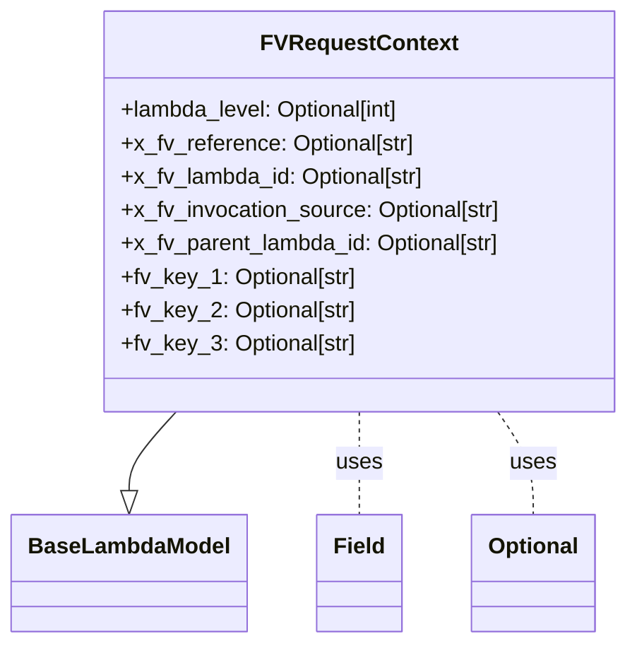
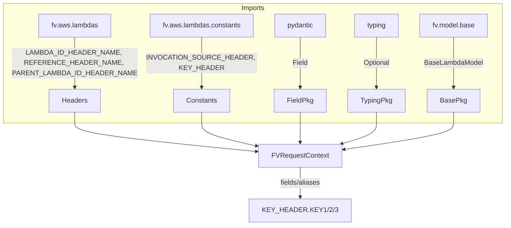

# Diagram: common/fv/python/fv/model/lambdas/base_request_context.py

> Auto-generated by Obscura crawlers

## Diagram 1

### SVG

<svg id="container" width="442.11328125" xmlns="http://www.w3.org/2000/svg" class="classDiagram" height="462" viewBox="0 0 442.11328125 462" role="graphics-document document" aria-roledescription="class"><g><defs><marker id="container_class-aggregationStart" class="marker aggregation class" refX="18" refY="7" markerWidth="190" markerHeight="240" orient="auto"><path d="M 18,7 L9,13 L1,7 L9,1 Z"></path></marker></defs><defs><marker id="container_class-aggregationEnd" class="marker aggregation class" refX="1" refY="7" markerWidth="20" markerHeight="28" orient="auto"><path d="M 18,7 L9,13 L1,7 L9,1 Z"></path></marker></defs><defs><marker id="container_class-extensionStart" class="marker extension class" refX="18" refY="7" markerWidth="190" markerHeight="240" orient="auto"><path d="M 1,7 L18,13 V 1 Z"></path></marker></defs><defs><marker id="container_class-extensionEnd" class="marker extension class" refX="1" refY="7" markerWidth="20" markerHeight="28" orient="auto"><path d="M 1,1 V 13 L18,7 Z"></path></marker></defs><defs><marker id="container_class-compositionStart" class="marker composition class" refX="18" refY="7" markerWidth="190" markerHeight="240" orient="auto"><path d="M 18,7 L9,13 L1,7 L9,1 Z"></path></marker></defs><defs><marker id="container_class-compositionEnd" class="marker composition class" refX="1" refY="7" markerWidth="20" markerHeight="28" orient="auto"><path d="M 18,7 L9,13 L1,7 L9,1 Z"></path></marker></defs><defs><marker id="container_class-dependencyStart" class="marker dependency class" refX="6" refY="7" markerWidth="190" markerHeight="240" orient="auto"><path d="M 5,7 L9,13 L1,7 L9,1 Z"></path></marker></defs><defs><marker id="container_class-dependencyEnd" class="marker dependency class" refX="13" refY="7" markerWidth="20" markerHeight="28" orient="auto"><path d="M 18,7 L9,13 L14,7 L9,1 Z"></path></marker></defs><defs><marker id="container_class-lollipopStart" class="marker lollipop class" refX="13" refY="7" markerWidth="190" markerHeight="240" orient="auto"><circle stroke="black" fill="transparent" cx="7" cy="7" r="6"></circle></marker></defs><defs><marker id="container_class-lollipopEnd" class="marker lollipop class" refX="1" refY="7" markerWidth="190" markerHeight="240" orient="auto"><circle stroke="black" fill="transparent" cx="7" cy="7" r="6"></circle></marker></defs><g class="root"><g class="clusters"></g><g class="edgePaths"><path d="M122.049,296L116.575,302.167C111.101,308.333,100.152,320.667,94.677,330.125C89.203,339.583,89.203,346.167,89.203,349.458L89.203,352.75" id="id_FVRequestContext_BaseLambdaModel_1" class="edge-thickness-normal edge-pattern-solid relation" style=";;;" data-edge="true" data-et="edge" data-id="id_FVRequestContext_BaseLambdaModel_1" data-points="W3sieCI6MTIyLjA0OTI0ODk2NDA4ODM5LCJ5IjoyOTZ9LHsieCI6ODkuMjAzMTI1LCJ5IjozMzN9LHsieCI6ODkuMjAzMTI1LCJ5IjozNzB9XQ==" marker-end="url(#container_class-extensionEnd)"></path><path d="M249.883,296L249.883,302.167C249.883,308.333,249.883,320.667,249.883,333C249.883,345.333,249.883,357.667,249.883,363.833L249.883,370" id="id_FVRequestContext_Field_2" class="edge-thickness-normal edge-pattern-dashed relation" style=";;;" data-edge="true" data-et="edge" data-id="id_FVRequestContext_Field_2" data-points="W3sieCI6MjQ5Ljg4MjgxMjUsInkiOjI5Nn0seyJ4IjoyNDkuODgyODEyNSwieSI6MzMzfSx7IngiOjI0OS44ODI4MTI1LCJ5IjozNzB9XQ=="></path><path d="M347.814,296L352.008,302.167C356.201,308.333,364.589,320.667,368.783,333C372.977,345.333,372.977,357.667,372.977,363.833L372.977,370" id="id_FVRequestContext_Optional_3" class="edge-thickness-normal edge-pattern-dashed relation" style=";;;" data-edge="true" data-et="edge" data-id="id_FVRequestContext_Optional_3" data-points="W3sieCI6MzQ3LjgxMzc1MTcyNjUxOTM0LCJ5IjoyOTZ9LHsieCI6MzcyLjk3NjU2MjUsInkiOjMzM30seyJ4IjozNzIuOTc2NTYyNSwieSI6MzcwfV0="></path></g><g class="edgeLabels"><g class="edgeLabel"><g class="label" data-id="id_FVRequestContext_BaseLambdaModel_1" transform="translate(0, 0)"><foreignObject width="0" height="0">

</foreignObject></g></g><g class="edgeLabel" transform="translate(249.8828125, 333)"><g class="label" data-id="id_FVRequestContext_Field_2" transform="translate(-16.4921875, -12)"><foreignObject width="32.984375" height="24">

uses

</foreignObject></g></g><g class="edgeLabel" transform="translate(372.9765625, 333)"><g class="label" data-id="id_FVRequestContext_Optional_3" transform="translate(-16.4921875, -12)"><foreignObject width="32.984375" height="24">

uses

</foreignObject></g></g></g><g class="nodes"><g class="node default" id="classId-FVRequestContext-0" transform="translate(249.8828125, 152)"><g class="basic label-container"><path d="M-184.23046875 -144 L184.23046875 -144 L184.23046875 144 L-184.23046875 144" stroke="none" stroke-width="0" fill="#ECECFF" style=""></path><path d="M-184.23046875 -144 C-49.32181867191889 -144, 85.58683140616222 -144, 184.23046875 -144 M-184.23046875 -144 C-94.51716524847788 -144, -4.803861746955761 -144, 184.23046875 -144 M184.23046875 -144 C184.23046875 -85.95145093797485, 184.23046875 -27.90290187594971, 184.23046875 144 M184.23046875 -144 C184.23046875 -38.017920525081436, 184.23046875 67.96415894983713, 184.23046875 144 M184.23046875 144 C109.41554830845988 144, 34.60062786691975 144, -184.23046875 144 M184.23046875 144 C44.97980839768442 144, -94.27085195463115 144, -184.23046875 144 M-184.23046875 144 C-184.23046875 66.60282973977503, -184.23046875 -10.794340520449936, -184.23046875 -144 M-184.23046875 144 C-184.23046875 72.03940557325457, -184.23046875 0.07881114650913901, -184.23046875 -144" stroke="#9370DB" stroke-width="1.3" fill="none" stroke-dasharray="0 0" style=""></path></g><g class="annotation-group text" transform="translate(0, -120)"></g><g class="label-group text" transform="translate(-66.6015625, -120)"><g class="label" style="font-weight: bolder" transform="translate(0,-12)"><foreignObject width="133.203125" height="24">

FVRequestContext

</foreignObject></g></g><g class="members-group text" transform="translate(-172.23046875, -72)"><g class="label" style="" transform="translate(0,-12)"><foreignObject width="206.609375" height="24">

+lambda_level: Optional[int]

</foreignObject></g><g class="label" style="" transform="translate(0,12)"><foreignObject width="213.0625" height="24">

+x_fv_reference: Optional[str]

</foreignObject></g><g class="label" style="" transform="translate(0,36)"><foreignObject width="221.921875" height="24">

+x_fv_lambda_id: Optional[str]

</foreignObject></g><g class="label" style="" transform="translate(0,60)"><foreignObject width="277.203125" height="24">

+x_fv_invocation_source: Optional[str]

</foreignObject></g><g class="label" style="" transform="translate(0,84)"><foreignObject width="277.859375" height="24">

+x_fv_parent_lambda_id: Optional[str]

</foreignObject></g><g class="label" style="" transform="translate(0,108)"><foreignObject width="167.1875" height="24">

+fv_key_1: Optional[str]

</foreignObject></g><g class="label" style="" transform="translate(0,132)"><foreignObject width="169.78125" height="24">

+fv_key_2: Optional[str]

</foreignObject></g><g class="label" style="" transform="translate(0,156)"><foreignObject width="169.84375" height="24">

+fv_key_3: Optional[str]

</foreignObject></g></g><g class="methods-group text" transform="translate(-172.23046875, 144)"></g><g class="divider" style=""><path d="M-184.23046875 -96 C-104.23013202720826 -96, -24.229795304416513 -96, 184.23046875 -96 M-184.23046875 -96 C-99.37894564582176 -96, -14.527422541643517 -96, 184.23046875 -96" stroke="#9370DB" stroke-width="1.3" fill="none" stroke-dasharray="0 0" style=""></path></g><g class="divider" style=""><path d="M-184.23046875 120 C-57.64529725605793 120, 68.93987423788414 120, 184.23046875 120 M-184.23046875 120 C-87.05893901655976 120, 10.112590716880476 120, 184.23046875 120" stroke="#9370DB" stroke-width="1.3" fill="none" stroke-dasharray="0 0" style=""></path></g></g><g class="node default" id="classId-BaseLambdaModel-1" transform="translate(89.203125, 412)"><g class="basic label-container"><path d="M-81.203125 -42 L81.203125 -42 L81.203125 42 L-81.203125 42" stroke="none" stroke-width="0" fill="#ECECFF" style=""></path><path d="M-81.203125 -42 C-30.556658608634002 -42, 20.089807782731995 -42, 81.203125 -42 M-81.203125 -42 C-20.475381684291385 -42, 40.25236163141723 -42, 81.203125 -42 M81.203125 -42 C81.203125 -21.65323343601581, 81.203125 -1.3064668720316206, 81.203125 42 M81.203125 -42 C81.203125 -23.636596356323366, 81.203125 -5.273192712646733, 81.203125 42 M81.203125 42 C30.867063828897884 42, -19.468997342204233 42, -81.203125 42 M81.203125 42 C46.85194273662045 42, 12.500760473240902 42, -81.203125 42 M-81.203125 42 C-81.203125 16.424348786263824, -81.203125 -9.151302427472352, -81.203125 -42 M-81.203125 42 C-81.203125 10.646557223917462, -81.203125 -20.706885552165076, -81.203125 -42" stroke="#9370DB" stroke-width="1.3" fill="none" stroke-dasharray="0 0" style=""></path></g><g class="annotation-group text" transform="translate(0, -18)"></g><g class="label-group text" transform="translate(-69.203125, -18)"><g class="label" style="font-weight: bolder" transform="translate(0,-12)"><foreignObject width="138.40625" height="24">

BaseLambdaModel

</foreignObject></g></g><g class="members-group text" transform="translate(-69.203125, 30)"></g><g class="methods-group text" transform="translate(-69.203125, 60)"></g><g class="divider" style=""><path d="M-81.203125 6 C-22.446153972978315 6, 36.31081705404337 6, 81.203125 6 M-81.203125 6 C-20.155944019606927 6, 40.891236960786145 6, 81.203125 6" stroke="#9370DB" stroke-width="1.3" fill="none" stroke-dasharray="0 0" style=""></path></g><g class="divider" style=""><path d="M-81.203125 24 C-38.21778045647521 24, 4.767564087049578 24, 81.203125 24 M-81.203125 24 C-36.70508995351486 24, 7.792945092970285 24, 81.203125 24" stroke="#9370DB" stroke-width="1.3" fill="none" stroke-dasharray="0 0" style=""></path></g></g><g class="node default" id="classId-Field-2" transform="translate(249.8828125, 412)"><g class="basic label-container"><path d="M-29.4765625 -42 L29.4765625 -42 L29.4765625 42 L-29.4765625 42" stroke="none" stroke-width="0" fill="#ECECFF" style=""></path><path d="M-29.4765625 -42 C-8.84575613717491 -42, 11.785050225650181 -42, 29.4765625 -42 M-29.4765625 -42 C-13.520397316964896 -42, 2.435767866070208 -42, 29.4765625 -42 M29.4765625 -42 C29.4765625 -9.062109849851922, 29.4765625 23.875780300296157, 29.4765625 42 M29.4765625 -42 C29.4765625 -15.245442095128713, 29.4765625 11.509115809742575, 29.4765625 42 M29.4765625 42 C17.517966147251038 42, 5.559369794502079 42, -29.4765625 42 M29.4765625 42 C15.842127650880466 42, 2.207692801760931 42, -29.4765625 42 M-29.4765625 42 C-29.4765625 19.274386959641983, -29.4765625 -3.451226080716033, -29.4765625 -42 M-29.4765625 42 C-29.4765625 15.532027776683922, -29.4765625 -10.935944446632156, -29.4765625 -42" stroke="#9370DB" stroke-width="1.3" fill="none" stroke-dasharray="0 0" style=""></path></g><g class="annotation-group text" transform="translate(0, -18)"></g><g class="label-group text" transform="translate(-17.4765625, -18)"><g class="label" style="font-weight: bolder" transform="translate(0,-12)"><foreignObject width="34.953125" height="24">

Field

</foreignObject></g></g><g class="members-group text" transform="translate(-17.4765625, 30)"></g><g class="methods-group text" transform="translate(-17.4765625, 60)"></g><g class="divider" style=""><path d="M-29.4765625 6 C-17.624997091416923 6, -5.773431682833845 6, 29.4765625 6 M-29.4765625 6 C-16.00913653378182 6, -2.5417105675636407 6, 29.4765625 6" stroke="#9370DB" stroke-width="1.3" fill="none" stroke-dasharray="0 0" style=""></path></g><g class="divider" style=""><path d="M-29.4765625 24 C-12.469661004676244 24, 4.537240490647513 24, 29.4765625 24 M-29.4765625 24 C-16.184140583398385 24, -2.89171866679677 24, 29.4765625 24" stroke="#9370DB" stroke-width="1.3" fill="none" stroke-dasharray="0 0" style=""></path></g></g><g class="node default" id="classId-Optional-3" transform="translate(372.9765625, 412)"><g class="basic label-container"><path d="M-43.6171875 -42 L43.6171875 -42 L43.6171875 42 L-43.6171875 42" stroke="none" stroke-width="0" fill="#ECECFF" style=""></path><path d="M-43.6171875 -42 C-23.091703970420646 -42, -2.566220440841292 -42, 43.6171875 -42 M-43.6171875 -42 C-25.882618260316107 -42, -8.148049020632214 -42, 43.6171875 -42 M43.6171875 -42 C43.6171875 -20.91462581387829, 43.6171875 0.17074837224342332, 43.6171875 42 M43.6171875 -42 C43.6171875 -22.872976301314175, 43.6171875 -3.74595260262835, 43.6171875 42 M43.6171875 42 C13.71761684374107 42, -16.18195381251786 42, -43.6171875 42 M43.6171875 42 C17.200196599824693 42, -9.216794300350614 42, -43.6171875 42 M-43.6171875 42 C-43.6171875 19.73269298880772, -43.6171875 -2.5346140223845595, -43.6171875 -42 M-43.6171875 42 C-43.6171875 20.679911858413927, -43.6171875 -0.6401762831721456, -43.6171875 -42" stroke="#9370DB" stroke-width="1.3" fill="none" stroke-dasharray="0 0" style=""></path></g><g class="annotation-group text" transform="translate(0, -18)"></g><g class="label-group text" transform="translate(-31.6171875, -18)"><g class="label" style="font-weight: bolder" transform="translate(0,-12)"><foreignObject width="63.234375" height="24">

Optional

</foreignObject></g></g><g class="members-group text" transform="translate(-31.6171875, 30)"></g><g class="methods-group text" transform="translate(-31.6171875, 60)"></g><g class="divider" style=""><path d="M-43.6171875 6 C-16.608039929665917 6, 10.401107640668165 6, 43.6171875 6 M-43.6171875 6 C-17.98152050745271 6, 7.654146485094579 6, 43.6171875 6" stroke="#9370DB" stroke-width="1.3" fill="none" stroke-dasharray="0 0" style=""></path></g><g class="divider" style=""><path d="M-43.6171875 24 C-15.193622090513124 24, 13.229943318973753 24, 43.6171875 24 M-43.6171875 24 C-14.72655635070214 24, 14.16407479859572 24, 43.6171875 24" stroke="#9370DB" stroke-width="1.3" fill="none" stroke-dasharray="0 0" style=""></path></g></g></g></g></g></svg>

## Diagram 2

### SVG

<svg id="container" width="1136.0703125" xmlns="http://www.w3.org/2000/svg" class="flowchart" height="528" viewBox="0 0 1136.0703125 528" role="graphics-document document" aria-roledescription="flowchart-v2"><g><marker id="container_flowchart-v2-pointEnd" class="marker flowchart-v2" viewBox="0 0 10 10" refX="5" refY="5" markerUnits="userSpaceOnUse" markerWidth="8" markerHeight="8" orient="auto"><path d="M 0 0 L 10 5 L 0 10 z" class="arrowMarkerPath" style="stroke-width: 1; stroke-dasharray: 1, 0;"></path></marker><marker id="container_flowchart-v2-pointStart" class="marker flowchart-v2" viewBox="0 0 10 10" refX="4.5" refY="5" markerUnits="userSpaceOnUse" markerWidth="8" markerHeight="8" orient="auto"><path d="M 0 5 L 10 10 L 10 0 z" class="arrowMarkerPath" style="stroke-width: 1; stroke-dasharray: 1, 0;"></path></marker><marker id="container_flowchart-v2-circleEnd" class="marker flowchart-v2" viewBox="0 0 10 10" refX="11" refY="5" markerUnits="userSpaceOnUse" markerWidth="11" markerHeight="11" orient="auto"><circle cx="5" cy="5" r="5" class="arrowMarkerPath" style="stroke-width: 1; stroke-dasharray: 1, 0;"></circle></marker><marker id="container_flowchart-v2-circleStart" class="marker flowchart-v2" viewBox="0 0 10 10" refX="-1" refY="5" markerUnits="userSpaceOnUse" markerWidth="11" markerHeight="11" orient="auto"><circle cx="5" cy="5" r="5" class="arrowMarkerPath" style="stroke-width: 1; stroke-dasharray: 1, 0;"></circle></marker><marker id="container_flowchart-v2-crossEnd" class="marker cross flowchart-v2" viewBox="0 0 11 11" refX="12" refY="5.2" markerUnits="userSpaceOnUse" markerWidth="11" markerHeight="11" orient="auto"><path d="M 1,1 l 9,9 M 10,1 l -9,9" class="arrowMarkerPath" style="stroke-width: 2; stroke-dasharray: 1, 0;"></path></marker><marker id="container_flowchart-v2-crossStart" class="marker cross flowchart-v2" viewBox="0 0 11 11" refX="-1" refY="5.2" markerUnits="userSpaceOnUse" markerWidth="11" markerHeight="11" orient="auto"><path d="M 1,1 l 9,9 M 10,1 l -9,9" class="arrowMarkerPath" style="stroke-width: 2; stroke-dasharray: 1, 0;"></path></marker><g class="root"><g class="clusters"><g class="cluster" id="Imports" data-look="classic"><rect style="" x="8" y="8" width="1120.0703125" height="280"></rect><g class="cluster-label" transform="translate(539.67578125, 8)"><foreignObject width="56.71875" height="24">

Imports

</foreignObject></g></g></g><g class="edgePaths"><path d="M157.352,87L157.352,97.167C157.352,107.333,157.352,127.667,157.352,147.333C157.352,167,157.352,186,157.352,195.5L157.352,205" id="L_A_Headers_0" class="edge-thickness-normal edge-pattern-solid edge-thickness-normal edge-pattern-solid flowchart-link" style=";" data-edge="true" data-et="edge" data-id="L_A_Headers_0" data-points="W3sieCI6MTU3LjM1MTU2MjUsInkiOjg3fSx7IngiOjE1Ny4zNTE1NjI1LCJ5IjoxNDh9LHsieCI6MTU3LjM1MTU2MjUsInkiOjIwOX1d" marker-end="url(#container_flowchart-v2-pointEnd)"></path><path d="M420.133,87L420.133,97.167C420.133,107.333,420.133,127.667,420.133,147.333C420.133,167,420.133,186,420.133,195.5L420.133,205" id="L_B_Constants_0" class="edge-thickness-normal edge-pattern-solid edge-thickness-normal edge-pattern-solid flowchart-link" style=";" data-edge="true" data-et="edge" data-id="L_B_Constants_0" data-points="W3sieCI6NDIwLjEzMjgxMjUsInkiOjg3fSx7IngiOjQyMC4xMzI4MTI1LCJ5IjoxNDh9LHsieCI6NDIwLjEzMjgxMjUsInkiOjIwOX1d" marker-end="url(#container_flowchart-v2-pointEnd)"></path><path d="M653.633,87L653.633,97.167C653.633,107.333,653.633,127.667,653.633,147.333C653.633,167,653.633,186,653.633,195.5L653.633,205" id="L_C_FieldPkg_0" class="edge-thickness-normal edge-pattern-solid edge-thickness-normal edge-pattern-solid flowchart-link" style=";" data-edge="true" data-et="edge" data-id="L_C_FieldPkg_0" data-points="W3sieCI6NjUzLjYzMjgxMjUsInkiOjg3fSx7IngiOjY1My42MzI4MTI1LCJ5IjoxNDh9LHsieCI6NjUzLjYzMjgxMjUsInkiOjIwOX1d" marker-end="url(#container_flowchart-v2-pointEnd)"></path><path d="M829.977,87L829.977,97.167C829.977,107.333,829.977,127.667,829.977,147.333C829.977,167,829.977,186,829.977,195.5L829.977,205" id="L_D_TypingPkg_0" class="edge-thickness-normal edge-pattern-solid edge-thickness-normal edge-pattern-solid flowchart-link" style=";" data-edge="true" data-et="edge" data-id="L_D_TypingPkg_0" data-points="W3sieCI6ODI5Ljk3NjU2MjUsInkiOjg3fSx7IngiOjgyOS45NzY1NjI1LCJ5IjoxNDh9LHsieCI6ODI5Ljk3NjU2MjUsInkiOjIwOX1d" marker-end="url(#container_flowchart-v2-pointEnd)"></path><path d="M1012.844,87L1012.844,97.167C1012.844,107.333,1012.844,127.667,1012.844,147.333C1012.844,167,1012.844,186,1012.844,195.5L1012.844,205" id="L_E_BasePkg_0" class="edge-thickness-normal edge-pattern-solid edge-thickness-normal edge-pattern-solid flowchart-link" style=";" data-edge="true" data-et="edge" data-id="L_E_BasePkg_0" data-points="W3sieCI6MTAxMi44NDM3NSwieSI6ODd9LHsieCI6MTAxMi44NDM3NSwieSI6MTQ4fSx7IngiOjEwMTIuODQzNzUsInkiOjIwOX1d" marker-end="url(#container_flowchart-v2-pointEnd)"></path><path d="M157.352,263L157.352,267.167C157.352,271.333,157.352,279.667,157.352,288C157.352,296.333,157.352,304.667,223.504,315.765C289.656,326.863,421.96,340.725,488.112,347.657L554.264,354.588" id="L_Headers_FVRequestContextClass_0" class="edge-thickness-normal edge-pattern-solid edge-thickness-normal edge-pattern-solid flowchart-link" style=";" data-edge="true" data-et="edge" data-id="L_Headers_FVRequestContextClass_0" data-points="W3sieCI6MTU3LjM1MTU2MjUsInkiOjI2M30seyJ4IjoxNTcuMzUxNTYyNSwieSI6Mjg4fSx7IngiOjE1Ny4zNTE1NjI1LCJ5IjozMTN9LHsieCI6NTU4LjI0MjE4NzUsInkiOjM1NS4wMDUwMzc0NjYxNTQ1M31d" marker-end="url(#container_flowchart-v2-pointEnd)"></path><path d="M420.133,263L420.133,267.167C420.133,271.333,420.133,279.667,420.133,288C420.133,296.333,420.133,304.667,442.5,313.815C464.868,322.962,509.603,332.925,531.97,337.906L554.338,342.887" id="L_Constants_FVRequestContextClass_0" class="edge-thickness-normal edge-pattern-solid edge-thickness-normal edge-pattern-solid flowchart-link" style=";" data-edge="true" data-et="edge" data-id="L_Constants_FVRequestContextClass_0" data-points="W3sieCI6NDIwLjEzMjgxMjUsInkiOjI2M30seyJ4Ijo0MjAuMTMyODEyNSwieSI6Mjg4fSx7IngiOjQyMC4xMzI4MTI1LCJ5IjozMTN9LHsieCI6NTU4LjI0MjE4NzUsInkiOjM0My43NTY2OTE2NDg4MjIyNX1d" marker-end="url(#container_flowchart-v2-pointEnd)"></path><path d="M653.633,263L653.633,267.167C653.633,271.333,653.633,279.667,653.633,288C653.633,296.333,653.633,304.667,653.633,312.333C653.633,320,653.633,327,653.633,330.5L653.633,334" id="L_FieldPkg_FVRequestContextClass_0" class="edge-thickness-normal edge-pattern-solid edge-thickness-normal edge-pattern-solid flowchart-link" style=";" data-edge="true" data-et="edge" data-id="L_FieldPkg_FVRequestContextClass_0" data-points="W3sieCI6NjUzLjYzMjgxMjUsInkiOjI2M30seyJ4Ijo2NTMuNjMyODEyNSwieSI6Mjg4fSx7IngiOjY1My42MzI4MTI1LCJ5IjozMTN9LHsieCI6NjUzLjYzMjgxMjUsInkiOjMzOH1d" marker-end="url(#container_flowchart-v2-pointEnd)"></path><path d="M829.977,263L829.977,267.167C829.977,271.333,829.977,279.667,829.977,288C829.977,296.333,829.977,304.667,816.486,312.811C802.995,320.956,776.014,328.912,762.523,332.891L749.033,336.869" id="L_TypingPkg_FVRequestContextClass_0" class="edge-thickness-normal edge-pattern-solid edge-thickness-normal edge-pattern-solid flowchart-link" style=";" data-edge="true" data-et="edge" data-id="L_TypingPkg_FVRequestContextClass_0" data-points="W3sieCI6ODI5Ljk3NjU2MjUsInkiOjI2M30seyJ4Ijo4MjkuOTc2NTYyNSwieSI6Mjg4fSx7IngiOjgyOS45NzY1NjI1LCJ5IjozMTN9LHsieCI6NzQ1LjE5NTkxMzQ2MTUzODUsInkiOjMzOH1d" marker-end="url(#container_flowchart-v2-pointEnd)"></path><path d="M1012.844,263L1012.844,267.167C1012.844,271.333,1012.844,279.667,1012.844,288C1012.844,296.333,1012.844,304.667,969.533,315.103C926.223,325.539,839.603,338.079,796.292,344.348L752.982,350.618" id="L_BasePkg_FVRequestContextClass_0" class="edge-thickness-normal edge-pattern-solid edge-thickness-normal edge-pattern-solid flowchart-link" style=";" data-edge="true" data-et="edge" data-id="L_BasePkg_FVRequestContextClass_0" data-points="W3sieCI6MTAxMi44NDM3NSwieSI6MjYzfSx7IngiOjEwMTIuODQzNzUsInkiOjI4OH0seyJ4IjoxMDEyLjg0Mzc1LCJ5IjozMTN9LHsieCI6NzQ5LjAyMzQzNzUsInkiOjM1MS4xOTEwODcyMzU0NzcxfV0=" marker-end="url(#container_flowchart-v2-pointEnd)"></path><path d="M653.633,392L653.633,398.167C653.633,404.333,653.633,416.667,653.633,428.333C653.633,440,653.633,451,653.633,456.5L653.633,462" id="L_FVRequestContextClass_KEY_HEADER_0" class="edge-thickness-normal edge-pattern-solid edge-thickness-normal edge-pattern-solid flowchart-link" style=";" data-edge="true" data-et="edge" data-id="L_FVRequestContextClass_KEY_HEADER_0" data-points="W3sieCI6NjUzLjYzMjgxMjUsInkiOjM5Mn0seyJ4Ijo2NTMuNjMyODEyNSwieSI6NDI5fSx7IngiOjY1My42MzI4MTI1LCJ5Ijo0NjZ9XQ==" marker-end="url(#container_flowchart-v2-pointEnd)"></path></g><g class="edgeLabels"><g class="edgeLabel" transform="translate(157.3515625, 148)"><g class="label" data-id="L_A_Headers_0" transform="translate(-129.3515625, -36)"><foreignObject width="258.703125" height="72">

LAMBDA_ID_HEADER_NAME, REFERENCE_HEADER_NAME, PARENT_LAMBDA_ID_HEADER_NAME

</foreignObject></g></g><g class="edgeLabel" transform="translate(420.1328125, 148)"><g class="label" data-id="L_B_Constants_0" transform="translate(-113.4296875, -24)"><foreignObject width="226.859375" height="48">

INVOCATION_SOURCE_HEADER, KEY_HEADER

</foreignObject></g></g><g class="edgeLabel" transform="translate(653.6328125, 148)"><g class="label" data-id="L_C_FieldPkg_0" transform="translate(-17.359375, -12)"><foreignObject width="34.71875" height="24">

Field

</foreignObject></g></g><g class="edgeLabel" transform="translate(829.9765625, 148)"><g class="label" data-id="L_D_TypingPkg_0" transform="translate(-31.4140625, -12)"><foreignObject width="62.828125" height="24">

Optional

</foreignObject></g></g><g class="edgeLabel" transform="translate(1012.84375, 148)"><g class="label" data-id="L_E_BasePkg_0" transform="translate(-68.6171875, -12)"><foreignObject width="137.234375" height="24">

BaseLambdaModel

</foreignObject></g></g><g class="edgeLabel"><g class="label" data-id="L_Headers_FVRequestContextClass_0" transform="translate(0, 0)"><foreignObject width="0" height="0">

</foreignObject></g></g><g class="edgeLabel"><g class="label" data-id="L_Constants_FVRequestContextClass_0" transform="translate(0, 0)"><foreignObject width="0" height="0">

</foreignObject></g></g><g class="edgeLabel"><g class="label" data-id="L_FieldPkg_FVRequestContextClass_0" transform="translate(0, 0)"><foreignObject width="0" height="0">

</foreignObject></g></g><g class="edgeLabel"><g class="label" data-id="L_TypingPkg_FVRequestContextClass_0" transform="translate(0, 0)"><foreignObject width="0" height="0">

</foreignObject></g></g><g class="edgeLabel"><g class="label" data-id="L_BasePkg_FVRequestContextClass_0" transform="translate(0, 0)"><foreignObject width="0" height="0">

</foreignObject></g></g><g class="edgeLabel" transform="translate(653.6328125, 429)"><g class="label" data-id="L_FVRequestContextClass_KEY_HEADER_0" transform="translate(-48.5234375, -12)"><foreignObject width="97.046875" height="24">

fields/aliases

</foreignObject></g></g></g><g class="nodes"><g class="node default" id="flowchart-A-0" transform="translate(157.3515625, 60)"><rect class="basic label-container" style="" x="-84.9765625" y="-27" width="169.953125" height="54"></rect><g class="label" style="" transform="translate(-54.9765625, -12)"><rect></rect><foreignObject width="109.953125" height="24">

fv.aws.lambdas

</foreignObject></g></g><g class="node default" id="flowchart-Headers-1" transform="translate(157.3515625, 236)"><rect class="basic label-container" style="" x="-59.921875" y="-27" width="119.84375" height="54"></rect><g class="label" style="" transform="translate(-29.921875, -12)"><rect></rect><foreignObject width="59.84375" height="24">

Headers

</foreignObject></g></g><g class="node default" id="flowchart-B-2" transform="translate(420.1328125, 60)"><rect class="basic label-container" style="" x="-122.078125" y="-27" width="244.15625" height="54"></rect><g class="label" style="" transform="translate(-92.078125, -12)"><rect></rect><foreignObject width="184.15625" height="24">

fv.aws.lambdas.constants

</foreignObject></g></g><g class="node default" id="flowchart-Constants-3" transform="translate(420.1328125, 236)"><rect class="basic label-container" style="" x="-65.9140625" y="-27" width="131.828125" height="54"></rect><g class="label" style="" transform="translate(-35.9140625, -12)"><rect></rect><foreignObject width="71.828125" height="24">

Constants

</foreignObject></g></g><g class="node default" id="flowchart-C-4" transform="translate(653.6328125, 60)"><rect class="basic label-container" style="" x="-61.421875" y="-27" width="122.84375" height="54"></rect><g class="label" style="" transform="translate(-31.421875, -12)"><rect></rect><foreignObject width="62.84375" height="24">

pydantic

</foreignObject></g></g><g class="node default" id="flowchart-FieldPkg-5" transform="translate(653.6328125, 236)"><rect class="basic label-container" style="" x="-60.046875" y="-27" width="120.09375" height="54"></rect><g class="label" style="" transform="translate(-30.046875, -12)"><rect></rect><foreignObject width="60.09375" height="24">

FieldPkg

</foreignObject></g></g><g class="node default" id="flowchart-D-6" transform="translate(829.9765625, 60)"><rect class="basic label-container" style="" x="-52.640625" y="-27" width="105.28125" height="54"></rect><g class="label" style="" transform="translate(-22.640625, -12)"><rect></rect><foreignObject width="45.28125" height="24">

typing

</foreignObject></g></g><g class="node default" id="flowchart-TypingPkg-7" transform="translate(829.9765625, 236)"><rect class="basic label-container" style="" x="-66.296875" y="-27" width="132.59375" height="54"></rect><g class="label" style="" transform="translate(-36.296875, -12)"><rect></rect><foreignObject width="72.59375" height="24">

TypingPkg

</foreignObject></g></g><g class="node default" id="flowchart-E-8" transform="translate(1012.84375, 60)"><rect class="basic label-container" style="" x="-80.2265625" y="-27" width="160.453125" height="54"></rect><g class="label" style="" transform="translate(-50.2265625, -12)"><rect></rect><foreignObject width="100.453125" height="24">

fv.model.base

</foreignObject></g></g><g class="node default" id="flowchart-BasePkg-9" transform="translate(1012.84375, 236)"><rect class="basic label-container" style="" x="-59.921875" y="-27" width="119.84375" height="54"></rect><g class="label" style="" transform="translate(-29.921875, -12)"><rect></rect><foreignObject width="59.84375" height="24">

BasePkg

</foreignObject></g></g><g class="node default" id="flowchart-FVRequestContextClass-11" transform="translate(653.6328125, 365)"><rect class="basic label-container" style="" x="-95.390625" y="-27" width="190.78125" height="54"></rect><g class="label" style="" transform="translate(-65.390625, -12)"><rect></rect><foreignObject width="130.78125" height="24">

FVRequestContext

</foreignObject></g></g><g class="node default" id="flowchart-KEY_HEADER-21" transform="translate(653.6328125, 493)"><rect class="basic label-container" style="" x="-109.671875" y="-27" width="219.34375" height="54"></rect><g class="label" style="" transform="translate(-79.671875, -12)"><rect></rect><foreignObject width="159.34375" height="24">

KEY_HEADER.KEY1/2/3

</foreignObject></g></g></g></g></g></svg>
