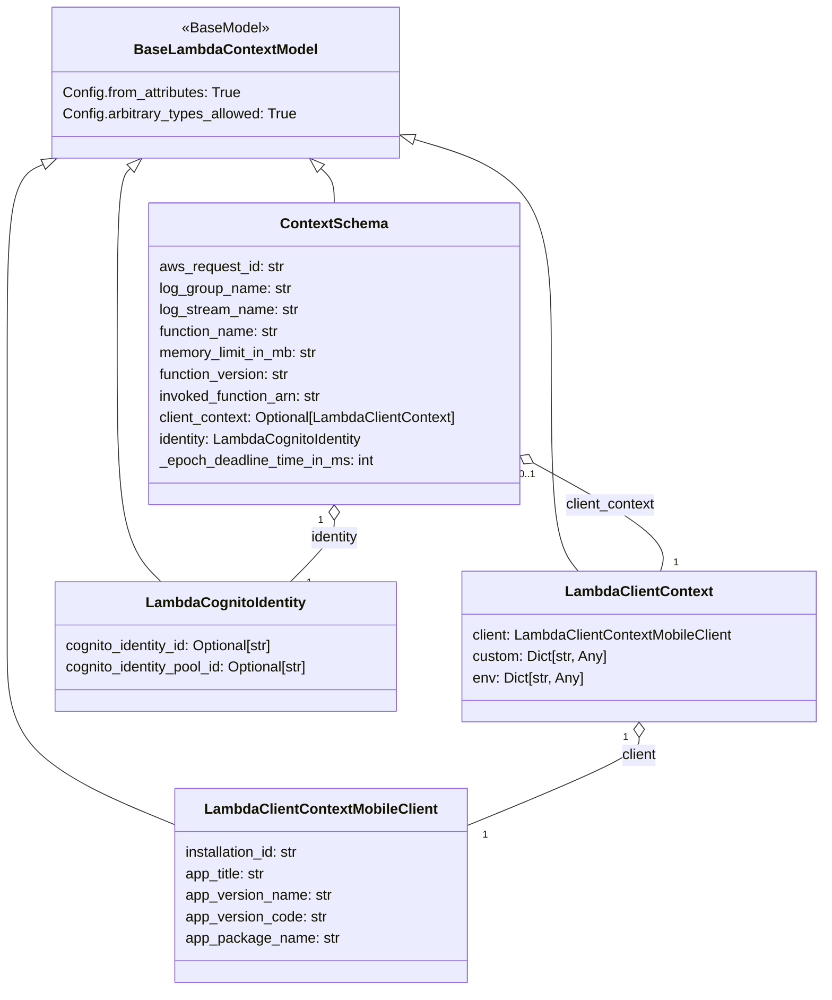

# Diagram: common/fv/python/fv/model/lambdas/context.py

> Auto-generated by Obscura crawlers

## Mermaid

### SVG

<svg id="container" width="929.3198852539062" xmlns="http://www.w3.org/2000/svg" class="classDiagram" height="1102" viewBox="-52.02299880981445 0 929.3198852539062 1102" role="graphics-document document" aria-roledescription="class"><g><defs><marker id="container_class-aggregationStart" class="marker aggregation class" refX="18" refY="7" markerWidth="190" markerHeight="240" orient="auto"><path d="M 18,7 L9,13 L1,7 L9,1 Z"></path></marker></defs><defs><marker id="container_class-aggregationEnd" class="marker aggregation class" refX="1" refY="7" markerWidth="20" markerHeight="28" orient="auto"><path d="M 18,7 L9,13 L1,7 L9,1 Z"></path></marker></defs><defs><marker id="container_class-extensionStart" class="marker extension class" refX="18" refY="7" markerWidth="190" markerHeight="240" orient="auto"><path d="M 1,7 L18,13 V 1 Z"></path></marker></defs><defs><marker id="container_class-extensionEnd" class="marker extension class" refX="1" refY="7" markerWidth="20" markerHeight="28" orient="auto"><path d="M 1,1 V 13 L18,7 Z"></path></marker></defs><defs><marker id="container_class-compositionStart" class="marker composition class" refX="18" refY="7" markerWidth="190" markerHeight="240" orient="auto"><path d="M 18,7 L9,13 L1,7 L9,1 Z"></path></marker></defs><defs><marker id="container_class-compositionEnd" class="marker composition class" refX="1" refY="7" markerWidth="20" markerHeight="28" orient="auto"><path d="M 18,7 L9,13 L1,7 L9,1 Z"></path></marker></defs><defs><marker id="container_class-dependencyStart" class="marker dependency class" refX="6" refY="7" markerWidth="190" markerHeight="240" orient="auto"><path d="M 5,7 L9,13 L1,7 L9,1 Z"></path></marker></defs><defs><marker id="container_class-dependencyEnd" class="marker dependency class" refX="13" refY="7" markerWidth="20" markerHeight="28" orient="auto"><path d="M 18,7 L9,13 L14,7 L9,1 Z"></path></marker></defs><defs><marker id="container_class-lollipopStart" class="marker lollipop class" refX="13" refY="7" markerWidth="190" markerHeight="240" orient="auto"><circle stroke="black" fill="transparent" cx="7" cy="7" r="6"></circle></marker></defs><defs><marker id="container_class-lollipopEnd" class="marker lollipop class" refX="1" refY="7" markerWidth="190" markerHeight="240" orient="auto"><circle stroke="black" fill="transparent" cx="7" cy="7" r="6"></circle></marker></defs><g class="root"><g class="clusters"></g><g class="edgePaths"><path d="M-2.995,182.947L-9.833,185.956C-16.671,188.965,-30.347,194.982,-37.185,230.158C-44.023,265.333,-44.023,329.667,-44.023,396C-44.023,462.333,-44.023,530.667,-44.023,585C-44.023,639.333,-44.023,679.667,-44.023,720C-44.023,760.333,-44.023,800.667,-11.539,834.118C20.945,867.569,85.913,894.139,118.397,907.424L150.881,920.708" id="id_BaseLambdaContextModel_LambdaClientContextMobileClient_1" class="edge-thickness-normal edge-pattern-solid relation" style=";;;" data-edge="true" data-et="edge" data-id="id_BaseLambdaContextModel_LambdaClientContextMobileClient_1" data-points="W3sieCI6MTIuNzkzNjg1NDkzMTE5MjU2LCJ5IjoxNzZ9LHsieCI6LTQ0LjAyMzQzNzUsInkiOjIwMX0seyJ4IjotNDQuMDIzNDM3NSwieSI6Mzk0fSx7IngiOi00NC4wMjM0Mzc1LCJ5Ijo1OTl9LHsieCI6LTQ0LjAyMzQzNzUsInkiOjcyMH0seyJ4IjotNDQuMDIzNDM3NSwieSI6ODQxfSx7IngiOjE1MC44ODA4NTkzNzUsInkiOjkyMC43MDgzNDUwMzkxOTR9XQ==" marker-start="url(#container_class-extensionStart)"></path><path d="M412.548,154.009L438.927,161.84C465.305,169.672,518.062,185.336,544.44,225.335C570.818,265.333,570.818,329.667,570.818,396C570.818,462.333,570.818,530.667,575.905,571C580.992,611.333,591.165,623.667,596.252,629.833L601.339,636" id="id_BaseLambdaContextModel_LambdaClientContext_2" class="edge-thickness-normal edge-pattern-solid relation" style=";;;" data-edge="true" data-et="edge" data-id="id_BaseLambdaContextModel_LambdaClientContext_2" data-points="W3sieCI6Mzk2LjAxMTcxODc1LCJ5IjoxNDkuMDk4ODAwMzA4NTY4MX0seyJ4Ijo1NzAuODE4MzU5Mzc1LCJ5IjoyMDF9LHsieCI6NTcwLjgxODM1OTM3NSwieSI6Mzk0fSx7IngiOjU3MC44MTgzNTkzNzUsInkiOjU5OX0seyJ4Ijo2MDEuMzM4OTM5ODI0MzgwMiwieSI6NjM2fV0=" marker-start="url(#container_class-extensionStart)"></path><path d="M96.512,187.473L93.981,189.728C91.45,191.982,86.388,196.491,83.857,230.912C81.326,265.333,81.326,329.667,81.326,396C81.326,462.333,81.326,530.667,89.586,573C97.845,615.333,114.364,631.667,122.623,639.833L130.882,648" id="id_BaseLambdaContextModel_LambdaCognitoIdentity_3" class="edge-thickness-normal edge-pattern-solid relation" style=";;;" data-edge="true" data-et="edge" data-id="id_BaseLambdaContextModel_LambdaCognitoIdentity_3" data-points="W3sieCI6MTA5LjM5MzM4NDQ2MTAwOTE4LCJ5IjoxNzZ9LHsieCI6ODEuMzI2MTcxODc1LCJ5IjoyMDF9LHsieCI6ODEuMzI2MTcxODc1LCJ5IjozOTR9LHsieCI6ODEuMzI2MTcxODc1LCJ5Ijo1OTl9LHsieCI6MTMwLjg4MjE5OTEyMTkwMDg0LCJ5Ijo2NDh9XQ==" marker-start="url(#container_class-extensionStart)"></path><path d="M310.886,187.473L313.417,189.728C315.948,191.982,321.01,196.491,323.541,202.912C326.072,209.333,326.072,217.667,326.072,221.833L326.072,226" id="id_BaseLambdaContextModel_ContextSchema_4" class="edge-thickness-normal edge-pattern-solid relation" style=";;;" data-edge="true" data-et="edge" data-id="id_BaseLambdaContextModel_ContextSchema_4" data-points="W3sieCI6Mjk4LjAwNTA1MzAzODk5MDgsInkiOjE3Nn0seyJ4IjozMjYuMDcyMjY1NjI1LCJ5IjoyMDF9LHsieCI6MzI2LjA3MjI2NTYyNSwieSI6MjI2fV0=" marker-start="url(#container_class-extensionStart)"></path><path d="M670.629,821.25L670.629,824.542C670.629,827.833,670.629,834.417,637.222,851.16C603.814,867.904,537,894.808,503.593,908.261L470.186,921.713" id="id_LambdaClientContext_LambdaClientContextMobileClient_5" class="edge-thickness-normal edge-pattern-solid relation" style=";;;" data-edge="true" data-et="edge" data-id="id_LambdaClientContext_LambdaClientContextMobileClient_5" data-points="W3sieCI6NjcwLjYyODkwNjI1LCJ5Ijo4MDR9LHsieCI6NjcwLjYyODkwNjI1LCJ5Ijo4NDF9LHsieCI6NDcwLjE4NTU0Njg3NSwieSI6OTIxLjcxMjY3NDAzOTU2Mn1d" marker-start="url(#container_class-aggregationStart)"></path><path d="M551.002,515.292L576.874,529.243C602.746,543.194,654.49,571.097,678.548,591.215C702.605,611.333,698.976,623.667,697.161,629.833L695.347,636" id="id_ContextSchema_LambdaClientContext_6" class="edge-thickness-normal edge-pattern-solid relation" style=";;;" data-edge="true" data-et="edge" data-id="id_ContextSchema_LambdaClientContext_6" data-points="W3sieCI6NTM1LjgxODM1OTM3NSwieSI6NTA3LjEwNDI0NzI2MjkzNzh9LHsieCI6NzA2LjIzNDM3NSwieSI6NTk5fSx7IngiOjY5NS4zNDY3NTIzMjQzODAyLCJ5Ijo2MzZ9XQ==" marker-start="url(#container_class-aggregationStart)"></path><path d="M326.072,579.25L326.072,582.542C326.072,585.833,326.072,592.417,317.813,603.875C309.554,615.333,293.035,631.667,284.776,639.833L276.516,648" id="id_ContextSchema_LambdaCognitoIdentity_7" class="edge-thickness-normal edge-pattern-solid relation" style=";;;" data-edge="true" data-et="edge" data-id="id_ContextSchema_LambdaCognitoIdentity_7" data-points="W3sieCI6MzI2LjA3MjI2NTYyNSwieSI6NTYyfSx7IngiOjMyNi4wNzIyNjU2MjUsInkiOjU5OX0seyJ4IjoyNzYuNTE2MjM4Mzc4MDk5MTYsInkiOjY0OH1d" marker-start="url(#container_class-aggregationStart)"></path></g><g class="edgeLabels"><g class="edgeLabel"><g class="label" data-id="id_BaseLambdaContextModel_LambdaClientContextMobileClient_1" transform="translate(0, 0)"><foreignObject width="0" height="0">

</foreignObject></g></g><g class="edgeLabel"><g class="label" data-id="id_BaseLambdaContextModel_LambdaClientContext_2" transform="translate(0, 0)"><foreignObject width="0" height="0">

</foreignObject></g></g><g class="edgeLabel"><g class="label" data-id="id_BaseLambdaContextModel_LambdaCognitoIdentity_3" transform="translate(0, 0)"><foreignObject width="0" height="0">

</foreignObject></g></g><g class="edgeLabel"><g class="label" data-id="id_BaseLambdaContextModel_ContextSchema_4" transform="translate(0, 0)"><foreignObject width="0" height="0">

</foreignObject></g></g><g class="edgeLabel" transform="translate(670.62890625, 841)"><g class="label" data-id="id_LambdaClientContext_LambdaClientContextMobileClient_5" transform="translate(-20.3671875, -12)"><foreignObject width="40.734375" height="24">

client

</foreignObject></g></g><g class="edgeLabel" transform="translate(638.00011, 562.20511)"><g class="label" data-id="id_ContextSchema_LambdaClientContext_6" transform="translate(-51.2109375, -12)"><foreignObject width="102.421875" height="24">

client_context

</foreignObject></g></g><g class="edgeLabel" transform="translate(326.072265625, 599)"><g class="label" data-id="id_ContextSchema_LambdaCognitoIdentity_7" transform="translate(-28.0234375, -12)"><foreignObject width="56.046875" height="24">

identity

</foreignObject></g></g><g class="edgeTerminals" transform="translate(655.6289081250001, 821.5000016071428)"><g class="inner" transform="translate(0, 0)"><foreignObject style="width: 9px; height: 12px;">
1
</foreignObject></g></g><g class="edgeTerminals" transform="translate(544.1020666057581, 528.6130862182997)"><g class="inner" transform="translate(0, 0)"><foreignObject style="width: 36px; height: 12px;">
0..1
</foreignObject></g></g><g class="edgeTerminals" transform="translate(311.0722678125001, 579.500001875)"><g class="inner" transform="translate(0, 0)"><foreignObject style="width: 9px; height: 12px;">
1
</foreignObject></g></g><g class="edgeTerminals" transform="translate(487.0217805830294, 924.0902758401782)"><g class="inner" transform="translate(0, 0)"></g><foreignObject style="width: 9px; height: 12px;">
1
</foreignObject></g><g class="edgeTerminals" transform="translate(709.6767894189924, 618.4461289112551)"><g class="inner" transform="translate(0, 0)"></g><foreignObject style="width: 9px; height: 12px;">
1
</foreignObject></g><g class="edgeTerminals" transform="translate(294.5068174782574, 641.3619125444288)"><g class="inner" transform="translate(0, 0)"></g><foreignObject style="width: 9px; height: 12px;">
1
</foreignObject></g></g><g class="nodes"><g class="node default" id="classId-BaseLambdaContextModel-0" transform="translate(203.69921875, 92)"><g class="basic label-container"><path d="M-192.3125 -84 L192.3125 -84 L192.3125 84 L-192.3125 84" stroke="none" stroke-width="0" fill="#ECECFF" style=""></path><path d="M-192.3125 -84 C-98.86912289387176 -84, -5.425745787743523 -84, 192.3125 -84 M-192.3125 -84 C-78.42770770208305 -84, 35.45708459583389 -84, 192.3125 -84 M192.3125 -84 C192.3125 -22.089282874066697, 192.3125 39.821434251866606, 192.3125 84 M192.3125 -84 C192.3125 -20.47519243741941, 192.3125 43.04961512516118, 192.3125 84 M192.3125 84 C83.29655542064202 84, -25.719389158715956 84, -192.3125 84 M192.3125 84 C54.99291831787161 84, -82.32666336425677 84, -192.3125 84 M-192.3125 84 C-192.3125 48.098095852698364, -192.3125 12.196191705396728, -192.3125 -84 M-192.3125 84 C-192.3125 25.36269679286403, -192.3125 -33.27460641427194, -192.3125 -84" stroke="#9370DB" stroke-width="1.3" fill="none" stroke-dasharray="0 0" style=""></path></g><g class="annotation-group text" transform="translate(-48.75, -60)"><g class="label" style="" transform="translate(0,-12)"><foreignObject width="97.5" height="24">

«BaseModel»

</foreignObject></g></g><g class="label-group text" transform="translate(-97.375, -36)"><g class="label" style="font-weight: bolder" transform="translate(0,-12)"><foreignObject width="194.75" height="24">

BaseLambdaContextModel

</foreignObject></g></g><g class="members-group text" transform="translate(-180.3125, 12)"><g class="label" style="" transform="translate(0,-12)"><foreignObject width="202.1875" height="24">

Config.from_attributes: True

</foreignObject></g><g class="label" style="" transform="translate(0,12)"><foreignObject width="263.25" height="24">

Config.arbitrary_types_allowed: True

</foreignObject></g></g><g class="methods-group text" transform="translate(-180.3125, 84)"></g><g class="divider" style=""><path d="M-192.3125 -12 C-90.86958864381735 -12, 10.573322712365297 -12, 192.3125 -12 M-192.3125 -12 C-48.438304243207 -12, 95.435891513586 -12, 192.3125 -12" stroke="#9370DB" stroke-width="1.3" fill="none" stroke-dasharray="0 0" style=""></path></g><g class="divider" style=""><path d="M-192.3125 60 C-93.16833266870485 60, 5.975834662590302 60, 192.3125 60 M-192.3125 60 C-39.87564518659357 60, 112.56120962681285 60, 192.3125 60" stroke="#9370DB" stroke-width="1.3" fill="none" stroke-dasharray="0 0" style=""></path></g></g><g class="node default" id="classId-LambdaClientContextMobileClient-1" transform="translate(310.533203125, 986)"><g class="basic label-container"><path d="M-159.65234375 -108 L159.65234375 -108 L159.65234375 108 L-159.65234375 108" stroke="none" stroke-width="0" fill="#ECECFF" style=""></path><path d="M-159.65234375 -108 C-73.38779277744217 -108, 12.876758195115656 -108, 159.65234375 -108 M-159.65234375 -108 C-63.23670161246824 -108, 33.178940525063524 -108, 159.65234375 -108 M159.65234375 -108 C159.65234375 -26.67421517659801, 159.65234375 54.65156964680398, 159.65234375 108 M159.65234375 -108 C159.65234375 -51.98874923478397, 159.65234375 4.022501530432066, 159.65234375 108 M159.65234375 108 C82.93514694959389 108, 6.217950149187772 108, -159.65234375 108 M159.65234375 108 C78.65402413308294 108, -2.3442954838341166 108, -159.65234375 108 M-159.65234375 108 C-159.65234375 51.00268831567808, -159.65234375 -5.994623368643843, -159.65234375 -108 M-159.65234375 108 C-159.65234375 23.039664214421265, -159.65234375 -61.92067157115747, -159.65234375 -108" stroke="#9370DB" stroke-width="1.3" fill="none" stroke-dasharray="0 0" style=""></path></g><g class="annotation-group text" transform="translate(0, -84)"></g><g class="label-group text" transform="translate(-124.5859375, -84)"><g class="label" style="font-weight: bolder" transform="translate(0,-12)"><foreignObject width="249.171875" height="24">

LambdaClientContextMobileClient

</foreignObject></g></g><g class="members-group text" transform="translate(-147.65234375, -36)"><g class="label" style="" transform="translate(0,-12)"><foreignObject width="132.484375" height="24">

installation_id: str

</foreignObject></g><g class="label" style="" transform="translate(0,12)"><foreignObject width="92.140625" height="24">

app_title: str

</foreignObject></g><g class="label" style="" transform="translate(0,36)"><foreignObject width="164.75" height="24">

app_version_name: str

</foreignObject></g><g class="label" style="" transform="translate(0,60)"><foreignObject width="158.875" height="24">

app_version_code: str

</foreignObject></g><g class="label" style="" transform="translate(0,84)"><foreignObject width="170.71875" height="24">

app_package_name: str

</foreignObject></g></g><g class="methods-group text" transform="translate(-147.65234375, 108)"></g><g class="divider" style=""><path d="M-159.65234375 -60 C-89.8258565587727 -60, -19.9993693675454 -60, 159.65234375 -60 M-159.65234375 -60 C-79.83602909209868 -60, -0.01971443419736829 -60, 159.65234375 -60" stroke="#9370DB" stroke-width="1.3" fill="none" stroke-dasharray="0 0" style=""></path></g><g class="divider" style=""><path d="M-159.65234375 84 C-46.75746894710461 84, 66.13740585579077 84, 159.65234375 84 M-159.65234375 84 C-81.24613356351327 84, -2.839923377026537 84, 159.65234375 84" stroke="#9370DB" stroke-width="1.3" fill="none" stroke-dasharray="0 0" style=""></path></g></g><g class="node default" id="classId-LambdaClientContext-2" transform="translate(670.62890625, 720)"><g class="basic label-container"><path d="M-198.66796875 -84 L198.66796875 -84 L198.66796875 84 L-198.66796875 84" stroke="none" stroke-width="0" fill="#ECECFF" style=""></path><path d="M-198.66796875 -84 C-81.28523151650442 -84, 36.09750571699115 -84, 198.66796875 -84 M-198.66796875 -84 C-100.72072890003861 -84, -2.7734890500772167 -84, 198.66796875 -84 M198.66796875 -84 C198.66796875 -20.018970834479923, 198.66796875 43.962058331040154, 198.66796875 84 M198.66796875 -84 C198.66796875 -43.40496254012508, 198.66796875 -2.809925080250153, 198.66796875 84 M198.66796875 84 C73.88780972618457 84, -50.89234929763086 84, -198.66796875 84 M198.66796875 84 C99.01314140495913 84, -0.641685940081743 84, -198.66796875 84 M-198.66796875 84 C-198.66796875 41.02079748728964, -198.66796875 -1.958405025420717, -198.66796875 -84 M-198.66796875 84 C-198.66796875 44.73173865000154, -198.66796875 5.463477300003078, -198.66796875 -84" stroke="#9370DB" stroke-width="1.3" fill="none" stroke-dasharray="0 0" style=""></path></g><g class="annotation-group text" transform="translate(0, -60)"></g><g class="label-group text" transform="translate(-78.5703125, -60)"><g class="label" style="font-weight: bolder" transform="translate(0,-12)"><foreignObject width="157.140625" height="24">

LambdaClientContext

</foreignObject></g></g><g class="members-group text" transform="translate(-186.66796875, -12)"><g class="label" style="" transform="translate(0,-12)"><foreignObject width="294.765625" height="24">

client: LambdaClientContextMobileClient

</foreignObject></g><g class="label" style="" transform="translate(0,12)"><foreignObject width="152.03125" height="24">

custom: Dict[str, Any]

</foreignObject></g><g class="label" style="" transform="translate(0,36)"><foreignObject width="125.078125" height="24">

env: Dict[str, Any]

</foreignObject></g></g><g class="methods-group text" transform="translate(-186.66796875, 84)"></g><g class="divider" style=""><path d="M-198.66796875 -36 C-94.61063928512255 -36, 9.44669017975491 -36, 198.66796875 -36 M-198.66796875 -36 C-93.47402594223799 -36, 11.719916865524027 -36, 198.66796875 -36" stroke="#9370DB" stroke-width="1.3" fill="none" stroke-dasharray="0 0" style=""></path></g><g class="divider" style=""><path d="M-198.66796875 60 C-110.1810321522411 60, -21.694095554482203 60, 198.66796875 60 M-198.66796875 60 C-73.52113460041167 60, 51.62569954917666 60, 198.66796875 60" stroke="#9370DB" stroke-width="1.3" fill="none" stroke-dasharray="0 0" style=""></path></g></g><g class="node default" id="classId-LambdaCognitoIdentity-3" transform="translate(203.69921875, 720)"><g class="basic label-container"><path d="M-195.69921875 -72 L195.69921875 -72 L195.69921875 72 L-195.69921875 72" stroke="none" stroke-width="0" fill="#ECECFF" style=""></path><path d="M-195.69921875 -72 C-94.70676171653348 -72, 6.285695316933044 -72, 195.69921875 -72 M-195.69921875 -72 C-77.98874464394682 -72, 39.72172946210637 -72, 195.69921875 -72 M195.69921875 -72 C195.69921875 -32.50273623576306, 195.69921875 6.994527528473881, 195.69921875 72 M195.69921875 -72 C195.69921875 -29.865925760311214, 195.69921875 12.268148479377572, 195.69921875 72 M195.69921875 72 C94.27727685253724 72, -7.144665044925517 72, -195.69921875 72 M195.69921875 72 C97.30866394462576 72, -1.081890860748473 72, -195.69921875 72 M-195.69921875 72 C-195.69921875 16.850761179575116, -195.69921875 -38.29847764084977, -195.69921875 -72 M-195.69921875 72 C-195.69921875 34.630483451895515, -195.69921875 -2.7390330962089706, -195.69921875 -72" stroke="#9370DB" stroke-width="1.3" fill="none" stroke-dasharray="0 0" style=""></path></g><g class="annotation-group text" transform="translate(0, -48)"></g><g class="label-group text" transform="translate(-85.8515625, -48)"><g class="label" style="font-weight: bolder" transform="translate(0,-12)"><foreignObject width="171.703125" height="24">

LambdaCognitoIdentity

</foreignObject></g></g><g class="members-group text" transform="translate(-183.69921875, 0)"><g class="label" style="" transform="translate(0,-12)"><foreignObject width="240.34375" height="24">

cognito_identity_id: Optional[str]

</foreignObject></g><g class="label" style="" transform="translate(0,12)"><foreignObject width="281.546875" height="24">

cognito_identity_pool_id: Optional[str]

</foreignObject></g></g><g class="methods-group text" transform="translate(-183.69921875, 72)"></g><g class="divider" style=""><path d="M-195.69921875 -24 C-50.49482696329056 -24, 94.70956482341887 -24, 195.69921875 -24 M-195.69921875 -24 C-85.46855140930842 -24, 24.762115931383164 -24, 195.69921875 -24" stroke="#9370DB" stroke-width="1.3" fill="none" stroke-dasharray="0 0" style=""></path></g><g class="divider" style=""><path d="M-195.69921875 48 C-90.43481022091386 48, 14.82959830817228 48, 195.69921875 48 M-195.69921875 48 C-53.84651618824563 48, 88.00618637350874 48, 195.69921875 48" stroke="#9370DB" stroke-width="1.3" fill="none" stroke-dasharray="0 0" style=""></path></g></g><g class="node default" id="classId-ContextSchema-4" transform="translate(326.072265625, 394)"><g class="basic label-container"><path d="M-209.74609375 -168 L209.74609375 -168 L209.74609375 168 L-209.74609375 168" stroke="none" stroke-width="0" fill="#ECECFF" style=""></path><path d="M-209.74609375 -168 C-91.58149027885348 -168, 26.58311319229304 -168, 209.74609375 -168 M-209.74609375 -168 C-64.20169863145136 -168, 81.34269648709727 -168, 209.74609375 -168 M209.74609375 -168 C209.74609375 -43.498609809460774, 209.74609375 81.00278038107845, 209.74609375 168 M209.74609375 -168 C209.74609375 -66.1938609202294, 209.74609375 35.612278159541205, 209.74609375 168 M209.74609375 168 C125.71839947689075 168, 41.690705203781505 168, -209.74609375 168 M209.74609375 168 C72.0972689045245 168, -65.551555940951 168, -209.74609375 168 M-209.74609375 168 C-209.74609375 39.19770797573085, -209.74609375 -89.6045840485383, -209.74609375 -168 M-209.74609375 168 C-209.74609375 94.0403758085004, -209.74609375 20.0807516170008, -209.74609375 -168" stroke="#9370DB" stroke-width="1.3" fill="none" stroke-dasharray="0 0" style=""></path></g><g class="annotation-group text" transform="translate(0, -144)"></g><g class="label-group text" transform="translate(-56.7578125, -144)"><g class="label" style="font-weight: bolder" transform="translate(0,-12)"><foreignObject width="113.515625" height="24">

ContextSchema

</foreignObject></g></g><g class="members-group text" transform="translate(-197.74609375, -96)"><g class="label" style="" transform="translate(0,-12)"><foreignObject width="140.75" height="24">

aws_request_id: str

</foreignObject></g><g class="label" style="" transform="translate(0,12)"><foreignObject width="149" height="24">

log_group_name: str

</foreignObject></g><g class="label" style="" transform="translate(0,36)"><foreignObject width="156.921875" height="24">

log_stream_name: str

</foreignObject></g><g class="label" style="" transform="translate(0,60)"><foreignObject width="137.046875" height="24">

function_name: str

</foreignObject></g><g class="label" style="" transform="translate(0,84)"><foreignObject width="181.671875" height="24">

memory_limit_in_mb: str

</foreignObject></g><g class="label" style="" transform="translate(0,108)"><foreignObject width="149.21875" height="24">

function_version: str

</foreignObject></g><g class="label" style="" transform="translate(0,132)"><foreignObject width="185.734375" height="24">

invoked_function_arn: str

</foreignObject></g><g class="label" style="" transform="translate(0,156)"><foreignObject width="338.734375" height="24">

client_context: Optional[LambdaClientContext]

</foreignObject></g><g class="label" style="" transform="translate(0,180)"><foreignObject width="233.5" height="24">

identity: LambdaCognitoIdentity

</foreignObject></g><g class="label" style="" transform="translate(0,204)"><foreignObject width="243.828125" height="24">

_epoch_deadline_time_in_ms: int

</foreignObject></g></g><g class="methods-group text" transform="translate(-197.74609375, 168)"></g><g class="divider" style=""><path d="M-209.74609375 -120 C-74.31380454518896 -120, 61.118484659622084 -120, 209.74609375 -120 M-209.74609375 -120 C-92.05085415408209 -120, 25.644385441835823 -120, 209.74609375 -120" stroke="#9370DB" stroke-width="1.3" fill="none" stroke-dasharray="0 0" style=""></path></g><g class="divider" style=""><path d="M-209.74609375 144 C-63.868836306831525 144, 82.00842113633695 144, 209.74609375 144 M-209.74609375 144 C-52.105237909924426 144, 105.53561793015115 144, 209.74609375 144" stroke="#9370DB" stroke-width="1.3" fill="none" stroke-dasharray="0 0" style=""></path></g></g></g></g></g></svg>
