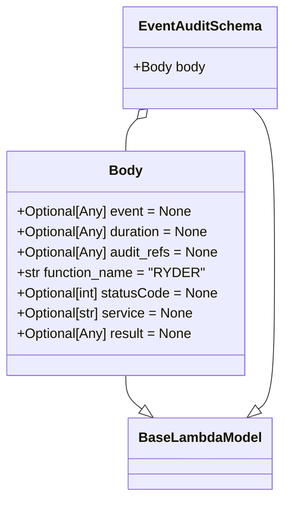

# Diagram: common/fv/python/fv/model/lambdas/event_audit.py

> Auto-generated by Obscura crawlers

## Mermaid

### SVG

<svg id="container" width="334.576171875" xmlns="http://www.w3.org/2000/svg" class="classDiagram" height="584" viewBox="0 0 334.576171875 584" role="graphics-document document" aria-roledescription="class"><g><defs><marker id="container_class-aggregationStart" class="marker aggregation class" refX="18" refY="7" markerWidth="190" markerHeight="240" orient="auto"><path d="M 18,7 L9,13 L1,7 L9,1 Z"></path></marker></defs><defs><marker id="container_class-aggregationEnd" class="marker aggregation class" refX="1" refY="7" markerWidth="20" markerHeight="28" orient="auto"><path d="M 18,7 L9,13 L1,7 L9,1 Z"></path></marker></defs><defs><marker id="container_class-extensionStart" class="marker extension class" refX="18" refY="7" markerWidth="190" markerHeight="240" orient="auto"><path d="M 1,7 L18,13 V 1 Z"></path></marker></defs><defs><marker id="container_class-extensionEnd" class="marker extension class" refX="1" refY="7" markerWidth="20" markerHeight="28" orient="auto"><path d="M 1,1 V 13 L18,7 Z"></path></marker></defs><defs><marker id="container_class-compositionStart" class="marker composition class" refX="18" refY="7" markerWidth="190" markerHeight="240" orient="auto"><path d="M 18,7 L9,13 L1,7 L9,1 Z"></path></marker></defs><defs><marker id="container_class-compositionEnd" class="marker composition class" refX="1" refY="7" markerWidth="20" markerHeight="28" orient="auto"><path d="M 18,7 L9,13 L1,7 L9,1 Z"></path></marker></defs><defs><marker id="container_class-dependencyStart" class="marker dependency class" refX="6" refY="7" markerWidth="190" markerHeight="240" orient="auto"><path d="M 5,7 L9,13 L1,7 L9,1 Z"></path></marker></defs><defs><marker id="container_class-dependencyEnd" class="marker dependency class" refX="13" refY="7" markerWidth="20" markerHeight="28" orient="auto"><path d="M 18,7 L9,13 L14,7 L9,1 Z"></path></marker></defs><defs><marker id="container_class-lollipopStart" class="marker lollipop class" refX="13" refY="7" markerWidth="190" markerHeight="240" orient="auto"><circle stroke="black" fill="transparent" cx="7" cy="7" r="6"></circle></marker></defs><defs><marker id="container_class-lollipopEnd" class="marker lollipop class" refX="1" refY="7" markerWidth="190" markerHeight="240" orient="auto"><circle stroke="black" fill="transparent" cx="7" cy="7" r="6"></circle></marker></defs><g class="root"><g class="clusters"></g><g class="edgePaths"><path d="M149.629,442L149.629,446.167C149.629,450.333,149.629,458.667,152.831,465.262C156.032,471.858,162.436,476.716,165.638,479.145L168.839,481.574" id="id_Body_BaseLambdaModel_1" class="edge-thickness-normal edge-pattern-solid relation" style=";;;" data-edge="true" data-et="edge" data-id="id_Body_BaseLambdaModel_1" data-points="W3sieCI6MTQ5LjYyODkwNjI1LCJ5Ijo0NDJ9LHsieCI6MTQ5LjYyODkwNjI1LCJ5Ijo0Njd9LHsieCI6MTgyLjU4MjA2MDQwMTExOTQsInkiOjQ5Mn1d" marker-end="url(#container_class-extensionEnd)"></path><path d="M300.283,128L304.612,132.167C308.941,136.333,317.6,144.667,321.929,175C326.258,205.333,326.258,257.667,326.258,310C326.258,362.333,326.258,414.667,323.056,443.262C319.854,471.858,313.451,476.716,310.249,479.145L307.047,481.574" id="id_EventAuditSchema_BaseLambdaModel_2" class="edge-thickness-normal edge-pattern-solid relation" style=";;;" data-edge="true" data-et="edge" data-id="id_EventAuditSchema_BaseLambdaModel_2" data-points="W3sieCI6MzAwLjI4Mjk3MzM0NTU4ODIzLCJ5IjoxMjh9LHsieCI6MzI2LjI1NzgxMjUsInkiOjE1M30seyJ4IjozMjYuMjU3ODEyNSwieSI6MzEwfSx7IngiOjMyNi4yNTc4MTI1LCJ5Ijo0Njd9LHsieCI6MjkzLjMwNDY1ODM0ODg4MDYsInkiOjQ5Mn1d" marker-end="url(#container_class-extensionEnd)"></path><path d="M163.175,139.962L160.917,142.135C158.66,144.308,154.144,148.654,151.887,154.994C149.629,161.333,149.629,169.667,149.629,173.833L149.629,178" id="id_EventAuditSchema_Body_3" class="edge-thickness-normal edge-pattern-solid relation" style=";;;" data-edge="true" data-et="edge" data-id="id_EventAuditSchema_Body_3" data-points="W3sieCI6MTc1LjYwMzc0NTQwNDQxMTc3LCJ5IjoxMjh9LHsieCI6MTQ5LjYyODkwNjI1LCJ5IjoxNTN9LHsieCI6MTQ5LjYyODkwNjI1LCJ5IjoxNzh9XQ==" marker-start="url(#container_class-aggregationStart)"></path></g><g class="edgeLabels"><g class="edgeLabel"><g class="label" data-id="id_Body_BaseLambdaModel_1" transform="translate(0, 0)"><foreignObject width="0" height="0">

</foreignObject></g></g><g class="edgeLabel"><g class="label" data-id="id_EventAuditSchema_BaseLambdaModel_2" transform="translate(0, 0)"><foreignObject width="0" height="0">

</foreignObject></g></g><g class="edgeLabel"><g class="label" data-id="id_EventAuditSchema_Body_3" transform="translate(0, 0)"><foreignObject width="0" height="0">

</foreignObject></g></g></g><g class="nodes"><g class="node default" id="classId-BaseLambdaModel-0" transform="translate(237.943359375, 534)"><g class="basic label-container"><path d="M-81.203125 -42 L81.203125 -42 L81.203125 42 L-81.203125 42" stroke="none" stroke-width="0" fill="#ECECFF" style=""></path><path d="M-81.203125 -42 C-31.57848811926314 -42, 18.046148761473717 -42, 81.203125 -42 M-81.203125 -42 C-35.82832986107109 -42, 9.54646527785782 -42, 81.203125 -42 M81.203125 -42 C81.203125 -13.724997947565871, 81.203125 14.550004104868258, 81.203125 42 M81.203125 -42 C81.203125 -14.245111707350123, 81.203125 13.509776585299754, 81.203125 42 M81.203125 42 C37.886679291218854 42, -5.429766417562291 42, -81.203125 42 M81.203125 42 C16.763720724560244 42, -47.67568355087951 42, -81.203125 42 M-81.203125 42 C-81.203125 17.05009402261254, -81.203125 -7.899811954774918, -81.203125 -42 M-81.203125 42 C-81.203125 22.3479513869647, -81.203125 2.6959027739293973, -81.203125 -42" stroke="#9370DB" stroke-width="1.3" fill="none" stroke-dasharray="0 0" style=""></path></g><g class="annotation-group text" transform="translate(0, -18)"></g><g class="label-group text" transform="translate(-69.203125, -18)"><g class="label" style="font-weight: bolder" transform="translate(0,-12)"><foreignObject width="138.40625" height="24">

BaseLambdaModel

</foreignObject></g></g><g class="members-group text" transform="translate(-69.203125, 30)"></g><g class="methods-group text" transform="translate(-69.203125, 60)"></g><g class="divider" style=""><path d="M-81.203125 6 C-35.14677868359512 6, 10.909567632809754 6, 81.203125 6 M-81.203125 6 C-40.68790591991042 6, -0.172686839820841 6, 81.203125 6" stroke="#9370DB" stroke-width="1.3" fill="none" stroke-dasharray="0 0" style=""></path></g><g class="divider" style=""><path d="M-81.203125 24 C-33.823944402542935 24, 13.55523619491413 24, 81.203125 24 M-81.203125 24 C-23.6844774421304 24, 33.8341701157392 24, 81.203125 24" stroke="#9370DB" stroke-width="1.3" fill="none" stroke-dasharray="0 0" style=""></path></g></g><g class="node default" id="classId-Body-1" transform="translate(149.62890625, 310)"><g class="basic label-container"><path d="M-141.62890625 -132 L141.62890625 -132 L141.62890625 132 L-141.62890625 132" stroke="none" stroke-width="0" fill="#ECECFF" style=""></path><path d="M-141.62890625 -132 C-54.72497693662538 -132, 32.17895237674924 -132, 141.62890625 -132 M-141.62890625 -132 C-51.077642856904376 -132, 39.47362053619125 -132, 141.62890625 -132 M141.62890625 -132 C141.62890625 -67.01481005438515, 141.62890625 -2.0296201087703025, 141.62890625 132 M141.62890625 -132 C141.62890625 -29.703765040115925, 141.62890625 72.59246991976815, 141.62890625 132 M141.62890625 132 C69.07506560537054 132, -3.4787750392589203 132, -141.62890625 132 M141.62890625 132 C79.1938583408527 132, 16.758810431705413 132, -141.62890625 132 M-141.62890625 132 C-141.62890625 29.912805242243053, -141.62890625 -72.1743895155139, -141.62890625 -132 M-141.62890625 132 C-141.62890625 30.907400252014824, -141.62890625 -70.18519949597035, -141.62890625 -132" stroke="#9370DB" stroke-width="1.3" fill="none" stroke-dasharray="0 0" style=""></path></g><g class="annotation-group text" transform="translate(0, -108)"></g><g class="label-group text" transform="translate(-18.5546875, -108)"><g class="label" style="font-weight: bolder" transform="translate(0,-12)"><foreignObject width="37.109375" height="24">

Body

</foreignObject></g></g><g class="members-group text" transform="translate(-129.62890625, -60)"><g class="label" style="" transform="translate(0,-12)"><foreignObject width="206.984375" height="24">

+Optional[Any] event = None

</foreignObject></g><g class="label" style="" transform="translate(0,12)"><foreignObject width="228.859375" height="24">

+Optional[Any] duration = None

</foreignObject></g><g class="label" style="" transform="translate(0,36)"><foreignObject width="240.015625" height="24">

+Optional[Any] audit_refs = None

</foreignObject></g><g class="label" style="" transform="translate(0,60)"><foreignObject width="217.046875" height="24">

+str function_name = "RYDER"

</foreignObject></g><g class="label" style="" transform="translate(0,84)"><foreignObject width="240.703125" height="24">

+Optional[int] statusCode = None

</foreignObject></g><g class="label" style="" transform="translate(0,108)"><foreignObject width="210.421875" height="24">

+Optional[str] service = None

</foreignObject></g><g class="label" style="" transform="translate(0,132)"><foreignObject width="208.3125" height="24">

+Optional[Any] result = None

</foreignObject></g></g><g class="methods-group text" transform="translate(-129.62890625, 132)"></g><g class="divider" style=""><path d="M-141.62890625 -84 C-68.61522119749388 -84, 4.398463855012238 -84, 141.62890625 -84 M-141.62890625 -84 C-71.34139046646062 -84, -1.053874682921247 -84, 141.62890625 -84" stroke="#9370DB" stroke-width="1.3" fill="none" stroke-dasharray="0 0" style=""></path></g><g class="divider" style=""><path d="M-141.62890625 108 C-35.30120207352269 108, 71.02650210295462 108, 141.62890625 108 M-141.62890625 108 C-37.21922552088998 108, 67.19045520822004 108, 141.62890625 108" stroke="#9370DB" stroke-width="1.3" fill="none" stroke-dasharray="0 0" style=""></path></g></g><g class="node default" id="classId-EventAuditSchema-2" transform="translate(237.943359375, 68)"><g class="basic label-container"><path d="M-88.6328125 -60 L88.6328125 -60 L88.6328125 60 L-88.6328125 60" stroke="none" stroke-width="0" fill="#ECECFF" style=""></path><path d="M-88.6328125 -60 C-49.46033274251889 -60, -10.287852985037773 -60, 88.6328125 -60 M-88.6328125 -60 C-39.935954113179804 -60, 8.760904273640392 -60, 88.6328125 -60 M88.6328125 -60 C88.6328125 -30.873223059894112, 88.6328125 -1.7464461197882244, 88.6328125 60 M88.6328125 -60 C88.6328125 -31.968599912686262, 88.6328125 -3.9371998253725238, 88.6328125 60 M88.6328125 60 C33.909379513083195 60, -20.81405347383361 60, -88.6328125 60 M88.6328125 60 C39.32433014816465 60, -9.984152203670703 60, -88.6328125 60 M-88.6328125 60 C-88.6328125 12.069403015883765, -88.6328125 -35.86119396823247, -88.6328125 -60 M-88.6328125 60 C-88.6328125 16.291617429655744, -88.6328125 -27.41676514068851, -88.6328125 -60" stroke="#9370DB" stroke-width="1.3" fill="none" stroke-dasharray="0 0" style=""></path></g><g class="annotation-group text" transform="translate(0, -36)"></g><g class="label-group text" transform="translate(-68.234375, -36)"><g class="label" style="font-weight: bolder" transform="translate(0,-12)"><foreignObject width="136.46875" height="24">

EventAuditSchema

</foreignObject></g></g><g class="members-group text" transform="translate(-76.6328125, 12)"><g class="label" style="" transform="translate(0,-12)"><foreignObject width="85.03125" height="24">

+Body body

</foreignObject></g></g><g class="methods-group text" transform="translate(-76.6328125, 60)"></g><g class="divider" style=""><path d="M-88.6328125 -12 C-47.52370614195536 -12, -6.414599783910717 -12, 88.6328125 -12 M-88.6328125 -12 C-45.25175447490834 -12, -1.870696449816677 -12, 88.6328125 -12" stroke="#9370DB" stroke-width="1.3" fill="none" stroke-dasharray="0 0" style=""></path></g><g class="divider" style=""><path d="M-88.6328125 36 C-50.0870016357974 36, -11.541190771594799 36, 88.6328125 36 M-88.6328125 36 C-19.89482046658675 36, 48.8431715668265 36, 88.6328125 36" stroke="#9370DB" stroke-width="1.3" fill="none" stroke-dasharray="0 0" style=""></path></g></g></g></g></g></svg>
