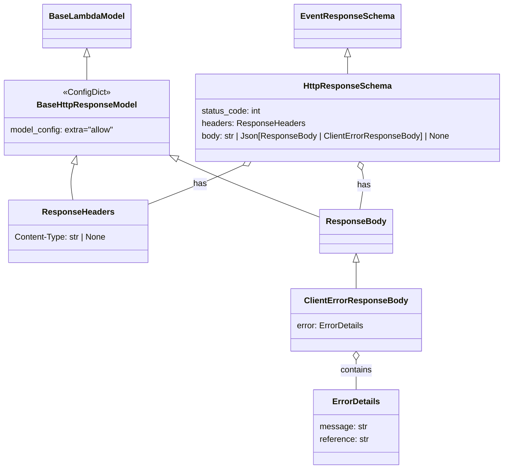

# Diagram: common/fv/python/fv/model/lambdas/event_http_response.py

> Auto-generated by Obscura crawlers

## Mermaid

### SVG

<svg id="container" width="966.5703125" xmlns="http://www.w3.org/2000/svg" class="classDiagram" height="900" viewBox="0 0 966.5703125 900" role="graphics-document document" aria-roledescription="class"><g><defs><marker id="container_class-aggregationStart" class="marker aggregation class" refX="18" refY="7" markerWidth="190" markerHeight="240" orient="auto"><path d="M 18,7 L9,13 L1,7 L9,1 Z"></path></marker></defs><defs><marker id="container_class-aggregationEnd" class="marker aggregation class" refX="1" refY="7" markerWidth="20" markerHeight="28" orient="auto"><path d="M 18,7 L9,13 L1,7 L9,1 Z"></path></marker></defs><defs><marker id="container_class-extensionStart" class="marker extension class" refX="18" refY="7" markerWidth="190" markerHeight="240" orient="auto"><path d="M 1,7 L18,13 V 1 Z"></path></marker></defs><defs><marker id="container_class-extensionEnd" class="marker extension class" refX="1" refY="7" markerWidth="20" markerHeight="28" orient="auto"><path d="M 1,1 V 13 L18,7 Z"></path></marker></defs><defs><marker id="container_class-compositionStart" class="marker composition class" refX="18" refY="7" markerWidth="190" markerHeight="240" orient="auto"><path d="M 18,7 L9,13 L1,7 L9,1 Z"></path></marker></defs><defs><marker id="container_class-compositionEnd" class="marker composition class" refX="1" refY="7" markerWidth="20" markerHeight="28" orient="auto"><path d="M 18,7 L9,13 L1,7 L9,1 Z"></path></marker></defs><defs><marker id="container_class-dependencyStart" class="marker dependency class" refX="6" refY="7" markerWidth="190" markerHeight="240" orient="auto"><path d="M 5,7 L9,13 L1,7 L9,1 Z"></path></marker></defs><defs><marker id="container_class-dependencyEnd" class="marker dependency class" refX="13" refY="7" markerWidth="20" markerHeight="28" orient="auto"><path d="M 18,7 L9,13 L14,7 L9,1 Z"></path></marker></defs><defs><marker id="container_class-lollipopStart" class="marker lollipop class" refX="13" refY="7" markerWidth="190" markerHeight="240" orient="auto"><circle stroke="black" fill="transparent" cx="7" cy="7" r="6"></circle></marker></defs><defs><marker id="container_class-lollipopEnd" class="marker lollipop class" refX="1" refY="7" markerWidth="190" markerHeight="240" orient="auto"><circle stroke="black" fill="transparent" cx="7" cy="7" r="6"></circle></marker></defs><g class="root"><g class="clusters"></g><g class="edgePaths"><path d="M142.586,314.653L141.129,320.044C139.672,325.435,136.758,336.218,136.34,347.775C135.923,359.333,138.002,371.667,139.041,377.833L140.081,384" id="id_BaseHttpResponseModel_ResponseHeaders_1" class="edge-thickness-normal edge-pattern-solid relation" style=";;;" data-edge="true" data-et="edge" data-id="id_BaseHttpResponseModel_ResponseHeaders_1" data-points="W3sieCI6MTQ3LjA4NzE2NDI1NjE5ODM1LCJ5IjoyOTh9LHsieCI6MTMzLjg0Mzc1LCJ5IjozNDd9LHsieCI6MTQwLjA4MDk0Mzk0MzI5ODk2LCJ5IjozODR9XQ==" marker-start="url(#container_class-extensionStart)"></path><path d="M340.801,305.119L356.174,312.099C371.547,319.079,402.294,333.04,448.359,351.921C494.424,370.803,555.808,394.606,586.5,406.508L617.191,418.41" id="id_BaseHttpResponseModel_ResponseBody_2" class="edge-thickness-normal edge-pattern-solid relation" style=";;;" data-edge="true" data-et="edge" data-id="id_BaseHttpResponseModel_ResponseBody_2" data-points="W3sieCI6MzI1LjA5Mzc1LCJ5IjoyOTcuOTg3MjE4MjkzMDg1MX0seyJ4Ijo0MzMuMDQxMDE1NjI1LCJ5IjozNDd9LHsieCI6NjE3LjE5MTQwNjI1LCJ5Ijo0MTguNDA5NjI1NzYwMzA4Nn1d" marker-start="url(#container_class-extensionStart)"></path><path d="M683.184,503.25L683.184,507.542C683.184,511.833,683.184,520.417,683.184,528.875C683.184,537.333,683.184,545.667,683.184,549.833L683.184,554" id="id_ResponseBody_ClientErrorResponseBody_3" class="edge-thickness-normal edge-pattern-solid relation" style=";;;" data-edge="true" data-et="edge" data-id="id_ResponseBody_ClientErrorResponseBody_3" data-points="W3sieCI6NjgzLjE4MzU5Mzc1LCJ5Ijo0ODZ9LHsieCI6NjgzLjE4MzU5Mzc1LCJ5Ijo1Mjl9LHsieCI6NjgzLjE4MzU5Mzc1LCJ5Ijo1NTR9XQ==" marker-start="url(#container_class-extensionStart)"></path><path d="M683.184,691.25L683.184,694.542C683.184,697.833,683.184,704.417,683.184,713.875C683.184,723.333,683.184,735.667,683.184,741.833L683.184,748" id="id_ClientErrorResponseBody_ErrorDetails_4" class="edge-thickness-normal edge-pattern-solid relation" style=";;;" data-edge="true" data-et="edge" data-id="id_ClientErrorResponseBody_ErrorDetails_4" data-points="W3sieCI6NjgzLjE4MzU5Mzc1LCJ5Ijo2NzR9LHsieCI6NjgzLjE4MzU5Mzc1LCJ5Ijo3MTF9LHsieCI6NjgzLjE4MzU5Mzc1LCJ5Ijo3NDh9XQ==" marker-start="url(#container_class-aggregationStart)"></path><path d="M166.547,109.25L166.547,110.542C166.547,111.833,166.547,114.417,166.547,121.875C166.547,129.333,166.547,141.667,166.547,147.833L166.547,154" id="id_BaseLambdaModel_BaseHttpResponseModel_5" class="edge-thickness-normal edge-pattern-solid relation" style=";;;" data-edge="true" data-et="edge" data-id="id_BaseLambdaModel_BaseHttpResponseModel_5" data-points="W3sieCI6MTY2LjU0Njg3NSwieSI6OTJ9LHsieCI6MTY2LjU0Njg3NSwieSI6MTE3fSx7IngiOjE2Ni41NDY4NzUsInkiOjE1NH1d" marker-start="url(#container_class-extensionStart)"></path><path d="M666.832,109.25L666.832,110.542C666.832,111.833,666.832,114.417,666.832,119.875C666.832,125.333,666.832,133.667,666.832,137.833L666.832,142" id="id_EventResponseSchema_HttpResponseSchema_6" class="edge-thickness-normal edge-pattern-solid relation" style=";;;" data-edge="true" data-et="edge" data-id="id_EventResponseSchema_HttpResponseSchema_6" data-points="W3sieCI6NjY2LjgzMjAzMTI1LCJ5Ijo5Mn0seyJ4Ijo2NjYuODMyMDMxMjUsInkiOjExN30seyJ4Ijo2NjYuODMyMDMxMjUsInkiOjE0Mn1d" marker-start="url(#container_class-extensionStart)"></path><path d="M466.121,317.132L455.157,322.11C444.193,327.088,422.266,337.044,391.778,349.593C361.29,362.142,322.243,377.284,302.719,384.855L283.195,392.425" id="id_HttpResponseSchema_ResponseHeaders_7" class="edge-thickness-normal edge-pattern-solid relation" style=";;;" data-edge="true" data-et="edge" data-id="id_HttpResponseSchema_ResponseHeaders_7" data-points="W3sieCI6NDgxLjgyNzgzNDQ1MjQ3OTM1LCJ5IjozMTB9LHsieCI6NDAwLjMzNzg5MDYyNSwieSI6MzQ3fSx7IngiOjI4My4xOTUzMTI1LCJ5IjozOTIuNDI1NDEzNjMxMjg4NH1d" marker-start="url(#container_class-aggregationStart)"></path><path d="M694.036,326.653L694.952,330.044C695.869,333.435,697.702,340.218,697.073,352.775C696.445,365.333,693.354,383.667,691.809,392.833L690.264,402" id="id_HttpResponseSchema_ResponseBody_8" class="edge-thickness-normal edge-pattern-solid relation" style=";;;" data-edge="true" data-et="edge" data-id="id_HttpResponseSchema_ResponseBody_8" data-points="W3sieCI6Njg5LjUzNTAyNzExNzc2ODUsInkiOjMxMH0seyJ4Ijo2OTkuNTM1MTU2MjUsInkiOjM0N30seyJ4Ijo2OTAuMjYzNjUxNzM5NjkwOCwieSI6NDAyfV0=" marker-start="url(#container_class-aggregationStart)"></path></g><g class="edgeLabels"><g class="edgeLabel"><g class="label" data-id="id_BaseHttpResponseModel_ResponseHeaders_1" transform="translate(0, 0)"><foreignObject width="0" height="0">

</foreignObject></g></g><g class="edgeLabel"><g class="label" data-id="id_BaseHttpResponseModel_ResponseBody_2" transform="translate(0, 0)"><foreignObject width="0" height="0">

</foreignObject></g></g><g class="edgeLabel"><g class="label" data-id="id_ResponseBody_ClientErrorResponseBody_3" transform="translate(0, 0)"><foreignObject width="0" height="0">

</foreignObject></g></g><g class="edgeLabel" transform="translate(683.18359375, 711)"><g class="label" data-id="id_ClientErrorResponseBody_ErrorDetails_4" transform="translate(-30.890625, -12)"><foreignObject width="61.78125" height="24">

contains

</foreignObject></g></g><g class="edgeLabel"><g class="label" data-id="id_BaseLambdaModel_BaseHttpResponseModel_5" transform="translate(0, 0)"><foreignObject width="0" height="0">

</foreignObject></g></g><g class="edgeLabel"><g class="label" data-id="id_EventResponseSchema_HttpResponseSchema_6" transform="translate(0, 0)"><foreignObject width="0" height="0">

</foreignObject></g></g><g class="edgeLabel" transform="translate(383.48777, 353.53412)"><g class="label" data-id="id_HttpResponseSchema_ResponseHeaders_7" transform="translate(-12.703125, -12)"><foreignObject width="25.40625" height="24">

has

</foreignObject></g></g><g class="edgeLabel" transform="translate(698.08495, 355.60283)"><g class="label" data-id="id_HttpResponseSchema_ResponseBody_8" transform="translate(-12.703125, -12)"><foreignObject width="25.40625" height="24">

has

</foreignObject></g></g></g><g class="nodes"><g class="node default" id="classId-BaseLambdaModel-0" transform="translate(166.546875, 50)"><g class="basic label-container"><path d="M-81.203125 -42 L81.203125 -42 L81.203125 42 L-81.203125 42" stroke="none" stroke-width="0" fill="#ECECFF" style=""></path><path d="M-81.203125 -42 C-39.44611712007826 -42, 2.310890759843474 -42, 81.203125 -42 M-81.203125 -42 C-18.202118241372652 -42, 44.798888517254696 -42, 81.203125 -42 M81.203125 -42 C81.203125 -22.675561542744145, 81.203125 -3.3511230854882896, 81.203125 42 M81.203125 -42 C81.203125 -11.32797922397221, 81.203125 19.34404155205558, 81.203125 42 M81.203125 42 C41.193728704724 42, 1.1843324094480039 42, -81.203125 42 M81.203125 42 C33.482098306993414 42, -14.238928386013171 42, -81.203125 42 M-81.203125 42 C-81.203125 10.261943854777808, -81.203125 -21.476112290444384, -81.203125 -42 M-81.203125 42 C-81.203125 13.74892927507485, -81.203125 -14.5021414498503, -81.203125 -42" stroke="#9370DB" stroke-width="1.3" fill="none" stroke-dasharray="0 0" style=""></path></g><g class="annotation-group text" transform="translate(0, -18)"></g><g class="label-group text" transform="translate(-69.203125, -18)"><g class="label" style="font-weight: bolder" transform="translate(0,-12)"><foreignObject width="138.40625" height="24">

BaseLambdaModel

</foreignObject></g></g><g class="members-group text" transform="translate(-69.203125, 30)"></g><g class="methods-group text" transform="translate(-69.203125, 60)"></g><g class="divider" style=""><path d="M-81.203125 6 C-48.13371069675906 6, -15.06429639351812 6, 81.203125 6 M-81.203125 6 C-27.830513235868068 6, 25.542098528263864 6, 81.203125 6" stroke="#9370DB" stroke-width="1.3" fill="none" stroke-dasharray="0 0" style=""></path></g><g class="divider" style=""><path d="M-81.203125 24 C-17.63634918766453 24, 45.93042662467094 24, 81.203125 24 M-81.203125 24 C-28.886482201337216 24, 23.430160597325568 24, 81.203125 24" stroke="#9370DB" stroke-width="1.3" fill="none" stroke-dasharray="0 0" style=""></path></g></g><g class="node default" id="classId-EventResponseSchema-1" transform="translate(666.83203125, 50)"><g class="basic label-container"><path d="M-96.234375 -42 L96.234375 -42 L96.234375 42 L-96.234375 42" stroke="none" stroke-width="0" fill="#ECECFF" style=""></path><path d="M-96.234375 -42 C-37.88148202323011 -42, 20.471410953539774 -42, 96.234375 -42 M-96.234375 -42 C-22.31847490698449 -42, 51.59742518603102 -42, 96.234375 -42 M96.234375 -42 C96.234375 -15.058008916141642, 96.234375 11.883982167716717, 96.234375 42 M96.234375 -42 C96.234375 -10.414689785695625, 96.234375 21.17062042860875, 96.234375 42 M96.234375 42 C44.11814643611122 42, -7.998082127777565 42, -96.234375 42 M96.234375 42 C28.64975867234952 42, -38.93485765530096 42, -96.234375 42 M-96.234375 42 C-96.234375 10.76740661616974, -96.234375 -20.46518676766052, -96.234375 -42 M-96.234375 42 C-96.234375 13.13711584460328, -96.234375 -15.725768310793441, -96.234375 -42" stroke="#9370DB" stroke-width="1.3" fill="none" stroke-dasharray="0 0" style=""></path></g><g class="annotation-group text" transform="translate(0, -18)"></g><g class="label-group text" transform="translate(-84.234375, -18)"><g class="label" style="font-weight: bolder" transform="translate(0,-12)"><foreignObject width="168.46875" height="24">

EventResponseSchema

</foreignObject></g></g><g class="members-group text" transform="translate(-84.234375, 30)"></g><g class="methods-group text" transform="translate(-84.234375, 60)"></g><g class="divider" style=""><path d="M-96.234375 6 C-32.60953203503727 6, 31.015310929925462 6, 96.234375 6 M-96.234375 6 C-41.344208842349325 6, 13.54595731530135 6, 96.234375 6" stroke="#9370DB" stroke-width="1.3" fill="none" stroke-dasharray="0 0" style=""></path></g><g class="divider" style=""><path d="M-96.234375 24 C-43.06083144746206 24, 10.112712105075886 24, 96.234375 24 M-96.234375 24 C-25.387887320254265 24, 45.45860035949147 24, 96.234375 24" stroke="#9370DB" stroke-width="1.3" fill="none" stroke-dasharray="0 0" style=""></path></g></g><g class="node default" id="classId-BaseHttpResponseModel-2" transform="translate(166.546875, 226)"><g class="basic label-container"><path d="M-158.546875 -72 L158.546875 -72 L158.546875 72 L-158.546875 72" stroke="none" stroke-width="0" fill="#ECECFF" style=""></path><path d="M-158.546875 -72 C-56.677274123558576 -72, 45.19232675288285 -72, 158.546875 -72 M-158.546875 -72 C-49.411359381432035 -72, 59.72415623713593 -72, 158.546875 -72 M158.546875 -72 C158.546875 -39.84877519489024, 158.546875 -7.697550389780474, 158.546875 72 M158.546875 -72 C158.546875 -36.40469650389537, 158.546875 -0.8093930077907459, 158.546875 72 M158.546875 72 C71.55227233720241 72, -15.44233032559518 72, -158.546875 72 M158.546875 72 C50.03570631516078 72, -58.47546236967844 72, -158.546875 72 M-158.546875 72 C-158.546875 24.116096471539493, -158.546875 -23.767807056921015, -158.546875 -72 M-158.546875 72 C-158.546875 36.51591081289891, -158.546875 1.0318216257978179, -158.546875 -72" stroke="#9370DB" stroke-width="1.3" fill="none" stroke-dasharray="0 0" style=""></path></g><g class="annotation-group text" transform="translate(-45.6953125, -48)"><g class="label" style="" transform="translate(0,-12)"><foreignObject width="91.390625" height="24">

«ConfigDict»

</foreignObject></g></g><g class="label-group text" transform="translate(-91.796875, -24)"><g class="label" style="font-weight: bolder" transform="translate(0,-12)"><foreignObject width="183.59375" height="24">

BaseHttpResponseModel

</foreignObject></g></g><g class="members-group text" transform="translate(-146.546875, 24)"><g class="label" style="" transform="translate(0,-12)"><foreignObject width="201.296875" height="24">

model_config: extra="allow"

</foreignObject></g></g><g class="methods-group text" transform="translate(-146.546875, 72)"></g><g class="divider" style=""><path d="M-158.546875 0 C-62.53919143401568 0, 33.468492131968645 0, 158.546875 0 M-158.546875 0 C-81.69211545853199 0, -4.837355917063974 0, 158.546875 0" stroke="#9370DB" stroke-width="1.3" fill="none" stroke-dasharray="0 0" style=""></path></g><g class="divider" style=""><path d="M-158.546875 48 C-64.85863974018135 48, 28.82959551963731 48, 158.546875 48 M-158.546875 48 C-36.29057170911916 48, 85.96573158176167 48, 158.546875 48" stroke="#9370DB" stroke-width="1.3" fill="none" stroke-dasharray="0 0" style=""></path></g></g><g class="node default" id="classId-ResponseHeaders-3" transform="translate(150.1953125, 444)"><g class="basic label-container"><path d="M-133 -60 L133 -60 L133 60 L-133 60" stroke="none" stroke-width="0" fill="#ECECFF" style=""></path><path d="M-133 -60 C-65.05217141960826 -60, 2.895657160783486 -60, 133 -60 M-133 -60 C-69.15120050268112 -60, -5.302401005362242 -60, 133 -60 M133 -60 C133 -24.440937369714334, 133 11.118125260571333, 133 60 M133 -60 C133 -34.305650655957436, 133 -8.611301311914872, 133 60 M133 60 C45.14309996536751 60, -42.71380006926498 60, -133 60 M133 60 C34.883377822153065 60, -63.23324435569387 60, -133 60 M-133 60 C-133 22.559686358616773, -133 -14.880627282766454, -133 -60 M-133 60 C-133 29.822422327096394, -133 -0.3551553458072121, -133 -60" stroke="#9370DB" stroke-width="1.3" fill="none" stroke-dasharray="0 0" style=""></path></g><g class="annotation-group text" transform="translate(0, -36)"></g><g class="label-group text" transform="translate(-65.6875, -36)"><g class="label" style="font-weight: bolder" transform="translate(0,-12)"><foreignObject width="131.375" height="24">

ResponseHeaders

</foreignObject></g></g><g class="members-group text" transform="translate(-121, 12)"><g class="label" style="" transform="translate(0,-12)"><foreignObject width="176.3125" height="24">

Content-Type: str | None

</foreignObject></g></g><g class="methods-group text" transform="translate(-121, 60)"></g><g class="divider" style=""><path d="M-133 -12 C-37.95298443738119 -12, 57.09403112523762 -12, 133 -12 M-133 -12 C-31.177613516064213 -12, 70.64477296787157 -12, 133 -12" stroke="#9370DB" stroke-width="1.3" fill="none" stroke-dasharray="0 0" style=""></path></g><g class="divider" style=""><path d="M-133 36 C-66.6533420960547 36, -0.306684192109401 36, 133 36 M-133 36 C-38.494752713314185 36, 56.01049457337163 36, 133 36" stroke="#9370DB" stroke-width="1.3" fill="none" stroke-dasharray="0 0" style=""></path></g></g><g class="node default" id="classId-ResponseBody-4" transform="translate(683.18359375, 444)"><g class="basic label-container"><path d="M-65.9921875 -42 L65.9921875 -42 L65.9921875 42 L-65.9921875 42" stroke="none" stroke-width="0" fill="#ECECFF" style=""></path><path d="M-65.9921875 -42 C-14.92555749603725 -42, 36.1410725079255 -42, 65.9921875 -42 M-65.9921875 -42 C-31.326265002705604 -42, 3.339657494588792 -42, 65.9921875 -42 M65.9921875 -42 C65.9921875 -12.017764157179801, 65.9921875 17.964471685640397, 65.9921875 42 M65.9921875 -42 C65.9921875 -16.569088436720367, 65.9921875 8.861823126559266, 65.9921875 42 M65.9921875 42 C17.008658758137763 42, -31.974869983724474 42, -65.9921875 42 M65.9921875 42 C20.15058980439553 42, -25.69100789120894 42, -65.9921875 42 M-65.9921875 42 C-65.9921875 20.608945084688013, -65.9921875 -0.7821098306239733, -65.9921875 -42 M-65.9921875 42 C-65.9921875 17.21306410935684, -65.9921875 -7.573871781286321, -65.9921875 -42" stroke="#9370DB" stroke-width="1.3" fill="none" stroke-dasharray="0 0" style=""></path></g><g class="annotation-group text" transform="translate(0, -18)"></g><g class="label-group text" transform="translate(-53.9921875, -18)"><g class="label" style="font-weight: bolder" transform="translate(0,-12)"><foreignObject width="107.984375" height="24">

ResponseBody

</foreignObject></g></g><g class="members-group text" transform="translate(-53.9921875, 30)"></g><g class="methods-group text" transform="translate(-53.9921875, 60)"></g><g class="divider" style=""><path d="M-65.9921875 6 C-23.311073112009446 6, 19.37004127598111 6, 65.9921875 6 M-65.9921875 6 C-32.42919106810603 6, 1.1338053637879426 6, 65.9921875 6" stroke="#9370DB" stroke-width="1.3" fill="none" stroke-dasharray="0 0" style=""></path></g><g class="divider" style=""><path d="M-65.9921875 24 C-33.77095784719142 24, -1.549728194382837 24, 65.9921875 24 M-65.9921875 24 C-20.93300775281272 24, 24.12617199437456 24, 65.9921875 24" stroke="#9370DB" stroke-width="1.3" fill="none" stroke-dasharray="0 0" style=""></path></g></g><g class="node default" id="classId-ClientErrorResponseBody-5" transform="translate(683.18359375, 614)"><g class="basic label-container"><path d="M-123.8359375 -60 L123.8359375 -60 L123.8359375 60 L-123.8359375 60" stroke="none" stroke-width="0" fill="#ECECFF" style=""></path><path d="M-123.8359375 -60 C-72.63962480383364 -60, -21.443312107667282 -60, 123.8359375 -60 M-123.8359375 -60 C-46.869944519670995 -60, 30.09604846065801 -60, 123.8359375 -60 M123.8359375 -60 C123.8359375 -22.126780896775898, 123.8359375 15.746438206448204, 123.8359375 60 M123.8359375 -60 C123.8359375 -23.756287233037398, 123.8359375 12.487425533925204, 123.8359375 60 M123.8359375 60 C60.13476548884556 60, -3.566406522308881 60, -123.8359375 60 M123.8359375 60 C36.939932485441716 60, -49.95607252911657 60, -123.8359375 60 M-123.8359375 60 C-123.8359375 34.581402497901635, -123.8359375 9.162804995803278, -123.8359375 -60 M-123.8359375 60 C-123.8359375 28.48364405657436, -123.8359375 -3.0327118868512812, -123.8359375 -60" stroke="#9370DB" stroke-width="1.3" fill="none" stroke-dasharray="0 0" style=""></path></g><g class="annotation-group text" transform="translate(0, -36)"></g><g class="label-group text" transform="translate(-93.453125, -36)"><g class="label" style="font-weight: bolder" transform="translate(0,-12)"><foreignObject width="186.90625" height="24">

ClientErrorResponseBody

</foreignObject></g></g><g class="members-group text" transform="translate(-111.8359375, 12)"><g class="label" style="" transform="translate(0,-12)"><foreignObject width="130.21875" height="24">

error: ErrorDetails

</foreignObject></g></g><g class="methods-group text" transform="translate(-111.8359375, 60)"></g><g class="divider" style=""><path d="M-123.8359375 -12 C-53.94559513505642 -12, 15.944747229887156 -12, 123.8359375 -12 M-123.8359375 -12 C-67.83386320229226 -12, -11.831788904584513 -12, 123.8359375 -12" stroke="#9370DB" stroke-width="1.3" fill="none" stroke-dasharray="0 0" style=""></path></g><g class="divider" style=""><path d="M-123.8359375 36 C-64.1443846895213 36, -4.45283187904262 36, 123.8359375 36 M-123.8359375 36 C-41.49099310265217 36, 40.85395129469566 36, 123.8359375 36" stroke="#9370DB" stroke-width="1.3" fill="none" stroke-dasharray="0 0" style=""></path></g></g><g class="node default" id="classId-ErrorDetails-6" transform="translate(683.18359375, 820)"><g class="basic label-container"><path d="M-81.6875 -72 L81.6875 -72 L81.6875 72 L-81.6875 72" stroke="none" stroke-width="0" fill="#ECECFF" style=""></path><path d="M-81.6875 -72 C-33.506263960038744 -72, 14.674972079922512 -72, 81.6875 -72 M-81.6875 -72 C-16.97520464903647 -72, 47.73709070192706 -72, 81.6875 -72 M81.6875 -72 C81.6875 -18.2669855598632, 81.6875 35.4660288802736, 81.6875 72 M81.6875 -72 C81.6875 -32.53305235019857, 81.6875 6.933895299602867, 81.6875 72 M81.6875 72 C48.364929367450074 72, 15.042358734900148 72, -81.6875 72 M81.6875 72 C37.22618278000219 72, -7.235134439995619 72, -81.6875 72 M-81.6875 72 C-81.6875 21.66609940949793, -81.6875 -28.667801181004137, -81.6875 -72 M-81.6875 72 C-81.6875 19.009854246864975, -81.6875 -33.98029150627005, -81.6875 -72" stroke="#9370DB" stroke-width="1.3" fill="none" stroke-dasharray="0 0" style=""></path></g><g class="annotation-group text" transform="translate(0, -48)"></g><g class="label-group text" transform="translate(-43.6875, -48)"><g class="label" style="font-weight: bolder" transform="translate(0,-12)"><foreignObject width="87.375" height="24">

ErrorDetails

</foreignObject></g></g><g class="members-group text" transform="translate(-69.6875, 0)"><g class="label" style="" transform="translate(0,-12)"><foreignObject width="89.890625" height="24">

message: str

</foreignObject></g><g class="label" style="" transform="translate(0,12)"><foreignObject width="95.6875" height="24">

reference: str

</foreignObject></g></g><g class="methods-group text" transform="translate(-69.6875, 72)"></g><g class="divider" style=""><path d="M-81.6875 -24 C-27.012386670740845 -24, 27.66272665851831 -24, 81.6875 -24 M-81.6875 -24 C-34.269138099782054 -24, 13.149223800435891 -24, 81.6875 -24" stroke="#9370DB" stroke-width="1.3" fill="none" stroke-dasharray="0 0" style=""></path></g><g class="divider" style=""><path d="M-81.6875 48 C-40.987580315040475 48, -0.2876606300809499 48, 81.6875 48 M-81.6875 48 C-33.145523743765146 48, 15.396452512469708 48, 81.6875 48" stroke="#9370DB" stroke-width="1.3" fill="none" stroke-dasharray="0 0" style=""></path></g></g><g class="node default" id="classId-HttpResponseSchema-7" transform="translate(666.83203125, 226)"><g class="basic label-container"><path d="M-291.73828125 -84 L291.73828125 -84 L291.73828125 84 L-291.73828125 84" stroke="none" stroke-width="0" fill="#ECECFF" style=""></path><path d="M-291.73828125 -84 C-117.12363801147265 -84, 57.4910052270547 -84, 291.73828125 -84 M-291.73828125 -84 C-63.28594322477596 -84, 165.16639480044807 -84, 291.73828125 -84 M291.73828125 -84 C291.73828125 -37.64106090144285, 291.73828125 8.717878197114302, 291.73828125 84 M291.73828125 -84 C291.73828125 -25.908682654094875, 291.73828125 32.18263469181025, 291.73828125 84 M291.73828125 84 C100.4842654465649 84, -90.76975035687019 84, -291.73828125 84 M291.73828125 84 C141.63383684410903 84, -8.470607561781947 84, -291.73828125 84 M-291.73828125 84 C-291.73828125 17.423316150350246, -291.73828125 -49.15336769929951, -291.73828125 -84 M-291.73828125 84 C-291.73828125 24.732641440386523, -291.73828125 -34.534717119226954, -291.73828125 -84" stroke="#9370DB" stroke-width="1.3" fill="none" stroke-dasharray="0 0" style=""></path></g><g class="annotation-group text" transform="translate(0, -60)"></g><g class="label-group text" transform="translate(-80.3046875, -60)"><g class="label" style="font-weight: bolder" transform="translate(0,-12)"><foreignObject width="160.609375" height="24">

HttpResponseSchema

</foreignObject></g></g><g class="members-group text" transform="translate(-279.73828125, -12)"><g class="label" style="" transform="translate(0,-12)"><foreignObject width="114.796875" height="24">

status_code: int

</foreignObject></g><g class="label" style="" transform="translate(0,12)"><foreignObject width="196.3125" height="24">

headers: ResponseHeaders

</foreignObject></g><g class="label" style="" transform="translate(0,36)"><foreignObject width="479.171875" height="24">

body: str | Json[ResponseBody | ClientErrorResponseBody] | None

</foreignObject></g></g><g class="methods-group text" transform="translate(-279.73828125, 84)"></g><g class="divider" style=""><path d="M-291.73828125 -36 C-69.49737493242654 -36, 152.74353138514692 -36, 291.73828125 -36 M-291.73828125 -36 C-81.86942045067951 -36, 127.99944034864097 -36, 291.73828125 -36" stroke="#9370DB" stroke-width="1.3" fill="none" stroke-dasharray="0 0" style=""></path></g><g class="divider" style=""><path d="M-291.73828125 60 C-118.42868560173903 60, 54.88091004652193 60, 291.73828125 60 M-291.73828125 60 C-98.19661756670232 60, 95.34504611659537 60, 291.73828125 60" stroke="#9370DB" stroke-width="1.3" fill="none" stroke-dasharray="0 0" style=""></path></g></g></g></g></g></svg>
