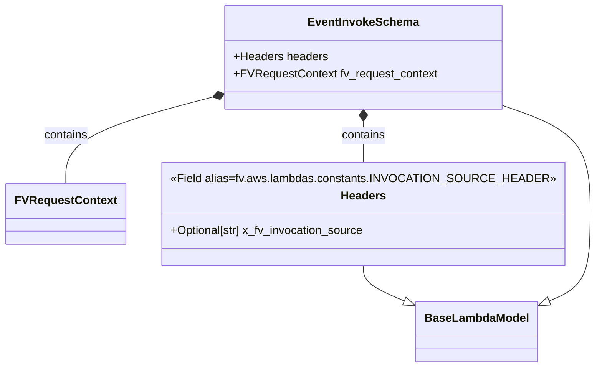

# Diagram: common/fv/python/fv/model/lambdas/event_invoke.py

> Auto-generated by Obscura crawlers

## Mermaid

### SVG

<svg id="container" width="808.9840087890625" xmlns="http://www.w3.org/2000/svg" class="classDiagram" height="512" viewBox="0 0 808.9840087890625 512" role="graphics-document document" aria-roledescription="class"><g><defs><marker id="container_class-aggregationStart" class="marker aggregation class" refX="18" refY="7" markerWidth="190" markerHeight="240" orient="auto"><path d="M 18,7 L9,13 L1,7 L9,1 Z"></path></marker></defs><defs><marker id="container_class-aggregationEnd" class="marker aggregation class" refX="1" refY="7" markerWidth="20" markerHeight="28" orient="auto"><path d="M 18,7 L9,13 L1,7 L9,1 Z"></path></marker></defs><defs><marker id="container_class-extensionStart" class="marker extension class" refX="18" refY="7" markerWidth="190" markerHeight="240" orient="auto"><path d="M 1,7 L18,13 V 1 Z"></path></marker></defs><defs><marker id="container_class-extensionEnd" class="marker extension class" refX="1" refY="7" markerWidth="20" markerHeight="28" orient="auto"><path d="M 1,1 V 13 L18,7 Z"></path></marker></defs><defs><marker id="container_class-compositionStart" class="marker composition class" refX="18" refY="7" markerWidth="190" markerHeight="240" orient="auto"><path d="M 18,7 L9,13 L1,7 L9,1 Z"></path></marker></defs><defs><marker id="container_class-compositionEnd" class="marker composition class" refX="1" refY="7" markerWidth="20" markerHeight="28" orient="auto"><path d="M 18,7 L9,13 L1,7 L9,1 Z"></path></marker></defs><defs><marker id="container_class-dependencyStart" class="marker dependency class" refX="6" refY="7" markerWidth="190" markerHeight="240" orient="auto"><path d="M 5,7 L9,13 L1,7 L9,1 Z"></path></marker></defs><defs><marker id="container_class-dependencyEnd" class="marker dependency class" refX="13" refY="7" markerWidth="20" markerHeight="28" orient="auto"><path d="M 18,7 L9,13 L14,7 L9,1 Z"></path></marker></defs><defs><marker id="container_class-lollipopStart" class="marker lollipop class" refX="13" refY="7" markerWidth="190" markerHeight="240" orient="auto"><circle stroke="black" fill="transparent" cx="7" cy="7" r="6"></circle></marker></defs><defs><marker id="container_class-lollipopEnd" class="marker lollipop class" refX="1" refY="7" markerWidth="190" markerHeight="240" orient="auto"><circle stroke="black" fill="transparent" cx="7" cy="7" r="6"></circle></marker></defs><g class="root"><g class="clusters"></g><g class="edgePaths"><path d="M490.594,370L490.594,374.167C490.594,378.333,490.594,386.667,500.286,395.018C509.979,403.369,529.364,411.738,539.056,415.922L548.749,420.106" id="id_Headers_BaseLambdaModel_1" class="edge-thickness-normal edge-pattern-solid relation" style=";;;" data-edge="true" data-et="edge" data-id="id_Headers_BaseLambdaModel_1" data-points="W3sieCI6NDkwLjU5Mzc1LCJ5IjozNzB9LHsieCI6NDkwLjU5Mzc1LCJ5IjozOTV9LHsieCI6NTY0LjU4NTkzNzUsInkiOjQyNi45NDM0Njg0MTE3Nzk1fV0=" marker-end="url(#container_class-extensionEnd)"></path><path d="M679.684,146.403L699.9,153.502C720.117,160.602,760.551,174.801,780.768,200.067C800.984,225.333,800.984,261.667,800.984,296C800.984,330.333,800.984,362.667,791.292,383.018C781.599,403.369,762.214,411.738,752.522,415.922L742.829,420.106" id="id_EventInvokeSchema_BaseLambdaModel_2" class="edge-thickness-normal edge-pattern-solid relation" style=";;;" data-edge="true" data-et="edge" data-id="id_EventInvokeSchema_BaseLambdaModel_2" data-points="W3sieCI6Njc5LjY4MzU5Mzc1LCJ5IjoxNDYuNDAyNzU2MTAzNjk5OTd9LHsieCI6ODAwLjk4NDM3NSwieSI6MTg5fSx7IngiOjgwMC45ODQzNzUsInkiOjI5OH0seyJ4Ijo4MDAuOTg0Mzc1LCJ5IjozOTV9LHsieCI6NzI2Ljk5MjE4NzUsInkiOjQyNi45NDM0Njg0MTE3Nzk1fV0=" marker-end="url(#container_class-extensionEnd)"></path><path d="M490.594,169.25L490.594,172.542C490.594,175.833,490.594,182.417,490.594,191.875C490.594,201.333,490.594,213.667,490.594,219.833L490.594,226" id="id_EventInvokeSchema_Headers_3" class="edge-thickness-normal edge-pattern-solid relation" style=";;;" data-edge="true" data-et="edge" data-id="id_EventInvokeSchema_Headers_3" data-points="W3sieCI6NDkwLjU5Mzc1LCJ5IjoxNTJ9LHsieCI6NDkwLjU5Mzc1LCJ5IjoxODl9LHsieCI6NDkwLjU5Mzc1LCJ5IjoyMjZ9XQ==" marker-start="url(#container_class-compositionStart)"></path><path d="M284.849,135.511L251.808,144.426C218.767,153.341,152.684,171.17,119.643,191.252C86.602,211.333,86.602,233.667,86.602,244.833L86.602,256" id="id_EventInvokeSchema_FVRequestContext_4" class="edge-thickness-normal edge-pattern-solid relation" style=";;;" data-edge="true" data-et="edge" data-id="id_EventInvokeSchema_FVRequestContext_4" data-points="W3sieCI6MzAxLjUwMzkwNjI1LCJ5IjoxMzEuMDE3ODAwODU0NzUwNDV9LHsieCI6ODYuNjAxNTYyNSwieSI6MTg5fSx7IngiOjg2LjYwMTU2MjUsInkiOjI1Nn1d" marker-start="url(#container_class-compositionStart)"></path></g><g class="edgeLabels"><g class="edgeLabel"><g class="label" data-id="id_Headers_BaseLambdaModel_1" transform="translate(0, 0)"><foreignObject width="0" height="0">

</foreignObject></g></g><g class="edgeLabel"><g class="label" data-id="id_EventInvokeSchema_BaseLambdaModel_2" transform="translate(0, 0)"><foreignObject width="0" height="0">

</foreignObject></g></g><g class="edgeLabel" transform="translate(490.59375, 189)"><g class="label" data-id="id_EventInvokeSchema_Headers_3" transform="translate(-30.890625, -12)"><foreignObject width="61.78125" height="24">

contains

</foreignObject></g></g><g class="edgeLabel" transform="translate(86.6015625, 189)"><g class="label" data-id="id_EventInvokeSchema_FVRequestContext_4" transform="translate(-30.890625, -12)"><foreignObject width="61.78125" height="24">

contains

</foreignObject></g></g></g><g class="nodes"><g class="node default" id="classId-BaseLambdaModel-0" transform="translate(645.7890625, 462)"><g class="basic label-container"><path d="M-81.203125 -42 L81.203125 -42 L81.203125 42 L-81.203125 42" stroke="none" stroke-width="0" fill="#ECECFF" style=""></path><path d="M-81.203125 -42 C-19.75963110927036 -42, 41.68386278145928 -42, 81.203125 -42 M-81.203125 -42 C-22.8744460736648 -42, 35.4542328526704 -42, 81.203125 -42 M81.203125 -42 C81.203125 -21.567907669659434, 81.203125 -1.1358153393188672, 81.203125 42 M81.203125 -42 C81.203125 -13.414292287240027, 81.203125 15.171415425519946, 81.203125 42 M81.203125 42 C46.45423363513327 42, 11.705342270266542 42, -81.203125 42 M81.203125 42 C37.458270233614726 42, -6.286584532770547 42, -81.203125 42 M-81.203125 42 C-81.203125 22.924771647042277, -81.203125 3.8495432940845546, -81.203125 -42 M-81.203125 42 C-81.203125 10.041831586464827, -81.203125 -21.916336827070346, -81.203125 -42" stroke="#9370DB" stroke-width="1.3" fill="none" stroke-dasharray="0 0" style=""></path></g><g class="annotation-group text" transform="translate(0, -18)"></g><g class="label-group text" transform="translate(-69.203125, -18)"><g class="label" style="font-weight: bolder" transform="translate(0,-12)"><foreignObject width="138.40625" height="24">

BaseLambdaModel

</foreignObject></g></g><g class="members-group text" transform="translate(-69.203125, 30)"></g><g class="methods-group text" transform="translate(-69.203125, 60)"></g><g class="divider" style=""><path d="M-81.203125 6 C-31.010119444123283 6, 19.182886111753433 6, 81.203125 6 M-81.203125 6 C-38.58069113912797 6, 4.041742721744058 6, 81.203125 6" stroke="#9370DB" stroke-width="1.3" fill="none" stroke-dasharray="0 0" style=""></path></g><g class="divider" style=""><path d="M-81.203125 24 C-36.62039495332689 24, 7.962335093346226 24, 81.203125 24 M-81.203125 24 C-38.384960150796566 24, 4.433204698406868 24, 81.203125 24" stroke="#9370DB" stroke-width="1.3" fill="none" stroke-dasharray="0 0" style=""></path></g></g><g class="node default" id="classId-FVRequestContext-1" transform="translate(86.6015625, 298)"><g class="basic label-container"><path d="M-78.6015625 -42 L78.6015625 -42 L78.6015625 42 L-78.6015625 42" stroke="none" stroke-width="0" fill="#ECECFF" style=""></path><path d="M-78.6015625 -42 C-28.09538792621042 -42, 22.410786647579158 -42, 78.6015625 -42 M-78.6015625 -42 C-27.896051665098682 -42, 22.809459169802636 -42, 78.6015625 -42 M78.6015625 -42 C78.6015625 -10.394339973062536, 78.6015625 21.21132005387493, 78.6015625 42 M78.6015625 -42 C78.6015625 -13.207530997931269, 78.6015625 15.584938004137463, 78.6015625 42 M78.6015625 42 C24.63215587210349 42, -29.337250755793022 42, -78.6015625 42 M78.6015625 42 C21.93267429113034 42, -34.73621391773932 42, -78.6015625 42 M-78.6015625 42 C-78.6015625 18.967734966922276, -78.6015625 -4.064530066155449, -78.6015625 -42 M-78.6015625 42 C-78.6015625 22.7856273867558, -78.6015625 3.5712547735115976, -78.6015625 -42" stroke="#9370DB" stroke-width="1.3" fill="none" stroke-dasharray="0 0" style=""></path></g><g class="annotation-group text" transform="translate(0, -18)"></g><g class="label-group text" transform="translate(-66.6015625, -18)"><g class="label" style="font-weight: bolder" transform="translate(0,-12)"><foreignObject width="133.203125" height="24">

FVRequestContext

</foreignObject></g></g><g class="members-group text" transform="translate(-66.6015625, 30)"></g><g class="methods-group text" transform="translate(-66.6015625, 60)"></g><g class="divider" style=""><path d="M-78.6015625 6 C-30.173215554788626 6, 18.255131390422747 6, 78.6015625 6 M-78.6015625 6 C-30.821379879128436 6, 16.958802741743128 6, 78.6015625 6" stroke="#9370DB" stroke-width="1.3" fill="none" stroke-dasharray="0 0" style=""></path></g><g class="divider" style=""><path d="M-78.6015625 24 C-46.19496093764962 24, -13.788359375299237 24, 78.6015625 24 M-78.6015625 24 C-42.386483288639376 24, -6.171404077278751 24, 78.6015625 24" stroke="#9370DB" stroke-width="1.3" fill="none" stroke-dasharray="0 0" style=""></path></g></g><g class="node default" id="classId-Headers-2" transform="translate(490.59375, 298)"><g class="basic label-container"><path d="M-275.390625 -72 L275.390625 -72 L275.390625 72 L-275.390625 72" stroke="none" stroke-width="0" fill="#ECECFF" style=""></path><path d="M-275.390625 -72 C-155.5030970386885 -72, -35.61556907737699 -72, 275.390625 -72 M-275.390625 -72 C-156.1383318580356 -72, -36.886038716071226 -72, 275.390625 -72 M275.390625 -72 C275.390625 -15.8410444301242, 275.390625 40.3179111397516, 275.390625 72 M275.390625 -72 C275.390625 -30.138915796312077, 275.390625 11.722168407375847, 275.390625 72 M275.390625 72 C147.8951297779385 72, 20.399634555876986 72, -275.390625 72 M275.390625 72 C78.05098092680933 72, -119.28866314638134 72, -275.390625 72 M-275.390625 72 C-275.390625 23.48337261985641, -275.390625 -25.03325476028718, -275.390625 -72 M-275.390625 72 C-275.390625 26.333384298294547, -275.390625 -19.333231403410906, -275.390625 -72" stroke="#9370DB" stroke-width="1.3" fill="none" stroke-dasharray="0 0" style=""></path></g><g class="annotation-group text" transform="translate(-252.859375, -48)"><g class="label" style="" transform="translate(0,-12)"><foreignObject width="505.71875" height="24">

«Field alias=fv.aws.lambdas.constants.INVOCATION_SOURCE_HEADER»

</foreignObject></g></g><g class="label-group text" transform="translate(-30.2421875, -24)"><g class="label" style="font-weight: bolder" transform="translate(0,-12)"><foreignObject width="60.484375" height="24">

Headers

</foreignObject></g></g><g class="members-group text" transform="translate(-263.390625, 24)"><g class="label" style="" transform="translate(0,-12)"><foreignObject width="273.921875" height="24">

+Optional[str] x_fv_invocation_source

</foreignObject></g></g><g class="methods-group text" transform="translate(-263.390625, 72)"></g><g class="divider" style=""><path d="M-275.390625 0 C-73.592343270264 0, 128.205938459472 0, 275.390625 0 M-275.390625 0 C-119.55491911457256 0, 36.28078677085489 0, 275.390625 0" stroke="#9370DB" stroke-width="1.3" fill="none" stroke-dasharray="0 0" style=""></path></g><g class="divider" style=""><path d="M-275.390625 48 C-112.34292569638714 48, 50.70477360722572 48, 275.390625 48 M-275.390625 48 C-163.11165032708624 48, -50.832675654172505 48, 275.390625 48" stroke="#9370DB" stroke-width="1.3" fill="none" stroke-dasharray="0 0" style=""></path></g></g><g class="node default" id="classId-EventInvokeSchema-3" transform="translate(490.59375, 80)"><g class="basic label-container"><path d="M-189.08984375 -72 L189.08984375 -72 L189.08984375 72 L-189.08984375 72" stroke="none" stroke-width="0" fill="#ECECFF" style=""></path><path d="M-189.08984375 -72 C-51.38148424399412 -72, 86.32687526201175 -72, 189.08984375 -72 M-189.08984375 -72 C-84.81335517632279 -72, 19.463133397354426 -72, 189.08984375 -72 M189.08984375 -72 C189.08984375 -32.62581605347552, 189.08984375 6.748367893048965, 189.08984375 72 M189.08984375 -72 C189.08984375 -16.65711464566114, 189.08984375 38.68577070867772, 189.08984375 72 M189.08984375 72 C101.76147805591405 72, 14.433112361828108 72, -189.08984375 72 M189.08984375 72 C70.09625310406935 72, -48.897337541861305 72, -189.08984375 72 M-189.08984375 72 C-189.08984375 37.75865781401831, -189.08984375 3.517315628036613, -189.08984375 -72 M-189.08984375 72 C-189.08984375 20.452874936226145, -189.08984375 -31.09425012754771, -189.08984375 -72" stroke="#9370DB" stroke-width="1.3" fill="none" stroke-dasharray="0 0" style=""></path></g><g class="annotation-group text" transform="translate(0, -48)"></g><g class="label-group text" transform="translate(-73.1484375, -48)"><g class="label" style="font-weight: bolder" transform="translate(0,-12)"><foreignObject width="146.296875" height="24">

EventInvokeSchema

</foreignObject></g></g><g class="members-group text" transform="translate(-177.08984375, 0)"><g class="label" style="" transform="translate(0,-12)"><foreignObject width="130.40625" height="24">

+Headers headers

</foreignObject></g><g class="label" style="" transform="translate(0,12)"><foreignObject width="281.03125" height="24">

+FVRequestContext fv_request_context

</foreignObject></g></g><g class="methods-group text" transform="translate(-177.08984375, 72)"></g><g class="divider" style=""><path d="M-189.08984375 -24 C-67.8907241734443 -24, 53.308395403111405 -24, 189.08984375 -24 M-189.08984375 -24 C-80.76811516474163 -24, 27.55361342051674 -24, 189.08984375 -24" stroke="#9370DB" stroke-width="1.3" fill="none" stroke-dasharray="0 0" style=""></path></g><g class="divider" style=""><path d="M-189.08984375 48 C-80.36479842535509 48, 28.36024689928982 48, 189.08984375 48 M-189.08984375 48 C-111.16556505664123 48, -33.241286363282455 48, 189.08984375 48" stroke="#9370DB" stroke-width="1.3" fill="none" stroke-dasharray="0 0" style=""></path></g></g></g></g></g></svg>
