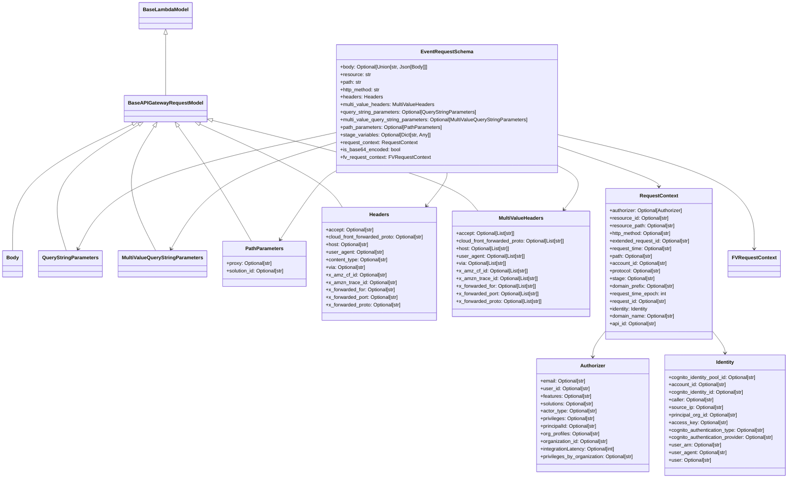

# Diagram: common/fv/python/fv/model/lambdas/event_request.py

> Auto-generated by Obscura crawlers

## Mermaid

### SVG

<svg id="container" width="2533.650390625" xmlns="http://www.w3.org/2000/svg" class="classDiagram" height="1522" viewBox="0 0 2533.650390625 1522" role="graphics-document document" aria-roledescription="class"><g><defs><marker id="container_class-aggregationStart" class="marker aggregation class" refX="18" refY="7" markerWidth="190" markerHeight="240" orient="auto"><path d="M 18,7 L9,13 L1,7 L9,1 Z"></path></marker></defs><defs><marker id="container_class-aggregationEnd" class="marker aggregation class" refX="1" refY="7" markerWidth="20" markerHeight="28" orient="auto"><path d="M 18,7 L9,13 L1,7 L9,1 Z"></path></marker></defs><defs><marker id="container_class-extensionStart" class="marker extension class" refX="18" refY="7" markerWidth="190" markerHeight="240" orient="auto"><path d="M 1,7 L18,13 V 1 Z"></path></marker></defs><defs><marker id="container_class-extensionEnd" class="marker extension class" refX="1" refY="7" markerWidth="20" markerHeight="28" orient="auto"><path d="M 1,1 V 13 L18,7 Z"></path></marker></defs><defs><marker id="container_class-compositionStart" class="marker composition class" refX="18" refY="7" markerWidth="190" markerHeight="240" orient="auto"><path d="M 18,7 L9,13 L1,7 L9,1 Z"></path></marker></defs><defs><marker id="container_class-compositionEnd" class="marker composition class" refX="1" refY="7" markerWidth="20" markerHeight="28" orient="auto"><path d="M 18,7 L9,13 L1,7 L9,1 Z"></path></marker></defs><defs><marker id="container_class-dependencyStart" class="marker dependency class" refX="6" refY="7" markerWidth="190" markerHeight="240" orient="auto"><path d="M 5,7 L9,13 L1,7 L9,1 Z"></path></marker></defs><defs><marker id="container_class-dependencyEnd" class="marker dependency class" refX="13" refY="7" markerWidth="20" markerHeight="28" orient="auto"><path d="M 18,7 L9,13 L14,7 L9,1 Z"></path></marker></defs><defs><marker id="container_class-lollipopStart" class="marker lollipop class" refX="13" refY="7" markerWidth="190" markerHeight="240" orient="auto"><circle stroke="black" fill="transparent" cx="7" cy="7" r="6"></circle></marker></defs><defs><marker id="container_class-lollipopEnd" class="marker lollipop class" refX="1" refY="7" markerWidth="190" markerHeight="240" orient="auto"><circle stroke="black" fill="transparent" cx="7" cy="7" r="6"></circle></marker></defs><g class="root"><g class="clusters"></g><g class="edgePaths"><path d="M510.438,109.25L510.438,110.542C510.438,111.833,510.438,114.417,510.438,146.875C510.438,179.333,510.438,241.667,510.438,272.833L510.438,304" id="id_BaseLambdaModel_BaseAPIGatewayRequestModel_1" class="edge-thickness-normal edge-pattern-solid relation" style=";;;" data-edge="true" data-et="edge" data-id="id_BaseLambdaModel_BaseAPIGatewayRequestModel_1" data-points="W3sieCI6NTEwLjQzNzUsInkiOjkyfSx7IngiOjUxMC40Mzc1LCJ5IjoxMTd9LHsieCI6NTEwLjQzNzUsInkiOjMwNH1d" marker-start="url(#container_class-extensionStart)"></path><path d="M408.372,395.531L346.736,425.443C285.1,455.354,161.827,515.177,100.191,582.255C38.555,649.333,38.555,723.667,38.555,760.833L38.555,798" id="id_BaseAPIGatewayRequestModel_Body_2" class="edge-thickness-normal edge-pattern-solid relation" style=";;;" data-edge="true" data-et="edge" data-id="id_BaseAPIGatewayRequestModel_Body_2" data-points="W3sieCI6NDIzLjg5MTMwNzMxNDQxMDUsInkiOjM4OH0seyJ4IjozOC41NTQ2ODc1LCJ5Ijo1NzV9LHsieCI6MzguNTU0Njg3NSwieSI6Nzk4fV0=" marker-start="url(#container_class-extensionStart)"></path><path d="M427.365,397.029L379.077,426.691C330.789,456.353,234.213,515.676,197.016,582.505C159.819,649.333,182.002,723.667,193.094,760.833L204.185,798" id="id_BaseAPIGatewayRequestModel_QueryStringParameters_3" class="edge-thickness-normal edge-pattern-solid relation" style=";;;" data-edge="true" data-et="edge" data-id="id_BaseAPIGatewayRequestModel_QueryStringParameters_3" data-points="W3sieCI6NDQyLjA2MzU1NzU4NzMzNjMsInkiOjM4OH0seyJ4IjoxMzcuNjM2NzE4NzUsInkiOjU3NX0seyJ4IjoyMDQuMTg0OTk0MTAzNzczNiwieSI6Nzk4fV0=" marker-start="url(#container_class-extensionStart)"></path><path d="M475.335,402.664L457.543,431.387C439.75,460.11,404.164,517.555,404.865,583.444C405.565,649.333,442.552,723.667,461.046,760.833L479.539,798" id="id_BaseAPIGatewayRequestModel_MultiValueQueryStringParameters_4" class="edge-thickness-normal edge-pattern-solid relation" style=";;;" data-edge="true" data-et="edge" data-id="id_BaseAPIGatewayRequestModel_MultiValueQueryStringParameters_4" data-points="W3sieCI6NDg0LjQxOTYyMzM2MjQ0NTQsInkiOjM4OH0seyJ4IjozNjguNTc4MTI1LCJ5Ijo1NzV9LHsieCI6NDc5LjUzOTAzMzAxODg2Nzk0LCJ5Ijo3OTh9XQ==" marker-start="url(#container_class-extensionStart)"></path><path d="M549.951,402.103L570.246,430.919C590.541,459.735,631.131,517.368,669.789,578.351C708.447,639.333,745.174,703.667,763.537,735.833L781.901,768" id="id_BaseAPIGatewayRequestModel_PathParameters_5" class="edge-thickness-normal edge-pattern-solid relation" style=";;;" data-edge="true" data-et="edge" data-id="id_BaseAPIGatewayRequestModel_PathParameters_5" data-points="W3sieCI6NTQwLjAxNzgyNTQ2Mzk3MzgsInkiOjM4OH0seyJ4Ijo2NzEuNzIwNzAzMTI1LCJ5Ijo1NzV9LHsieCI6NzgxLjkwMDU0NTQwMDk0MzQsInkiOjc2OH1d" marker-start="url(#container_class-extensionStart)"></path><path d="M619.715,395.066L686.505,425.055C753.295,455.044,886.876,515.022,963.153,559.178C1039.43,603.333,1058.403,631.667,1067.889,645.833L1077.376,660" id="id_BaseAPIGatewayRequestModel_Headers_6" class="edge-thickness-normal edge-pattern-solid relation" style=";;;" data-edge="true" data-et="edge" data-id="id_BaseAPIGatewayRequestModel_Headers_6" data-points="W3sieCI6NjAzLjk3ODIwMDA1NDU4NTIsInkiOjM4OH0seyJ4IjoxMDIwLjQ1NzAzMTI1LCJ5Ijo1NzV9LHsieCI6MTA3Ny4zNzU5NTgxMzY3OTI0LCJ5Ijo2NjB9XQ==" marker-start="url(#container_class-extensionStart)"></path><path d="M652.296,380.948L783.579,413.29C914.861,445.632,1177.427,510.316,1322.258,558.825C1467.089,607.333,1494.186,639.667,1507.734,655.833L1521.283,672" id="id_BaseAPIGatewayRequestModel_MultiValueHeaders_7" class="edge-thickness-normal edge-pattern-solid relation" style=";;;" data-edge="true" data-et="edge" data-id="id_BaseAPIGatewayRequestModel_MultiValueHeaders_7" data-points="W3sieCI6NjM1LjU0Njg3NSwieSI6Mzc2LjgyMTI2MDE4MDAyNTd9LHsieCI6MTQzOS45OTIxODc1LCJ5Ijo1NzV9LHsieCI6MTUyMS4yODI1OTEzOTE1MDk0LCJ5Ijo2NzJ9XQ==" marker-start="url(#container_class-extensionStart)"></path><path d="M1937.789,1051.454L1930.518,1060.379C1923.247,1069.303,1908.704,1087.151,1901.433,1101.242C1894.162,1115.333,1894.162,1125.667,1894.162,1130.833L1894.162,1136" id="id_RequestContext_Authorizer_8" class="edge-thickness-normal edge-pattern-solid relation" style=";;;" data-edge="true" data-et="edge" data-id="id_RequestContext_Authorizer_8" data-points="W3sieCI6MTkzNy43ODkwNjI1LCJ5IjoxMDUxLjQ1NDQwNDAwOTE1NDZ9LHsieCI6MTg5NC4xNjIxMDkzNzUsInkiOjExMDV9LHsieCI6MTg5NC4xNjIxMDkzNzUsInkiOjExNDJ9XQ==" marker-end="url(#container_class-dependencyEnd)"></path><path d="M2282.359,1051.454L2289.631,1060.379C2296.902,1069.303,2311.444,1087.151,2318.715,1099.242C2325.986,1111.333,2325.986,1117.667,2325.986,1120.833L2325.986,1124" id="id_RequestContext_Identity_9" class="edge-thickness-normal edge-pattern-solid relation" style=";;;" data-edge="true" data-et="edge" data-id="id_RequestContext_Identity_9" data-points="W3sieCI6MjI4Mi4zNTkzNzUsInkiOjEwNTEuNDU0NDA0MDA5MTU0Nn0seyJ4IjoyMzI1Ljk4NjMyODEyNSwieSI6MTEwNX0seyJ4IjoyMzI1Ljk4NjMyODEyNSwieSI6MTEzMH1d" marker-end="url(#container_class-dependencyEnd)"></path><path d="M1419.992,550L1419.992,554.167C1419.992,558.333,1419.992,566.667,1408.762,584.234C1397.532,601.8,1375.072,628.601,1363.842,642.001L1352.612,655.401" id="id_EventRequestSchema_Headers_10" class="edge-thickness-normal edge-pattern-solid relation" style=";;;" data-edge="true" data-et="edge" data-id="id_EventRequestSchema_Headers_10" data-points="W3sieCI6MTQxOS45OTIxODc1LCJ5Ijo1NTB9LHsieCI6MTQxOS45OTIxODc1LCJ5Ijo1NzV9LHsieCI6MTM0OC43NTgzMjg0MTk4MTEzLCJ5Ijo2NjB9XQ==" marker-end="url(#container_class-dependencyEnd)"></path><path d="M1775.066,524.284L1791.901,532.736C1808.736,541.189,1842.405,558.095,1846.813,581.936C1851.22,605.777,1826.366,636.555,1813.939,651.943L1801.512,667.332" id="id_EventRequestSchema_MultiValueHeaders_11" class="edge-thickness-normal edge-pattern-solid relation" style=";;;" data-edge="true" data-et="edge" data-id="id_EventRequestSchema_MultiValueHeaders_11" data-points="W3sieCI6MTc3NS4wNjY0MDYyNSwieSI6NTI0LjI4MzcwODg5OTY4MDV9LHsieCI6MTg3Ni4wNzQyMTg3NSwieSI6NTc1fSx7IngiOjE3OTcuNzQyMTQzMjc4MzAyLCJ5Ijo2NzJ9XQ==" marker-end="url(#container_class-dependencyEnd)"></path><path d="M1064.918,421.892L945.528,447.41C826.138,472.928,587.358,523.964,449.92,585.753C312.482,647.543,276.386,720.086,258.338,756.357L240.29,792.628" id="id_EventRequestSchema_QueryStringParameters_12" class="edge-thickness-normal edge-pattern-solid relation" style=";;;" data-edge="true" data-et="edge" data-id="id_EventRequestSchema_QueryStringParameters_12" data-points="W3sieCI6MTA2NC45MTc5Njg3NSwieSI6NDIxLjg5MjIyNDA2MTM2NzUzfSx7IngiOjM0OC41NzgxMjUsInkiOjU3NX0seyJ4IjoyMzcuNjE3MjE2OTgxMTMyMDYsInkiOjc5OH1d" marker-end="url(#container_class-dependencyEnd)"></path><path d="M1064.918,451.838L996.052,472.365C927.186,492.892,789.453,533.946,699.865,590.771C610.277,647.596,568.833,720.193,548.111,756.491L527.389,792.789" id="id_EventRequestSchema_MultiValueQueryStringParameters_13" class="edge-thickness-normal edge-pattern-solid relation" style=";;;" data-edge="true" data-et="edge" data-id="id_EventRequestSchema_MultiValueQueryStringParameters_13" data-points="W3sieCI6MTA2NC45MTc5Njg3NSwieSI6NDUxLjgzNzU4MTgyODExOTY1fSx7IngiOjY1MS43MjA3MDMxMjUsInkiOjU3NX0seyJ4Ijo1MjQuNDE0NDYwNDk1MjgzLCJ5Ijo3OTh9XQ==" marker-end="url(#container_class-dependencyEnd)"></path><path d="M1064.918,539.814L1054.174,545.679C1043.431,551.543,1021.944,563.271,990.217,600.472C958.49,637.672,916.523,700.343,895.54,731.679L874.556,763.015" id="id_EventRequestSchema_PathParameters_14" class="edge-thickness-normal edge-pattern-solid relation" style=";;;" data-edge="true" data-et="edge" data-id="id_EventRequestSchema_PathParameters_14" data-points="W3sieCI6MTA2NC45MTc5Njg3NSwieSI6NTM5LjgxNDQ5ODkzMzkwMTl9LHsieCI6MTAwMC40NTcwMzEyNSwieSI6NTc1fSx7IngiOjg3MS4yMTc1ODU0OTUyODMxLCJ5Ijo3Njh9XQ==" marker-end="url(#container_class-dependencyEnd)"></path><path d="M1775.066,463.829L1830.901,482.358C1886.736,500.886,1998.405,537.943,2054.24,559.638C2110.074,581.333,2110.074,587.667,2110.074,590.833L2110.074,594" id="id_EventRequestSchema_RequestContext_15" class="edge-thickness-normal edge-pattern-solid relation" style=";;;" data-edge="true" data-et="edge" data-id="id_EventRequestSchema_RequestContext_15" data-points="W3sieCI6MTc3NS4wNjY0MDYyNSwieSI6NDYzLjgyOTQ2NDM0MTMwOTA2fSx7IngiOjIxMTAuMDc0MjE4NzUsInkiOjU3NX0seyJ4IjoyMTEwLjA3NDIxODc1LCJ5Ijo2MDB9XQ==" marker-end="url(#container_class-dependencyEnd)"></path><path d="M1775.066,428.053L1881.049,452.544C1987.031,477.035,2198.996,526.018,2304.979,586.676C2410.961,647.333,2410.961,719.667,2410.961,755.833L2410.961,792" id="id_EventRequestSchema_FVRequestContext_16" class="edge-thickness-normal edge-pattern-solid relation" style=";;;" data-edge="true" data-et="edge" data-id="id_EventRequestSchema_FVRequestContext_16" data-points="W3sieCI6MTc3NS4wNjY0MDYyNSwieSI6NDI4LjA1MzAzNzU4OTQ3OTk3fSx7IngiOjI0MTAuOTYwOTM3NSwieSI6NTc1fSx7IngiOjI0MTAuOTYwOTM3NSwieSI6Nzk4fV0=" marker-end="url(#container_class-dependencyEnd)"></path></g><g class="edgeLabels"><g class="edgeLabel"><g class="label" data-id="id_BaseLambdaModel_BaseAPIGatewayRequestModel_1" transform="translate(0, 0)"><foreignObject width="0" height="0">

</foreignObject></g></g><g class="edgeLabel"><g class="label" data-id="id_BaseAPIGatewayRequestModel_Body_2" transform="translate(0, 0)"><foreignObject width="0" height="0">

</foreignObject></g></g><g class="edgeLabel"><g class="label" data-id="id_BaseAPIGatewayRequestModel_QueryStringParameters_3" transform="translate(0, 0)"><foreignObject width="0" height="0">

</foreignObject></g></g><g class="edgeLabel"><g class="label" data-id="id_BaseAPIGatewayRequestModel_MultiValueQueryStringParameters_4" transform="translate(0, 0)"><foreignObject width="0" height="0">

</foreignObject></g></g><g class="edgeLabel"><g class="label" data-id="id_BaseAPIGatewayRequestModel_PathParameters_5" transform="translate(0, 0)"><foreignObject width="0" height="0">

</foreignObject></g></g><g class="edgeLabel"><g class="label" data-id="id_BaseAPIGatewayRequestModel_Headers_6" transform="translate(0, 0)"><foreignObject width="0" height="0">

</foreignObject></g></g><g class="edgeLabel"><g class="label" data-id="id_BaseAPIGatewayRequestModel_MultiValueHeaders_7" transform="translate(0, 0)"><foreignObject width="0" height="0">

</foreignObject></g></g><g class="edgeLabel"><g class="label" data-id="id_RequestContext_Authorizer_8" transform="translate(0, 0)"><foreignObject width="0" height="0">

</foreignObject></g></g><g class="edgeLabel"><g class="label" data-id="id_RequestContext_Identity_9" transform="translate(0, 0)"><foreignObject width="0" height="0">

</foreignObject></g></g><g class="edgeLabel"><g class="label" data-id="id_EventRequestSchema_Headers_10" transform="translate(0, 0)"><foreignObject width="0" height="0">

</foreignObject></g></g><g class="edgeLabel"><g class="label" data-id="id_EventRequestSchema_MultiValueHeaders_11" transform="translate(0, 0)"><foreignObject width="0" height="0">

</foreignObject></g></g><g class="edgeLabel"><g class="label" data-id="id_EventRequestSchema_QueryStringParameters_12" transform="translate(0, 0)"><foreignObject width="0" height="0">

</foreignObject></g></g><g class="edgeLabel"><g class="label" data-id="id_EventRequestSchema_MultiValueQueryStringParameters_13" transform="translate(0, 0)"><foreignObject width="0" height="0">

</foreignObject></g></g><g class="edgeLabel"><g class="label" data-id="id_EventRequestSchema_PathParameters_14" transform="translate(0, 0)"><foreignObject width="0" height="0">

</foreignObject></g></g><g class="edgeLabel"><g class="label" data-id="id_EventRequestSchema_RequestContext_15" transform="translate(0, 0)"><foreignObject width="0" height="0">

</foreignObject></g></g><g class="edgeLabel"><g class="label" data-id="id_EventRequestSchema_FVRequestContext_16" transform="translate(0, 0)"><foreignObject width="0" height="0">

</foreignObject></g></g></g><g class="nodes"><g class="node default" id="classId-BaseLambdaModel-0" transform="translate(510.4375, 50)"><g class="basic label-container"><path d="M-81.203125 -42 L81.203125 -42 L81.203125 42 L-81.203125 42" stroke="none" stroke-width="0" fill="#ECECFF" style=""></path><path d="M-81.203125 -42 C-39.962046323517924 -42, 1.2790323529641512 -42, 81.203125 -42 M-81.203125 -42 C-46.72708343864294 -42, -12.251041877285886 -42, 81.203125 -42 M81.203125 -42 C81.203125 -10.214330215911982, 81.203125 21.571339568176036, 81.203125 42 M81.203125 -42 C81.203125 -24.95823803593621, 81.203125 -7.916476071872417, 81.203125 42 M81.203125 42 C33.22761804342723 42, -14.747888913145545 42, -81.203125 42 M81.203125 42 C46.96526215382414 42, 12.727399307648284 42, -81.203125 42 M-81.203125 42 C-81.203125 13.908583797276954, -81.203125 -14.182832405446092, -81.203125 -42 M-81.203125 42 C-81.203125 20.665443478483134, -81.203125 -0.6691130430337324, -81.203125 -42" stroke="#9370DB" stroke-width="1.3" fill="none" stroke-dasharray="0 0" style=""></path></g><g class="annotation-group text" transform="translate(0, -18)"></g><g class="label-group text" transform="translate(-69.203125, -18)"><g class="label" style="font-weight: bolder" transform="translate(0,-12)"><foreignObject width="138.40625" height="24">

BaseLambdaModel

</foreignObject></g></g><g class="members-group text" transform="translate(-69.203125, 30)"></g><g class="methods-group text" transform="translate(-69.203125, 60)"></g><g class="divider" style=""><path d="M-81.203125 6 C-43.9080006201255 6, -6.612876240250998 6, 81.203125 6 M-81.203125 6 C-34.58493090456668 6, 12.033263190866634 6, 81.203125 6" stroke="#9370DB" stroke-width="1.3" fill="none" stroke-dasharray="0 0" style=""></path></g><g class="divider" style=""><path d="M-81.203125 24 C-30.25517816533781 24, 20.69276866932438 24, 81.203125 24 M-81.203125 24 C-40.732038468892185 24, -0.26095193778436965 24, 81.203125 24" stroke="#9370DB" stroke-width="1.3" fill="none" stroke-dasharray="0 0" style=""></path></g></g><g class="node default" id="classId-BaseAPIGatewayRequestModel-1" transform="translate(510.4375, 346)"><g class="basic label-container"><path d="M-125.109375 -42 L125.109375 -42 L125.109375 42 L-125.109375 42" stroke="none" stroke-width="0" fill="#ECECFF" style=""></path><path d="M-125.109375 -42 C-47.378590525979774 -42, 30.35219394804045 -42, 125.109375 -42 M-125.109375 -42 C-58.74752751090455 -42, 7.614319978190906 -42, 125.109375 -42 M125.109375 -42 C125.109375 -23.721033834460336, 125.109375 -5.4420676689206715, 125.109375 42 M125.109375 -42 C125.109375 -17.3770032190032, 125.109375 7.2459935619936005, 125.109375 42 M125.109375 42 C37.47778851372 42, -50.15379797256 42, -125.109375 42 M125.109375 42 C56.31995400549188 42, -12.46946698901624 42, -125.109375 42 M-125.109375 42 C-125.109375 12.259423893161447, -125.109375 -17.481152213677106, -125.109375 -42 M-125.109375 42 C-125.109375 16.44562536139033, -125.109375 -9.108749277219339, -125.109375 -42" stroke="#9370DB" stroke-width="1.3" fill="none" stroke-dasharray="0 0" style=""></path></g><g class="annotation-group text" transform="translate(0, -18)"></g><g class="label-group text" transform="translate(-113.109375, -18)"><g class="label" style="font-weight: bolder" transform="translate(0,-12)"><foreignObject width="226.21875" height="24">

BaseAPIGatewayRequestModel

</foreignObject></g></g><g class="members-group text" transform="translate(-113.109375, 30)"></g><g class="methods-group text" transform="translate(-113.109375, 60)"></g><g class="divider" style=""><path d="M-125.109375 6 C-54.915727728278256 6, 15.277919543443488 6, 125.109375 6 M-125.109375 6 C-36.27917749751134 6, 52.55102000497732 6, 125.109375 6" stroke="#9370DB" stroke-width="1.3" fill="none" stroke-dasharray="0 0" style=""></path></g><g class="divider" style=""><path d="M-125.109375 24 C-45.891258969566636 24, 33.32685706086673 24, 125.109375 24 M-125.109375 24 C-32.55784315418768 24, 59.99368869162464 24, 125.109375 24" stroke="#9370DB" stroke-width="1.3" fill="none" stroke-dasharray="0 0" style=""></path></g></g><g class="node default" id="classId-Body-2" transform="translate(38.5546875, 840)"><g class="basic label-container"><path d="M-30.5546875 -42 L30.5546875 -42 L30.5546875 42 L-30.5546875 42" stroke="none" stroke-width="0" fill="#ECECFF" style=""></path><path d="M-30.5546875 -42 C-15.474536067771021 -42, -0.3943846355420426 -42, 30.5546875 -42 M-30.5546875 -42 C-6.509650457333514 -42, 17.535386585332972 -42, 30.5546875 -42 M30.5546875 -42 C30.5546875 -22.29442321902127, 30.5546875 -2.5888464380425376, 30.5546875 42 M30.5546875 -42 C30.5546875 -8.526360773936332, 30.5546875 24.947278452127335, 30.5546875 42 M30.5546875 42 C9.617750841012818 42, -11.319185817974365 42, -30.5546875 42 M30.5546875 42 C13.324627448000886 42, -3.9054326039982286 42, -30.5546875 42 M-30.5546875 42 C-30.5546875 22.234620767575077, -30.5546875 2.4692415351501538, -30.5546875 -42 M-30.5546875 42 C-30.5546875 20.08583735428437, -30.5546875 -1.8283252914312627, -30.5546875 -42" stroke="#9370DB" stroke-width="1.3" fill="none" stroke-dasharray="0 0" style=""></path></g><g class="annotation-group text" transform="translate(0, -18)"></g><g class="label-group text" transform="translate(-18.5546875, -18)"><g class="label" style="font-weight: bolder" transform="translate(0,-12)"><foreignObject width="37.109375" height="24">

Body

</foreignObject></g></g><g class="members-group text" transform="translate(-18.5546875, 30)"></g><g class="methods-group text" transform="translate(-18.5546875, 60)"></g><g class="divider" style=""><path d="M-30.5546875 6 C-9.935110045455485 6, 10.68446740908903 6, 30.5546875 6 M-30.5546875 6 C-15.037830648810608 6, 0.47902620237878324 6, 30.5546875 6" stroke="#9370DB" stroke-width="1.3" fill="none" stroke-dasharray="0 0" style=""></path></g><g class="divider" style=""><path d="M-30.5546875 24 C-7.230125883195566 24, 16.09443573360887 24, 30.5546875 24 M-30.5546875 24 C-7.100024557026558 24, 16.354638385946885 24, 30.5546875 24" stroke="#9370DB" stroke-width="1.3" fill="none" stroke-dasharray="0 0" style=""></path></g></g><g class="node default" id="classId-QueryStringParameters-3" transform="translate(216.71875, 840)"><g class="basic label-container"><path d="M-97.609375 -42 L97.609375 -42 L97.609375 42 L-97.609375 42" stroke="none" stroke-width="0" fill="#ECECFF" style=""></path><path d="M-97.609375 -42 C-30.74970811749536 -42, 36.10995876500928 -42, 97.609375 -42 M-97.609375 -42 C-22.84464316621289 -42, 51.92008866757422 -42, 97.609375 -42 M97.609375 -42 C97.609375 -20.33647056989588, 97.609375 1.3270588602082398, 97.609375 42 M97.609375 -42 C97.609375 -10.258021979613318, 97.609375 21.483956040773364, 97.609375 42 M97.609375 42 C55.372282094290135 42, 13.13518918858027 42, -97.609375 42 M97.609375 42 C43.697112337580165 42, -10.21515032483967 42, -97.609375 42 M-97.609375 42 C-97.609375 11.107917014982075, -97.609375 -19.78416597003585, -97.609375 -42 M-97.609375 42 C-97.609375 24.43618022568147, -97.609375 6.872360451362937, -97.609375 -42" stroke="#9370DB" stroke-width="1.3" fill="none" stroke-dasharray="0 0" style=""></path></g><g class="annotation-group text" transform="translate(0, -18)"></g><g class="label-group text" transform="translate(-85.609375, -18)"><g class="label" style="font-weight: bolder" transform="translate(0,-12)"><foreignObject width="171.21875" height="24">

QueryStringParameters

</foreignObject></g></g><g class="members-group text" transform="translate(-85.609375, 30)"></g><g class="methods-group text" transform="translate(-85.609375, 60)"></g><g class="divider" style=""><path d="M-97.609375 6 C-36.70850906025769 6, 24.19235687948462 6, 97.609375 6 M-97.609375 6 C-20.990903117864377 6, 55.627568764271246 6, 97.609375 6" stroke="#9370DB" stroke-width="1.3" fill="none" stroke-dasharray="0 0" style=""></path></g><g class="divider" style=""><path d="M-97.609375 24 C-37.11036695694456 24, 23.38864108611088 24, 97.609375 24 M-97.609375 24 C-49.182820724377414 24, -0.756266448754829 24, 97.609375 24" stroke="#9370DB" stroke-width="1.3" fill="none" stroke-dasharray="0 0" style=""></path></g></g><g class="node default" id="classId-MultiValueQueryStringParameters-4" transform="translate(500.4375, 840)"><g class="basic label-container"><path d="M-136.109375 -42 L136.109375 -42 L136.109375 42 L-136.109375 42" stroke="none" stroke-width="0" fill="#ECECFF" style=""></path><path d="M-136.109375 -42 C-75.35026255641817 -42, -14.591150112836345 -42, 136.109375 -42 M-136.109375 -42 C-49.850437606067615 -42, 36.40849978786477 -42, 136.109375 -42 M136.109375 -42 C136.109375 -14.790174906249007, 136.109375 12.419650187501986, 136.109375 42 M136.109375 -42 C136.109375 -14.636023174541663, 136.109375 12.727953650916675, 136.109375 42 M136.109375 42 C77.81711192157724 42, 19.52484884315446 42, -136.109375 42 M136.109375 42 C78.0055391267 42, 19.9017032534 42, -136.109375 42 M-136.109375 42 C-136.109375 22.76451355157099, -136.109375 3.5290271031419778, -136.109375 -42 M-136.109375 42 C-136.109375 23.048744933130827, -136.109375 4.097489866261654, -136.109375 -42" stroke="#9370DB" stroke-width="1.3" fill="none" stroke-dasharray="0 0" style=""></path></g><g class="annotation-group text" transform="translate(0, -18)"></g><g class="label-group text" transform="translate(-124.109375, -18)"><g class="label" style="font-weight: bolder" transform="translate(0,-12)"><foreignObject width="248.21875" height="24">

MultiValueQueryStringParameters

</foreignObject></g></g><g class="members-group text" transform="translate(-124.109375, 30)"></g><g class="methods-group text" transform="translate(-124.109375, 60)"></g><g class="divider" style=""><path d="M-136.109375 6 C-53.70602059345022 6, 28.69733381309956 6, 136.109375 6 M-136.109375 6 C-57.23615586783251 6, 21.637063264334984 6, 136.109375 6" stroke="#9370DB" stroke-width="1.3" fill="none" stroke-dasharray="0 0" style=""></path></g><g class="divider" style=""><path d="M-136.109375 24 C-74.61685010457269 24, -13.124325209145383 24, 136.109375 24 M-136.109375 24 C-44.30438733471466 24, 47.50060033057068 24, 136.109375 24" stroke="#9370DB" stroke-width="1.3" fill="none" stroke-dasharray="0 0" style=""></path></g></g><g class="node default" id="classId-PathParameters-5" transform="translate(823.00390625, 840)"><g class="basic label-container"><path d="M-136.45703125 -72 L136.45703125 -72 L136.45703125 72 L-136.45703125 72" stroke="none" stroke-width="0" fill="#ECECFF" style=""></path><path d="M-136.45703125 -72 C-34.979404941162116 -72, 66.49822136767577 -72, 136.45703125 -72 M-136.45703125 -72 C-69.73871218669395 -72, -3.0203931233878905 -72, 136.45703125 -72 M136.45703125 -72 C136.45703125 -17.40641286214135, 136.45703125 37.1871742757173, 136.45703125 72 M136.45703125 -72 C136.45703125 -34.64247537572528, 136.45703125 2.715049248549434, 136.45703125 72 M136.45703125 72 C73.07224229146163 72, 9.687453332923283 72, -136.45703125 72 M136.45703125 72 C64.42141317449472 72, -7.614204901010567 72, -136.45703125 72 M-136.45703125 72 C-136.45703125 37.380923109840644, -136.45703125 2.7618462196812885, -136.45703125 -72 M-136.45703125 72 C-136.45703125 19.297308017379166, -136.45703125 -33.40538396524167, -136.45703125 -72" stroke="#9370DB" stroke-width="1.3" fill="none" stroke-dasharray="0 0" style=""></path></g><g class="annotation-group text" transform="translate(0, -48)"></g><g class="label-group text" transform="translate(-58.0703125, -48)"><g class="label" style="font-weight: bolder" transform="translate(0,-12)"><foreignObject width="116.140625" height="24">

PathParameters

</foreignObject></g></g><g class="members-group text" transform="translate(-124.45703125, 0)"><g class="label" style="" transform="translate(0,-12)"><foreignObject width="148.71875" height="24">

+proxy: Optional[str]

</foreignObject></g><g class="label" style="" transform="translate(0,12)"><foreignObject width="190.84375" height="24">

+solution_id: Optional[str]

</foreignObject></g></g><g class="methods-group text" transform="translate(-124.45703125, 72)"></g><g class="divider" style=""><path d="M-136.45703125 -24 C-66.78594361565038 -24, 2.8851440186992363 -24, 136.45703125 -24 M-136.45703125 -24 C-55.16776111759167 -24, 26.121509014816667 -24, 136.45703125 -24" stroke="#9370DB" stroke-width="1.3" fill="none" stroke-dasharray="0 0" style=""></path></g><g class="divider" style=""><path d="M-136.45703125 48 C-60.79266269721322 48, 14.871705855573566 48, 136.45703125 48 M-136.45703125 48 C-27.543132101887394 48, 81.37076704622521 48, 136.45703125 48" stroke="#9370DB" stroke-width="1.3" fill="none" stroke-dasharray="0 0" style=""></path></g></g><g class="node default" id="classId-Headers-6" transform="translate(1197.91015625, 840)"><g class="basic label-container"><path d="M-188.44921875 -180 L188.44921875 -180 L188.44921875 180 L-188.44921875 180" stroke="none" stroke-width="0" fill="#ECECFF" style=""></path><path d="M-188.44921875 -180 C-87.21113375627559 -180, 14.026951237448827 -180, 188.44921875 -180 M-188.44921875 -180 C-76.01291780394693 -180, 36.42338314210613 -180, 188.44921875 -180 M188.44921875 -180 C188.44921875 -40.907688129814744, 188.44921875 98.18462374037051, 188.44921875 180 M188.44921875 -180 C188.44921875 -39.84726269598437, 188.44921875 100.30547460803126, 188.44921875 180 M188.44921875 180 C66.70142439398676 180, -55.04636996202649 180, -188.44921875 180 M188.44921875 180 C44.02834143385323 180, -100.39253588229354 180, -188.44921875 180 M-188.44921875 180 C-188.44921875 40.52492749882768, -188.44921875 -98.95014500234464, -188.44921875 -180 M-188.44921875 180 C-188.44921875 49.4785584580888, -188.44921875 -81.0428830838224, -188.44921875 -180" stroke="#9370DB" stroke-width="1.3" fill="none" stroke-dasharray="0 0" style=""></path></g><g class="annotation-group text" transform="translate(0, -156)"></g><g class="label-group text" transform="translate(-30.2421875, -156)"><g class="label" style="font-weight: bolder" transform="translate(0,-12)"><foreignObject width="60.484375" height="24">

Headers

</foreignObject></g></g><g class="members-group text" transform="translate(-176.44921875, -108)"><g class="label" style="" transform="translate(0,-12)"><foreignObject width="155.796875" height="24">

+accept: Optional[str]

</foreignObject></g><g class="label" style="" transform="translate(0,12)"><foreignObject width="322.65625" height="24">

+cloud_front_forwarded_proto: Optional[str]

</foreignObject></g><g class="label" style="" transform="translate(0,36)"><foreignObject width="140.640625" height="24">

+host: Optional[str]

</foreignObject></g><g class="label" style="" transform="translate(0,60)"><foreignObject width="187.5625" height="24">

+user_agent: Optional[str]

</foreignObject></g><g class="label" style="" transform="translate(0,84)"><foreignObject width="203.859375" height="24">

+content_type: Optional[str]

</foreignObject></g><g class="label" style="" transform="translate(0,108)"><foreignObject width="129.546875" height="24">

+via: Optional[str]

</foreignObject></g><g class="label" style="" transform="translate(0,132)"><foreignObject width="196.15625" height="24">

+x_amz_cf_id: Optional[str]

</foreignObject></g><g class="label" style="" transform="translate(0,156)"><foreignObject width="228.828125" height="24">

+x_amzn_trace_id: Optional[str]

</foreignObject></g><g class="label" style="" transform="translate(0,180)"><foreignObject width="226.953125" height="24">

+x_forwarded_for: Optional[str]

</foreignObject></g><g class="label" style="" transform="translate(0,204)"><foreignObject width="237.25" height="24">

+x_forwarded_port: Optional[str]

</foreignObject></g><g class="label" style="" transform="translate(0,228)"><foreignObject width="245.8125" height="24">

+x_forwarded_proto: Optional[str]

</foreignObject></g></g><g class="methods-group text" transform="translate(-176.44921875, 180)"></g><g class="divider" style=""><path d="M-188.44921875 -132 C-40.18533721369522 -132, 108.07854432260956 -132, 188.44921875 -132 M-188.44921875 -132 C-53.54144379558204 -132, 81.36633115883592 -132, 188.44921875 -132" stroke="#9370DB" stroke-width="1.3" fill="none" stroke-dasharray="0 0" style=""></path></g><g class="divider" style=""><path d="M-188.44921875 156 C-105.32927514646084 156, -22.20933154292169 156, 188.44921875 156 M-188.44921875 156 C-87.10069729078056 156, 14.247824168438882 156, 188.44921875 156" stroke="#9370DB" stroke-width="1.3" fill="none" stroke-dasharray="0 0" style=""></path></g></g><g class="node default" id="classId-MultiValueHeaders-7" transform="translate(1662.07421875, 840)"><g class="basic label-container"><path d="M-225.71484375 -168 L225.71484375 -168 L225.71484375 168 L-225.71484375 168" stroke="none" stroke-width="0" fill="#ECECFF" style=""></path><path d="M-225.71484375 -168 C-77.93190433367627 -168, 69.85103508264746 -168, 225.71484375 -168 M-225.71484375 -168 C-53.32405871040643 -168, 119.06672632918713 -168, 225.71484375 -168 M225.71484375 -168 C225.71484375 -62.77107851018161, 225.71484375 42.45784297963678, 225.71484375 168 M225.71484375 -168 C225.71484375 -51.6552340046418, 225.71484375 64.6895319907164, 225.71484375 168 M225.71484375 168 C118.57199441668416 168, 11.429145083368326 168, -225.71484375 168 M225.71484375 168 C61.24790383159228 168, -103.21903608681544 168, -225.71484375 168 M-225.71484375 168 C-225.71484375 62.613010862931034, -225.71484375 -42.77397827413793, -225.71484375 -168 M-225.71484375 168 C-225.71484375 34.47375252976039, -225.71484375 -99.05249494047922, -225.71484375 -168" stroke="#9370DB" stroke-width="1.3" fill="none" stroke-dasharray="0 0" style=""></path></g><g class="annotation-group text" transform="translate(0, -144)"></g><g class="label-group text" transform="translate(-68.7421875, -144)"><g class="label" style="font-weight: bolder" transform="translate(0,-12)"><foreignObject width="137.484375" height="24">

MultiValueHeaders

</foreignObject></g></g><g class="members-group text" transform="translate(-213.71484375, -96)"><g class="label" style="" transform="translate(0,-12)"><foreignObject width="191.828125" height="24">

+accept: Optional[List[str]]

</foreignObject></g><g class="label" style="" transform="translate(0,12)"><foreignObject width="358.6875" height="24">

+cloud_front_forwarded_proto: Optional[List[str]]

</foreignObject></g><g class="label" style="" transform="translate(0,36)"><foreignObject width="176.6875" height="24">

+host: Optional[List[str]]

</foreignObject></g><g class="label" style="" transform="translate(0,60)"><foreignObject width="223.59375" height="24">

+user_agent: Optional[List[str]]

</foreignObject></g><g class="label" style="" transform="translate(0,84)"><foreignObject width="165.578125" height="24">

+via: Optional[List[str]]

</foreignObject></g><g class="label" style="" transform="translate(0,108)"><foreignObject width="232.1875" height="24">

+x_amz_cf_id: Optional[List[str]]

</foreignObject></g><g class="label" style="" transform="translate(0,132)"><foreignObject width="264.859375" height="24">

+x_amzn_trace_id: Optional[List[str]]

</foreignObject></g><g class="label" style="" transform="translate(0,156)"><foreignObject width="262.984375" height="24">

+x_forwarded_for: Optional[List[str]]

</foreignObject></g><g class="label" style="" transform="translate(0,180)"><foreignObject width="273.28125" height="24">

+x_forwarded_port: Optional[List[str]]

</foreignObject></g><g class="label" style="" transform="translate(0,204)"><foreignObject width="281.84375" height="24">

+x_forwarded_proto: Optional[List[str]]

</foreignObject></g></g><g class="methods-group text" transform="translate(-213.71484375, 168)"></g><g class="divider" style=""><path d="M-225.71484375 -120 C-107.04756895701149 -120, 11.619705835977015 -120, 225.71484375 -120 M-225.71484375 -120 C-61.909908150121055 -120, 101.89502744975789 -120, 225.71484375 -120" stroke="#9370DB" stroke-width="1.3" fill="none" stroke-dasharray="0 0" style=""></path></g><g class="divider" style=""><path d="M-225.71484375 144 C-95.94847975180193 144, 33.81788424639615 144, 225.71484375 144 M-225.71484375 144 C-133.15185889592448 144, -40.58887404184895 144, 225.71484375 144" stroke="#9370DB" stroke-width="1.3" fill="none" stroke-dasharray="0 0" style=""></path></g></g><g class="node default" id="classId-Authorizer-8" transform="translate(1894.162109375, 1322)"><g class="basic label-container"><path d="M-182.16015625 -180 L182.16015625 -180 L182.16015625 180 L-182.16015625 180" stroke="none" stroke-width="0" fill="#ECECFF" style=""></path><path d="M-182.16015625 -180 C-94.3603878372204 -180, -6.560619424440802 -180, 182.16015625 -180 M-182.16015625 -180 C-58.58698302722314 -180, 64.98619019555372 -180, 182.16015625 -180 M182.16015625 -180 C182.16015625 -105.9437212962517, 182.16015625 -31.88744259250339, 182.16015625 180 M182.16015625 -180 C182.16015625 -43.945174527672094, 182.16015625 92.10965094465581, 182.16015625 180 M182.16015625 180 C84.51193184628883 180, -13.136292557422337 180, -182.16015625 180 M182.16015625 180 C56.71708391965346 180, -68.72598841069308 180, -182.16015625 180 M-182.16015625 180 C-182.16015625 101.22472173450144, -182.16015625 22.449443469002887, -182.16015625 -180 M-182.16015625 180 C-182.16015625 49.0008132970066, -182.16015625 -81.9983734059868, -182.16015625 -180" stroke="#9370DB" stroke-width="1.3" fill="none" stroke-dasharray="0 0" style=""></path></g><g class="annotation-group text" transform="translate(0, -156)"></g><g class="label-group text" transform="translate(-38.3671875, -156)"><g class="label" style="font-weight: bolder" transform="translate(0,-12)"><foreignObject width="76.734375" height="24">

Authorizer

</foreignObject></g></g><g class="members-group text" transform="translate(-170.16015625, -108)"><g class="label" style="" transform="translate(0,-12)"><foreignObject width="149.109375" height="24">

+email: Optional[str]

</foreignObject></g><g class="label" style="" transform="translate(0,12)"><foreignObject width="161.421875" height="24">

+user_id: Optional[str]

</foreignObject></g><g class="label" style="" transform="translate(0,36)"><foreignObject width="167.8125" height="24">

+features: Optional[str]

</foreignObject></g><g class="label" style="" transform="translate(0,60)"><foreignObject width="175.90625" height="24">

+solutions: Optional[str]

</foreignObject></g><g class="label" style="" transform="translate(0,84)"><foreignObject width="184.296875" height="24">

+actor_type: Optional[str]

</foreignObject></g><g class="label" style="" transform="translate(0,108)"><foreignObject width="178.78125" height="24">

+privileges: Optional[str]

</foreignObject></g><g class="label" style="" transform="translate(0,132)"><foreignObject width="187.203125" height="24">

+principalId: Optional[str]

</foreignObject></g><g class="label" style="" transform="translate(0,156)"><foreignObject width="195.140625" height="24">

+org_profiles: Optional[str]

</foreignObject></g><g class="label" style="" transform="translate(0,180)"><foreignObject width="221.375" height="24">

+organization_id: Optional[str]

</foreignObject></g><g class="label" style="" transform="translate(0,204)"><foreignObject width="244.53125" height="24">

+integrationLatency: Optional[int]

</foreignObject></g><g class="label" style="" transform="translate(0,228)"><foreignObject width="301.953125" height="24">

+privileges_by_organization: Optional[str]

</foreignObject></g></g><g class="methods-group text" transform="translate(-170.16015625, 180)"></g><g class="divider" style=""><path d="M-182.16015625 -132 C-105.34056794116502 -132, -28.52097963233004 -132, 182.16015625 -132 M-182.16015625 -132 C-101.27946135197291 -132, -20.398766453945825 -132, 182.16015625 -132" stroke="#9370DB" stroke-width="1.3" fill="none" stroke-dasharray="0 0" style=""></path></g><g class="divider" style=""><path d="M-182.16015625 156 C-96.84247797861248 156, -11.524799707224958 156, 182.16015625 156 M-182.16015625 156 C-104.58297876909509 156, -27.005801288190185 156, 182.16015625 156" stroke="#9370DB" stroke-width="1.3" fill="none" stroke-dasharray="0 0" style=""></path></g></g><g class="node default" id="classId-Identity-9" transform="translate(2325.986328125, 1322)"><g class="basic label-container"><path d="M-199.6640625 -192 L199.6640625 -192 L199.6640625 192 L-199.6640625 192" stroke="none" stroke-width="0" fill="#ECECFF" style=""></path><path d="M-199.6640625 -192 C-95.97357576091353 -192, 7.716910978172933 -192, 199.6640625 -192 M-199.6640625 -192 C-100.92962542206756 -192, -2.1951883441351185 -192, 199.6640625 -192 M199.6640625 -192 C199.6640625 -76.20390922393347, 199.6640625 39.59218155213307, 199.6640625 192 M199.6640625 -192 C199.6640625 -107.63161835984594, 199.6640625 -23.26323671969189, 199.6640625 192 M199.6640625 192 C86.33785045855608 192, -26.988361582887848 192, -199.6640625 192 M199.6640625 192 C79.92118143394718 192, -39.821699632105634 192, -199.6640625 192 M-199.6640625 192 C-199.6640625 41.88861985015541, -199.6640625 -108.22276029968918, -199.6640625 -192 M-199.6640625 192 C-199.6640625 39.09734882265792, -199.6640625 -113.80530235468416, -199.6640625 -192" stroke="#9370DB" stroke-width="1.3" fill="none" stroke-dasharray="0 0" style=""></path></g><g class="annotation-group text" transform="translate(0, -168)"></g><g class="label-group text" transform="translate(-28.71875, -168)"><g class="label" style="font-weight: bolder" transform="translate(0,-12)"><foreignObject width="57.4375" height="24">

Identity

</foreignObject></g></g><g class="members-group text" transform="translate(-187.6640625, -120)"><g class="label" style="" transform="translate(0,-12)"><foreignObject width="289.53125" height="24">

+cognito_identity_pool_id: Optional[str]

</foreignObject></g><g class="label" style="" transform="translate(0,12)"><foreignObject width="187.9375" height="24">

+account_id: Optional[str]

</foreignObject></g><g class="label" style="" transform="translate(0,36)"><foreignObject width="248.328125" height="24">

+cognito_identity_id: Optional[str]

</foreignObject></g><g class="label" style="" transform="translate(0,60)"><foreignObject width="149" height="24">

+caller: Optional[str]

</foreignObject></g><g class="label" style="" transform="translate(0,84)"><foreignObject width="178.5" height="24">

+source_ip: Optional[str]

</foreignObject></g><g class="label" style="" transform="translate(0,108)"><foreignObject width="226.984375" height="24">

+principal_org_id: Optional[str]

</foreignObject></g><g class="label" style="" transform="translate(0,132)"><foreignObject width="187.875" height="24">

+access_key: Optional[str]

</foreignObject></g><g class="label" style="" transform="translate(0,156)"><foreignObject width="316.59375" height="24">

+cognito_authentication_type: Optional[str]

</foreignObject></g><g class="label" style="" transform="translate(0,180)"><foreignObject width="346.609375" height="24">

+cognito_authentication_provider: Optional[str]

</foreignObject></g><g class="label" style="" transform="translate(0,204)"><foreignObject width="171.265625" height="24">

+user_arn: Optional[str]

</foreignObject></g><g class="label" style="" transform="translate(0,228)"><foreignObject width="187.5625" height="24">

+user_agent: Optional[str]

</foreignObject></g><g class="label" style="" transform="translate(0,252)"><foreignObject width="140.453125" height="24">

+user: Optional[str]

</foreignObject></g></g><g class="methods-group text" transform="translate(-187.6640625, 192)"></g><g class="divider" style=""><path d="M-199.6640625 -144 C-114.70155521922408 -144, -29.739047938448152 -144, 199.6640625 -144 M-199.6640625 -144 C-88.3007701587429 -144, 23.062522182514186 -144, 199.6640625 -144" stroke="#9370DB" stroke-width="1.3" fill="none" stroke-dasharray="0 0" style=""></path></g><g class="divider" style=""><path d="M-199.6640625 168 C-107.63972720688758 168, -15.61539191377517 168, 199.6640625 168 M-199.6640625 168 C-104.46116933621244 168, -9.258276172424871 168, 199.6640625 168" stroke="#9370DB" stroke-width="1.3" fill="none" stroke-dasharray="0 0" style=""></path></g></g><g class="node default" id="classId-RequestContext-10" transform="translate(2110.07421875, 840)"><g class="basic label-container"><path d="M-172.28515625 -240 L172.28515625 -240 L172.28515625 240 L-172.28515625 240" stroke="none" stroke-width="0" fill="#ECECFF" style=""></path><path d="M-172.28515625 -240 C-50.188422180694175 -240, 71.90831188861165 -240, 172.28515625 -240 M-172.28515625 -240 C-101.7423526763773 -240, -31.199549102754588 -240, 172.28515625 -240 M172.28515625 -240 C172.28515625 -88.4544808897104, 172.28515625 63.09103822057921, 172.28515625 240 M172.28515625 -240 C172.28515625 -49.931744961898204, 172.28515625 140.1365100762036, 172.28515625 240 M172.28515625 240 C73.58333684910049 240, -25.11848255179902 240, -172.28515625 240 M172.28515625 240 C61.071525057955725 240, -50.14210613408855 240, -172.28515625 240 M-172.28515625 240 C-172.28515625 62.49748157902158, -172.28515625 -115.00503684195684, -172.28515625 -240 M-172.28515625 240 C-172.28515625 126.08099711714883, -172.28515625 12.161994234297651, -172.28515625 -240" stroke="#9370DB" stroke-width="1.3" fill="none" stroke-dasharray="0 0" style=""></path></g><g class="annotation-group text" transform="translate(0, -216)"></g><g class="label-group text" transform="translate(-58.1484375, -216)"><g class="label" style="font-weight: bolder" transform="translate(0,-12)"><foreignObject width="116.296875" height="24">

RequestContext

</foreignObject></g></g><g class="members-group text" transform="translate(-160.28515625, -168)"><g class="label" style="" transform="translate(0,-12)"><foreignObject width="239.671875" height="24">

+authorizer: Optional[Authorizer]

</foreignObject></g><g class="label" style="" transform="translate(0,12)"><foreignObject width="192.984375" height="24">

+resource_id: Optional[str]

</foreignObject></g><g class="label" style="" transform="translate(0,36)"><foreignObject width="212.109375" height="24">

+resource_path: Optional[str]

</foreignObject></g><g class="label" style="" transform="translate(0,60)"><foreignObject width="203.546875" height="24">

+http_method: Optional[str]

</foreignObject></g><g class="label" style="" transform="translate(0,84)"><foreignObject width="262.421875" height="24">

+extended_request_id: Optional[str]

</foreignObject></g><g class="label" style="" transform="translate(0,108)"><foreignObject width="204.59375" height="24">

+request_time: Optional[str]

</foreignObject></g><g class="label" style="" transform="translate(0,132)"><foreignObject width="141.8125" height="24">

+path: Optional[str]

</foreignObject></g><g class="label" style="" transform="translate(0,156)"><foreignObject width="187.9375" height="24">

+account_id: Optional[str]

</foreignObject></g><g class="label" style="" transform="translate(0,180)"><foreignObject width="169.5625" height="24">

+protocol: Optional[str]

</foreignObject></g><g class="label" style="" transform="translate(0,204)"><foreignObject width="147.078125" height="24">

+stage: Optional[str]

</foreignObject></g><g class="label" style="" transform="translate(0,228)"><foreignObject width="213.09375" height="24">

+domain_prefix: Optional[str]

</foreignObject></g><g class="label" style="" transform="translate(0,252)"><foreignObject width="183.984375" height="24">

+request_time_epoch: int

</foreignObject></g><g class="label" style="" transform="translate(0,276)"><foreignObject width="186.28125" height="24">

+request_id: Optional[str]

</foreignObject></g><g class="label" style="" transform="translate(0,300)"><foreignObject width="128.40625" height="24">

+identity: Identity

</foreignObject></g><g class="label" style="" transform="translate(0,324)"><foreignObject width="212.671875" height="24">

+domain_name: Optional[str]

</foreignObject></g><g class="label" style="" transform="translate(0,348)"><foreignObject width="153.5" height="24">

+api_id: Optional[str]

</foreignObject></g></g><g class="methods-group text" transform="translate(-160.28515625, 240)"></g><g class="divider" style=""><path d="M-172.28515625 -192 C-46.048785147040476 -192, 80.18758595591905 -192, 172.28515625 -192 M-172.28515625 -192 C-39.62999960300888 -192, 93.02515704398223 -192, 172.28515625 -192" stroke="#9370DB" stroke-width="1.3" fill="none" stroke-dasharray="0 0" style=""></path></g><g class="divider" style=""><path d="M-172.28515625 216 C-55.647732920365314 216, 60.98969040926937 216, 172.28515625 216 M-172.28515625 216 C-36.89275825095032 216, 98.49963974809936 216, 172.28515625 216" stroke="#9370DB" stroke-width="1.3" fill="none" stroke-dasharray="0 0" style=""></path></g></g><g class="node default" id="classId-FVRequestContext-11" transform="translate(2410.9609375, 840)"><g class="basic label-container"><path d="M-78.6015625 -42 L78.6015625 -42 L78.6015625 42 L-78.6015625 42" stroke="none" stroke-width="0" fill="#ECECFF" style=""></path><path d="M-78.6015625 -42 C-44.384430848130954 -42, -10.167299196261908 -42, 78.6015625 -42 M-78.6015625 -42 C-27.08057110012117 -42, 24.440420299757662 -42, 78.6015625 -42 M78.6015625 -42 C78.6015625 -10.784188873594488, 78.6015625 20.431622252811025, 78.6015625 42 M78.6015625 -42 C78.6015625 -12.252708555410894, 78.6015625 17.49458288917821, 78.6015625 42 M78.6015625 42 C26.73900735215345 42, -25.1235477956931 42, -78.6015625 42 M78.6015625 42 C41.63187448620915 42, 4.662186472418298 42, -78.6015625 42 M-78.6015625 42 C-78.6015625 16.9702431543096, -78.6015625 -8.0595136913808, -78.6015625 -42 M-78.6015625 42 C-78.6015625 23.422263002238974, -78.6015625 4.844526004477949, -78.6015625 -42" stroke="#9370DB" stroke-width="1.3" fill="none" stroke-dasharray="0 0" style=""></path></g><g class="annotation-group text" transform="translate(0, -18)"></g><g class="label-group text" transform="translate(-66.6015625, -18)"><g class="label" style="font-weight: bolder" transform="translate(0,-12)"><foreignObject width="133.203125" height="24">

FVRequestContext

</foreignObject></g></g><g class="members-group text" transform="translate(-66.6015625, 30)"></g><g class="methods-group text" transform="translate(-66.6015625, 60)"></g><g class="divider" style=""><path d="M-78.6015625 6 C-28.87431358496646 6, 20.852935330067083 6, 78.6015625 6 M-78.6015625 6 C-29.799264726191602 6, 19.003033047616796 6, 78.6015625 6" stroke="#9370DB" stroke-width="1.3" fill="none" stroke-dasharray="0 0" style=""></path></g><g class="divider" style=""><path d="M-78.6015625 24 C-42.953744809014324 24, -7.305927118028649 24, 78.6015625 24 M-78.6015625 24 C-24.324491360774772 24, 29.952579778450456 24, 78.6015625 24" stroke="#9370DB" stroke-width="1.3" fill="none" stroke-dasharray="0 0" style=""></path></g></g><g class="node default" id="classId-EventRequestSchema-12" transform="translate(1419.9921875, 346)"><g class="basic label-container"><path d="M-355.07421875 -204 L355.07421875 -204 L355.07421875 204 L-355.07421875 204" stroke="none" stroke-width="0" fill="#ECECFF" style=""></path><path d="M-355.07421875 -204 C-133.200220517285 -204, 88.67377771542999 -204, 355.07421875 -204 M-355.07421875 -204 C-153.64761039526147 -204, 47.77899795947707 -204, 355.07421875 -204 M355.07421875 -204 C355.07421875 -115.11986406430243, 355.07421875 -26.239728128604867, 355.07421875 204 M355.07421875 -204 C355.07421875 -64.36349692080819, 355.07421875 75.27300615838362, 355.07421875 204 M355.07421875 204 C197.40765500126233 204, 39.741091252524654 204, -355.07421875 204 M355.07421875 204 C138.2468045031233 204, -78.58060974375343 204, -355.07421875 204 M-355.07421875 204 C-355.07421875 73.01254815908445, -355.07421875 -57.97490368183111, -355.07421875 -204 M-355.07421875 204 C-355.07421875 64.09730571479051, -355.07421875 -75.80538857041898, -355.07421875 -204" stroke="#9370DB" stroke-width="1.3" fill="none" stroke-dasharray="0 0" style=""></path></g><g class="annotation-group text" transform="translate(0, -180)"></g><g class="label-group text" transform="translate(-78.7734375, -180)"><g class="label" style="font-weight: bolder" transform="translate(0,-12)"><foreignObject width="157.546875" height="24">

EventRequestSchema

</foreignObject></g></g><g class="members-group text" transform="translate(-343.07421875, -132)"><g class="label" style="" transform="translate(0,-12)"><foreignObject width="283.15625" height="24">

+body: Optional[Union[str, Json[Body]]]

</foreignObject></g><g class="label" style="" transform="translate(0,12)"><foreignObject width="97.78125" height="24">

+resource: str

</foreignObject></g><g class="label" style="" transform="translate(0,36)"><foreignObject width="68.703125" height="24">

+path: str

</foreignObject></g><g class="label" style="" transform="translate(0,60)"><foreignObject width="130.421875" height="24">

+http_method: str

</foreignObject></g><g class="label" style="" transform="translate(0,84)"><foreignObject width="134.25" height="24">

+headers: Headers

</foreignObject></g><g class="label" style="" transform="translate(0,108)"><foreignObject width="303.21875" height="24">

+multi_value_headers: MultiValueHeaders

</foreignObject></g><g class="label" style="" transform="translate(0,132)"><foreignObject width="438.71875" height="24">

+query_string_parameters: Optional[QueryStringParameters]

</foreignObject></g><g class="label" style="" transform="translate(0,156)"><foreignObject width="607.375" height="24">

+multi_value_query_string_parameters: Optional[MultiValueQueryStringParameters]

</foreignObject></g><g class="label" style="" transform="translate(0,180)"><foreignObject width="326.984375" height="24">

+path_parameters: Optional[PathParameters]

</foreignObject></g><g class="label" style="" transform="translate(0,204)"><foreignObject width="292.265625" height="24">

+stage_variables: Optional[Dict[str, Any]]

</foreignObject></g><g class="label" style="" transform="translate(0,228)"><foreignObject width="247.109375" height="24">

+request_context: RequestContext

</foreignObject></g><g class="label" style="" transform="translate(0,252)"><foreignObject width="190.6875" height="24">

+is_base64_encoded: bool

</foreignObject></g><g class="label" style="" transform="translate(0,276)"><foreignObject width="284.703125" height="24">

+fv_request_context: FVRequestContext

</foreignObject></g></g><g class="methods-group text" transform="translate(-343.07421875, 204)"></g><g class="divider" style=""><path d="M-355.07421875 -156 C-86.78978351671333 -156, 181.49465171657334 -156, 355.07421875 -156 M-355.07421875 -156 C-110.41986201749674 -156, 134.23449471500652 -156, 355.07421875 -156" stroke="#9370DB" stroke-width="1.3" fill="none" stroke-dasharray="0 0" style=""></path></g><g class="divider" style=""><path d="M-355.07421875 180 C-97.47700846551834 180, 160.12020181896332 180, 355.07421875 180 M-355.07421875 180 C-187.45838973433135 180, -19.842560718662696 180, 355.07421875 180" stroke="#9370DB" stroke-width="1.3" fill="none" stroke-dasharray="0 0" style=""></path></g></g></g></g></g></svg>
