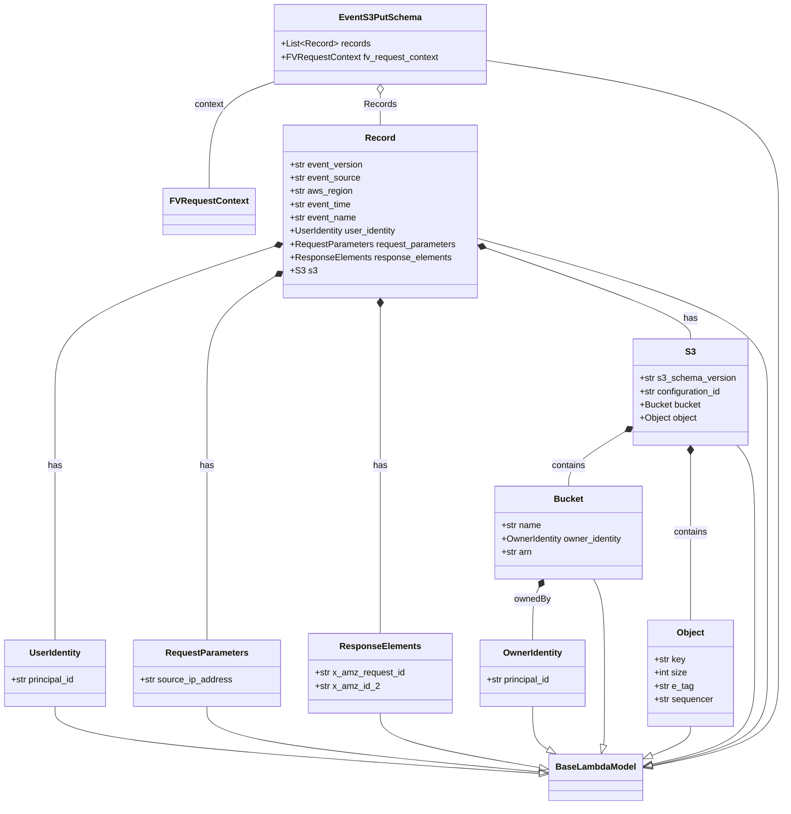

# Diagram: common/fv/python/fv/model/lambdas/event_s3_put.py

> Auto-generated by Obscura crawlers

## Mermaid

### SVG

<svg id="container" width="1415.876953125" xmlns="http://www.w3.org/2000/svg" class="classDiagram" height="1454" viewBox="0 0 1415.876953125 1454" role="graphics-document document" aria-roledescription="class"><g><defs><marker id="container_class-aggregationStart" class="marker aggregation class" refX="18" refY="7" markerWidth="190" markerHeight="240" orient="auto"><path d="M 18,7 L9,13 L1,7 L9,1 Z"></path></marker></defs><defs><marker id="container_class-aggregationEnd" class="marker aggregation class" refX="1" refY="7" markerWidth="20" markerHeight="28" orient="auto"><path d="M 18,7 L9,13 L1,7 L9,1 Z"></path></marker></defs><defs><marker id="container_class-extensionStart" class="marker extension class" refX="18" refY="7" markerWidth="190" markerHeight="240" orient="auto"><path d="M 1,7 L18,13 V 1 Z"></path></marker></defs><defs><marker id="container_class-extensionEnd" class="marker extension class" refX="1" refY="7" markerWidth="20" markerHeight="28" orient="auto"><path d="M 1,1 V 13 L18,7 Z"></path></marker></defs><defs><marker id="container_class-compositionStart" class="marker composition class" refX="18" refY="7" markerWidth="190" markerHeight="240" orient="auto"><path d="M 18,7 L9,13 L1,7 L9,1 Z"></path></marker></defs><defs><marker id="container_class-compositionEnd" class="marker composition class" refX="1" refY="7" markerWidth="20" markerHeight="28" orient="auto"><path d="M 18,7 L9,13 L1,7 L9,1 Z"></path></marker></defs><defs><marker id="container_class-dependencyStart" class="marker dependency class" refX="6" refY="7" markerWidth="190" markerHeight="240" orient="auto"><path d="M 5,7 L9,13 L1,7 L9,1 Z"></path></marker></defs><defs><marker id="container_class-dependencyEnd" class="marker dependency class" refX="13" refY="7" markerWidth="20" markerHeight="28" orient="auto"><path d="M 18,7 L9,13 L14,7 L9,1 Z"></path></marker></defs><defs><marker id="container_class-lollipopStart" class="marker lollipop class" refX="13" refY="7" markerWidth="190" markerHeight="240" orient="auto"><circle stroke="black" fill="transparent" cx="7" cy="7" r="6"></circle></marker></defs><defs><marker id="container_class-lollipopEnd" class="marker lollipop class" refX="1" refY="7" markerWidth="190" markerHeight="240" orient="auto"><circle stroke="black" fill="transparent" cx="7" cy="7" r="6"></circle></marker></defs><g class="root"><g class="clusters"></g><g class="edgePaths"><path d="M101.867,1276L101.867,1286.167C101.867,1296.333,101.867,1316.667,248.05,1336.873C394.232,1357.08,686.597,1377.161,832.78,1387.201L978.962,1397.241" id="id_UserIdentity_BaseLambdaModel_1" class="edge-thickness-normal edge-pattern-solid relation" style=";;;" data-edge="true" data-et="edge" data-id="id_UserIdentity_BaseLambdaModel_1" data-points="W3sieCI6MTAxLjg2NzE4NzUsInkiOjEyNzZ9LHsieCI6MTAxLjg2NzE4NzUsInkiOjEzMzd9LHsieCI6OTk2LjE3MTg3NSwieSI6MTM5OC40MjI3OTI2MTYwMjU0fV0=" marker-end="url(#container_class-extensionEnd)"></path><path d="M376.652,1276L376.652,1286.167C376.652,1296.333,376.652,1316.667,477.044,1336.432C577.435,1356.198,778.218,1375.396,878.609,1384.995L979,1394.594" id="id_RequestParameters_BaseLambdaModel_2" class="edge-thickness-normal edge-pattern-solid relation" style=";;;" data-edge="true" data-et="edge" data-id="id_RequestParameters_BaseLambdaModel_2" data-points="W3sieCI6Mzc2LjY1MjM0Mzc1LCJ5IjoxMjc2fSx7IngiOjM3Ni42NTIzNDM3NSwieSI6MTMzN30seyJ4Ijo5OTYuMTcxODc1LCJ5IjoxMzk2LjIzNTcxNjQ3NTczNjZ9XQ==" marker-end="url(#container_class-extensionEnd)"></path><path d="M685.516,1288L685.516,1296.167C685.516,1304.333,685.516,1320.667,734.458,1337.201C783.4,1353.736,881.284,1370.472,930.226,1378.841L979.169,1387.209" id="id_ResponseElements_BaseLambdaModel_3" class="edge-thickness-normal edge-pattern-solid relation" style=";;;" data-edge="true" data-et="edge" data-id="id_ResponseElements_BaseLambdaModel_3" data-points="W3sieCI6Njg1LjUxNTYyNSwieSI6MTI4OH0seyJ4Ijo2ODUuNTE1NjI1LCJ5IjoxMzM3fSx7IngiOjk5Ni4xNzE4NzUsInkiOjEzOTAuMTE1OTEzNzEyNjY3OX1d" marker-end="url(#container_class-extensionEnd)"></path><path d="M960.879,1276L960.879,1286.167C960.879,1296.333,960.879,1316.667,965.631,1329.567C970.384,1342.467,979.889,1347.933,984.642,1350.667L989.394,1353.4" id="id_OwnerIdentity_BaseLambdaModel_4" class="edge-thickness-normal edge-pattern-solid relation" style=";;;" data-edge="true" data-et="edge" data-id="id_OwnerIdentity_BaseLambdaModel_4" data-points="W3sieCI6OTYwLjg3ODkwNjI1LCJ5IjoxMjc2fSx7IngiOjk2MC44Nzg5MDYyNSwieSI6MTMzN30seyJ4IjoxMDA0LjM0NzU5Nzk0Nzc2MTIsInkiOjEzNjJ9XQ==" marker-end="url(#container_class-extensionEnd)"></path><path d="M1073.051,1046L1076.425,1052.167C1079.8,1058.333,1086.548,1070.667,1089.923,1099C1093.297,1127.333,1093.297,1171.667,1093.297,1214C1093.297,1256.333,1093.297,1296.667,1092.971,1318.203C1092.646,1339.739,1091.995,1342.478,1091.67,1343.848L1091.344,1345.217" id="id_Bucket_BaseLambdaModel_5" class="edge-thickness-normal edge-pattern-solid relation" style=";;;" data-edge="true" data-et="edge" data-id="id_Bucket_BaseLambdaModel_5" data-points="W3sieCI6MTA3My4wNTExNTI1MDUxNjUyLCJ5IjoxMDQ2fSx7IngiOjEwOTMuMjk2ODc1LCJ5IjoxMDgzfSx7IngiOjEwOTMuMjk2ODc1LCJ5IjoxMjE2fSx7IngiOjEwOTMuMjk2ODc1LCJ5IjoxMzM3fSx7IngiOjEwODcuMzU1ODc2ODY1NjcxNywieSI6MTM2Mn1d" marker-end="url(#container_class-extensionEnd)"></path><path d="M1250.631,1312L1250.631,1316.167C1250.631,1320.333,1250.631,1328.667,1237.97,1337.729C1225.31,1346.792,1199.988,1356.584,1187.328,1361.48L1174.667,1366.376" id="id_Object_BaseLambdaModel_6" class="edge-thickness-normal edge-pattern-solid relation" style=";;;" data-edge="true" data-et="edge" data-id="id_Object_BaseLambdaModel_6" data-points="W3sieCI6MTI1MC42MzA4NTkzNzUsInkiOjEzMTJ9LHsieCI6MTI1MC42MzA4NTkzNzUsInkiOjEzMzd9LHsieCI6MTE1OC41NzgxMjUsInkiOjEzNzIuNTk3ODMzMzE2NDIzN31d" marker-end="url(#container_class-extensionEnd)"></path><path d="M1333.535,804L1338.861,810.167C1344.186,816.333,1354.837,828.667,1360.163,855C1365.488,881.333,1365.488,921.667,1365.488,962C1365.488,1002.333,1365.488,1042.667,1365.488,1085C1365.488,1127.333,1365.488,1171.667,1365.488,1214C1365.488,1256.333,1365.488,1296.667,1333.804,1324.202C1302.119,1351.736,1238.749,1366.473,1207.065,1373.841L1175.38,1381.209" id="id_S3_BaseLambdaModel_7" class="edge-thickness-normal edge-pattern-solid relation" style=";;;" data-edge="true" data-et="edge" data-id="id_S3_BaseLambdaModel_7" data-points="W3sieCI6MTMzMy41MzU0NjQ2MzgxNTgsInkiOjgwNH0seyJ4IjoxMzY1LjQ4ODI4MTI1LCJ5Ijo4NDF9LHsieCI6MTM2NS40ODgyODEyNSwieSI6OTYyfSx7IngiOjEzNjUuNDg4MjgxMjUsInkiOjEwODN9LHsieCI6MTM2NS40ODgyODEyNSwieSI6MTIxNn0seyJ4IjoxMzY1LjQ4ODI4MTI1LCJ5IjoxMzM3fSx7IngiOjExNTguNTc4MTI1LCJ5IjoxMzg1LjExNjQyMjg0ODAwMDl9XQ==" marker-end="url(#container_class-extensionEnd)"></path><path d="M859.605,429.838L947.651,454.031C1035.696,478.225,1211.786,526.613,1299.832,572.973C1387.877,619.333,1387.877,663.667,1387.877,708C1387.877,752.333,1387.877,796.667,1387.877,839C1387.877,881.333,1387.877,921.667,1387.877,962C1387.877,1002.333,1387.877,1042.667,1387.877,1085C1387.877,1127.333,1387.877,1171.667,1387.877,1214C1387.877,1256.333,1387.877,1296.667,1352.471,1324.473C1317.065,1352.28,1246.252,1367.56,1210.846,1375.2L1175.44,1382.84" id="id_Record_BaseLambdaModel_8" class="edge-thickness-normal edge-pattern-solid relation" style=";;;" data-edge="true" data-et="edge" data-id="id_Record_BaseLambdaModel_8" data-points="W3sieCI6ODU5LjYwNTQ2ODc1LCJ5Ijo0MjkuODM3Njg0ODE4Nzg5M30seyJ4IjoxMzg3Ljg3Njk1MzEyNSwieSI6NTc1fSx7IngiOjEzODcuODc2OTUzMTI1LCJ5Ijo3MDh9LHsieCI6MTM4Ny44NzY5NTMxMjUsInkiOjg0MX0seyJ4IjoxMzg3Ljg3Njk1MzEyNSwieSI6OTYyfSx7IngiOjEzODcuODc2OTUzMTI1LCJ5IjoxMDgzfSx7IngiOjEzODcuODc2OTUzMTI1LCJ5IjoxMjE2fSx7IngiOjEzODcuODc2OTUzMTI1LCJ5IjoxMzM3fSx7IngiOjExNTguNTc4MTI1LCJ5IjoxMzg2LjQ3ODAxODgzMjkxM31d" marker-end="url(#container_class-extensionEnd)"></path><path d="M872.926,108.279L962.084,121.733C1051.243,135.186,1229.56,162.093,1318.718,207.713C1407.877,253.333,1407.877,317.667,1407.877,382C1407.877,446.333,1407.877,510.667,1407.877,565C1407.877,619.333,1407.877,663.667,1407.877,708C1407.877,752.333,1407.877,796.667,1407.877,839C1407.877,881.333,1407.877,921.667,1407.877,962C1407.877,1002.333,1407.877,1042.667,1407.877,1085C1407.877,1127.333,1407.877,1171.667,1407.877,1214C1407.877,1256.333,1407.877,1296.667,1369.145,1324.685C1330.413,1352.704,1252.948,1368.407,1214.216,1376.259L1175.484,1384.111" id="id_EventS3PutSchema_BaseLambdaModel_9" class="edge-thickness-normal edge-pattern-solid relation" style=";;;" data-edge="true" data-et="edge" data-id="id_EventS3PutSchema_BaseLambdaModel_9" data-points="W3sieCI6ODcyLjkyNTc4MTI1LCJ5IjoxMDguMjc5MDcwNjQ3NzUwODR9LHsieCI6MTQwNy44NzY5NTMxMjUsInkiOjE4OX0seyJ4IjoxNDA3Ljg3Njk1MzEyNSwieSI6MzgyfSx7IngiOjE0MDcuODc2OTUzMTI1LCJ5Ijo1NzV9LHsieCI6MTQwNy44NzY5NTMxMjUsInkiOjcwOH0seyJ4IjoxNDA3Ljg3Njk1MzEyNSwieSI6ODQxfSx7IngiOjE0MDcuODc2OTUzMTI1LCJ5Ijo5NjJ9LHsieCI6MTQwNy44NzY5NTMxMjUsInkiOjEwODN9LHsieCI6MTQwNy44NzY5NTMxMjUsInkiOjEyMTZ9LHsieCI6MTQwNy44NzY5NTMxMjUsInkiOjEzMzd9LHsieCI6MTE1OC41NzgxMjUsInkiOjEzODcuNTM4MzQ0MjU2MTkxN31d" marker-end="url(#container_class-extensionEnd)"></path><path d="M495.048,444.984L429.518,466.653C363.988,488.322,232.927,531.661,167.397,575.497C101.867,619.333,101.867,663.667,101.867,708C101.867,752.333,101.867,796.667,101.867,839C101.867,881.333,101.867,921.667,101.867,962C101.867,1002.333,101.867,1042.667,101.867,1075C101.867,1107.333,101.867,1131.667,101.867,1143.833L101.867,1156" id="id_Record_UserIdentity_10" class="edge-thickness-normal edge-pattern-solid relation" style=";;;" data-edge="true" data-et="edge" data-id="id_Record_UserIdentity_10" data-points="W3sieCI6NTExLjQyNTc4MTI1LCJ5Ijo0MzkuNTY3NzcxNDI3MDQxNjN9LHsieCI6MTAxLjg2NzE4NzUsInkiOjU3NX0seyJ4IjoxMDEuODY3MTg3NSwieSI6NzA4fSx7IngiOjEwMS44NjcxODc1LCJ5Ijo4NDF9LHsieCI6MTAxLjg2NzE4NzUsInkiOjk2Mn0seyJ4IjoxMDEuODY3MTg3NSwieSI6MTA4M30seyJ4IjoxMDEuODY3MTg3NSwieSI6MTE1Nn1d" marker-start="url(#container_class-compositionStart)"></path><path d="M496.797,499.925L476.773,512.437C456.749,524.95,416.701,549.975,396.676,584.654C376.652,619.333,376.652,663.667,376.652,708C376.652,752.333,376.652,796.667,376.652,839C376.652,881.333,376.652,921.667,376.652,962C376.652,1002.333,376.652,1042.667,376.652,1075C376.652,1107.333,376.652,1131.667,376.652,1143.833L376.652,1156" id="id_Record_RequestParameters_11" class="edge-thickness-normal edge-pattern-solid relation" style=";;;" data-edge="true" data-et="edge" data-id="id_Record_RequestParameters_11" data-points="W3sieCI6NTExLjQyNTc4MTI1LCJ5Ijo0OTAuNzgzODU5NjY2ODczMjR9LHsieCI6Mzc2LjY1MjM0Mzc1LCJ5Ijo1NzV9LHsieCI6Mzc2LjY1MjM0Mzc1LCJ5Ijo3MDh9LHsieCI6Mzc2LjY1MjM0Mzc1LCJ5Ijo4NDF9LHsieCI6Mzc2LjY1MjM0Mzc1LCJ5Ijo5NjJ9LHsieCI6Mzc2LjY1MjM0Mzc1LCJ5IjoxMDgzfSx7IngiOjM3Ni42NTIzNDM3NSwieSI6MTE1Nn1d" marker-start="url(#container_class-compositionStart)"></path><path d="M685.516,555.25L685.516,558.542C685.516,561.833,685.516,568.417,685.516,593.875C685.516,619.333,685.516,663.667,685.516,708C685.516,752.333,685.516,796.667,685.516,839C685.516,881.333,685.516,921.667,685.516,962C685.516,1002.333,685.516,1042.667,685.516,1073C685.516,1103.333,685.516,1123.667,685.516,1133.833L685.516,1144" id="id_Record_ResponseElements_12" class="edge-thickness-normal edge-pattern-solid relation" style=";;;" data-edge="true" data-et="edge" data-id="id_Record_ResponseElements_12" data-points="W3sieCI6Njg1LjUxNTYyNSwieSI6NTM4fSx7IngiOjY4NS41MTU2MjUsInkiOjU3NX0seyJ4Ijo2ODUuNTE1NjI1LCJ5Ijo3MDh9LHsieCI6Njg1LjUxNTYyNSwieSI6ODQxfSx7IngiOjY4NS41MTU2MjUsInkiOjk2Mn0seyJ4Ijo2ODUuNTE1NjI1LCJ5IjoxMDgzfSx7IngiOjY4NS41MTU2MjUsInkiOjExNDR9XQ==" marker-start="url(#container_class-compositionStart)"></path><path d="M875.93,447.031L938.38,468.359C1000.83,489.687,1125.73,532.344,1188.181,559.838C1250.631,587.333,1250.631,599.667,1250.631,605.833L1250.631,612" id="id_Record_S3_13" class="edge-thickness-normal edge-pattern-solid relation" style=";;;" data-edge="true" data-et="edge" data-id="id_Record_S3_13" data-points="W3sieCI6ODU5LjYwNTQ2ODc1LCJ5Ijo0NDEuNDU1NzMxODU3Nzg2Mn0seyJ4IjoxMjUwLjYzMDg1OTM3NSwieSI6NTc1fSx7IngiOjEyNTAuNjMwODU5Mzc1LCJ5Ijo2MTJ9XQ==" marker-start="url(#container_class-compositionStart)"></path><path d="M1133.56,777.653L1115.815,788.211C1098.069,798.769,1062.579,819.884,1044.833,836.609C1027.088,853.333,1027.088,865.667,1027.088,871.833L1027.088,878" id="id_S3_Bucket_14" class="edge-thickness-normal edge-pattern-solid relation" style=";;;" data-edge="true" data-et="edge" data-id="id_S3_Bucket_14" data-points="W3sieCI6MTE0OC4zODQ3NjU2MjUsInkiOjc2OC44MzI3MzYyOTU4MDQ1fSx7IngiOjEwMjcuMDg3ODkwNjI1LCJ5Ijo4NDF9LHsieCI6MTAyNy4wODc4OTA2MjUsInkiOjg3OH1d" marker-start="url(#container_class-compositionStart)"></path><path d="M1250.631,821.25L1250.631,824.542C1250.631,827.833,1250.631,834.417,1250.631,857.875C1250.631,881.333,1250.631,921.667,1250.631,962C1250.631,1002.333,1250.631,1042.667,1250.631,1069C1250.631,1095.333,1250.631,1107.667,1250.631,1113.833L1250.631,1120" id="id_S3_Object_15" class="edge-thickness-normal edge-pattern-solid relation" style=";;;" data-edge="true" data-et="edge" data-id="id_S3_Object_15" data-points="W3sieCI6MTI1MC42MzA4NTkzNzUsInkiOjgwNH0seyJ4IjoxMjUwLjYzMDg1OTM3NSwieSI6ODQxfSx7IngiOjEyNTAuNjMwODU5Mzc1LCJ5Ijo5NjJ9LHsieCI6MTI1MC42MzA4NTkzNzUsInkiOjEwODN9LHsieCI6MTI1MC42MzA4NTkzNzUsInkiOjExMjB9XQ==" marker-start="url(#container_class-compositionStart)"></path><path d="M972.844,1061.133L970.85,1064.777C968.856,1068.422,964.867,1075.711,962.873,1091.522C960.879,1107.333,960.879,1131.667,960.879,1143.833L960.879,1156" id="id_Bucket_OwnerIdentity_16" class="edge-thickness-normal edge-pattern-solid relation" style=";;;" data-edge="true" data-et="edge" data-id="id_Bucket_OwnerIdentity_16" data-points="W3sieCI6OTgxLjEyNDYyODc0NDgzNDcsInkiOjEwNDZ9LHsieCI6OTYwLjg3ODkwNjI1LCJ5IjoxMDgzfSx7IngiOjk2MC44Nzg5MDYyNSwieSI6MTE1Nn1d" marker-start="url(#container_class-compositionStart)"></path><path d="M685.516,169.25L685.516,172.542C685.516,175.833,685.516,182.417,685.516,191.875C685.516,201.333,685.516,213.667,685.516,219.833L685.516,226" id="id_EventS3PutSchema_Record_17" class="edge-thickness-normal edge-pattern-solid relation" style=";;;" data-edge="true" data-et="edge" data-id="id_EventS3PutSchema_Record_17" data-points="W3sieCI6Njg1LjUxNTYyNSwieSI6MTUyfSx7IngiOjY4NS41MTU2MjUsInkiOjE4OX0seyJ4Ijo2ODUuNTE1NjI1LCJ5IjoyMjZ9XQ==" marker-start="url(#container_class-aggregationStart)"></path><path d="M498.105,147.487L478.892,154.406C459.678,161.325,421.251,175.162,402.038,207.248C382.824,239.333,382.824,289.667,382.824,314.833L382.824,340" id="id_EventS3PutSchema_FVRequestContext_18" class="edge-thickness-normal edge-pattern-solid relation" style=";;;" data-edge="true" data-et="edge" data-id="id_EventS3PutSchema_FVRequestContext_18" data-points="W3sieCI6NDk4LjEwNTQ2ODc1LCJ5IjoxNDcuNDg2OTA3ODE5MTc0MzV9LHsieCI6MzgyLjgyNDIxODc1LCJ5IjoxODl9LHsieCI6MzgyLjgyNDIxODc1LCJ5IjozNDB9XQ=="></path></g><g class="edgeLabels"><g class="edgeLabel"><g class="label" data-id="id_UserIdentity_BaseLambdaModel_1" transform="translate(0, 0)"><foreignObject width="0" height="0">

</foreignObject></g></g><g class="edgeLabel"><g class="label" data-id="id_RequestParameters_BaseLambdaModel_2" transform="translate(0, 0)"><foreignObject width="0" height="0">

</foreignObject></g></g><g class="edgeLabel"><g class="label" data-id="id_ResponseElements_BaseLambdaModel_3" transform="translate(0, 0)"><foreignObject width="0" height="0">

</foreignObject></g></g><g class="edgeLabel"><g class="label" data-id="id_OwnerIdentity_BaseLambdaModel_4" transform="translate(0, 0)"><foreignObject width="0" height="0">

</foreignObject></g></g><g class="edgeLabel"><g class="label" data-id="id_Bucket_BaseLambdaModel_5" transform="translate(0, 0)"><foreignObject width="0" height="0">

</foreignObject></g></g><g class="edgeLabel"><g class="label" data-id="id_Object_BaseLambdaModel_6" transform="translate(0, 0)"><foreignObject width="0" height="0">

</foreignObject></g></g><g class="edgeLabel"><g class="label" data-id="id_S3_BaseLambdaModel_7" transform="translate(0, 0)"><foreignObject width="0" height="0">

</foreignObject></g></g><g class="edgeLabel"><g class="label" data-id="id_Record_BaseLambdaModel_8" transform="translate(0, 0)"><foreignObject width="0" height="0">

</foreignObject></g></g><g class="edgeLabel"><g class="label" data-id="id_EventS3PutSchema_BaseLambdaModel_9" transform="translate(0, 0)"><foreignObject width="0" height="0">

</foreignObject></g></g><g class="edgeLabel" transform="translate(101.8671875, 841)"><g class="label" data-id="id_Record_UserIdentity_10" transform="translate(-12.703125, -12)"><foreignObject width="25.40625" height="24">

has

</foreignObject></g></g><g class="edgeLabel" transform="translate(376.65234375, 841)"><g class="label" data-id="id_Record_RequestParameters_11" transform="translate(-12.703125, -12)"><foreignObject width="25.40625" height="24">

has

</foreignObject></g></g><g class="edgeLabel" transform="translate(685.515625, 841)"><g class="label" data-id="id_Record_ResponseElements_12" transform="translate(-12.703125, -12)"><foreignObject width="25.40625" height="24">

has

</foreignObject></g></g><g class="edgeLabel" transform="translate(1250.630859375, 575)"><g class="label" data-id="id_Record_S3_13" transform="translate(-12.703125, -12)"><foreignObject width="25.40625" height="24">

has

</foreignObject></g></g><g class="edgeLabel" transform="translate(1027.087890625, 841)"><g class="label" data-id="id_S3_Bucket_14" transform="translate(-30.890625, -12)"><foreignObject width="61.78125" height="24">

contains

</foreignObject></g></g><g class="edgeLabel" transform="translate(1250.630859375, 962)"><g class="label" data-id="id_S3_Object_15" transform="translate(-30.890625, -12)"><foreignObject width="61.78125" height="24">

contains

</foreignObject></g></g><g class="edgeLabel" transform="translate(960.87890625, 1083)"><g class="label" data-id="id_Bucket_OwnerIdentity_16" transform="translate(-33.046875, -12)"><foreignObject width="66.09375" height="24">

ownedBy

</foreignObject></g></g><g class="edgeLabel" transform="translate(685.515625, 189)"><g class="label" data-id="id_EventS3PutSchema_Record_17" transform="translate(-28.7890625, -12)"><foreignObject width="57.578125" height="24">

Records

</foreignObject></g></g><g class="edgeLabel" transform="translate(382.82421875, 189)"><g class="label" data-id="id_EventS3PutSchema_FVRequestContext_18" transform="translate(-26.8515625, -12)"><foreignObject width="53.703125" height="24">

context

</foreignObject></g></g></g><g class="nodes"><g class="node default" id="classId-BaseLambdaModel-0" transform="translate(1077.375, 1404)"><g class="basic label-container"><path d="M-81.203125 -42 L81.203125 -42 L81.203125 42 L-81.203125 42" stroke="none" stroke-width="0" fill="#ECECFF" style=""></path><path d="M-81.203125 -42 C-47.501155551380045 -42, -13.799186102760089 -42, 81.203125 -42 M-81.203125 -42 C-46.79012090060242 -42, -12.377116801204835 -42, 81.203125 -42 M81.203125 -42 C81.203125 -25.150493356549692, 81.203125 -8.300986713099384, 81.203125 42 M81.203125 -42 C81.203125 -20.872004685080494, 81.203125 0.2559906298390118, 81.203125 42 M81.203125 42 C29.747378523326006 42, -21.708367953347988 42, -81.203125 42 M81.203125 42 C37.63757003011525 42, -5.927984939769502 42, -81.203125 42 M-81.203125 42 C-81.203125 15.129923135669717, -81.203125 -11.740153728660566, -81.203125 -42 M-81.203125 42 C-81.203125 10.277979489323183, -81.203125 -21.444041021353634, -81.203125 -42" stroke="#9370DB" stroke-width="1.3" fill="none" stroke-dasharray="0 0" style=""></path></g><g class="annotation-group text" transform="translate(0, -18)"></g><g class="label-group text" transform="translate(-69.203125, -18)"><g class="label" style="font-weight: bolder" transform="translate(0,-12)"><foreignObject width="138.40625" height="24">

BaseLambdaModel

</foreignObject></g></g><g class="members-group text" transform="translate(-69.203125, 30)"></g><g class="methods-group text" transform="translate(-69.203125, 60)"></g><g class="divider" style=""><path d="M-81.203125 6 C-34.141287532143444 6, 12.920549935713112 6, 81.203125 6 M-81.203125 6 C-40.19162833067155 6, 0.819868338656903 6, 81.203125 6" stroke="#9370DB" stroke-width="1.3" fill="none" stroke-dasharray="0 0" style=""></path></g><g class="divider" style=""><path d="M-81.203125 24 C-18.723348551253274 24, 43.75642789749345 24, 81.203125 24 M-81.203125 24 C-33.62736658785921 24, 13.948391824281586 24, 81.203125 24" stroke="#9370DB" stroke-width="1.3" fill="none" stroke-dasharray="0 0" style=""></path></g></g><g class="node default" id="classId-FVRequestContext-1" transform="translate(382.82421875, 382)"><g class="basic label-container"><path d="M-78.6015625 -42 L78.6015625 -42 L78.6015625 42 L-78.6015625 42" stroke="none" stroke-width="0" fill="#ECECFF" style=""></path><path d="M-78.6015625 -42 C-40.063304747391115 -42, -1.5250469947822296 -42, 78.6015625 -42 M-78.6015625 -42 C-30.154441322816062 -42, 18.292679854367876 -42, 78.6015625 -42 M78.6015625 -42 C78.6015625 -13.695721279732368, 78.6015625 14.608557440535265, 78.6015625 42 M78.6015625 -42 C78.6015625 -19.177319835690604, 78.6015625 3.6453603286187928, 78.6015625 42 M78.6015625 42 C24.777593379406362 42, -29.046375741187276 42, -78.6015625 42 M78.6015625 42 C20.82949388953905 42, -36.9425747209219 42, -78.6015625 42 M-78.6015625 42 C-78.6015625 12.437320569616812, -78.6015625 -17.125358860766376, -78.6015625 -42 M-78.6015625 42 C-78.6015625 17.619148383675185, -78.6015625 -6.76170323264963, -78.6015625 -42" stroke="#9370DB" stroke-width="1.3" fill="none" stroke-dasharray="0 0" style=""></path></g><g class="annotation-group text" transform="translate(0, -18)"></g><g class="label-group text" transform="translate(-66.6015625, -18)"><g class="label" style="font-weight: bolder" transform="translate(0,-12)"><foreignObject width="133.203125" height="24">

FVRequestContext

</foreignObject></g></g><g class="members-group text" transform="translate(-66.6015625, 30)"></g><g class="methods-group text" transform="translate(-66.6015625, 60)"></g><g class="divider" style=""><path d="M-78.6015625 6 C-30.394648183305115 6, 17.81226613338977 6, 78.6015625 6 M-78.6015625 6 C-24.16333812215312 6, 30.274886255693758 6, 78.6015625 6" stroke="#9370DB" stroke-width="1.3" fill="none" stroke-dasharray="0 0" style=""></path></g><g class="divider" style=""><path d="M-78.6015625 24 C-31.57395930625099 24, 15.453643887498018 24, 78.6015625 24 M-78.6015625 24 C-42.22052739624592 24, -5.83949229249184 24, 78.6015625 24" stroke="#9370DB" stroke-width="1.3" fill="none" stroke-dasharray="0 0" style=""></path></g></g><g class="node default" id="classId-UserIdentity-2" transform="translate(101.8671875, 1216)"><g class="basic label-container"><path d="M-93.8671875 -60 L93.8671875 -60 L93.8671875 60 L-93.8671875 60" stroke="none" stroke-width="0" fill="#ECECFF" style=""></path><path d="M-93.8671875 -60 C-32.00261179672162 -60, 29.861963906556767 -60, 93.8671875 -60 M-93.8671875 -60 C-43.544542701064515 -60, 6.7781020978709705 -60, 93.8671875 -60 M93.8671875 -60 C93.8671875 -25.928845471517043, 93.8671875 8.142309056965914, 93.8671875 60 M93.8671875 -60 C93.8671875 -29.722981000939026, 93.8671875 0.5540379981219488, 93.8671875 60 M93.8671875 60 C46.073337525053034 60, -1.7205124498939313 60, -93.8671875 60 M93.8671875 60 C54.611350355402784 60, 15.355513210805569 60, -93.8671875 60 M-93.8671875 60 C-93.8671875 28.61890623238368, -93.8671875 -2.7621875352326413, -93.8671875 -60 M-93.8671875 60 C-93.8671875 25.70724728461842, -93.8671875 -8.585505430763163, -93.8671875 -60" stroke="#9370DB" stroke-width="1.3" fill="none" stroke-dasharray="0 0" style=""></path></g><g class="annotation-group text" transform="translate(0, -36)"></g><g class="label-group text" transform="translate(-45.375, -36)"><g class="label" style="font-weight: bolder" transform="translate(0,-12)"><foreignObject width="90.75" height="24">

UserIdentity

</foreignObject></g></g><g class="members-group text" transform="translate(-81.8671875, 12)"><g class="label" style="" transform="translate(0,-12)"><foreignObject width="118.359375" height="24">

+str principal_id

</foreignObject></g></g><g class="methods-group text" transform="translate(-81.8671875, 60)"></g><g class="divider" style=""><path d="M-93.8671875 -12 C-53.199075504955516 -12, -12.530963509911032 -12, 93.8671875 -12 M-93.8671875 -12 C-43.277096441695946 -12, 7.312994616608108 -12, 93.8671875 -12" stroke="#9370DB" stroke-width="1.3" fill="none" stroke-dasharray="0 0" style=""></path></g><g class="divider" style=""><path d="M-93.8671875 36 C-25.04086883314727 36, 43.78544983370546 36, 93.8671875 36 M-93.8671875 36 C-35.2350769506118 36, 23.397033598776403 36, 93.8671875 36" stroke="#9370DB" stroke-width="1.3" fill="none" stroke-dasharray="0 0" style=""></path></g></g><g class="node default" id="classId-RequestParameters-3" transform="translate(376.65234375, 1216)"><g class="basic label-container"><path d="M-130.91796875 -60 L130.91796875 -60 L130.91796875 60 L-130.91796875 60" stroke="none" stroke-width="0" fill="#ECECFF" style=""></path><path d="M-130.91796875 -60 C-49.67259787908033 -60, 31.572772991839344 -60, 130.91796875 -60 M-130.91796875 -60 C-51.4285998957385 -60, 28.060768958523 -60, 130.91796875 -60 M130.91796875 -60 C130.91796875 -31.618218596189685, 130.91796875 -3.2364371923793698, 130.91796875 60 M130.91796875 -60 C130.91796875 -18.384887444487518, 130.91796875 23.230225111024964, 130.91796875 60 M130.91796875 60 C42.8848323191294 60, -45.1483041117412 60, -130.91796875 60 M130.91796875 60 C49.83690707812721 60, -31.244154593745577 60, -130.91796875 60 M-130.91796875 60 C-130.91796875 33.06685592391983, -130.91796875 6.133711847839656, -130.91796875 -60 M-130.91796875 60 C-130.91796875 17.74544086909748, -130.91796875 -24.509118261805042, -130.91796875 -60" stroke="#9370DB" stroke-width="1.3" fill="none" stroke-dasharray="0 0" style=""></path></g><g class="annotation-group text" transform="translate(0, -36)"></g><g class="label-group text" transform="translate(-71.5703125, -36)"><g class="label" style="font-weight: bolder" transform="translate(0,-12)"><foreignObject width="143.140625" height="24">

RequestParameters

</foreignObject></g></g><g class="members-group text" transform="translate(-118.91796875, 12)"><g class="label" style="" transform="translate(0,-12)"><foreignObject width="166.265625" height="24">

+str source_ip_address

</foreignObject></g></g><g class="methods-group text" transform="translate(-118.91796875, 60)"></g><g class="divider" style=""><path d="M-130.91796875 -12 C-45.02540872098707 -12, 40.86715130802585 -12, 130.91796875 -12 M-130.91796875 -12 C-75.07157479282901 -12, -19.225180835658023 -12, 130.91796875 -12" stroke="#9370DB" stroke-width="1.3" fill="none" stroke-dasharray="0 0" style=""></path></g><g class="divider" style=""><path d="M-130.91796875 36 C-73.23052962782555 36, -15.54309050565108 36, 130.91796875 36 M-130.91796875 36 C-34.57563541912464 36, 61.766697911750725 36, 130.91796875 36" stroke="#9370DB" stroke-width="1.3" fill="none" stroke-dasharray="0 0" style=""></path></g></g><g class="node default" id="classId-ResponseElements-4" transform="translate(685.515625, 1216)"><g class="basic label-container"><path d="M-127.9453125 -72 L127.9453125 -72 L127.9453125 72 L-127.9453125 72" stroke="none" stroke-width="0" fill="#ECECFF" style=""></path><path d="M-127.9453125 -72 C-31.981010830261013 -72, 63.983290839477974 -72, 127.9453125 -72 M-127.9453125 -72 C-38.82888106883689 -72, 50.287550362326215 -72, 127.9453125 -72 M127.9453125 -72 C127.9453125 -16.799414807540856, 127.9453125 38.40117038491829, 127.9453125 72 M127.9453125 -72 C127.9453125 -34.978425752872525, 127.9453125 2.0431484942549503, 127.9453125 72 M127.9453125 72 C40.394460688719306 72, -47.15639112256139 72, -127.9453125 72 M127.9453125 72 C74.80815680285843 72, 21.671001105716883 72, -127.9453125 72 M-127.9453125 72 C-127.9453125 20.466688743689545, -127.9453125 -31.06662251262091, -127.9453125 -72 M-127.9453125 72 C-127.9453125 28.90628175654674, -127.9453125 -14.18743648690652, -127.9453125 -72" stroke="#9370DB" stroke-width="1.3" fill="none" stroke-dasharray="0 0" style=""></path></g><g class="annotation-group text" transform="translate(0, -48)"></g><g class="label-group text" transform="translate(-69.078125, -48)"><g class="label" style="font-weight: bolder" transform="translate(0,-12)"><foreignObject width="138.15625" height="24">

ResponseElements

</foreignObject></g></g><g class="members-group text" transform="translate(-115.9453125, 0)"><g class="label" style="" transform="translate(0,-12)"><foreignObject width="162.8125" height="24">

+str x_amz_request_id

</foreignObject></g><g class="label" style="" transform="translate(0,12)"><foreignObject width="115.46875" height="24">

+str x_amz_id_2

</foreignObject></g></g><g class="methods-group text" transform="translate(-115.9453125, 72)"></g><g class="divider" style=""><path d="M-127.9453125 -24 C-45.61813993384223 -24, 36.70903263231554 -24, 127.9453125 -24 M-127.9453125 -24 C-33.472955933726325 -24, 60.99940063254735 -24, 127.9453125 -24" stroke="#9370DB" stroke-width="1.3" fill="none" stroke-dasharray="0 0" style=""></path></g><g class="divider" style=""><path d="M-127.9453125 48 C-36.0987237458875 48, 55.747865008225006 48, 127.9453125 48 M-127.9453125 48 C-71.3824204043172 48, -14.819528308634418 48, 127.9453125 48" stroke="#9370DB" stroke-width="1.3" fill="none" stroke-dasharray="0 0" style=""></path></g></g><g class="node default" id="classId-OwnerIdentity-5" transform="translate(960.87890625, 1216)"><g class="basic label-container"><path d="M-97.41796875 -60 L97.41796875 -60 L97.41796875 60 L-97.41796875 60" stroke="none" stroke-width="0" fill="#ECECFF" style=""></path><path d="M-97.41796875 -60 C-20.65627310455241 -60, 56.10542254089518 -60, 97.41796875 -60 M-97.41796875 -60 C-56.731657331566616 -60, -16.045345913133232 -60, 97.41796875 -60 M97.41796875 -60 C97.41796875 -15.246978695973397, 97.41796875 29.506042608053207, 97.41796875 60 M97.41796875 -60 C97.41796875 -29.519494625345793, 97.41796875 0.9610107493084143, 97.41796875 60 M97.41796875 60 C29.344387109617358 60, -38.729194530765284 60, -97.41796875 60 M97.41796875 60 C24.99013332907998 60, -47.43770209184004 60, -97.41796875 60 M-97.41796875 60 C-97.41796875 27.817365968278878, -97.41796875 -4.365268063442244, -97.41796875 -60 M-97.41796875 60 C-97.41796875 28.307777218453676, -97.41796875 -3.3844455630926475, -97.41796875 -60" stroke="#9370DB" stroke-width="1.3" fill="none" stroke-dasharray="0 0" style=""></path></g><g class="annotation-group text" transform="translate(0, -36)"></g><g class="label-group text" transform="translate(-52.4765625, -36)"><g class="label" style="font-weight: bolder" transform="translate(0,-12)"><foreignObject width="104.953125" height="24">

OwnerIdentity

</foreignObject></g></g><g class="members-group text" transform="translate(-85.41796875, 12)"><g class="label" style="" transform="translate(0,-12)"><foreignObject width="118.359375" height="24">

+str principal_id

</foreignObject></g></g><g class="methods-group text" transform="translate(-85.41796875, 60)"></g><g class="divider" style=""><path d="M-97.41796875 -12 C-30.410342155398766 -12, 36.59728443920247 -12, 97.41796875 -12 M-97.41796875 -12 C-35.27895899266176 -12, 26.860050764676487 -12, 97.41796875 -12" stroke="#9370DB" stroke-width="1.3" fill="none" stroke-dasharray="0 0" style=""></path></g><g class="divider" style=""><path d="M-97.41796875 36 C-46.31847268164667 36, 4.781023386706664 36, 97.41796875 36 M-97.41796875 36 C-52.67446249049134 36, -7.930956230982673 36, 97.41796875 36" stroke="#9370DB" stroke-width="1.3" fill="none" stroke-dasharray="0 0" style=""></path></g></g><g class="node default" id="classId-Bucket-6" transform="translate(1027.087890625, 962)"><g class="basic label-container"><path d="M-136.30859375 -84 L136.30859375 -84 L136.30859375 84 L-136.30859375 84" stroke="none" stroke-width="0" fill="#ECECFF" style=""></path><path d="M-136.30859375 -84 C-66.49995643079095 -84, 3.3086808884181096 -84, 136.30859375 -84 M-136.30859375 -84 C-67.25154384744644 -84, 1.8055060551071165 -84, 136.30859375 -84 M136.30859375 -84 C136.30859375 -44.436480582033944, 136.30859375 -4.872961164067888, 136.30859375 84 M136.30859375 -84 C136.30859375 -42.43214291222676, 136.30859375 -0.8642858244535176, 136.30859375 84 M136.30859375 84 C42.10203623896818 84, -52.104521272063636 84, -136.30859375 84 M136.30859375 84 C55.082036656349885 84, -26.14452043730023 84, -136.30859375 84 M-136.30859375 84 C-136.30859375 29.8060981560716, -136.30859375 -24.387803687856803, -136.30859375 -84 M-136.30859375 84 C-136.30859375 40.75532646095235, -136.30859375 -2.4893470780953066, -136.30859375 -84" stroke="#9370DB" stroke-width="1.3" fill="none" stroke-dasharray="0 0" style=""></path></g><g class="annotation-group text" transform="translate(0, -60)"></g><g class="label-group text" transform="translate(-25.1640625, -60)"><g class="label" style="font-weight: bolder" transform="translate(0,-12)"><foreignObject width="50.328125" height="24">

Bucket

</foreignObject></g></g><g class="members-group text" transform="translate(-124.30859375, -12)"><g class="label" style="" transform="translate(0,-12)"><foreignObject width="72.171875" height="24">

+str name

</foreignObject></g><g class="label" style="" transform="translate(0,12)"><foreignObject width="223.453125" height="24">

+OwnerIdentity owner_identity

</foreignObject></g><g class="label" style="" transform="translate(0,36)"><foreignObject width="55.90625" height="24">

+str arn

</foreignObject></g></g><g class="methods-group text" transform="translate(-124.30859375, 84)"></g><g class="divider" style=""><path d="M-136.30859375 -36 C-67.88241064984744 -36, 0.5437724503051129 -36, 136.30859375 -36 M-136.30859375 -36 C-59.476901325930456 -36, 17.35479109813909 -36, 136.30859375 -36" stroke="#9370DB" stroke-width="1.3" fill="none" stroke-dasharray="0 0" style=""></path></g><g class="divider" style=""><path d="M-136.30859375 60 C-73.34702304623502 60, -10.385452342470032 60, 136.30859375 60 M-136.30859375 60 C-67.95268448017914 60, 0.4032247896417118 60, 136.30859375 60" stroke="#9370DB" stroke-width="1.3" fill="none" stroke-dasharray="0 0" style=""></path></g></g><g class="node default" id="classId-Object-7" transform="translate(1250.630859375, 1216)"><g class="basic label-container"><path d="M-77.46875 -96 L77.46875 -96 L77.46875 96 L-77.46875 96" stroke="none" stroke-width="0" fill="#ECECFF" style=""></path><path d="M-77.46875 -96 C-29.409674730282617 -96, 18.649400539434765 -96, 77.46875 -96 M-77.46875 -96 C-43.030959124598 -96, -8.593168249195998 -96, 77.46875 -96 M77.46875 -96 C77.46875 -52.538784020458536, 77.46875 -9.077568040917072, 77.46875 96 M77.46875 -96 C77.46875 -36.18816357819789, 77.46875 23.623672843604226, 77.46875 96 M77.46875 96 C16.89741137198775 96, -43.6739272560245 96, -77.46875 96 M77.46875 96 C25.64120811853499 96, -26.18633376293002 96, -77.46875 96 M-77.46875 96 C-77.46875 34.463641582042456, -77.46875 -27.072716835915088, -77.46875 -96 M-77.46875 96 C-77.46875 35.74991002950175, -77.46875 -24.500179940996503, -77.46875 -96" stroke="#9370DB" stroke-width="1.3" fill="none" stroke-dasharray="0 0" style=""></path></g><g class="annotation-group text" transform="translate(0, -72)"></g><g class="label-group text" transform="translate(-23.890625, -72)"><g class="label" style="font-weight: bolder" transform="translate(0,-12)"><foreignObject width="47.78125" height="24">

Object

</foreignObject></g></g><g class="members-group text" transform="translate(-65.46875, -24)"><g class="label" style="" transform="translate(0,-12)"><foreignObject width="56.234375" height="24">

+str key

</foreignObject></g><g class="label" style="" transform="translate(0,12)"><foreignObject width="59.484375" height="24">

+int size

</foreignObject></g><g class="label" style="" transform="translate(0,36)"><foreignObject width="70.578125" height="24">

+str e_tag

</foreignObject></g><g class="label" style="" transform="translate(0,60)"><foreignObject width="107.046875" height="24">

+str sequencer

</foreignObject></g></g><g class="methods-group text" transform="translate(-65.46875, 96)"></g><g class="divider" style=""><path d="M-77.46875 -48 C-19.900824024320258 -48, 37.667101951359484 -48, 77.46875 -48 M-77.46875 -48 C-41.25147482821729 -48, -5.034199656434581 -48, 77.46875 -48" stroke="#9370DB" stroke-width="1.3" fill="none" stroke-dasharray="0 0" style=""></path></g><g class="divider" style=""><path d="M-77.46875 72 C-18.176381542707695 72, 41.11598691458461 72, 77.46875 72 M-77.46875 72 C-21.42302950596997 72, 34.62269098806006 72, 77.46875 72" stroke="#9370DB" stroke-width="1.3" fill="none" stroke-dasharray="0 0" style=""></path></g></g><g class="node default" id="classId-S3-8" transform="translate(1250.630859375, 708)"><g class="basic label-container"><path d="M-102.24609375 -96 L102.24609375 -96 L102.24609375 96 L-102.24609375 96" stroke="none" stroke-width="0" fill="#ECECFF" style=""></path><path d="M-102.24609375 -96 C-47.67207119239241 -96, 6.901951365215183 -96, 102.24609375 -96 M-102.24609375 -96 C-43.99234713736627 -96, 14.261399475267467 -96, 102.24609375 -96 M102.24609375 -96 C102.24609375 -30.274194190765428, 102.24609375 35.451611618469144, 102.24609375 96 M102.24609375 -96 C102.24609375 -29.354438848510057, 102.24609375 37.291122302979886, 102.24609375 96 M102.24609375 96 C53.401899501250256 96, 4.5577052525005115 96, -102.24609375 96 M102.24609375 96 C34.12717496692402 96, -33.99174381615197 96, -102.24609375 96 M-102.24609375 96 C-102.24609375 28.587576612913324, -102.24609375 -38.82484677417335, -102.24609375 -96 M-102.24609375 96 C-102.24609375 31.062140732183934, -102.24609375 -33.87571853563213, -102.24609375 -96" stroke="#9370DB" stroke-width="1.3" fill="none" stroke-dasharray="0 0" style=""></path></g><g class="annotation-group text" transform="translate(0, -72)"></g><g class="label-group text" transform="translate(-8.7421875, -72)"><g class="label" style="font-weight: bolder" transform="translate(0,-12)"><foreignObject width="17.484375" height="24">

S3

</foreignObject></g></g><g class="members-group text" transform="translate(-90.24609375, -24)"><g class="label" style="" transform="translate(0,-12)"><foreignObject width="171.75" height="24">

+str s3_schema_version

</foreignObject></g><g class="label" style="" transform="translate(0,12)"><foreignObject width="150.109375" height="24">

+str configuration_id

</foreignObject></g><g class="label" style="" transform="translate(0,36)"><foreignObject width="110.46875" height="24">

+Bucket bucket

</foreignObject></g><g class="label" style="" transform="translate(0,60)"><foreignObject width="104.90625" height="24">

+Object object

</foreignObject></g></g><g class="methods-group text" transform="translate(-90.24609375, 96)"></g><g class="divider" style=""><path d="M-102.24609375 -48 C-33.17276140348186 -48, 35.900570943036286 -48, 102.24609375 -48 M-102.24609375 -48 C-29.894627838053736 -48, 42.45683807389253 -48, 102.24609375 -48" stroke="#9370DB" stroke-width="1.3" fill="none" stroke-dasharray="0 0" style=""></path></g><g class="divider" style=""><path d="M-102.24609375 72 C-37.665022579077956 72, 26.91604859184409 72, 102.24609375 72 M-102.24609375 72 C-42.050142517811544 72, 18.145808714376912 72, 102.24609375 72" stroke="#9370DB" stroke-width="1.3" fill="none" stroke-dasharray="0 0" style=""></path></g></g><g class="node default" id="classId-Record-9" transform="translate(685.515625, 382)"><g class="basic label-container"><path d="M-174.08984375 -156 L174.08984375 -156 L174.08984375 156 L-174.08984375 156" stroke="none" stroke-width="0" fill="#ECECFF" style=""></path><path d="M-174.08984375 -156 C-99.18347913015802 -156, -24.27711451031604 -156, 174.08984375 -156 M-174.08984375 -156 C-41.01476208108514 -156, 92.06031958782972 -156, 174.08984375 -156 M174.08984375 -156 C174.08984375 -65.35036480056672, 174.08984375 25.299270398866554, 174.08984375 156 M174.08984375 -156 C174.08984375 -74.25239208334577, 174.08984375 7.495215833308464, 174.08984375 156 M174.08984375 156 C42.92264407756889 156, -88.24455559486222 156, -174.08984375 156 M174.08984375 156 C91.79637976879556 156, 9.502915787591121 156, -174.08984375 156 M-174.08984375 156 C-174.08984375 62.84129901313645, -174.08984375 -30.3174019737271, -174.08984375 -156 M-174.08984375 156 C-174.08984375 70.01327059191387, -174.08984375 -15.973458816172268, -174.08984375 -156" stroke="#9370DB" stroke-width="1.3" fill="none" stroke-dasharray="0 0" style=""></path></g><g class="annotation-group text" transform="translate(0, -132)"></g><g class="label-group text" transform="translate(-25.3515625, -132)"><g class="label" style="font-weight: bolder" transform="translate(0,-12)"><foreignObject width="50.703125" height="24">

Record

</foreignObject></g></g><g class="members-group text" transform="translate(-162.08984375, -84)"><g class="label" style="" transform="translate(0,-12)"><foreignObject width="133" height="24">

+str event_version

</foreignObject></g><g class="label" style="" transform="translate(0,12)"><foreignObject width="128.1875" height="24">

+str event_source

</foreignObject></g><g class="label" style="" transform="translate(0,36)"><foreignObject width="113.1875" height="24">

+str aws_region

</foreignObject></g><g class="label" style="" transform="translate(0,60)"><foreignObject width="112.71875" height="24">

+str event_time

</foreignObject></g><g class="label" style="" transform="translate(0,84)"><foreignObject width="120.828125" height="24">

+str event_name

</foreignObject></g><g class="label" style="" transform="translate(0,108)"><foreignObject width="196.109375" height="24">

+UserIdentity user_identity

</foreignObject></g><g class="label" style="" transform="translate(0,132)"><foreignObject width="298.828125" height="24">

+RequestParameters request_parameters

</foreignObject></g><g class="label" style="" transform="translate(0,156)"><foreignObject width="290.203125" height="24">

+ResponseElements response_elements

</foreignObject></g><g class="label" style="" transform="translate(0,180)"><foreignObject width="43.75" height="24">

+S3 s3

</foreignObject></g></g><g class="methods-group text" transform="translate(-162.08984375, 156)"></g><g class="divider" style=""><path d="M-174.08984375 -108 C-78.59570502030093 -108, 16.898433709398148 -108, 174.08984375 -108 M-174.08984375 -108 C-64.49248552736736 -108, 45.10487269526527 -108, 174.08984375 -108" stroke="#9370DB" stroke-width="1.3" fill="none" stroke-dasharray="0 0" style=""></path></g><g class="divider" style=""><path d="M-174.08984375 132 C-46.580484810579534 132, 80.92887412884093 132, 174.08984375 132 M-174.08984375 132 C-101.31603241325483 132, -28.542221076509662 132, 174.08984375 132" stroke="#9370DB" stroke-width="1.3" fill="none" stroke-dasharray="0 0" style=""></path></g></g><g class="node default" id="classId-EventS3PutSchema-10" transform="translate(685.515625, 80)"><g class="basic label-container"><path d="M-187.41015625 -72 L187.41015625 -72 L187.41015625 72 L-187.41015625 72" stroke="none" stroke-width="0" fill="#ECECFF" style=""></path><path d="M-187.41015625 -72 C-64.83024535377793 -72, 57.74966554244415 -72, 187.41015625 -72 M-187.41015625 -72 C-38.40075476301453 -72, 110.60864672397093 -72, 187.41015625 -72 M187.41015625 -72 C187.41015625 -24.24318811211871, 187.41015625 23.513623775762582, 187.41015625 72 M187.41015625 -72 C187.41015625 -20.759581841418033, 187.41015625 30.480836317163934, 187.41015625 72 M187.41015625 72 C94.6426808793254 72, 1.8752055086507937 72, -187.41015625 72 M187.41015625 72 C73.27199217458977 72, -40.86617190082046 72, -187.41015625 72 M-187.41015625 72 C-187.41015625 37.08108376268167, -187.41015625 2.162167525363344, -187.41015625 -72 M-187.41015625 72 C-187.41015625 24.065401148227714, -187.41015625 -23.86919770354457, -187.41015625 -72" stroke="#9370DB" stroke-width="1.3" fill="none" stroke-dasharray="0 0" style=""></path></g><g class="annotation-group text" transform="translate(0, -48)"></g><g class="label-group text" transform="translate(-69.7890625, -48)"><g class="label" style="font-weight: bolder" transform="translate(0,-12)"><foreignObject width="139.578125" height="24">

EventS3PutSchema

</foreignObject></g></g><g class="members-group text" transform="translate(-175.41015625, 0)"><g class="label" style="" transform="translate(0,-12)"><foreignObject width="157.875" height="24">

+List&lt;Record&gt; records

</foreignObject></g><g class="label" style="" transform="translate(0,12)"><foreignObject width="281.03125" height="24">

+FVRequestContext fv_request_context

</foreignObject></g></g><g class="methods-group text" transform="translate(-175.41015625, 72)"></g><g class="divider" style=""><path d="M-187.41015625 -24 C-37.52054160298792 -24, 112.36907304402416 -24, 187.41015625 -24 M-187.41015625 -24 C-47.59028570340038 -24, 92.22958484319923 -24, 187.41015625 -24" stroke="#9370DB" stroke-width="1.3" fill="none" stroke-dasharray="0 0" style=""></path></g><g class="divider" style=""><path d="M-187.41015625 48 C-70.4562001246846 48, 46.4977560006308 48, 187.41015625 48 M-187.41015625 48 C-80.74408714867963 48, 25.92198195264075 48, 187.41015625 48" stroke="#9370DB" stroke-width="1.3" fill="none" stroke-dasharray="0 0" style=""></path></g></g></g></g></g></svg>
