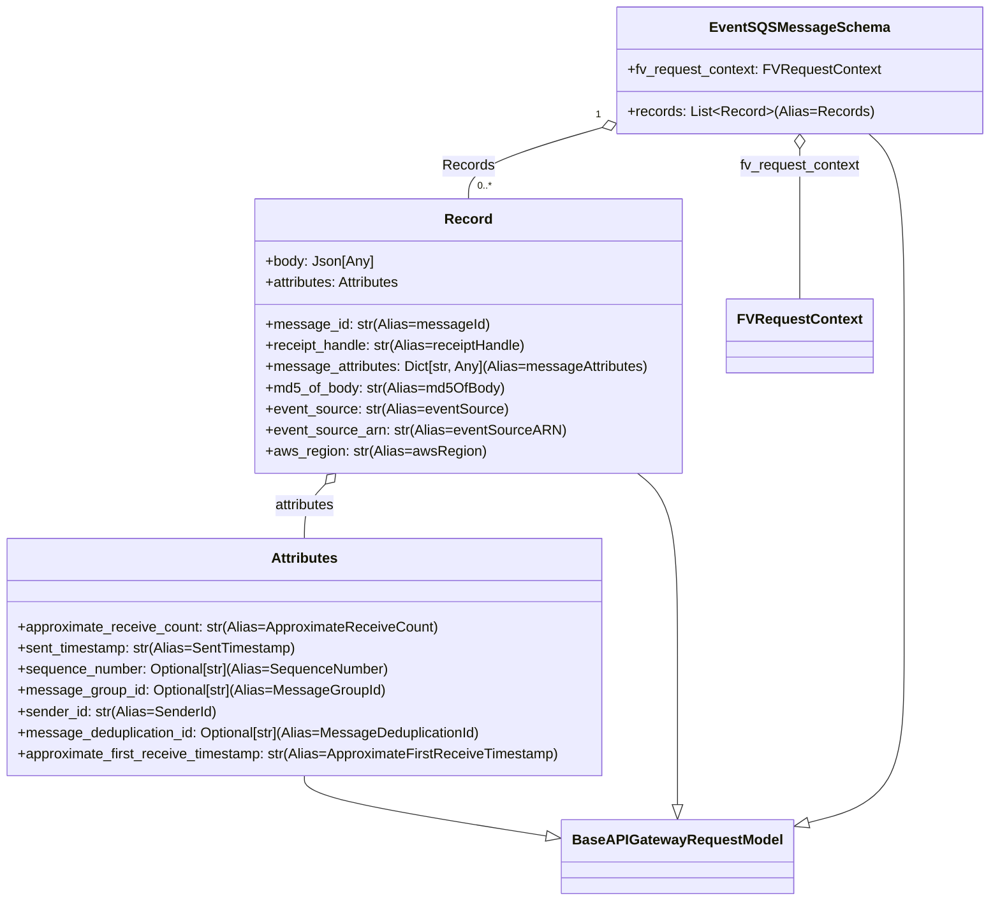

# Diagram: common/fv/python/fv/model/lambdas/event_sqs_message.py

> Auto-generated by Obscura crawlers

## Mermaid

### SVG

<svg id="container" width="1116.6171875" xmlns="http://www.w3.org/2000/svg" class="classDiagram" height="1024" viewBox="0 0 1116.6171875 1024" role="graphics-document document" aria-roledescription="class"><g><defs><marker id="container_class-aggregationStart" class="marker aggregation class" refX="18" refY="7" markerWidth="190" markerHeight="240" orient="auto"><path d="M 18,7 L9,13 L1,7 L9,1 Z"></path></marker></defs><defs><marker id="container_class-aggregationEnd" class="marker aggregation class" refX="1" refY="7" markerWidth="20" markerHeight="28" orient="auto"><path d="M 18,7 L9,13 L1,7 L9,1 Z"></path></marker></defs><defs><marker id="container_class-extensionStart" class="marker extension class" refX="18" refY="7" markerWidth="190" markerHeight="240" orient="auto"><path d="M 1,7 L18,13 V 1 Z"></path></marker></defs><defs><marker id="container_class-extensionEnd" class="marker extension class" refX="1" refY="7" markerWidth="20" markerHeight="28" orient="auto"><path d="M 1,1 V 13 L18,7 Z"></path></marker></defs><defs><marker id="container_class-compositionStart" class="marker composition class" refX="18" refY="7" markerWidth="190" markerHeight="240" orient="auto"><path d="M 18,7 L9,13 L1,7 L9,1 Z"></path></marker></defs><defs><marker id="container_class-compositionEnd" class="marker composition class" refX="1" refY="7" markerWidth="20" markerHeight="28" orient="auto"><path d="M 18,7 L9,13 L1,7 L9,1 Z"></path></marker></defs><defs><marker id="container_class-dependencyStart" class="marker dependency class" refX="6" refY="7" markerWidth="190" markerHeight="240" orient="auto"><path d="M 5,7 L9,13 L1,7 L9,1 Z"></path></marker></defs><defs><marker id="container_class-dependencyEnd" class="marker dependency class" refX="13" refY="7" markerWidth="20" markerHeight="28" orient="auto"><path d="M 18,7 L9,13 L14,7 L9,1 Z"></path></marker></defs><defs><marker id="container_class-lollipopStart" class="marker lollipop class" refX="13" refY="7" markerWidth="190" markerHeight="240" orient="auto"><circle stroke="black" fill="transparent" cx="7" cy="7" r="6"></circle></marker></defs><defs><marker id="container_class-lollipopEnd" class="marker lollipop class" refX="1" refY="7" markerWidth="190" markerHeight="240" orient="auto"><circle stroke="black" fill="transparent" cx="7" cy="7" r="6"></circle></marker></defs><g class="root"><g class="clusters"></g><g class="edgePaths"><path d="M348.188,882L348.188,886.167C348.188,890.333,348.188,898.667,394.493,910.221C440.799,921.774,533.411,936.549,579.716,943.936L626.022,951.323" id="id_Attributes_BaseAPIGatewayRequestModel_1" class="edge-thickness-normal edge-pattern-solid relation" style=";;;" data-edge="true" data-et="edge" data-id="id_Attributes_BaseAPIGatewayRequestModel_1" data-points="W3sieCI6MzQ4LjE4NzUsInkiOjg4Mn0seyJ4IjozNDguMTg3NSwieSI6OTA3fSx7IngiOjY0My4wNTY2NDA2MjUsInkiOjk1NC4wNDEwNTQ5Mjc0NzQ5fV0=" marker-end="url(#container_class-extensionEnd)"></path><path d="M723.616,538L731.041,544.167C738.466,550.333,753.316,562.667,760.741,597.5C768.166,632.333,768.166,689.667,768.166,745C768.166,800.333,768.166,853.667,768.166,881.625C768.166,909.583,768.166,912.167,768.166,913.458L768.166,914.75" id="id_Record_BaseAPIGatewayRequestModel_2" class="edge-thickness-normal edge-pattern-solid relation" style=";;;" data-edge="true" data-et="edge" data-id="id_Record_BaseAPIGatewayRequestModel_2" data-points="W3sieCI6NzIzLjYxNTU2ODMyOTAxNTYsInkiOjUzOH0seyJ4Ijo3NjguMTY2MDE1NjI1LCJ5Ijo1NzV9LHsieCI6NzY4LjE2NjAxNTYyNSwieSI6NzQ3fSx7IngiOjc2OC4xNjYwMTU2MjUsInkiOjkwN30seyJ4Ijo3NjguMTY2MDE1NjI1LCJ5Ijo5MzJ9XQ==" marker-end="url(#container_class-extensionEnd)"></path><path d="M981.989,152L988.416,158.167C994.843,164.333,1007.697,176.667,1014.124,215C1020.551,253.333,1020.551,317.667,1020.551,382C1020.551,446.333,1020.551,510.667,1020.551,571.5C1020.551,632.333,1020.551,689.667,1020.551,745C1020.551,800.333,1020.551,853.667,1002.117,885.227C983.683,916.787,946.816,926.574,928.382,931.468L909.948,936.361" id="id_EventSQSMessageSchema_BaseAPIGatewayRequestModel_3" class="edge-thickness-normal edge-pattern-solid relation" style=";;;" data-edge="true" data-et="edge" data-id="id_EventSQSMessageSchema_BaseAPIGatewayRequestModel_3" data-points="W3sieCI6OTgxLjk4ODc4Mjk3MDE4MzUsInkiOjE1Mn0seyJ4IjoxMDIwLjU1MDc4MTI1LCJ5IjoxODl9LHsieCI6MTAyMC41NTA3ODEyNSwieSI6MzgyfSx7IngiOjEwMjAuNTUwNzgxMjUsInkiOjU3NX0seyJ4IjoxMDIwLjU1MDc4MTI1LCJ5Ijo3NDd9LHsieCI6MTAyMC41NTA3ODEyNSwieSI6OTA3fSx7IngiOjg5My4yNzUzOTA2MjUsInkiOjk0MC43ODc1MDM1NzkxMzk2fV0=" marker-end="url(#container_class-extensionEnd)"></path><path d="M372.128,550.37L368.138,554.475C364.148,558.58,356.168,566.79,352.178,577.062C348.188,587.333,348.188,599.667,348.188,605.833L348.188,612" id="id_Record_Attributes_4" class="edge-thickness-normal edge-pattern-solid relation" style=";;;" data-edge="true" data-et="edge" data-id="id_Record_Attributes_4" data-points="W3sieCI6Mzg0LjE1MTA2ODY1Mjg0OTc0LCJ5Ijo1Mzh9LHsieCI6MzQ4LjE4NzUsInkiOjU3NX0seyJ4IjozNDguMTg3NSwieSI6NjEyfV0=" marker-start="url(#container_class-aggregationStart)"></path><path d="M688.73,144.084L663.239,151.57C637.747,159.056,586.764,174.028,561.273,187.681C535.781,201.333,535.781,213.667,535.781,219.833L535.781,226" id="id_EventSQSMessageSchema_Record_5" class="edge-thickness-normal edge-pattern-solid relation" style=";;;" data-edge="true" data-et="edge" data-id="id_EventSQSMessageSchema_Record_5" data-points="W3sieCI6NzA1LjI4MTI1LCJ5IjoxMzkuMjIzMzQ0ODA0NzIzMjd9LHsieCI6NTM1Ljc4MTI1LCJ5IjoxODl9LHsieCI6NTM1Ljc4MTI1LCJ5IjoyMjZ9XQ==" marker-start="url(#container_class-aggregationStart)"></path><path d="M906.949,169.25L906.949,172.542C906.949,175.833,906.949,182.417,906.949,210.875C906.949,239.333,906.949,289.667,906.949,314.833L906.949,340" id="id_EventSQSMessageSchema_FVRequestContext_6" class="edge-thickness-normal edge-pattern-solid relation" style=";;;" data-edge="true" data-et="edge" data-id="id_EventSQSMessageSchema_FVRequestContext_6" data-points="W3sieCI6OTA2Ljk0OTIxODc1LCJ5IjoxNTJ9LHsieCI6OTA2Ljk0OTIxODc1LCJ5IjoxODl9LHsieCI6OTA2Ljk0OTIxODc1LCJ5IjozNDB9XQ==" marker-start="url(#container_class-aggregationStart)"></path></g><g class="edgeLabels"><g class="edgeLabel"><g class="label" data-id="id_Attributes_BaseAPIGatewayRequestModel_1" transform="translate(0, 0)"><foreignObject width="0" height="0">

</foreignObject></g></g><g class="edgeLabel"><g class="label" data-id="id_Record_BaseAPIGatewayRequestModel_2" transform="translate(0, 0)"><foreignObject width="0" height="0">

</foreignObject></g></g><g class="edgeLabel"><g class="label" data-id="id_EventSQSMessageSchema_BaseAPIGatewayRequestModel_3" transform="translate(0, 0)"><foreignObject width="0" height="0">

</foreignObject></g></g><g class="edgeLabel" transform="translate(348.1875, 575)"><g class="label" data-id="id_Record_Attributes_4" transform="translate(-35.75, -12)"><foreignObject width="71.5" height="24">

attributes

</foreignObject></g></g><g class="edgeLabel" transform="translate(535.78125, 189)"><g class="label" data-id="id_EventSQSMessageSchema_Record_5" transform="translate(-28.7890625, -12)"><foreignObject width="57.578125" height="24">

Records

</foreignObject></g></g><g class="edgeLabel" transform="translate(906.94921875, 189)"><g class="label" data-id="id_EventSQSMessageSchema_FVRequestContext_6" transform="translate(-69.0234375, -12)"><foreignObject width="138.046875" height="24">

fv_request_context

</foreignObject></g></g><g class="edgeTerminals" transform="translate(684.2637789232716, 129.7620621674355)"><g class="inner" transform="translate(0, 0)"><foreignObject style="width: 9px; height: 12px;">
1
</foreignObject></g></g><g class="edgeTerminals" transform="translate(545.78125, 203.5)"><g class="inner" transform="translate(0, 0)"></g><foreignObject style="width: 36px; height: 12px;">
0..*
</foreignObject></g></g><g class="nodes"><g class="node default" id="classId-BaseAPIGatewayRequestModel-0" transform="translate(768.166015625, 974)"><g class="basic label-container"><path d="M-125.109375 -42 L125.109375 -42 L125.109375 42 L-125.109375 42" stroke="none" stroke-width="0" fill="#ECECFF" style=""></path><path d="M-125.109375 -42 C-50.40080369799364 -42, 24.307767604012724 -42, 125.109375 -42 M-125.109375 -42 C-38.675990976311255 -42, 47.75739304737749 -42, 125.109375 -42 M125.109375 -42 C125.109375 -21.882330685725453, 125.109375 -1.7646613714509058, 125.109375 42 M125.109375 -42 C125.109375 -24.101548217478665, 125.109375 -6.203096434957331, 125.109375 42 M125.109375 42 C45.759808501645594 42, -33.58975799670881 42, -125.109375 42 M125.109375 42 C68.03220678611083 42, 10.955038572221682 42, -125.109375 42 M-125.109375 42 C-125.109375 17.89227649657474, -125.109375 -6.215447006850518, -125.109375 -42 M-125.109375 42 C-125.109375 22.602679855293253, -125.109375 3.2053597105865066, -125.109375 -42" stroke="#9370DB" stroke-width="1.3" fill="none" stroke-dasharray="0 0" style=""></path></g><g class="annotation-group text" transform="translate(0, -18)"></g><g class="label-group text" transform="translate(-113.109375, -18)"><g class="label" style="font-weight: bolder" transform="translate(0,-12)"><foreignObject width="226.21875" height="24">

BaseAPIGatewayRequestModel

</foreignObject></g></g><g class="members-group text" transform="translate(-113.109375, 30)"></g><g class="methods-group text" transform="translate(-113.109375, 60)"></g><g class="divider" style=""><path d="M-125.109375 6 C-46.85994939255998 6, 31.389476214880034 6, 125.109375 6 M-125.109375 6 C-65.15836961344743 6, -5.207364226894853 6, 125.109375 6" stroke="#9370DB" stroke-width="1.3" fill="none" stroke-dasharray="0 0" style=""></path></g><g class="divider" style=""><path d="M-125.109375 24 C-44.43255061648837 24, 36.24427376702326 24, 125.109375 24 M-125.109375 24 C-65.5728075651487 24, -6.0362401302973865 24, 125.109375 24" stroke="#9370DB" stroke-width="1.3" fill="none" stroke-dasharray="0 0" style=""></path></g></g><g class="node default" id="classId-Attributes-1" transform="translate(348.1875, 747)"><g class="basic label-container"><path d="M-340.1875 -135 L340.1875 -135 L340.1875 135 L-340.1875 135" stroke="none" stroke-width="0" fill="#ECECFF" style=""></path><path d="M-340.1875 -135 C-88.47062927871244 -135, 163.24624144257513 -135, 340.1875 -135 M-340.1875 -135 C-153.3861966848027 -135, 33.415106630394575 -135, 340.1875 -135 M340.1875 -135 C340.1875 -35.50432940938755, 340.1875 63.9913411812249, 340.1875 135 M340.1875 -135 C340.1875 -75.81529886537561, 340.1875 -16.630597730751205, 340.1875 135 M340.1875 135 C99.28072838417734 135, -141.62604323164533 135, -340.1875 135 M340.1875 135 C123.76247451155137 135, -92.66255097689725 135, -340.1875 135 M-340.1875 135 C-340.1875 65.82471528108591, -340.1875 -3.3505694378281703, -340.1875 -135 M-340.1875 135 C-340.1875 32.624348011600034, -340.1875 -69.75130397679993, -340.1875 -135" stroke="#9370DB" stroke-width="1.3" fill="none" stroke-dasharray="0 0" style=""></path></g><g class="annotation-group text" transform="translate(0, -111)"></g><g class="label-group text" transform="translate(-36.9375, -111)"><g class="label" style="font-weight: bolder" transform="translate(0,-12)"><foreignObject width="73.875" height="24">

Attributes

</foreignObject></g></g><g class="members-group text" transform="translate(-328.1875, -63)"></g><g class="methods-group text" transform="translate(-328.1875, -33)"><g class="label" style="" transform="translate(0,-12)"><foreignObject width="477.65625" height="24">

+approximate_receive_count: str(Alias=ApproximateReceiveCount)

</foreignObject></g><g class="label" style="" transform="translate(0,12)"><foreignObject width="318.234375" height="24">

+sent_timestamp: str(Alias=SentTimestamp)

</foreignObject></g><g class="label" style="" transform="translate(0,36)"><foreignObject width="424.359375" height="24">

+sequence_number: Optional[str](Alias=SequenceNumber)

</foreignObject></g><g class="label" style="" transform="translate(0,60)"><foreignObject width="415.515625" height="24">

+message_group_id: Optional[str](Alias=MessageGroupId)

</foreignObject></g><g class="label" style="" transform="translate(0,84)"><foreignObject width="224.96875" height="24">

+sender_id: str(Alias=SenderId)

</foreignObject></g><g class="label" style="" transform="translate(0,108)"><foreignObject width="532.125" height="24">

+message_deduplication_id: Optional[str](Alias=MessageDeduplicationId)

</foreignObject></g><g class="label" style="" transform="translate(0,132)"><foreignObject width="619.4375" height="24">

+approximate_first_receive_timestamp: str(Alias=ApproximateFirstReceiveTimestamp)

</foreignObject></g></g><g class="divider" style=""><path d="M-340.1875 -87 C-124.84714159805918 -87, 90.49321680388164 -87, 340.1875 -87 M-340.1875 -87 C-74.5233828404593 -87, 191.1407343190814 -87, 340.1875 -87" stroke="#9370DB" stroke-width="1.3" fill="none" stroke-dasharray="0 0" style=""></path></g><g class="divider" style=""><path d="M-340.1875 -63 C-169.91910361689696 -63, 0.3492927662060765 -63, 340.1875 -63 M-340.1875 -63 C-191.315738272521 -63, -42.443976545042005 -63, 340.1875 -63" stroke="#9370DB" stroke-width="1.3" fill="none" stroke-dasharray="0 0" style=""></path></g></g><g class="node default" id="classId-Record-2" transform="translate(535.78125, 382)"><g class="basic label-container"><path d="M-242.56640625 -156 L242.56640625 -156 L242.56640625 156 L-242.56640625 156" stroke="none" stroke-width="0" fill="#ECECFF" style=""></path><path d="M-242.56640625 -156 C-105.13264337523526 -156, 32.30111949952948 -156, 242.56640625 -156 M-242.56640625 -156 C-51.412367038821685 -156, 139.74167217235663 -156, 242.56640625 -156 M242.56640625 -156 C242.56640625 -35.0603942771462, 242.56640625 85.8792114457076, 242.56640625 156 M242.56640625 -156 C242.56640625 -76.91591195932465, 242.56640625 2.1681760813507083, 242.56640625 156 M242.56640625 156 C64.66786876085769 156, -113.23066872828463 156, -242.56640625 156 M242.56640625 156 C126.09962425119248 156, 9.632842252384961 156, -242.56640625 156 M-242.56640625 156 C-242.56640625 31.267362369104575, -242.56640625 -93.46527526179085, -242.56640625 -156 M-242.56640625 156 C-242.56640625 52.98649412209137, -242.56640625 -50.027011755817256, -242.56640625 -156" stroke="#9370DB" stroke-width="1.3" fill="none" stroke-dasharray="0 0" style=""></path></g><g class="annotation-group text" transform="translate(0, -132)"></g><g class="label-group text" transform="translate(-25.3515625, -132)"><g class="label" style="font-weight: bolder" transform="translate(0,-12)"><foreignObject width="50.703125" height="24">

Record

</foreignObject></g></g><g class="members-group text" transform="translate(-230.56640625, -84)"><g class="label" style="" transform="translate(0,-12)"><foreignObject width="120.25" height="24">

+body: Json[Any]

</foreignObject></g><g class="label" style="" transform="translate(0,12)"><foreignObject width="159.265625" height="24">

+attributes: Attributes

</foreignObject></g></g><g class="methods-group text" transform="translate(-230.56640625, -12)"><g class="label" style="" transform="translate(0,-12)"><foreignObject width="249.390625" height="24">

+message_id: str(Alias=messageId)

</foreignObject></g><g class="label" style="" transform="translate(0,12)"><foreignObject width="299.28125" height="24">

+receipt_handle: str(Alias=receiptHandle)

</foreignObject></g><g class="label" style="" transform="translate(0,36)"><foreignObject width="435.78125" height="24">

+message_attributes: Dict[str, Any](Alias=messageAttributes)

</foreignObject></g><g class="label" style="" transform="translate(0,60)"><foreignObject width="270.359375" height="24">

+md5_of_body: str(Alias=md5OfBody)

</foreignObject></g><g class="label" style="" transform="translate(0,84)"><foreignObject width="274.234375" height="24">

+event_source: str(Alias=eventSource)

</foreignObject></g><g class="label" style="" transform="translate(0,108)"><foreignObject width="335.9375" height="24">

+event_source_arn: str(Alias=eventSourceARN)

</foreignObject></g><g class="label" style="" transform="translate(0,132)"><foreignObject width="246.828125" height="24">

+aws_region: str(Alias=awsRegion)

</foreignObject></g></g><g class="divider" style=""><path d="M-242.56640625 -108 C-93.02492619203431 -108, 56.51655386593137 -108, 242.56640625 -108 M-242.56640625 -108 C-54.55704560700005 -108, 133.4523150359999 -108, 242.56640625 -108" stroke="#9370DB" stroke-width="1.3" fill="none" stroke-dasharray="0 0" style=""></path></g><g class="divider" style=""><path d="M-242.56640625 -36 C-111.2598384321617 -36, 20.0467293856766 -36, 242.56640625 -36 M-242.56640625 -36 C-89.23866952152096 -36, 64.08906720695808 -36, 242.56640625 -36" stroke="#9370DB" stroke-width="1.3" fill="none" stroke-dasharray="0 0" style=""></path></g></g><g class="node default" id="classId-FVRequestContext-3" transform="translate(906.94921875, 382)"><g class="basic label-container"><path d="M-78.6015625 -42 L78.6015625 -42 L78.6015625 42 L-78.6015625 42" stroke="none" stroke-width="0" fill="#ECECFF" style=""></path><path d="M-78.6015625 -42 C-34.60031430617727 -42, 9.400933887645465 -42, 78.6015625 -42 M-78.6015625 -42 C-35.49922365754561 -42, 7.6031151849087735 -42, 78.6015625 -42 M78.6015625 -42 C78.6015625 -14.136415355433375, 78.6015625 13.72716928913325, 78.6015625 42 M78.6015625 -42 C78.6015625 -22.110260193084304, 78.6015625 -2.2205203861686087, 78.6015625 42 M78.6015625 42 C32.5623815292469 42, -13.476799441506202 42, -78.6015625 42 M78.6015625 42 C22.98161216387806 42, -32.63833817224388 42, -78.6015625 42 M-78.6015625 42 C-78.6015625 13.241859679249878, -78.6015625 -15.516280641500245, -78.6015625 -42 M-78.6015625 42 C-78.6015625 21.436814908161413, -78.6015625 0.8736298163228255, -78.6015625 -42" stroke="#9370DB" stroke-width="1.3" fill="none" stroke-dasharray="0 0" style=""></path></g><g class="annotation-group text" transform="translate(0, -18)"></g><g class="label-group text" transform="translate(-66.6015625, -18)"><g class="label" style="font-weight: bolder" transform="translate(0,-12)"><foreignObject width="133.203125" height="24">

FVRequestContext

</foreignObject></g></g><g class="members-group text" transform="translate(-66.6015625, 30)"></g><g class="methods-group text" transform="translate(-66.6015625, 60)"></g><g class="divider" style=""><path d="M-78.6015625 6 C-22.170600662034303 6, 34.26036117593139 6, 78.6015625 6 M-78.6015625 6 C-34.76939631739399 6, 9.062769865212019 6, 78.6015625 6" stroke="#9370DB" stroke-width="1.3" fill="none" stroke-dasharray="0 0" style=""></path></g><g class="divider" style=""><path d="M-78.6015625 24 C-38.16759029284893 24, 2.266381914302144 24, 78.6015625 24 M-78.6015625 24 C-26.13262473485468 24, 26.33631303029064 24, 78.6015625 24" stroke="#9370DB" stroke-width="1.3" fill="none" stroke-dasharray="0 0" style=""></path></g></g><g class="node default" id="classId-EventSQSMessageSchema-4" transform="translate(906.94921875, 80)"><g class="basic label-container"><path d="M-201.66796875 -72 L201.66796875 -72 L201.66796875 72 L-201.66796875 72" stroke="none" stroke-width="0" fill="#ECECFF" style=""></path><path d="M-201.66796875 -72 C-54.40672526057756 -72, 92.85451822884488 -72, 201.66796875 -72 M-201.66796875 -72 C-72.50570777931196 -72, 56.65655319137608 -72, 201.66796875 -72 M201.66796875 -72 C201.66796875 -42.178884091593176, 201.66796875 -12.357768183186352, 201.66796875 72 M201.66796875 -72 C201.66796875 -33.1320475810762, 201.66796875 5.735904837847599, 201.66796875 72 M201.66796875 72 C49.59213880593276 72, -102.48369113813447 72, -201.66796875 72 M201.66796875 72 C106.88319190503826 72, 12.098415060076519 72, -201.66796875 72 M-201.66796875 72 C-201.66796875 29.47472166025321, -201.66796875 -13.050556679493582, -201.66796875 -72 M-201.66796875 72 C-201.66796875 36.950126068254974, -201.66796875 1.9002521365099483, -201.66796875 -72" stroke="#9370DB" stroke-width="1.3" fill="none" stroke-dasharray="0 0" style=""></path></g><g class="annotation-group text" transform="translate(0, -48)"></g><g class="label-group text" transform="translate(-94.6328125, -48)"><g class="label" style="font-weight: bolder" transform="translate(0,-12)"><foreignObject width="189.265625" height="24">

EventSQSMessageSchema

</foreignObject></g></g><g class="members-group text" transform="translate(-189.66796875, 0)"><g class="label" style="" transform="translate(0,-12)"><foreignObject width="284.703125" height="24">

+fv_request_context: FVRequestContext

</foreignObject></g></g><g class="methods-group text" transform="translate(-189.66796875, 48)"><g class="label" style="" transform="translate(0,-12)"><foreignObject width="272.046875" height="24">

+records: List&lt;Record&gt;(Alias=Records)

</foreignObject></g></g><g class="divider" style=""><path d="M-201.66796875 -24 C-108.45300534828586 -24, -15.238041946571713 -24, 201.66796875 -24 M-201.66796875 -24 C-114.09045250097759 -24, -26.512936251955182 -24, 201.66796875 -24" stroke="#9370DB" stroke-width="1.3" fill="none" stroke-dasharray="0 0" style=""></path></g><g class="divider" style=""><path d="M-201.66796875 24 C-46.378442983241 24, 108.911082783518 24, 201.66796875 24 M-201.66796875 24 C-57.08846371186513 24, 87.49104132626974 24, 201.66796875 24" stroke="#9370DB" stroke-width="1.3" fill="none" stroke-dasharray="0 0" style=""></path></g></g></g></g></g></svg>
