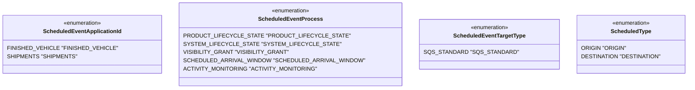

# Diagram: common/fv/python/fv/model/scheduled_event/scheduled_event_enums.py

> Auto-generated by Obscura crawlers

## Mermaid

```mermaid
classDiagram
class ScheduledEventApplicationId <<enumeration>> {
  FINISHED_VEHICLE "FINISHED_VEHICLE"
  SHIPMENTS "SHIPMENTS"
}
class ScheduledEventProcess <<enumeration>> {
  PRODUCT_LIFECYCLE_STATE "PRODUCT_LIFECYCLE_STATE"
  SYSTEM_LIFECYCLE_STATE "SYSTEM_LIFECYCLE_STATE"
  VISIBILITY_GRANT "VISIBILITY_GRANT"
  SCHEDULED_ARRIVAL_WINDOW "SCHEDULED_ARRIVAL_WINDOW"
  ACTIVITY_MONITORING "ACTIVITY_MONITORING"
}
class ScheduledEventTargetType <<enumeration>> {
  SQS_STANDARD "SQS_STANDARD"
}
class ScheduledType <<enumeration>> {
  ORIGIN "ORIGIN"
  DESTINATION "DESTINATION"
}
```

> SVG rendering failed for this diagram.
