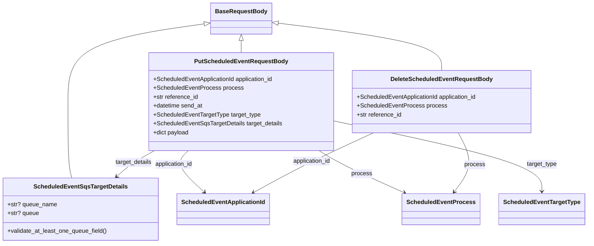

# Diagram: common/fv/python/fv/model/scheduled_event/scheduled_event_models.py

> Auto-generated by Obscura crawlers

## Mermaid

### SVG

<svg id="container" width="1560.517578125" xmlns="http://www.w3.org/2000/svg" class="classDiagram" height="656" viewBox="0 0 1560.517578125 656" role="graphics-document document" aria-roledescription="class"><g><defs><marker id="container_class-aggregationStart" class="marker aggregation class" refX="18" refY="7" markerWidth="190" markerHeight="240" orient="auto"><path d="M 18,7 L9,13 L1,7 L9,1 Z"></path></marker></defs><defs><marker id="container_class-aggregationEnd" class="marker aggregation class" refX="1" refY="7" markerWidth="20" markerHeight="28" orient="auto"><path d="M 18,7 L9,13 L1,7 L9,1 Z"></path></marker></defs><defs><marker id="container_class-extensionStart" class="marker extension class" refX="18" refY="7" markerWidth="190" markerHeight="240" orient="auto"><path d="M 1,7 L18,13 V 1 Z"></path></marker></defs><defs><marker id="container_class-extensionEnd" class="marker extension class" refX="1" refY="7" markerWidth="20" markerHeight="28" orient="auto"><path d="M 1,1 V 13 L18,7 Z"></path></marker></defs><defs><marker id="container_class-compositionStart" class="marker composition class" refX="18" refY="7" markerWidth="190" markerHeight="240" orient="auto"><path d="M 18,7 L9,13 L1,7 L9,1 Z"></path></marker></defs><defs><marker id="container_class-compositionEnd" class="marker composition class" refX="1" refY="7" markerWidth="20" markerHeight="28" orient="auto"><path d="M 18,7 L9,13 L1,7 L9,1 Z"></path></marker></defs><defs><marker id="container_class-dependencyStart" class="marker dependency class" refX="6" refY="7" markerWidth="190" markerHeight="240" orient="auto"><path d="M 5,7 L9,13 L1,7 L9,1 Z"></path></marker></defs><defs><marker id="container_class-dependencyEnd" class="marker dependency class" refX="13" refY="7" markerWidth="20" markerHeight="28" orient="auto"><path d="M 18,7 L9,13 L14,7 L9,1 Z"></path></marker></defs><defs><marker id="container_class-lollipopStart" class="marker lollipop class" refX="13" refY="7" markerWidth="190" markerHeight="240" orient="auto"><circle stroke="black" fill="transparent" cx="7" cy="7" r="6"></circle></marker></defs><defs><marker id="container_class-lollipopEnd" class="marker lollipop class" refX="1" refY="7" markerWidth="190" markerHeight="240" orient="auto"><circle stroke="black" fill="transparent" cx="7" cy="7" r="6"></circle></marker></defs><g class="root"><g class="clusters"></g><g class="edgePaths"><path d="M546.609,63.807L485.529,72.673C424.449,81.538,302.289,99.269,241.209,134.301C180.129,169.333,180.129,221.667,180.129,276C180.129,330.333,180.129,386.667,181.915,421C183.702,455.333,187.274,467.667,189.061,473.833L190.847,480" id="id_BaseRequestBody_ScheduledEventSqsTargetDetails_1" class="edge-thickness-normal edge-pattern-solid relation" style=";;;" data-edge="true" data-et="edge" data-id="id_BaseRequestBody_ScheduledEventSqsTargetDetails_1" data-points="W3sieCI6NTYzLjY3OTY4NzUsInkiOjYxLjMyOTI5Mzk4OTIxOTAxfSx7IngiOjE4MC4xMjg5MDYyNSwieSI6MTE3fSx7IngiOjE4MC4xMjg5MDYyNSwieSI6Mjc0fSx7IngiOjE4MC4xMjg5MDYyNSwieSI6NDQzfSx7IngiOjE5MC44NDY5MTM3Mzk2Njk0MiwieSI6NDgwfV0=" marker-start="url(#container_class-extensionStart)"></path><path d="M641.734,109.25L641.734,110.542C641.734,111.833,641.734,114.417,641.734,119.875C641.734,125.333,641.734,133.667,641.734,137.833L641.734,142" id="id_BaseRequestBody_PutScheduledEventRequestBody_2" class="edge-thickness-normal edge-pattern-solid relation" style=";;;" data-edge="true" data-et="edge" data-id="id_BaseRequestBody_PutScheduledEventRequestBody_2" data-points="W3sieCI6NjQxLjczNDM3NSwieSI6OTJ9LHsieCI6NjQxLjczNDM3NSwieSI6MTE3fSx7IngiOjY0MS43MzQzNzUsInkiOjE0Mn1d" marker-start="url(#container_class-extensionStart)"></path><path d="M736.907,61.855L810.692,71.046C884.478,80.237,1032.05,98.618,1105.835,119.976C1179.621,141.333,1179.621,165.667,1179.621,177.833L1179.621,190" id="id_BaseRequestBody_DeleteScheduledEventRequestBody_3" class="edge-thickness-normal edge-pattern-solid relation" style=";;;" data-edge="true" data-et="edge" data-id="id_BaseRequestBody_DeleteScheduledEventRequestBody_3" data-points="W3sieCI6NzE5Ljc4OTA2MjUsInkiOjU5LjcyMjYxMjM2NDY1MDQzfSx7IngiOjExNzkuNjIxMDkzNzUsInkiOjExN30seyJ4IjoxMTc5LjYyMTA5Mzc1LCJ5IjoxOTB9XQ==" marker-start="url(#container_class-extensionStart)"></path><path d="M407.848,406L396.922,412.167C385.995,418.333,364.142,430.667,347.462,442.311C330.782,453.954,319.274,464.909,313.52,470.386L307.767,475.863" id="id_PutScheduledEventRequestBody_ScheduledEventSqsTargetDetails_4" class="edge-thickness-normal edge-pattern-solid relation" style=";;;" data-edge="true" data-et="edge" data-id="id_PutScheduledEventRequestBody_ScheduledEventSqsTargetDetails_4" data-points="W3sieCI6NDA3Ljg0ODA5NTQxNDIwMTIsInkiOjQwNn0seyJ4IjozNDIuMjg5MDYyNSwieSI6NDQzfSx7IngiOjMwMy40MjA5MDY1MDgyNjQ0NywieSI6NDgwfV0=" marker-end="url(#container_class-dependencyEnd)"></path><path d="M503.419,406L496.957,412.167C490.495,418.333,477.572,430.667,484.217,449.311C490.863,467.954,517.077,492.909,530.184,505.386L543.291,517.863" id="id_PutScheduledEventRequestBody_ScheduledEventApplicationId_5" class="edge-thickness-normal edge-pattern-solid relation" style=";;;" data-edge="true" data-et="edge" data-id="id_PutScheduledEventRequestBody_ScheduledEventApplicationId_5" data-points="W3sieCI6NTAzLjQxODczMTUwODg3NTc0LCJ5Ijo0MDZ9LHsieCI6NDY0LjY0ODQzNzUsInkiOjQ0M30seyJ4Ijo1NDcuNjM3MjAyOTk1ODY3NywieSI6NTIyfV0=" marker-end="url(#container_class-dependencyEnd)"></path><path d="M853.467,406L863.359,412.167C873.25,418.333,893.033,430.667,931.278,449.59C969.523,468.513,1026.229,494.025,1054.583,506.782L1082.936,519.538" id="id_PutScheduledEventRequestBody_ScheduledEventProcess_6" class="edge-thickness-normal edge-pattern-solid relation" style=";;;" data-edge="true" data-et="edge" data-id="id_PutScheduledEventRequestBody_ScheduledEventProcess_6" data-points="W3sieCI6ODUzLjQ2NzA4NTc5ODgxNjYsInkiOjQwNn0seyJ4Ijo5MTIuODE2NDA2MjUsInkiOjQ0M30seyJ4IjoxMDg4LjQwNzUyNTE4MDc4NTEsInkiOjUyMn1d" marker-end="url(#container_class-dependencyEnd)"></path><path d="M887.637,325.966L979.938,345.471C1072.24,364.977,1256.844,403.989,1349.146,435.661C1441.447,467.333,1441.447,491.667,1441.447,503.833L1441.447,516" id="id_PutScheduledEventRequestBody_ScheduledEventTargetType_7" class="edge-thickness-normal edge-pattern-solid relation" style=";;;" data-edge="true" data-et="edge" data-id="id_PutScheduledEventRequestBody_ScheduledEventTargetType_7" data-points="W3sieCI6ODg3LjYzNjcxODc1LCJ5IjozMjUuOTY1NTE5ODUyMDk1M30seyJ4IjoxNDQxLjQ0NzI2NTYyNSwieSI6NDQzfSx7IngiOjE0NDEuNDQ3MjY1NjI1LCJ5Ijo1MjJ9XQ==" marker-end="url(#container_class-dependencyEnd)"></path><path d="M997.327,358L966.583,372.167C935.839,386.333,874.351,414.667,820.425,441.52C766.498,468.373,720.133,493.746,696.951,506.433L673.769,519.12" id="id_DeleteScheduledEventRequestBody_ScheduledEventApplicationId_8" class="edge-thickness-normal edge-pattern-solid relation" style=";;;" data-edge="true" data-et="edge" data-id="id_DeleteScheduledEventRequestBody_ScheduledEventApplicationId_8" data-points="W3sieCI6OTk3LjMyNzI2OTc4NTUwMywieSI6MzU4fSx7IngiOjgxMi44NjMyODEyNSwieSI6NDQzfSx7IngiOjY2OC41MDUxNjUyODkyNTYyLCJ5Ijo1MjJ9XQ==" marker-end="url(#container_class-dependencyEnd)"></path><path d="M1223.098,358L1230.43,372.167C1237.762,386.333,1252.427,414.667,1251.05,441.183C1249.674,467.699,1232.255,492.398,1223.546,504.747L1214.837,517.097" id="id_DeleteScheduledEventRequestBody_ScheduledEventProcess_9" class="edge-thickness-normal edge-pattern-solid relation" style=";;;" data-edge="true" data-et="edge" data-id="id_DeleteScheduledEventRequestBody_ScheduledEventProcess_9" data-points="W3sieCI6MTIyMy4wOTc2NTYyNSwieSI6MzU4fSx7IngiOjEyNjcuMDkxNzk2ODc1LCJ5Ijo0NDN9LHsieCI6MTIxMS4zNzkxNDgzNzI5MzQsInkiOjUyMn1d" marker-end="url(#container_class-dependencyEnd)"></path></g><g class="edgeLabels"><g class="edgeLabel"><g class="label" data-id="id_BaseRequestBody_ScheduledEventSqsTargetDetails_1" transform="translate(0, 0)"><foreignObject width="0" height="0">

</foreignObject></g></g><g class="edgeLabel"><g class="label" data-id="id_BaseRequestBody_PutScheduledEventRequestBody_2" transform="translate(0, 0)"><foreignObject width="0" height="0">

</foreignObject></g></g><g class="edgeLabel"><g class="label" data-id="id_BaseRequestBody_DeleteScheduledEventRequestBody_3" transform="translate(0, 0)"><foreignObject width="0" height="0">

</foreignObject></g></g><g class="edgeLabel" transform="translate(351.7016, 437.68778)"><g class="label" data-id="id_PutScheduledEventRequestBody_ScheduledEventSqsTargetDetails_4" transform="translate(-50.1015625, -12)"><foreignObject width="100.203125" height="24">

target_details

</foreignObject></g></g><g class="edgeLabel" transform="translate(486.7344, 464.02442)"><g class="label" data-id="id_PutScheduledEventRequestBody_ScheduledEventApplicationId_5" transform="translate(-52.2578125, -12)"><foreignObject width="104.515625" height="24">

application_id

</foreignObject></g></g><g class="edgeLabel" transform="translate(968.72184, 468.15235)"><g class="label" data-id="id_PutScheduledEventRequestBody_ScheduledEventProcess_6" transform="translate(-27.6953125, -12)"><foreignObject width="55.390625" height="24">

process

</foreignObject></g></g><g class="edgeLabel" transform="translate(1441.447265625, 443)"><g class="label" data-id="id_PutScheduledEventRequestBody_ScheduledEventTargetType_7" transform="translate(-41.328125, -12)"><foreignObject width="82.65625" height="24">

target_type

</foreignObject></g></g><g class="edgeLabel" transform="translate(830.36686, 434.93444)"><g class="label" data-id="id_DeleteScheduledEventRequestBody_ScheduledEventApplicationId_8" transform="translate(-52.2578125, -12)"><foreignObject width="104.515625" height="24">

application_id

</foreignObject></g></g><g class="edgeLabel" transform="translate(1266.81557, 443.39169)"><g class="label" data-id="id_DeleteScheduledEventRequestBody_ScheduledEventProcess_9" transform="translate(-27.6953125, -12)"><foreignObject width="55.390625" height="24">

process

</foreignObject></g></g></g><g class="nodes"><g class="node default" id="classId-BaseRequestBody-0" transform="translate(641.734375, 50)"><g class="basic label-container"><path d="M-78.0546875 -42 L78.0546875 -42 L78.0546875 42 L-78.0546875 42" stroke="none" stroke-width="0" fill="#ECECFF" style=""></path><path d="M-78.0546875 -42 C-28.865708393256938 -42, 20.323270713486124 -42, 78.0546875 -42 M-78.0546875 -42 C-35.46330915675615 -42, 7.128069186487707 -42, 78.0546875 -42 M78.0546875 -42 C78.0546875 -14.704244805756957, 78.0546875 12.591510388486086, 78.0546875 42 M78.0546875 -42 C78.0546875 -20.123974744773644, 78.0546875 1.7520505104527118, 78.0546875 42 M78.0546875 42 C44.70799833664105 42, 11.361309173282095 42, -78.0546875 42 M78.0546875 42 C42.475645354673915 42, 6.89660320934783 42, -78.0546875 42 M-78.0546875 42 C-78.0546875 11.702636814710907, -78.0546875 -18.594726370578186, -78.0546875 -42 M-78.0546875 42 C-78.0546875 17.255212533590566, -78.0546875 -7.4895749328188685, -78.0546875 -42" stroke="#9370DB" stroke-width="1.3" fill="none" stroke-dasharray="0 0" style=""></path></g><g class="annotation-group text" transform="translate(0, -18)"></g><g class="label-group text" transform="translate(-66.0546875, -18)"><g class="label" style="font-weight: bolder" transform="translate(0,-12)"><foreignObject width="132.109375" height="24">

BaseRequestBody

</foreignObject></g></g><g class="members-group text" transform="translate(-66.0546875, 30)"></g><g class="methods-group text" transform="translate(-66.0546875, 60)"></g><g class="divider" style=""><path d="M-78.0546875 6 C-33.923595366154 6, 10.207496767692007 6, 78.0546875 6 M-78.0546875 6 C-20.67990061181534 6, 36.69488627636932 6, 78.0546875 6" stroke="#9370DB" stroke-width="1.3" fill="none" stroke-dasharray="0 0" style=""></path></g><g class="divider" style=""><path d="M-78.0546875 24 C-16.91105429011909 24, 44.23257891976182 24, 78.0546875 24 M-78.0546875 24 C-32.08414863061018 24, 13.88639023877964 24, 78.0546875 24" stroke="#9370DB" stroke-width="1.3" fill="none" stroke-dasharray="0 0" style=""></path></g></g><g class="node default" id="classId-ScheduledEventSqsTargetDetails-1" transform="translate(215.1796875, 564)"><g class="basic label-container"><path d="M-207.1796875 -84 L207.1796875 -84 L207.1796875 84 L-207.1796875 84" stroke="none" stroke-width="0" fill="#ECECFF" style=""></path><path d="M-207.1796875 -84 C-66.90145174778567 -84, 73.37678400442866 -84, 207.1796875 -84 M-207.1796875 -84 C-61.35106443639134 -84, 84.47755862721732 -84, 207.1796875 -84 M207.1796875 -84 C207.1796875 -30.17498793858347, 207.1796875 23.65002412283306, 207.1796875 84 M207.1796875 -84 C207.1796875 -34.64149385644226, 207.1796875 14.71701228711548, 207.1796875 84 M207.1796875 84 C66.56570757721238 84, -74.04827234557524 84, -207.1796875 84 M207.1796875 84 C106.40052710429589 84, 5.621366708591779 84, -207.1796875 84 M-207.1796875 84 C-207.1796875 41.329284616102875, -207.1796875 -1.3414307677942503, -207.1796875 -84 M-207.1796875 84 C-207.1796875 35.61416906320813, -207.1796875 -12.771661873583739, -207.1796875 -84" stroke="#9370DB" stroke-width="1.3" fill="none" stroke-dasharray="0 0" style=""></path></g><g class="annotation-group text" transform="translate(0, -60)"></g><g class="label-group text" transform="translate(-120.46875, -60)"><g class="label" style="font-weight: bolder" transform="translate(0,-12)"><foreignObject width="240.9375" height="24">

ScheduledEventSqsTargetDetails

</foreignObject></g></g><g class="members-group text" transform="translate(-195.1796875, -12)"><g class="label" style="" transform="translate(0,-12)"><foreignObject width="132.65625" height="24">

+str? queue_name

</foreignObject></g><g class="label" style="" transform="translate(0,12)"><foreignObject width="84.15625" height="24">

+str? queue

</foreignObject></g></g><g class="methods-group text" transform="translate(-195.1796875, 60)"><g class="label" style="" transform="translate(0,-12)"><foreignObject width="269.890625" height="24">

+validate_at_least_one_queue_field()

</foreignObject></g></g><g class="divider" style=""><path d="M-207.1796875 -36 C-107.38636796707489 -36, -7.593048434149779 -36, 207.1796875 -36 M-207.1796875 -36 C-82.73071443338138 -36, 41.71825863323724 -36, 207.1796875 -36" stroke="#9370DB" stroke-width="1.3" fill="none" stroke-dasharray="0 0" style=""></path></g><g class="divider" style=""><path d="M-207.1796875 36 C-63.88667509568407 36, 79.40633730863186 36, 207.1796875 36 M-207.1796875 36 C-81.14313341932866 36, 44.893420661342674 36, 207.1796875 36" stroke="#9370DB" stroke-width="1.3" fill="none" stroke-dasharray="0 0" style=""></path></g></g><g class="node default" id="classId-PutScheduledEventRequestBody-2" transform="translate(641.734375, 274)"><g class="basic label-container"><path d="M-245.90234375 -132 L245.90234375 -132 L245.90234375 132 L-245.90234375 132" stroke="none" stroke-width="0" fill="#ECECFF" style=""></path><path d="M-245.90234375 -132 C-81.66002357417807 -132, 82.58229660164386 -132, 245.90234375 -132 M-245.90234375 -132 C-140.48601470494623 -132, -35.06968565989243 -132, 245.90234375 -132 M245.90234375 -132 C245.90234375 -70.71394738677449, 245.90234375 -9.42789477354897, 245.90234375 132 M245.90234375 -132 C245.90234375 -28.800703826892786, 245.90234375 74.39859234621443, 245.90234375 132 M245.90234375 132 C53.891925993102916 132, -138.11849176379417 132, -245.90234375 132 M245.90234375 132 C68.86696350574545 132, -108.16841673850911 132, -245.90234375 132 M-245.90234375 132 C-245.90234375 74.55640720653189, -245.90234375 17.112814413063774, -245.90234375 -132 M-245.90234375 132 C-245.90234375 61.63139590830433, -245.90234375 -8.737208183391346, -245.90234375 -132" stroke="#9370DB" stroke-width="1.3" fill="none" stroke-dasharray="0 0" style=""></path></g><g class="annotation-group text" transform="translate(0, -108)"></g><g class="label-group text" transform="translate(-119.3671875, -108)"><g class="label" style="font-weight: bolder" transform="translate(0,-12)"><foreignObject width="238.734375" height="24">

PutScheduledEventRequestBody

</foreignObject></g></g><g class="members-group text" transform="translate(-233.90234375, -60)"><g class="label" style="" transform="translate(0,-12)"><foreignObject width="329.125" height="24">

+ScheduledEventApplicationId application_id

</foreignObject></g><g class="label" style="" transform="translate(0,12)"><foreignObject width="237.96875" height="24">

+ScheduledEventProcess process

</foreignObject></g><g class="label" style="" transform="translate(0,36)"><foreignObject width="121.90625" height="24">

+str reference_id

</foreignObject></g><g class="label" style="" transform="translate(0,60)"><foreignObject width="135.09375" height="24">

+datetime send_at

</foreignObject></g><g class="label" style="" transform="translate(0,84)"><foreignObject width="288.8125" height="24">

+ScheduledEventTargetType target_type

</foreignObject></g><g class="label" style="" transform="translate(0,108)"><foreignObject width="348.4375" height="24">

+ScheduledEventSqsTargetDetails target_details

</foreignObject></g><g class="label" style="" transform="translate(0,132)"><foreignObject width="97.484375" height="24">

+dict payload

</foreignObject></g></g><g class="methods-group text" transform="translate(-233.90234375, 132)"></g><g class="divider" style=""><path d="M-245.90234375 -84 C-109.70628945918739 -84, 26.489764831625223 -84, 245.90234375 -84 M-245.90234375 -84 C-127.24462900105935 -84, -8.586914252118703 -84, 245.90234375 -84" stroke="#9370DB" stroke-width="1.3" fill="none" stroke-dasharray="0 0" style=""></path></g><g class="divider" style=""><path d="M-245.90234375 108 C-60.03349301230381 108, 125.83535772539238 108, 245.90234375 108 M-245.90234375 108 C-63.01573350817941 108, 119.87087673364118 108, 245.90234375 108" stroke="#9370DB" stroke-width="1.3" fill="none" stroke-dasharray="0 0" style=""></path></g></g><g class="node default" id="classId-DeleteScheduledEventRequestBody-3" transform="translate(1179.62109375, 274)"><g class="basic label-container"><path d="M-241.984375 -84 L241.984375 -84 L241.984375 84 L-241.984375 84" stroke="none" stroke-width="0" fill="#ECECFF" style=""></path><path d="M-241.984375 -84 C-104.5613734715869 -84, 32.86162805682619 -84, 241.984375 -84 M-241.984375 -84 C-92.216102135033 -84, 57.552170729934005 -84, 241.984375 -84 M241.984375 -84 C241.984375 -50.0382617370849, 241.984375 -16.076523474169804, 241.984375 84 M241.984375 -84 C241.984375 -34.44429937872583, 241.984375 15.11140124254834, 241.984375 84 M241.984375 84 C127.32314682238298 84, 12.661918644765962 84, -241.984375 84 M241.984375 84 C137.56692761869897 84, 33.14948023739791 84, -241.984375 84 M-241.984375 84 C-241.984375 27.939835251937048, -241.984375 -28.120329496125905, -241.984375 -84 M-241.984375 84 C-241.984375 45.631506101398024, -241.984375 7.263012202796048, -241.984375 -84" stroke="#9370DB" stroke-width="1.3" fill="none" stroke-dasharray="0 0" style=""></path></g><g class="annotation-group text" transform="translate(0, -60)"></g><g class="label-group text" transform="translate(-130.84375, -60)"><g class="label" style="font-weight: bolder" transform="translate(0,-12)"><foreignObject width="261.6875" height="24">

DeleteScheduledEventRequestBody

</foreignObject></g></g><g class="members-group text" transform="translate(-229.984375, -12)"><g class="label" style="" transform="translate(0,-12)"><foreignObject width="329.125" height="24">

+ScheduledEventApplicationId application_id

</foreignObject></g><g class="label" style="" transform="translate(0,12)"><foreignObject width="237.96875" height="24">

+ScheduledEventProcess process

</foreignObject></g><g class="label" style="" transform="translate(0,36)"><foreignObject width="121.90625" height="24">

+str reference_id

</foreignObject></g></g><g class="methods-group text" transform="translate(-229.984375, 84)"></g><g class="divider" style=""><path d="M-241.984375 -36 C-111.1399143125555 -36, 19.70454637488899 -36, 241.984375 -36 M-241.984375 -36 C-119.2047147729507 -36, 3.5749454540986108 -36, 241.984375 -36" stroke="#9370DB" stroke-width="1.3" fill="none" stroke-dasharray="0 0" style=""></path></g><g class="divider" style=""><path d="M-241.984375 60 C-87.18582607225173 60, 67.61272285549654 60, 241.984375 60 M-241.984375 60 C-99.63752176077602 60, 42.70933147844795 60, 241.984375 60" stroke="#9370DB" stroke-width="1.3" fill="none" stroke-dasharray="0 0" style=""></path></g></g><g class="node default" id="classId-ScheduledEventApplicationId-4" transform="translate(591.7578125, 564)"><g class="basic label-container"><path d="M-119.3984375 -42 L119.3984375 -42 L119.3984375 42 L-119.3984375 42" stroke="none" stroke-width="0" fill="#ECECFF" style=""></path><path d="M-119.3984375 -42 C-52.504357724825 -42, 14.389722050350002 -42, 119.3984375 -42 M-119.3984375 -42 C-55.12551648405298 -42, 9.14740453189404 -42, 119.3984375 -42 M119.3984375 -42 C119.3984375 -12.674984587928503, 119.3984375 16.650030824142995, 119.3984375 42 M119.3984375 -42 C119.3984375 -18.16573590877483, 119.3984375 5.668528182450338, 119.3984375 42 M119.3984375 42 C46.78045543677581 42, -25.83752662644838 42, -119.3984375 42 M119.3984375 42 C32.80789442498654 42, -53.782648650026914 42, -119.3984375 42 M-119.3984375 42 C-119.3984375 13.32505546523807, -119.3984375 -15.349889069523861, -119.3984375 -42 M-119.3984375 42 C-119.3984375 11.649956478237499, -119.3984375 -18.700087043525002, -119.3984375 -42" stroke="#9370DB" stroke-width="1.3" fill="none" stroke-dasharray="0 0" style=""></path></g><g class="annotation-group text" transform="translate(0, -18)"></g><g class="label-group text" transform="translate(-107.3984375, -18)"><g class="label" style="font-weight: bolder" transform="translate(0,-12)"><foreignObject width="214.796875" height="24">

ScheduledEventApplicationId

</foreignObject></g></g><g class="members-group text" transform="translate(-107.3984375, 30)"></g><g class="methods-group text" transform="translate(-107.3984375, 60)"></g><g class="divider" style=""><path d="M-119.3984375 6 C-62.676723965890446 6, -5.955010431780892 6, 119.3984375 6 M-119.3984375 6 C-43.42444380418689 6, 32.549549891626214 6, 119.3984375 6" stroke="#9370DB" stroke-width="1.3" fill="none" stroke-dasharray="0 0" style=""></path></g><g class="divider" style=""><path d="M-119.3984375 24 C-35.95169251530753 24, 47.495052469384945 24, 119.3984375 24 M-119.3984375 24 C-25.05115250542339 24, 69.29613248915322 24, 119.3984375 24" stroke="#9370DB" stroke-width="1.3" fill="none" stroke-dasharray="0 0" style=""></path></g></g><g class="node default" id="classId-ScheduledEventProcess-5" transform="translate(1181.759765625, 564)"><g class="basic label-container"><path d="M-98.6171875 -42 L98.6171875 -42 L98.6171875 42 L-98.6171875 42" stroke="none" stroke-width="0" fill="#ECECFF" style=""></path><path d="M-98.6171875 -42 C-55.24454744717801 -42, -11.871907394356015 -42, 98.6171875 -42 M-98.6171875 -42 C-35.06617906147901 -42, 28.484829377041976 -42, 98.6171875 -42 M98.6171875 -42 C98.6171875 -24.017169682481217, 98.6171875 -6.034339364962435, 98.6171875 42 M98.6171875 -42 C98.6171875 -17.588962503640406, 98.6171875 6.8220749927191875, 98.6171875 42 M98.6171875 42 C37.801023209705185 42, -23.01514108058963 42, -98.6171875 42 M98.6171875 42 C21.23541621046202 42, -56.14635507907596 42, -98.6171875 42 M-98.6171875 42 C-98.6171875 10.500008492038695, -98.6171875 -20.99998301592261, -98.6171875 -42 M-98.6171875 42 C-98.6171875 20.215299641157447, -98.6171875 -1.569400717685106, -98.6171875 -42" stroke="#9370DB" stroke-width="1.3" fill="none" stroke-dasharray="0 0" style=""></path></g><g class="annotation-group text" transform="translate(0, -18)"></g><g class="label-group text" transform="translate(-86.6171875, -18)"><g class="label" style="font-weight: bolder" transform="translate(0,-12)"><foreignObject width="173.234375" height="24">

ScheduledEventProcess

</foreignObject></g></g><g class="members-group text" transform="translate(-86.6171875, 30)"></g><g class="methods-group text" transform="translate(-86.6171875, 60)"></g><g class="divider" style=""><path d="M-98.6171875 6 C-48.64209919609272 6, 1.332989107814555 6, 98.6171875 6 M-98.6171875 6 C-51.0575560140743 6, -3.4979245281486016 6, 98.6171875 6" stroke="#9370DB" stroke-width="1.3" fill="none" stroke-dasharray="0 0" style=""></path></g><g class="divider" style=""><path d="M-98.6171875 24 C-52.30747007018838 24, -5.99775264037676 24, 98.6171875 24 M-98.6171875 24 C-51.944833370119916 24, -5.272479240239832 24, 98.6171875 24" stroke="#9370DB" stroke-width="1.3" fill="none" stroke-dasharray="0 0" style=""></path></g></g><g class="node default" id="classId-ScheduledEventTargetType-6" transform="translate(1441.447265625, 564)"><g class="basic label-container"><path d="M-111.0703125 -42 L111.0703125 -42 L111.0703125 42 L-111.0703125 42" stroke="none" stroke-width="0" fill="#ECECFF" style=""></path><path d="M-111.0703125 -42 C-55.38833663306469 -42, 0.2936392338706213 -42, 111.0703125 -42 M-111.0703125 -42 C-51.57905895523416 -42, 7.91219458953168 -42, 111.0703125 -42 M111.0703125 -42 C111.0703125 -16.96570492644824, 111.0703125 8.06859014710352, 111.0703125 42 M111.0703125 -42 C111.0703125 -17.73655176652213, 111.0703125 6.5268964669557406, 111.0703125 42 M111.0703125 42 C50.42931826284186 42, -10.211675974316279 42, -111.0703125 42 M111.0703125 42 C45.79937986993124 42, -19.471552760137513 42, -111.0703125 42 M-111.0703125 42 C-111.0703125 21.300283926229028, -111.0703125 0.600567852458056, -111.0703125 -42 M-111.0703125 42 C-111.0703125 19.41040112304674, -111.0703125 -3.1791977539065215, -111.0703125 -42" stroke="#9370DB" stroke-width="1.3" fill="none" stroke-dasharray="0 0" style=""></path></g><g class="annotation-group text" transform="translate(0, -18)"></g><g class="label-group text" transform="translate(-99.0703125, -18)"><g class="label" style="font-weight: bolder" transform="translate(0,-12)"><foreignObject width="198.140625" height="24">

ScheduledEventTargetType

</foreignObject></g></g><g class="members-group text" transform="translate(-99.0703125, 30)"></g><g class="methods-group text" transform="translate(-99.0703125, 60)"></g><g class="divider" style=""><path d="M-111.0703125 6 C-53.7043909660568 6, 3.661530567886402 6, 111.0703125 6 M-111.0703125 6 C-40.677537993030924 6, 29.71523651393815 6, 111.0703125 6" stroke="#9370DB" stroke-width="1.3" fill="none" stroke-dasharray="0 0" style=""></path></g><g class="divider" style=""><path d="M-111.0703125 24 C-31.77925823910438 24, 47.51179602179124 24, 111.0703125 24 M-111.0703125 24 C-25.523800447081413 24, 60.02271160583717 24, 111.0703125 24" stroke="#9370DB" stroke-width="1.3" fill="none" stroke-dasharray="0 0" style=""></path></g></g></g></g></g></svg>
