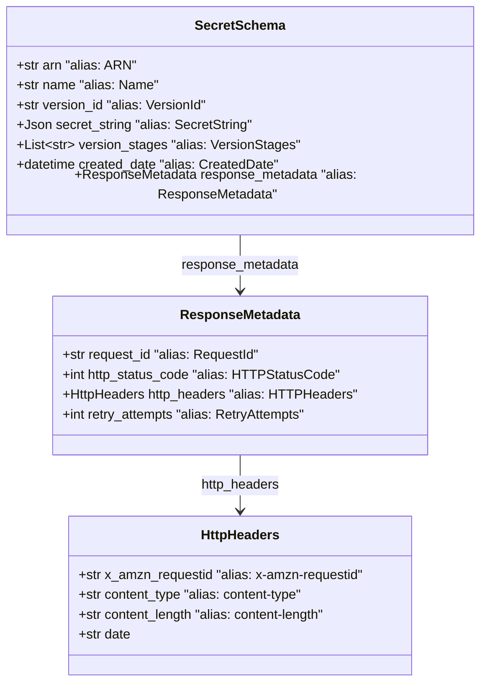

# Diagram: common/fv/python/fv/model/secret_manager/base.py

> Auto-generated by Obscura crawlers

## Mermaid

### SVG

<svg id="container" width="582.7578125" xmlns="http://www.w3.org/2000/svg" class="classDiagram" height="812" viewBox="0 0 582.7578125 812" role="graphics-document document" aria-roledescription="class"><g><defs><marker id="container_class-aggregationStart" class="marker aggregation class" refX="18" refY="7" markerWidth="190" markerHeight="240" orient="auto"><path d="M 18,7 L9,13 L1,7 L9,1 Z"></path></marker></defs><defs><marker id="container_class-aggregationEnd" class="marker aggregation class" refX="1" refY="7" markerWidth="20" markerHeight="28" orient="auto"><path d="M 18,7 L9,13 L1,7 L9,1 Z"></path></marker></defs><defs><marker id="container_class-extensionStart" class="marker extension class" refX="18" refY="7" markerWidth="190" markerHeight="240" orient="auto"><path d="M 1,7 L18,13 V 1 Z"></path></marker></defs><defs><marker id="container_class-extensionEnd" class="marker extension class" refX="1" refY="7" markerWidth="20" markerHeight="28" orient="auto"><path d="M 1,1 V 13 L18,7 Z"></path></marker></defs><defs><marker id="container_class-compositionStart" class="marker composition class" refX="18" refY="7" markerWidth="190" markerHeight="240" orient="auto"><path d="M 18,7 L9,13 L1,7 L9,1 Z"></path></marker></defs><defs><marker id="container_class-compositionEnd" class="marker composition class" refX="1" refY="7" markerWidth="20" markerHeight="28" orient="auto"><path d="M 18,7 L9,13 L1,7 L9,1 Z"></path></marker></defs><defs><marker id="container_class-dependencyStart" class="marker dependency class" refX="6" refY="7" markerWidth="190" markerHeight="240" orient="auto"><path d="M 5,7 L9,13 L1,7 L9,1 Z"></path></marker></defs><defs><marker id="container_class-dependencyEnd" class="marker dependency class" refX="13" refY="7" markerWidth="20" markerHeight="28" orient="auto"><path d="M 18,7 L9,13 L14,7 L9,1 Z"></path></marker></defs><defs><marker id="container_class-lollipopStart" class="marker lollipop class" refX="13" refY="7" markerWidth="190" markerHeight="240" orient="auto"><circle stroke="black" fill="transparent" cx="7" cy="7" r="6"></circle></marker></defs><defs><marker id="container_class-lollipopEnd" class="marker lollipop class" refX="1" refY="7" markerWidth="190" markerHeight="240" orient="auto"><circle stroke="black" fill="transparent" cx="7" cy="7" r="6"></circle></marker></defs><g class="root"><g class="clusters"></g><g class="edgePaths"><path d="M291.379,538L291.379,544.167C291.379,550.333,291.379,562.667,291.379,574C291.379,585.333,291.379,595.667,291.379,600.833L291.379,606" id="id_ResponseMetadata_HttpHeaders_1" class="edge-thickness-normal edge-pattern-solid relation" style=";;;" data-edge="true" data-et="edge" data-id="id_ResponseMetadata_HttpHeaders_1" data-points="W3sieCI6MjkxLjM3ODkwNjI1LCJ5Ijo1Mzh9LHsieCI6MjkxLjM3ODkwNjI1LCJ5Ijo1NzV9LHsieCI6MjkxLjM3ODkwNjI1LCJ5Ijo2MTJ9XQ==" marker-end="url(#container_class-dependencyEnd)"></path><path d="M291.379,272L291.379,278.167C291.379,284.333,291.379,296.667,291.379,308C291.379,319.333,291.379,329.667,291.379,334.833L291.379,340" id="id_SecretSchema_ResponseMetadata_2" class="edge-thickness-normal edge-pattern-solid relation" style=";;;" data-edge="true" data-et="edge" data-id="id_SecretSchema_ResponseMetadata_2" data-points="W3sieCI6MjkxLjM3ODkwNjI1LCJ5IjoyNzJ9LHsieCI6MjkxLjM3ODkwNjI1LCJ5IjozMDl9LHsieCI6MjkxLjM3ODkwNjI1LCJ5IjozNDZ9XQ==" marker-end="url(#container_class-dependencyEnd)"></path></g><g class="edgeLabels"><g class="edgeLabel" transform="translate(291.37890625, 575)"><g class="label" data-id="id_ResponseMetadata_HttpHeaders_1" transform="translate(-48.390625, -12)"><foreignObject width="96.78125" height="24">

http_headers

</foreignObject></g></g><g class="edgeLabel" transform="translate(291.37890625, 309)"><g class="label" data-id="id_SecretSchema_ResponseMetadata_2" transform="translate(-71.875, -12)"><foreignObject width="143.75" height="24">

response_metadata

</foreignObject></g></g></g><g class="nodes"><g class="node default" id="classId-HttpHeaders-0" transform="translate(291.37890625, 708)"><g class="basic label-container"><path d="M-210.48828125 -96 L210.48828125 -96 L210.48828125 96 L-210.48828125 96" stroke="none" stroke-width="0" fill="#ECECFF" style=""></path><path d="M-210.48828125 -96 C-102.3507906570853 -96, 5.786699935829404 -96, 210.48828125 -96 M-210.48828125 -96 C-100.66928374611611 -96, 9.149713757767785 -96, 210.48828125 -96 M210.48828125 -96 C210.48828125 -49.835792651356, 210.48828125 -3.6715853027120033, 210.48828125 96 M210.48828125 -96 C210.48828125 -56.00385465343561, 210.48828125 -16.00770930687122, 210.48828125 96 M210.48828125 96 C78.57333559253908 96, -53.34161006492184 96, -210.48828125 96 M210.48828125 96 C67.97795621114074 96, -74.53236882771853 96, -210.48828125 96 M-210.48828125 96 C-210.48828125 37.95718015062262, -210.48828125 -20.08563969875476, -210.48828125 -96 M-210.48828125 96 C-210.48828125 28.541730649285583, -210.48828125 -38.916538701428834, -210.48828125 -96" stroke="#9370DB" stroke-width="1.3" fill="none" stroke-dasharray="0 0" style=""></path></g><g class="annotation-group text" transform="translate(0, -72)"></g><g class="label-group text" transform="translate(-46.5234375, -72)"><g class="label" style="font-weight: bolder" transform="translate(0,-12)"><foreignObject width="93.046875" height="24">

HttpHeaders

</foreignObject></g></g><g class="members-group text" transform="translate(-198.48828125, -24)"><g class="label" style="" transform="translate(0,-12)"><foreignObject width="350.453125" height="24">

+str x_amzn_requestid   "alias: x-amzn-requestid"

</foreignObject></g><g class="label" style="" transform="translate(0,12)"><foreignObject width="278.328125" height="24">

+str content_type       "alias: content-type"

</foreignObject></g><g class="label" style="" transform="translate(0,36)"><foreignObject width="307.34375" height="24">

+str content_length     "alias: content-length"

</foreignObject></g><g class="label" style="" transform="translate(0,60)"><foreignObject width="64.1875" height="24">

+str date

</foreignObject></g></g><g class="methods-group text" transform="translate(-198.48828125, 96)"></g><g class="divider" style=""><path d="M-210.48828125 -48 C-117.21062223732055 -48, -23.9329632246411 -48, 210.48828125 -48 M-210.48828125 -48 C-56.68549147598941 -48, 97.11729829802118 -48, 210.48828125 -48" stroke="#9370DB" stroke-width="1.3" fill="none" stroke-dasharray="0 0" style=""></path></g><g class="divider" style=""><path d="M-210.48828125 72 C-51.26626060941669 72, 107.95576003116662 72, 210.48828125 72 M-210.48828125 72 C-104.56326878244886 72, 1.361743685102283 72, 210.48828125 72" stroke="#9370DB" stroke-width="1.3" fill="none" stroke-dasharray="0 0" style=""></path></g></g><g class="node default" id="classId-ResponseMetadata-1" transform="translate(291.37890625, 442)"><g class="basic label-container"><path d="M-224.89453125 -96 L224.89453125 -96 L224.89453125 96 L-224.89453125 96" stroke="none" stroke-width="0" fill="#ECECFF" style=""></path><path d="M-224.89453125 -96 C-56.43072561231892 -96, 112.03308002536215 -96, 224.89453125 -96 M-224.89453125 -96 C-116.55002863281115 -96, -8.205526015622297 -96, 224.89453125 -96 M224.89453125 -96 C224.89453125 -39.30361981869082, 224.89453125 17.39276036261836, 224.89453125 96 M224.89453125 -96 C224.89453125 -51.47037017356973, 224.89453125 -6.940740347139453, 224.89453125 96 M224.89453125 96 C134.528037236552 96, 44.16154322310399 96, -224.89453125 96 M224.89453125 96 C128.12767141135723 96, 31.360811572714454 96, -224.89453125 96 M-224.89453125 96 C-224.89453125 27.94044024477394, -224.89453125 -40.11911951045212, -224.89453125 -96 M-224.89453125 96 C-224.89453125 54.91368226879738, -224.89453125 13.827364537594761, -224.89453125 -96" stroke="#9370DB" stroke-width="1.3" fill="none" stroke-dasharray="0 0" style=""></path></g><g class="annotation-group text" transform="translate(0, -72)"></g><g class="label-group text" transform="translate(-70.0859375, -72)"><g class="label" style="font-weight: bolder" transform="translate(0,-12)"><foreignObject width="140.171875" height="24">

ResponseMetadata

</foreignObject></g></g><g class="members-group text" transform="translate(-212.89453125, -24)"><g class="label" style="" transform="translate(0,-12)"><foreignObject width="241.21875" height="24">

+str request_id         "alias: RequestId"

</foreignObject></g><g class="label" style="" transform="translate(0,12)"><foreignObject width="334.140625" height="24">

+int http_status_code   "alias: HTTPStatusCode"

</foreignObject></g><g class="label" style="" transform="translate(0,36)"><foreignObject width="355.703125" height="24">

+HttpHeaders http_headers "alias: HTTPHeaders"

</foreignObject></g><g class="label" style="" transform="translate(0,60)"><foreignObject width="300.875" height="24">

+int retry_attempts     "alias: RetryAttempts"

</foreignObject></g></g><g class="methods-group text" transform="translate(-212.89453125, 96)"></g><g class="divider" style=""><path d="M-224.89453125 -48 C-131.39165857447858 -48, -37.88878589895714 -48, 224.89453125 -48 M-224.89453125 -48 C-69.1834624447325 -48, 86.527606360535 -48, 224.89453125 -48" stroke="#9370DB" stroke-width="1.3" fill="none" stroke-dasharray="0 0" style=""></path></g><g class="divider" style=""><path d="M-224.89453125 72 C-97.83721604595506 72, 29.22009915808988 72, 224.89453125 72 M-224.89453125 72 C-103.77122220888239 72, 17.352086832235216 72, 224.89453125 72" stroke="#9370DB" stroke-width="1.3" fill="none" stroke-dasharray="0 0" style=""></path></g></g><g class="node default" id="classId-SecretSchema-2" transform="translate(291.37890625, 140)"><g class="basic label-container"><path d="M-283.37890625 -132 L283.37890625 -132 L283.37890625 132 L-283.37890625 132" stroke="none" stroke-width="0" fill="#ECECFF" style=""></path><path d="M-283.37890625 -132 C-98.17861260121597 -132, 87.02168104756805 -132, 283.37890625 -132 M-283.37890625 -132 C-70.98449377395318 -132, 141.40991870209365 -132, 283.37890625 -132 M283.37890625 -132 C283.37890625 -74.00874135215182, 283.37890625 -16.017482704303617, 283.37890625 132 M283.37890625 -132 C283.37890625 -52.275050455860494, 283.37890625 27.44989908827901, 283.37890625 132 M283.37890625 132 C114.96393412750399 132, -53.45103799499202 132, -283.37890625 132 M283.37890625 132 C144.95458500381173 132, 6.530263757623459 132, -283.37890625 132 M-283.37890625 132 C-283.37890625 71.36145695688381, -283.37890625 10.722913913767641, -283.37890625 -132 M-283.37890625 132 C-283.37890625 34.89639016109844, -283.37890625 -62.207219677803124, -283.37890625 -132" stroke="#9370DB" stroke-width="1.3" fill="none" stroke-dasharray="0 0" style=""></path></g><g class="annotation-group text" transform="translate(0, -108)"></g><g class="label-group text" transform="translate(-51.8828125, -108)"><g class="label" style="font-weight: bolder" transform="translate(0,-12)"><foreignObject width="103.765625" height="24">

SecretSchema

</foreignObject></g></g><g class="members-group text" transform="translate(-271.37890625, -60)"><g class="label" style="" transform="translate(0,-12)"><foreignObject width="144.296875" height="24">

+str arn                "alias: ARN"

</foreignObject></g><g class="label" style="" transform="translate(0,12)"><foreignObject width="172.6875" height="24">

+str name               "alias: Name"

</foreignObject></g><g class="label" style="" transform="translate(0,36)"><foreignObject width="233.96875" height="24">

+str version_id         "alias: VersionId"

</foreignObject></g><g class="label" style="" transform="translate(0,60)"><foreignObject width="283.90625" height="24">

+Json secret_string     "alias: SecretString"

</foreignObject></g><g class="label" style="" transform="translate(0,84)"><foreignObject width="340.21875" height="24">

+List&lt;str&gt; version_stages "alias: VersionStages"

</foreignObject></g><g class="label" style="" transform="translate(0,108)"><foreignObject width="319.5" height="24">

+datetime created_date  "alias: CreatedDate"

</foreignObject></g><g class="label" style="" transform="translate(0,132)"><foreignObject width="490.875" height="24">

+ResponseMetadata response_metadata "alias: ResponseMetadata"

</foreignObject></g></g><g class="methods-group text" transform="translate(-271.37890625, 132)"></g><g class="divider" style=""><path d="M-283.37890625 -84 C-149.42450319726333 -84, -15.470100144526668 -84, 283.37890625 -84 M-283.37890625 -84 C-141.1859939502875 -84, 1.006918349425007 -84, 283.37890625 -84" stroke="#9370DB" stroke-width="1.3" fill="none" stroke-dasharray="0 0" style=""></path></g><g class="divider" style=""><path d="M-283.37890625 108 C-79.24855303249649 108, 124.88180018500702 108, 283.37890625 108 M-283.37890625 108 C-118.50206387850236 108, 46.37477849299529 108, 283.37890625 108" stroke="#9370DB" stroke-width="1.3" fill="none" stroke-dasharray="0 0" style=""></path></g></g></g></g></g></svg>
