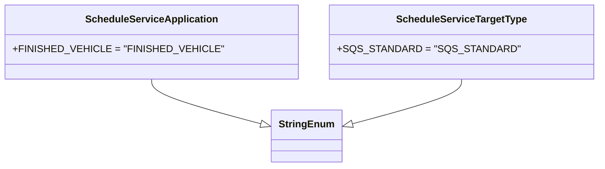

# Diagram: common/fv/python/fv/platform/schedule_service.py

> Auto-generated by Obscura crawlers

## Mermaid

### SVG

<svg id="container" width="877.1640625" xmlns="http://www.w3.org/2000/svg" class="classDiagram" height="270" viewBox="0 0 877.1640625 270" role="graphics-document document" aria-roledescription="class"><g><defs><marker id="container_class-aggregationStart" class="marker aggregation class" refX="18" refY="7" markerWidth="190" markerHeight="240" orient="auto"><path d="M 18,7 L9,13 L1,7 L9,1 Z"></path></marker></defs><defs><marker id="container_class-aggregationEnd" class="marker aggregation class" refX="1" refY="7" markerWidth="20" markerHeight="28" orient="auto"><path d="M 18,7 L9,13 L1,7 L9,1 Z"></path></marker></defs><defs><marker id="container_class-extensionStart" class="marker extension class" refX="18" refY="7" markerWidth="190" markerHeight="240" orient="auto"><path d="M 1,7 L18,13 V 1 Z"></path></marker></defs><defs><marker id="container_class-extensionEnd" class="marker extension class" refX="1" refY="7" markerWidth="20" markerHeight="28" orient="auto"><path d="M 1,1 V 13 L18,7 Z"></path></marker></defs><defs><marker id="container_class-compositionStart" class="marker composition class" refX="18" refY="7" markerWidth="190" markerHeight="240" orient="auto"><path d="M 18,7 L9,13 L1,7 L9,1 Z"></path></marker></defs><defs><marker id="container_class-compositionEnd" class="marker composition class" refX="1" refY="7" markerWidth="20" markerHeight="28" orient="auto"><path d="M 18,7 L9,13 L1,7 L9,1 Z"></path></marker></defs><defs><marker id="container_class-dependencyStart" class="marker dependency class" refX="6" refY="7" markerWidth="190" markerHeight="240" orient="auto"><path d="M 5,7 L9,13 L1,7 L9,1 Z"></path></marker></defs><defs><marker id="container_class-dependencyEnd" class="marker dependency class" refX="13" refY="7" markerWidth="20" markerHeight="28" orient="auto"><path d="M 18,7 L9,13 L14,7 L9,1 Z"></path></marker></defs><defs><marker id="container_class-lollipopStart" class="marker lollipop class" refX="13" refY="7" markerWidth="190" markerHeight="240" orient="auto"><circle stroke="black" fill="transparent" cx="7" cy="7" r="6"></circle></marker></defs><defs><marker id="container_class-lollipopEnd" class="marker lollipop class" refX="1" refY="7" markerWidth="190" markerHeight="240" orient="auto"><circle stroke="black" fill="transparent" cx="7" cy="7" r="6"></circle></marker></defs><g class="root"><g class="clusters"></g><g class="edgePaths"><path d="M221.68,128L221.68,132.167C221.68,136.333,221.68,144.667,247.848,156.53C274.016,168.394,326.351,183.787,352.519,191.484L378.687,199.181" id="id_ScheduleServiceApplication_StringEnum_1" class="edge-thickness-normal edge-pattern-solid relation" style=";;;" data-edge="true" data-et="edge" data-id="id_ScheduleServiceApplication_StringEnum_1" data-points="W3sieCI6MjIxLjY3OTY4NzUsInkiOjEyOH0seyJ4IjoyMjEuNjc5Njg3NSwieSI6MTUzfSx7IngiOjM5NS4yMzYzMjgxMjUsInkiOjIwNC4wNDgwODQwOTU3MjIzNH1d" marker-end="url(#container_class-extensionEnd)"></path><path d="M677.262,128L677.262,132.167C677.262,136.333,677.262,144.667,651.094,156.53C624.926,168.394,572.59,183.787,546.422,191.484L520.254,199.181" id="id_ScheduleServiceTargetType_StringEnum_2" class="edge-thickness-normal edge-pattern-solid relation" style=";;;" data-edge="true" data-et="edge" data-id="id_ScheduleServiceTargetType_StringEnum_2" data-points="W3sieCI6Njc3LjI2MTcxODc1LCJ5IjoxMjh9LHsieCI6Njc3LjI2MTcxODc1LCJ5IjoxNTN9LHsieCI6NTAzLjcwNTA3ODEyNSwieSI6MjA0LjA0ODA4NDA5NTcyMjM0fV0=" marker-end="url(#container_class-extensionEnd)"></path></g><g class="edgeLabels"><g class="edgeLabel"><g class="label" data-id="id_ScheduleServiceApplication_StringEnum_1" transform="translate(0, 0)"><foreignObject width="0" height="0">

</foreignObject></g></g><g class="edgeLabel"><g class="label" data-id="id_ScheduleServiceTargetType_StringEnum_2" transform="translate(0, 0)"><foreignObject width="0" height="0">

</foreignObject></g></g></g><g class="nodes"><g class="node default" id="classId-StringEnum-0" transform="translate(449.470703125, 220)"><g class="basic label-container"><path d="M-54.234375 -42 L54.234375 -42 L54.234375 42 L-54.234375 42" stroke="none" stroke-width="0" fill="#ECECFF" style=""></path><path d="M-54.234375 -42 C-22.56062761803805 -42, 9.113119763923898 -42, 54.234375 -42 M-54.234375 -42 C-27.813756960027067 -42, -1.3931389200541346 -42, 54.234375 -42 M54.234375 -42 C54.234375 -20.02452248413141, 54.234375 1.9509550317371804, 54.234375 42 M54.234375 -42 C54.234375 -9.315732142739577, 54.234375 23.368535714520846, 54.234375 42 M54.234375 42 C19.807149236907478 42, -14.620076526185045 42, -54.234375 42 M54.234375 42 C18.848871104610993 42, -16.536632790778015 42, -54.234375 42 M-54.234375 42 C-54.234375 20.36311898225399, -54.234375 -1.2737620354920196, -54.234375 -42 M-54.234375 42 C-54.234375 20.719797773641993, -54.234375 -0.5604044527160141, -54.234375 -42" stroke="#9370DB" stroke-width="1.3" fill="none" stroke-dasharray="0 0" style=""></path></g><g class="annotation-group text" transform="translate(0, -18)"></g><g class="label-group text" transform="translate(-42.234375, -18)"><g class="label" style="font-weight: bolder" transform="translate(0,-12)"><foreignObject width="84.46875" height="24">

StringEnum

</foreignObject></g></g><g class="members-group text" transform="translate(-42.234375, 30)"></g><g class="methods-group text" transform="translate(-42.234375, 60)"></g><g class="divider" style=""><path d="M-54.234375 6 C-31.61444499300513 6, -8.994514986010259 6, 54.234375 6 M-54.234375 6 C-17.70861331354653 6, 18.817148372906942 6, 54.234375 6" stroke="#9370DB" stroke-width="1.3" fill="none" stroke-dasharray="0 0" style=""></path></g><g class="divider" style=""><path d="M-54.234375 24 C-23.432804543088892 24, 7.368765913822216 24, 54.234375 24 M-54.234375 24 C-18.755180616716217 24, 16.724013766567566 24, 54.234375 24" stroke="#9370DB" stroke-width="1.3" fill="none" stroke-dasharray="0 0" style=""></path></g></g><g class="node default" id="classId-ScheduleServiceApplication-1" transform="translate(221.6796875, 68)"><g class="basic label-container"><path d="M-213.6796875 -60 L213.6796875 -60 L213.6796875 60 L-213.6796875 60" stroke="none" stroke-width="0" fill="#ECECFF" style=""></path><path d="M-213.6796875 -60 C-87.98431412470873 -60, 37.71105925058254 -60, 213.6796875 -60 M-213.6796875 -60 C-93.27798580257883 -60, 27.12371589484235 -60, 213.6796875 -60 M213.6796875 -60 C213.6796875 -15.45731674625506, 213.6796875 29.08536650748988, 213.6796875 60 M213.6796875 -60 C213.6796875 -17.09992587876851, 213.6796875 25.80014824246298, 213.6796875 60 M213.6796875 60 C119.86629445171938 60, 26.052901403438767 60, -213.6796875 60 M213.6796875 60 C126.92711369960521 60, 40.17453989921043 60, -213.6796875 60 M-213.6796875 60 C-213.6796875 18.27657459872247, -213.6796875 -23.446850802555062, -213.6796875 -60 M-213.6796875 60 C-213.6796875 32.02019471977343, -213.6796875 4.040389439546864, -213.6796875 -60" stroke="#9370DB" stroke-width="1.3" fill="none" stroke-dasharray="0 0" style=""></path></g><g class="annotation-group text" transform="translate(0, -36)"></g><g class="label-group text" transform="translate(-101.890625, -36)"><g class="label" style="font-weight: bolder" transform="translate(0,-12)"><foreignObject width="203.78125" height="24">

ScheduleServiceApplication

</foreignObject></g></g><g class="members-group text" transform="translate(-201.6796875, 12)"><g class="label" style="" transform="translate(0,-12)"><foreignObject width="301.46875" height="24">

+FINISHED_VEHICLE = "FINISHED_VEHICLE"

</foreignObject></g></g><g class="methods-group text" transform="translate(-201.6796875, 60)"></g><g class="divider" style=""><path d="M-213.6796875 -12 C-64.45818054113445 -12, 84.7633264177311 -12, 213.6796875 -12 M-213.6796875 -12 C-127.00802276245764 -12, -40.336358024915285 -12, 213.6796875 -12" stroke="#9370DB" stroke-width="1.3" fill="none" stroke-dasharray="0 0" style=""></path></g><g class="divider" style=""><path d="M-213.6796875 36 C-110.15378026735499 36, -6.627873034709978 36, 213.6796875 36 M-213.6796875 36 C-110.20795165342516 36, -6.736215806850311 36, 213.6796875 36" stroke="#9370DB" stroke-width="1.3" fill="none" stroke-dasharray="0 0" style=""></path></g></g><g class="node default" id="classId-ScheduleServiceTargetType-2" transform="translate(677.26171875, 68)"><g class="basic label-container"><path d="M-191.90234375 -60 L191.90234375 -60 L191.90234375 60 L-191.90234375 60" stroke="none" stroke-width="0" fill="#ECECFF" style=""></path><path d="M-191.90234375 -60 C-71.99591399343878 -60, 47.91051576312245 -60, 191.90234375 -60 M-191.90234375 -60 C-44.05771639237253 -60, 103.78691096525495 -60, 191.90234375 -60 M191.90234375 -60 C191.90234375 -16.185209327493055, 191.90234375 27.62958134501389, 191.90234375 60 M191.90234375 -60 C191.90234375 -30.188922438099357, 191.90234375 -0.377844876198715, 191.90234375 60 M191.90234375 60 C109.52961044165077 60, 27.15687713330155 60, -191.90234375 60 M191.90234375 60 C100.20513593153434 60, 8.507928113068687 60, -191.90234375 60 M-191.90234375 60 C-191.90234375 22.581331642941905, -191.90234375 -14.83733671411619, -191.90234375 -60 M-191.90234375 60 C-191.90234375 21.25555278082585, -191.90234375 -17.488894438348296, -191.90234375 -60" stroke="#9370DB" stroke-width="1.3" fill="none" stroke-dasharray="0 0" style=""></path></g><g class="annotation-group text" transform="translate(0, -36)"></g><g class="label-group text" transform="translate(-100.7109375, -36)"><g class="label" style="font-weight: bolder" transform="translate(0,-12)"><foreignObject width="201.421875" height="24">

ScheduleServiceTargetType

</foreignObject></g></g><g class="members-group text" transform="translate(-179.90234375, 12)"><g class="label" style="" transform="translate(0,-12)"><foreignObject width="259.09375" height="24">

+SQS_STANDARD = "SQS_STANDARD"

</foreignObject></g></g><g class="methods-group text" transform="translate(-179.90234375, 60)"></g><g class="divider" style=""><path d="M-191.90234375 -12 C-85.76233819640674 -12, 20.37766735718651 -12, 191.90234375 -12 M-191.90234375 -12 C-71.6859453866923 -12, 48.53045297661541 -12, 191.90234375 -12" stroke="#9370DB" stroke-width="1.3" fill="none" stroke-dasharray="0 0" style=""></path></g><g class="divider" style=""><path d="M-191.90234375 36 C-72.21240864566754 36, 47.477526458664926 36, 191.90234375 36 M-191.90234375 36 C-68.31261256213244 36, 55.27711862573511 36, 191.90234375 36" stroke="#9370DB" stroke-width="1.3" fill="none" stroke-dasharray="0 0" style=""></path></g></g></g></g></g></svg>
