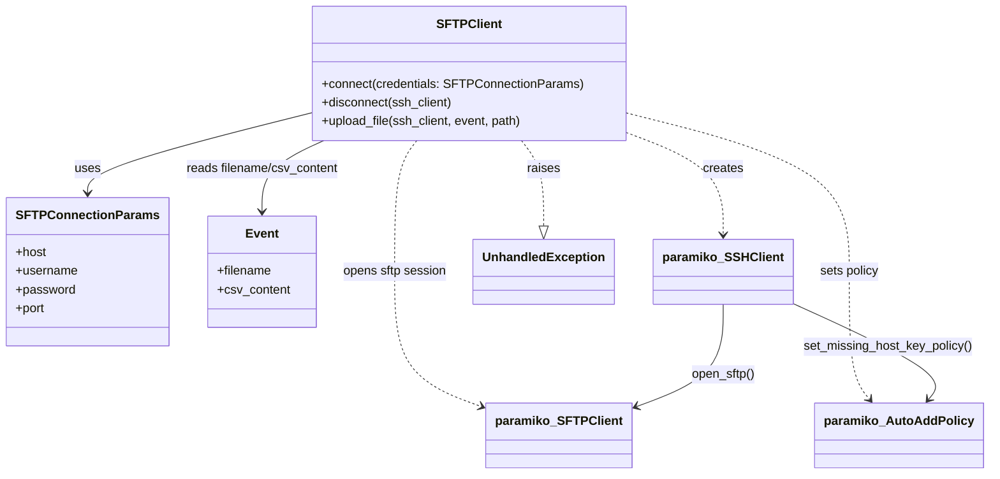

# Diagram: common/fv/python/fv/sftp.py

> Auto-generated by Obscura crawlers

## Mermaid

### SVG

<svg id="container" width="1243.171875" xmlns="http://www.w3.org/2000/svg" class="classDiagram" height="638" viewBox="0 0 1243.171875 638" role="graphics-document document" aria-roledescription="class"><g><defs><marker id="container_class-aggregationStart" class="marker aggregation class" refX="18" refY="7" markerWidth="190" markerHeight="240" orient="auto"><path d="M 18,7 L9,13 L1,7 L9,1 Z"></path></marker></defs><defs><marker id="container_class-aggregationEnd" class="marker aggregation class" refX="1" refY="7" markerWidth="20" markerHeight="28" orient="auto"><path d="M 18,7 L9,13 L1,7 L9,1 Z"></path></marker></defs><defs><marker id="container_class-extensionStart" class="marker extension class" refX="18" refY="7" markerWidth="190" markerHeight="240" orient="auto"><path d="M 1,7 L18,13 V 1 Z"></path></marker></defs><defs><marker id="container_class-extensionEnd" class="marker extension class" refX="1" refY="7" markerWidth="20" markerHeight="28" orient="auto"><path d="M 1,1 V 13 L18,7 Z"></path></marker></defs><defs><marker id="container_class-compositionStart" class="marker composition class" refX="18" refY="7" markerWidth="190" markerHeight="240" orient="auto"><path d="M 18,7 L9,13 L1,7 L9,1 Z"></path></marker></defs><defs><marker id="container_class-compositionEnd" class="marker composition class" refX="1" refY="7" markerWidth="20" markerHeight="28" orient="auto"><path d="M 18,7 L9,13 L1,7 L9,1 Z"></path></marker></defs><defs><marker id="container_class-dependencyStart" class="marker dependency class" refX="6" refY="7" markerWidth="190" markerHeight="240" orient="auto"><path d="M 5,7 L9,13 L1,7 L9,1 Z"></path></marker></defs><defs><marker id="container_class-dependencyEnd" class="marker dependency class" refX="13" refY="7" markerWidth="20" markerHeight="28" orient="auto"><path d="M 18,7 L9,13 L14,7 L9,1 Z"></path></marker></defs><defs><marker id="container_class-lollipopStart" class="marker lollipop class" refX="13" refY="7" markerWidth="190" markerHeight="240" orient="auto"><circle stroke="black" fill="transparent" cx="7" cy="7" r="6"></circle></marker></defs><defs><marker id="container_class-lollipopEnd" class="marker lollipop class" refX="1" refY="7" markerWidth="190" markerHeight="240" orient="auto"><circle stroke="black" fill="transparent" cx="7" cy="7" r="6"></circle></marker></defs><g class="root"><g class="clusters"></g><g class="edgePaths"><path d="M390.367,150.809L342.893,164.174C295.419,177.539,200.471,204.27,152.997,224.802C105.523,245.333,105.523,259.667,105.523,266.833L105.523,274" id="id_SFTPClient_SFTPConnectionParams_1" class="edge-thickness-normal edge-pattern-solid relation" style=";;;" data-edge="true" data-et="edge" data-id="id_SFTPClient_SFTPConnectionParams_1" data-points="W3sieCI6MzkwLjM2NzE4NzUsInkiOjE1MC44MDkxNjgwMjEwODg1N30seyJ4IjoxMDUuNTIzNDM3NSwieSI6MjMxfSx7IngiOjEwNS41MjM0Mzc1LCJ5IjoyODB9XQ==" marker-end="url(#container_class-dependencyEnd)"></path><path d="M786.844,179.664L806.878,188.22C826.911,196.776,866.979,213.888,887.013,238.611C907.047,263.333,907.047,295.667,907.047,311.833L907.047,328" id="id_SFTPClient_paramiko_SSHClient_2" class="edge-thickness-normal edge-pattern-dashed relation" style=";;;" data-edge="true" data-et="edge" data-id="id_SFTPClient_paramiko_SSHClient_2" data-points="W3sieCI6Nzg2Ljg0Mzc1LCJ5IjoxNzkuNjYzNjMyNjgzNjAzfSx7IngiOjkwNy4wNDY4NzUsInkiOjIzMX0seyJ4Ijo5MDcuMDQ2ODc1LCJ5IjozMzR9XQ==" marker-end="url(#container_class-dependencyEnd)"></path><path d="M786.844,151.407L833.465,164.672C880.086,177.938,973.328,204.469,1019.949,241.901C1066.57,279.333,1066.57,327.667,1066.57,374C1066.57,420.333,1066.57,464.667,1071.018,492.228C1075.466,519.79,1084.363,530.58,1088.811,535.975L1093.259,541.371" id="id_SFTPClient_paramiko_AutoAddPolicy_3" class="edge-thickness-normal edge-pattern-dashed relation" style=";;;" data-edge="true" data-et="edge" data-id="id_SFTPClient_paramiko_AutoAddPolicy_3" data-points="W3sieCI6Nzg2Ljg0Mzc1LCJ5IjoxNTEuNDA2NjcyMTY5NTk5M30seyJ4IjoxMDY2LjU3MDMxMjUsInkiOjIzMX0seyJ4IjoxMDY2LjU3MDMxMjUsInkiOjM3Nn0seyJ4IjoxMDY2LjU3MDMxMjUsInkiOjUwOX0seyJ4IjoxMDk3LjA3NTU1Mzc5NzQ2ODMsInkiOjU0Nn1d" marker-end="url(#container_class-dependencyEnd)"></path><path d="M527.801,182L522.093,190.167C516.386,198.333,504.97,214.667,499.262,247C493.555,279.333,493.555,327.667,493.555,374C493.555,420.333,493.555,464.667,512.228,493.969C530.901,523.271,568.248,537.541,586.921,544.676L605.594,551.812" id="id_SFTPClient_paramiko_SFTPClient_4" class="edge-thickness-normal edge-pattern-dashed relation" style=";;;" data-edge="true" data-et="edge" data-id="id_SFTPClient_paramiko_SFTPClient_4" data-points="W3sieCI6NTI3LjgwMDkyNDg2MjEzMjMsInkiOjE4Mn0seyJ4Ijo0OTMuNTU0Njg3NSwieSI6MjMxfSx7IngiOjQ5My41NTQ2ODc1LCJ5IjozNzZ9LHsieCI6NDkzLjU1NDY4NzUsInkiOjUwOX0seyJ4Ijo2MTEuMTk5MjE4NzUsInkiOjU1My45NTMyOTQxNTk4ODA2fV0=" marker-end="url(#container_class-dependencyEnd)"></path><path d="M649.41,182L655.118,190.167C660.825,198.333,672.241,214.667,677.949,237.125C683.656,259.583,683.656,288.167,683.656,302.458L683.656,316.75" id="id_SFTPClient_UnhandledException_5" class="edge-thickness-normal edge-pattern-dashed relation" style=";;;" data-edge="true" data-et="edge" data-id="id_SFTPClient_UnhandledException_5" data-points="W3sieCI6NjQ5LjQxMDAxMjYzNzg2NzcsInkiOjE4Mn0seyJ4Ijo2ODMuNjU2MjUsInkiOjIzMX0seyJ4Ijo2ODMuNjU2MjUsInkiOjMzNH1d" marker-end="url(#container_class-extensionEnd)"></path><path d="M418.054,182L402.044,190.167C386.035,198.333,354.015,214.667,338.006,234C321.996,253.333,321.996,275.667,321.996,286.833L321.996,298" id="id_SFTPClient_Event_6" class="edge-thickness-normal edge-pattern-solid relation" style=";;;" data-edge="true" data-et="edge" data-id="id_SFTPClient_Event_6" data-points="W3sieCI6NDE4LjA1Mzg4MzI3MjA1ODgsInkiOjE4Mn0seyJ4IjozMjEuOTk2MDkzNzUsInkiOjIzMX0seyJ4IjozMjEuOTk2MDkzNzUsInkiOjMwNH1d" marker-end="url(#container_class-dependencyEnd)"></path><path d="M907.047,418L907.047,433.167C907.047,448.333,907.047,478.667,888.374,500.969C869.7,523.271,832.354,537.541,813.68,544.676L795.007,551.812" id="id_paramiko_SSHClient_paramiko_SFTPClient_7" class="edge-thickness-normal edge-pattern-solid relation" style=";;;" data-edge="true" data-et="edge" data-id="id_paramiko_SSHClient_paramiko_SFTPClient_7" data-points="W3sieCI6OTA3LjA0Njg3NSwieSI6NDE4fSx7IngiOjkwNy4wNDY4NzUsInkiOjUwOX0seyJ4Ijo3ODkuNDAyMzQzNzUsInkiOjU1My45NTMyOTQxNTk4ODA2fV0=" marker-end="url(#container_class-dependencyEnd)"></path><path d="M992.945,415.423L1026.927,431.02C1060.909,446.616,1128.872,477.808,1158.406,498.799C1187.94,519.79,1179.044,530.58,1174.596,535.975L1170.148,541.371" id="id_paramiko_SSHClient_paramiko_AutoAddPolicy_8" class="edge-thickness-normal edge-pattern-solid relation" style=";;;" data-edge="true" data-et="edge" data-id="id_paramiko_SSHClient_paramiko_AutoAddPolicy_8" data-points="W3sieCI6OTkyLjk0NTMxMjUsInkiOjQxNS40MjM0NzYxMjc1NzEyM30seyJ4IjoxMTk2LjgzNTkzNzUsInkiOjUwOX0seyJ4IjoxMTY2LjMzMDY5NjIwMjUzMTcsInkiOjU0Nn1d" marker-end="url(#container_class-dependencyEnd)"></path></g><g class="edgeLabels"><g class="edgeLabel" transform="translate(105.5234375, 231)"><g class="label" data-id="id_SFTPClient_SFTPConnectionParams_1" transform="translate(-16.4921875, -12)"><foreignObject width="32.984375" height="24">

uses

</foreignObject></g></g><g class="edgeLabel" transform="translate(907.046875, 231)"><g class="label" data-id="id_SFTPClient_paramiko_SSHClient_2" transform="translate(-26.171875, -12)"><foreignObject width="52.34375" height="24">

creates

</foreignObject></g></g><g class="edgeLabel" transform="translate(1066.5703125, 376)"><g class="label" data-id="id_SFTPClient_paramiko_AutoAddPolicy_3" transform="translate(-38.625, -12)"><foreignObject width="77.25" height="24">

sets policy

</foreignObject></g></g><g class="edgeLabel" transform="translate(493.5546875, 376)"><g class="label" data-id="id_SFTPClient_paramiko_SFTPClient_4" transform="translate(-67.609375, -12)"><foreignObject width="135.21875" height="24">

opens sftp session

</foreignObject></g></g><g class="edgeLabel" transform="translate(683.65625, 231)"><g class="label" data-id="id_SFTPClient_UnhandledException_5" transform="translate(-21.25, -12)"><foreignObject width="42.5" height="24">

raises

</foreignObject></g></g><g class="edgeLabel" transform="translate(321.99609375, 231)"><g class="label" data-id="id_SFTPClient_Event_6" transform="translate(-100, -24)"><foreignObject width="200" height="48">

reads filename/csv_content

</foreignObject></g></g><g class="edgeLabel" transform="translate(907.046875, 509)"><g class="label" data-id="id_paramiko_SSHClient_paramiko_SFTPClient_7" transform="translate(-41.875, -12)"><foreignObject width="83.75" height="24">

open_sftp()

</foreignObject></g></g><g class="edgeLabel" transform="translate(1116.68206, 472.21302)"><g class="label" data-id="id_paramiko_SSHClient_paramiko_AutoAddPolicy_8" transform="translate(-110.265625, -12)"><foreignObject width="220.53125" height="24">

set_missing_host_key_policy()

</foreignObject></g></g></g><g class="nodes"><g class="node default" id="classId-SFTPConnectionParams-0" transform="translate(105.5234375, 376)"><g class="basic label-container"><path d="M-97.5234375 -96 L97.5234375 -96 L97.5234375 96 L-97.5234375 96" stroke="none" stroke-width="0" fill="#ECECFF" style=""></path><path d="M-97.5234375 -96 C-21.005141921872053 -96, 55.513153656255895 -96, 97.5234375 -96 M-97.5234375 -96 C-34.12392891397117 -96, 29.27557967205766 -96, 97.5234375 -96 M97.5234375 -96 C97.5234375 -38.391688741091784, 97.5234375 19.216622517816432, 97.5234375 96 M97.5234375 -96 C97.5234375 -49.27951896788412, 97.5234375 -2.559037935768245, 97.5234375 96 M97.5234375 96 C21.17305483354035 96, -55.1773278329193 96, -97.5234375 96 M97.5234375 96 C43.13648828444485 96, -11.250460931110297 96, -97.5234375 96 M-97.5234375 96 C-97.5234375 36.265853285011985, -97.5234375 -23.46829342997603, -97.5234375 -96 M-97.5234375 96 C-97.5234375 29.382369844794937, -97.5234375 -37.235260310410126, -97.5234375 -96" stroke="#9370DB" stroke-width="1.3" fill="none" stroke-dasharray="0 0" style=""></path></g><g class="annotation-group text" transform="translate(0, -72)"></g><g class="label-group text" transform="translate(-85.5234375, -72)"><g class="label" style="font-weight: bolder" transform="translate(0,-12)"><foreignObject width="171.046875" height="24">

SFTPConnectionParams

</foreignObject></g></g><g class="members-group text" transform="translate(-85.5234375, -24)"><g class="label" style="" transform="translate(0,-12)"><foreignObject width="39.953125" height="24">

+host

</foreignObject></g><g class="label" style="" transform="translate(0,12)"><foreignObject width="80.1875" height="24">

+username

</foreignObject></g><g class="label" style="" transform="translate(0,36)"><foreignObject width="76.625" height="24">

+password

</foreignObject></g><g class="label" style="" transform="translate(0,60)"><foreignObject width="38.796875" height="24">

+port

</foreignObject></g></g><g class="methods-group text" transform="translate(-85.5234375, 96)"></g><g class="divider" style=""><path d="M-97.5234375 -48 C-19.625332901008676 -48, 58.27277169798265 -48, 97.5234375 -48 M-97.5234375 -48 C-23.46877170428887 -48, 50.58589409142226 -48, 97.5234375 -48" stroke="#9370DB" stroke-width="1.3" fill="none" stroke-dasharray="0 0" style=""></path></g><g class="divider" style=""><path d="M-97.5234375 72 C-55.86353772397353 72, -14.203637947947058 72, 97.5234375 72 M-97.5234375 72 C-25.952813365485866 72, 45.61781076902827 72, 97.5234375 72" stroke="#9370DB" stroke-width="1.3" fill="none" stroke-dasharray="0 0" style=""></path></g></g><g class="node default" id="classId-SFTPClient-1" transform="translate(588.60546875, 95)"><g class="basic label-container"><path d="M-198.23828125 -87 L198.23828125 -87 L198.23828125 87 L-198.23828125 87" stroke="none" stroke-width="0" fill="#ECECFF" style=""></path><path d="M-198.23828125 -87 C-86.28211827312323 -87, 25.674044703753538 -87, 198.23828125 -87 M-198.23828125 -87 C-52.20423678604163 -87, 93.82980767791673 -87, 198.23828125 -87 M198.23828125 -87 C198.23828125 -23.480449434156206, 198.23828125 40.03910113168759, 198.23828125 87 M198.23828125 -87 C198.23828125 -24.503344762509165, 198.23828125 37.99331047498167, 198.23828125 87 M198.23828125 87 C111.36251808482851 87, 24.486754919657017 87, -198.23828125 87 M198.23828125 87 C89.57843370162551 87, -19.081413846748973 87, -198.23828125 87 M-198.23828125 87 C-198.23828125 28.235706189665336, -198.23828125 -30.528587620669327, -198.23828125 -87 M-198.23828125 87 C-198.23828125 21.24422549209129, -198.23828125 -44.51154901581742, -198.23828125 -87" stroke="#9370DB" stroke-width="1.3" fill="none" stroke-dasharray="0 0" style=""></path></g><g class="annotation-group text" transform="translate(0, -63)"></g><g class="label-group text" transform="translate(-38.8671875, -63)"><g class="label" style="font-weight: bolder" transform="translate(0,-12)"><foreignObject width="77.734375" height="24">

SFTPClient

</foreignObject></g></g><g class="members-group text" transform="translate(-186.23828125, -15)"></g><g class="methods-group text" transform="translate(-186.23828125, 15)"><g class="label" style="" transform="translate(0,-12)"><foreignObject width="333.609375" height="24">

+connect(credentials: SFTPConnectionParams)

</foreignObject></g><g class="label" style="" transform="translate(0,12)"><foreignObject width="170.359375" height="24">

+disconnect(ssh_client)

</foreignObject></g><g class="label" style="" transform="translate(0,36)"><foreignObject width="262.46875" height="24">

+upload_file(ssh_client, event, path)

</foreignObject></g></g><g class="divider" style=""><path d="M-198.23828125 -39 C-108.68424252669882 -39, -19.13020380339765 -39, 198.23828125 -39 M-198.23828125 -39 C-40.266669884658654 -39, 117.70494148068269 -39, 198.23828125 -39" stroke="#9370DB" stroke-width="1.3" fill="none" stroke-dasharray="0 0" style=""></path></g><g class="divider" style=""><path d="M-198.23828125 -15 C-105.61458069417199 -15, -12.990880138343982 -15, 198.23828125 -15 M-198.23828125 -15 C-95.47285442594067 -15, 7.292572398118665 -15, 198.23828125 -15" stroke="#9370DB" stroke-width="1.3" fill="none" stroke-dasharray="0 0" style=""></path></g></g><g class="node default" id="classId-Event-2" transform="translate(321.99609375, 376)"><g class="basic label-container"><path d="M-68.94921875 -72 L68.94921875 -72 L68.94921875 72 L-68.94921875 72" stroke="none" stroke-width="0" fill="#ECECFF" style=""></path><path d="M-68.94921875 -72 C-21.00306563793785 -72, 26.943087474124297 -72, 68.94921875 -72 M-68.94921875 -72 C-26.84669335024332 -72, 15.255832049513359 -72, 68.94921875 -72 M68.94921875 -72 C68.94921875 -29.08295976071284, 68.94921875 13.834080478574322, 68.94921875 72 M68.94921875 -72 C68.94921875 -23.60634867061397, 68.94921875 24.787302658772063, 68.94921875 72 M68.94921875 72 C26.78887031629518 72, -15.371478117409637 72, -68.94921875 72 M68.94921875 72 C29.497774130507146 72, -9.953670488985708 72, -68.94921875 72 M-68.94921875 72 C-68.94921875 42.60982274472763, -68.94921875 13.21964548945526, -68.94921875 -72 M-68.94921875 72 C-68.94921875 28.760989786383334, -68.94921875 -14.478020427233332, -68.94921875 -72" stroke="#9370DB" stroke-width="1.3" fill="none" stroke-dasharray="0 0" style=""></path></g><g class="annotation-group text" transform="translate(0, -48)"></g><g class="label-group text" transform="translate(-20.2109375, -48)"><g class="label" style="font-weight: bolder" transform="translate(0,-12)"><foreignObject width="40.421875" height="24">

Event

</foreignObject></g></g><g class="members-group text" transform="translate(-56.94921875, 0)"><g class="label" style="" transform="translate(0,-12)"><foreignObject width="70.796875" height="24">

+filename

</foreignObject></g><g class="label" style="" transform="translate(0,12)"><foreignObject width="93.6875" height="24">

+csv_content

</foreignObject></g></g><g class="methods-group text" transform="translate(-56.94921875, 72)"></g><g class="divider" style=""><path d="M-68.94921875 -24 C-31.266984989607977 -24, 6.415248770784046 -24, 68.94921875 -24 M-68.94921875 -24 C-17.455274376255595 -24, 34.03866999748881 -24, 68.94921875 -24" stroke="#9370DB" stroke-width="1.3" fill="none" stroke-dasharray="0 0" style=""></path></g><g class="divider" style=""><path d="M-68.94921875 48 C-21.92070709019793 48, 25.10780456960414 48, 68.94921875 48 M-68.94921875 48 C-39.88750570850936 48, -10.825792667018717 48, 68.94921875 48" stroke="#9370DB" stroke-width="1.3" fill="none" stroke-dasharray="0 0" style=""></path></g></g><g class="node default" id="classId-paramiko_SSHClient-3" transform="translate(907.046875, 376)"><g class="basic label-container"><path d="M-85.8984375 -42 L85.8984375 -42 L85.8984375 42 L-85.8984375 42" stroke="none" stroke-width="0" fill="#ECECFF" style=""></path><path d="M-85.8984375 -42 C-26.40040753243224 -42, 33.09762243513552 -42, 85.8984375 -42 M-85.8984375 -42 C-31.675868577965275 -42, 22.54670034406945 -42, 85.8984375 -42 M85.8984375 -42 C85.8984375 -21.688893111106438, 85.8984375 -1.377786222212876, 85.8984375 42 M85.8984375 -42 C85.8984375 -24.00102170609489, 85.8984375 -6.002043412189778, 85.8984375 42 M85.8984375 42 C50.844082098775395 42, 15.78972669755079 42, -85.8984375 42 M85.8984375 42 C50.19795223567202 42, 14.49746697134404 42, -85.8984375 42 M-85.8984375 42 C-85.8984375 14.583622064368829, -85.8984375 -12.832755871262343, -85.8984375 -42 M-85.8984375 42 C-85.8984375 24.729323967430858, -85.8984375 7.458647934861716, -85.8984375 -42" stroke="#9370DB" stroke-width="1.3" fill="none" stroke-dasharray="0 0" style=""></path></g><g class="annotation-group text" transform="translate(0, -18)"></g><g class="label-group text" transform="translate(-73.8984375, -18)"><g class="label" style="font-weight: bolder" transform="translate(0,-12)"><foreignObject width="147.796875" height="24">

paramiko_SSHClient

</foreignObject></g></g><g class="members-group text" transform="translate(-73.8984375, 30)"></g><g class="methods-group text" transform="translate(-73.8984375, 60)"></g><g class="divider" style=""><path d="M-85.8984375 6 C-24.92142720510636 6, 36.05558308978728 6, 85.8984375 6 M-85.8984375 6 C-33.21835833705298 6, 19.461720825894034 6, 85.8984375 6" stroke="#9370DB" stroke-width="1.3" fill="none" stroke-dasharray="0 0" style=""></path></g><g class="divider" style=""><path d="M-85.8984375 24 C-29.631083493866036 24, 26.636270512267927 24, 85.8984375 24 M-85.8984375 24 C-40.61576316227694 24, 4.666911175446117 24, 85.8984375 24" stroke="#9370DB" stroke-width="1.3" fill="none" stroke-dasharray="0 0" style=""></path></g></g><g class="node default" id="classId-paramiko_AutoAddPolicy-4" transform="translate(1131.703125, 588)"><g class="basic label-container"><path d="M-103.46875 -42 L103.46875 -42 L103.46875 42 L-103.46875 42" stroke="none" stroke-width="0" fill="#ECECFF" style=""></path><path d="M-103.46875 -42 C-35.59146326695381 -42, 32.28582346609238 -42, 103.46875 -42 M-103.46875 -42 C-55.23043657039382 -42, -6.9921231407876405 -42, 103.46875 -42 M103.46875 -42 C103.46875 -21.45144141156504, 103.46875 -0.9028828231300778, 103.46875 42 M103.46875 -42 C103.46875 -21.497439471999396, 103.46875 -0.994878943998792, 103.46875 42 M103.46875 42 C48.88461179319201 42, -5.699526413615985 42, -103.46875 42 M103.46875 42 C43.11558817305936 42, -17.237573653881284 42, -103.46875 42 M-103.46875 42 C-103.46875 15.252319408991632, -103.46875 -11.495361182016737, -103.46875 -42 M-103.46875 42 C-103.46875 16.111578594633173, -103.46875 -9.776842810733655, -103.46875 -42" stroke="#9370DB" stroke-width="1.3" fill="none" stroke-dasharray="0 0" style=""></path></g><g class="annotation-group text" transform="translate(0, -18)"></g><g class="label-group text" transform="translate(-91.46875, -18)"><g class="label" style="font-weight: bolder" transform="translate(0,-12)"><foreignObject width="182.9375" height="24">

paramiko_AutoAddPolicy

</foreignObject></g></g><g class="members-group text" transform="translate(-91.46875, 30)"></g><g class="methods-group text" transform="translate(-91.46875, 60)"></g><g class="divider" style=""><path d="M-103.46875 6 C-33.24834083944691 6, 36.97206832110618 6, 103.46875 6 M-103.46875 6 C-45.21109419834216 6, 13.04656160331568 6, 103.46875 6" stroke="#9370DB" stroke-width="1.3" fill="none" stroke-dasharray="0 0" style=""></path></g><g class="divider" style=""><path d="M-103.46875 24 C-40.70475566622242 24, 22.059238667555164 24, 103.46875 24 M-103.46875 24 C-47.64094630424377 24, 8.186857391512461 24, 103.46875 24" stroke="#9370DB" stroke-width="1.3" fill="none" stroke-dasharray="0 0" style=""></path></g></g><g class="node default" id="classId-paramiko_SFTPClient-5" transform="translate(700.30078125, 588)"><g class="basic label-container"><path d="M-89.1015625 -42 L89.1015625 -42 L89.1015625 42 L-89.1015625 42" stroke="none" stroke-width="0" fill="#ECECFF" style=""></path><path d="M-89.1015625 -42 C-20.175708361178906 -42, 48.75014577764219 -42, 89.1015625 -42 M-89.1015625 -42 C-27.29682740541888 -42, 34.50790768916224 -42, 89.1015625 -42 M89.1015625 -42 C89.1015625 -23.57354245198832, 89.1015625 -5.147084903976641, 89.1015625 42 M89.1015625 -42 C89.1015625 -14.200498848740533, 89.1015625 13.599002302518933, 89.1015625 42 M89.1015625 42 C48.38452277455663 42, 7.667483049113258 42, -89.1015625 42 M89.1015625 42 C21.516709922371547 42, -46.068142655256906 42, -89.1015625 42 M-89.1015625 42 C-89.1015625 17.63557094373386, -89.1015625 -6.728858112532279, -89.1015625 -42 M-89.1015625 42 C-89.1015625 8.684483570218035, -89.1015625 -24.63103285956393, -89.1015625 -42" stroke="#9370DB" stroke-width="1.3" fill="none" stroke-dasharray="0 0" style=""></path></g><g class="annotation-group text" transform="translate(0, -18)"></g><g class="label-group text" transform="translate(-77.1015625, -18)"><g class="label" style="font-weight: bolder" transform="translate(0,-12)"><foreignObject width="154.203125" height="24">

paramiko_SFTPClient

</foreignObject></g></g><g class="members-group text" transform="translate(-77.1015625, 30)"></g><g class="methods-group text" transform="translate(-77.1015625, 60)"></g><g class="divider" style=""><path d="M-89.1015625 6 C-35.39796758612032 6, 18.305627327759353 6, 89.1015625 6 M-89.1015625 6 C-50.90139031694202 6, -12.70121813388404 6, 89.1015625 6" stroke="#9370DB" stroke-width="1.3" fill="none" stroke-dasharray="0 0" style=""></path></g><g class="divider" style=""><path d="M-89.1015625 24 C-45.46552681989892 24, -1.8294911397978382 24, 89.1015625 24 M-89.1015625 24 C-37.617947234954954 24, 13.865668030090092 24, 89.1015625 24" stroke="#9370DB" stroke-width="1.3" fill="none" stroke-dasharray="0 0" style=""></path></g></g><g class="node default" id="classId-UnhandledException-6" transform="translate(683.65625, 376)"><g class="basic label-container"><path d="M-87.4921875 -42 L87.4921875 -42 L87.4921875 42 L-87.4921875 42" stroke="none" stroke-width="0" fill="#ECECFF" style=""></path><path d="M-87.4921875 -42 C-28.067896426697402 -42, 31.356394646605196 -42, 87.4921875 -42 M-87.4921875 -42 C-40.85572880889135 -42, 5.780729882217301 -42, 87.4921875 -42 M87.4921875 -42 C87.4921875 -10.562247147673464, 87.4921875 20.875505704653072, 87.4921875 42 M87.4921875 -42 C87.4921875 -14.558544303093331, 87.4921875 12.882911393813337, 87.4921875 42 M87.4921875 42 C48.60880993669464 42, 9.725432373389282 42, -87.4921875 42 M87.4921875 42 C27.54216960630061 42, -32.40784828739878 42, -87.4921875 42 M-87.4921875 42 C-87.4921875 24.51677525865966, -87.4921875 7.03355051731932, -87.4921875 -42 M-87.4921875 42 C-87.4921875 11.537725690695158, -87.4921875 -18.924548618609684, -87.4921875 -42" stroke="#9370DB" stroke-width="1.3" fill="none" stroke-dasharray="0 0" style=""></path></g><g class="annotation-group text" transform="translate(0, -18)"></g><g class="label-group text" transform="translate(-75.4921875, -18)"><g class="label" style="font-weight: bolder" transform="translate(0,-12)"><foreignObject width="150.984375" height="24">

UnhandledException

</foreignObject></g></g><g class="members-group text" transform="translate(-75.4921875, 30)"></g><g class="methods-group text" transform="translate(-75.4921875, 60)"></g><g class="divider" style=""><path d="M-87.4921875 6 C-48.44691063472712 6, -9.401633769454236 6, 87.4921875 6 M-87.4921875 6 C-36.5455226818559 6, 14.4011421362882 6, 87.4921875 6" stroke="#9370DB" stroke-width="1.3" fill="none" stroke-dasharray="0 0" style=""></path></g><g class="divider" style=""><path d="M-87.4921875 24 C-37.22252096328174 24, 13.047145573436524 24, 87.4921875 24 M-87.4921875 24 C-29.849873322044495 24, 27.79244085591101 24, 87.4921875 24" stroke="#9370DB" stroke-width="1.3" fill="none" stroke-dasharray="0 0" style=""></path></g></g></g></g></g></svg>
