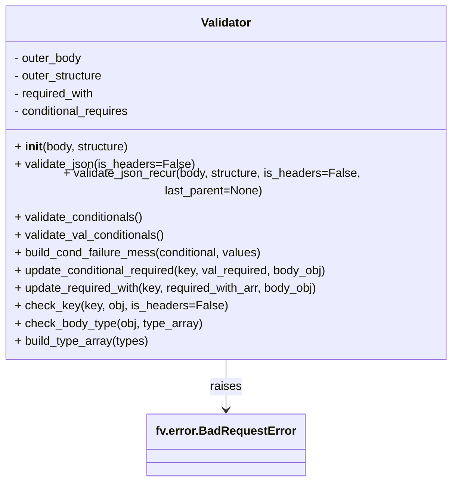

# Diagram: common/fv/python/fv/utilities/Validator.py


> Auto-generated by Obscura crawlers

## Diagram 1



### SVG

<svg id="container" width="615.4375" xmlns="http://www.w3.org/2000/svg" class="classDiagram" height="630" viewBox="0 0 615.4375 630" role="graphics-document document" aria-roledescription="class"><style>#container{font-family:"trebuchet ms",verdana,arial,sans-serif;font-size:16px;fill:#333;}@keyframes edge-animation-frame{from{stroke-dashoffset:0;}}@keyframes dash{to{stroke-dashoffset:0;}}#container .edge-animation-slow{stroke-dasharray:9,5!important;stroke-dashoffset:900;animation:dash 50s linear infinite;stroke-linecap:round;}#container .edge-animation-fast{stroke-dasharray:9,5!important;stroke-dashoffset:900;animation:dash 20s linear infinite;stroke-linecap:round;}#container .error-icon{fill:#552222;}#container .error-text{fill:#552222;stroke:#552222;}#container .edge-thickness-normal{stroke-width:1px;}#container .edge-thickness-thick{stroke-width:3.5px;}#container .edge-pattern-solid{stroke-dasharray:0;}#container .edge-thickness-invisible{stroke-width:0;fill:none;}#container .edge-pattern-dashed{stroke-dasharray:3;}#container .edge-pattern-dotted{stroke-dasharray:2;}#container .marker{fill:#333333;stroke:#333333;}#container .marker.cross{stroke:#333333;}#container svg{font-family:"trebuchet ms",verdana,arial,sans-serif;font-size:16px;}#container p{margin:0;}#container g.classGroup text{fill:#9370DB;stroke:none;font-family:"trebuchet ms",verdana,arial,sans-serif;font-size:10px;}#container g.classGroup text .title{font-weight:bolder;}#container .nodeLabel,#container .edgeLabel{color:#131300;}#container .edgeLabel .label rect{fill:#ECECFF;}#container .label text{fill:#131300;}#container .labelBkg{background:#ECECFF;}#container .edgeLabel .label span{background:#ECECFF;}#container .classTitle{font-weight:bolder;}#container .node rect,#container .node circle,#container .node ellipse,#container .node polygon,#container .node path{fill:#ECECFF;stroke:#9370DB;stroke-width:1px;}#container .divider{stroke:#9370DB;stroke-width:1;}#container g.clickable{cursor:pointer;}#container g.classGroup rect{fill:#ECECFF;stroke:#9370DB;}#container g.classGroup line{stroke:#9370DB;stroke-width:1;}#container .classLabel .box{stroke:none;stroke-width:0;fill:#ECECFF;opacity:0.5;}#container .classLabel .label{fill:#9370DB;font-size:10px;}#container .relation{stroke:#333333;stroke-width:1;fill:none;}#container .dashed-line{stroke-dasharray:3;}#container .dotted-line{stroke-dasharray:1 2;}#container #compositionStart,#container .composition{fill:#333333!important;stroke:#333333!important;stroke-width:1;}#container #compositionEnd,#container .composition{fill:#333333!important;stroke:#333333!important;stroke-width:1;}#container #dependencyStart,#container .dependency{fill:#333333!important;stroke:#333333!important;stroke-width:1;}#container #dependencyStart,#container .dependency{fill:#333333!important;stroke:#333333!important;stroke-width:1;}#container #extensionStart,#container .extension{fill:transparent!important;stroke:#333333!important;stroke-width:1;}#container #extensionEnd,#container .extension{fill:transparent!important;stroke:#333333!important;stroke-width:1;}#container #aggregationStart,#container .aggregation{fill:transparent!important;stroke:#333333!important;stroke-width:1;}#container #aggregationEnd,#container .aggregation{fill:transparent!important;stroke:#333333!important;stroke-width:1;}#container #lollipopStart,#container .lollipop{fill:#ECECFF!important;stroke:#333333!important;stroke-width:1;}#container #lollipopEnd,#container .lollipop{fill:#ECECFF!important;stroke:#333333!important;stroke-width:1;}#container .edgeTerminals{font-size:11px;line-height:initial;}#container .classTitleText{text-anchor:middle;font-size:18px;fill:#333;}#container .label-icon{display:inline-block;height:1em;overflow:visible;vertical-align:-0.125em;}#container .node .label-icon path{fill:currentColor;stroke:revert;stroke-width:revert;}#container :root{--mermaid-font-family:"trebuchet ms",verdana,arial,sans-serif;}</style><g><defs><marker id="container_class-aggregationStart" class="marker aggregation class" refX="18" refY="7" markerWidth="190" markerHeight="240" orient="auto"><path d="M 18,7 L9,13 L1,7 L9,1 Z"></path></marker></defs><defs><marker id="container_class-aggregationEnd" class="marker aggregation class" refX="1" refY="7" markerWidth="20" markerHeight="28" orient="auto"><path d="M 18,7 L9,13 L1,7 L9,1 Z"></path></marker></defs><defs><marker id="container_class-extensionStart" class="marker extension class" refX="18" refY="7" markerWidth="190" markerHeight="240" orient="auto"><path d="M 1,7 L18,13 V 1 Z"></path></marker></defs><defs><marker id="container_class-extensionEnd" class="marker extension class" refX="1" refY="7" markerWidth="20" markerHeight="28" orient="auto"><path d="M 1,1 V 13 L18,7 Z"></path></marker></defs><defs><marker id="container_class-compositionStart" class="marker composition class" refX="18" refY="7" markerWidth="190" markerHeight="240" orient="auto"><path d="M 18,7 L9,13 L1,7 L9,1 Z"></path></marker></defs><defs><marker id="container_class-compositionEnd" class="marker composition class" refX="1" refY="7" markerWidth="20" markerHeight="28" orient="auto"><path d="M 18,7 L9,13 L1,7 L9,1 Z"></path></marker></defs><defs><marker id="container_class-dependencyStart" class="marker dependency class" refX="6" refY="7" markerWidth="190" markerHeight="240" orient="auto"><path d="M 5,7 L9,13 L1,7 L9,1 Z"></path></marker></defs><defs><marker id="container_class-dependencyEnd" class="marker dependency class" refX="13" refY="7" markerWidth="20" markerHeight="28" orient="auto"><path d="M 18,7 L9,13 L14,7 L9,1 Z"></path></marker></defs><defs><marker id="container_class-lollipopStart" class="marker lollipop class" refX="13" refY="7" markerWidth="190" markerHeight="240" orient="auto"><circle stroke="black" fill="transparent" cx="7" cy="7" r="6"></circle></marker></defs><defs><marker id="container_class-lollipopEnd" class="marker lollipop class" refX="1" refY="7" markerWidth="190" markerHeight="240" orient="auto"><circle stroke="black" fill="transparent" cx="7" cy="7" r="6"></circle></marker></defs><g class="root"><g class="clusters"></g><g class="edgePaths"><path d="M307.719,464L307.719,470.167C307.719,476.333,307.719,488.667,307.719,500C307.719,511.333,307.719,521.667,307.719,526.833L307.719,532" id="id_Validator_fv.error.BadRequestError_1" class="edge-thickness-normal edge-pattern-solid relation" style=";;;" data-edge="true" data-et="edge" data-id="id_Validator_fv.error.BadRequestError_1" data-points="W3sieCI6MzA3LjcxODc1LCJ5Ijo0NjR9LHsieCI6MzA3LjcxODc1LCJ5Ijo1MDF9LHsieCI6MzA3LjcxODc1LCJ5Ijo1Mzh9XQ==" marker-end="url(#container_class-dependencyEnd)"></path></g><g class="edgeLabels"><g class="edgeLabel" transform="translate(307.71875, 501)"><g class="label" data-id="id_Validator_fv.error.BadRequestError_1" transform="translate(-21.25, -12)"><foreignObject width="42.5" height="24"><div xmlns="http://www.w3.org/1999/xhtml" class="labelBkg" style="display: table-cell; white-space: nowrap; line-height: 1.5; max-width: 200px; text-align: center;"><span class="edgeLabel"><p>raises</p></span></div></foreignObject></g></g></g><g class="nodes"><g class="node default" id="classId-Validator-0" transform="translate(307.71875, 236)"><g class="basic label-container"><path d="M-299.71875 -228 L299.71875 -228 L299.71875 228 L-299.71875 228" stroke="none" stroke-width="0" fill="#ECECFF" style=""></path><path d="M-299.71875 -228 C-141.21209604738027 -228, 17.294557905239458 -228, 299.71875 -228 M-299.71875 -228 C-101.15226962281832 -228, 97.41421075436335 -228, 299.71875 -228 M299.71875 -228 C299.71875 -105.10291956685134, 299.71875 17.794160866297318, 299.71875 228 M299.71875 -228 C299.71875 -91.51534866740565, 299.71875 44.96930266518871, 299.71875 228 M299.71875 228 C137.2421150213347 228, -25.234519957330576 228, -299.71875 228 M299.71875 228 C123.91101628362102 228, -51.89671743275795 228, -299.71875 228 M-299.71875 228 C-299.71875 101.94870247097013, -299.71875 -24.102595058059734, -299.71875 -228 M-299.71875 228 C-299.71875 51.140273344134556, -299.71875 -125.71945331173089, -299.71875 -228" stroke="#9370DB" stroke-width="1.3" fill="none" stroke-dasharray="0 0" style=""></path></g><g class="annotation-group text" transform="translate(0, -204)"></g><g class="label-group text" transform="translate(-33.1875, -204)"><g class="label" style="font-weight: bolder" transform="translate(0,-12)"><foreignObject width="66.375" height="24"><div xmlns="http://www.w3.org/1999/xhtml" style="display: table-cell; white-space: nowrap; line-height: 1.5; max-width: 116px; text-align: center;"><span class="nodeLabel markdown-node-label" style=""><p>Validator</p></span></div></foreignObject></g></g><g class="members-group text" transform="translate(-287.71875, -156)"><g class="label" style="" transform="translate(0,-12)"><foreignObject width="93.109375" height="24"><div xmlns="http://www.w3.org/1999/xhtml" style="display: table-cell; white-space: nowrap; line-height: 1.5; max-width: 151px; text-align: center;"><span class="nodeLabel markdown-node-label" style=""><p>- outer_body</p></span></div></foreignObject></g><g class="label" style="" transform="translate(0,12)"><foreignObject width="122.71875" height="24"><div xmlns="http://www.w3.org/1999/xhtml" style="display: table-cell; white-space: nowrap; line-height: 1.5; max-width: 180px; text-align: center;"><span class="nodeLabel markdown-node-label" style=""><p>- outer_structure</p></span></div></foreignObject></g><g class="label" style="" transform="translate(0,36)"><foreignObject width="111.625" height="24"><div xmlns="http://www.w3.org/1999/xhtml" style="display: table-cell; white-space: nowrap; line-height: 1.5; max-width: 169px; text-align: center;"><span class="nodeLabel markdown-node-label" style=""><p>- required_with</p></span></div></foreignObject></g><g class="label" style="" transform="translate(0,60)"><foreignObject width="161.078125" height="24"><div xmlns="http://www.w3.org/1999/xhtml" style="display: table-cell; white-space: nowrap; line-height: 1.5; max-width: 218px; text-align: center;"><span class="nodeLabel markdown-node-label" style=""><p>- conditional_requires</p></span></div></foreignObject></g></g><g class="methods-group text" transform="translate(-287.71875, -36)"><g class="label" style="" transform="translate(0,-12)"><foreignObject width="156.65625" height="24"><div xmlns="http://www.w3.org/1999/xhtml" style="display: table-cell; white-space: nowrap; line-height: 1.5; max-width: 247px; text-align: center;"><span class="nodeLabel markdown-node-label" style=""><p>+ <strong>init</strong>(body, structure)</p></span></div></foreignObject></g><g class="label" style="" transform="translate(0,12)"><foreignObject width="242.375" height="24"><div xmlns="http://www.w3.org/1999/xhtml" style="display: table-cell; white-space: nowrap; line-height: 1.5; max-width: 300px; text-align: center;"><span class="nodeLabel markdown-node-label" style=""><p>+ validate_json(is_headers=False)</p></span></div></foreignObject></g><g class="label" style="" transform="translate(0,36)"><foreignObject width="542.25" height="24"><div xmlns="http://www.w3.org/1999/xhtml" style="display: table-cell; white-space: nowrap; line-height: 1.5; max-width: 600px; text-align: center;"><span class="nodeLabel markdown-node-label" style=""><p>+ validate_json_recur(body, structure, is_headers=False, last_parent=None)</p></span></div></foreignObject></g><g class="label" style="" transform="translate(0,60)"><foreignObject width="178.015625" height="24"><div xmlns="http://www.w3.org/1999/xhtml" style="display: table-cell; white-space: nowrap; line-height: 1.5; max-width: 235px; text-align: center;"><span class="nodeLabel markdown-node-label" style=""><p>+ validate_conditionals()</p></span></div></foreignObject></g><g class="label" style="" transform="translate(0,84)"><foreignObject width="206.703125" height="24"><div xmlns="http://www.w3.org/1999/xhtml" style="display: table-cell; white-space: nowrap; line-height: 1.5; max-width: 264px; text-align: center;"><span class="nodeLabel markdown-node-label" style=""><p>+ validate_val_conditionals()</p></span></div></foreignObject></g><g class="label" style="" transform="translate(0,108)"><foreignObject width="340.4375" height="24"><div xmlns="http://www.w3.org/1999/xhtml" style="display: table-cell; white-space: nowrap; line-height: 1.5; max-width: 398px; text-align: center;"><span class="nodeLabel markdown-node-label" style=""><p>+ build_cond_failure_mess(conditional, values)</p></span></div></foreignObject></g><g class="label" style="" transform="translate(0,132)"><foreignObject width="432.296875" height="24"><div xmlns="http://www.w3.org/1999/xhtml" style="display: table-cell; white-space: nowrap; line-height: 1.5; max-width: 490px; text-align: center;"><span class="nodeLabel markdown-node-label" style=""><p>+ update_conditional_required(key, val_required, body_obj)</p></span></div></foreignObject></g><g class="label" style="" transform="translate(0,156)"><foreignObject width="418.8125" height="24"><div xmlns="http://www.w3.org/1999/xhtml" style="display: table-cell; white-space: nowrap; line-height: 1.5; max-width: 476px; text-align: center;"><span class="nodeLabel markdown-node-label" style=""><p>+ update_required_with(key, required_with_arr, body_obj)</p></span></div></foreignObject></g><g class="label" style="" transform="translate(0,180)"><foreignObject width="283.140625" height="24"><div xmlns="http://www.w3.org/1999/xhtml" style="display: table-cell; white-space: nowrap; line-height: 1.5; max-width: 341px; text-align: center;"><span class="nodeLabel markdown-node-label" style=""><p>+ check_key(key, obj, is_headers=False)</p></span></div></foreignObject></g><g class="label" style="" transform="translate(0,204)"><foreignObject width="255.8125" height="24"><div xmlns="http://www.w3.org/1999/xhtml" style="display: table-cell; white-space: nowrap; line-height: 1.5; max-width: 313px; text-align: center;"><span class="nodeLabel markdown-node-label" style=""><p>+ check_body_type(obj, type_array)</p></span></div></foreignObject></g><g class="label" style="" transform="translate(0,228)"><foreignObject width="183.671875" height="24"><div xmlns="http://www.w3.org/1999/xhtml" style="display: table-cell; white-space: nowrap; line-height: 1.5; max-width: 241px; text-align: center;"><span class="nodeLabel markdown-node-label" style=""><p>+ build_type_array(types)</p></span></div></foreignObject></g></g><g class="divider" style=""><path d="M-299.71875 -180 C-78.40633704606822 -180, 142.90607590786357 -180, 299.71875 -180 M-299.71875 -180 C-123.16722539247118 -180, 53.38429921505764 -180, 299.71875 -180" stroke="#9370DB" stroke-width="1.3" fill="none" stroke-dasharray="0 0" style=""></path></g><g class="divider" style=""><path d="M-299.71875 -60 C-114.13553879796845 -60, 71.4476724040631 -60, 299.71875 -60 M-299.71875 -60 C-116.13117759107564 -60, 67.45639481784872 -60, 299.71875 -60" stroke="#9370DB" stroke-width="1.3" fill="none" stroke-dasharray="0 0" style=""></path></g></g><g class="node default" id="classId-fv.error.BadRequestError-1" transform="translate(307.71875, 580)"><g class="basic label-container"><path d="M-102.5078125 -42 L102.5078125 -42 L102.5078125 42 L-102.5078125 42" stroke="none" stroke-width="0" fill="#ECECFF" style=""></path><path d="M-102.5078125 -42 C-53.90712541405486 -42, -5.306438328109721 -42, 102.5078125 -42 M-102.5078125 -42 C-22.36985637069398 -42, 57.76809975861204 -42, 102.5078125 -42 M102.5078125 -42 C102.5078125 -22.14592978090925, 102.5078125 -2.291859561818498, 102.5078125 42 M102.5078125 -42 C102.5078125 -23.096910200178876, 102.5078125 -4.193820400357751, 102.5078125 42 M102.5078125 42 C34.53908457125053 42, -33.429643357498946 42, -102.5078125 42 M102.5078125 42 C36.806938512710346 42, -28.893935474579308 42, -102.5078125 42 M-102.5078125 42 C-102.5078125 15.638104804192679, -102.5078125 -10.723790391614642, -102.5078125 -42 M-102.5078125 42 C-102.5078125 11.280961986912015, -102.5078125 -19.43807602617597, -102.5078125 -42" stroke="#9370DB" stroke-width="1.3" fill="none" stroke-dasharray="0 0" style=""></path></g><g class="annotation-group text" transform="translate(0, -18)"></g><g class="label-group text" transform="translate(-90.5078125, -18)"><g class="label" style="font-weight: bolder" transform="translate(0,-12)"><foreignObject width="181.015625" height="24"><div xmlns="http://www.w3.org/1999/xhtml" style="display: table-cell; white-space: nowrap; line-height: 1.5; max-width: 229px; text-align: center;"><span class="nodeLabel markdown-node-label" style=""><p>fv.error.BadRequestError</p></span></div></foreignObject></g></g><g class="members-group text" transform="translate(-90.5078125, 30)"></g><g class="methods-group text" transform="translate(-90.5078125, 60)"></g><g class="divider" style=""><path d="M-102.5078125 6 C-31.33662456624819 6, 39.83456336750362 6, 102.5078125 6 M-102.5078125 6 C-52.200773718816734 6, -1.893734937633468 6, 102.5078125 6" stroke="#9370DB" stroke-width="1.3" fill="none" stroke-dasharray="0 0" style=""></path></g><g class="divider" style=""><path d="M-102.5078125 24 C-25.452535093581616 24, 51.60274231283677 24, 102.5078125 24 M-102.5078125 24 C-42.31919821415131 24, 17.869416071697387 24, 102.5078125 24" stroke="#9370DB" stroke-width="1.3" fill="none" stroke-dasharray="0 0" style=""></path></g></g></g></g></g></svg>

## Diagram 2

```mermaid
flowchart TD
    A[Start: validate_json] --> B{outer_body present?}
    B -- No --> C[Raise BadRequestError: "Missing request body"]
    B -- Yes --> D[validate_json_recur(outer_body, outer_structure)]
    D --> E{validated?}
    E -- No --> F[Return False and message]
    E -- Yes --> G{has required_with?}
    G -- Yes --> H[validate_conditionals()]
    G -- No --> I{has validate_conditionals method?}
    H --> J{validated_cond?}
    J -- No --> F
    J -- Yes --> I
    I -- Yes --> K[validate_val_conditionals()]
    K --> L{validated_cond?}
    L -- No --> F
    L -- Yes --> M[Return True, ""]
    I -- No --> M
```

> SVG rendering failed for this diagram.
