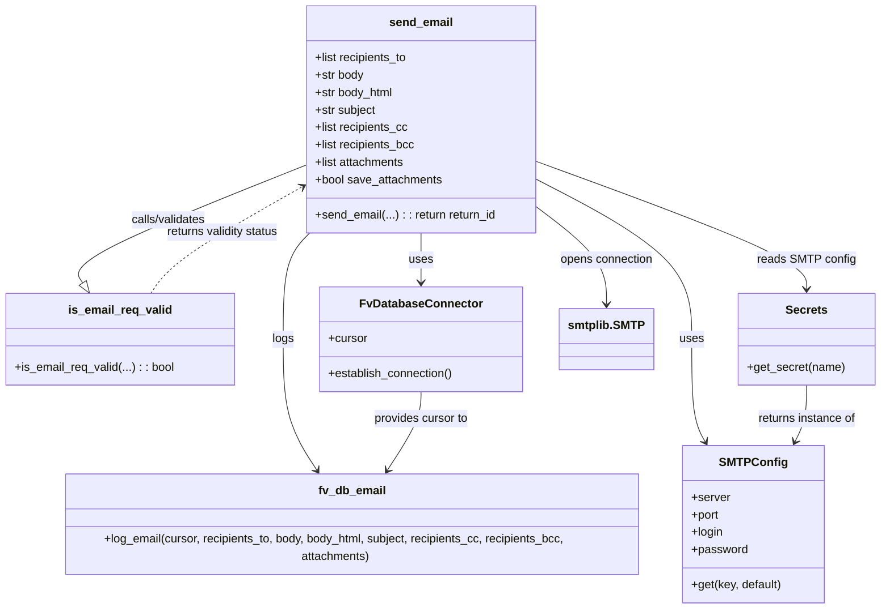

# Diagram: common/fv/python/fv/utilities/email_sender.py


> Auto-generated by Obscura crawlers

## Diagram 1

```mermaid
flowchart TD
    A[Start: send_email called] --> B{Validate request}
    B -- invalid --> Z[Abort: return None]
    B -- valid --> C[Establish DB connection]
    C --> D[Prepare attachments]
    D --> E{Attachments provided?}
    E -- yes --> E1[Generate UUID names]
    E1 --> E2[Upload to S3 and collect presigned URLs]
    E -- no --> F[No S3 uploads]
    E2 --> G[Log email request to DB (fv.db.email.log_email)]
    F --> G
    G --> H[Fetch SMTP config from Secrets]
    H --> I[Open SMTP connection (smtplib.SMTP)]
    I --> J{Enable TLS?}
    J -- yes --> J1[Start TLS]
    J -- no --> J2[Skip TLS]
    J1 --> K[Login to SMTP]
    J2 --> K
    K --> L[Compose MIMEMultipart message]
    L --> M{Attach body/plain/html}
    M --> N{Attach files if present}
    N --> O[Call smtp.send_message]
    O --> P{Success?}
    P -- success --> Q[Return DB email id]
    P -- failure --> R[Log error and raise exception]
    Z --> END
    Q --> END
    R --> END
```

> SVG rendering failed for this diagram.

## Diagram 2



### SVG

<svg id="container" width="1208.556640625" xmlns="http://www.w3.org/2000/svg" class="classDiagram" height="836" viewBox="0 0 1208.556640625 836" role="graphics-document document" aria-roledescription="class"><style>#container{font-family:"trebuchet ms",verdana,arial,sans-serif;font-size:16px;fill:#333;}@keyframes edge-animation-frame{from{stroke-dashoffset:0;}}@keyframes dash{to{stroke-dashoffset:0;}}#container .edge-animation-slow{stroke-dasharray:9,5!important;stroke-dashoffset:900;animation:dash 50s linear infinite;stroke-linecap:round;}#container .edge-animation-fast{stroke-dasharray:9,5!important;stroke-dashoffset:900;animation:dash 20s linear infinite;stroke-linecap:round;}#container .error-icon{fill:#552222;}#container .error-text{fill:#552222;stroke:#552222;}#container .edge-thickness-normal{stroke-width:1px;}#container .edge-thickness-thick{stroke-width:3.5px;}#container .edge-pattern-solid{stroke-dasharray:0;}#container .edge-thickness-invisible{stroke-width:0;fill:none;}#container .edge-pattern-dashed{stroke-dasharray:3;}#container .edge-pattern-dotted{stroke-dasharray:2;}#container .marker{fill:#333333;stroke:#333333;}#container .marker.cross{stroke:#333333;}#container svg{font-family:"trebuchet ms",verdana,arial,sans-serif;font-size:16px;}#container p{margin:0;}#container g.classGroup text{fill:#9370DB;stroke:none;font-family:"trebuchet ms",verdana,arial,sans-serif;font-size:10px;}#container g.classGroup text .title{font-weight:bolder;}#container .nodeLabel,#container .edgeLabel{color:#131300;}#container .edgeLabel .label rect{fill:#ECECFF;}#container .label text{fill:#131300;}#container .labelBkg{background:#ECECFF;}#container .edgeLabel .label span{background:#ECECFF;}#container .classTitle{font-weight:bolder;}#container .node rect,#container .node circle,#container .node ellipse,#container .node polygon,#container .node path{fill:#ECECFF;stroke:#9370DB;stroke-width:1px;}#container .divider{stroke:#9370DB;stroke-width:1;}#container g.clickable{cursor:pointer;}#container g.classGroup rect{fill:#ECECFF;stroke:#9370DB;}#container g.classGroup line{stroke:#9370DB;stroke-width:1;}#container .classLabel .box{stroke:none;stroke-width:0;fill:#ECECFF;opacity:0.5;}#container .classLabel .label{fill:#9370DB;font-size:10px;}#container .relation{stroke:#333333;stroke-width:1;fill:none;}#container .dashed-line{stroke-dasharray:3;}#container .dotted-line{stroke-dasharray:1 2;}#container #compositionStart,#container .composition{fill:#333333!important;stroke:#333333!important;stroke-width:1;}#container #compositionEnd,#container .composition{fill:#333333!important;stroke:#333333!important;stroke-width:1;}#container #dependencyStart,#container .dependency{fill:#333333!important;stroke:#333333!important;stroke-width:1;}#container #dependencyStart,#container .dependency{fill:#333333!important;stroke:#333333!important;stroke-width:1;}#container #extensionStart,#container .extension{fill:transparent!important;stroke:#333333!important;stroke-width:1;}#container #extensionEnd,#container .extension{fill:transparent!important;stroke:#333333!important;stroke-width:1;}#container #aggregationStart,#container .aggregation{fill:transparent!important;stroke:#333333!important;stroke-width:1;}#container #aggregationEnd,#container .aggregation{fill:transparent!important;stroke:#333333!important;stroke-width:1;}#container #lollipopStart,#container .lollipop{fill:#ECECFF!important;stroke:#333333!important;stroke-width:1;}#container #lollipopEnd,#container .lollipop{fill:#ECECFF!important;stroke:#333333!important;stroke-width:1;}#container .edgeTerminals{font-size:11px;line-height:initial;}#container .classTitleText{text-anchor:middle;font-size:18px;fill:#333;}#container .label-icon{display:inline-block;height:1em;overflow:visible;vertical-align:-0.125em;}#container .node .label-icon path{fill:currentColor;stroke:revert;stroke-width:revert;}#container :root{--mermaid-font-family:"trebuchet ms",verdana,arial,sans-serif;}</style><g><defs><marker id="container_class-aggregationStart" class="marker aggregation class" refX="18" refY="7" markerWidth="190" markerHeight="240" orient="auto"><path d="M 18,7 L9,13 L1,7 L9,1 Z"></path></marker></defs><defs><marker id="container_class-aggregationEnd" class="marker aggregation class" refX="1" refY="7" markerWidth="20" markerHeight="28" orient="auto"><path d="M 18,7 L9,13 L1,7 L9,1 Z"></path></marker></defs><defs><marker id="container_class-extensionStart" class="marker extension class" refX="18" refY="7" markerWidth="190" markerHeight="240" orient="auto"><path d="M 1,7 L18,13 V 1 Z"></path></marker></defs><defs><marker id="container_class-extensionEnd" class="marker extension class" refX="1" refY="7" markerWidth="20" markerHeight="28" orient="auto"><path d="M 1,1 V 13 L18,7 Z"></path></marker></defs><defs><marker id="container_class-compositionStart" class="marker composition class" refX="18" refY="7" markerWidth="190" markerHeight="240" orient="auto"><path d="M 18,7 L9,13 L1,7 L9,1 Z"></path></marker></defs><defs><marker id="container_class-compositionEnd" class="marker composition class" refX="1" refY="7" markerWidth="20" markerHeight="28" orient="auto"><path d="M 18,7 L9,13 L1,7 L9,1 Z"></path></marker></defs><defs><marker id="container_class-dependencyStart" class="marker dependency class" refX="6" refY="7" markerWidth="190" markerHeight="240" orient="auto"><path d="M 5,7 L9,13 L1,7 L9,1 Z"></path></marker></defs><defs><marker id="container_class-dependencyEnd" class="marker dependency class" refX="13" refY="7" markerWidth="20" markerHeight="28" orient="auto"><path d="M 18,7 L9,13 L14,7 L9,1 Z"></path></marker></defs><defs><marker id="container_class-lollipopStart" class="marker lollipop class" refX="13" refY="7" markerWidth="190" markerHeight="240" orient="auto"><circle stroke="black" fill="transparent" cx="7" cy="7" r="6"></circle></marker></defs><defs><marker id="container_class-lollipopEnd" class="marker lollipop class" refX="1" refY="7" markerWidth="190" markerHeight="240" orient="auto"><circle stroke="black" fill="transparent" cx="7" cy="7" r="6"></circle></marker></defs><g class="root"><g class="clusters"></g><g class="edgePaths"><path d="M421.334,225.989L365.61,247.824C309.887,269.659,198.439,313.33,146.426,340.475C94.413,367.62,101.835,378.24,105.545,383.55L109.256,388.86" id="id_send_email_is_email_req_valid_1" class="edge-thickness-normal edge-pattern-solid relation" style=";;;" data-edge="true" data-et="edge" data-id="id_send_email_is_email_req_valid_1" data-points="W3sieCI6NDIxLjMzMzk4NDM3NSwieSI6MjI1Ljk4ODYxOTE5NTA5NTU0fSx7IngiOjg2Ljk5MjE4NzUsInkiOjM1N30seyJ4IjoxMTkuMTM2NDY3ODg5OTA4MjYsInkiOjQwM31d" marker-end="url(#container_class-extensionEnd)"></path><path d="M579.529,320L579.529,326.167C579.529,332.333,579.529,344.667,579.529,356C579.529,367.333,579.529,377.667,579.529,382.833L579.529,388" id="id_send_email_FvDatabaseConnector_2" class="edge-thickness-normal edge-pattern-solid relation" style=";;;" data-edge="true" data-et="edge" data-id="id_send_email_FvDatabaseConnector_2" data-points="W3sieCI6NTc5LjUyOTI5Njg3NSwieSI6MzIwfSx7IngiOjU3OS41MjkyOTY4NzUsInkiOjM1N30seyJ4Ijo1NzkuNTI5Mjk2ODc1LCJ5IjozOTR9XQ==" marker-end="url(#container_class-dependencyEnd)"></path><path d="M427.485,320L421.475,326.167C415.465,332.333,403.444,344.667,397.434,369C391.424,393.333,391.424,429.667,391.424,466C391.424,502.333,391.424,538.667,399.744,569.661C408.065,600.655,424.706,626.311,433.027,639.139L441.347,651.966" id="id_send_email_fv_db_email_3" class="edge-thickness-normal edge-pattern-solid relation" style=";;;" data-edge="true" data-et="edge" data-id="id_send_email_fv_db_email_3" data-points="W3sieCI6NDI3LjQ4NTQ5ODI5OTg3MDQ3LCJ5IjozMjB9LHsieCI6MzkxLjQyMzgyODEyNSwieSI6MzU3fSx7IngiOjM5MS40MjM4MjgxMjUsInkiOjQ2Nn0seyJ4IjozOTEuNDIzODI4MTI1LCJ5Ijo1NzV9LHsieCI6NDQ0LjYxMjI3MTAxMjkzMTA1LCJ5Ijo2NTd9XQ==" marker-end="url(#container_class-dependencyEnd)"></path><path d="M737.725,221.764L799.451,244.304C861.178,266.843,984.631,311.921,1046.357,341.127C1108.084,370.333,1108.084,383.667,1108.084,390.333L1108.084,397" id="id_send_email_Secrets_4" class="edge-thickness-normal edge-pattern-solid relation" style=";;;" data-edge="true" data-et="edge" data-id="id_send_email_Secrets_4" data-points="W3sieCI6NzM3LjcyNDYwOTM3NSwieSI6MjIxLjc2NDQ5NjM0MTczMzh9LHsieCI6MTEwOC4wODM5ODQzNzUsInkiOjM1N30seyJ4IjoxMTA4LjA4Mzk4NDM3NSwieSI6NDAzfV0=" marker-end="url(#container_class-dependencyEnd)"></path><path d="M737.725,248.161L771.822,266.301C805.919,284.441,874.113,320.72,908.21,357.027C942.307,393.333,942.307,429.667,942.307,466C942.307,502.333,942.307,538.667,945.752,562.16C949.198,585.654,956.09,596.308,959.536,601.635L962.982,606.962" id="id_send_email_SMTPConfig_5" class="edge-thickness-normal edge-pattern-solid relation" style=";;;" data-edge="true" data-et="edge" data-id="id_send_email_SMTPConfig_5" data-points="W3sieCI6NzM3LjcyNDYwOTM3NSwieSI6MjQ4LjE2MDk3NTk3NzQzMTA2fSx7IngiOjk0Mi4zMDY2NDA2MjUsInkiOjM1N30seyJ4Ijo5NDIuMzA2NjQwNjI1LCJ5Ijo0NjZ9LHsieCI6OTQyLjMwNjY0MDYyNSwieSI6NTc1fSx7IngiOjk2Ni4yNDA1MTcyNDEzNzkzLCJ5Ijo2MTJ9XQ==" marker-end="url(#container_class-dependencyEnd)"></path><path d="M737.725,286.232L752.99,298.027C768.255,309.821,798.785,333.411,814.049,355.372C829.314,377.333,829.314,397.667,829.314,407.833L829.314,418" id="id_send_email_smtplib.SMTP_6" class="edge-thickness-normal edge-pattern-solid relation" style=";;;" data-edge="true" data-et="edge" data-id="id_send_email_smtplib.SMTP_6" data-points="W3sieCI6NzM3LjcyNDYwOTM3NSwieSI6Mjg2LjIzMTgyNDIyMzk0MjQ1fSx7IngiOjgyOS4zMTQ0NTMxMjUsInkiOjM1N30seyJ4Ijo4MjkuMzE0NDUzMTI1LCJ5Ijo0MjR9XQ==" marker-end="url(#container_class-dependencyEnd)"></path><path d="M579.529,538L579.529,544.167C579.529,550.333,579.529,562.667,571.209,581.661C562.888,600.655,546.247,626.311,537.927,639.139L529.606,651.966" id="id_FvDatabaseConnector_fv_db_email_7" class="edge-thickness-normal edge-pattern-solid relation" style=";;;" data-edge="true" data-et="edge" data-id="id_FvDatabaseConnector_fv_db_email_7" data-points="W3sieCI6NTc5LjUyOTI5Njg3NSwieSI6NTM4fSx7IngiOjU3OS41MjkyOTY4NzUsInkiOjU3NX0seyJ4Ijo1MjYuMzQwODUzOTg3MDY5LCJ5Ijo2NTd9XQ==" marker-end="url(#container_class-dependencyEnd)"></path><path d="M1108.084,529L1108.084,536.667C1108.084,544.333,1108.084,559.667,1105.467,572.604C1102.851,585.542,1097.617,596.084,1095.001,601.355L1092.384,606.626" id="id_Secrets_SMTPConfig_8" class="edge-thickness-normal edge-pattern-solid relation" style=";;;" data-edge="true" data-et="edge" data-id="id_Secrets_SMTPConfig_8" data-points="W3sieCI6MTEwOC4wODM5ODQzNzUsInkiOjUyOX0seyJ4IjoxMTA4LjA4Mzk4NDM3NSwieSI6NTc1fSx7IngiOjEwODkuNzE2MDU2MDM0NDgyOCwieSI6NjEyfV0=" marker-end="url(#container_class-dependencyEnd)"></path><path d="M207.184,403L212.541,395.333C217.899,387.667,228.613,372.333,263.435,347.951C298.257,323.569,357.186,290.138,386.651,273.422L416.115,256.707" id="id_is_email_req_valid_send_email_9" class="edge-thickness-normal edge-pattern-dashed relation" style=";;;" data-edge="true" data-et="edge" data-id="id_is_email_req_valid_send_email_9" data-points="W3sieCI6MjA3LjE4Mzg0NDYxMDA5MTc0LCJ5Ijo0MDN9LHsieCI6MjM5LjMyODEyNSwieSI6MzU3fSx7IngiOjQyMS4zMzM5ODQzNzUsInkiOjI1My43NDYwMDI3NjcyMDQ2fV0=" marker-end="url(#container_class-dependencyEnd)"></path></g><g class="edgeLabels"><g class="edgeLabel" transform="translate(228.03807, 301.73136)"><g class="label" data-id="id_send_email_is_email_req_valid_1" transform="translate(-53.125, -12)"><foreignObject width="106.25" height="24"><div xmlns="http://www.w3.org/1999/xhtml" class="labelBkg" style="display: table-cell; white-space: nowrap; line-height: 1.5; max-width: 200px; text-align: center;"><span class="edgeLabel"><p>calls/validates</p></span></div></foreignObject></g></g><g class="edgeLabel" transform="translate(579.529296875, 357)"><g class="label" data-id="id_send_email_FvDatabaseConnector_2" transform="translate(-16.4921875, -12)"><foreignObject width="32.984375" height="24"><div xmlns="http://www.w3.org/1999/xhtml" class="labelBkg" style="display: table-cell; white-space: nowrap; line-height: 1.5; max-width: 200px; text-align: center;"><span class="edgeLabel"><p>uses</p></span></div></foreignObject></g></g><g class="edgeLabel" transform="translate(391.423828125, 466)"><g class="label" data-id="id_send_email_fv_db_email_3" transform="translate(-14.8203125, -12)"><foreignObject width="29.640625" height="24"><div xmlns="http://www.w3.org/1999/xhtml" class="labelBkg" style="display: table-cell; white-space: nowrap; line-height: 1.5; max-width: 200px; text-align: center;"><span class="edgeLabel"><p>logs</p></span></div></foreignObject></g></g><g class="edgeLabel" transform="translate(1108.083984375, 357)"><g class="label" data-id="id_send_email_Secrets_4" transform="translate(-65.203125, -12)"><foreignObject width="130.40625" height="24"><div xmlns="http://www.w3.org/1999/xhtml" class="labelBkg" style="display: table-cell; white-space: nowrap; line-height: 1.5; max-width: 200px; text-align: center;"><span class="edgeLabel"><p>reads SMTP config</p></span></div></foreignObject></g></g><g class="edgeLabel" transform="translate(942.306640625, 466)"><g class="label" data-id="id_send_email_SMTPConfig_5" transform="translate(-16.4921875, -12)"><foreignObject width="32.984375" height="24"><div xmlns="http://www.w3.org/1999/xhtml" class="labelBkg" style="display: table-cell; white-space: nowrap; line-height: 1.5; max-width: 200px; text-align: center;"><span class="edgeLabel"><p>uses</p></span></div></foreignObject></g></g><g class="edgeLabel" transform="translate(829.314453125, 357)"><g class="label" data-id="id_send_email_smtplib.SMTP_6" transform="translate(-64.734375, -12)"><foreignObject width="129.46875" height="24"><div xmlns="http://www.w3.org/1999/xhtml" class="labelBkg" style="display: table-cell; white-space: nowrap; line-height: 1.5; max-width: 200px; text-align: center;"><span class="edgeLabel"><p>opens connection</p></span></div></foreignObject></g></g><g class="edgeLabel" transform="translate(579.529296875, 575)"><g class="label" data-id="id_FvDatabaseConnector_fv_db_email_7" transform="translate(-65.859375, -12)"><foreignObject width="131.71875" height="24"><div xmlns="http://www.w3.org/1999/xhtml" class="labelBkg" style="display: table-cell; white-space: nowrap; line-height: 1.5; max-width: 200px; text-align: center;"><span class="edgeLabel"><p>provides cursor to</p></span></div></foreignObject></g></g><g class="edgeLabel" transform="translate(1108.083984375, 575)"><g class="label" data-id="id_Secrets_SMTPConfig_8" transform="translate(-68.4375, -12)"><foreignObject width="136.875" height="24"><div xmlns="http://www.w3.org/1999/xhtml" class="labelBkg" style="display: table-cell; white-space: nowrap; line-height: 1.5; max-width: 200px; text-align: center;"><span class="edgeLabel"><p>returns instance of</p></span></div></foreignObject></g></g><g class="edgeLabel" transform="translate(239.328125, 357)"><g class="label" data-id="id_is_email_req_valid_send_email_9" transform="translate(-79.2109375, -12)"><foreignObject width="158.421875" height="24"><div xmlns="http://www.w3.org/1999/xhtml" class="labelBkg" style="display: table-cell; white-space: nowrap; line-height: 1.5; max-width: 200px; text-align: center;"><span class="edgeLabel"><p>returns validity status</p></span></div></foreignObject></g></g></g><g class="nodes"><g class="node default" id="classId-send_email-0" transform="translate(579.529296875, 164)"><g class="basic label-container"><path d="M-158.1953125 -156 L158.1953125 -156 L158.1953125 156 L-158.1953125 156" stroke="none" stroke-width="0" fill="#ECECFF" style=""></path><path d="M-158.1953125 -156 C-40.30346998759937 -156, 77.58837252480126 -156, 158.1953125 -156 M-158.1953125 -156 C-45.336699762795845 -156, 67.52191297440831 -156, 158.1953125 -156 M158.1953125 -156 C158.1953125 -39.465759074797575, 158.1953125 77.06848185040485, 158.1953125 156 M158.1953125 -156 C158.1953125 -54.9657573621831, 158.1953125 46.068485275633805, 158.1953125 156 M158.1953125 156 C81.74944430504486 156, 5.303576110089722 156, -158.1953125 156 M158.1953125 156 C68.16318191411837 156, -21.868948671763263 156, -158.1953125 156 M-158.1953125 156 C-158.1953125 47.725406253648075, -158.1953125 -60.54918749270385, -158.1953125 -156 M-158.1953125 156 C-158.1953125 59.98977145800302, -158.1953125 -36.02045708399396, -158.1953125 -156" stroke="#9370DB" stroke-width="1.3" fill="none" stroke-dasharray="0 0" style=""></path></g><g class="annotation-group text" transform="translate(0, -132)"></g><g class="label-group text" transform="translate(-41.890625, -132)"><g class="label" style="font-weight: bolder" transform="translate(0,-12)"><foreignObject width="83.78125" height="24"><div xmlns="http://www.w3.org/1999/xhtml" style="display: table-cell; white-space: nowrap; line-height: 1.5; max-width: 134px; text-align: center;"><span class="nodeLabel markdown-node-label" style=""><p>send_email</p></span></div></foreignObject></g></g><g class="members-group text" transform="translate(-146.1953125, -84)"><g class="label" style="" transform="translate(0,-12)"><foreignObject width="129.171875" height="24"><div xmlns="http://www.w3.org/1999/xhtml" style="display: table-cell; white-space: nowrap; line-height: 1.5; max-width: 187px; text-align: center;"><span class="nodeLabel markdown-node-label" style=""><p>+list recipients_to</p></span></div></foreignObject></g><g class="label" style="" transform="translate(0,12)"><foreignObject width="67.9375" height="24"><div xmlns="http://www.w3.org/1999/xhtml" style="display: table-cell; white-space: nowrap; line-height: 1.5; max-width: 125px; text-align: center;"><span class="nodeLabel markdown-node-label" style=""><p>+str body</p></span></div></foreignObject></g><g class="label" style="" transform="translate(0,36)"><foreignObject width="109.34375" height="24"><div xmlns="http://www.w3.org/1999/xhtml" style="display: table-cell; white-space: nowrap; line-height: 1.5; max-width: 167px; text-align: center;"><span class="nodeLabel markdown-node-label" style=""><p>+str body_html</p></span></div></foreignObject></g><g class="label" style="" transform="translate(0,60)"><foreignObject width="84.5625" height="24"><div xmlns="http://www.w3.org/1999/xhtml" style="display: table-cell; white-space: nowrap; line-height: 1.5; max-width: 142px; text-align: center;"><span class="nodeLabel markdown-node-label" style=""><p>+str subject</p></span></div></foreignObject></g><g class="label" style="" transform="translate(0,84)"><foreignObject width="129.265625" height="24"><div xmlns="http://www.w3.org/1999/xhtml" style="display: table-cell; white-space: nowrap; line-height: 1.5; max-width: 187px; text-align: center;"><span class="nodeLabel markdown-node-label" style=""><p>+list recipients_cc</p></span></div></foreignObject></g><g class="label" style="" transform="translate(0,108)"><foreignObject width="139.09375" height="24"><div xmlns="http://www.w3.org/1999/xhtml" style="display: table-cell; white-space: nowrap; line-height: 1.5; max-width: 197px; text-align: center;"><span class="nodeLabel markdown-node-label" style=""><p>+list recipients_bcc</p></span></div></foreignObject></g><g class="label" style="" transform="translate(0,132)"><foreignObject width="125.609375" height="24"><div xmlns="http://www.w3.org/1999/xhtml" style="display: table-cell; white-space: nowrap; line-height: 1.5; max-width: 183px; text-align: center;"><span class="nodeLabel markdown-node-label" style=""><p>+list attachments</p></span></div></foreignObject></g><g class="label" style="" transform="translate(0,156)"><foreignObject width="176.03125" height="24"><div xmlns="http://www.w3.org/1999/xhtml" style="display: table-cell; white-space: nowrap; line-height: 1.5; max-width: 233px; text-align: center;"><span class="nodeLabel markdown-node-label" style=""><p>+bool save_attachments</p></span></div></foreignObject></g></g><g class="methods-group text" transform="translate(-146.1953125, 132)"><g class="label" style="" transform="translate(0,-12)"><foreignObject width="250.5" height="24"><div xmlns="http://www.w3.org/1999/xhtml" style="display: table-cell; white-space: nowrap; line-height: 1.5; max-width: 308px; text-align: center;"><span class="nodeLabel markdown-node-label" style=""><p>+send_email(...) : : return return_id</p></span></div></foreignObject></g></g><g class="divider" style=""><path d="M-158.1953125 -108 C-74.95933574250046 -108, 8.276641014999086 -108, 158.1953125 -108 M-158.1953125 -108 C-53.086113426455825 -108, 52.02308564708835 -108, 158.1953125 -108" stroke="#9370DB" stroke-width="1.3" fill="none" stroke-dasharray="0 0" style=""></path></g><g class="divider" style=""><path d="M-158.1953125 108 C-59.85557915771156 108, 38.48415418457688 108, 158.1953125 108 M-158.1953125 108 C-45.1614330395134 108, 67.8724464209732 108, 158.1953125 108" stroke="#9370DB" stroke-width="1.3" fill="none" stroke-dasharray="0 0" style=""></path></g></g><g class="node default" id="classId-is_email_req_valid-1" transform="translate(163.16015625, 466)"><g class="basic label-container"><path d="M-155.16015625 -63 L155.16015625 -63 L155.16015625 63 L-155.16015625 63" stroke="none" stroke-width="0" fill="#ECECFF" style=""></path><path d="M-155.16015625 -63 C-52.31051797923901 -63, 50.53912029152198 -63, 155.16015625 -63 M-155.16015625 -63 C-79.07863188246878 -63, -2.997107514937568 -63, 155.16015625 -63 M155.16015625 -63 C155.16015625 -30.38774802428742, 155.16015625 2.224503951425163, 155.16015625 63 M155.16015625 -63 C155.16015625 -34.90457519975138, 155.16015625 -6.809150399502755, 155.16015625 63 M155.16015625 63 C42.92992778420478 63, -69.30030068159044 63, -155.16015625 63 M155.16015625 63 C43.30184413035373 63, -68.55646798929254 63, -155.16015625 63 M-155.16015625 63 C-155.16015625 34.98152658952204, -155.16015625 6.963053179044081, -155.16015625 -63 M-155.16015625 63 C-155.16015625 36.3448288318923, -155.16015625 9.689657663784601, -155.16015625 -63" stroke="#9370DB" stroke-width="1.3" fill="none" stroke-dasharray="0 0" style=""></path></g><g class="annotation-group text" transform="translate(0, -39)"></g><g class="label-group text" transform="translate(-68.0859375, -39)"><g class="label" style="font-weight: bolder" transform="translate(0,-12)"><foreignObject width="136.171875" height="24"><div xmlns="http://www.w3.org/1999/xhtml" style="display: table-cell; white-space: nowrap; line-height: 1.5; max-width: 185px; text-align: center;"><span class="nodeLabel markdown-node-label" style=""><p>is_email_req_valid</p></span></div></foreignObject></g></g><g class="members-group text" transform="translate(-143.16015625, 9)"></g><g class="methods-group text" transform="translate(-143.16015625, 39)"><g class="label" style="" transform="translate(0,-12)"><foreignObject width="218.234375" height="24"><div xmlns="http://www.w3.org/1999/xhtml" style="display: table-cell; white-space: nowrap; line-height: 1.5; max-width: 276px; text-align: center;"><span class="nodeLabel markdown-node-label" style=""><p>+is_email_req_valid(...) : : bool</p></span></div></foreignObject></g></g><g class="divider" style=""><path d="M-155.16015625 -15 C-76.84140037128027 -15, 1.477355507439455 -15, 155.16015625 -15 M-155.16015625 -15 C-46.413565267952876 -15, 62.33302571409425 -15, 155.16015625 -15" stroke="#9370DB" stroke-width="1.3" fill="none" stroke-dasharray="0 0" style=""></path></g><g class="divider" style=""><path d="M-155.16015625 9 C-75.95537405013316 9, 3.249408149733682 9, 155.16015625 9 M-155.16015625 9 C-54.5798322038367 9, 46.000491842326596 9, 155.16015625 9" stroke="#9370DB" stroke-width="1.3" fill="none" stroke-dasharray="0 0" style=""></path></g></g><g class="node default" id="classId-FvDatabaseConnector-2" transform="translate(579.529296875, 466)"><g class="basic label-container"><path d="M-138.28515625 -72 L138.28515625 -72 L138.28515625 72 L-138.28515625 72" stroke="none" stroke-width="0" fill="#ECECFF" style=""></path><path d="M-138.28515625 -72 C-62.54343483701484 -72, 13.198286575970315 -72, 138.28515625 -72 M-138.28515625 -72 C-49.753270768258474 -72, 38.77861471348305 -72, 138.28515625 -72 M138.28515625 -72 C138.28515625 -14.96777037862499, 138.28515625 42.06445924275002, 138.28515625 72 M138.28515625 -72 C138.28515625 -42.73486607749034, 138.28515625 -13.469732154980669, 138.28515625 72 M138.28515625 72 C47.74776004152184 72, -42.78963616695631 72, -138.28515625 72 M138.28515625 72 C80.96126136748471 72, 23.63736648496942 72, -138.28515625 72 M-138.28515625 72 C-138.28515625 16.524662602830468, -138.28515625 -38.950674794339065, -138.28515625 -72 M-138.28515625 72 C-138.28515625 21.22567697115001, -138.28515625 -29.548646057699983, -138.28515625 -72" stroke="#9370DB" stroke-width="1.3" fill="none" stroke-dasharray="0 0" style=""></path></g><g class="annotation-group text" transform="translate(0, -48)"></g><g class="label-group text" transform="translate(-79.3046875, -48)"><g class="label" style="font-weight: bolder" transform="translate(0,-12)"><foreignObject width="158.609375" height="24"><div xmlns="http://www.w3.org/1999/xhtml" style="display: table-cell; white-space: nowrap; line-height: 1.5; max-width: 207px; text-align: center;"><span class="nodeLabel markdown-node-label" style=""><p>FvDatabaseConnector</p></span></div></foreignObject></g></g><g class="members-group text" transform="translate(-126.28515625, 0)"><g class="label" style="" transform="translate(0,-12)"><foreignObject width="53.71875" height="24"><div xmlns="http://www.w3.org/1999/xhtml" style="display: table-cell; white-space: nowrap; line-height: 1.5; max-width: 112px; text-align: center;"><span class="nodeLabel markdown-node-label" style=""><p>+cursor</p></span></div></foreignObject></g></g><g class="methods-group text" transform="translate(-126.28515625, 48)"><g class="label" style="" transform="translate(0,-12)"><foreignObject width="173.265625" height="24"><div xmlns="http://www.w3.org/1999/xhtml" style="display: table-cell; white-space: nowrap; line-height: 1.5; max-width: 231px; text-align: center;"><span class="nodeLabel markdown-node-label" style=""><p>+establish_connection()</p></span></div></foreignObject></g></g><g class="divider" style=""><path d="M-138.28515625 -24 C-62.658738299458705 -24, 12.967679651082591 -24, 138.28515625 -24 M-138.28515625 -24 C-68.75688739082425 -24, 0.7713814683515068 -24, 138.28515625 -24" stroke="#9370DB" stroke-width="1.3" fill="none" stroke-dasharray="0 0" style=""></path></g><g class="divider" style=""><path d="M-138.28515625 24 C-58.53987719835024 24, 21.20540185329952 24, 138.28515625 24 M-138.28515625 24 C-56.85786531362834 24, 24.569425622743324 24, 138.28515625 24" stroke="#9370DB" stroke-width="1.3" fill="none" stroke-dasharray="0 0" style=""></path></g></g><g class="node default" id="classId-Secrets-3" transform="translate(1108.083984375, 466)"><g class="basic label-container"><path d="M-92.47265625 -63 L92.47265625 -63 L92.47265625 63 L-92.47265625 63" stroke="none" stroke-width="0" fill="#ECECFF" style=""></path><path d="M-92.47265625 -63 C-46.317344134941074 -63, -0.16203201988214744 -63, 92.47265625 -63 M-92.47265625 -63 C-39.386946850823115 -63, 13.69876254835377 -63, 92.47265625 -63 M92.47265625 -63 C92.47265625 -33.16497751935881, 92.47265625 -3.329955038717614, 92.47265625 63 M92.47265625 -63 C92.47265625 -21.928425909719223, 92.47265625 19.143148180561553, 92.47265625 63 M92.47265625 63 C24.945007063178423 63, -42.582642123643154 63, -92.47265625 63 M92.47265625 63 C23.626998036270024 63, -45.21866017745995 63, -92.47265625 63 M-92.47265625 63 C-92.47265625 14.282622800277117, -92.47265625 -34.434754399445765, -92.47265625 -63 M-92.47265625 63 C-92.47265625 25.130390861816487, -92.47265625 -12.739218276367026, -92.47265625 -63" stroke="#9370DB" stroke-width="1.3" fill="none" stroke-dasharray="0 0" style=""></path></g><g class="annotation-group text" transform="translate(0, -39)"></g><g class="label-group text" transform="translate(-27.1640625, -39)"><g class="label" style="font-weight: bolder" transform="translate(0,-12)"><foreignObject width="54.328125" height="24"><div xmlns="http://www.w3.org/1999/xhtml" style="display: table-cell; white-space: nowrap; line-height: 1.5; max-width: 103px; text-align: center;"><span class="nodeLabel markdown-node-label" style=""><p>Secrets</p></span></div></foreignObject></g></g><g class="members-group text" transform="translate(-80.47265625, 9)"></g><g class="methods-group text" transform="translate(-80.47265625, 39)"><g class="label" style="" transform="translate(0,-12)"><foreignObject width="133.78125" height="24"><div xmlns="http://www.w3.org/1999/xhtml" style="display: table-cell; white-space: nowrap; line-height: 1.5; max-width: 191px; text-align: center;"><span class="nodeLabel markdown-node-label" style=""><p>+get_secret(name)</p></span></div></foreignObject></g></g><g class="divider" style=""><path d="M-92.47265625 -15 C-51.993337387643386 -15, -11.514018525286772 -15, 92.47265625 -15 M-92.47265625 -15 C-42.27155000644122 -15, 7.929556237117566 -15, 92.47265625 -15" stroke="#9370DB" stroke-width="1.3" fill="none" stroke-dasharray="0 0" style=""></path></g><g class="divider" style=""><path d="M-92.47265625 9 C-28.465730635246203 9, 35.541194979507594 9, 92.47265625 9 M-92.47265625 9 C-46.97392818402201 9, -1.4752001180440146 9, 92.47265625 9" stroke="#9370DB" stroke-width="1.3" fill="none" stroke-dasharray="0 0" style=""></path></g></g><g class="node default" id="classId-SMTPConfig-4" transform="translate(1036.1015625, 720)"><g class="basic label-container"><path d="M-95.70703125 -108 L95.70703125 -108 L95.70703125 108 L-95.70703125 108" stroke="none" stroke-width="0" fill="#ECECFF" style=""></path><path d="M-95.70703125 -108 C-36.7181409340142 -108, 22.270749381971598 -108, 95.70703125 -108 M-95.70703125 -108 C-36.98625437820104 -108, 21.73452249359792 -108, 95.70703125 -108 M95.70703125 -108 C95.70703125 -40.61867948053103, 95.70703125 26.762641038937943, 95.70703125 108 M95.70703125 -108 C95.70703125 -60.6793525991912, 95.70703125 -13.358705198382395, 95.70703125 108 M95.70703125 108 C26.44045674487475 108, -42.8261177602505 108, -95.70703125 108 M95.70703125 108 C22.05575112267448 108, -51.59552900465104 108, -95.70703125 108 M-95.70703125 108 C-95.70703125 27.26013410896502, -95.70703125 -53.47973178206996, -95.70703125 -108 M-95.70703125 108 C-95.70703125 26.14357450741818, -95.70703125 -55.71285098516364, -95.70703125 -108" stroke="#9370DB" stroke-width="1.3" fill="none" stroke-dasharray="0 0" style=""></path></g><g class="annotation-group text" transform="translate(0, -84)"></g><g class="label-group text" transform="translate(-42.6953125, -84)"><g class="label" style="font-weight: bolder" transform="translate(0,-12)"><foreignObject width="85.390625" height="24"><div xmlns="http://www.w3.org/1999/xhtml" style="display: table-cell; white-space: nowrap; line-height: 1.5; max-width: 134px; text-align: center;"><span class="nodeLabel markdown-node-label" style=""><p>SMTPConfig</p></span></div></foreignObject></g></g><g class="members-group text" transform="translate(-83.70703125, -36)"><g class="label" style="" transform="translate(0,-12)"><foreignObject width="53.0625" height="24"><div xmlns="http://www.w3.org/1999/xhtml" style="display: table-cell; white-space: nowrap; line-height: 1.5; max-width: 111px; text-align: center;"><span class="nodeLabel markdown-node-label" style=""><p>+server</p></span></div></foreignObject></g><g class="label" style="" transform="translate(0,12)"><foreignObject width="38.796875" height="24"><div xmlns="http://www.w3.org/1999/xhtml" style="display: table-cell; white-space: nowrap; line-height: 1.5; max-width: 96px; text-align: center;"><span class="nodeLabel markdown-node-label" style=""><p>+port</p></span></div></foreignObject></g><g class="label" style="" transform="translate(0,36)"><foreignObject width="44.15625" height="24"><div xmlns="http://www.w3.org/1999/xhtml" style="display: table-cell; white-space: nowrap; line-height: 1.5; max-width: 102px; text-align: center;"><span class="nodeLabel markdown-node-label" style=""><p>+login</p></span></div></foreignObject></g><g class="label" style="" transform="translate(0,60)"><foreignObject width="76.625" height="24"><div xmlns="http://www.w3.org/1999/xhtml" style="display: table-cell; white-space: nowrap; line-height: 1.5; max-width: 134px; text-align: center;"><span class="nodeLabel markdown-node-label" style=""><p>+password</p></span></div></foreignObject></g></g><g class="methods-group text" transform="translate(-83.70703125, 84)"><g class="label" style="" transform="translate(0,-12)"><foreignObject width="124.71875" height="24"><div xmlns="http://www.w3.org/1999/xhtml" style="display: table-cell; white-space: nowrap; line-height: 1.5; max-width: 182px; text-align: center;"><span class="nodeLabel markdown-node-label" style=""><p>+get(key, default)</p></span></div></foreignObject></g></g><g class="divider" style=""><path d="M-95.70703125 -60 C-51.40045005931373 -60, -7.093868868627453 -60, 95.70703125 -60 M-95.70703125 -60 C-52.188330536686635 -60, -8.66962982337327 -60, 95.70703125 -60" stroke="#9370DB" stroke-width="1.3" fill="none" stroke-dasharray="0 0" style=""></path></g><g class="divider" style=""><path d="M-95.70703125 60 C-46.143831984264935 60, 3.41936728147013 60, 95.70703125 60 M-95.70703125 60 C-23.772535841649372 60, 48.161959566701256 60, 95.70703125 60" stroke="#9370DB" stroke-width="1.3" fill="none" stroke-dasharray="0 0" style=""></path></g></g><g class="node default" id="classId-fv_db_email-5" transform="translate(485.4765625, 720)"><g class="basic label-container"><path d="M-404.66015625 -63 L404.66015625 -63 L404.66015625 63 L-404.66015625 63" stroke="none" stroke-width="0" fill="#ECECFF" style=""></path><path d="M-404.66015625 -63 C-220.17391758638345 -63, -35.68767892276691 -63, 404.66015625 -63 M-404.66015625 -63 C-236.6468000449044 -63, -68.63344383980882 -63, 404.66015625 -63 M404.66015625 -63 C404.66015625 -25.35326304151436, 404.66015625 12.29347391697128, 404.66015625 63 M404.66015625 -63 C404.66015625 -13.476639907365183, 404.66015625 36.046720185269635, 404.66015625 63 M404.66015625 63 C109.49626149379122 63, -185.66763326241755 63, -404.66015625 63 M404.66015625 63 C125.63452323821122 63, -153.39110977357757 63, -404.66015625 63 M-404.66015625 63 C-404.66015625 33.8541512940926, -404.66015625 4.708302588185198, -404.66015625 -63 M-404.66015625 63 C-404.66015625 18.646005761994026, -404.66015625 -25.70798847601195, -404.66015625 -63" stroke="#9370DB" stroke-width="1.3" fill="none" stroke-dasharray="0 0" style=""></path></g><g class="annotation-group text" transform="translate(0, -39)"></g><g class="label-group text" transform="translate(-44.3203125, -39)"><g class="label" style="font-weight: bolder" transform="translate(0,-12)"><foreignObject width="88.640625" height="24"><div xmlns="http://www.w3.org/1999/xhtml" style="display: table-cell; white-space: nowrap; line-height: 1.5; max-width: 138px; text-align: center;"><span class="nodeLabel markdown-node-label" style=""><p>fv_db_email</p></span></div></foreignObject></g></g><g class="members-group text" transform="translate(-392.66015625, 9)"></g><g class="methods-group text" transform="translate(-392.66015625, 39)"><g class="label" style="" transform="translate(0,-12)"><foreignObject width="741" height="24"><div xmlns="http://www.w3.org/1999/xhtml" style="display: table-cell; white-space: nowrap; line-height: 1.5; max-width: 798px; text-align: center;"><span class="nodeLabel markdown-node-label" style=""><p>+log_email(cursor, recipients_to, body, body_html, subject, recipients_cc, recipients_bcc, attachments)</p></span></div></foreignObject></g></g><g class="divider" style=""><path d="M-404.66015625 -15 C-133.18339741006184 -15, 138.2933614298763 -15, 404.66015625 -15 M-404.66015625 -15 C-175.3729676896613 -15, 53.91422087067741 -15, 404.66015625 -15" stroke="#9370DB" stroke-width="1.3" fill="none" stroke-dasharray="0 0" style=""></path></g><g class="divider" style=""><path d="M-404.66015625 9 C-213.4469077654302 9, -22.233659280860422 9, 404.66015625 9 M-404.66015625 9 C-118.33637941329368 9, 167.98739742341263 9, 404.66015625 9" stroke="#9370DB" stroke-width="1.3" fill="none" stroke-dasharray="0 0" style=""></path></g></g><g class="node default" id="classId-smtplib.SMTP-6" transform="translate(829.314453125, 466)"><g class="basic label-container"><path d="M-61.5 -42 L61.5 -42 L61.5 42 L-61.5 42" stroke="none" stroke-width="0" fill="#ECECFF" style=""></path><path d="M-61.5 -42 C-34.67785712013641 -42, -7.855714240272825 -42, 61.5 -42 M-61.5 -42 C-34.7412550327728 -42, -7.98251006554559 -42, 61.5 -42 M61.5 -42 C61.5 -12.070567335396348, 61.5 17.858865329207305, 61.5 42 M61.5 -42 C61.5 -19.717001073993497, 61.5 2.5659978520130053, 61.5 42 M61.5 42 C18.446744099417664 42, -24.60651180116467 42, -61.5 42 M61.5 42 C30.20128493057174 42, -1.0974301388565166 42, -61.5 42 M-61.5 42 C-61.5 11.453514127515483, -61.5 -19.092971744969034, -61.5 -42 M-61.5 42 C-61.5 9.795456856906242, -61.5 -22.409086286187517, -61.5 -42" stroke="#9370DB" stroke-width="1.3" fill="none" stroke-dasharray="0 0" style=""></path></g><g class="annotation-group text" transform="translate(0, -18)"></g><g class="label-group text" transform="translate(-49.5, -18)"><g class="label" style="font-weight: bolder" transform="translate(0,-12)"><foreignObject width="99" height="24"><div xmlns="http://www.w3.org/1999/xhtml" style="display: table-cell; white-space: nowrap; line-height: 1.5; max-width: 147px; text-align: center;"><span class="nodeLabel markdown-node-label" style=""><p>smtplib.SMTP</p></span></div></foreignObject></g></g><g class="members-group text" transform="translate(-49.5, 30)"></g><g class="methods-group text" transform="translate(-49.5, 60)"></g><g class="divider" style=""><path d="M-61.5 6 C-30.47869899669055 6, 0.5426020066188997 6, 61.5 6 M-61.5 6 C-28.394731988095025 6, 4.710536023809951 6, 61.5 6" stroke="#9370DB" stroke-width="1.3" fill="none" stroke-dasharray="0 0" style=""></path></g><g class="divider" style=""><path d="M-61.5 24 C-28.93204052223077 24, 3.6359189555384575 24, 61.5 24 M-61.5 24 C-19.844738291938434 24, 21.810523416123132 24, 61.5 24" stroke="#9370DB" stroke-width="1.3" fill="none" stroke-dasharray="0 0" style=""></path></g></g></g></g></g></svg>
