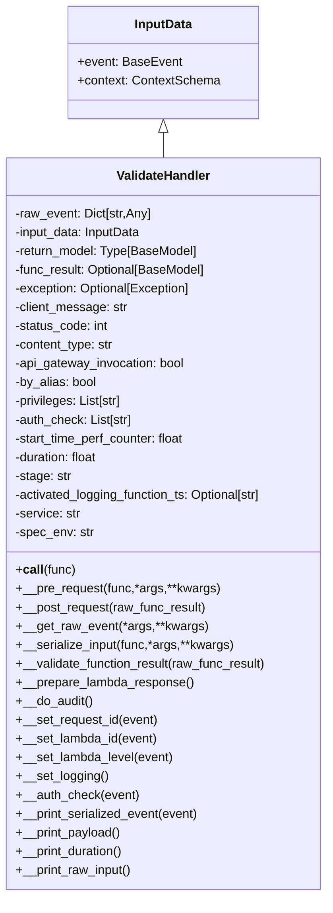

# Diagram: common/fv/python/fv/utilities/handler_validator.py


> Auto-generated by Obscura crawlers

## Diagram 1



### SVG

<svg id="container" width="423.40625" xmlns="http://www.w3.org/2000/svg" class="classDiagram" height="1146" viewBox="0 0 423.40625 1146" role="graphics-document document" aria-roledescription="class"><style>#container{font-family:"trebuchet ms",verdana,arial,sans-serif;font-size:16px;fill:#333;}@keyframes edge-animation-frame{from{stroke-dashoffset:0;}}@keyframes dash{to{stroke-dashoffset:0;}}#container .edge-animation-slow{stroke-dasharray:9,5!important;stroke-dashoffset:900;animation:dash 50s linear infinite;stroke-linecap:round;}#container .edge-animation-fast{stroke-dasharray:9,5!important;stroke-dashoffset:900;animation:dash 20s linear infinite;stroke-linecap:round;}#container .error-icon{fill:#552222;}#container .error-text{fill:#552222;stroke:#552222;}#container .edge-thickness-normal{stroke-width:1px;}#container .edge-thickness-thick{stroke-width:3.5px;}#container .edge-pattern-solid{stroke-dasharray:0;}#container .edge-thickness-invisible{stroke-width:0;fill:none;}#container .edge-pattern-dashed{stroke-dasharray:3;}#container .edge-pattern-dotted{stroke-dasharray:2;}#container .marker{fill:#333333;stroke:#333333;}#container .marker.cross{stroke:#333333;}#container svg{font-family:"trebuchet ms",verdana,arial,sans-serif;font-size:16px;}#container p{margin:0;}#container g.classGroup text{fill:#9370DB;stroke:none;font-family:"trebuchet ms",verdana,arial,sans-serif;font-size:10px;}#container g.classGroup text .title{font-weight:bolder;}#container .nodeLabel,#container .edgeLabel{color:#131300;}#container .edgeLabel .label rect{fill:#ECECFF;}#container .label text{fill:#131300;}#container .labelBkg{background:#ECECFF;}#container .edgeLabel .label span{background:#ECECFF;}#container .classTitle{font-weight:bolder;}#container .node rect,#container .node circle,#container .node ellipse,#container .node polygon,#container .node path{fill:#ECECFF;stroke:#9370DB;stroke-width:1px;}#container .divider{stroke:#9370DB;stroke-width:1;}#container g.clickable{cursor:pointer;}#container g.classGroup rect{fill:#ECECFF;stroke:#9370DB;}#container g.classGroup line{stroke:#9370DB;stroke-width:1;}#container .classLabel .box{stroke:none;stroke-width:0;fill:#ECECFF;opacity:0.5;}#container .classLabel .label{fill:#9370DB;font-size:10px;}#container .relation{stroke:#333333;stroke-width:1;fill:none;}#container .dashed-line{stroke-dasharray:3;}#container .dotted-line{stroke-dasharray:1 2;}#container #compositionStart,#container .composition{fill:#333333!important;stroke:#333333!important;stroke-width:1;}#container #compositionEnd,#container .composition{fill:#333333!important;stroke:#333333!important;stroke-width:1;}#container #dependencyStart,#container .dependency{fill:#333333!important;stroke:#333333!important;stroke-width:1;}#container #dependencyStart,#container .dependency{fill:#333333!important;stroke:#333333!important;stroke-width:1;}#container #extensionStart,#container .extension{fill:transparent!important;stroke:#333333!important;stroke-width:1;}#container #extensionEnd,#container .extension{fill:transparent!important;stroke:#333333!important;stroke-width:1;}#container #aggregationStart,#container .aggregation{fill:transparent!important;stroke:#333333!important;stroke-width:1;}#container #aggregationEnd,#container .aggregation{fill:transparent!important;stroke:#333333!important;stroke-width:1;}#container #lollipopStart,#container .lollipop{fill:#ECECFF!important;stroke:#333333!important;stroke-width:1;}#container #lollipopEnd,#container .lollipop{fill:#ECECFF!important;stroke:#333333!important;stroke-width:1;}#container .edgeTerminals{font-size:11px;line-height:initial;}#container .classTitleText{text-anchor:middle;font-size:18px;fill:#333;}#container .label-icon{display:inline-block;height:1em;overflow:visible;vertical-align:-0.125em;}#container .node .label-icon path{fill:currentColor;stroke:revert;stroke-width:revert;}#container :root{--mermaid-font-family:"trebuchet ms",verdana,arial,sans-serif;}</style><g><defs><marker id="container_class-aggregationStart" class="marker aggregation class" refX="18" refY="7" markerWidth="190" markerHeight="240" orient="auto"><path d="M 18,7 L9,13 L1,7 L9,1 Z"></path></marker></defs><defs><marker id="container_class-aggregationEnd" class="marker aggregation class" refX="1" refY="7" markerWidth="20" markerHeight="28" orient="auto"><path d="M 18,7 L9,13 L1,7 L9,1 Z"></path></marker></defs><defs><marker id="container_class-extensionStart" class="marker extension class" refX="18" refY="7" markerWidth="190" markerHeight="240" orient="auto"><path d="M 1,7 L18,13 V 1 Z"></path></marker></defs><defs><marker id="container_class-extensionEnd" class="marker extension class" refX="1" refY="7" markerWidth="20" markerHeight="28" orient="auto"><path d="M 1,1 V 13 L18,7 Z"></path></marker></defs><defs><marker id="container_class-compositionStart" class="marker composition class" refX="18" refY="7" markerWidth="190" markerHeight="240" orient="auto"><path d="M 18,7 L9,13 L1,7 L9,1 Z"></path></marker></defs><defs><marker id="container_class-compositionEnd" class="marker composition class" refX="1" refY="7" markerWidth="20" markerHeight="28" orient="auto"><path d="M 18,7 L9,13 L1,7 L9,1 Z"></path></marker></defs><defs><marker id="container_class-dependencyStart" class="marker dependency class" refX="6" refY="7" markerWidth="190" markerHeight="240" orient="auto"><path d="M 5,7 L9,13 L1,7 L9,1 Z"></path></marker></defs><defs><marker id="container_class-dependencyEnd" class="marker dependency class" refX="13" refY="7" markerWidth="20" markerHeight="28" orient="auto"><path d="M 18,7 L9,13 L14,7 L9,1 Z"></path></marker></defs><defs><marker id="container_class-lollipopStart" class="marker lollipop class" refX="13" refY="7" markerWidth="190" markerHeight="240" orient="auto"><circle stroke="black" fill="transparent" cx="7" cy="7" r="6"></circle></marker></defs><defs><marker id="container_class-lollipopEnd" class="marker lollipop class" refX="1" refY="7" markerWidth="190" markerHeight="240" orient="auto"><circle stroke="black" fill="transparent" cx="7" cy="7" r="6"></circle></marker></defs><g class="root"><g class="clusters"></g><g class="edgePaths"><path d="M211.703,169.25L211.703,170.542C211.703,171.833,211.703,174.417,211.703,179.875C211.703,185.333,211.703,193.667,211.703,197.833L211.703,202" id="id_InputData_ValidateHandler_1" class="edge-thickness-normal edge-pattern-solid relation" style=";;;" data-edge="true" data-et="edge" data-id="id_InputData_ValidateHandler_1" data-points="W3sieCI6MjExLjcwMzEyNSwieSI6MTUyfSx7IngiOjIxMS43MDMxMjUsInkiOjE3N30seyJ4IjoyMTEuNzAzMTI1LCJ5IjoyMDJ9XQ==" marker-start="url(#container_class-extensionStart)"></path></g><g class="edgeLabels"><g class="edgeLabel"><g class="label" data-id="id_InputData_ValidateHandler_1" transform="translate(0, 0)"><foreignObject width="0" height="0"><div xmlns="http://www.w3.org/1999/xhtml" class="labelBkg" style="display: table-cell; white-space: nowrap; line-height: 1.5; max-width: 200px; text-align: center;"><span class="edgeLabel"></span></div></foreignObject></g></g></g><g class="nodes"><g class="node default" id="classId-InputData-0" transform="translate(211.703125, 80)"><g class="basic label-container"><path d="M-121.00390625 -72 L121.00390625 -72 L121.00390625 72 L-121.00390625 72" stroke="none" stroke-width="0" fill="#ECECFF" style=""></path><path d="M-121.00390625 -72 C-63.61180463036237 -72, -6.219703010724743 -72, 121.00390625 -72 M-121.00390625 -72 C-38.1817993478122 -72, 44.640307554375596 -72, 121.00390625 -72 M121.00390625 -72 C121.00390625 -24.746072427210606, 121.00390625 22.507855145578787, 121.00390625 72 M121.00390625 -72 C121.00390625 -22.84920257736409, 121.00390625 26.301594845271822, 121.00390625 72 M121.00390625 72 C67.92020533280404 72, 14.836504415608076 72, -121.00390625 72 M121.00390625 72 C51.50234408625647 72, -17.999218077487058 72, -121.00390625 72 M-121.00390625 72 C-121.00390625 40.97950491322101, -121.00390625 9.959009826442006, -121.00390625 -72 M-121.00390625 72 C-121.00390625 29.75624282504598, -121.00390625 -12.48751434990804, -121.00390625 -72" stroke="#9370DB" stroke-width="1.3" fill="none" stroke-dasharray="0 0" style=""></path></g><g class="annotation-group text" transform="translate(0, -48)"></g><g class="label-group text" transform="translate(-36.2890625, -48)"><g class="label" style="font-weight: bolder" transform="translate(0,-12)"><foreignObject width="72.578125" height="24"><div xmlns="http://www.w3.org/1999/xhtml" style="display: table-cell; white-space: nowrap; line-height: 1.5; max-width: 122px; text-align: center;"><span class="nodeLabel markdown-node-label" style=""><p>InputData</p></span></div></foreignObject></g></g><g class="members-group text" transform="translate(-109.00390625, 0)"><g class="label" style="" transform="translate(0,-12)"><foreignObject width="130.859375" height="24"><div xmlns="http://www.w3.org/1999/xhtml" style="display: table-cell; white-space: nowrap; line-height: 1.5; max-width: 188px; text-align: center;"><span class="nodeLabel markdown-node-label" style=""><p>+event: BaseEvent</p></span></div></foreignObject></g><g class="label" style="" transform="translate(0,12)"><foreignObject width="181.71875" height="24"><div xmlns="http://www.w3.org/1999/xhtml" style="display: table-cell; white-space: nowrap; line-height: 1.5; max-width: 239px; text-align: center;"><span class="nodeLabel markdown-node-label" style=""><p>+context: ContextSchema</p></span></div></foreignObject></g></g><g class="methods-group text" transform="translate(-109.00390625, 72)"></g><g class="divider" style=""><path d="M-121.00390625 -24 C-33.017895572128936 -24, 54.96811510574213 -24, 121.00390625 -24 M-121.00390625 -24 C-34.18591983983376 -24, 52.63206657033248 -24, 121.00390625 -24" stroke="#9370DB" stroke-width="1.3" fill="none" stroke-dasharray="0 0" style=""></path></g><g class="divider" style=""><path d="M-121.00390625 48 C-35.01637348510522 48, 50.97115927978956 48, 121.00390625 48 M-121.00390625 48 C-71.36006143096785 48, -21.71621661193568 48, 121.00390625 48" stroke="#9370DB" stroke-width="1.3" fill="none" stroke-dasharray="0 0" style=""></path></g></g><g class="node default" id="classId-ValidateHandler-1" transform="translate(211.703125, 670)"><g class="basic label-container"><path d="M-203.703125 -468 L203.703125 -468 L203.703125 468 L-203.703125 468" stroke="none" stroke-width="0" fill="#ECECFF" style=""></path><path d="M-203.703125 -468 C-41.21311714866124 -468, 121.27689070267752 -468, 203.703125 -468 M-203.703125 -468 C-80.86466933593017 -468, 41.97378632813965 -468, 203.703125 -468 M203.703125 -468 C203.703125 -220.93419144756498, 203.703125 26.13161710487003, 203.703125 468 M203.703125 -468 C203.703125 -256.92034146922657, 203.703125 -45.84068293845314, 203.703125 468 M203.703125 468 C91.21421350350819 468, -21.27469799298362 468, -203.703125 468 M203.703125 468 C84.3787843349939 468, -34.94555633001221 468, -203.703125 468 M-203.703125 468 C-203.703125 174.3606098580774, -203.703125 -119.27878028384521, -203.703125 -468 M-203.703125 468 C-203.703125 226.14035156835004, -203.703125 -15.719296863299917, -203.703125 -468" stroke="#9370DB" stroke-width="1.3" fill="none" stroke-dasharray="0 0" style=""></path></g><g class="annotation-group text" transform="translate(0, -444)"></g><g class="label-group text" transform="translate(-58.8125, -444)"><g class="label" style="font-weight: bolder" transform="translate(0,-12)"><foreignObject width="117.625" height="24"><div xmlns="http://www.w3.org/1999/xhtml" style="display: table-cell; white-space: nowrap; line-height: 1.5; max-width: 167px; text-align: center;"><span class="nodeLabel markdown-node-label" style=""><p>ValidateHandler</p></span></div></foreignObject></g></g><g class="members-group text" transform="translate(-191.703125, -396)"><g class="label" style="" transform="translate(0,-12)"><foreignObject width="175.21875" height="24"><div xmlns="http://www.w3.org/1999/xhtml" style="display: table-cell; white-space: nowrap; line-height: 1.5; max-width: 233px; text-align: center;"><span class="nodeLabel markdown-node-label" style=""><p>-raw_event: Dict[str,Any]</p></span></div></foreignObject></g><g class="label" style="" transform="translate(0,12)"><foreignObject width="165.5625" height="24"><div xmlns="http://www.w3.org/1999/xhtml" style="display: table-cell; white-space: nowrap; line-height: 1.5; max-width: 223px; text-align: center;"><span class="nodeLabel markdown-node-label" style=""><p>-input_data: InputData</p></span></div></foreignObject></g><g class="label" style="" transform="translate(0,36)"><foreignObject width="237.4375" height="24"><div xmlns="http://www.w3.org/1999/xhtml" style="display: table-cell; white-space: nowrap; line-height: 1.5; max-width: 295px; text-align: center;"><span class="nodeLabel markdown-node-label" style=""><p>-return_model: Type[BaseModel]</p></span></div></foreignObject></g><g class="label" style="" transform="translate(0,60)"><foreignObject width="248.453125" height="24"><div xmlns="http://www.w3.org/1999/xhtml" style="display: table-cell; white-space: nowrap; line-height: 1.5; max-width: 306px; text-align: center;"><span class="nodeLabel markdown-node-label" style=""><p>-func_result: Optional[BaseModel]</p></span></div></foreignObject></g><g class="label" style="" transform="translate(0,84)"><foreignObject width="229.140625" height="24"><div xmlns="http://www.w3.org/1999/xhtml" style="display: table-cell; white-space: nowrap; line-height: 1.5; max-width: 287px; text-align: center;"><span class="nodeLabel markdown-node-label" style=""><p>-exception: Optional[Exception]</p></span></div></foreignObject></g><g class="label" style="" transform="translate(0,108)"><foreignObject width="145.390625" height="24"><div xmlns="http://www.w3.org/1999/xhtml" style="display: table-cell; white-space: nowrap; line-height: 1.5; max-width: 204px; text-align: center;"><span class="nodeLabel markdown-node-label" style=""><p>-client_message: str</p></span></div></foreignObject></g><g class="label" style="" transform="translate(0,132)"><foreignObject width="121.234375" height="24"><div xmlns="http://www.w3.org/1999/xhtml" style="display: table-cell; white-space: nowrap; line-height: 1.5; max-width: 179px; text-align: center;"><span class="nodeLabel markdown-node-label" style=""><p>-status_code: int</p></span></div></foreignObject></g><g class="label" style="" transform="translate(0,156)"><foreignObject width="129.203125" height="24"><div xmlns="http://www.w3.org/1999/xhtml" style="display: table-cell; white-space: nowrap; line-height: 1.5; max-width: 187px; text-align: center;"><span class="nodeLabel markdown-node-label" style=""><p>-content_type: str</p></span></div></foreignObject></g><g class="label" style="" transform="translate(0,180)"><foreignObject width="220.921875" height="24"><div xmlns="http://www.w3.org/1999/xhtml" style="display: table-cell; white-space: nowrap; line-height: 1.5; max-width: 279px; text-align: center;"><span class="nodeLabel markdown-node-label" style=""><p>-api_gateway_invocation: bool</p></span></div></foreignObject></g><g class="label" style="" transform="translate(0,204)"><foreignObject width="106.015625" height="24"><div xmlns="http://www.w3.org/1999/xhtml" style="display: table-cell; white-space: nowrap; line-height: 1.5; max-width: 164px; text-align: center;"><span class="nodeLabel markdown-node-label" style=""><p>-by_alias: bool</p></span></div></foreignObject></g><g class="label" style="" transform="translate(0,228)"><foreignObject width="140.15625" height="24"><div xmlns="http://www.w3.org/1999/xhtml" style="display: table-cell; white-space: nowrap; line-height: 1.5; max-width: 198px; text-align: center;"><span class="nodeLabel markdown-node-label" style=""><p>-privileges: List[str]</p></span></div></foreignObject></g><g class="label" style="" transform="translate(0,252)"><foreignObject width="152.5625" height="24"><div xmlns="http://www.w3.org/1999/xhtml" style="display: table-cell; white-space: nowrap; line-height: 1.5; max-width: 210px; text-align: center;"><span class="nodeLabel markdown-node-label" style=""><p>-auth_check: List[str]</p></span></div></foreignObject></g><g class="label" style="" transform="translate(0,276)"><foreignObject width="223.34375" height="24"><div xmlns="http://www.w3.org/1999/xhtml" style="display: table-cell; white-space: nowrap; line-height: 1.5; max-width: 281px; text-align: center;"><span class="nodeLabel markdown-node-label" style=""><p>-start_time_perf_counter: float</p></span></div></foreignObject></g><g class="label" style="" transform="translate(0,300)"><foreignObject width="109.796875" height="24"><div xmlns="http://www.w3.org/1999/xhtml" style="display: table-cell; white-space: nowrap; line-height: 1.5; max-width: 167px; text-align: center;"><span class="nodeLabel markdown-node-label" style=""><p>-duration: float</p></span></div></foreignObject></g><g class="label" style="" transform="translate(0,324)"><foreignObject width="72.421875" height="24"><div xmlns="http://www.w3.org/1999/xhtml" style="display: table-cell; white-space: nowrap; line-height: 1.5; max-width: 131px; text-align: center;"><span class="nodeLabel markdown-node-label" style=""><p>-stage: str</p></span></div></foreignObject></g><g class="label" style="" transform="translate(0,348)"><foreignObject width="324.59375" height="24"><div xmlns="http://www.w3.org/1999/xhtml" style="display: table-cell; white-space: nowrap; line-height: 1.5; max-width: 382px; text-align: center;"><span class="nodeLabel markdown-node-label" style=""><p>-activated_logging_function_ts: Optional[str]</p></span></div></foreignObject></g><g class="label" style="" transform="translate(0,372)"><foreignObject width="84.765625" height="24"><div xmlns="http://www.w3.org/1999/xhtml" style="display: table-cell; white-space: nowrap; line-height: 1.5; max-width: 143px; text-align: center;"><span class="nodeLabel markdown-node-label" style=""><p>-service: str</p></span></div></foreignObject></g><g class="label" style="" transform="translate(0,396)"><foreignObject width="101.21875" height="24"><div xmlns="http://www.w3.org/1999/xhtml" style="display: table-cell; white-space: nowrap; line-height: 1.5; max-width: 159px; text-align: center;"><span class="nodeLabel markdown-node-label" style=""><p>-spec_env: str</p></span></div></foreignObject></g></g><g class="methods-group text" transform="translate(-191.703125, 60)"><g class="label" style="" transform="translate(0,-12)"><foreignObject width="75.6875" height="24"><div xmlns="http://www.w3.org/1999/xhtml" style="display: table-cell; white-space: nowrap; line-height: 1.5; max-width: 164px; text-align: center;"><span class="nodeLabel markdown-node-label" style=""><p>+<strong>call</strong>(func)</p></span></div></foreignObject></g><g class="label" style="" transform="translate(0,12)"><foreignObject width="258.015625" height="24"><div xmlns="http://www.w3.org/1999/xhtml" style="display: table-cell; white-space: nowrap; line-height: 1.5; max-width: 315px; text-align: center;"><span class="nodeLabel markdown-node-label" style=""><p>+__pre_request(func,*args,**kwargs)</p></span></div></foreignObject></g><g class="label" style="" transform="translate(0,36)"><foreignObject width="244.3125" height="24"><div xmlns="http://www.w3.org/1999/xhtml" style="display: table-cell; white-space: nowrap; line-height: 1.5; max-width: 302px; text-align: center;"><span class="nodeLabel markdown-node-label" style=""><p>+__post_request(raw_func_result)</p></span></div></foreignObject></g><g class="label" style="" transform="translate(0,60)"><foreignObject width="241.484375" height="24"><div xmlns="http://www.w3.org/1999/xhtml" style="display: table-cell; white-space: nowrap; line-height: 1.5; max-width: 299px; text-align: center;"><span class="nodeLabel markdown-node-label" style=""><p>+__get_raw_event(*args,**kwargs)</p></span></div></foreignObject></g><g class="label" style="" transform="translate(0,84)"><foreignObject width="277.53125" height="24"><div xmlns="http://www.w3.org/1999/xhtml" style="display: table-cell; white-space: nowrap; line-height: 1.5; max-width: 335px; text-align: center;"><span class="nodeLabel markdown-node-label" style=""><p>+__serialize_input(func,*args,**kwargs)</p></span></div></foreignObject></g><g class="label" style="" transform="translate(0,108)"><foreignObject width="324.40625" height="24"><div xmlns="http://www.w3.org/1999/xhtml" style="display: table-cell; white-space: nowrap; line-height: 1.5; max-width: 382px; text-align: center;"><span class="nodeLabel markdown-node-label" style=""><p>+__validate_function_result(raw_func_result)</p></span></div></foreignObject></g><g class="label" style="" transform="translate(0,132)"><foreignObject width="227.203125" height="24"><div xmlns="http://www.w3.org/1999/xhtml" style="display: table-cell; white-space: nowrap; line-height: 1.5; max-width: 285px; text-align: center;"><span class="nodeLabel markdown-node-label" style=""><p>+__prepare_lambda_response()</p></span></div></foreignObject></g><g class="label" style="" transform="translate(0,156)"><foreignObject width="97.703125" height="24"><div xmlns="http://www.w3.org/1999/xhtml" style="display: table-cell; white-space: nowrap; line-height: 1.5; max-width: 155px; text-align: center;"><span class="nodeLabel markdown-node-label" style=""><p>+__do_audit()</p></span></div></foreignObject></g><g class="label" style="" transform="translate(0,180)"><foreignObject width="181.84375" height="24"><div xmlns="http://www.w3.org/1999/xhtml" style="display: table-cell; white-space: nowrap; line-height: 1.5; max-width: 239px; text-align: center;"><span class="nodeLabel markdown-node-label" style=""><p>+__set_request_id(event)</p></span></div></foreignObject></g><g class="label" style="" transform="translate(0,204)"><foreignObject width="181.21875" height="24"><div xmlns="http://www.w3.org/1999/xhtml" style="display: table-cell; white-space: nowrap; line-height: 1.5; max-width: 239px; text-align: center;"><span class="nodeLabel markdown-node-label" style=""><p>+__set_lambda_id(event)</p></span></div></foreignObject></g><g class="label" style="" transform="translate(0,228)"><foreignObject width="201.46875" height="24"><div xmlns="http://www.w3.org/1999/xhtml" style="display: table-cell; white-space: nowrap; line-height: 1.5; max-width: 259px; text-align: center;"><span class="nodeLabel markdown-node-label" style=""><p>+__set_lambda_level(event)</p></span></div></foreignObject></g><g class="label" style="" transform="translate(0,252)"><foreignObject width="116.484375" height="24"><div xmlns="http://www.w3.org/1999/xhtml" style="display: table-cell; white-space: nowrap; line-height: 1.5; max-width: 174px; text-align: center;"><span class="nodeLabel markdown-node-label" style=""><p>+__set_logging()</p></span></div></foreignObject></g><g class="label" style="" transform="translate(0,276)"><foreignObject width="156.328125" height="24"><div xmlns="http://www.w3.org/1999/xhtml" style="display: table-cell; white-space: nowrap; line-height: 1.5; max-width: 214px; text-align: center;"><span class="nodeLabel markdown-node-label" style=""><p>+__auth_check(event)</p></span></div></foreignObject></g><g class="label" style="" transform="translate(0,300)"><foreignObject width="235.6875" height="24"><div xmlns="http://www.w3.org/1999/xhtml" style="display: table-cell; white-space: nowrap; line-height: 1.5; max-width: 293px; text-align: center;"><span class="nodeLabel markdown-node-label" style=""><p>+__print_serialized_event(event)</p></span></div></foreignObject></g><g class="label" style="" transform="translate(0,324)"><foreignObject width="134.96875" height="24"><div xmlns="http://www.w3.org/1999/xhtml" style="display: table-cell; white-space: nowrap; line-height: 1.5; max-width: 192px; text-align: center;"><span class="nodeLabel markdown-node-label" style=""><p>+__print_payload()</p></span></div></foreignObject></g><g class="label" style="" transform="translate(0,348)"><foreignObject width="139.109375" height="24"><div xmlns="http://www.w3.org/1999/xhtml" style="display: table-cell; white-space: nowrap; line-height: 1.5; max-width: 196px; text-align: center;"><span class="nodeLabel markdown-node-label" style=""><p>+__print_duration()</p></span></div></foreignObject></g><g class="label" style="" transform="translate(0,372)"><foreignObject width="149.421875" height="24"><div xmlns="http://www.w3.org/1999/xhtml" style="display: table-cell; white-space: nowrap; line-height: 1.5; max-width: 207px; text-align: center;"><span class="nodeLabel markdown-node-label" style=""><p>+__print_raw_input()</p></span></div></foreignObject></g></g><g class="divider" style=""><path d="M-203.703125 -420 C-83.24555546041621 -420, 37.212014079167574 -420, 203.703125 -420 M-203.703125 -420 C-116.61874993632401 -420, -29.534374872648016 -420, 203.703125 -420" stroke="#9370DB" stroke-width="1.3" fill="none" stroke-dasharray="0 0" style=""></path></g><g class="divider" style=""><path d="M-203.703125 36 C-106.94611329121965 36, -10.189101582439292 36, 203.703125 36 M-203.703125 36 C-96.84379860368813 36, 10.015527792623743 36, 203.703125 36" stroke="#9370DB" stroke-width="1.3" fill="none" stroke-dasharray="0 0" style=""></path></g></g></g></g></g></svg>

## Diagram 2

```mermaid
flowchart LR
    A[Incoming raw event / kwargs] --> B[__get_raw_event]
    B --> C[__set_logging]
    B --> D[__print_raw_input]
    C --> E[__serialize_input]
    E --> F[__set_lambda_level]
    F --> G[__set_lambda_id]
    G --> H[__set_request_id]
    H --> I[__auth_check]
    I --> J[__print_serialized_event]
    J --> K[call wrapped function]
    K --> L{exception?}
    L -- No --> M[__post_request]
    M --> N[__validate_function_result]
    N --> O[__do_audit]
    O --> P[__print_duration]
    P --> Q[__print_payload]
    Q --> R{api_gateway_invocation?}
    R -- Yes --> S[make_response(body=func_result, status_code, content_type)]
    R -- No --> T[return func_result dict]
    L -- Yes --> U[set exception.http_status and client_message]
    U --> V[make_error_response(event, context, client_message, error, tb, duration, result)]
    V --> W[logging.exception(result)]
```

> SVG rendering failed for this diagram.
