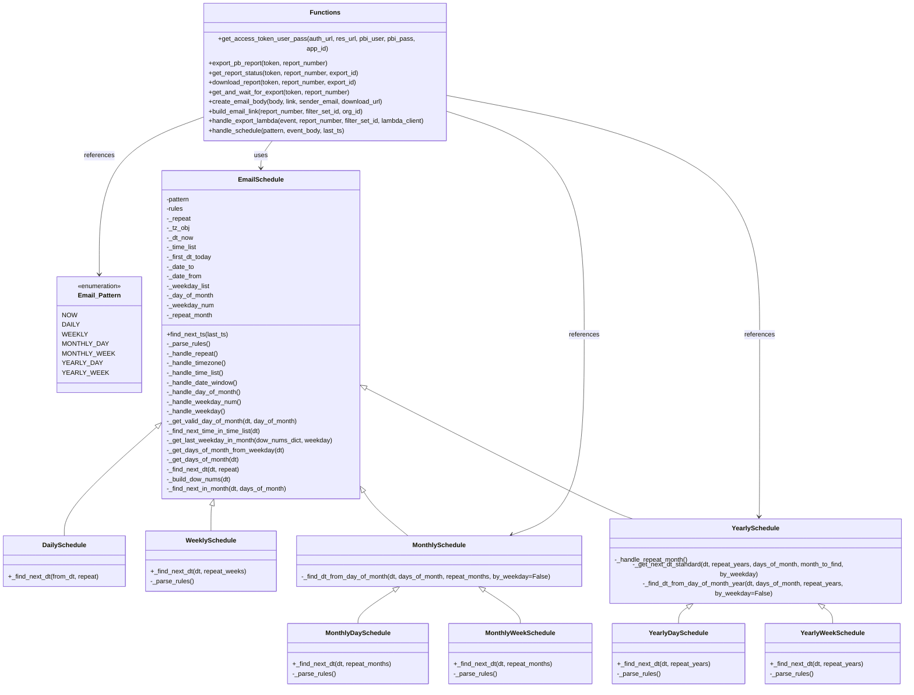

# Diagram: common/fv/python/fv/utilities/pbi.py

> Auto-generated by Obscura crawlers

## Mermaid

### SVG

<svg id="container" width="2245.421875" xmlns="http://www.w3.org/2000/svg" class="classDiagram" height="1648" viewBox="0 0 2245.421875 1648" role="graphics-document document" aria-roledescription="class"><g><defs><marker id="container_class-aggregationStart" class="marker aggregation class" refX="18" refY="7" markerWidth="190" markerHeight="240" orient="auto"><path d="M 18,7 L9,13 L1,7 L9,1 Z"></path></marker></defs><defs><marker id="container_class-aggregationEnd" class="marker aggregation class" refX="1" refY="7" markerWidth="20" markerHeight="28" orient="auto"><path d="M 18,7 L9,13 L1,7 L9,1 Z"></path></marker></defs><defs><marker id="container_class-extensionStart" class="marker extension class" refX="18" refY="7" markerWidth="190" markerHeight="240" orient="auto"><path d="M 1,7 L18,13 V 1 Z"></path></marker></defs><defs><marker id="container_class-extensionEnd" class="marker extension class" refX="1" refY="7" markerWidth="20" markerHeight="28" orient="auto"><path d="M 1,1 V 13 L18,7 Z"></path></marker></defs><defs><marker id="container_class-compositionStart" class="marker composition class" refX="18" refY="7" markerWidth="190" markerHeight="240" orient="auto"><path d="M 18,7 L9,13 L1,7 L9,1 Z"></path></marker></defs><defs><marker id="container_class-compositionEnd" class="marker composition class" refX="1" refY="7" markerWidth="20" markerHeight="28" orient="auto"><path d="M 18,7 L9,13 L1,7 L9,1 Z"></path></marker></defs><defs><marker id="container_class-dependencyStart" class="marker dependency class" refX="6" refY="7" markerWidth="190" markerHeight="240" orient="auto"><path d="M 5,7 L9,13 L1,7 L9,1 Z"></path></marker></defs><defs><marker id="container_class-dependencyEnd" class="marker dependency class" refX="13" refY="7" markerWidth="20" markerHeight="28" orient="auto"><path d="M 18,7 L9,13 L14,7 L9,1 Z"></path></marker></defs><defs><marker id="container_class-lollipopStart" class="marker lollipop class" refX="13" refY="7" markerWidth="190" markerHeight="240" orient="auto"><circle stroke="black" fill="transparent" cx="7" cy="7" r="6"></circle></marker></defs><defs><marker id="container_class-lollipopEnd" class="marker lollipop class" refX="1" refY="7" markerWidth="190" markerHeight="240" orient="auto"><circle stroke="black" fill="transparent" cx="7" cy="7" r="6"></circle></marker></defs><g class="root"><g class="clusters"></g><g class="edgePaths"><path d="M389.451,1037.632L351.269,1071.527C313.087,1105.421,236.723,1173.211,198.541,1215.272C160.359,1257.333,160.359,1273.667,160.359,1281.833L160.359,1290" id="id_EmailSchedule_DailySchedule_1" class="edge-thickness-normal edge-pattern-solid relation" style=";;;" data-edge="true" data-et="edge" data-id="id_EmailSchedule_DailySchedule_1" data-points="W3sieCI6NDAyLjM1MTU2MjUsInkiOjEwMjYuMTgwMDY4NzEyMDF9LHsieCI6MTYwLjM1OTM3NSwieSI6MTI0MX0seyJ4IjoxNjAuMzU5Mzc1LCJ5IjoxMjkwfV0=" marker-start="url(#container_class-extensionStart)"></path><path d="M526.757,1232.586L526.356,1233.988C525.955,1235.39,525.153,1238.195,524.752,1245.764C524.352,1253.333,524.352,1265.667,524.352,1271.833L524.352,1278" id="id_EmailSchedule_WeeklySchedule_2" class="edge-thickness-normal edge-pattern-solid relation" style=";;;" data-edge="true" data-et="edge" data-id="id_EmailSchedule_WeeklySchedule_2" data-points="W3sieCI6NTMxLjQ5ODA2MDQwNzA0MzksInkiOjEyMTZ9LHsieCI6NTI0LjM1MTU2MjUsInkiOjEyNDF9LHsieCI6NTI0LjM1MTU2MjUsInkiOjEyNzh9XQ==" marker-start="url(#container_class-extensionStart)"></path><path d="M903.345,1198.38L907.989,1205.483C912.633,1212.587,921.921,1226.793,938.181,1242.063C954.441,1257.333,977.672,1273.667,989.288,1281.833L1000.904,1290" id="id_EmailSchedule_MonthlySchedule_3" class="edge-thickness-normal edge-pattern-solid relation" style=";;;" data-edge="true" data-et="edge" data-id="id_EmailSchedule_MonthlySchedule_3" data-points="W3sieCI6ODkzLjkwNjI1LCJ5IjoxMTgzLjk0MTY0MzYxMDY3MjF9LHsieCI6OTMxLjIwODk4NDM3NSwieSI6MTI0MX0seyJ4IjoxMDAwLjkwMzkzMDY2NDA2MjUsInkiOjEyOTB9XQ==" marker-start="url(#container_class-extensionStart)"></path><path d="M961.732,1424.361L949.509,1431.134C937.287,1437.907,912.841,1451.454,900.618,1462.393C888.395,1473.333,888.395,1481.667,888.395,1485.833L888.395,1490" id="id_MonthlySchedule_MonthlyDaySchedule_4" class="edge-thickness-normal edge-pattern-solid relation" style=";;;" data-edge="true" data-et="edge" data-id="id_MonthlySchedule_MonthlyDaySchedule_4" data-points="W3sieCI6OTc2LjgyMDgwMDc4MTI1LCJ5IjoxNDE2fSx7IngiOjg4OC4zOTQ1MzEyNSwieSI6MTQ2NX0seyJ4Ijo4ODguMzk0NTMxMjUsInkiOjE0OTB9XQ==" marker-start="url(#container_class-extensionStart)"></path><path d="M1219.291,1424.361L1231.514,1431.134C1243.737,1437.907,1268.183,1451.454,1280.406,1462.393C1292.629,1473.333,1292.629,1481.667,1292.629,1485.833L1292.629,1490" id="id_MonthlySchedule_MonthlyWeekSchedule_5" class="edge-thickness-normal edge-pattern-solid relation" style=";;;" data-edge="true" data-et="edge" data-id="id_MonthlySchedule_MonthlyWeekSchedule_5" data-points="W3sieCI6MTIwNC4yMDI2MzY3MTg3NSwieSI6MTQxNn0seyJ4IjoxMjkyLjYyODkwNjI1LCJ5IjoxNDY1fSx7IngiOjEyOTIuNjI4OTA2MjUsInkiOjE0OTB9XQ==" marker-start="url(#container_class-extensionStart)"></path><path d="M909.279,940.931L1007.53,990.943C1105.78,1040.954,1302.281,1140.977,1414.532,1195.155C1526.783,1249.333,1554.784,1257.667,1568.785,1261.833L1582.786,1266" id="id_EmailSchedule_YearlySchedule_6" class="edge-thickness-normal edge-pattern-solid relation" style=";;;" data-edge="true" data-et="edge" data-id="id_EmailSchedule_YearlySchedule_6" data-points="W3sieCI6ODkzLjkwNjI1LCJ5Ijo5MzMuMTA1ODU2MjU5MjEyOH0seyJ4IjoxNDk4Ljc4MTI1LCJ5IjoxMjQxfSx7IngiOjE1ODIuNzg1Njc5NDA4NDgyLCJ5IjoxMjY2fV0=" marker-start="url(#container_class-extensionStart)"></path><path d="M1712.522,1448.753L1707.924,1451.461C1703.326,1454.169,1694.13,1459.584,1689.532,1466.459C1684.934,1473.333,1684.934,1481.667,1684.934,1485.833L1684.934,1490" id="id_YearlySchedule_YearlyDaySchedule_7" class="edge-thickness-normal edge-pattern-solid relation" style=";;;" data-edge="true" data-et="edge" data-id="id_YearlySchedule_YearlyDaySchedule_7" data-points="W3sieCI6MTcyNy4zODYxNjA3MTQyODU4LCJ5IjoxNDQwfSx7IngiOjE2ODQuOTMzNTkzNzUsInkiOjE0NjV9LHsieCI6MTY4NC45MzM1OTM3NSwieSI6MTQ5MH1d" marker-start="url(#container_class-extensionStart)"></path><path d="M2037.72,1448.753L2042.318,1451.461C2046.916,1454.169,2056.112,1459.584,2060.711,1466.459C2065.309,1473.333,2065.309,1481.667,2065.309,1485.833L2065.309,1490" id="id_YearlySchedule_YearlyWeekSchedule_8" class="edge-thickness-normal edge-pattern-solid relation" style=";;;" data-edge="true" data-et="edge" data-id="id_YearlySchedule_YearlyWeekSchedule_8" data-points="W3sieCI6MjAyMi44NTYwMjY3ODU3MTQyLCJ5IjoxNDQwfSx7IngiOjIwNjUuMzA4NTkzNzUsInkiOjE0NjV9LHsieCI6MjA2NS4zMDg1OTM3NSwieSI6MTQ5MH1d" marker-start="url(#container_class-extensionStart)"></path><path d="M678.201,326L673.189,332.167C668.177,338.333,658.153,350.667,653.141,362C648.129,373.333,648.129,383.667,648.129,388.833L648.129,394" id="id_Functions_EmailSchedule_9" class="edge-thickness-normal edge-pattern-solid relation" style=";;;" data-edge="true" data-et="edge" data-id="id_Functions_EmailSchedule_9" data-points="W3sieCI6Njc4LjIwMTM2MTIwODU0NTksInkiOjMyNn0seyJ4Ijo2NDguMTI4OTA2MjUsInkiOjM2M30seyJ4Ijo2NDguMTI4OTA2MjUsInkiOjQwMH1d" marker-end="url(#container_class-dependencyEnd)"></path><path d="M503.146,275.012L461.834,289.676C420.521,304.341,337.895,333.671,296.582,397.502C255.27,461.333,255.27,559.667,255.27,608.833L255.27,658" id="id_Functions_Email_Pattern_10" class="edge-thickness-normal edge-pattern-solid relation" style=";;;" data-edge="true" data-et="edge" data-id="id_Functions_Email_Pattern_10" data-points="W3sieCI6NTAzLjE0NjQ4NDM3NSwieSI6Mjc1LjAxMTU1OTY3MTMyMDQ3fSx7IngiOjI1NS4yNjk1MzEyNSwieSI6MzYzfSx7IngiOjI1NS4yNjk1MzEyNSwieSI6NjY0fV0=" marker-end="url(#container_class-dependencyEnd)"></path><path d="M1111.717,259.677L1168.256,276.898C1224.796,294.118,1337.874,328.559,1394.414,419.946C1450.953,511.333,1450.953,659.667,1450.953,806C1450.953,952.333,1450.953,1096.667,1425.626,1176.703C1400.299,1256.74,1349.644,1272.48,1324.317,1280.35L1298.99,1288.22" id="id_Functions_MonthlySchedule_11" class="edge-thickness-normal edge-pattern-solid relation" style=";;;" data-edge="true" data-et="edge" data-id="id_Functions_MonthlySchedule_11" data-points="W3sieCI6MTExMS43MTY3OTY4NzUsInkiOjI1OS42NzczODg1MTQ3MzM3fSx7IngiOjE0NTAuOTUzMTI1LCJ5IjozNjN9LHsieCI6MTQ1MC45NTMxMjUsInkiOjgwOH0seyJ4IjoxNDUwLjk1MzEyNSwieSI6MTI0MX0seyJ4IjoxMjkzLjI2MDAwOTc2NTYyNSwieSI6MTI5MH1d" marker-end="url(#container_class-dependencyEnd)"></path><path d="M1111.717,222.341L1240.618,245.784C1369.518,269.227,1627.32,316.114,1756.22,413.723C1885.121,511.333,1885.121,659.667,1885.121,806C1885.121,952.333,1885.121,1096.667,1884.838,1172.004C1884.555,1247.341,1883.989,1253.683,1883.706,1256.853L1883.423,1260.024" id="id_Functions_YearlySchedule_12" class="edge-thickness-normal edge-pattern-solid relation" style=";;;" data-edge="true" data-et="edge" data-id="id_Functions_YearlySchedule_12" data-points="W3sieCI6MTExMS43MTY3OTY4NzUsInkiOjIyMi4zNDA1MTYxODY3OTI4NX0seyJ4IjoxODg1LjEyMTA5Mzc1LCJ5IjozNjN9LHsieCI6MTg4NS4xMjEwOTM3NSwieSI6ODA4fSx7IngiOjE4ODUuMTIxMDkzNzUsInkiOjEyNDF9LHsieCI6MTg4Mi44ODg5NTA4OTI4NTcsInkiOjEyNjZ9XQ==" marker-end="url(#container_class-dependencyEnd)"></path></g><g class="edgeLabels"><g class="edgeLabel"><g class="label" data-id="id_EmailSchedule_DailySchedule_1" transform="translate(0, 0)"><foreignObject width="0" height="0">

</foreignObject></g></g><g class="edgeLabel"><g class="label" data-id="id_EmailSchedule_WeeklySchedule_2" transform="translate(0, 0)"><foreignObject width="0" height="0">

</foreignObject></g></g><g class="edgeLabel"><g class="label" data-id="id_EmailSchedule_MonthlySchedule_3" transform="translate(0, 0)"><foreignObject width="0" height="0">

</foreignObject></g></g><g class="edgeLabel"><g class="label" data-id="id_MonthlySchedule_MonthlyDaySchedule_4" transform="translate(0, 0)"><foreignObject width="0" height="0">

</foreignObject></g></g><g class="edgeLabel"><g class="label" data-id="id_MonthlySchedule_MonthlyWeekSchedule_5" transform="translate(0, 0)"><foreignObject width="0" height="0">

</foreignObject></g></g><g class="edgeLabel"><g class="label" data-id="id_EmailSchedule_YearlySchedule_6" transform="translate(0, 0)"><foreignObject width="0" height="0">

</foreignObject></g></g><g class="edgeLabel"><g class="label" data-id="id_YearlySchedule_YearlyDaySchedule_7" transform="translate(0, 0)"><foreignObject width="0" height="0">

</foreignObject></g></g><g class="edgeLabel"><g class="label" data-id="id_YearlySchedule_YearlyWeekSchedule_8" transform="translate(0, 0)"><foreignObject width="0" height="0">

</foreignObject></g></g><g class="edgeLabel" transform="translate(648.12890625, 363)"><g class="label" data-id="id_Functions_EmailSchedule_9" transform="translate(-16.4921875, -12)"><foreignObject width="32.984375" height="24">

uses

</foreignObject></g></g><g class="edgeLabel" transform="translate(255.26953125, 363)"><g class="label" data-id="id_Functions_Email_Pattern_10" transform="translate(-37.828125, -12)"><foreignObject width="75.65625" height="24">

references

</foreignObject></g></g><g class="edgeLabel" transform="translate(1450.953125, 808)"><g class="label" data-id="id_Functions_MonthlySchedule_11" transform="translate(-37.828125, -12)"><foreignObject width="75.65625" height="24">

references

</foreignObject></g></g><g class="edgeLabel" transform="translate(1885.12109375, 808)"><g class="label" data-id="id_Functions_YearlySchedule_12" transform="translate(-37.828125, -12)"><foreignObject width="75.65625" height="24">

references

</foreignObject></g></g></g><g class="nodes"><g class="node default" id="classId-Email_Pattern-0" transform="translate(255.26953125, 808)"><g class="basic label-container"><path d="M-97.08203125 -144 L97.08203125 -144 L97.08203125 144 L-97.08203125 144" stroke="none" stroke-width="0" fill="#ECECFF" style=""></path><path d="M-97.08203125 -144 C-50.60909956784552 -144, -4.136167885691037 -144, 97.08203125 -144 M-97.08203125 -144 C-54.46750682837607 -144, -11.852982406752133 -144, 97.08203125 -144 M97.08203125 -144 C97.08203125 -73.58644237120173, 97.08203125 -3.172884742403454, 97.08203125 144 M97.08203125 -144 C97.08203125 -68.1333964051695, 97.08203125 7.7332071896609875, 97.08203125 144 M97.08203125 144 C20.09703172443946 144, -56.88796780112108 144, -97.08203125 144 M97.08203125 144 C39.66941756024282 144, -17.74319612951436 144, -97.08203125 144 M-97.08203125 144 C-97.08203125 30.603614893862726, -97.08203125 -82.79277021227455, -97.08203125 -144 M-97.08203125 144 C-97.08203125 38.16828563906533, -97.08203125 -67.66342872186934, -97.08203125 -144" stroke="#9370DB" stroke-width="1.3" fill="none" stroke-dasharray="0 0" style=""></path></g><g class="annotation-group text" transform="translate(-55.5546875, -120)"><g class="label" style="" transform="translate(0,-12)"><foreignObject width="111.109375" height="24">

«enumeration»

</foreignObject></g></g><g class="label-group text" transform="translate(-51.109375, -96)"><g class="label" style="font-weight: bolder" transform="translate(0,-12)"><foreignObject width="102.21875" height="24">

Email_Pattern

</foreignObject></g></g><g class="members-group text" transform="translate(-85.08203125, -48)"><g class="label" style="" transform="translate(0,-12)"><foreignObject width="35.21875" height="24">

NOW

</foreignObject></g><g class="label" style="" transform="translate(0,12)"><foreignObject width="39.375" height="24">

DAILY

</foreignObject></g><g class="label" style="" transform="translate(0,36)"><foreignObject width="55.09375" height="24">

WEEKLY

</foreignObject></g><g class="label" style="" transform="translate(0,60)"><foreignObject width="103.140625" height="24">

MONTHLY_DAY

</foreignObject></g><g class="label" style="" transform="translate(0,84)"><foreignObject width="114.609375" height="24">

MONTHLY_WEEK

</foreignObject></g><g class="label" style="" transform="translate(0,108)"><foreignObject width="85.90625" height="24">

YEARLY_DAY

</foreignObject></g><g class="label" style="" transform="translate(0,132)"><foreignObject width="97.390625" height="24">

YEARLY_WEEK

</foreignObject></g></g><g class="methods-group text" transform="translate(-85.08203125, 144)"></g><g class="divider" style=""><path d="M-97.08203125 -72 C-35.88950661303691 -72, 25.303018023926185 -72, 97.08203125 -72 M-97.08203125 -72 C-48.522673098364045 -72, 0.03668505327190985 -72, 97.08203125 -72" stroke="#9370DB" stroke-width="1.3" fill="none" stroke-dasharray="0 0" style=""></path></g><g class="divider" style=""><path d="M-97.08203125 120 C-31.659407525137226 120, 33.76321619972555 120, 97.08203125 120 M-97.08203125 120 C-19.64611045668609 120, 57.78981033662782 120, 97.08203125 120" stroke="#9370DB" stroke-width="1.3" fill="none" stroke-dasharray="0 0" style=""></path></g></g><g class="node default" id="classId-Functions-1" transform="translate(807.431640625, 167)"><g class="basic label-container"><path d="M-304.28515625 -159 L304.28515625 -159 L304.28515625 159 L-304.28515625 159" stroke="none" stroke-width="0" fill="#ECECFF" style=""></path><path d="M-304.28515625 -159 C-130.51535994059603 -159, 43.254436368807944 -159, 304.28515625 -159 M-304.28515625 -159 C-110.22400873223768 -159, 83.83713878552464 -159, 304.28515625 -159 M304.28515625 -159 C304.28515625 -52.13902354932769, 304.28515625 54.72195290134462, 304.28515625 159 M304.28515625 -159 C304.28515625 -91.67201268074355, 304.28515625 -24.3440253614871, 304.28515625 159 M304.28515625 159 C102.89414826913972 159, -98.49685971172056 159, -304.28515625 159 M304.28515625 159 C130.6973392639578 159, -42.89047772208443 159, -304.28515625 159 M-304.28515625 159 C-304.28515625 32.36209359532259, -304.28515625 -94.27581280935482, -304.28515625 -159 M-304.28515625 159 C-304.28515625 93.18198464703535, -304.28515625 27.3639692940707, -304.28515625 -159" stroke="#9370DB" stroke-width="1.3" fill="none" stroke-dasharray="0 0" style=""></path></g><g class="annotation-group text" transform="translate(0, -135)"></g><g class="label-group text" transform="translate(-35.1328125, -135)"><g class="label" style="font-weight: bolder" transform="translate(0,-12)"><foreignObject width="70.265625" height="24">

Functions

</foreignObject></g></g><g class="members-group text" transform="translate(-292.28515625, -87)"></g><g class="methods-group text" transform="translate(-292.28515625, -57)"><g class="label" style="" transform="translate(0,-12)"><foreignObject width="543.640625" height="24">

+get_access_token_user_pass(auth_url, res_url, pbi_user, pbi_pass, app_id)

</foreignObject></g><g class="label" style="" transform="translate(0,12)"><foreignObject width="305.484375" height="24">

+export_pb_report(token, report_number)

</foreignObject></g><g class="label" style="" transform="translate(0,36)"><foreignObject width="382.953125" height="24">

+get_report_status(token, report_number, export_id)

</foreignObject></g><g class="label" style="" transform="translate(0,60)"><foreignObject width="379.5" height="24">

+download_report(token, report_number, export_id)

</foreignObject></g><g class="label" style="" transform="translate(0,84)"><foreignObject width="356.859375" height="24">

+get_and_wait_for_export(token, report_number)

</foreignObject></g><g class="label" style="" transform="translate(0,108)"><foreignObject width="439.71875" height="24">

+create_email_body(body, link, sender_email, download_url)

</foreignObject></g><g class="label" style="" transform="translate(0,132)"><foreignObject width="396.140625" height="24">

+build_email_link(report_number, filter_set_id, org_id)

</foreignObject></g><g class="label" style="" transform="translate(0,156)"><foreignObject width="549.4375" height="24">

+handle_export_lambda(event, report_number, filter_set_id, lambda_client)

</foreignObject></g><g class="label" style="" transform="translate(0,180)"><foreignObject width="343.875" height="24">

+handle_schedule(pattern, event_body, last_ts)

</foreignObject></g></g><g class="divider" style=""><path d="M-304.28515625 -111 C-74.14317628905869 -111, 155.99880367188263 -111, 304.28515625 -111 M-304.28515625 -111 C-80.37701057710638 -111, 143.53113509578725 -111, 304.28515625 -111" stroke="#9370DB" stroke-width="1.3" fill="none" stroke-dasharray="0 0" style=""></path></g><g class="divider" style=""><path d="M-304.28515625 -87 C-143.840260698203 -87, 16.604634853594007 -87, 304.28515625 -87 M-304.28515625 -87 C-110.63195088389793 -87, 83.02125448220414 -87, 304.28515625 -87" stroke="#9370DB" stroke-width="1.3" fill="none" stroke-dasharray="0 0" style=""></path></g></g><g class="node default" id="classId-EmailSchedule-2" transform="translate(648.12890625, 808)"><g class="basic label-container"><path d="M-245.77734375 -408 L245.77734375 -408 L245.77734375 408 L-245.77734375 408" stroke="none" stroke-width="0" fill="#ECECFF" style=""></path><path d="M-245.77734375 -408 C-107.03413993025316 -408, 31.709063889493677 -408, 245.77734375 -408 M-245.77734375 -408 C-60.188817229042286 -408, 125.39970929191543 -408, 245.77734375 -408 M245.77734375 -408 C245.77734375 -190.94276959076194, 245.77734375 26.114460818476118, 245.77734375 408 M245.77734375 -408 C245.77734375 -157.9564884833101, 245.77734375 92.08702303337981, 245.77734375 408 M245.77734375 408 C80.11733243333609 408, -85.54267888332782 408, -245.77734375 408 M245.77734375 408 C140.6930844081977 408, 35.60882506639538 408, -245.77734375 408 M-245.77734375 408 C-245.77734375 142.2920845532404, -245.77734375 -123.41583089351923, -245.77734375 -408 M-245.77734375 408 C-245.77734375 205.20459391022862, -245.77734375 2.409187820457248, -245.77734375 -408" stroke="#9370DB" stroke-width="1.3" fill="none" stroke-dasharray="0 0" style=""></path></g><g class="annotation-group text" transform="translate(0, -384)"></g><g class="label-group text" transform="translate(-53.4765625, -384)"><g class="label" style="font-weight: bolder" transform="translate(0,-12)"><foreignObject width="106.953125" height="24">

EmailSchedule

</foreignObject></g></g><g class="members-group text" transform="translate(-233.77734375, -336)"><g class="label" style="" transform="translate(0,-12)"><foreignObject width="60.09375" height="24">

-pattern

</foreignObject></g><g class="label" style="" transform="translate(0,12)"><foreignObject width="42.75" height="24">

-rules

</foreignObject></g><g class="label" style="" transform="translate(0,36)"><foreignObject width="60.453125" height="24">

-_repeat

</foreignObject></g><g class="label" style="" transform="translate(0,60)"><foreignObject width="57.265625" height="24">

-_tz_obj

</foreignObject></g><g class="label" style="" transform="translate(0,84)"><foreignObject width="67.03125" height="24">

-_dt_now

</foreignObject></g><g class="label" style="" transform="translate(0,108)"><foreignObject width="76.1875" height="24">

-_time_list

</foreignObject></g><g class="label" style="" transform="translate(0,132)"><foreignObject width="113.6875" height="24">

-_first_dt_today

</foreignObject></g><g class="label" style="" transform="translate(0,156)"><foreignObject width="68.265625" height="24">

-_date_to

</foreignObject></g><g class="label" style="" transform="translate(0,180)"><foreignObject width="87.5" height="24">

-_date_from

</foreignObject></g><g class="label" style="" transform="translate(0,204)"><foreignObject width="106.171875" height="24">

-_weekday_list

</foreignObject></g><g class="label" style="" transform="translate(0,228)"><foreignObject width="116.734375" height="24">

-_day_of_month

</foreignObject></g><g class="label" style="" transform="translate(0,252)"><foreignObject width="116.28125" height="24">

-_weekday_num

</foreignObject></g><g class="label" style="" transform="translate(0,276)"><foreignObject width="116.359375" height="24">

-_repeat_month

</foreignObject></g></g><g class="methods-group text" transform="translate(-233.77734375, 0)"><g class="label" style="" transform="translate(0,-12)"><foreignObject width="154.96875" height="24">

+find_next_ts(last_ts)

</foreignObject></g><g class="label" style="" transform="translate(0,12)"><foreignObject width="108.328125" height="24">

-_parse_rules()

</foreignObject></g><g class="label" style="" transform="translate(0,36)"><foreignObject width="129.171875" height="24">

-_handle_repeat()

</foreignObject></g><g class="label" style="" transform="translate(0,60)"><foreignObject width="148.828125" height="24">

-_handle_timezone()

</foreignObject></g><g class="label" style="" transform="translate(0,84)"><foreignObject width="144.90625" height="24">

-_handle_time_list()

</foreignObject></g><g class="label" style="" transform="translate(0,108)"><foreignObject width="177.84375" height="24">

-_handle_date_window()

</foreignObject></g><g class="label" style="" transform="translate(0,132)"><foreignObject width="185.453125" height="24">

-_handle_day_of_month()

</foreignObject></g><g class="label" style="" transform="translate(0,156)"><foreignObject width="185" height="24">

-_handle_weekday_num()

</foreignObject></g><g class="label" style="" transform="translate(0,180)"><foreignObject width="144.765625" height="24">

-_handle_weekday()

</foreignObject></g><g class="label" style="" transform="translate(0,204)"><foreignObject width="327.921875" height="24">

-_get_valid_day_of_month(dt, day_of_month)

</foreignObject></g><g class="label" style="" transform="translate(0,228)"><foreignObject width="240.453125" height="24">

-_find_next_time_in_time_list(dt)

</foreignObject></g><g class="label" style="" transform="translate(0,252)"><foreignObject width="414.078125" height="24">

-_get_last_weekday_in_month(dow_nums_dict, weekday)

</foreignObject></g><g class="label" style="" transform="translate(0,276)"><foreignObject width="293.953125" height="24">

-_get_days_of_month_from_weekday(dt)

</foreignObject></g><g class="label" style="" transform="translate(0,300)"><foreignObject width="180.984375" height="24">

-_get_days_of_month(dt)

</foreignObject></g><g class="label" style="" transform="translate(0,324)"><foreignObject width="185.28125" height="24">

-_find_next_dt(dt, repeat)

</foreignObject></g><g class="label" style="" transform="translate(0,348)"><foreignObject width="162.96875" height="24">

-_build_dow_nums(dt)

</foreignObject></g><g class="label" style="" transform="translate(0,372)"><foreignObject width="304.171875" height="24">

-_find_next_in_month(dt, days_of_month)

</foreignObject></g></g><g class="divider" style=""><path d="M-245.77734375 -360 C-101.17100768078404 -360, 43.43532838843191 -360, 245.77734375 -360 M-245.77734375 -360 C-70.99936601812092 -360, 103.77861171375815 -360, 245.77734375 -360" stroke="#9370DB" stroke-width="1.3" fill="none" stroke-dasharray="0 0" style=""></path></g><g class="divider" style=""><path d="M-245.77734375 -24 C-82.47383753898305 -24, 80.8296686720339 -24, 245.77734375 -24 M-245.77734375 -24 C-52.13504927871347 -24, 141.50724519257307 -24, 245.77734375 -24" stroke="#9370DB" stroke-width="1.3" fill="none" stroke-dasharray="0 0" style=""></path></g></g><g class="node default" id="classId-DailySchedule-3" transform="translate(160.359375, 1353)"><g class="basic label-container"><path d="M-152.359375 -63 L152.359375 -63 L152.359375 63 L-152.359375 63" stroke="none" stroke-width="0" fill="#ECECFF" style=""></path><path d="M-152.359375 -63 C-68.02764772471788 -63, 16.30407955056424 -63, 152.359375 -63 M-152.359375 -63 C-90.31522154693721 -63, -28.271068093874405 -63, 152.359375 -63 M152.359375 -63 C152.359375 -30.37572383052607, 152.359375 2.24855233894786, 152.359375 63 M152.359375 -63 C152.359375 -15.596797333168674, 152.359375 31.806405333662653, 152.359375 63 M152.359375 63 C45.66580024422605 63, -61.027774511547904 63, -152.359375 63 M152.359375 63 C47.53542185218471 63, -57.28853129563058 63, -152.359375 63 M-152.359375 63 C-152.359375 30.872563213702406, -152.359375 -1.2548735725951872, -152.359375 -63 M-152.359375 63 C-152.359375 22.224988800037124, -152.359375 -18.55002239992575, -152.359375 -63" stroke="#9370DB" stroke-width="1.3" fill="none" stroke-dasharray="0 0" style=""></path></g><g class="annotation-group text" transform="translate(0, -39)"></g><g class="label-group text" transform="translate(-51.78125, -39)"><g class="label" style="font-weight: bolder" transform="translate(0,-12)"><foreignObject width="103.5625" height="24">

DailySchedule

</foreignObject></g></g><g class="members-group text" transform="translate(-140.359375, 9)"></g><g class="methods-group text" transform="translate(-140.359375, 39)"><g class="label" style="" transform="translate(0,-12)"><foreignObject width="228.9375" height="24">

+_find_next_dt(from_dt, repeat)

</foreignObject></g></g><g class="divider" style=""><path d="M-152.359375 -15 C-72.34651487559795 -15, 7.666345248804106 -15, 152.359375 -15 M-152.359375 -15 C-45.94555009083271 -15, 60.46827481833458 -15, 152.359375 -15" stroke="#9370DB" stroke-width="1.3" fill="none" stroke-dasharray="0 0" style=""></path></g><g class="divider" style=""><path d="M-152.359375 9 C-50.64434999288808 9, 51.07067501422384 9, 152.359375 9 M-152.359375 9 C-82.34284303705554 9, -12.32631107411109 9, 152.359375 9" stroke="#9370DB" stroke-width="1.3" fill="none" stroke-dasharray="0 0" style=""></path></g></g><g class="node default" id="classId-WeeklySchedule-4" transform="translate(524.3515625, 1353)"><g class="basic label-container"><path d="M-161.6328125 -75 L161.6328125 -75 L161.6328125 75 L-161.6328125 75" stroke="none" stroke-width="0" fill="#ECECFF" style=""></path><path d="M-161.6328125 -75 C-61.353109026315835 -75, 38.92659444736833 -75, 161.6328125 -75 M-161.6328125 -75 C-71.8076201700733 -75, 18.017572159853387 -75, 161.6328125 -75 M161.6328125 -75 C161.6328125 -18.144190293839927, 161.6328125 38.71161941232015, 161.6328125 75 M161.6328125 -75 C161.6328125 -15.588927715675155, 161.6328125 43.82214456864969, 161.6328125 75 M161.6328125 75 C52.384720278746784 75, -56.86337194250643 75, -161.6328125 75 M161.6328125 75 C41.52428142204987 75, -78.58424965590027 75, -161.6328125 75 M-161.6328125 75 C-161.6328125 23.156843256942814, -161.6328125 -28.686313486114372, -161.6328125 -75 M-161.6328125 75 C-161.6328125 15.144006717224876, -161.6328125 -44.71198656555025, -161.6328125 -75" stroke="#9370DB" stroke-width="1.3" fill="none" stroke-dasharray="0 0" style=""></path></g><g class="annotation-group text" transform="translate(0, -51)"></g><g class="label-group text" transform="translate(-59.953125, -51)"><g class="label" style="font-weight: bolder" transform="translate(0,-12)"><foreignObject width="119.90625" height="24">

WeeklySchedule

</foreignObject></g></g><g class="members-group text" transform="translate(-149.6328125, -3)"></g><g class="methods-group text" transform="translate(-149.6328125, 27)"><g class="label" style="" transform="translate(0,-12)"><foreignObject width="239.3125" height="24">

+_find_next_dt(dt, repeat_weeks)

</foreignObject></g><g class="label" style="" transform="translate(0,12)"><foreignObject width="108.328125" height="24">

-_parse_rules()

</foreignObject></g></g><g class="divider" style=""><path d="M-161.6328125 -27 C-32.955354015479514 -27, 95.72210446904097 -27, 161.6328125 -27 M-161.6328125 -27 C-54.021603886424 -27, 53.58960472715199 -27, 161.6328125 -27" stroke="#9370DB" stroke-width="1.3" fill="none" stroke-dasharray="0 0" style=""></path></g><g class="divider" style=""><path d="M-161.6328125 -3 C-80.53979398103662 -3, 0.5532245379267522 -3, 161.6328125 -3 M-161.6328125 -3 C-67.00371406356581 -3, 27.625384372868382 -3, 161.6328125 -3" stroke="#9370DB" stroke-width="1.3" fill="none" stroke-dasharray="0 0" style=""></path></g></g><g class="node default" id="classId-MonthlySchedule-5" transform="translate(1090.51171875, 1353)"><g class="basic label-container"><path d="M-354.52734375 -63 L354.52734375 -63 L354.52734375 63 L-354.52734375 63" stroke="none" stroke-width="0" fill="#ECECFF" style=""></path><path d="M-354.52734375 -63 C-76.53283470354347 -63, 201.46167434291306 -63, 354.52734375 -63 M-354.52734375 -63 C-181.60390730290626 -63, -8.68047085581253 -63, 354.52734375 -63 M354.52734375 -63 C354.52734375 -15.724453851517374, 354.52734375 31.55109229696525, 354.52734375 63 M354.52734375 -63 C354.52734375 -31.93343516431434, 354.52734375 -0.8668703286286785, 354.52734375 63 M354.52734375 63 C90.68242577974951 63, -173.16249219050098 63, -354.52734375 63 M354.52734375 63 C129.8727036723731 63, -94.78193640525382 63, -354.52734375 63 M-354.52734375 63 C-354.52734375 27.210852478807283, -354.52734375 -8.578295042385434, -354.52734375 -63 M-354.52734375 63 C-354.52734375 14.38223919927843, -354.52734375 -34.23552160144314, -354.52734375 -63" stroke="#9370DB" stroke-width="1.3" fill="none" stroke-dasharray="0 0" style=""></path></g><g class="annotation-group text" transform="translate(0, -39)"></g><g class="label-group text" transform="translate(-63.2890625, -39)"><g class="label" style="font-weight: bolder" transform="translate(0,-12)"><foreignObject width="126.578125" height="24">

MonthlySchedule

</foreignObject></g></g><g class="members-group text" transform="translate(-342.52734375, 9)"></g><g class="methods-group text" transform="translate(-342.52734375, 39)"><g class="label" style="" transform="translate(0,-12)"><foreignObject width="621.765625" height="24">

-_find_dt_from_day_of_month(dt, days_of_month, repeat_months, by_weekday=False)

</foreignObject></g></g><g class="divider" style=""><path d="M-354.52734375 -15 C-209.31601408113946 -15, -64.10468441227891 -15, 354.52734375 -15 M-354.52734375 -15 C-147.55477332003437 -15, 59.41779710993126 -15, 354.52734375 -15" stroke="#9370DB" stroke-width="1.3" fill="none" stroke-dasharray="0 0" style=""></path></g><g class="divider" style=""><path d="M-354.52734375 9 C-121.57880358731947 9, 111.36973657536106 9, 354.52734375 9 M-354.52734375 9 C-158.18238281838606 9, 38.16257811322788 9, 354.52734375 9" stroke="#9370DB" stroke-width="1.3" fill="none" stroke-dasharray="0 0" style=""></path></g></g><g class="node default" id="classId-MonthlyDaySchedule-6" transform="translate(888.39453125, 1565)"><g class="basic label-container"><path d="M-175.515625 -75 L175.515625 -75 L175.515625 75 L-175.515625 75" stroke="none" stroke-width="0" fill="#ECECFF" style=""></path><path d="M-175.515625 -75 C-86.60638242031976 -75, 2.3028601593604776 -75, 175.515625 -75 M-175.515625 -75 C-49.1635010949921 -75, 77.1886228100158 -75, 175.515625 -75 M175.515625 -75 C175.515625 -24.20010914098588, 175.515625 26.59978171802824, 175.515625 75 M175.515625 -75 C175.515625 -15.161076226208777, 175.515625 44.677847547582445, 175.515625 75 M175.515625 75 C36.34354849385275 75, -102.8285280122945 75, -175.515625 75 M175.515625 75 C42.06265620640204 75, -91.39031258719592 75, -175.515625 75 M-175.515625 75 C-175.515625 19.35192172557629, -175.515625 -36.29615654884742, -175.515625 -75 M-175.515625 75 C-175.515625 16.53902403649773, -175.515625 -41.92195192700454, -175.515625 -75" stroke="#9370DB" stroke-width="1.3" fill="none" stroke-dasharray="0 0" style=""></path></g><g class="annotation-group text" transform="translate(0, -51)"></g><g class="label-group text" transform="translate(-76.828125, -51)"><g class="label" style="font-weight: bolder" transform="translate(0,-12)"><foreignObject width="153.65625" height="24">

MonthlyDaySchedule

</foreignObject></g></g><g class="members-group text" transform="translate(-163.515625, -3)"></g><g class="methods-group text" transform="translate(-163.515625, 27)"><g class="label" style="" transform="translate(0,-12)"><foreignObject width="250.203125" height="24">

+_find_next_dt(dt, repeat_months)

</foreignObject></g><g class="label" style="" transform="translate(0,12)"><foreignObject width="108.328125" height="24">

-_parse_rules()

</foreignObject></g></g><g class="divider" style=""><path d="M-175.515625 -27 C-35.46867123119097 -27, 104.57828253761807 -27, 175.515625 -27 M-175.515625 -27 C-92.67878032117193 -27, -9.841935642343856 -27, 175.515625 -27" stroke="#9370DB" stroke-width="1.3" fill="none" stroke-dasharray="0 0" style=""></path></g><g class="divider" style=""><path d="M-175.515625 -3 C-70.43433118161774 -3, 34.64696263676453 -3, 175.515625 -3 M-175.515625 -3 C-92.58203979225125 -3, -9.648454584502502 -3, 175.515625 -3" stroke="#9370DB" stroke-width="1.3" fill="none" stroke-dasharray="0 0" style=""></path></g></g><g class="node default" id="classId-MonthlyWeekSchedule-7" transform="translate(1292.62890625, 1565)"><g class="basic label-container"><path d="M-178.71875 -75 L178.71875 -75 L178.71875 75 L-178.71875 75" stroke="none" stroke-width="0" fill="#ECECFF" style=""></path><path d="M-178.71875 -75 C-40.07525069224317 -75, 98.56824861551365 -75, 178.71875 -75 M-178.71875 -75 C-66.8418985387614 -75, 45.0349529224772 -75, 178.71875 -75 M178.71875 -75 C178.71875 -29.62688791991122, 178.71875 15.746224160177562, 178.71875 75 M178.71875 -75 C178.71875 -16.544164085050816, 178.71875 41.91167182989837, 178.71875 75 M178.71875 75 C61.484776180801205 75, -55.74919763839759 75, -178.71875 75 M178.71875 75 C67.55219152861865 75, -43.6143669427627 75, -178.71875 75 M-178.71875 75 C-178.71875 22.566553306837257, -178.71875 -29.866893386325486, -178.71875 -75 M-178.71875 75 C-178.71875 24.76648540108954, -178.71875 -25.46702919782092, -178.71875 -75" stroke="#9370DB" stroke-width="1.3" fill="none" stroke-dasharray="0 0" style=""></path></g><g class="annotation-group text" transform="translate(0, -51)"></g><g class="label-group text" transform="translate(-83.234375, -51)"><g class="label" style="font-weight: bolder" transform="translate(0,-12)"><foreignObject width="166.46875" height="24">

MonthlyWeekSchedule

</foreignObject></g></g><g class="members-group text" transform="translate(-166.71875, -3)"></g><g class="methods-group text" transform="translate(-166.71875, 27)"><g class="label" style="" transform="translate(0,-12)"><foreignObject width="250.203125" height="24">

+_find_next_dt(dt, repeat_months)

</foreignObject></g><g class="label" style="" transform="translate(0,12)"><foreignObject width="108.328125" height="24">

-_parse_rules()

</foreignObject></g></g><g class="divider" style=""><path d="M-178.71875 -27 C-57.76299787534151 -27, 63.19275424931698 -27, 178.71875 -27 M-178.71875 -27 C-68.8051138690392 -27, 41.10852226192159 -27, 178.71875 -27" stroke="#9370DB" stroke-width="1.3" fill="none" stroke-dasharray="0 0" style=""></path></g><g class="divider" style=""><path d="M-178.71875 -3 C-94.70093135940564 -3, -10.683112718811287 -3, 178.71875 -3 M-178.71875 -3 C-56.0774476288381 -3, 66.5638547423238 -3, 178.71875 -3" stroke="#9370DB" stroke-width="1.3" fill="none" stroke-dasharray="0 0" style=""></path></g></g><g class="node default" id="classId-YearlySchedule-8" transform="translate(1875.12109375, 1353)"><g class="basic label-container"><path d="M-362.30078125 -87 L362.30078125 -87 L362.30078125 87 L-362.30078125 87" stroke="none" stroke-width="0" fill="#ECECFF" style=""></path><path d="M-362.30078125 -87 C-175.1977737119023 -87, 11.9052338261954 -87, 362.30078125 -87 M-362.30078125 -87 C-175.5904018944307 -87, 11.119977461138603 -87, 362.30078125 -87 M362.30078125 -87 C362.30078125 -19.91372121894534, 362.30078125 47.17255756210932, 362.30078125 87 M362.30078125 -87 C362.30078125 -39.06267178009905, 362.30078125 8.874656439801896, 362.30078125 87 M362.30078125 87 C138.86299649742207 87, -84.57478825515585 87, -362.30078125 87 M362.30078125 87 C175.3752172893019 87, -11.550346671396198 87, -362.30078125 87 M-362.30078125 87 C-362.30078125 21.044976174451875, -362.30078125 -44.91004765109625, -362.30078125 -87 M-362.30078125 87 C-362.30078125 31.822586482412696, -362.30078125 -23.35482703517461, -362.30078125 -87" stroke="#9370DB" stroke-width="1.3" fill="none" stroke-dasharray="0 0" style=""></path></g><g class="annotation-group text" transform="translate(0, -63)"></g><g class="label-group text" transform="translate(-56.1640625, -63)"><g class="label" style="font-weight: bolder" transform="translate(0,-12)"><foreignObject width="112.328125" height="24">

YearlySchedule

</foreignObject></g></g><g class="members-group text" transform="translate(-350.30078125, -15)"></g><g class="methods-group text" transform="translate(-350.30078125, 15)"><g class="label" style="" transform="translate(0,-12)"><foreignObject width="185.078125" height="24">

-_handle_repeat_month()

</foreignObject></g><g class="label" style="" transform="translate(0,12)"><foreignObject width="629.171875" height="24">

-_get_next_dt_standard(dt, repeat_years, days_of_month, month_to_find, by_weekday)

</foreignObject></g><g class="label" style="" transform="translate(0,36)"><foreignObject width="644.4375" height="24">

-_find_dt_from_day_of_month_year(dt, days_of_month, repeat_years, by_weekday=False)

</foreignObject></g></g><g class="divider" style=""><path d="M-362.30078125 -39 C-142.69035901835258 -39, 76.92006321329484 -39, 362.30078125 -39 M-362.30078125 -39 C-120.91123823264826 -39, 120.47830478470348 -39, 362.30078125 -39" stroke="#9370DB" stroke-width="1.3" fill="none" stroke-dasharray="0 0" style=""></path></g><g class="divider" style=""><path d="M-362.30078125 -15 C-212.01305291293335 -15, -61.72532457586669 -15, 362.30078125 -15 M-362.30078125 -15 C-212.1192214630187 -15, -61.93766167603741 -15, 362.30078125 -15" stroke="#9370DB" stroke-width="1.3" fill="none" stroke-dasharray="0 0" style=""></path></g></g><g class="node default" id="classId-YearlyDaySchedule-9" transform="translate(1684.93359375, 1565)"><g class="basic label-container"><path d="M-163.5859375 -75 L163.5859375 -75 L163.5859375 75 L-163.5859375 75" stroke="none" stroke-width="0" fill="#ECECFF" style=""></path><path d="M-163.5859375 -75 C-88.3375848812943 -75, -13.08923226258861 -75, 163.5859375 -75 M-163.5859375 -75 C-54.58448555051146 -75, 54.41696639897708 -75, 163.5859375 -75 M163.5859375 -75 C163.5859375 -19.266320121821025, 163.5859375 36.46735975635795, 163.5859375 75 M163.5859375 -75 C163.5859375 -29.522344571252525, 163.5859375 15.95531085749495, 163.5859375 75 M163.5859375 75 C66.34254840407242 75, -30.900840691855166 75, -163.5859375 75 M163.5859375 75 C56.22296280729877 75, -51.14001188540246 75, -163.5859375 75 M-163.5859375 75 C-163.5859375 33.89017795026901, -163.5859375 -7.2196440994619735, -163.5859375 -75 M-163.5859375 75 C-163.5859375 44.3441169897708, -163.5859375 13.6882339795416, -163.5859375 -75" stroke="#9370DB" stroke-width="1.3" fill="none" stroke-dasharray="0 0" style=""></path></g><g class="annotation-group text" transform="translate(0, -51)"></g><g class="label-group text" transform="translate(-69.703125, -51)"><g class="label" style="font-weight: bolder" transform="translate(0,-12)"><foreignObject width="139.40625" height="24">

YearlyDaySchedule

</foreignObject></g></g><g class="members-group text" transform="translate(-151.5859375, -3)"></g><g class="methods-group text" transform="translate(-151.5859375, 27)"><g class="label" style="" transform="translate(0,-12)"><foreignObject width="233.46875" height="24">

+_find_next_dt(dt, repeat_years)

</foreignObject></g><g class="label" style="" transform="translate(0,12)"><foreignObject width="108.328125" height="24">

-_parse_rules()

</foreignObject></g></g><g class="divider" style=""><path d="M-163.5859375 -27 C-67.49456797068697 -27, 28.596801558626055 -27, 163.5859375 -27 M-163.5859375 -27 C-96.15955608376473 -27, -28.733174667529454 -27, 163.5859375 -27" stroke="#9370DB" stroke-width="1.3" fill="none" stroke-dasharray="0 0" style=""></path></g><g class="divider" style=""><path d="M-163.5859375 -3 C-96.71669888568348 -3, -29.84746027136697 -3, 163.5859375 -3 M-163.5859375 -3 C-33.6927154103343 -3, 96.2005066793314 -3, 163.5859375 -3" stroke="#9370DB" stroke-width="1.3" fill="none" stroke-dasharray="0 0" style=""></path></g></g><g class="node default" id="classId-YearlyWeekSchedule-10" transform="translate(2065.30859375, 1565)"><g class="basic label-container"><path d="M-166.7890625 -75 L166.7890625 -75 L166.7890625 75 L-166.7890625 75" stroke="none" stroke-width="0" fill="#ECECFF" style=""></path><path d="M-166.7890625 -75 C-92.16558631012175 -75, -17.542110120243507 -75, 166.7890625 -75 M-166.7890625 -75 C-71.98036137599784 -75, 22.82833974800431 -75, 166.7890625 -75 M166.7890625 -75 C166.7890625 -40.48369644575222, 166.7890625 -5.967392891504446, 166.7890625 75 M166.7890625 -75 C166.7890625 -29.428877103254912, 166.7890625 16.142245793490176, 166.7890625 75 M166.7890625 75 C78.17658876817204 75, -10.435884963655923 75, -166.7890625 75 M166.7890625 75 C55.38857101758022 75, -56.01192046483956 75, -166.7890625 75 M-166.7890625 75 C-166.7890625 31.64343416741142, -166.7890625 -11.713131665177158, -166.7890625 -75 M-166.7890625 75 C-166.7890625 17.60163062546699, -166.7890625 -39.79673874906602, -166.7890625 -75" stroke="#9370DB" stroke-width="1.3" fill="none" stroke-dasharray="0 0" style=""></path></g><g class="annotation-group text" transform="translate(0, -51)"></g><g class="label-group text" transform="translate(-76.109375, -51)"><g class="label" style="font-weight: bolder" transform="translate(0,-12)"><foreignObject width="152.21875" height="24">

YearlyWeekSchedule

</foreignObject></g></g><g class="members-group text" transform="translate(-154.7890625, -3)"></g><g class="methods-group text" transform="translate(-154.7890625, 27)"><g class="label" style="" transform="translate(0,-12)"><foreignObject width="233.46875" height="24">

+_find_next_dt(dt, repeat_years)

</foreignObject></g><g class="label" style="" transform="translate(0,12)"><foreignObject width="108.328125" height="24">

-_parse_rules()

</foreignObject></g></g><g class="divider" style=""><path d="M-166.7890625 -27 C-89.0092291312476 -27, -11.229395762495187 -27, 166.7890625 -27 M-166.7890625 -27 C-56.77308159364192 -27, 53.24289931271616 -27, 166.7890625 -27" stroke="#9370DB" stroke-width="1.3" fill="none" stroke-dasharray="0 0" style=""></path></g><g class="divider" style=""><path d="M-166.7890625 -3 C-73.07358646903067 -3, 20.641889561938655 -3, 166.7890625 -3 M-166.7890625 -3 C-45.07821987587316 -3, 76.63262274825368 -3, 166.7890625 -3" stroke="#9370DB" stroke-width="1.3" fill="none" stroke-dasharray="0 0" style=""></path></g></g></g></g></g></svg>
