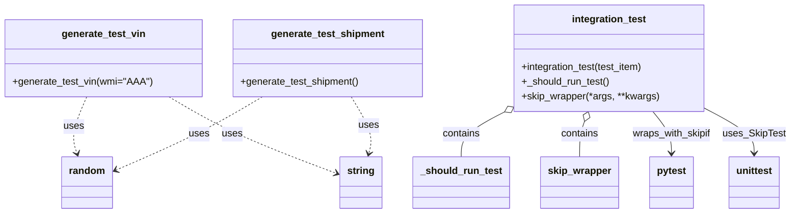

# Diagram: common/fv/python/fv/utilities/testing.py

> Auto-generated by Obscura crawlers

## Mermaid

### SVG

<svg id="container" width="1264.78125" xmlns="http://www.w3.org/2000/svg" class="classDiagram" height="348" viewBox="0 0 1264.78125 348" role="graphics-document document" aria-roledescription="class"><g><defs><marker id="container_class-aggregationStart" class="marker aggregation class" refX="18" refY="7" markerWidth="190" markerHeight="240" orient="auto"><path d="M 18,7 L9,13 L1,7 L9,1 Z"></path></marker></defs><defs><marker id="container_class-aggregationEnd" class="marker aggregation class" refX="1" refY="7" markerWidth="20" markerHeight="28" orient="auto"><path d="M 18,7 L9,13 L1,7 L9,1 Z"></path></marker></defs><defs><marker id="container_class-extensionStart" class="marker extension class" refX="18" refY="7" markerWidth="190" markerHeight="240" orient="auto"><path d="M 1,7 L18,13 V 1 Z"></path></marker></defs><defs><marker id="container_class-extensionEnd" class="marker extension class" refX="1" refY="7" markerWidth="20" markerHeight="28" orient="auto"><path d="M 1,1 V 13 L18,7 Z"></path></marker></defs><defs><marker id="container_class-compositionStart" class="marker composition class" refX="18" refY="7" markerWidth="190" markerHeight="240" orient="auto"><path d="M 18,7 L9,13 L1,7 L9,1 Z"></path></marker></defs><defs><marker id="container_class-compositionEnd" class="marker composition class" refX="1" refY="7" markerWidth="20" markerHeight="28" orient="auto"><path d="M 18,7 L9,13 L1,7 L9,1 Z"></path></marker></defs><defs><marker id="container_class-dependencyStart" class="marker dependency class" refX="6" refY="7" markerWidth="190" markerHeight="240" orient="auto"><path d="M 5,7 L9,13 L1,7 L9,1 Z"></path></marker></defs><defs><marker id="container_class-dependencyEnd" class="marker dependency class" refX="13" refY="7" markerWidth="20" markerHeight="28" orient="auto"><path d="M 18,7 L9,13 L14,7 L9,1 Z"></path></marker></defs><defs><marker id="container_class-lollipopStart" class="marker lollipop class" refX="13" refY="7" markerWidth="190" markerHeight="240" orient="auto"><circle stroke="black" fill="transparent" cx="7" cy="7" r="6"></circle></marker></defs><defs><marker id="container_class-lollipopEnd" class="marker lollipop class" refX="1" refY="7" markerWidth="190" markerHeight="240" orient="auto"><circle stroke="black" fill="transparent" cx="7" cy="7" r="6"></circle></marker></defs><g class="root"><g class="clusters"></g><g class="edgePaths"><path d="M802.291,184.339L791.368,190.116C780.446,195.892,758.602,207.446,747.68,219.39C736.758,231.333,736.758,243.667,736.758,249.833L736.758,256" id="id_integration_test__should_run_test_1" class="edge-thickness-normal edge-pattern-solid relation" style=";;;" data-edge="true" data-et="edge" data-id="id_integration_test__should_run_test_1" data-points="W3sieCI6ODE3LjUzOTA2MjUsInkiOjE3Ni4yNzM0MzkxOTIyMjg4Nn0seyJ4Ijo3MzYuNzU3ODEyNSwieSI6MjE5fSx7IngiOjczNi43NTc4MTI1LCJ5IjoyNTZ9XQ==" marker-start="url(#container_class-aggregationStart)"></path><path d="M932.183,198.134L930.867,201.612C929.552,205.089,926.92,212.045,925.605,221.689C924.289,231.333,924.289,243.667,924.289,249.833L924.289,256" id="id_integration_test_skip_wrapper_2" class="edge-thickness-normal edge-pattern-solid relation" style=";;;" data-edge="true" data-et="edge" data-id="id_integration_test_skip_wrapper_2" data-points="W3sieCI6OTM4LjI4NjQ0NzgzMjY2MTMsInkiOjE4Mn0seyJ4Ijo5MjQuMjg5MDYyNSwieSI6MjE5fSx7IngiOjkyNC4yODkwNjI1LCJ5IjoyNTZ9XQ==" marker-start="url(#container_class-aggregationStart)"></path><path d="M1041.287,182L1046.254,188.167C1051.222,194.333,1061.158,206.667,1066.126,218C1071.094,229.333,1071.094,239.667,1071.094,244.833L1071.094,250" id="id_integration_test_pytest_3" class="edge-thickness-normal edge-pattern-solid relation" style=";;;" data-edge="true" data-et="edge" data-id="id_integration_test_pytest_3" data-points="W3sieCI6MTA0MS4yODY1MTA4MzY2OTM3LCJ5IjoxODJ9LHsieCI6MTA3MS4wOTM3NSwieSI6MjE5fSx7IngiOjEwNzEuMDkzNzUsInkiOjI1Nn1d" marker-end="url(#container_class-dependencyEnd)"></path><path d="M1124.859,176.044L1138.434,183.203C1152.008,190.363,1179.156,204.681,1192.73,217.007C1206.305,229.333,1206.305,239.667,1206.305,244.833L1206.305,250" id="id_integration_test_unittest_4" class="edge-thickness-normal edge-pattern-solid relation" style=";;;" data-edge="true" data-et="edge" data-id="id_integration_test_unittest_4" data-points="W3sieCI6MTEyNC44NTkzNzUsInkiOjE3Ni4wNDM4Nzk5MDc2MjEyNn0seyJ4IjoxMjA2LjMwNDY4NzUsInkiOjIxOX0seyJ4IjoxMjA2LjMwNDY4NzUsInkiOjI1Nn1d" marker-end="url(#container_class-dependencyEnd)"></path><path d="M137.588,158L133.244,168.167C128.9,178.333,120.212,198.667,117.618,214.052C115.023,229.437,118.523,239.874,120.273,245.093L122.024,250.311" id="id_generate_test_vin_random_5" class="edge-thickness-normal edge-pattern-dashed relation" style=";;;" data-edge="true" data-et="edge" data-id="id_generate_test_vin_random_5" data-points="W3sieCI6MTM3LjU4ODMzMTY1MzIyNTgsInkiOjE1OH0seyJ4IjoxMTEuNTIzNDM3NSwieSI6MjE5fSx7IngiOjEyMy45MzExNzA4ODYwNzU5NSwieSI6MjU2fV0=" marker-end="url(#container_class-dependencyEnd)"></path><path d="M269.399,158L286.326,168.167C303.253,178.333,337.107,198.667,381.935,219.51C426.762,240.353,482.564,261.705,510.464,272.381L538.365,283.058" id="id_generate_test_vin_string_6" class="edge-thickness-normal edge-pattern-dashed relation" style=";;;" data-edge="true" data-et="edge" data-id="id_generate_test_vin_string_6" data-points="W3sieCI6MjY5LjM5OTMxOTU1NjQ1MTYsInkiOjE1OH0seyJ4IjozNzAuOTYwOTM3NSwieSI6MjE5fSx7IngiOjU0My45Njg3NSwieSI6Mjg1LjIwMjAzNTg3Mzc2MDd9XQ==" marker-end="url(#container_class-dependencyEnd)"></path><path d="M419.538,158L402.611,168.167C385.684,178.333,351.83,198.667,312.52,218.659C273.209,238.652,228.441,258.305,206.057,268.131L183.674,277.957" id="id_generate_test_shipment_random_7" class="edge-thickness-normal edge-pattern-dashed relation" style=";;;" data-edge="true" data-et="edge" data-id="id_generate_test_shipment_random_7" data-points="W3sieCI6NDE5LjUzODE4MDQ0MzU0ODQsInkiOjE1OH0seyJ4IjozMTcuOTc2NTYyNSwieSI6MjE5fSx7IngiOjE3OC4xNzk2ODc1LCJ5IjoyODAuMzY4NjEyOTgwMjQ3NDZ9XQ==" marker-end="url(#container_class-dependencyEnd)"></path><path d="M561.25,158L567.192,168.167C573.134,178.333,585.018,198.667,589.679,214.029C594.339,229.392,591.775,239.783,590.494,244.979L589.212,250.175" id="id_generate_test_shipment_string_8" class="edge-thickness-normal edge-pattern-dashed relation" style=";;;" data-edge="true" data-et="edge" data-id="id_generate_test_shipment_string_8" data-points="W3sieCI6NTYxLjI1MDQ3MjUzMDI0MiwieSI6MTU4fSx7IngiOjU5Ni45MDIzNDM3NSwieSI6MjE5fSx7IngiOjU4Ny43NzQ5MjA4ODYwNzYsInkiOjI1Nn1d" marker-end="url(#container_class-dependencyEnd)"></path></g><g class="edgeLabels"><g class="edgeLabel" transform="translate(736.7578125, 219)"><g class="label" data-id="id_integration_test__should_run_test_1" transform="translate(-30.890625, -12)"><foreignObject width="61.78125" height="24">

contains

</foreignObject></g></g><g class="edgeLabel" transform="translate(924.2890625, 219)"><g class="label" data-id="id_integration_test_skip_wrapper_2" transform="translate(-30.890625, -12)"><foreignObject width="61.78125" height="24">

contains

</foreignObject></g></g><g class="edgeLabel" transform="translate(1071.09375, 219)"><g class="label" data-id="id_integration_test_pytest_3" transform="translate(-64.734375, -12)"><foreignObject width="129.46875" height="24">

wraps_with_skipif

</foreignObject></g></g><g class="edgeLabel" transform="translate(1206.3046875, 219)"><g class="label" data-id="id_integration_test_unittest_4" transform="translate(-50.4765625, -12)"><foreignObject width="100.953125" height="24">

uses_SkipTest

</foreignObject></g></g><g class="edgeLabel" transform="translate(116.88891, 206.44312)"><g class="label" data-id="id_generate_test_vin_random_5" transform="translate(-16.4921875, -12)"><foreignObject width="32.984375" height="24">

uses

</foreignObject></g></g><g class="edgeLabel" transform="translate(402.14061, 230.93101)"><g class="label" data-id="id_generate_test_vin_string_6" transform="translate(-16.4921875, -12)"><foreignObject width="32.984375" height="24">

uses

</foreignObject></g></g><g class="edgeLabel" transform="translate(317.9765625, 219)"><g class="label" data-id="id_generate_test_shipment_random_7" transform="translate(-16.4921875, -12)"><foreignObject width="32.984375" height="24">

uses

</foreignObject></g></g><g class="edgeLabel" transform="translate(588.69125, 204.9509)"><g class="label" data-id="id_generate_test_shipment_string_8" transform="translate(-16.4921875, -12)"><foreignObject width="32.984375" height="24">

uses

</foreignObject></g></g></g><g class="nodes"><g class="node default" id="classId-generate_test_vin-0" transform="translate(164.5078125, 95)"><g class="basic label-container"><path d="M-156.5078125 -63 L156.5078125 -63 L156.5078125 63 L-156.5078125 63" stroke="none" stroke-width="0" fill="#ECECFF" style=""></path><path d="M-156.5078125 -63 C-48.189961531722304 -63, 60.12788943655539 -63, 156.5078125 -63 M-156.5078125 -63 C-53.93768900096373 -63, 48.63243449807254 -63, 156.5078125 -63 M156.5078125 -63 C156.5078125 -34.16166430855719, 156.5078125 -5.3233286171143845, 156.5078125 63 M156.5078125 -63 C156.5078125 -33.614211926357555, 156.5078125 -4.22842385271511, 156.5078125 63 M156.5078125 63 C88.36773573019381 63, 20.22765896038763 63, -156.5078125 63 M156.5078125 63 C93.13146950428205 63, 29.75512650856409 63, -156.5078125 63 M-156.5078125 63 C-156.5078125 20.649124983983235, -156.5078125 -21.70175003203353, -156.5078125 -63 M-156.5078125 63 C-156.5078125 15.085492310674496, -156.5078125 -32.82901537865101, -156.5078125 -63" stroke="#9370DB" stroke-width="1.3" fill="none" stroke-dasharray="0 0" style=""></path></g><g class="annotation-group text" transform="translate(0, -39)"></g><g class="label-group text" transform="translate(-65.40625, -39)"><g class="label" style="font-weight: bolder" transform="translate(0,-12)"><foreignObject width="130.8125" height="24">

generate_test_vin

</foreignObject></g></g><g class="members-group text" transform="translate(-144.5078125, 9)"></g><g class="methods-group text" transform="translate(-144.5078125, 39)"><g class="label" style="" transform="translate(0,-12)"><foreignObject width="223.609375" height="24">

+generate_test_vin(wmi="AAA")

</foreignObject></g></g><g class="divider" style=""><path d="M-156.5078125 -15 C-59.26015181246093 -15, 37.987508875078134 -15, 156.5078125 -15 M-156.5078125 -15 C-82.46304327731357 -15, -8.418274054627148 -15, 156.5078125 -15" stroke="#9370DB" stroke-width="1.3" fill="none" stroke-dasharray="0 0" style=""></path></g><g class="divider" style=""><path d="M-156.5078125 9 C-83.6142209256821 9, -10.72062935136421 9, 156.5078125 9 M-156.5078125 9 C-83.81722110092741 9, -11.126629701854824 9, 156.5078125 9" stroke="#9370DB" stroke-width="1.3" fill="none" stroke-dasharray="0 0" style=""></path></g></g><g class="node default" id="classId-generate_test_shipment-1" transform="translate(524.4296875, 95)"><g class="basic label-container"><path d="M-153.4140625 -63 L153.4140625 -63 L153.4140625 63 L-153.4140625 63" stroke="none" stroke-width="0" fill="#ECECFF" style=""></path><path d="M-153.4140625 -63 C-91.12475612287443 -63, -28.835449745748846 -63, 153.4140625 -63 M-153.4140625 -63 C-54.10672000723011 -63, 45.20062248553978 -63, 153.4140625 -63 M153.4140625 -63 C153.4140625 -22.199035556502388, 153.4140625 18.601928886995225, 153.4140625 63 M153.4140625 -63 C153.4140625 -19.570217451509038, 153.4140625 23.859565096981925, 153.4140625 63 M153.4140625 63 C64.1427340453544 63, -25.128594409291196 63, -153.4140625 63 M153.4140625 63 C70.73557384369519 63, -11.942914812609615 63, -153.4140625 63 M-153.4140625 63 C-153.4140625 31.841464070234966, -153.4140625 0.682928140469933, -153.4140625 -63 M-153.4140625 63 C-153.4140625 37.10339684509037, -153.4140625 11.206793690180739, -153.4140625 -63" stroke="#9370DB" stroke-width="1.3" fill="none" stroke-dasharray="0 0" style=""></path></g><g class="annotation-group text" transform="translate(0, -39)"></g><g class="label-group text" transform="translate(-89.0625, -39)"><g class="label" style="font-weight: bolder" transform="translate(0,-12)"><foreignObject width="178.125" height="24">

generate_test_shipment

</foreignObject></g></g><g class="members-group text" transform="translate(-141.4140625, 9)"></g><g class="methods-group text" transform="translate(-141.4140625, 39)"><g class="label" style="" transform="translate(0,-12)"><foreignObject width="193.765625" height="24">

+generate_test_shipment()

</foreignObject></g></g><g class="divider" style=""><path d="M-153.4140625 -15 C-48.6752074742699 -15, 56.06364755146021 -15, 153.4140625 -15 M-153.4140625 -15 C-80.07915660945967 -15, -6.744250718919346 -15, 153.4140625 -15" stroke="#9370DB" stroke-width="1.3" fill="none" stroke-dasharray="0 0" style=""></path></g><g class="divider" style=""><path d="M-153.4140625 9 C-83.75566920691242 9, -14.09727591382483 9, 153.4140625 9 M-153.4140625 9 C-81.41283367249936 9, -9.41160484499872 9, 153.4140625 9" stroke="#9370DB" stroke-width="1.3" fill="none" stroke-dasharray="0 0" style=""></path></g></g><g class="node default" id="classId-integration_test-2" transform="translate(971.19921875, 95)"><g class="basic label-container"><path d="M-153.66015625 -87 L153.66015625 -87 L153.66015625 87 L-153.66015625 87" stroke="none" stroke-width="0" fill="#ECECFF" style=""></path><path d="M-153.66015625 -87 C-68.55164447306107 -87, 16.55686730387785 -87, 153.66015625 -87 M-153.66015625 -87 C-48.75743451580381 -87, 56.14528721839238 -87, 153.66015625 -87 M153.66015625 -87 C153.66015625 -26.47439577759721, 153.66015625 34.05120844480558, 153.66015625 87 M153.66015625 -87 C153.66015625 -38.44369062086768, 153.66015625 10.112618758264645, 153.66015625 87 M153.66015625 87 C80.37197125897355 87, 7.08378626794709 87, -153.66015625 87 M153.66015625 87 C85.05600697710612 87, 16.451857704212244 87, -153.66015625 87 M-153.66015625 87 C-153.66015625 29.783622264452227, -153.66015625 -27.432755471095547, -153.66015625 -87 M-153.66015625 87 C-153.66015625 47.73104347641657, -153.66015625 8.462086952833147, -153.66015625 -87" stroke="#9370DB" stroke-width="1.3" fill="none" stroke-dasharray="0 0" style=""></path></g><g class="annotation-group text" transform="translate(0, -63)"></g><g class="label-group text" transform="translate(-58.8984375, -63)"><g class="label" style="font-weight: bolder" transform="translate(0,-12)"><foreignObject width="117.796875" height="24">

integration_test

</foreignObject></g></g><g class="members-group text" transform="translate(-141.66015625, -15)"></g><g class="methods-group text" transform="translate(-141.66015625, 15)"><g class="label" style="" transform="translate(0,-12)"><foreignObject width="201.953125" height="24">

+integration_test(test_item)

</foreignObject></g><g class="label" style="" transform="translate(0,12)"><foreignObject width="143.765625" height="24">

+_should_run_test()

</foreignObject></g><g class="label" style="" transform="translate(0,36)"><foreignObject width="224.421875" height="24">

+skip_wrapper(*args, **kwargs)

</foreignObject></g></g><g class="divider" style=""><path d="M-153.66015625 -39 C-42.4950606122284 -39, 68.6700350255432 -39, 153.66015625 -39 M-153.66015625 -39 C-37.818796905013684 -39, 78.02256243997263 -39, 153.66015625 -39" stroke="#9370DB" stroke-width="1.3" fill="none" stroke-dasharray="0 0" style=""></path></g><g class="divider" style=""><path d="M-153.66015625 -15 C-77.89506706015577 -15, -2.129977870311535 -15, 153.66015625 -15 M-153.66015625 -15 C-68.586064797198 -15, 16.48802665560399 -15, 153.66015625 -15" stroke="#9370DB" stroke-width="1.3" fill="none" stroke-dasharray="0 0" style=""></path></g></g><g class="node default" id="classId-_should_run_test-3" transform="translate(736.7578125, 298)"><g class="basic label-container"><path d="M-75.8984375 -42 L75.8984375 -42 L75.8984375 42 L-75.8984375 42" stroke="none" stroke-width="0" fill="#ECECFF" style=""></path><path d="M-75.8984375 -42 C-27.4180472853893 -42, 21.0623429292214 -42, 75.8984375 -42 M-75.8984375 -42 C-44.77336164754847 -42, -13.648285795096946 -42, 75.8984375 -42 M75.8984375 -42 C75.8984375 -12.501764672784113, 75.8984375 16.996470654431775, 75.8984375 42 M75.8984375 -42 C75.8984375 -11.924947010752767, 75.8984375 18.150105978494466, 75.8984375 42 M75.8984375 42 C35.73817599870795 42, -4.422085502584096 42, -75.8984375 42 M75.8984375 42 C22.636503392147198 42, -30.625430715705605 42, -75.8984375 42 M-75.8984375 42 C-75.8984375 17.479681520747086, -75.8984375 -7.040636958505829, -75.8984375 -42 M-75.8984375 42 C-75.8984375 14.247757949998295, -75.8984375 -13.50448410000341, -75.8984375 -42" stroke="#9370DB" stroke-width="1.3" fill="none" stroke-dasharray="0 0" style=""></path></g><g class="annotation-group text" transform="translate(0, -18)"></g><g class="label-group text" transform="translate(-63.8984375, -18)"><g class="label" style="font-weight: bolder" transform="translate(0,-12)"><foreignObject width="127.796875" height="24">

_should_run_test

</foreignObject></g></g><g class="members-group text" transform="translate(-63.8984375, 30)"></g><g class="methods-group text" transform="translate(-63.8984375, 60)"></g><g class="divider" style=""><path d="M-75.8984375 6 C-35.02804457543329 6, 5.842348349133417 6, 75.8984375 6 M-75.8984375 6 C-16.052862774806997 6, 43.79271195038601 6, 75.8984375 6" stroke="#9370DB" stroke-width="1.3" fill="none" stroke-dasharray="0 0" style=""></path></g><g class="divider" style=""><path d="M-75.8984375 24 C-29.6784729397913 24, 16.541491620417403 24, 75.8984375 24 M-75.8984375 24 C-40.72034916109877 24, -5.542260822197534 24, 75.8984375 24" stroke="#9370DB" stroke-width="1.3" fill="none" stroke-dasharray="0 0" style=""></path></g></g><g class="node default" id="classId-skip_wrapper-4" transform="translate(924.2890625, 298)"><g class="basic label-container"><path d="M-61.6328125 -42 L61.6328125 -42 L61.6328125 42 L-61.6328125 42" stroke="none" stroke-width="0" fill="#ECECFF" style=""></path><path d="M-61.6328125 -42 C-17.8851679138946 -42, 25.862476672210803 -42, 61.6328125 -42 M-61.6328125 -42 C-19.935637582158613 -42, 21.761537335682775 -42, 61.6328125 -42 M61.6328125 -42 C61.6328125 -20.485927598242352, 61.6328125 1.0281448035152962, 61.6328125 42 M61.6328125 -42 C61.6328125 -22.820429350041433, 61.6328125 -3.640858700082866, 61.6328125 42 M61.6328125 42 C27.352821322052904 42, -6.927169855894192 42, -61.6328125 42 M61.6328125 42 C31.554703571047547 42, 1.476594642095094 42, -61.6328125 42 M-61.6328125 42 C-61.6328125 14.739193525949972, -61.6328125 -12.521612948100056, -61.6328125 -42 M-61.6328125 42 C-61.6328125 21.731858343398848, -61.6328125 1.4637166867976958, -61.6328125 -42" stroke="#9370DB" stroke-width="1.3" fill="none" stroke-dasharray="0 0" style=""></path></g><g class="annotation-group text" transform="translate(0, -18)"></g><g class="label-group text" transform="translate(-49.6328125, -18)"><g class="label" style="font-weight: bolder" transform="translate(0,-12)"><foreignObject width="99.265625" height="24">

skip_wrapper

</foreignObject></g></g><g class="members-group text" transform="translate(-49.6328125, 30)"></g><g class="methods-group text" transform="translate(-49.6328125, 60)"></g><g class="divider" style=""><path d="M-61.6328125 6 C-21.941524414621426 6, 17.749763670757147 6, 61.6328125 6 M-61.6328125 6 C-15.101590481861791 6, 31.429631536276418 6, 61.6328125 6" stroke="#9370DB" stroke-width="1.3" fill="none" stroke-dasharray="0 0" style=""></path></g><g class="divider" style=""><path d="M-61.6328125 24 C-33.72867091633513 24, -5.8245293326702665 24, 61.6328125 24 M-61.6328125 24 C-25.11473296716578 24, 11.403346565668443 24, 61.6328125 24" stroke="#9370DB" stroke-width="1.3" fill="none" stroke-dasharray="0 0" style=""></path></g></g><g class="node default" id="classId-pytest-5" transform="translate(1071.09375, 298)"><g class="basic label-container"><path d="M-35.171875 -42 L35.171875 -42 L35.171875 42 L-35.171875 42" stroke="none" stroke-width="0" fill="#ECECFF" style=""></path><path d="M-35.171875 -42 C-15.01195874095151 -42, 5.14795751809698 -42, 35.171875 -42 M-35.171875 -42 C-10.65274087249525 -42, 13.866393255009498 -42, 35.171875 -42 M35.171875 -42 C35.171875 -13.924857384200308, 35.171875 14.150285231599383, 35.171875 42 M35.171875 -42 C35.171875 -9.872729000322934, 35.171875 22.25454199935413, 35.171875 42 M35.171875 42 C19.59074396366204 42, 4.009612927324078 42, -35.171875 42 M35.171875 42 C14.538344890481735 42, -6.09518521903653 42, -35.171875 42 M-35.171875 42 C-35.171875 17.829620347190417, -35.171875 -6.340759305619166, -35.171875 -42 M-35.171875 42 C-35.171875 9.841467561260686, -35.171875 -22.31706487747863, -35.171875 -42" stroke="#9370DB" stroke-width="1.3" fill="none" stroke-dasharray="0 0" style=""></path></g><g class="annotation-group text" transform="translate(0, -18)"></g><g class="label-group text" transform="translate(-23.171875, -18)"><g class="label" style="font-weight: bolder" transform="translate(0,-12)"><foreignObject width="46.34375" height="24">

pytest

</foreignObject></g></g><g class="members-group text" transform="translate(-23.171875, 30)"></g><g class="methods-group text" transform="translate(-23.171875, 60)"></g><g class="divider" style=""><path d="M-35.171875 6 C-12.447376005427557 6, 10.277122989144885 6, 35.171875 6 M-35.171875 6 C-10.941398425950553 6, 13.289078148098895 6, 35.171875 6" stroke="#9370DB" stroke-width="1.3" fill="none" stroke-dasharray="0 0" style=""></path></g><g class="divider" style=""><path d="M-35.171875 24 C-14.390828680693534 24, 6.390217638612931 24, 35.171875 24 M-35.171875 24 C-17.503593689848813 24, 0.16468762030237372 24, 35.171875 24" stroke="#9370DB" stroke-width="1.3" fill="none" stroke-dasharray="0 0" style=""></path></g></g><g class="node default" id="classId-unittest-6" transform="translate(1206.3046875, 298)"><g class="basic label-container"><path d="M-40.8515625 -42 L40.8515625 -42 L40.8515625 42 L-40.8515625 42" stroke="none" stroke-width="0" fill="#ECECFF" style=""></path><path d="M-40.8515625 -42 C-20.59752602533953 -42, -0.3434895506790596 -42, 40.8515625 -42 M-40.8515625 -42 C-22.844679297045516 -42, -4.837796094091033 -42, 40.8515625 -42 M40.8515625 -42 C40.8515625 -23.001137753058167, 40.8515625 -4.002275506116334, 40.8515625 42 M40.8515625 -42 C40.8515625 -23.172353184251573, 40.8515625 -4.344706368503147, 40.8515625 42 M40.8515625 42 C20.55754352301281 42, 0.2635245460256215 42, -40.8515625 42 M40.8515625 42 C14.268959126825763 42, -12.313644246348474 42, -40.8515625 42 M-40.8515625 42 C-40.8515625 14.205566977983441, -40.8515625 -13.588866044033118, -40.8515625 -42 M-40.8515625 42 C-40.8515625 17.799751014271926, -40.8515625 -6.400497971456147, -40.8515625 -42" stroke="#9370DB" stroke-width="1.3" fill="none" stroke-dasharray="0 0" style=""></path></g><g class="annotation-group text" transform="translate(0, -18)"></g><g class="label-group text" transform="translate(-28.8515625, -18)"><g class="label" style="font-weight: bolder" transform="translate(0,-12)"><foreignObject width="57.703125" height="24">

unittest

</foreignObject></g></g><g class="members-group text" transform="translate(-28.8515625, 30)"></g><g class="methods-group text" transform="translate(-28.8515625, 60)"></g><g class="divider" style=""><path d="M-40.8515625 6 C-14.791606053390051 6, 11.268350393219897 6, 40.8515625 6 M-40.8515625 6 C-23.37611419770689 6, -5.9006658954137805 6, 40.8515625 6" stroke="#9370DB" stroke-width="1.3" fill="none" stroke-dasharray="0 0" style=""></path></g><g class="divider" style=""><path d="M-40.8515625 24 C-21.03637226791283 24, -1.221182035825663 24, 40.8515625 24 M-40.8515625 24 C-13.743428135920801 24, 13.364706228158397 24, 40.8515625 24" stroke="#9370DB" stroke-width="1.3" fill="none" stroke-dasharray="0 0" style=""></path></g></g><g class="node default" id="classId-random-7" transform="translate(138.015625, 298)"><g class="basic label-container"><path d="M-40.1640625 -42 L40.1640625 -42 L40.1640625 42 L-40.1640625 42" stroke="none" stroke-width="0" fill="#ECECFF" style=""></path><path d="M-40.1640625 -42 C-14.188204990404376 -42, 11.787652519191248 -42, 40.1640625 -42 M-40.1640625 -42 C-21.493004597869227 -42, -2.821946695738454 -42, 40.1640625 -42 M40.1640625 -42 C40.1640625 -11.80048311631058, 40.1640625 18.39903376737884, 40.1640625 42 M40.1640625 -42 C40.1640625 -16.507639016519104, 40.1640625 8.984721966961793, 40.1640625 42 M40.1640625 42 C9.75072207448818 42, -20.66261835102364 42, -40.1640625 42 M40.1640625 42 C11.681044151999263 42, -16.801974196001474 42, -40.1640625 42 M-40.1640625 42 C-40.1640625 20.155835374262246, -40.1640625 -1.6883292514755084, -40.1640625 -42 M-40.1640625 42 C-40.1640625 9.408331168446182, -40.1640625 -23.183337663107636, -40.1640625 -42" stroke="#9370DB" stroke-width="1.3" fill="none" stroke-dasharray="0 0" style=""></path></g><g class="annotation-group text" transform="translate(0, -18)"></g><g class="label-group text" transform="translate(-28.1640625, -18)"><g class="label" style="font-weight: bolder" transform="translate(0,-12)"><foreignObject width="56.328125" height="24">

random

</foreignObject></g></g><g class="members-group text" transform="translate(-28.1640625, 30)"></g><g class="methods-group text" transform="translate(-28.1640625, 60)"></g><g class="divider" style=""><path d="M-40.1640625 6 C-13.249973897485283 6, 13.664114705029434 6, 40.1640625 6 M-40.1640625 6 C-12.608197272173449 6, 14.947667955653102 6, 40.1640625 6" stroke="#9370DB" stroke-width="1.3" fill="none" stroke-dasharray="0 0" style=""></path></g><g class="divider" style=""><path d="M-40.1640625 24 C-14.913298499422051 24, 10.337465501155897 24, 40.1640625 24 M-40.1640625 24 C-24.04254905090569 24, -7.921035601811383 24, 40.1640625 24" stroke="#9370DB" stroke-width="1.3" fill="none" stroke-dasharray="0 0" style=""></path></g></g><g class="node default" id="classId-string-8" transform="translate(577.4140625, 298)"><g class="basic label-container"><path d="M-33.4453125 -42 L33.4453125 -42 L33.4453125 42 L-33.4453125 42" stroke="none" stroke-width="0" fill="#ECECFF" style=""></path><path d="M-33.4453125 -42 C-13.074965454915368 -42, 7.295381590169264 -42, 33.4453125 -42 M-33.4453125 -42 C-18.399034995059345 -42, -3.3527574901186874 -42, 33.4453125 -42 M33.4453125 -42 C33.4453125 -16.2422211479443, 33.4453125 9.515557704111401, 33.4453125 42 M33.4453125 -42 C33.4453125 -9.709377907013312, 33.4453125 22.581244185973375, 33.4453125 42 M33.4453125 42 C12.013366658721907 42, -9.418579182556186 42, -33.4453125 42 M33.4453125 42 C19.62966747276534 42, 5.814022445530679 42, -33.4453125 42 M-33.4453125 42 C-33.4453125 23.43952282718301, -33.4453125 4.879045654366017, -33.4453125 -42 M-33.4453125 42 C-33.4453125 10.460287345095665, -33.4453125 -21.07942530980867, -33.4453125 -42" stroke="#9370DB" stroke-width="1.3" fill="none" stroke-dasharray="0 0" style=""></path></g><g class="annotation-group text" transform="translate(0, -18)"></g><g class="label-group text" transform="translate(-21.4453125, -18)"><g class="label" style="font-weight: bolder" transform="translate(0,-12)"><foreignObject width="42.890625" height="24">

string

</foreignObject></g></g><g class="members-group text" transform="translate(-21.4453125, 30)"></g><g class="methods-group text" transform="translate(-21.4453125, 60)"></g><g class="divider" style=""><path d="M-33.4453125 6 C-9.898166624372095 6, 13.64897925125581 6, 33.4453125 6 M-33.4453125 6 C-10.389449222927698 6, 12.666414054144603 6, 33.4453125 6" stroke="#9370DB" stroke-width="1.3" fill="none" stroke-dasharray="0 0" style=""></path></g><g class="divider" style=""><path d="M-33.4453125 24 C-11.371555428037151 24, 10.702201643925697 24, 33.4453125 24 M-33.4453125 24 C-9.915276689346172 24, 13.614759121307657 24, 33.4453125 24" stroke="#9370DB" stroke-width="1.3" fill="none" stroke-dasharray="0 0" style=""></path></g></g></g></g></g></svg>
