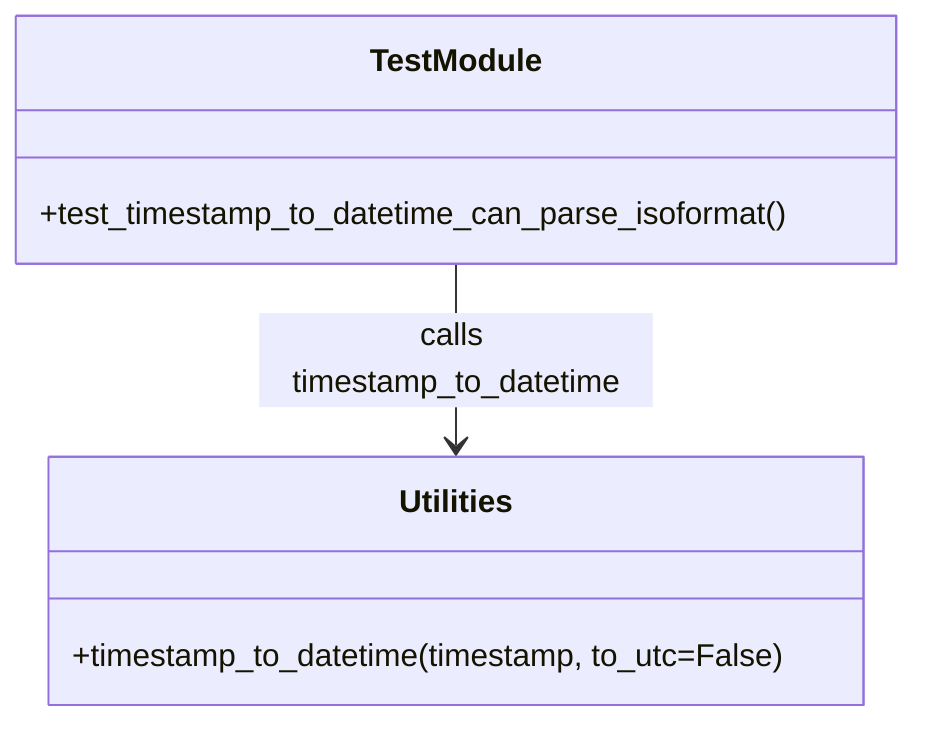

# Diagram: common/fv/python/fv/utilities/tests/test_utilities.py

> Auto-generated by Obscura crawlers

## Mermaid

### SVG

<svg id="container" width="469.375" xmlns="http://www.w3.org/2000/svg" class="classDiagram" height="366" viewBox="0 0 469.375 366" role="graphics-document document" aria-roledescription="class"><g><defs><marker id="container_class-aggregationStart" class="marker aggregation class" refX="18" refY="7" markerWidth="190" markerHeight="240" orient="auto"><path d="M 18,7 L9,13 L1,7 L9,1 Z"></path></marker></defs><defs><marker id="container_class-aggregationEnd" class="marker aggregation class" refX="1" refY="7" markerWidth="20" markerHeight="28" orient="auto"><path d="M 18,7 L9,13 L1,7 L9,1 Z"></path></marker></defs><defs><marker id="container_class-extensionStart" class="marker extension class" refX="18" refY="7" markerWidth="190" markerHeight="240" orient="auto"><path d="M 1,7 L18,13 V 1 Z"></path></marker></defs><defs><marker id="container_class-extensionEnd" class="marker extension class" refX="1" refY="7" markerWidth="20" markerHeight="28" orient="auto"><path d="M 1,1 V 13 L18,7 Z"></path></marker></defs><defs><marker id="container_class-compositionStart" class="marker composition class" refX="18" refY="7" markerWidth="190" markerHeight="240" orient="auto"><path d="M 18,7 L9,13 L1,7 L9,1 Z"></path></marker></defs><defs><marker id="container_class-compositionEnd" class="marker composition class" refX="1" refY="7" markerWidth="20" markerHeight="28" orient="auto"><path d="M 18,7 L9,13 L1,7 L9,1 Z"></path></marker></defs><defs><marker id="container_class-dependencyStart" class="marker dependency class" refX="6" refY="7" markerWidth="190" markerHeight="240" orient="auto"><path d="M 5,7 L9,13 L1,7 L9,1 Z"></path></marker></defs><defs><marker id="container_class-dependencyEnd" class="marker dependency class" refX="13" refY="7" markerWidth="20" markerHeight="28" orient="auto"><path d="M 18,7 L9,13 L14,7 L9,1 Z"></path></marker></defs><defs><marker id="container_class-lollipopStart" class="marker lollipop class" refX="13" refY="7" markerWidth="190" markerHeight="240" orient="auto"><circle stroke="black" fill="transparent" cx="7" cy="7" r="6"></circle></marker></defs><defs><marker id="container_class-lollipopEnd" class="marker lollipop class" refX="1" refY="7" markerWidth="190" markerHeight="240" orient="auto"><circle stroke="black" fill="transparent" cx="7" cy="7" r="6"></circle></marker></defs><g class="root"><g class="clusters"></g><g class="edgePaths"><path d="M234.688,134L234.688,142.167C234.688,150.333,234.688,166.667,234.688,182C234.688,197.333,234.688,211.667,234.688,218.833L234.688,226" id="id_TestModule_Utilities_1" class="edge-thickness-normal edge-pattern-solid relation" style=";;;" data-edge="true" data-et="edge" data-id="id_TestModule_Utilities_1" data-points="W3sieCI6MjM0LjY4NzUsInkiOjEzNH0seyJ4IjoyMzQuNjg3NSwieSI6MTgzfSx7IngiOjIzNC42ODc1LCJ5IjoyMzJ9XQ==" marker-end="url(#container_class-dependencyEnd)"></path></g><g class="edgeLabels"><g class="edgeLabel" transform="translate(234.6875, 183)"><g class="label" data-id="id_TestModule_Utilities_1" transform="translate(-100, -24)"><foreignObject width="200" height="48">

calls timestamp_to_datetime

</foreignObject></g></g></g><g class="nodes"><g class="node default" id="classId-Utilities-0" transform="translate(234.6875, 295)"><g class="basic label-container"><path d="M-209.5546875 -63 L209.5546875 -63 L209.5546875 63 L-209.5546875 63" stroke="none" stroke-width="0" fill="#ECECFF" style=""></path><path d="M-209.5546875 -63 C-114.33423323566609 -63, -19.11377897133218 -63, 209.5546875 -63 M-209.5546875 -63 C-81.95253064181921 -63, 45.64962621636158 -63, 209.5546875 -63 M209.5546875 -63 C209.5546875 -30.85054839907471, 209.5546875 1.2989032018505782, 209.5546875 63 M209.5546875 -63 C209.5546875 -18.982216931644437, 209.5546875 25.035566136711125, 209.5546875 63 M209.5546875 63 C96.47938036316035 63, -16.59592677367931 63, -209.5546875 63 M209.5546875 63 C96.64726283046036 63, -16.260161839079274 63, -209.5546875 63 M-209.5546875 63 C-209.5546875 14.982258902910935, -209.5546875 -33.03548219417813, -209.5546875 -63 M-209.5546875 63 C-209.5546875 14.279113111806886, -209.5546875 -34.44177377638623, -209.5546875 -63" stroke="#9370DB" stroke-width="1.3" fill="none" stroke-dasharray="0 0" style=""></path></g><g class="annotation-group text" transform="translate(0, -39)"></g><g class="label-group text" transform="translate(-28.8125, -39)"><g class="label" style="font-weight: bolder" transform="translate(0,-12)"><foreignObject width="57.625" height="24">

Utilities

</foreignObject></g></g><g class="members-group text" transform="translate(-197.5546875, 9)"></g><g class="methods-group text" transform="translate(-197.5546875, 39)"><g class="label" style="" transform="translate(0,-12)"><foreignObject width="366.296875" height="24">

+timestamp_to_datetime(timestamp, to_utc=False)

</foreignObject></g></g><g class="divider" style=""><path d="M-209.5546875 -15 C-73.41747500978752 -15, 62.71973748042495 -15, 209.5546875 -15 M-209.5546875 -15 C-111.28320905559352 -15, -13.011730611187033 -15, 209.5546875 -15" stroke="#9370DB" stroke-width="1.3" fill="none" stroke-dasharray="0 0" style=""></path></g><g class="divider" style=""><path d="M-209.5546875 9 C-75.35713384202191 9, 58.84041981595618 9, 209.5546875 9 M-209.5546875 9 C-73.7482711845334 9, 62.05814513093321 9, 209.5546875 9" stroke="#9370DB" stroke-width="1.3" fill="none" stroke-dasharray="0 0" style=""></path></g></g><g class="node default" id="classId-TestModule-1" transform="translate(234.6875, 71)"><g class="basic label-container"><path d="M-226.6875 -63 L226.6875 -63 L226.6875 63 L-226.6875 63" stroke="none" stroke-width="0" fill="#ECECFF" style=""></path><path d="M-226.6875 -63 C-96.08142489714243 -63, 34.52465020571515 -63, 226.6875 -63 M-226.6875 -63 C-127.29058089622566 -63, -27.893661792451326 -63, 226.6875 -63 M226.6875 -63 C226.6875 -31.412035463008017, 226.6875 0.17592907398396562, 226.6875 63 M226.6875 -63 C226.6875 -15.679040857184503, 226.6875 31.641918285630993, 226.6875 63 M226.6875 63 C117.77392565661813 63, 8.860351313236265 63, -226.6875 63 M226.6875 63 C80.35580686084344 63, -65.97588627831311 63, -226.6875 63 M-226.6875 63 C-226.6875 36.66662149188963, -226.6875 10.333242983779257, -226.6875 -63 M-226.6875 63 C-226.6875 31.936405890921563, -226.6875 0.8728117818431258, -226.6875 -63" stroke="#9370DB" stroke-width="1.3" fill="none" stroke-dasharray="0 0" style=""></path></g><g class="annotation-group text" transform="translate(0, -39)"></g><g class="label-group text" transform="translate(-42.34375, -39)"><g class="label" style="font-weight: bolder" transform="translate(0,-12)"><foreignObject width="84.6875" height="24">

TestModule

</foreignObject></g></g><g class="members-group text" transform="translate(-214.6875, 9)"></g><g class="methods-group text" transform="translate(-214.6875, 39)"><g class="label" style="" transform="translate(0,-12)"><foreignObject width="387.03125" height="24">

+test_timestamp_to_datetime_can_parse_isoformat()

</foreignObject></g></g><g class="divider" style=""><path d="M-226.6875 -15 C-117.0128733334396 -15, -7.338246666879201 -15, 226.6875 -15 M-226.6875 -15 C-59.141487737605786 -15, 108.40452452478843 -15, 226.6875 -15" stroke="#9370DB" stroke-width="1.3" fill="none" stroke-dasharray="0 0" style=""></path></g><g class="divider" style=""><path d="M-226.6875 9 C-83.5508634736365 9, 59.585773052727006 9, 226.6875 9 M-226.6875 9 C-129.82284853466558 9, -32.95819706933116 9, 226.6875 9" stroke="#9370DB" stroke-width="1.3" fill="none" stroke-dasharray="0 0" style=""></path></g></g></g></g></g></svg>
