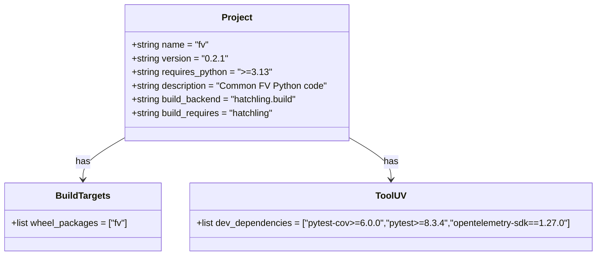
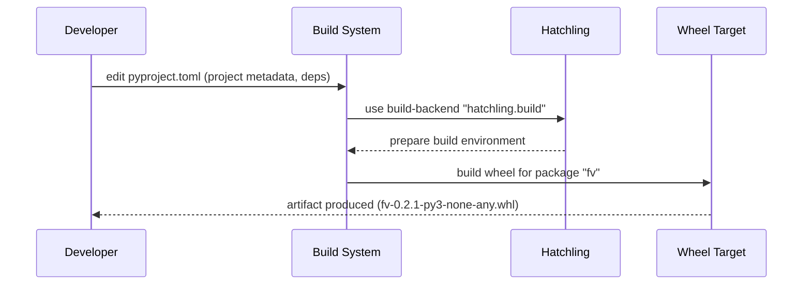

# Diagram: common/fv/python/pyproject.toml

> Auto-generated by Obscura crawlers

## Diagram 1

### SVG

<svg id="container" width="1034.890625" xmlns="http://www.w3.org/2000/svg" class="classDiagram" height="450" viewBox="0 0 1034.890625 450" role="graphics-document document" aria-roledescription="class"><g><defs><marker id="container_class-aggregationStart" class="marker aggregation class" refX="18" refY="7" markerWidth="190" markerHeight="240" orient="auto"><path d="M 18,7 L9,13 L1,7 L9,1 Z"></path></marker></defs><defs><marker id="container_class-aggregationEnd" class="marker aggregation class" refX="1" refY="7" markerWidth="20" markerHeight="28" orient="auto"><path d="M 18,7 L9,13 L1,7 L9,1 Z"></path></marker></defs><defs><marker id="container_class-extensionStart" class="marker extension class" refX="18" refY="7" markerWidth="190" markerHeight="240" orient="auto"><path d="M 1,7 L18,13 V 1 Z"></path></marker></defs><defs><marker id="container_class-extensionEnd" class="marker extension class" refX="1" refY="7" markerWidth="20" markerHeight="28" orient="auto"><path d="M 1,1 V 13 L18,7 Z"></path></marker></defs><defs><marker id="container_class-compositionStart" class="marker composition class" refX="18" refY="7" markerWidth="190" markerHeight="240" orient="auto"><path d="M 18,7 L9,13 L1,7 L9,1 Z"></path></marker></defs><defs><marker id="container_class-compositionEnd" class="marker composition class" refX="1" refY="7" markerWidth="20" markerHeight="28" orient="auto"><path d="M 18,7 L9,13 L1,7 L9,1 Z"></path></marker></defs><defs><marker id="container_class-dependencyStart" class="marker dependency class" refX="6" refY="7" markerWidth="190" markerHeight="240" orient="auto"><path d="M 5,7 L9,13 L1,7 L9,1 Z"></path></marker></defs><defs><marker id="container_class-dependencyEnd" class="marker dependency class" refX="13" refY="7" markerWidth="20" markerHeight="28" orient="auto"><path d="M 18,7 L9,13 L14,7 L9,1 Z"></path></marker></defs><defs><marker id="container_class-lollipopStart" class="marker lollipop class" refX="13" refY="7" markerWidth="190" markerHeight="240" orient="auto"><circle stroke="black" fill="transparent" cx="7" cy="7" r="6"></circle></marker></defs><defs><marker id="container_class-lollipopEnd" class="marker lollipop class" refX="1" refY="7" markerWidth="190" markerHeight="240" orient="auto"><circle stroke="black" fill="transparent" cx="7" cy="7" r="6"></circle></marker></defs><g class="root"><g class="clusters"></g><g class="edgePaths"><path d="M215.477,244.02L203.852,250.85C192.227,257.68,168.977,271.34,157.352,283.337C145.727,295.333,145.727,305.667,145.727,310.833L145.727,316" id="id_Project_BuildTargets_1" class="edge-thickness-normal edge-pattern-solid relation" style=";;;" data-edge="true" data-et="edge" data-id="id_Project_BuildTargets_1" data-points="W3sieCI6MjE1LjQ3NjU2MjUsInkiOjI0NC4wMjAxMjg5MzA0MDM5fSx7IngiOjE0NS43MjY1NjI1LCJ5IjoyODV9LHsieCI6MTQ1LjcyNjU2MjUsInkiOjMyMn1d" marker-end="url(#container_class-dependencyEnd)"></path><path d="M610.422,244.02L622.047,250.85C633.672,257.68,656.922,271.34,668.547,283.337C680.172,295.333,680.172,305.667,680.172,310.833L680.172,316" id="id_Project_ToolUV_2" class="edge-thickness-normal edge-pattern-solid relation" style=";;;" data-edge="true" data-et="edge" data-id="id_Project_ToolUV_2" data-points="W3sieCI6NjEwLjQyMTg3NSwieSI6MjQ0LjAyMDEyODkzMDQwMzl9LHsieCI6NjgwLjE3MTg3NSwieSI6Mjg1fSx7IngiOjY4MC4xNzE4NzUsInkiOjMyMn1d" marker-end="url(#container_class-dependencyEnd)"></path></g><g class="edgeLabels"><g class="edgeLabel" transform="translate(145.7265625, 285)"><g class="label" data-id="id_Project_BuildTargets_1" transform="translate(-12.703125, -12)"><foreignObject width="25.40625" height="24">

has

</foreignObject></g></g><g class="edgeLabel" transform="translate(680.171875, 285)"><g class="label" data-id="id_Project_ToolUV_2" transform="translate(-12.703125, -12)"><foreignObject width="25.40625" height="24">

has

</foreignObject></g></g></g><g class="nodes"><g class="node default" id="classId-Project-0" transform="translate(412.94921875, 128)"><g class="basic label-container"><path d="M-197.47265625 -120 L197.47265625 -120 L197.47265625 120 L-197.47265625 120" stroke="none" stroke-width="0" fill="#ECECFF" style=""></path><path d="M-197.47265625 -120 C-97.73181491123667 -120, 2.0090264275266634 -120, 197.47265625 -120 M-197.47265625 -120 C-97.48497574529311 -120, 2.502704759413774 -120, 197.47265625 -120 M197.47265625 -120 C197.47265625 -38.063194859151224, 197.47265625 43.87361028169755, 197.47265625 120 M197.47265625 -120 C197.47265625 -44.18381403593, 197.47265625 31.632371928140003, 197.47265625 120 M197.47265625 120 C55.98299623749091 120, -85.50666377501818 120, -197.47265625 120 M197.47265625 120 C47.14920369781899 120, -103.17424885436202 120, -197.47265625 120 M-197.47265625 120 C-197.47265625 44.25290631783551, -197.47265625 -31.49418736432898, -197.47265625 -120 M-197.47265625 120 C-197.47265625 47.405793806150356, -197.47265625 -25.188412387699287, -197.47265625 -120" stroke="#9370DB" stroke-width="1.3" fill="none" stroke-dasharray="0 0" style=""></path></g><g class="annotation-group text" transform="translate(0, -96)"></g><g class="label-group text" transform="translate(-25.8671875, -96)"><g class="label" style="font-weight: bolder" transform="translate(0,-12)"><foreignObject width="51.734375" height="24">

Project

</foreignObject></g></g><g class="members-group text" transform="translate(-185.47265625, -48)"><g class="label" style="" transform="translate(0,-12)"><foreignObject width="136.859375" height="24">

+string name = "fv"

</foreignObject></g><g class="label" style="" transform="translate(0,12)"><foreignObject width="165.78125" height="24">

+string version = "0.2.1"

</foreignObject></g><g class="label" style="" transform="translate(0,36)"><foreignObject width="242.5625" height="24">

+string requires_python = "&gt;=3.13"

</foreignObject></g><g class="label" style="" transform="translate(0,60)"><foreignObject width="345.078125" height="24">

+string description = "Common FV Python code"

</foreignObject></g><g class="label" style="" transform="translate(0,84)"><foreignObject width="299.21875" height="24">

+string build_backend = "hatchling.build"

</foreignObject></g><g class="label" style="" transform="translate(0,108)"><foreignObject width="256.171875" height="24">

+string build_requires = "hatchling"

</foreignObject></g></g><g class="methods-group text" transform="translate(-185.47265625, 120)"></g><g class="divider" style=""><path d="M-197.47265625 -72 C-61.47784119585995 -72, 74.5169738582801 -72, 197.47265625 -72 M-197.47265625 -72 C-102.28085900443263 -72, -7.089061758865256 -72, 197.47265625 -72" stroke="#9370DB" stroke-width="1.3" fill="none" stroke-dasharray="0 0" style=""></path></g><g class="divider" style=""><path d="M-197.47265625 96 C-93.63537650311333 96, 10.20190324377333 96, 197.47265625 96 M-197.47265625 96 C-79.3682660228434 96, 38.7361242043132 96, 197.47265625 96" stroke="#9370DB" stroke-width="1.3" fill="none" stroke-dasharray="0 0" style=""></path></g></g><g class="node default" id="classId-BuildTargets-1" transform="translate(145.7265625, 382)"><g class="basic label-container"><path d="M-137.7265625 -60 L137.7265625 -60 L137.7265625 60 L-137.7265625 60" stroke="none" stroke-width="0" fill="#ECECFF" style=""></path><path d="M-137.7265625 -60 C-60.72991230966868 -60, 16.266737880662646 -60, 137.7265625 -60 M-137.7265625 -60 C-69.09384145919492 -60, -0.4611204183898394 -60, 137.7265625 -60 M137.7265625 -60 C137.7265625 -33.814298985365426, 137.7265625 -7.628597970730844, 137.7265625 60 M137.7265625 -60 C137.7265625 -14.203510605393568, 137.7265625 31.592978789212864, 137.7265625 60 M137.7265625 60 C40.21002935810846 60, -57.306503783783086 60, -137.7265625 60 M137.7265625 60 C51.478121675083216 60, -34.77031914983357 60, -137.7265625 60 M-137.7265625 60 C-137.7265625 19.748139817683466, -137.7265625 -20.503720364633068, -137.7265625 -60 M-137.7265625 60 C-137.7265625 12.629082458563708, -137.7265625 -34.74183508287258, -137.7265625 -60" stroke="#9370DB" stroke-width="1.3" fill="none" stroke-dasharray="0 0" style=""></path></g><g class="annotation-group text" transform="translate(0, -36)"></g><g class="label-group text" transform="translate(-45.921875, -36)"><g class="label" style="font-weight: bolder" transform="translate(0,-12)"><foreignObject width="91.84375" height="24">

BuildTargets

</foreignObject></g></g><g class="members-group text" transform="translate(-125.7265625, 12)"><g class="label" style="" transform="translate(0,-12)"><foreignObject width="205.53125" height="24">

+list wheel_packages = ["fv"]

</foreignObject></g></g><g class="methods-group text" transform="translate(-125.7265625, 60)"></g><g class="divider" style=""><path d="M-137.7265625 -12 C-57.55510307297391 -12, 22.616356354052186 -12, 137.7265625 -12 M-137.7265625 -12 C-76.26076581066837 -12, -14.794969121336763 -12, 137.7265625 -12" stroke="#9370DB" stroke-width="1.3" fill="none" stroke-dasharray="0 0" style=""></path></g><g class="divider" style=""><path d="M-137.7265625 36 C-67.68422985465149 36, 2.358102790697018 36, 137.7265625 36 M-137.7265625 36 C-77.04314322812337 36, -16.359723956246725 36, 137.7265625 36" stroke="#9370DB" stroke-width="1.3" fill="none" stroke-dasharray="0 0" style=""></path></g></g><g class="node default" id="classId-ToolUV-2" transform="translate(680.171875, 382)"><g class="basic label-container"><path d="M-346.71875 -60 L346.71875 -60 L346.71875 60 L-346.71875 60" stroke="none" stroke-width="0" fill="#ECECFF" style=""></path><path d="M-346.71875 -60 C-75.53199863829099 -60, 195.65475272341803 -60, 346.71875 -60 M-346.71875 -60 C-85.59280537562381 -60, 175.53313924875238 -60, 346.71875 -60 M346.71875 -60 C346.71875 -30.966244396537242, 346.71875 -1.9324887930744836, 346.71875 60 M346.71875 -60 C346.71875 -18.950095130241465, 346.71875 22.09980973951707, 346.71875 60 M346.71875 60 C144.71758134164583 60, -57.28358731670835 60, -346.71875 60 M346.71875 60 C143.72882636964377 60, -59.26109726071246 60, -346.71875 60 M-346.71875 60 C-346.71875 13.38922528228985, -346.71875 -33.2215494354203, -346.71875 -60 M-346.71875 60 C-346.71875 27.521348219009113, -346.71875 -4.9573035619817745, -346.71875 -60" stroke="#9370DB" stroke-width="1.3" fill="none" stroke-dasharray="0 0" style=""></path></g><g class="annotation-group text" transform="translate(0, -36)"></g><g class="label-group text" transform="translate(-25.375, -36)"><g class="label" style="font-weight: bolder" transform="translate(0,-12)"><foreignObject width="50.75" height="24">

ToolUV

</foreignObject></g></g><g class="members-group text" transform="translate(-334.71875, 12)"><g class="label" style="" transform="translate(0,-12)"><foreignObject width="644.0625" height="24">

+list dev_dependencies = ["pytest-cov&gt;=6.0.0","pytest&gt;=8.3.4","opentelemetry-sdk==1.27.0"]

</foreignObject></g></g><g class="methods-group text" transform="translate(-334.71875, 60)"></g><g class="divider" style=""><path d="M-346.71875 -12 C-184.98111747243146 -12, -23.243484944862928 -12, 346.71875 -12 M-346.71875 -12 C-122.86846256198038 -12, 100.98182487603924 -12, 346.71875 -12" stroke="#9370DB" stroke-width="1.3" fill="none" stroke-dasharray="0 0" style=""></path></g><g class="divider" style=""><path d="M-346.71875 36 C-201.51126586408438 36, -56.30378172816876 36, 346.71875 36 M-346.71875 36 C-100.32447832400607 36, 146.06979335198787 36, 346.71875 36" stroke="#9370DB" stroke-width="1.3" fill="none" stroke-dasharray="0 0" style=""></path></g></g></g></g></g></svg>

## Diagram 2

```mermaid
graph TD
    PV[Project: fv v0.2.1]
    Hatchling["hatchling (build-requires)"]
    Backend["hatchling.build (build-backend)"]
    WheelTarget["wheel target packages: fv"]
    Dependencies["Dependencies"]
    deps_subgraph["Main dependencies"]
    dep_aws["aws-lambda-powertools[tracer,logging]==3.12.0"]
    dep_cachetools["cachetools==5.5.2"]
    dep_datadog["datadog==0.52.1"]
    dep_datadog_lambda["datadog-lambda==8.114.0"]
    dep_fastjson["fastjsonschema==2.21.1"]
    dep_geopy["geopy==2.4.1"]
    dep_glom["glom==24.11.0"]
    dep_munch["munch==4.0.0"]
    dep_mypy_boto3["mypy_boto3_sns==1.39.0"]
    dep_phonenumbers["phonenumberslite==9.0.5"]
    dep_psycopg2["psycopg2-binary==2.9.10"]
    dep_dateutil["python-dateutil==2.9.0"]
    dep_pytz["pytz==2025.2"]
    dep_requests["requests==2.32.3"]
    dep_rollbar["rollbar==1.3.0"]
    dep_supycache["supycache==0.3.0"]
    dep_iso3166["iso3166==2.1.1"]
    dep_pydantic["pydantic==2.11.4"]
    dep_i18n["python-i18n==0.3.9"]
    dep_pyjwt["PyJWT==2.10.1"]
    dep_us["us==3.2.0"]

    PV --> Hatchling
    PV --> Backend
    PV --> WheelTarget
    PV --> Dependencies
    Dependencies --> dep_aws
    Dependencies --> dep_cachetools
    Dependencies --> dep_datadog
    Dependencies --> dep_datadog_lambda
    Dependencies --> dep_fastjson
    Dependencies --> dep_geopy
    Dependencies --> dep_glom
    Dependencies --> dep_munch
    Dependencies --> dep_mypy_boto3
    Dependencies --> dep_phonenumbers
    Dependencies --> dep_psycopg2
    Dependencies --> dep_dateutil
    Dependencies --> dep_pytz
    Dependencies --> dep_requests
    Dependencies --> dep_rollbar
    Dependencies --> dep_supycache
    Dependencies --> dep_iso3166
    Dependencies --> dep_pydantic
    Dependencies --> dep_i18n
    Dependencies --> dep_pyjwt
    Dependencies --> dep_us
```

### SVG

<svg id="container" width="5013.3125" xmlns="http://www.w3.org/2000/svg" class="flowchart" height="326" viewBox="0 0 5013.3125 326" role="graphics-document document" aria-roledescription="flowchart-v2"><g><marker id="container_flowchart-v2-pointEnd" class="marker flowchart-v2" viewBox="0 0 10 10" refX="5" refY="5" markerUnits="userSpaceOnUse" markerWidth="8" markerHeight="8" orient="auto"><path d="M 0 0 L 10 5 L 0 10 z" class="arrowMarkerPath" style="stroke-width: 1; stroke-dasharray: 1, 0;"></path></marker><marker id="container_flowchart-v2-pointStart" class="marker flowchart-v2" viewBox="0 0 10 10" refX="4.5" refY="5" markerUnits="userSpaceOnUse" markerWidth="8" markerHeight="8" orient="auto"><path d="M 0 5 L 10 10 L 10 0 z" class="arrowMarkerPath" style="stroke-width: 1; stroke-dasharray: 1, 0;"></path></marker><marker id="container_flowchart-v2-circleEnd" class="marker flowchart-v2" viewBox="0 0 10 10" refX="11" refY="5" markerUnits="userSpaceOnUse" markerWidth="11" markerHeight="11" orient="auto"><circle cx="5" cy="5" r="5" class="arrowMarkerPath" style="stroke-width: 1; stroke-dasharray: 1, 0;"></circle></marker><marker id="container_flowchart-v2-circleStart" class="marker flowchart-v2" viewBox="0 0 10 10" refX="-1" refY="5" markerUnits="userSpaceOnUse" markerWidth="11" markerHeight="11" orient="auto"><circle cx="5" cy="5" r="5" class="arrowMarkerPath" style="stroke-width: 1; stroke-dasharray: 1, 0;"></circle></marker><marker id="container_flowchart-v2-crossEnd" class="marker cross flowchart-v2" viewBox="0 0 11 11" refX="12" refY="5.2" markerUnits="userSpaceOnUse" markerWidth="11" markerHeight="11" orient="auto"><path d="M 1,1 l 9,9 M 10,1 l -9,9" class="arrowMarkerPath" style="stroke-width: 2; stroke-dasharray: 1, 0;"></path></marker><marker id="container_flowchart-v2-crossStart" class="marker cross flowchart-v2" viewBox="0 0 11 11" refX="-1" refY="5.2" markerUnits="userSpaceOnUse" markerWidth="11" markerHeight="11" orient="auto"><path d="M 1,1 l 9,9 M 10,1 l -9,9" class="arrowMarkerPath" style="stroke-width: 2; stroke-dasharray: 1, 0;"></path></marker><g class="root"><g class="clusters"></g><g class="edgePaths"><path d="M1364.895,44.966L1303.807,51.972C1242.72,58.977,1120.546,72.989,1059.458,85.494C998.371,98,998.371,109,998.371,114.5L998.371,120" id="L_PV_Hatchling_0" class="edge-thickness-normal edge-pattern-solid edge-thickness-normal edge-pattern-solid flowchart-link" style=";" data-edge="true" data-et="edge" data-id="L_PV_Hatchling_0" data-points="W3sieCI6MTM2NC44OTQ1MzEyNSwieSI6NDQuOTY1ODE1NTAwMTg5NTM1fSx7IngiOjk5OC4zNzEwOTM3NSwieSI6ODd9LHsieCI6OTk4LjM3MTA5Mzc1LCJ5IjoxMjR9XQ==" marker-end="url(#container_flowchart-v2-pointEnd)"></path><path d="M1373.637,62L1361.575,66.167C1349.514,70.333,1325.392,78.667,1313.331,86.333C1301.27,94,1301.27,101,1301.27,104.5L1301.27,108" id="L_PV_Backend_0" class="edge-thickness-normal edge-pattern-solid edge-thickness-normal edge-pattern-solid flowchart-link" style=";" data-edge="true" data-et="edge" data-id="L_PV_Backend_0" data-points="W3sieCI6MTM3My42MzY1Njg1MDk2MTU1LCJ5Ijo2Mn0seyJ4IjoxMzAxLjI2OTUzMTI1LCJ5Ijo4N30seyJ4IjoxMzAxLjI2OTUzMTI1LCJ5IjoxMTJ9XQ==" marker-end="url(#container_flowchart-v2-pointEnd)"></path><path d="M1538.691,39.566L1689.135,47.472C1839.578,55.378,2140.465,71.189,2290.908,84.594C2441.352,98,2441.352,109,2441.352,114.5L2441.352,120" id="L_PV_WheelTarget_0" class="edge-thickness-normal edge-pattern-solid edge-thickness-normal edge-pattern-solid flowchart-link" style=";" data-edge="true" data-et="edge" data-id="L_PV_WheelTarget_0" data-points="W3sieCI6MTUzOC42OTE0MDYyNSwieSI6MzkuNTY2Mzk4MzcwNDg1NTh9LHsieCI6MjQ0MS4zNTE1NjI1LCJ5Ijo4N30seyJ4IjoyNDQxLjM1MTU2MjUsInkiOjEyNH1d" marker-end="url(#container_flowchart-v2-pointEnd)"></path><path d="M1538.691,38.638L1731.196,46.699C1923.701,54.759,2308.71,70.879,2501.214,84.44C2693.719,98,2693.719,109,2693.719,114.5L2693.719,120" id="L_PV_Dependencies_0" class="edge-thickness-normal edge-pattern-solid edge-thickness-normal edge-pattern-solid flowchart-link" style=";" data-edge="true" data-et="edge" data-id="L_PV_Dependencies_0" data-points="W3sieCI6MTUzOC42OTE0MDYyNSwieSI6MzguNjM4NDc3Mjg5MjQwMTg2fSx7IngiOjI2OTMuNzE4NzUsInkiOjg3fSx7IngiOjI2OTMuNzE4NzUsInkiOjEyNH1d" marker-end="url(#container_flowchart-v2-pointEnd)"></path><path d="M2612.398,153.054L2203.555,163.378C1794.711,173.702,977.023,194.351,568.18,208.176C159.336,222,159.336,229,159.336,232.5L159.336,236" id="L_Dependencies_dep_aws_0" class="edge-thickness-normal edge-pattern-solid edge-thickness-normal edge-pattern-solid flowchart-link" style=";" data-edge="true" data-et="edge" data-id="L_Dependencies_dep_aws_0" data-points="W3sieCI6MjYxMi4zOTg0Mzc1LCJ5IjoxNTMuMDUzNTU3MTcxNTI1Mzd9LHsieCI6MTU5LjMzNTkzNzUsInkiOjIxNX0seyJ4IjoxNTkuMzM1OTM3NSwieSI6MjQwfV0=" marker-end="url(#container_flowchart-v2-pointEnd)"></path><path d="M2612.398,153.323L2252.621,163.603C1892.844,173.882,1173.289,194.441,813.512,210.221C453.734,226,453.734,237,453.734,242.5L453.734,248" id="L_Dependencies_dep_cachetools_0" class="edge-thickness-normal edge-pattern-solid edge-thickness-normal edge-pattern-solid flowchart-link" style=";" data-edge="true" data-et="edge" data-id="L_Dependencies_dep_cachetools_0" data-points="W3sieCI6MjYxMi4zOTg0Mzc1LCJ5IjoxNTMuMzIzNDUzNzA3MTI2ODd9LHsieCI6NDUzLjczNDM3NSwieSI6MjE1fSx7IngiOjQ1My43MzQzNzUsInkiOjI1Mn1d" marker-end="url(#container_flowchart-v2-pointEnd)"></path><path d="M2612.398,153.589L2290.926,163.824C1969.453,174.059,1326.508,194.53,1005.035,210.265C683.563,226,683.563,237,683.563,242.5L683.563,248" id="L_Dependencies_dep_datadog_0" class="edge-thickness-normal edge-pattern-solid edge-thickness-normal edge-pattern-solid flowchart-link" style=";" data-edge="true" data-et="edge" data-id="L_Dependencies_dep_datadog_0" data-points="W3sieCI6MjYxMi4zOTg0Mzc1LCJ5IjoxNTMuNTg5MTAyMjE1MzEyODZ9LHsieCI6NjgzLjU2MjUsInkiOjIxNX0seyJ4Ijo2ODMuNTYyNSwieSI6MjUyfV0=" marker-end="url(#container_flowchart-v2-pointEnd)"></path><path d="M2612.398,153.971L2333.949,164.142C2055.5,174.314,1498.602,194.657,1220.152,210.328C941.703,226,941.703,237,941.703,242.5L941.703,248" id="L_Dependencies_dep_datadog_lambda_0" class="edge-thickness-normal edge-pattern-solid edge-thickness-normal edge-pattern-solid flowchart-link" style=";" data-edge="true" data-et="edge" data-id="L_Dependencies_dep_datadog_lambda_0" data-points="W3sieCI6MjYxMi4zOTg0Mzc1LCJ5IjoxNTMuOTcwNTc4NTMwMDg1ODd9LHsieCI6OTQxLjcwMzEyNSwieSI6MjE1fSx7IngiOjk0MS43MDMxMjUsInkiOjI1Mn1d" marker-end="url(#container_flowchart-v2-pointEnd)"></path><path d="M2612.398,154.544L2381.219,164.62C2150.039,174.696,1687.68,194.848,1456.5,210.424C1225.32,226,1225.32,237,1225.32,242.5L1225.32,248" id="L_Dependencies_dep_fastjson_0" class="edge-thickness-normal edge-pattern-solid edge-thickness-normal edge-pattern-solid flowchart-link" style=";" data-edge="true" data-et="edge" data-id="L_Dependencies_dep_fastjson_0" data-points="W3sieCI6MjYxMi4zOTg0Mzc1LCJ5IjoxNTQuNTQ0MzM3NzQwNDE2NTh9LHsieCI6MTIyNS4zMjAzMTI1LCJ5IjoyMTV9LHsieCI6MTIyNS4zMjAzMTI1LCJ5IjoyNTJ9XQ==" marker-end="url(#container_flowchart-v2-pointEnd)"></path><path d="M2612.398,155.225L2420.622,165.187C2228.846,175.15,1845.294,195.075,1653.518,210.537C1461.742,226,1461.742,237,1461.742,242.5L1461.742,248" id="L_Dependencies_dep_geopy_0" class="edge-thickness-normal edge-pattern-solid edge-thickness-normal edge-pattern-solid flowchart-link" style=";" data-edge="true" data-et="edge" data-id="L_Dependencies_dep_geopy_0" data-points="W3sieCI6MjYxMi4zOTg0Mzc1LCJ5IjoxNTUuMjI0NTEyMTg1MDY4NDV9LHsieCI6MTQ2MS43NDIxODc1LCJ5IjoyMTV9LHsieCI6MTQ2MS43NDIxODc1LCJ5IjoyNTJ9XQ==" marker-end="url(#container_flowchart-v2-pointEnd)"></path><path d="M2612.398,156.055L2454.355,165.879C2296.313,175.703,1980.227,195.352,1822.184,210.676C1664.141,226,1664.141,237,1664.141,242.5L1664.141,248" id="L_Dependencies_dep_glom_0" class="edge-thickness-normal edge-pattern-solid edge-thickness-normal edge-pattern-solid flowchart-link" style=";" data-edge="true" data-et="edge" data-id="L_Dependencies_dep_glom_0" data-points="W3sieCI6MjYxMi4zOTg0Mzc1LCJ5IjoxNTYuMDU0OTgzMDc4NjI3NDZ9LHsieCI6MTY2NC4xNDA2MjUsInkiOjIxNX0seyJ4IjoxNjY0LjE0MDYyNSwieSI6MjUyfV0=" marker-end="url(#container_flowchart-v2-pointEnd)"></path><path d="M2612.398,157.332L2488.967,166.944C2365.536,176.555,2118.674,195.777,1995.243,210.889C1871.813,226,1871.813,237,1871.813,242.5L1871.813,248" id="L_Dependencies_dep_munch_0" class="edge-thickness-normal edge-pattern-solid edge-thickness-normal edge-pattern-solid flowchart-link" style=";" data-edge="true" data-et="edge" data-id="L_Dependencies_dep_munch_0" data-points="W3sieCI6MjYxMi4zOTg0Mzc1LCJ5IjoxNTcuMzMyMjMwNzEzNjYxMX0seyJ4IjoxODcxLjgxMjUsInkiOjIxNX0seyJ4IjoxODcxLjgxMjUsInkiOjI1Mn1d" marker-end="url(#container_flowchart-v2-pointEnd)"></path><path d="M2612.398,160.051L2530.112,169.209C2447.826,178.367,2283.253,196.684,2200.966,211.342C2118.68,226,2118.68,237,2118.68,242.5L2118.68,248" id="L_Dependencies_dep_mypy_boto3_0" class="edge-thickness-normal edge-pattern-solid edge-thickness-normal edge-pattern-solid flowchart-link" style=";" data-edge="true" data-et="edge" data-id="L_Dependencies_dep_mypy_boto3_0" data-points="W3sieCI6MjYxMi4zOTg0Mzc1LCJ5IjoxNjAuMDUwNjg5NDkxMjAzMDN9LHsieCI6MjExOC42Nzk2ODc1LCJ5IjoyMTV9LHsieCI6MjExOC42Nzk2ODc1LCJ5IjoyNTJ9XQ==" marker-end="url(#container_flowchart-v2-pointEnd)"></path><path d="M2612.398,169.145L2578.146,176.787C2543.893,184.43,2475.388,199.715,2441.135,212.857C2406.883,226,2406.883,237,2406.883,242.5L2406.883,248" id="L_Dependencies_dep_phonenumbers_0" class="edge-thickness-normal edge-pattern-solid edge-thickness-normal edge-pattern-solid flowchart-link" style=";" data-edge="true" data-et="edge" data-id="L_Dependencies_dep_phonenumbers_0" data-points="W3sieCI6MjYxMi4zOTg0Mzc1LCJ5IjoxNjkuMTQ0NTE4NTg5MTMyNX0seyJ4IjoyNDA2Ljg4MjgxMjUsInkiOjIxNX0seyJ4IjoyNDA2Ljg4MjgxMjUsInkiOjI1Mn1d" marker-end="url(#container_flowchart-v2-pointEnd)"></path><path d="M2693.719,178L2693.719,184.167C2693.719,190.333,2693.719,202.667,2693.719,214.333C2693.719,226,2693.719,237,2693.719,242.5L2693.719,248" id="L_Dependencies_dep_psycopg2_0" class="edge-thickness-normal edge-pattern-solid edge-thickness-normal edge-pattern-solid flowchart-link" style=";" data-edge="true" data-et="edge" data-id="L_Dependencies_dep_psycopg2_0" data-points="W3sieCI6MjY5My43MTg3NSwieSI6MTc4fSx7IngiOjI2OTMuNzE4NzUsInkiOjIxNX0seyJ4IjoyNjkzLjcxODc1LCJ5IjoyNTJ9XQ==" marker-end="url(#container_flowchart-v2-pointEnd)"></path><path d="M2775.039,169.789L2807.652,177.324C2840.266,184.859,2905.492,199.93,2938.105,212.965C2970.719,226,2970.719,237,2970.719,242.5L2970.719,248" id="L_Dependencies_dep_dateutil_0" class="edge-thickness-normal edge-pattern-solid edge-thickness-normal edge-pattern-solid flowchart-link" style=";" data-edge="true" data-et="edge" data-id="L_Dependencies_dep_dateutil_0" data-points="W3sieCI6Mjc3NS4wMzkwNjI1LCJ5IjoxNjkuNzg4ODA4NjY0MjU5OTN9LHsieCI6Mjk3MC43MTg3NSwieSI6MjE1fSx7IngiOjI5NzAuNzE4NzUsInkiOjI1Mn1d" marker-end="url(#container_flowchart-v2-pointEnd)"></path><path d="M2775.039,161.142L2847.014,170.118C2918.99,179.095,3062.94,197.047,3134.915,211.524C3206.891,226,3206.891,237,3206.891,242.5L3206.891,248" id="L_Dependencies_dep_pytz_0" class="edge-thickness-normal edge-pattern-solid edge-thickness-normal edge-pattern-solid flowchart-link" style=";" data-edge="true" data-et="edge" data-id="L_Dependencies_dep_pytz_0" data-points="W3sieCI6Mjc3NS4wMzkwNjI1LCJ5IjoxNjEuMTQxODI2MjY0MzQ4NTd9LHsieCI6MzIwNi44OTA2MjUsInkiOjIxNX0seyJ4IjozMjA2Ljg5MDYyNSwieSI6MjUyfV0=" marker-end="url(#container_flowchart-v2-pointEnd)"></path><path d="M2775.039,158.153L2882.747,167.628C2990.456,177.102,3205.872,196.051,3313.581,211.026C3421.289,226,3421.289,237,3421.289,242.5L3421.289,248" id="L_Dependencies_dep_requests_0" class="edge-thickness-normal edge-pattern-solid edge-thickness-normal edge-pattern-solid flowchart-link" style=";" data-edge="true" data-et="edge" data-id="L_Dependencies_dep_requests_0" data-points="W3sieCI6Mjc3NS4wMzkwNjI1LCJ5IjoxNTguMTUzMjYwNTMxMDkxM30seyJ4IjozNDIxLjI4OTA2MjUsInkiOjIxNX0seyJ4IjozNDIxLjI4OTA2MjUsInkiOjI1Mn1d" marker-end="url(#container_flowchart-v2-pointEnd)"></path><path d="M2775.039,156.509L2918.927,166.258C3062.815,176.006,3350.591,195.503,3494.479,210.752C3638.367,226,3638.367,237,3638.367,242.5L3638.367,248" id="L_Dependencies_dep_rollbar_0" class="edge-thickness-normal edge-pattern-solid edge-thickness-normal edge-pattern-solid flowchart-link" style=";" data-edge="true" data-et="edge" data-id="L_Dependencies_dep_rollbar_0" data-points="W3sieCI6Mjc3NS4wMzkwNjI1LCJ5IjoxNTYuNTA5NDU3MDU2NjEwMDJ9LHsieCI6MzYzOC4zNjcxODc1LCJ5IjoyMTV9LHsieCI6MzYzOC4zNjcxODc1LCJ5IjoyNTJ9XQ==" marker-end="url(#container_flowchart-v2-pointEnd)"></path><path d="M2775.039,155.467L2955.681,165.389C3136.323,175.311,3497.607,195.156,3678.249,210.578C3858.891,226,3858.891,237,3858.891,242.5L3858.891,248" id="L_Dependencies_dep_supycache_0" class="edge-thickness-normal edge-pattern-solid edge-thickness-normal edge-pattern-solid flowchart-link" style=";" data-edge="true" data-et="edge" data-id="L_Dependencies_dep_supycache_0" data-points="W3sieCI6Mjc3NS4wMzkwNjI1LCJ5IjoxNTUuNDY2NzIyOTg4ODI5NDV9LHsieCI6Mzg1OC44OTA2MjUsInkiOjIxNX0seyJ4IjozODU4Ljg5MDYyNSwieSI6MjUyfV0=" marker-end="url(#container_flowchart-v2-pointEnd)"></path><path d="M2775.039,154.757L2992.355,164.798C3209.672,174.838,3644.305,194.919,3861.621,210.46C4078.938,226,4078.938,237,4078.938,242.5L4078.938,248" id="L_Dependencies_dep_iso3166_0" class="edge-thickness-normal edge-pattern-solid edge-thickness-normal edge-pattern-solid flowchart-link" style=";" data-edge="true" data-et="edge" data-id="L_Dependencies_dep_iso3166_0" data-points="W3sieCI6Mjc3NS4wMzkwNjI1LCJ5IjoxNTQuNzU3MTY4MzE3Mjc4NH0seyJ4Ijo0MDc4LjkzNzUsInkiOjIxNX0seyJ4Ijo0MDc4LjkzNzUsInkiOjI1Mn1d" marker-end="url(#container_flowchart-v2-pointEnd)"></path><path d="M2775.039,154.253L3028.104,164.378C3281.169,174.502,3787.299,194.751,4040.365,210.376C4293.43,226,4293.43,237,4293.43,242.5L4293.43,248" id="L_Dependencies_dep_pydantic_0" class="edge-thickness-normal edge-pattern-solid edge-thickness-normal edge-pattern-solid flowchart-link" style=";" data-edge="true" data-et="edge" data-id="L_Dependencies_dep_pydantic_0" data-points="W3sieCI6Mjc3NS4wMzkwNjI1LCJ5IjoxNTQuMjUzNDAwMjcyNTEwMTZ9LHsieCI6NDI5My40Mjk2ODc1LCJ5IjoyMTV9LHsieCI6NDI5My40Mjk2ODc1LCJ5IjoyNTJ9XQ==" marker-end="url(#container_flowchart-v2-pointEnd)"></path><path d="M2775.039,153.837L3067.267,164.031C3359.495,174.224,3943.951,194.612,4236.178,210.306C4528.406,226,4528.406,237,4528.406,242.5L4528.406,248" id="L_Dependencies_dep_i18n_0" class="edge-thickness-normal edge-pattern-solid edge-thickness-normal edge-pattern-solid flowchart-link" style=";" data-edge="true" data-et="edge" data-id="L_Dependencies_dep_i18n_0" data-points="W3sieCI6Mjc3NS4wMzkwNjI1LCJ5IjoxNTMuODM2NzIyODc1MTQ5MDR9LHsieCI6NDUyOC40MDYyNSwieSI6MjE1fSx7IngiOjQ1MjguNDA2MjUsInkiOjI1Mn1d" marker-end="url(#container_flowchart-v2-pointEnd)"></path><path d="M2775.039,153.527L3104.789,163.772C3434.539,174.018,4094.039,194.509,4423.789,210.254C4753.539,226,4753.539,237,4753.539,242.5L4753.539,248" id="L_Dependencies_dep_pyjwt_0" class="edge-thickness-normal edge-pattern-solid edge-thickness-normal edge-pattern-solid flowchart-link" style=";" data-edge="true" data-et="edge" data-id="L_Dependencies_dep_pyjwt_0" data-points="W3sieCI6Mjc3NS4wMzkwNjI1LCJ5IjoxNTMuNTI2Njc2NzA0OTYxMzd9LHsieCI6NDc1My41MzkwNjI1LCJ5IjoyMTV9LHsieCI6NDc1My41MzkwNjI1LCJ5IjoyNTJ9XQ==" marker-end="url(#container_flowchart-v2-pointEnd)"></path><path d="M2775.039,153.314L3136.372,163.595C3497.706,173.876,4220.372,194.438,4581.706,210.219C4943.039,226,4943.039,237,4943.039,242.5L4943.039,248" id="L_Dependencies_dep_us_0" class="edge-thickness-normal edge-pattern-solid edge-thickness-normal edge-pattern-solid flowchart-link" style=";" data-edge="true" data-et="edge" data-id="L_Dependencies_dep_us_0" data-points="W3sieCI6Mjc3NS4wMzkwNjI1LCJ5IjoxNTMuMzEzODEwMDc0NTcxMTR9LHsieCI6NDk0My4wMzkwNjI1LCJ5IjoyMTV9LHsieCI6NDk0My4wMzkwNjI1LCJ5IjoyNTJ9XQ==" marker-end="url(#container_flowchart-v2-pointEnd)"></path></g><g class="edgeLabels"><g class="edgeLabel"><g class="label" data-id="L_PV_Hatchling_0" transform="translate(0, 0)"><foreignObject width="0" height="0">

</foreignObject></g></g><g class="edgeLabel"><g class="label" data-id="L_PV_Backend_0" transform="translate(0, 0)"><foreignObject width="0" height="0">

</foreignObject></g></g><g class="edgeLabel"><g class="label" data-id="L_PV_WheelTarget_0" transform="translate(0, 0)"><foreignObject width="0" height="0">

</foreignObject></g></g><g class="edgeLabel"><g class="label" data-id="L_PV_Dependencies_0" transform="translate(0, 0)"><foreignObject width="0" height="0">

</foreignObject></g></g><g class="edgeLabel"><g class="label" data-id="L_Dependencies_dep_aws_0" transform="translate(0, 0)"><foreignObject width="0" height="0">

</foreignObject></g></g><g class="edgeLabel"><g class="label" data-id="L_Dependencies_dep_cachetools_0" transform="translate(0, 0)"><foreignObject width="0" height="0">

</foreignObject></g></g><g class="edgeLabel"><g class="label" data-id="L_Dependencies_dep_datadog_0" transform="translate(0, 0)"><foreignObject width="0" height="0">

</foreignObject></g></g><g class="edgeLabel"><g class="label" data-id="L_Dependencies_dep_datadog_lambda_0" transform="translate(0, 0)"><foreignObject width="0" height="0">

</foreignObject></g></g><g class="edgeLabel"><g class="label" data-id="L_Dependencies_dep_fastjson_0" transform="translate(0, 0)"><foreignObject width="0" height="0">

</foreignObject></g></g><g class="edgeLabel"><g class="label" data-id="L_Dependencies_dep_geopy_0" transform="translate(0, 0)"><foreignObject width="0" height="0">

</foreignObject></g></g><g class="edgeLabel"><g class="label" data-id="L_Dependencies_dep_glom_0" transform="translate(0, 0)"><foreignObject width="0" height="0">

</foreignObject></g></g><g class="edgeLabel"><g class="label" data-id="L_Dependencies_dep_munch_0" transform="translate(0, 0)"><foreignObject width="0" height="0">

</foreignObject></g></g><g class="edgeLabel"><g class="label" data-id="L_Dependencies_dep_mypy_boto3_0" transform="translate(0, 0)"><foreignObject width="0" height="0">

</foreignObject></g></g><g class="edgeLabel"><g class="label" data-id="L_Dependencies_dep_phonenumbers_0" transform="translate(0, 0)"><foreignObject width="0" height="0">

</foreignObject></g></g><g class="edgeLabel"><g class="label" data-id="L_Dependencies_dep_psycopg2_0" transform="translate(0, 0)"><foreignObject width="0" height="0">

</foreignObject></g></g><g class="edgeLabel"><g class="label" data-id="L_Dependencies_dep_dateutil_0" transform="translate(0, 0)"><foreignObject width="0" height="0">

</foreignObject></g></g><g class="edgeLabel"><g class="label" data-id="L_Dependencies_dep_pytz_0" transform="translate(0, 0)"><foreignObject width="0" height="0">

</foreignObject></g></g><g class="edgeLabel"><g class="label" data-id="L_Dependencies_dep_requests_0" transform="translate(0, 0)"><foreignObject width="0" height="0">

</foreignObject></g></g><g class="edgeLabel"><g class="label" data-id="L_Dependencies_dep_rollbar_0" transform="translate(0, 0)"><foreignObject width="0" height="0">

</foreignObject></g></g><g class="edgeLabel"><g class="label" data-id="L_Dependencies_dep_supycache_0" transform="translate(0, 0)"><foreignObject width="0" height="0">

</foreignObject></g></g><g class="edgeLabel"><g class="label" data-id="L_Dependencies_dep_iso3166_0" transform="translate(0, 0)"><foreignObject width="0" height="0">

</foreignObject></g></g><g class="edgeLabel"><g class="label" data-id="L_Dependencies_dep_pydantic_0" transform="translate(0, 0)"><foreignObject width="0" height="0">

</foreignObject></g></g><g class="edgeLabel"><g class="label" data-id="L_Dependencies_dep_i18n_0" transform="translate(0, 0)"><foreignObject width="0" height="0">

</foreignObject></g></g><g class="edgeLabel"><g class="label" data-id="L_Dependencies_dep_pyjwt_0" transform="translate(0, 0)"><foreignObject width="0" height="0">

</foreignObject></g></g><g class="edgeLabel"><g class="label" data-id="L_Dependencies_dep_us_0" transform="translate(0, 0)"><foreignObject width="0" height="0">

</foreignObject></g></g></g><g class="nodes"><g class="node default" id="flowchart-PV-0" transform="translate(1451.79296875, 35)"><rect class="basic label-container" style="" x="-86.8984375" y="-27" width="173.796875" height="54"></rect><g class="label" style="" transform="translate(-56.8984375, -12)"><rect></rect><foreignObject width="113.796875" height="24">

Project: fv v0.2.1

</foreignObject></g></g><g class="node default" id="flowchart-Hatchling-1" transform="translate(998.37109375, 151)"><rect class="basic label-container" style="" x="-122.8984375" y="-27" width="245.796875" height="54"></rect><g class="label" style="" transform="translate(-92.8984375, -12)"><rect></rect><foreignObject width="185.796875" height="24">

hatchling (build-requires)

</foreignObject></g></g><g class="node default" id="flowchart-Backend-2" transform="translate(1301.26953125, 151)"><rect class="basic label-container" style="" x="-130" y="-39" width="260" height="78"></rect><g class="label" style="" transform="translate(-100, -24)"><rect></rect><foreignObject width="200" height="48">

hatchling.build (build-backend)

</foreignObject></g></g><g class="node default" id="flowchart-WheelTarget-3" transform="translate(2441.3515625, 151)"><rect class="basic label-container" style="" x="-121.046875" y="-27" width="242.09375" height="54"></rect><g class="label" style="" transform="translate(-91.046875, -12)"><rect></rect><foreignObject width="182.09375" height="24">

wheel target packages: fv

</foreignObject></g></g><g class="node default" id="flowchart-Dependencies-4" transform="translate(2693.71875, 151)"><rect class="basic label-container" style="" x="-81.3203125" y="-27" width="162.640625" height="54"></rect><g class="label" style="" transform="translate(-51.3203125, -12)"><rect></rect><foreignObject width="102.640625" height="24">

Dependencies

</foreignObject></g></g><g class="node default" id="flowchart-deps_subgraph-5" transform="translate(1689.28515625, 35)"><rect class="basic label-container" style="" x="-100.59375" y="-27" width="201.1875" height="54"></rect><g class="label" style="" transform="translate(-70.59375, -12)"><rect></rect><foreignObject width="141.1875" height="24">

Main dependencies

</foreignObject></g></g><g class="node default" id="flowchart-dep_aws-6" transform="translate(159.3359375, 279)"><rect class="basic label-container" style="" x="-151.3359375" y="-39" width="302.671875" height="78"></rect><g class="label" style="" transform="translate(-121.3359375, -24)"><rect></rect><foreignObject width="242.671875" height="48">

aws-lambda-powertools[tracer,logging]==3.12.0

</foreignObject></g></g><g class="node default" id="flowchart-dep_cachetools-7" transform="translate(453.734375, 279)"><rect class="basic label-container" style="" x="-93.0625" y="-27" width="186.125" height="54"></rect><g class="label" style="" transform="translate(-63.0625, -12)"><rect></rect><foreignObject width="126.125" height="24">

cachetools==5.5.2

</foreignObject></g></g><g class="node default" id="flowchart-dep_datadog-8" transform="translate(683.5625, 279)"><rect class="basic label-container" style="" x="-86.765625" y="-27" width="173.53125" height="54"></rect><g class="label" style="" transform="translate(-56.765625, -12)"><rect></rect><foreignObject width="113.53125" height="24">

datadog==0.52.1

</foreignObject></g></g><g class="node default" id="flowchart-dep_datadog_lambda-9" transform="translate(941.703125, 279)"><rect class="basic label-container" style="" x="-121.375" y="-27" width="242.75" height="54"></rect><g class="label" style="" transform="translate(-91.375, -12)"><rect></rect><foreignObject width="182.75" height="24">

datadog-lambda==8.114.0

</foreignObject></g></g><g class="node default" id="flowchart-dep_fastjson-10" transform="translate(1225.3203125, 279)"><rect class="basic label-container" style="" x="-112.2421875" y="-27" width="224.484375" height="54"></rect><g class="label" style="" transform="translate(-82.2421875, -12)"><rect></rect><foreignObject width="164.484375" height="24">

fastjsonschema==2.21.1

</foreignObject></g></g><g class="node default" id="flowchart-dep_geopy-11" transform="translate(1461.7421875, 279)"><rect class="basic label-container" style="" x="-74.1796875" y="-27" width="148.359375" height="54"></rect><g class="label" style="" transform="translate(-44.1796875, -12)"><rect></rect><foreignObject width="88.359375" height="24">

geopy==2.4.1

</foreignObject></g></g><g class="node default" id="flowchart-dep_glom-12" transform="translate(1664.140625, 279)"><rect class="basic label-container" style="" x="-78.21875" y="-27" width="156.4375" height="54"></rect><g class="label" style="" transform="translate(-48.21875, -12)"><rect></rect><foreignObject width="96.4375" height="24">

glom==24.11.0

</foreignObject></g></g><g class="node default" id="flowchart-dep_munch-13" transform="translate(1871.8125, 279)"><rect class="basic label-container" style="" x="-79.453125" y="-27" width="158.90625" height="54"></rect><g class="label" style="" transform="translate(-49.453125, -12)"><rect></rect><foreignObject width="98.90625" height="24">

munch==4.0.0

</foreignObject></g></g><g class="node default" id="flowchart-dep_mypy_boto3-14" transform="translate(2118.6796875, 279)"><rect class="basic label-container" style="" x="-117.4140625" y="-27" width="234.828125" height="54"></rect><g class="label" style="" transform="translate(-87.4140625, -12)"><rect></rect><foreignObject width="174.828125" height="24">

mypy_boto3_sns==1.39.0

</foreignObject></g></g><g class="node default" id="flowchart-dep_phonenumbers-15" transform="translate(2406.8828125, 279)"><rect class="basic label-container" style="" x="-120.7890625" y="-27" width="241.578125" height="54"></rect><g class="label" style="" transform="translate(-90.7890625, -12)"><rect></rect><foreignObject width="181.578125" height="24">

phonenumberslite==9.0.5

</foreignObject></g></g><g class="node default" id="flowchart-dep_psycopg2-16" transform="translate(2693.71875, 279)"><rect class="basic label-container" style="" x="-116.046875" y="-27" width="232.09375" height="54"></rect><g class="label" style="" transform="translate(-86.046875, -12)"><rect></rect><foreignObject width="172.09375" height="24">

psycopg2-binary==2.9.10

</foreignObject></g></g><g class="node default" id="flowchart-dep_dateutil-17" transform="translate(2970.71875, 279)"><rect class="basic label-container" style="" x="-110.953125" y="-27" width="221.90625" height="54"></rect><g class="label" style="" transform="translate(-80.953125, -12)"><rect></rect><foreignObject width="161.90625" height="24">

python-dateutil==2.9.0

</foreignObject></g></g><g class="node default" id="flowchart-dep_pytz-18" transform="translate(3206.890625, 279)"><rect class="basic label-container" style="" x="-75.21875" y="-27" width="150.4375" height="54"></rect><g class="label" style="" transform="translate(-45.21875, -12)"><rect></rect><foreignObject width="90.4375" height="24">

pytz==2025.2

</foreignObject></g></g><g class="node default" id="flowchart-dep_requests-19" transform="translate(3421.2890625, 279)"><rect class="basic label-container" style="" x="-89.1796875" y="-27" width="178.359375" height="54"></rect><g class="label" style="" transform="translate(-59.1796875, -12)"><rect></rect><foreignObject width="118.359375" height="24">

requests==2.32.3

</foreignObject></g></g><g class="node default" id="flowchart-dep_rollbar-20" transform="translate(3638.3671875, 279)"><rect class="basic label-container" style="" x="-77.8984375" y="-27" width="155.796875" height="54"></rect><g class="label" style="" transform="translate(-47.8984375, -12)"><rect></rect><foreignObject width="95.796875" height="24">

rollbar==1.3.0

</foreignObject></g></g><g class="node default" id="flowchart-dep_supycache-21" transform="translate(3858.890625, 279)"><rect class="basic label-container" style="" x="-92.625" y="-27" width="185.25" height="54"></rect><g class="label" style="" transform="translate(-62.625, -12)"><rect></rect><foreignObject width="125.25" height="24">

supycache==0.3.0

</foreignObject></g></g><g class="node default" id="flowchart-dep_iso3166-22" transform="translate(4078.9375, 279)"><rect class="basic label-container" style="" x="-77.421875" y="-27" width="154.84375" height="54"></rect><g class="label" style="" transform="translate(-47.421875, -12)"><rect></rect><foreignObject width="94.84375" height="24">

iso3166==2.1.1

</foreignObject></g></g><g class="node default" id="flowchart-dep_pydantic-23" transform="translate(4293.4296875, 279)"><rect class="basic label-container" style="" x="-87.0703125" y="-27" width="174.140625" height="54"></rect><g class="label" style="" transform="translate(-57.0703125, -12)"><rect></rect><foreignObject width="114.140625" height="24">

pydantic==2.11.4

</foreignObject></g></g><g class="node default" id="flowchart-dep_i18n-24" transform="translate(4528.40625, 279)"><rect class="basic label-container" style="" x="-97.90625" y="-27" width="195.8125" height="54"></rect><g class="label" style="" transform="translate(-67.90625, -12)"><rect></rect><foreignObject width="135.8125" height="24">

python-i18n==0.3.9

</foreignObject></g></g><g class="node default" id="flowchart-dep_pyjwt-25" transform="translate(4753.5390625, 279)"><rect class="basic label-container" style="" x="-77.2265625" y="-27" width="154.453125" height="54"></rect><g class="label" style="" transform="translate(-47.2265625, -12)"><rect></rect><foreignObject width="94.453125" height="24">

PyJWT==2.10.1

</foreignObject></g></g><g class="node default" id="flowchart-dep_us-26" transform="translate(4943.0390625, 279)"><rect class="basic label-container" style="" x="-62.2734375" y="-27" width="124.546875" height="54"></rect><g class="label" style="" transform="translate(-32.2734375, -12)"><rect></rect><foreignObject width="64.546875" height="24">

us==3.2.0

</foreignObject></g></g></g></g></g></svg>

## Diagram 3

### SVG

<svg id="container" width="1172" xmlns="http://www.w3.org/2000/svg" height="411" viewBox="-50 -10 1172 411" role="graphics-document document" aria-roledescription="sequence"><g><rect x="922" y="325" fill="#eaeaea" stroke="#666" width="150" height="65" name="Wheel" rx="3" ry="3" class="actor actor-bottom"></rect><text x="997" y="357.5" dominant-baseline="central" alignment-baseline="central" class="actor actor-box" style="text-anchor: middle; font-size: 16px; font-weight: 400;"><tspan x="997" dy="0">Wheel Target</tspan></text></g><g><rect x="722" y="325" fill="#eaeaea" stroke="#666" width="150" height="65" name="Hatch" rx="3" ry="3" class="actor actor-bottom"></rect><text x="797" y="357.5" dominant-baseline="central" alignment-baseline="central" class="actor actor-box" style="text-anchor: middle; font-size: 16px; font-weight: 400;"><tspan x="797" dy="0">Hatchling</tspan></text></g><g><rect x="391" y="325" fill="#eaeaea" stroke="#666" width="150" height="65" name="Build" rx="3" ry="3" class="actor actor-bottom"></rect><text x="466" y="357.5" dominant-baseline="central" alignment-baseline="central" class="actor actor-box" style="text-anchor: middle; font-size: 16px; font-weight: 400;"><tspan x="466" dy="0">Build System</tspan></text></g><g><rect x="0" y="325" fill="#eaeaea" stroke="#666" width="150" height="65" name="Dev" rx="3" ry="3" class="actor actor-bottom"></rect><text x="75" y="357.5" dominant-baseline="central" alignment-baseline="central" class="actor actor-box" style="text-anchor: middle; font-size: 16px; font-weight: 400;"><tspan x="75" dy="0">Developer</tspan></text></g><g><line id="actor3" x1="997" y1="65" x2="997" y2="325" class="actor-line 200" stroke-width="0.5px" stroke="#999" name="Wheel"></line><g id="root-3"><rect x="922" y="0" fill="#eaeaea" stroke="#666" width="150" height="65" name="Wheel" rx="3" ry="3" class="actor actor-top"></rect><text x="997" y="32.5" dominant-baseline="central" alignment-baseline="central" class="actor actor-box" style="text-anchor: middle; font-size: 16px; font-weight: 400;"><tspan x="997" dy="0">Wheel Target</tspan></text></g></g><g><line id="actor2" x1="797" y1="65" x2="797" y2="325" class="actor-line 200" stroke-width="0.5px" stroke="#999" name="Hatch"></line><g id="root-2"><rect x="722" y="0" fill="#eaeaea" stroke="#666" width="150" height="65" name="Hatch" rx="3" ry="3" class="actor actor-top"></rect><text x="797" y="32.5" dominant-baseline="central" alignment-baseline="central" class="actor actor-box" style="text-anchor: middle; font-size: 16px; font-weight: 400;"><tspan x="797" dy="0">Hatchling</tspan></text></g></g><g><line id="actor1" x1="466" y1="65" x2="466" y2="325" class="actor-line 200" stroke-width="0.5px" stroke="#999" name="Build"></line><g id="root-1"><rect x="391" y="0" fill="#eaeaea" stroke="#666" width="150" height="65" name="Build" rx="3" ry="3" class="actor actor-top"></rect><text x="466" y="32.5" dominant-baseline="central" alignment-baseline="central" class="actor actor-box" style="text-anchor: middle; font-size: 16px; font-weight: 400;"><tspan x="466" dy="0">Build System</tspan></text></g></g><g><line id="actor0" x1="75" y1="65" x2="75" y2="325" class="actor-line 200" stroke-width="0.5px" stroke="#999" name="Dev"></line><g id="root-0"><rect x="0" y="0" fill="#eaeaea" stroke="#666" width="150" height="65" name="Dev" rx="3" ry="3" class="actor actor-top"></rect><text x="75" y="32.5" dominant-baseline="central" alignment-baseline="central" class="actor actor-box" style="text-anchor: middle; font-size: 16px; font-weight: 400;"><tspan x="75" dy="0">Developer</tspan></text></g></g><g></g><defs><symbol id="computer" width="24" height="24"><path transform="scale(.5)" d="M2 2v13h20v-13h-20zm18 11h-16v-9h16v9zm-10.228 6l.466-1h3.524l.467 1h-4.457zm14.228 3h-24l2-6h2.104l-1.33 4h18.45l-1.297-4h2.073l2 6zm-5-10h-14v-7h14v7z"></path></symbol></defs><defs><symbol id="database" fill-rule="evenodd" clip-rule="evenodd"><path transform="scale(.5)" d="M12.258.001l.256.004.255.005.253.008.251.01.249.012.247.015.246.016.242.019.241.02.239.023.236.024.233.027.231.028.229.031.225.032.223.034.22.036.217.038.214.04.211.041.208.043.205.045.201.046.198.048.194.05.191.051.187.053.183.054.18.056.175.057.172.059.168.06.163.061.16.063.155.064.15.066.074.033.073.033.071.034.07.034.069.035.068.035.067.035.066.035.064.036.064.036.062.036.06.036.06.037.058.037.058.037.055.038.055.038.053.038.052.038.051.039.05.039.048.039.047.039.045.04.044.04.043.04.041.04.04.041.039.041.037.041.036.041.034.041.033.042.032.042.03.042.029.042.027.042.026.043.024.043.023.043.021.043.02.043.018.044.017.043.015.044.013.044.012.044.011.045.009.044.007.045.006.045.004.045.002.045.001.045v17l-.001.045-.002.045-.004.045-.006.045-.007.045-.009.044-.011.045-.012.044-.013.044-.015.044-.017.043-.018.044-.02.043-.021.043-.023.043-.024.043-.026.043-.027.042-.029.042-.03.042-.032.042-.033.042-.034.041-.036.041-.037.041-.039.041-.04.041-.041.04-.043.04-.044.04-.045.04-.047.039-.048.039-.05.039-.051.039-.052.038-.053.038-.055.038-.055.038-.058.037-.058.037-.06.037-.06.036-.062.036-.064.036-.064.036-.066.035-.067.035-.068.035-.069.035-.07.034-.071.034-.073.033-.074.033-.15.066-.155.064-.16.063-.163.061-.168.06-.172.059-.175.057-.18.056-.183.054-.187.053-.191.051-.194.05-.198.048-.201.046-.205.045-.208.043-.211.041-.214.04-.217.038-.22.036-.223.034-.225.032-.229.031-.231.028-.233.027-.236.024-.239.023-.241.02-.242.019-.246.016-.247.015-.249.012-.251.01-.253.008-.255.005-.256.004-.258.001-.258-.001-.256-.004-.255-.005-.253-.008-.251-.01-.249-.012-.247-.015-.245-.016-.243-.019-.241-.02-.238-.023-.236-.024-.234-.027-.231-.028-.228-.031-.226-.032-.223-.034-.22-.036-.217-.038-.214-.04-.211-.041-.208-.043-.204-.045-.201-.046-.198-.048-.195-.05-.19-.051-.187-.053-.184-.054-.179-.056-.176-.057-.172-.059-.167-.06-.164-.061-.159-.063-.155-.064-.151-.066-.074-.033-.072-.033-.072-.034-.07-.034-.069-.035-.068-.035-.067-.035-.066-.035-.064-.036-.063-.036-.062-.036-.061-.036-.06-.037-.058-.037-.057-.037-.056-.038-.055-.038-.053-.038-.052-.038-.051-.039-.049-.039-.049-.039-.046-.039-.046-.04-.044-.04-.043-.04-.041-.04-.04-.041-.039-.041-.037-.041-.036-.041-.034-.041-.033-.042-.032-.042-.03-.042-.029-.042-.027-.042-.026-.043-.024-.043-.023-.043-.021-.043-.02-.043-.018-.044-.017-.043-.015-.044-.013-.044-.012-.044-.011-.045-.009-.044-.007-.045-.006-.045-.004-.045-.002-.045-.001-.045v-17l.001-.045.002-.045.004-.045.006-.045.007-.045.009-.044.011-.045.012-.044.013-.044.015-.044.017-.043.018-.044.02-.043.021-.043.023-.043.024-.043.026-.043.027-.042.029-.042.03-.042.032-.042.033-.042.034-.041.036-.041.037-.041.039-.041.04-.041.041-.04.043-.04.044-.04.046-.04.046-.039.049-.039.049-.039.051-.039.052-.038.053-.038.055-.038.056-.038.057-.037.058-.037.06-.037.061-.036.062-.036.063-.036.064-.036.066-.035.067-.035.068-.035.069-.035.07-.034.072-.034.072-.033.074-.033.151-.066.155-.064.159-.063.164-.061.167-.06.172-.059.176-.057.179-.056.184-.054.187-.053.19-.051.195-.05.198-.048.201-.046.204-.045.208-.043.211-.041.214-.04.217-.038.22-.036.223-.034.226-.032.228-.031.231-.028.234-.027.236-.024.238-.023.241-.02.243-.019.245-.016.247-.015.249-.012.251-.01.253-.008.255-.005.256-.004.258-.001.258.001zm-9.258 20.499v.01l.001.021.003.021.004.022.005.021.006.022.007.022.009.023.01.022.011.023.012.023.013.023.015.023.016.024.017.023.018.024.019.024.021.024.022.025.023.024.024.025.052.049.056.05.061.051.066.051.07.051.075.051.079.052.084.052.088.052.092.052.097.052.102.051.105.052.11.052.114.051.119.051.123.051.127.05.131.05.135.05.139.048.144.049.147.047.152.047.155.047.16.045.163.045.167.043.171.043.176.041.178.041.183.039.187.039.19.037.194.035.197.035.202.033.204.031.209.03.212.029.216.027.219.025.222.024.226.021.23.02.233.018.236.016.24.015.243.012.246.01.249.008.253.005.256.004.259.001.26-.001.257-.004.254-.005.25-.008.247-.011.244-.012.241-.014.237-.016.233-.018.231-.021.226-.021.224-.024.22-.026.216-.027.212-.028.21-.031.205-.031.202-.034.198-.034.194-.036.191-.037.187-.039.183-.04.179-.04.175-.042.172-.043.168-.044.163-.045.16-.046.155-.046.152-.047.148-.048.143-.049.139-.049.136-.05.131-.05.126-.05.123-.051.118-.052.114-.051.11-.052.106-.052.101-.052.096-.052.092-.052.088-.053.083-.051.079-.052.074-.052.07-.051.065-.051.06-.051.056-.05.051-.05.023-.024.023-.025.021-.024.02-.024.019-.024.018-.024.017-.024.015-.023.014-.024.013-.023.012-.023.01-.023.01-.022.008-.022.006-.022.006-.022.004-.022.004-.021.001-.021.001-.021v-4.127l-.077.055-.08.053-.083.054-.085.053-.087.052-.09.052-.093.051-.095.05-.097.05-.1.049-.102.049-.105.048-.106.047-.109.047-.111.046-.114.045-.115.045-.118.044-.12.043-.122.042-.124.042-.126.041-.128.04-.13.04-.132.038-.134.038-.135.037-.138.037-.139.035-.142.035-.143.034-.144.033-.147.032-.148.031-.15.03-.151.03-.153.029-.154.027-.156.027-.158.026-.159.025-.161.024-.162.023-.163.022-.165.021-.166.02-.167.019-.169.018-.169.017-.171.016-.173.015-.173.014-.175.013-.175.012-.177.011-.178.01-.179.008-.179.008-.181.006-.182.005-.182.004-.184.003-.184.002h-.37l-.184-.002-.184-.003-.182-.004-.182-.005-.181-.006-.179-.008-.179-.008-.178-.01-.176-.011-.176-.012-.175-.013-.173-.014-.172-.015-.171-.016-.17-.017-.169-.018-.167-.019-.166-.02-.165-.021-.163-.022-.162-.023-.161-.024-.159-.025-.157-.026-.156-.027-.155-.027-.153-.029-.151-.03-.15-.03-.148-.031-.146-.032-.145-.033-.143-.034-.141-.035-.14-.035-.137-.037-.136-.037-.134-.038-.132-.038-.13-.04-.128-.04-.126-.041-.124-.042-.122-.042-.12-.044-.117-.043-.116-.045-.113-.045-.112-.046-.109-.047-.106-.047-.105-.048-.102-.049-.1-.049-.097-.05-.095-.05-.093-.052-.09-.051-.087-.052-.085-.053-.083-.054-.08-.054-.077-.054v4.127zm0-5.654v.011l.001.021.003.021.004.021.005.022.006.022.007.022.009.022.01.022.011.023.012.023.013.023.015.024.016.023.017.024.018.024.019.024.021.024.022.024.023.025.024.024.052.05.056.05.061.05.066.051.07.051.075.052.079.051.084.052.088.052.092.052.097.052.102.052.105.052.11.051.114.051.119.052.123.05.127.051.131.05.135.049.139.049.144.048.147.048.152.047.155.046.16.045.163.045.167.044.171.042.176.042.178.04.183.04.187.038.19.037.194.036.197.034.202.033.204.032.209.03.212.028.216.027.219.025.222.024.226.022.23.02.233.018.236.016.24.014.243.012.246.01.249.008.253.006.256.003.259.001.26-.001.257-.003.254-.006.25-.008.247-.01.244-.012.241-.015.237-.016.233-.018.231-.02.226-.022.224-.024.22-.025.216-.027.212-.029.21-.03.205-.032.202-.033.198-.035.194-.036.191-.037.187-.039.183-.039.179-.041.175-.042.172-.043.168-.044.163-.045.16-.045.155-.047.152-.047.148-.048.143-.048.139-.05.136-.049.131-.05.126-.051.123-.051.118-.051.114-.052.11-.052.106-.052.101-.052.096-.052.092-.052.088-.052.083-.052.079-.052.074-.051.07-.052.065-.051.06-.05.056-.051.051-.049.023-.025.023-.024.021-.025.02-.024.019-.024.018-.024.017-.024.015-.023.014-.023.013-.024.012-.022.01-.023.01-.023.008-.022.006-.022.006-.022.004-.021.004-.022.001-.021.001-.021v-4.139l-.077.054-.08.054-.083.054-.085.052-.087.053-.09.051-.093.051-.095.051-.097.05-.1.049-.102.049-.105.048-.106.047-.109.047-.111.046-.114.045-.115.044-.118.044-.12.044-.122.042-.124.042-.126.041-.128.04-.13.039-.132.039-.134.038-.135.037-.138.036-.139.036-.142.035-.143.033-.144.033-.147.033-.148.031-.15.03-.151.03-.153.028-.154.028-.156.027-.158.026-.159.025-.161.024-.162.023-.163.022-.165.021-.166.02-.167.019-.169.018-.169.017-.171.016-.173.015-.173.014-.175.013-.175.012-.177.011-.178.009-.179.009-.179.007-.181.007-.182.005-.182.004-.184.003-.184.002h-.37l-.184-.002-.184-.003-.182-.004-.182-.005-.181-.007-.179-.007-.179-.009-.178-.009-.176-.011-.176-.012-.175-.013-.173-.014-.172-.015-.171-.016-.17-.017-.169-.018-.167-.019-.166-.02-.165-.021-.163-.022-.162-.023-.161-.024-.159-.025-.157-.026-.156-.027-.155-.028-.153-.028-.151-.03-.15-.03-.148-.031-.146-.033-.145-.033-.143-.033-.141-.035-.14-.036-.137-.036-.136-.037-.134-.038-.132-.039-.13-.039-.128-.04-.126-.041-.124-.042-.122-.043-.12-.043-.117-.044-.116-.044-.113-.046-.112-.046-.109-.046-.106-.047-.105-.048-.102-.049-.1-.049-.097-.05-.095-.051-.093-.051-.09-.051-.087-.053-.085-.052-.083-.054-.08-.054-.077-.054v4.139zm0-5.666v.011l.001.02.003.022.004.021.005.022.006.021.007.022.009.023.01.022.011.023.012.023.013.023.015.023.016.024.017.024.018.023.019.024.021.025.022.024.023.024.024.025.052.05.056.05.061.05.066.051.07.051.075.052.079.051.084.052.088.052.092.052.097.052.102.052.105.051.11.052.114.051.119.051.123.051.127.05.131.05.135.05.139.049.144.048.147.048.152.047.155.046.16.045.163.045.167.043.171.043.176.042.178.04.183.04.187.038.19.037.194.036.197.034.202.033.204.032.209.03.212.028.216.027.219.025.222.024.226.021.23.02.233.018.236.017.24.014.243.012.246.01.249.008.253.006.256.003.259.001.26-.001.257-.003.254-.006.25-.008.247-.01.244-.013.241-.014.237-.016.233-.018.231-.02.226-.022.224-.024.22-.025.216-.027.212-.029.21-.03.205-.032.202-.033.198-.035.194-.036.191-.037.187-.039.183-.039.179-.041.175-.042.172-.043.168-.044.163-.045.16-.045.155-.047.152-.047.148-.048.143-.049.139-.049.136-.049.131-.051.126-.05.123-.051.118-.052.114-.051.11-.052.106-.052.101-.052.096-.052.092-.052.088-.052.083-.052.079-.052.074-.052.07-.051.065-.051.06-.051.056-.05.051-.049.023-.025.023-.025.021-.024.02-.024.019-.024.018-.024.017-.024.015-.023.014-.024.013-.023.012-.023.01-.022.01-.023.008-.022.006-.022.006-.022.004-.022.004-.021.001-.021.001-.021v-4.153l-.077.054-.08.054-.083.053-.085.053-.087.053-.09.051-.093.051-.095.051-.097.05-.1.049-.102.048-.105.048-.106.048-.109.046-.111.046-.114.046-.115.044-.118.044-.12.043-.122.043-.124.042-.126.041-.128.04-.13.039-.132.039-.134.038-.135.037-.138.036-.139.036-.142.034-.143.034-.144.033-.147.032-.148.032-.15.03-.151.03-.153.028-.154.028-.156.027-.158.026-.159.024-.161.024-.162.023-.163.023-.165.021-.166.02-.167.019-.169.018-.169.017-.171.016-.173.015-.173.014-.175.013-.175.012-.177.01-.178.01-.179.009-.179.007-.181.006-.182.006-.182.004-.184.003-.184.001-.185.001-.185-.001-.184-.001-.184-.003-.182-.004-.182-.006-.181-.006-.179-.007-.179-.009-.178-.01-.176-.01-.176-.012-.175-.013-.173-.014-.172-.015-.171-.016-.17-.017-.169-.018-.167-.019-.166-.02-.165-.021-.163-.023-.162-.023-.161-.024-.159-.024-.157-.026-.156-.027-.155-.028-.153-.028-.151-.03-.15-.03-.148-.032-.146-.032-.145-.033-.143-.034-.141-.034-.14-.036-.137-.036-.136-.037-.134-.038-.132-.039-.13-.039-.128-.041-.126-.041-.124-.041-.122-.043-.12-.043-.117-.044-.116-.044-.113-.046-.112-.046-.109-.046-.106-.048-.105-.048-.102-.048-.1-.05-.097-.049-.095-.051-.093-.051-.09-.052-.087-.052-.085-.053-.083-.053-.08-.054-.077-.054v4.153zm8.74-8.179l-.257.004-.254.005-.25.008-.247.011-.244.012-.241.014-.237.016-.233.018-.231.021-.226.022-.224.023-.22.026-.216.027-.212.028-.21.031-.205.032-.202.033-.198.034-.194.036-.191.038-.187.038-.183.04-.179.041-.175.042-.172.043-.168.043-.163.045-.16.046-.155.046-.152.048-.148.048-.143.048-.139.049-.136.05-.131.05-.126.051-.123.051-.118.051-.114.052-.11.052-.106.052-.101.052-.096.052-.092.052-.088.052-.083.052-.079.052-.074.051-.07.052-.065.051-.06.05-.056.05-.051.05-.023.025-.023.024-.021.024-.02.025-.019.024-.018.024-.017.023-.015.024-.014.023-.013.023-.012.023-.01.023-.01.022-.008.022-.006.023-.006.021-.004.022-.004.021-.001.021-.001.021.001.021.001.021.004.021.004.022.006.021.006.023.008.022.01.022.01.023.012.023.013.023.014.023.015.024.017.023.018.024.019.024.02.025.021.024.023.024.023.025.051.05.056.05.06.05.065.051.07.052.074.051.079.052.083.052.088.052.092.052.096.052.101.052.106.052.11.052.114.052.118.051.123.051.126.051.131.05.136.05.139.049.143.048.148.048.152.048.155.046.16.046.163.045.168.043.172.043.175.042.179.041.183.04.187.038.191.038.194.036.198.034.202.033.205.032.21.031.212.028.216.027.22.026.224.023.226.022.231.021.233.018.237.016.241.014.244.012.247.011.25.008.254.005.257.004.26.001.26-.001.257-.004.254-.005.25-.008.247-.011.244-.012.241-.014.237-.016.233-.018.231-.021.226-.022.224-.023.22-.026.216-.027.212-.028.21-.031.205-.032.202-.033.198-.034.194-.036.191-.038.187-.038.183-.04.179-.041.175-.042.172-.043.168-.043.163-.045.16-.046.155-.046.152-.048.148-.048.143-.048.139-.049.136-.05.131-.05.126-.051.123-.051.118-.051.114-.052.11-.052.106-.052.101-.052.096-.052.092-.052.088-.052.083-.052.079-.052.074-.051.07-.052.065-.051.06-.05.056-.05.051-.05.023-.025.023-.024.021-.024.02-.025.019-.024.018-.024.017-.023.015-.024.014-.023.013-.023.012-.023.01-.023.01-.022.008-.022.006-.023.006-.021.004-.022.004-.021.001-.021.001-.021-.001-.021-.001-.021-.004-.021-.004-.022-.006-.021-.006-.023-.008-.022-.01-.022-.01-.023-.012-.023-.013-.023-.014-.023-.015-.024-.017-.023-.018-.024-.019-.024-.02-.025-.021-.024-.023-.024-.023-.025-.051-.05-.056-.05-.06-.05-.065-.051-.07-.052-.074-.051-.079-.052-.083-.052-.088-.052-.092-.052-.096-.052-.101-.052-.106-.052-.11-.052-.114-.052-.118-.051-.123-.051-.126-.051-.131-.05-.136-.05-.139-.049-.143-.048-.148-.048-.152-.048-.155-.046-.16-.046-.163-.045-.168-.043-.172-.043-.175-.042-.179-.041-.183-.04-.187-.038-.191-.038-.194-.036-.198-.034-.202-.033-.205-.032-.21-.031-.212-.028-.216-.027-.22-.026-.224-.023-.226-.022-.231-.021-.233-.018-.237-.016-.241-.014-.244-.012-.247-.011-.25-.008-.254-.005-.257-.004-.26-.001-.26.001z"></path></symbol></defs><defs><symbol id="clock" width="24" height="24"><path transform="scale(.5)" d="M12 2c5.514 0 10 4.486 10 10s-4.486 10-10 10-10-4.486-10-10 4.486-10 10-10zm0-2c-6.627 0-12 5.373-12 12s5.373 12 12 12 12-5.373 12-12-5.373-12-12-12zm5.848 12.459c.202.038.202.333.001.372-1.907.361-6.045 1.111-6.547 1.111-.719 0-1.301-.582-1.301-1.301 0-.512.77-5.447 1.125-7.445.034-.192.312-.181.343.014l.985 6.238 5.394 1.011z"></path></symbol></defs><defs><marker id="arrowhead" refX="7.9" refY="5" markerUnits="userSpaceOnUse" markerWidth="12" markerHeight="12" orient="auto-start-reverse"><path d="M -1 0 L 10 5 L 0 10 z"></path></marker></defs><defs><marker id="crosshead" markerWidth="15" markerHeight="8" orient="auto" refX="4" refY="4.5"><path fill="none" stroke="#000000" stroke-width="1pt" d="M 1,2 L 6,7 M 6,2 L 1,7" style="stroke-dasharray: 0, 0;"></path></marker></defs><defs><marker id="filled-head" refX="15.5" refY="7" markerWidth="20" markerHeight="28" orient="auto"><path d="M 18,7 L9,13 L14,7 L9,1 Z"></path></marker></defs><defs><marker id="sequencenumber" refX="15" refY="15" markerWidth="60" markerHeight="40" orient="auto"><circle cx="15" cy="15" r="6"></circle></marker></defs><text x="269" y="80" text-anchor="middle" dominant-baseline="middle" alignment-baseline="middle" class="messageText" dy="1em" style="font-size: 16px; font-weight: 400;">edit pyproject.toml (project metadata, deps)</text><line x1="76" y1="113" x2="462" y2="113" class="messageLine0" stroke-width="2" stroke="none" marker-end="url(#arrowhead)" style="fill: none;"></line><text x="630" y="128" text-anchor="middle" dominant-baseline="middle" alignment-baseline="middle" class="messageText" dy="1em" style="font-size: 16px; font-weight: 400;">use build-backend "hatchling.build"</text><line x1="467" y1="161" x2="793" y2="161" class="messageLine0" stroke-width="2" stroke="none" marker-end="url(#arrowhead)" style="fill: none;"></line><text x="633" y="176" text-anchor="middle" dominant-baseline="middle" alignment-baseline="middle" class="messageText" dy="1em" style="font-size: 16px; font-weight: 400;">prepare build environment</text><line x1="796" y1="209" x2="470" y2="209" class="messageLine1" stroke-width="2" stroke="none" marker-end="url(#arrowhead)" style="stroke-dasharray: 3, 3; fill: none;"></line><text x="730" y="224" text-anchor="middle" dominant-baseline="middle" alignment-baseline="middle" class="messageText" dy="1em" style="font-size: 16px; font-weight: 400;">build wheel for package "fv"</text><line x1="467" y1="257" x2="993" y2="257" class="messageLine0" stroke-width="2" stroke="none" marker-end="url(#arrowhead)" style="fill: none;"></line><text x="538" y="272" text-anchor="middle" dominant-baseline="middle" alignment-baseline="middle" class="messageText" dy="1em" style="font-size: 16px; font-weight: 400;">artifact produced (fv-0.2.1-py3-none-any.whl)</text><line x1="996" y1="305" x2="79" y2="305" class="messageLine1" stroke-width="2" stroke="none" marker-end="url(#arrowhead)" style="stroke-dasharray: 3, 3; fill: none;"></line></svg>
