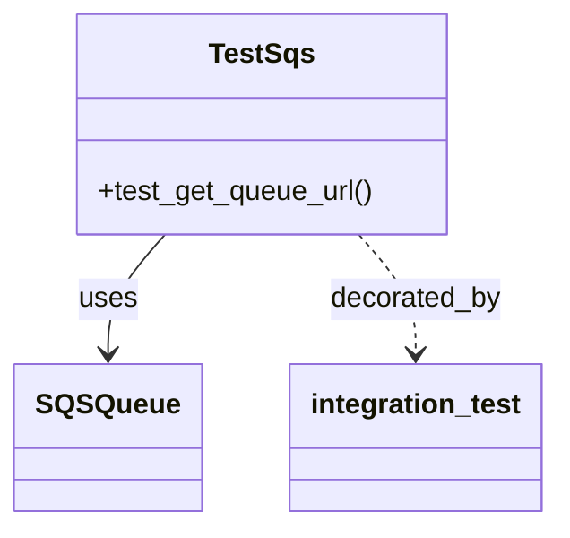

# Diagram: common/fv/python/tests/aws/test_sqs.py


> Auto-generated by Obscura crawlers

## Diagram 1



### SVG

<svg id="container" width="308.15625" xmlns="http://www.w3.org/2000/svg" class="classDiagram" height="300" viewBox="0 0 308.15625 300" role="graphics-document document" aria-roledescription="class"><style>#container{font-family:"trebuchet ms",verdana,arial,sans-serif;font-size:16px;fill:#333;}@keyframes edge-animation-frame{from{stroke-dashoffset:0;}}@keyframes dash{to{stroke-dashoffset:0;}}#container .edge-animation-slow{stroke-dasharray:9,5!important;stroke-dashoffset:900;animation:dash 50s linear infinite;stroke-linecap:round;}#container .edge-animation-fast{stroke-dasharray:9,5!important;stroke-dashoffset:900;animation:dash 20s linear infinite;stroke-linecap:round;}#container .error-icon{fill:#552222;}#container .error-text{fill:#552222;stroke:#552222;}#container .edge-thickness-normal{stroke-width:1px;}#container .edge-thickness-thick{stroke-width:3.5px;}#container .edge-pattern-solid{stroke-dasharray:0;}#container .edge-thickness-invisible{stroke-width:0;fill:none;}#container .edge-pattern-dashed{stroke-dasharray:3;}#container .edge-pattern-dotted{stroke-dasharray:2;}#container .marker{fill:#333333;stroke:#333333;}#container .marker.cross{stroke:#333333;}#container svg{font-family:"trebuchet ms",verdana,arial,sans-serif;font-size:16px;}#container p{margin:0;}#container g.classGroup text{fill:#9370DB;stroke:none;font-family:"trebuchet ms",verdana,arial,sans-serif;font-size:10px;}#container g.classGroup text .title{font-weight:bolder;}#container .nodeLabel,#container .edgeLabel{color:#131300;}#container .edgeLabel .label rect{fill:#ECECFF;}#container .label text{fill:#131300;}#container .labelBkg{background:#ECECFF;}#container .edgeLabel .label span{background:#ECECFF;}#container .classTitle{font-weight:bolder;}#container .node rect,#container .node circle,#container .node ellipse,#container .node polygon,#container .node path{fill:#ECECFF;stroke:#9370DB;stroke-width:1px;}#container .divider{stroke:#9370DB;stroke-width:1;}#container g.clickable{cursor:pointer;}#container g.classGroup rect{fill:#ECECFF;stroke:#9370DB;}#container g.classGroup line{stroke:#9370DB;stroke-width:1;}#container .classLabel .box{stroke:none;stroke-width:0;fill:#ECECFF;opacity:0.5;}#container .classLabel .label{fill:#9370DB;font-size:10px;}#container .relation{stroke:#333333;stroke-width:1;fill:none;}#container .dashed-line{stroke-dasharray:3;}#container .dotted-line{stroke-dasharray:1 2;}#container #compositionStart,#container .composition{fill:#333333!important;stroke:#333333!important;stroke-width:1;}#container #compositionEnd,#container .composition{fill:#333333!important;stroke:#333333!important;stroke-width:1;}#container #dependencyStart,#container .dependency{fill:#333333!important;stroke:#333333!important;stroke-width:1;}#container #dependencyStart,#container .dependency{fill:#333333!important;stroke:#333333!important;stroke-width:1;}#container #extensionStart,#container .extension{fill:transparent!important;stroke:#333333!important;stroke-width:1;}#container #extensionEnd,#container .extension{fill:transparent!important;stroke:#333333!important;stroke-width:1;}#container #aggregationStart,#container .aggregation{fill:transparent!important;stroke:#333333!important;stroke-width:1;}#container #aggregationEnd,#container .aggregation{fill:transparent!important;stroke:#333333!important;stroke-width:1;}#container #lollipopStart,#container .lollipop{fill:#ECECFF!important;stroke:#333333!important;stroke-width:1;}#container #lollipopEnd,#container .lollipop{fill:#ECECFF!important;stroke:#333333!important;stroke-width:1;}#container .edgeTerminals{font-size:11px;line-height:initial;}#container .classTitleText{text-anchor:middle;font-size:18px;fill:#333;}#container .label-icon{display:inline-block;height:1em;overflow:visible;vertical-align:-0.125em;}#container .node .label-icon path{fill:currentColor;stroke:revert;stroke-width:revert;}#container :root{--mermaid-font-family:"trebuchet ms",verdana,arial,sans-serif;}</style><g><defs><marker id="container_class-aggregationStart" class="marker aggregation class" refX="18" refY="7" markerWidth="190" markerHeight="240" orient="auto"><path d="M 18,7 L9,13 L1,7 L9,1 Z"></path></marker></defs><defs><marker id="container_class-aggregationEnd" class="marker aggregation class" refX="1" refY="7" markerWidth="20" markerHeight="28" orient="auto"><path d="M 18,7 L9,13 L1,7 L9,1 Z"></path></marker></defs><defs><marker id="container_class-extensionStart" class="marker extension class" refX="18" refY="7" markerWidth="190" markerHeight="240" orient="auto"><path d="M 1,7 L18,13 V 1 Z"></path></marker></defs><defs><marker id="container_class-extensionEnd" class="marker extension class" refX="1" refY="7" markerWidth="20" markerHeight="28" orient="auto"><path d="M 1,1 V 13 L18,7 Z"></path></marker></defs><defs><marker id="container_class-compositionStart" class="marker composition class" refX="18" refY="7" markerWidth="190" markerHeight="240" orient="auto"><path d="M 18,7 L9,13 L1,7 L9,1 Z"></path></marker></defs><defs><marker id="container_class-compositionEnd" class="marker composition class" refX="1" refY="7" markerWidth="20" markerHeight="28" orient="auto"><path d="M 18,7 L9,13 L1,7 L9,1 Z"></path></marker></defs><defs><marker id="container_class-dependencyStart" class="marker dependency class" refX="6" refY="7" markerWidth="190" markerHeight="240" orient="auto"><path d="M 5,7 L9,13 L1,7 L9,1 Z"></path></marker></defs><defs><marker id="container_class-dependencyEnd" class="marker dependency class" refX="13" refY="7" markerWidth="20" markerHeight="28" orient="auto"><path d="M 18,7 L9,13 L14,7 L9,1 Z"></path></marker></defs><defs><marker id="container_class-lollipopStart" class="marker lollipop class" refX="13" refY="7" markerWidth="190" markerHeight="240" orient="auto"><circle stroke="black" fill="transparent" cx="7" cy="7" r="6"></circle></marker></defs><defs><marker id="container_class-lollipopEnd" class="marker lollipop class" refX="1" refY="7" markerWidth="190" markerHeight="240" orient="auto"><circle stroke="black" fill="transparent" cx="7" cy="7" r="6"></circle></marker></defs><g class="root"><g class="clusters"></g><g class="edgePaths"><path d="M89.829,134L84.554,140.167C79.279,146.333,68.73,158.667,63.455,170C58.18,181.333,58.18,191.667,58.18,196.833L58.18,202" id="id_TestSqs_SQSQueue_1" class="edge-thickness-normal edge-pattern-solid relation" style=";;;" data-edge="true" data-et="edge" data-id="id_TestSqs_SQSQueue_1" data-points="W3sieCI6ODkuODI5MTQwNjI1MDAwMDEsInkiOjEzNH0seyJ4Ijo1OC4xNzk2ODc1LCJ5IjoxNzF9LHsieCI6NTguMTc5Njg3NSwieSI6MjA4fV0=" marker-end="url(#container_class-dependencyEnd)"></path><path d="M197.608,134L202.883,140.167C208.158,146.333,218.708,158.667,223.983,170C229.258,181.333,229.258,191.667,229.258,196.833L229.258,202" id="id_TestSqs_integration_test_2" class="edge-thickness-normal edge-pattern-dashed relation" style=";;;" data-edge="true" data-et="edge" data-id="id_TestSqs_integration_test_2" data-points="W3sieCI6MTk3LjYwODM1OTM3NSwieSI6MTM0fSx7IngiOjIyOS4yNTc4MTI1LCJ5IjoxNzF9LHsieCI6MjI5LjI1NzgxMjUsInkiOjIwOH1d" marker-end="url(#container_class-dependencyEnd)"></path></g><g class="edgeLabels"><g class="edgeLabel" transform="translate(58.1796875, 171)"><g class="label" data-id="id_TestSqs_SQSQueue_1" transform="translate(-16.4921875, -12)"><foreignObject width="32.984375" height="24"><div xmlns="http://www.w3.org/1999/xhtml" class="labelBkg" style="display: table-cell; white-space: nowrap; line-height: 1.5; max-width: 200px; text-align: center;"><span class="edgeLabel"><p>uses</p></span></div></foreignObject></g></g><g class="edgeLabel" transform="translate(229.2578125, 171)"><g class="label" data-id="id_TestSqs_integration_test_2" transform="translate(-49.375, -12)"><foreignObject width="98.75" height="24"><div xmlns="http://www.w3.org/1999/xhtml" class="labelBkg" style="display: table-cell; white-space: nowrap; line-height: 1.5; max-width: 200px; text-align: center;"><span class="edgeLabel"><p>decorated_by</p></span></div></foreignObject></g></g></g><g class="nodes"><g class="node default" id="classId-TestSqs-0" transform="translate(143.71875, 71)"><g class="basic label-container"><path d="M-105.39453125 -63 L105.39453125 -63 L105.39453125 63 L-105.39453125 63" stroke="none" stroke-width="0" fill="#ECECFF" style=""></path><path d="M-105.39453125 -63 C-45.566937335203804 -63, 14.260656579592393 -63, 105.39453125 -63 M-105.39453125 -63 C-24.325073149645263 -63, 56.744384950709474 -63, 105.39453125 -63 M105.39453125 -63 C105.39453125 -36.13251207173072, 105.39453125 -9.265024143461446, 105.39453125 63 M105.39453125 -63 C105.39453125 -24.80039331625646, 105.39453125 13.399213367487079, 105.39453125 63 M105.39453125 63 C51.670870193301596 63, -2.052790863396808 63, -105.39453125 63 M105.39453125 63 C61.556225157251944 63, 17.71791906450389 63, -105.39453125 63 M-105.39453125 63 C-105.39453125 33.24110510526005, -105.39453125 3.482210210520094, -105.39453125 -63 M-105.39453125 63 C-105.39453125 37.02245089144701, -105.39453125 11.044901782894009, -105.39453125 -63" stroke="#9370DB" stroke-width="1.3" fill="none" stroke-dasharray="0 0" style=""></path></g><g class="annotation-group text" transform="translate(0, -39)"></g><g class="label-group text" transform="translate(-28.4921875, -39)"><g class="label" style="font-weight: bolder" transform="translate(0,-12)"><foreignObject width="56.984375" height="24"><div xmlns="http://www.w3.org/1999/xhtml" style="display: table-cell; white-space: nowrap; line-height: 1.5; max-width: 105px; text-align: center;"><span class="nodeLabel markdown-node-label" style=""><p>TestSqs</p></span></div></foreignObject></g></g><g class="members-group text" transform="translate(-93.39453125, 9)"></g><g class="methods-group text" transform="translate(-93.39453125, 39)"><g class="label" style="" transform="translate(0,-12)"><foreignObject width="158.296875" height="24"><div xmlns="http://www.w3.org/1999/xhtml" style="display: table-cell; white-space: nowrap; line-height: 1.5; max-width: 216px; text-align: center;"><span class="nodeLabel markdown-node-label" style=""><p>+test_get_queue_url()</p></span></div></foreignObject></g></g><g class="divider" style=""><path d="M-105.39453125 -15 C-22.12844411212967 -15, 61.13764302574066 -15, 105.39453125 -15 M-105.39453125 -15 C-29.26365395663514 -15, 46.86722333672972 -15, 105.39453125 -15" stroke="#9370DB" stroke-width="1.3" fill="none" stroke-dasharray="0 0" style=""></path></g><g class="divider" style=""><path d="M-105.39453125 9 C-31.33630255604082 9, 42.72192613791836 9, 105.39453125 9 M-105.39453125 9 C-27.1283525744426 9, 51.1378261011148 9, 105.39453125 9" stroke="#9370DB" stroke-width="1.3" fill="none" stroke-dasharray="0 0" style=""></path></g></g><g class="node default" id="classId-SQSQueue-1" transform="translate(58.1796875, 250)"><g class="basic label-container"><path d="M-50.1796875 -42 L50.1796875 -42 L50.1796875 42 L-50.1796875 42" stroke="none" stroke-width="0" fill="#ECECFF" style=""></path><path d="M-50.1796875 -42 C-14.153401953748585 -42, 21.87288359250283 -42, 50.1796875 -42 M-50.1796875 -42 C-19.223737913103594 -42, 11.732211673792811 -42, 50.1796875 -42 M50.1796875 -42 C50.1796875 -13.097791217670604, 50.1796875 15.804417564658792, 50.1796875 42 M50.1796875 -42 C50.1796875 -19.437552855487247, 50.1796875 3.124894289025505, 50.1796875 42 M50.1796875 42 C19.157834382030888 42, -11.864018735938224 42, -50.1796875 42 M50.1796875 42 C24.92873078375289 42, -0.32222593249422005 42, -50.1796875 42 M-50.1796875 42 C-50.1796875 20.511124381234453, -50.1796875 -0.9777512375310948, -50.1796875 -42 M-50.1796875 42 C-50.1796875 16.364836651227463, -50.1796875 -9.270326697545073, -50.1796875 -42" stroke="#9370DB" stroke-width="1.3" fill="none" stroke-dasharray="0 0" style=""></path></g><g class="annotation-group text" transform="translate(0, -18)"></g><g class="label-group text" transform="translate(-38.1796875, -18)"><g class="label" style="font-weight: bolder" transform="translate(0,-12)"><foreignObject width="76.359375" height="24"><div xmlns="http://www.w3.org/1999/xhtml" style="display: table-cell; white-space: nowrap; line-height: 1.5; max-width: 126px; text-align: center;"><span class="nodeLabel markdown-node-label" style=""><p>SQSQueue</p></span></div></foreignObject></g></g><g class="members-group text" transform="translate(-38.1796875, 30)"></g><g class="methods-group text" transform="translate(-38.1796875, 60)"></g><g class="divider" style=""><path d="M-50.1796875 6 C-25.40049738133874 6, -0.6213072626774832 6, 50.1796875 6 M-50.1796875 6 C-19.60107993496051 6, 10.977527630078981 6, 50.1796875 6" stroke="#9370DB" stroke-width="1.3" fill="none" stroke-dasharray="0 0" style=""></path></g><g class="divider" style=""><path d="M-50.1796875 24 C-14.422328247606103 24, 21.335031004787794 24, 50.1796875 24 M-50.1796875 24 C-14.02952253775127 24, 22.12064242449746 24, 50.1796875 24" stroke="#9370DB" stroke-width="1.3" fill="none" stroke-dasharray="0 0" style=""></path></g></g><g class="node default" id="classId-integration_test-2" transform="translate(229.2578125, 250)"><g class="basic label-container"><path d="M-70.8984375 -42 L70.8984375 -42 L70.8984375 42 L-70.8984375 42" stroke="none" stroke-width="0" fill="#ECECFF" style=""></path><path d="M-70.8984375 -42 C-38.138896427493904 -42, -5.379355354987808 -42, 70.8984375 -42 M-70.8984375 -42 C-37.371390079109524 -42, -3.8443426582190483 -42, 70.8984375 -42 M70.8984375 -42 C70.8984375 -18.76966015103103, 70.8984375 4.460679697937941, 70.8984375 42 M70.8984375 -42 C70.8984375 -10.066148803417985, 70.8984375 21.86770239316403, 70.8984375 42 M70.8984375 42 C32.84565051671695 42, -5.207136466566098 42, -70.8984375 42 M70.8984375 42 C17.27391955548793 42, -36.35059838902414 42, -70.8984375 42 M-70.8984375 42 C-70.8984375 13.272939032972676, -70.8984375 -15.454121934054648, -70.8984375 -42 M-70.8984375 42 C-70.8984375 20.622759309478084, -70.8984375 -0.7544813810438313, -70.8984375 -42" stroke="#9370DB" stroke-width="1.3" fill="none" stroke-dasharray="0 0" style=""></path></g><g class="annotation-group text" transform="translate(0, -18)"></g><g class="label-group text" transform="translate(-58.8984375, -18)"><g class="label" style="font-weight: bolder" transform="translate(0,-12)"><foreignObject width="117.796875" height="24"><div xmlns="http://www.w3.org/1999/xhtml" style="display: table-cell; white-space: nowrap; line-height: 1.5; max-width: 166px; text-align: center;"><span class="nodeLabel markdown-node-label" style=""><p>integration_test</p></span></div></foreignObject></g></g><g class="members-group text" transform="translate(-58.8984375, 30)"></g><g class="methods-group text" transform="translate(-58.8984375, 60)"></g><g class="divider" style=""><path d="M-70.8984375 6 C-37.84302719222112 6, -4.787616884442244 6, 70.8984375 6 M-70.8984375 6 C-30.201719851326352 6, 10.494997797347295 6, 70.8984375 6" stroke="#9370DB" stroke-width="1.3" fill="none" stroke-dasharray="0 0" style=""></path></g><g class="divider" style=""><path d="M-70.8984375 24 C-18.31705615400771 24, 34.26432519198458 24, 70.8984375 24 M-70.8984375 24 C-33.03758878751949 24, 4.823259924961022 24, 70.8984375 24" stroke="#9370DB" stroke-width="1.3" fill="none" stroke-dasharray="0 0" style=""></path></g></g></g></g></g></svg>

## Diagram 2

```mermaid
flowchart TD
    A[Start test_get_queue_url] --> B[Instantiate SQSQueue(TEST_QUEUE_NAME)]
    B --> C[Call get_url()]
    C --> D{type(url) is str?}
    D -- yes --> E{url endswith f"{AWS_STAGE}-{TEST_QUEUE_NAME}"?}
    D -- no --> F[FAIL: type mismatch]
    E -- yes --> G[PASS]
    E -- no --> H[FAIL: unexpected URL]
```

> SVG rendering failed for this diagram.
